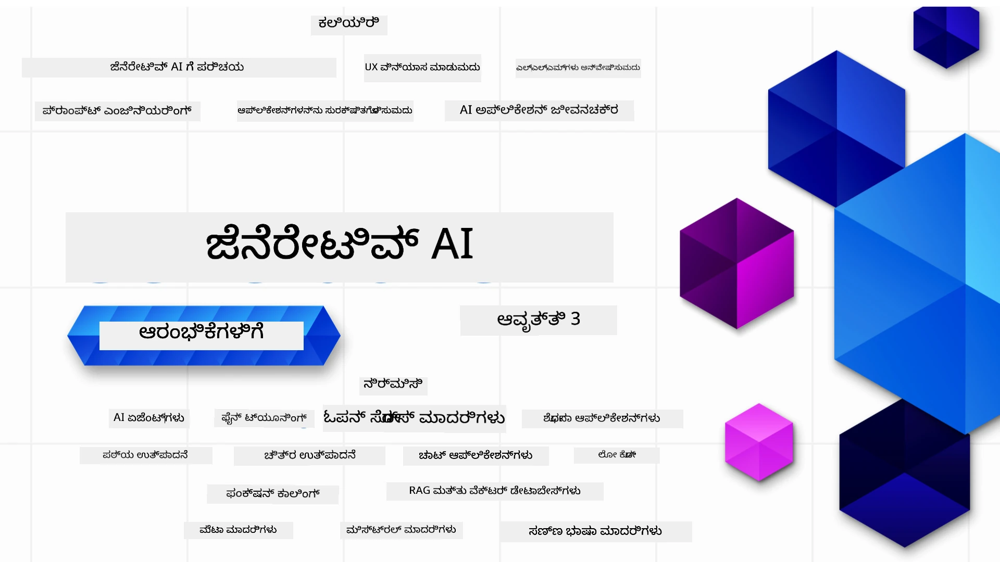

### ಜನರೇಟಿವ್ ಎಐ ಅಪ್ಲಿಕೇಶನುಗಳನ್ನು ನಿರ್ಮಿಸಲು ಆರಂಭಿಸಲು ನಿಮಗೆ ತಿಳಿಯಬೇಕಾದೆಲ್ಲವನ್ನೂ ಕಲಿಸುವ 21 ಪಾಠಗಳು

[](https://github.com/microsoft/Generative-AI-For-Beginners/blob/master/LICENSE?WT.mc_id=academic-105485-koreyst)
[](https://GitHub.com/microsoft/Generative-AI-For-Beginners/graphs/contributors/?WT.mc_id=academic-105485-koreyst)
[](https://GitHub.com/microsoft/Generative-AI-For-Beginners/issues/?WT.mc_id=academic-105485-koreyst)
[](https://GitHub.com/microsoft/Generative-AI-For-Beginners/pulls/?WT.mc_id=academic-105485-koreyst)
[](http://makeapullrequest.com?WT.mc_id=academic-105485-koreyst)

[](https://GitHub.com/microsoft/Generative-AI-For-Beginners/watchers/?WT.mc_id=academic-105485-koreyst)
[](https://GitHub.com/microsoft/Generative-AI-For-Beginners/network/?WT.mc_id=academic-105485-koreyst)
[](https://GitHub.com/microsoft/Generative-AI-For-Beginners/stargazers/?WT.mc_id=academic-105485-koreyst)

[](https://discord.gg/nTYy5BXMWG)

### 🌐 ಬಹುಭಾಷಾ ಬೆಂಬಲ

#### GitHub ಕ್ರಿಯೆಯನ್ನು ಬಳಸಿಕೊಂಡು ಬೆಂಬಲಿಸಲಾಗಿದೆ (ಸ್ವಯಂಚಾಲಿತ ಮತ್ತು ನೇಮಿತವಾಗಿ ನವೀನ)

<!-- CO-OP TRANSLATOR LANGUAGES TABLE START -->
[ಅರೇಬಿಕ್](../ar/README.md) | [ಬೆಂಗಾಳಿ](../bn/README.md) | [ಬಲ್ಗೇರಿಯನ್](../bg/README.md) | [ಬರ್ಮೀಸ್ (ಮಯನ್ಮಾರ್)](../my/README.md) | [ಚೀನೀಸ್ (ಸರಳ)](../zh-CN/README.md) | [ಚೀನೀಸ್ (ಪ್ರಚೀನ, ಹಾಂಗ್ ಕಾಂಗ್)](../zh-HK/README.md) | [ಚೀನೀಸ್ (ಪ್ರಚೀನ, ಮಕಾವ್)](../zh-MO/README.md) | [ಚೀನೀಸ್ (ಪ್ರಚೀನ, ತೈವಾನ್)](../zh-TW/README.md) | [ಕ್ರೊಯೇಷಿಯನ್](../hr/README.md) | [ಸೆಕ್](../cs/README.md) | [ಡೆನಿಷ್](../da/README.md) | [ಡಚ್](../nl/README.md) | [ಎಸ್ಟೋನಿಯನ್](../et/README.md) | [ಫಿನ್ನಿಶ್](../fi/README.md) | [ಫ್ರೆಂಚ್](../fr/README.md) | [ಜರ್ಮನ್](../de/README.md) | [ಗ್ರೀಕ್](../el/README.md) | [ಹೆಬ್ರ್ಯೂ](../he/README.md) | [ಹಿಂದಿ](../hi/README.md) | [ಹಂಗೇರಿ](../hu/README.md) | [ಇಂಡೋನೇಶಿಯನ್](../id/README.md) | [ಇಟಾಲಿಯನ್](../it/README.md) | [ಜಪಾನೀಸ್](../ja/README.md) | [ಕನ್ನಡ](./README.md) | [ಖ್ಮರ್](../km/README.md) | [ಕೋರಿಯನ್](../ko/README.md) | [ಲಿಥುವೇನಿಯನ್](../lt/README.md) | [ಮಲಯ್](../ms/README.md) | [ಮಲಯಾಳಂ](../ml/README.md) | [ಮರಾಠಿ](../mr/README.md) | [ನೆಪಾಳಿ](../ne/README.md) | [ನ್ಯೈಜೀರಿಯನ್ ಪಿಡ್ಜಿನ್](../pcm/README.md) | [ನಾರ್ವೇಜಿಯನ್](../no/README.md) | [ಪರ್ಶಿಯನ್ (ಫಾರ್ಸಿ)](../fa/README.md) | [ಪೋಲಿಶ್](../pl/README.md) | [ಪೋರ್ಚುಗೀಸ್ (ಬ್ರೆಜಿಲ್)](../pt-BR/README.md) | [ಪೋರ್ಚುಗೀಸ್ (ಪೋರ್ಚುಗಲ್)](../pt-PT/README.md) | [ಪಂಜಾಬಿ (ಗುರ್ಮುಖಿ)](../pa/README.md) | [ರೊಮೇನಿಯನ್](../ro/README.md) | [ರಷ್ಯನ್](../ru/README.md) | [ಸೆರ್ಬಿಯನ್ (ಸಿರಿಲಿಕ್)](../sr/README.md) | [ಸ್ಲೊವಾಕ್](../sk/README.md) | [ಸ್ಲೋವೇನಿಯನ್](../sl/README.md) | [ಸ್ಪ್ಯಾನಿಷ್](../es/README.md) | [ಸ್ವಾಹಿಲಿ](../sw/README.md) | [ಸ್ವೀಡಿಶ್](../sv/README.md) | [ಟಾಗಾಲೋಗ್ (ಫಿಲಿಪೀನ್)](../tl/README.md) | [ತಮಿಳು](../ta/README.md) | [ತೆಲುಗು](../te/README.md) | [ಥಾಯ್](../th/README.md) | [ಟರ್ಕಿಶ್](../tr/README.md) | [ಉಕ್ರೇನಿಯನ್](../uk/README.md) | [ಉರ್ದು](../ur/README.md) | [ವಿಯೆಟ್ನಾಮೀಸ್](../vi/README.md)

> **ಸ್ಥಾನಿಕವಾಗಿ ಕ್ಲೋನ್ ಮಾಡಿಕೊಳ್ಳಲು ಇಷ್ಟವೇ?**
>
> ಈ ಭಂಡಾರವು 50+ ಭಾಷೆಗಳ ಅನುವಾದಗಳನ್ನು ಹೊಂದಿದೆ, ಇದರಿಂದ ಡೌನ್‌ಲೋಡ್ ಗಾಳಿಗೆ ಬಹುಮಟ್ಟಿಗೆ ವಿಸ್ತಾರವಾಗುತ್ತದೆ. ಅನುವಾದಗಳಿಲ್ಲದೆ ಕ್ಲೋನ್ ಮಾಡಲು, ಸ್ಪಾರ್ಸ್ ಚೆಕೌಟ್ ಬಳಸಿ:
>
> **Bash / macOS / Linux:**
> ```bash
> git clone --filter=blob:none --sparse https://github.com/microsoft/generative-ai-for-beginners.git
> cd generative-ai-for-beginners
> git sparse-checkout set --no-cone '/*' '!translations' '!translated_images'
> ```
>
> **CMD (Windows):**
> ```cmd
> git clone --filter=blob:none --sparse https://github.com/microsoft/generative-ai-for-beginners.git
> cd generative-ai-for-beginners
> git sparse-checkout set --no-cone "/*" "!translations" "!translated_images"
> ```
>
> 
> ಇದು ನಿಮಗೆ ವೇಗವಾಗಿ ಡೌನ್‌ಲೋಡ್ ಆಗುವ ಮೂಲಕ ಕೋರ್ಸನ್ನು ಸಂಪೂರ್ಣವಾಗಿ ಮಾಡಲು ಎಲ್ಲವನ್ನೂ ನೀಡುತ್ತದೆ.
<!-- CO-OP TRANSLATOR LANGUAGES TABLE END -->

# ಶುರುವಾರಿಗಾಗಿ ಜನರೇಟಿವ್ ಎಐ (ಆವೃತ್ತಿ 3) - ಒಂದು ಕೋರ್ಸ್

Microsoft Cloud Advocates ನ 21 ಪಾಠಗಳ ಸಂಪೂರ್ಣ ಕೋರ್ಸಿನೊಂದಿಗೆ ಜನರೇಟಿವ್ ಎಐ ಅಪ್ಲಿಕೇಶನುಗಳನ್ನು ನಿರ್ಮಿಸುವ ಮೂಲಗಳುಗಳನ್ನು ಕಲಿಯಿರಿ.

## 🌱 ಪ್ರಾರಂಭಿಸೋಣ

ಈ ಕೋರ್ಸ್‌ಗೆ 21 ಪಾಠಗಳಿವೆ. ಪ್ರತಿ ಪಾಠವು ತನ್ನದೇ ವಿಷಯವನ್ನು ಹೊಂದಿದೆ ಆದ್ದರಿಂದ ನೀವು ಯಾವಡೆ ಇಚ್ಛಿಸಿದರೂ ಪ್ರಾರಂಭಿಸಿ!

ಪಾಠಗಳನ್ನು "ಕಲಿಯಿರಿ" ಎಂದು ಗುರುತಿಸಲಾಗಿದೆ, ಅದು ಜನರೇಟಿವ್ ಎಐ ಪರಿಕಲ್ಪನೆಯನ್ನು ವಿವರಿಸುವ ಪಾಠ ಅಥವಾ "ನಿರ್ಮಿಸಿ" ಎಂಬುದನ್ನು ವಿವರಿಸುವ ಪಾಠ ಮತ್ತು ನೀವು ಸಾಧ್ಯವಾದಲ್ಲಿ **Python** ಮತ್ತು **TypeScript** ಎರಡರಲ್ಲಿಯೂ ಕೊಂಡೆ ಉದಾಹರಣೆಗಳನ್ನು ನೀಡುತ್ತದೆ.

.NET ಡೆವಲಪರ್‌ಗಳಿಗೆ [Generative AI for Beginners (.NET Edition)](https://github.com/microsoft/Generative-AI-for-beginners-dotnet?WT.mc_id=academic-105485-koreyst) ಪರಿಶೀಲಿಸಿ!

ಪ್ರತಿ ಪಾಠದಲ್ಲೂ "Keep Learning" ವಿಭಾಗವೊಂದಿದೆ, ಅದು ಹೆಚ್ಚುವರಿ ಕಲಿಕೆಯ સાધನಗಳನ್ನು ಒಳಗೊಂಡಿದೆ.

## ನಿಮಗೆ ಏನು ಬೇಕು
### ಈ ಕೋರ್ಸ್‌ನ ಕೋಡ್ ಅನ್ನು چلಿಸುವಕ್ಕಾಗಿ, ನೀವು ಈಳಗೂಗಳನ್ನು ಬಳಸಬಹುದು:  
 - [Azure OpenAI Service](https://aka.ms/genai-beginners/azure-open-ai?WT.mc_id=academic-105485-koreyst) - **ಪಾಠಗಳು:** "aoai-assignment"
 - [GitHub Marketplace Model Catalog](https://aka.ms/genai-beginners/gh-models?WT.mc_id=academic-105485-koreyst) - **ಪಾಠಗಳು:** "githubmodels"
 - [OpenAI API](https://aka.ms/genai-beginners/open-ai?WT.mc_id=academic-105485-koreyst) - **ಪಾಠಗಳು:** "oai-assignment"
   
- ಪೈಥಾನ್ ಅಥವಾ ಟೈಪ್‌ಸ್ಕ್ರಿಪ್ಟ್ ಬಗ್ಗೆ ಮೂಲ ಜ್ಞಾನ ಉಪಯುಕ್ತವಾಗುತ್ತದೆ - \*ಸಂಪೂರ್ಣ ಪ್ರಾರಂಭಿಕರಿಗೆ ಈ [Python](https://aka.ms/genai-beginners/python?WT.mc_id=academic-105485-koreyst) ಮತ್ತು [TypeScript](https://aka.ms/genai-beginners/typescript?WT.mc_id=academic-105485-koreyst) ಕೋರ್ಸ್ಗಳನ್ನು ನೋಡಿ
- ನಿಮ್ಮ GitHub ಖಾತೆಗೆ ಈ [ಸಂಪೂರ್ಣ ರೆಪೊ ಫೋರ್ಕ್](https://aka.ms/genai-beginners/github?WT.mc_id=academic-105485-koreyst) ಮಾಡಲು GitHub ಖಾತೆ ಬೇಕು

ನೀವೆಲ್ಲಾ ಅಭಿವೃದ್ಧಿ ಪರಿಸರವನ್ನು ಸೆಟ್‍ಅಪ್ ಮಾಡಲು ನಾವು **[ಕೋರ್ಸ್ ಸೆಟ್ ಅಪ್](./00-course-setup/README.md?WT.mc_id=academic-105485-koreyst)** ಪಾಠವನ್ನು ರಚಿಸಲಾಗಿದೆ.

ನಂತರ ಸುಲಭವಾಗಿ ಕಂಡುಹಿಡಿಯಲು ಈ ರೆಪೋವನ್ನು [ಸ್ಟಾರ್ (🌟) ಮಾಡಿ](https://docs.github.com/en/get-started/exploring-projects-on-github/saving-repositories-with-stars?WT.mc_id=academic-105485-koreyst) ಮರೆತಿರಬೇಡಿ.

## 🧠 ನಿಯೋಜಿಸಲು ಸಿದ್ಧ?

ನೀವು ಹೆಚ್ಚು ಸುಧಾರಿತ ಕೋಡ್ ಉದಾಹರಣೆಗಳನ್ನು ಹುಡುಕುತ್ತಿದ್ದರೆ, ನಮ್ಮ [ಜನರೇಟಿವ್ ಎಐ ಕೋಡ್ ಉದಾಹರಣೆಗಳ ಸಂಗ್ರಹ](https://aka.ms/genai-beg-code?WT.mc_id=academic-105485-koreyst) ಅನ್ನು **Python** ಮತ್ತು **TypeScript** ಎರಡರಲ್ಲಿಯೂ ನೋಡಿ.

## 🗣️ ಇತರ ಕಲಿಯುವವರನ್ನು ಭೇಟಿ ಮಾಡಿ, ಬೆಂಬಲ ಪಡೆಯಿರಿ

ನಮ್ಮ [ಅಧಿಕೃತ Azure AI Foundry Discord ಸರ್ವರ್](https://aka.ms/genai-discord?WT.mc_id=academic-105485-koreyst) ಗೆ ಸೇರಿದ್ರೂ ಈ ಕೋರ್ಸ್ ತೆಗೆದುಕೊಳ್ಳುತ್ತಿರುವ ಇತರ ಕಲಿಯುವವರನ್ನು ಭೇಟಿ ಮಾಡಿ ಮತ್ತು ನೆಟ್ವರ್ಕ್ ಮಾಡಿ ಬೆಂಬಲ ಪಡೆಯಿರಿ.

GitHub ನಲ್ಲಿರುವ [Azure AI Foundry Developer Forum](https://aka.ms/azureaifoundry/forum) ನಲ್ಲಿ ನಿಮ್ಮ ಪ್ರಶ್ನೆಗಳನ್ನು ಕೇಳಿ ಅಥವಾ ಉತ್ಪನ್ನ ಪ್ರತಿಕ್ರಿಯೆಯನ್ನು ಹಂಚಿಕೊಳ್ಳಿ.

## 🚀 ಒಂದು ಸ್ಟಾರ್ಟಪ್ ಕಟ್ಟುತ್ತಿದ್ದೀರಾ?

Azure ಕ್ರೆಡಿಟ್‌ಗಳೊಂದಿಗೆ ಹೇಗೆ ತಕ್ಷಣ ಆರಂಭಿಸಬೇಕೆಂದು ತಿಳಿಯಲು [Microsoft for Startups](https://www.microsoft.com/startups) ಲ್ಲಿ ಭೇಟಿ ನೀಡಿ.

## 🙏 ಸಹಾಯ ಮಾಡಲು ಬಯಸುವಿರಾ?

ನಿಮಗೆ ಸಲಹೆಗಳು ಅಥವಾ ಶಬ್ದ ಅಥವಾ ಕೋಡ್ ದೋಷಗಳು ಕಂಡಿದ್ದರೆ? [ಸಮಸ್ಯೆಯನ್ನು ಪ್ರಸ್ತಾಪಿಸಿ](https://github.com/microsoft/generative-ai-for-beginners/issues?WT.mc_id=academic-105485-koreyst) ಅಥವಾ [ಪುಲ್ ರಿಕ್ವೆಸ್ಟ್ ರಚಿಸಿ](https://github.com/microsoft/generative-ai-for-beginners/pulls?WT.mc_id=academic-105485-koreyst)

## 📂 ಪ್ರತಿ ಪಾಠದಲ್ಲಿ ಸೇರಿವೆ:

- ವಿಷಯಕ್ಕೆ ಸಂಬಂಧಿಸಿದ ಚಿಕ್ಕ ವೀಡಿಯೊ ಪರಿಚಯ
- README ನಲ್ಲಿ ಲಿಖಿತ ಪಾಠ
- Azure OpenAI ಮತ್ತು OpenAI API ಅನ್ನು ಬೆಂಬಲಿಸುವ Python ಮತ್ತು TypeScript ಕೋಡ್ ಉದಾಹರಣೆಗಳು
- ನಿಮ್ಮ ಕಲಿಕೆಯನ್ನು ಮುಂದುವರಿಸಲು ಹೆಚ್ಚುವರಿ ಸಂಪನ್ಮೂಲಗಳ ಲಿಂಕುಗಳು

## 🗃️ ಪಾಠಗಳು

| #   | **ಪಾಠ ಲಿಂಕ್**                                                                                                                              | **ವಿವರಣೆ**                                                                                   | **ವೀಡಿಯೊ**                                                                 | **ಹೆಚ್ಚಿನ ಶಿಕ್ಷಣ**                                                           |
| --- | -------------------------------------------------------------------------------------------------------------------------------------------- | --------------------------------------------------------------------------------------------- | --------------------------------------------------------------------------- | ----------------------------------------------------------------------------- |
| 00  | [ಕೋರ್ಸ್ ಸೆಟ್ ಅಪ್](./00-course-setup/README.md?WT.mc_id=academic-105485-koreyst)                                                                 | **ಕಲಿಯಿರಿ:** ನಿಮ್ಮ ಅಭಿವೃದ್ಧಿ ಪರಿಸರವನ್ನು ಹೇಗೆ ಸಜ್ಜುಗೊಳಿಸುವುದು                               | ವೀಡಿಯೊ ಶೀಘ್ರದಲ್ಲಿದೆ                                                          | [ಹೆಚ್ಚು ತಿಳಿಯಿರಿ](https://aka.ms/genai-collection?WT.mc_id=academic-105485-koreyst) |
| 01  | [ಜನರೇಟಿವ್ ಎಐ ಮತ್ತು LLMs ಗೆ ಪರಿಚಯ](./01-introduction-to-genai/README.md?WT.mc_id=academic-105485-koreyst)                                  | **ಕಲಿಯಿರಿ:** ಜನರೇಟಿವ್ ಎಐ ಎಂದರೆ ಏನು ಮತ್ತು ದೊಡ್ಡ ಭಾಷಾ ಮಾದರಿಗಳು (LLMs) ಹೇಗೆ ಕಾರ್ಯನಿರ್ವಹಿಸುತ್ತವೆ ಎಂಬುದನ್ನು ಅರ್ಥಮಾಡಿಕೊಳ್ಳಿ. | [ವೀಡಿಯೊ](https://aka.ms/gen-ai-lesson-1-gh?WT.mc_id=academic-105485-koreyst) | [ಹೆಚ್ಚು ತಿಳಿಯಿರಿ](https://aka.ms/genai-collection?WT.mc_id=academic-105485-koreyst) |
| 02  | [ವಿಭಿನ್ನ LLM ಗಳ ಅನ್ವೇಷಣೆ ಮತ್ತು ಹೋಲಿಕೆ](./02-exploring-and-comparing-different-llms/README.md?WT.mc_id=academic-105485-koreyst)               | **ಕಲಿಯಿರಿ:** ನಿಮ್ಮ ಬಳಕೆ ಪ್ರಕರಣಕ್ಕಾಗಿ ಸರಿಯಾದ ಮಾದರಿಯನ್ನು ಹೇಗೆ ಆರಿಸುವುದು                          | [ವೀಡಿಯೊ](https://aka.ms/gen-ai-lesson2-gh?WT.mc_id=academic-105485-koreyst)  | [ಹೆಚ್ಚು ತಿಳಿಯಿರಿ](https://aka.ms/genai-collection?WT.mc_id=academic-105485-koreyst) |
| 03  | [ಜನರೇಟಿವ್ ಎಐವನ್ನು ಜವಾಬ್ದಾರಿಯಾಗಿ ಬಳಸಿ](./03-using-generative-ai-responsibly/README.md?WT.mc_id=academic-105485-koreyst)                     | **ಕಲಿಯಿರಿ:** ಜನರೇಟಿವ್ ಎಐ ಅಪ್ಲಿಕೇಶನುಗಳನ್ನು ಜವಾಬ್ದಾರಿಯಿಂದ ಹೇಗೆ ನಿರ್ಮಿಸುವುದು                 | [ವೀಡಿಯೊ](https://aka.ms/gen-ai-lesson3-gh?WT.mc_id=academic-105485-koreyst)  | [ಹೆಚ್ಚು ತಿಳಿಯಿರಿ](https://aka.ms/genai-collection?WT.mc_id=academic-105485-koreyst) |
| 04  | [ಪ್ರಾಂಪ್ಟ್ ಎಂಜಿನಿಯರಿಂಗ್ ಮೂಲತತ್ತ್ವಗಳನ್ನು ಅರ್ಥಮಾಡಿಕೊಳ್ಳುವುದು](./04-prompt-engineering-fundamentals/README.md?WT.mc_id=academic-105485-koreyst)             | **ಕಲಿತುಕೊಳ್ಳಿ:** ಪ್ರಾಯೋಗಿಕ ಪ್ರಾಂಪ್ಟ್ ಎಂಜಿನಿಯರಿಂಗ್ ಉತ್ತಮ ಅಭ್ಯಾಸಗಳು                                           | [ವಿಡಿಯೋ](https://aka.ms/gen-ai-lesson4-gh?WT.mc_id=academic-105485-koreyst)  | [ಇನ್ನಷ್ಟು ತಿಳಿದುಕೊಳ್ಳಿ](https://aka.ms/genai-collection?WT.mc_id=academic-105485-koreyst) |
| 05  | [ಅಗತ್ಯಪ್ರಾಥಮಿಕತೆಗಳೊಂದಿಗೆ ಪ್ರಾಂಪ್ಟ್ ರಚನೆ](./05-advanced-prompts/README.md?WT.mc_id=academic-105485-koreyst)                                                | **ಕಲಿತುಕೊಳ್ಳಿ:** ನೀವು ರಚಿಸುವ ಪ್ರಾಂಪ್ಟ್ ಗಾಗಿ ಪರಿಣಾಮಕಾರಿಯಾದ ಎಂಜಿನಿಯರಿಂಗ್ ತಂತ್ರಗಳನ್ನು ಹೇಗೆ ಅನ್ವಯಿಸಲು. | [ವಿಡಿಯೋ](https://aka.ms/gen-ai-lesson5-gh?WT.mc_id=academic-105485-koreyst)  | [ಇನ್ನಷ್ಟು ತಿಳಿದುಕೊಳ್ಳಿ](https://aka.ms/genai-collection?WT.mc_id=academic-105485-koreyst) |
| 06  | [ಪಠ್ಯ ಉತ್ಪಾದನಾ ಅಪ್ಲಿಕೇಶನ್‌ಗಳು ನಿರ್ಮಿಸುವುದು](./06-text-generation-apps/README.md?WT.mc_id=academic-105485-koreyst)                                | **ನಿರ್ಮಿಸಿ:** Azure OpenAI / OpenAI API ಉಪಯೋಗಿಸಿ ಪಠ್ಯ ಉತ್ಪಾದನೆ ಅಪ್ಲಿಕೇಶನ್                              | [ವಿಡಿಯೋ](https://aka.ms/gen-ai-lesson6-gh?WT.mc_id=academic-105485-koreyst)  | [ಇನ್ನಷ್ಟು ತಿಳಿದುಕೊಳ್ಳಿ](https://aka.ms/genai-collection?WT.mc_id=academic-105485-koreyst) |
| 07  | [ಚಾಟ್ ಅಪ್ಲಿಕೇಶನ್‌ಗಳು ನಿರ್ಮಿಸುವುದು](./07-building-chat-applications/README.md?WT.mc_id=academic-105485-koreyst)                                     | **ನಿರ್ಮಿಸಿ:** ಚಾಟ್ ಅಪ್ಲಿಕೇಶನ್‌ಗಳನ್ನು ಪರಿಣಾಮಕಾರಿಯಾಗಿ ನಿರ್ಮಿಸುವ ಮತ್ತು ಸಂಯೋಜಿಸುವ ತಂತ್ರಗಳು.               | [ವಿಡಿಯೋ](https://aka.ms/gen-ai-lessons7-gh?WT.mc_id=academic-105485-koreyst) | [ಇನ್ನಷ್ಟು ತಿಳಿದುಕೊಳ್ಳಿ](https://aka.ms/genai-collection?WT.mc_id=academic-105485-koreyst) |
| 08  | [ಶೋಧನೆ ಅಪ್ಲಿಕೇಶನ್ಗಳನ್ನು ನಿರ್ಮಿಸುವುದು ಮತ್ತು ವೆಕ್ಟರ್ ಡೇಟಾಬೇಸ್ಗಳು](./08-building-search-applications/README.md?WT.mc_id=academic-105485-koreyst)                        | **ನಿರ್ಮಿಸಿ:** ಡೇಟಾ ಶೋಧನೆಗೆ ಏಂಬೆಡ್ಡಿಂಗ್‌ಗಳನ್ನು ಉಪಯೋಗಿಸುವ ಶೋಧನೆ ಅಪ್ಲಿಕೇಶನ್                            | [ವಿಡಿಯೋ](https://aka.ms/gen-ai-lesson8-gh?WT.mc_id=academic-105485-koreyst)  | [ಇನ್ನಷ್ಟು ತಿಳಿದುಕೊಳ್ಳಿ](https://aka.ms/genai-collection?WT.mc_id=academic-105485-koreyst) |
| 09  | [ಚಿತ್ರ ಉತ್ಪಾದನಾ ಅಪ್ಲಿಕೇಶನ್‌ಗಳು ನಿರ್ಮಿಸುವುದು](./09-building-image-applications/README.md?WT.mc_id=academic-105485-koreyst)                        | **ನಿರ್ಮಿಸಿ:** ಚಿತ್ರ ಉತ್ಪಾದನಾ ಅಪ್ಲಿಕೇಶನ್                                                               | [ವಿಡಿಯೋ](https://aka.ms/gen-ai-lesson9-gh?WT.mc_id=academic-105485-koreyst)  | [ಇನ್ನಷ್ಟು ತಿಳಿದುಕೊಳ್ಳಿ](https://aka.ms/genai-collection?WT.mc_id=academic-105485-koreyst) |
| 10  | [ಕಡಿಮೆ ಕೋಡ್ AI ಅಪ್ಲಿಕೇಶನ್‌ಗಳು ನಿರ್ಮಿಸುವುದು](./10-building-low-code-ai-applications/README.md?WT.mc_id=academic-105485-koreyst)                       | **ನಿರ್ಮಿಸಿ:** ಕಡಿಮೆ ಕೋಡ್ ಉಪಕರಣಗಳನ್ನು ಬಳಸಿ ಜನರೇಟಿವ್ AI ಅಪ್ಲಿಕೇಶನ್                                    | [ವಿಡಿಯೋ](https://aka.ms/gen-ai-lesson10-gh?WT.mc_id=academic-105485-koreyst) | [ಇನ್ನಷ್ಟು ತಿಳಿದುಕೊಳ್ಳಿ](https://aka.ms/genai-collection?WT.mc_id=academic-105485-koreyst) |
| 11  | [ಕಾರ್ಯಸೂಚಿಗೆ ಕರೆ ಮಾಡಲು ಬಾಹ್ಯ ಅಪ್ಲಿಕೇಶನ್‌ಗಳನ್ನು ಸಂಯೋಜಿಸುವುದು](./11-integrating-with-function-calling/README.md?WT.mc_id=academic-105485-koreyst) | **ನಿರ್ಮಿಸಿ:** ಕಾರ್ಯಸೂಚಿಗೆ ಕರೆ ಎಂದರೇನು ಮತ್ತು ಅಪ್ಲಿಕೇಶನ್‌ಗಳಲ್ಲಿ ಅದರ ಉಪಯೋಗಗಳು                          | [ವಿಡಿಯೋ](https://aka.ms/gen-ai-lesson11-gh?WT.mc_id=academic-105485-koreyst) | [ಇನ್ನಷ್ಟು ತಿಳಿದುಕೊಳ್ಳಿ](https://aka.ms/genai-collection?WT.mc_id=academic-105485-koreyst) |
| 12  | [AI ಅಪ್ಲಿಕೇಶನ್‌ಗಳಿಗೆ UX ವಿನ್ಯಾಸ ಮಾಡುವುದು](./12-designing-ux-for-ai-applications/README.md?WT.mc_id=academic-105485-koreyst)                         | **ಕಲಿತುಕೊಳ್ಳಿ:** ಜನರೇಟಿವ್ AI ಅಪ್ಲಿಕೇಶನ್ಗಳನ್ನು ಅಭಿವೃದ್ಧಿಪಡಿಸುವಾಗ ಯುಎಕ್ಸ್ ವಿನ್ಯಾಸ ತತ್ತ್ವಗಳನ್ನು ಹೇಗೆ ಅನ್ವಯಿಸುವುದು | [ವಿಡಿಯೋ](https://aka.ms/gen-ai-lesson12-gh?WT.mc_id=academic-105485-koreyst) | [ಇನ್ನಷ್ಟು ತಿಳಿದುಕொள்ளಿ](https://aka.ms/genai-collection?WT.mc_id=academic-105485-koreyst) |
| 13  | [ನಿಮ್ಮ ಜನರೇಟಿವ್ AI ಅಪ್ಲಿಕೇಶನ್ಗಳನ್ನು ಸುರಕ್ಷಿತಗೊಳಿಸುವುದು](./13-securing-ai-applications/README.md?WT.mc_id=academic-105485-koreyst)                         | **ಕಲಿತುಕೊಳ್ಳಿ:** AI ವ್ಯವಸ್ಥೆಗಳ ಮೇಲಿರುವ ಬೆದರಿಕೆಗಳು ಮತ್ತು ಅಪಾಯಗಳು ಮತ್ತು ಈ ವ್ಯವಸ್ಥೆಗಳನ್ನು ಸುರಕ್ಷಿತಗೊಳಿಸುವ ವಿಧಾನಗಳು.             | [ವಿಡಿಯೋ](https://aka.ms/gen-ai-lesson13-gh?WT.mc_id=academic-105485-koreyst) | [ಇನ್ನಷ್ಟು ತಿಳಿದುಕೊಳ್ಳಿ](https://aka.ms/genai-collection?WT.mc_id=academic-105485-koreyst) |
| 14  | [ಜನರೇಟಿವ್ AI ಅಪ್ಲಿಕೇಶನ್ ಜೀವನಚಕ್ರ](./14-the-generative-ai-application-lifecycle/README.md?WT.mc_id=academic-105485-koreyst)           | **ಕಲಿತುಕೊಳ್ಳಿ:** LLM ಜೀವನಚಕ್ರ ಮತ್ತು LLMOps ನಿರ್ವಹಿಸಲು ಉಪಕರಣಗಳು ಮತ್ತು ಮೆಟ್ರಿಕ್‌ಗಳು                         | [ವಿಡಿಯೋ](https://aka.ms/gen-ai-lesson14-gh?WT.mc_id=academic-105485-koreyst) | [ಇನ್ನಷ್ಟು ತಿಳಿದುಕೊಳ್ಳಿ](https://aka.ms/genai-collection?WT.mc_id=academic-105485-koreyst) |
| 15  | [ರಿಟ್ರೀವಲ್ ಅಗ್ಮೆಂಟೆಡ್ ಜನರೇಶನ್ (RAG) ಮತ್ತು ವೆಕ್ಟರ್ ಡೇಟಾಬೇಸ್‌ಗಳು](./15-rag-and-vector-databases/README.md?WT.mc_id=academic-105485-koreyst)        | **ನಿರ್ಮಿಸಿ:** வெಕ್ಟರ್ ಡೇಟாபೇಸ್‌ಗಳಿಂದ ಏಂಬೆಡ್ಡಿಂಗ್‌ಗಳನ್ನು ಪಡೆಯಲು RAG ಫ್ರೇಮ್‌ವರ್ಕ್ ಬಳಸುವ ಅಪ್ಲಿಕೇಶನ್  | [ವಿಡಿಯೋ](https://aka.ms/gen-ai-lesson15-gh?WT.mc_id=academic-105485-koreyst) | [ಇನ್ನಷ್ಟು ತಿಳಿದುಕೊಳ್ಳಿ](https://aka.ms/genai-collection?WT.mc_id=academic-105485-koreyst) |
| 16  | [ಒಪನ್ ಸೋರ್ಸ್ ಮಾದರಿಗಳು ಮತ್ತು Hugging Face](./16-open-source-models/README.md?WT.mc_id=academic-105485-koreyst)                                    | **ನಿರ್ಮಿಸಿ:** Hugging Face ನಲ್ಲಿ ಲಭ್ಯವಾಗಿರುವ ಓಪನ್ ಸೋರ್ಸ್ ಮಾದರಿಗಳನ್ನು ಬಳಸುವ ಅಪ್ಲಿಕೇಶನ್                    | [ವಿಡಿಯೋ](https://aka.ms/gen-ai-lesson16-gh?WT.mc_id=academic-105485-koreyst) | [ಇನ್ನಷ್ಟು ತಿಳಿದುಕೊಳ್ಳಿ](https://aka.ms/genai-collection?WT.mc_id=academic-105485-koreyst) |
| 17  | [AI ಏಜೆಂಟ್ಸ್](./17-ai-agents/README.md?WT.mc_id=academic-105485-koreyst)                                                                       | **ನಿರ್ಮಿಸಿ:** AI ಏಜೆಂಟ್ ಫ್ರೇಮ್‌ವರ್ಕ್ ಬಳಸುವ ಅಪ್ಲಿಕೇಶನ್                                           | [ವಿಡಿಯೋ](https://aka.ms/gen-ai-lesson17-gh?WT.mc_id=academic-105485-koreyst) | [ಇನ್ನಷ್ಟು ತಿಳಿದುಕೊಳ್ಳಿ](https://aka.ms/genai-collection?WT.mc_id=academic-105485-koreyst) |
| 18  | [LLMಗಳನ್ನು ಸೂಕ್ಷ್ಮ ಟ್ಯೂನಿಂಗ್ ಮಾಡುವುದು](./18-fine-tuning/README.md?WT.mc_id=academic-105485-koreyst)                                                              | **ಕಲಿತುಕೊಳ್ಳಿ:** LLM ಗಳು ಸೂಕ್ಷ್ಮ ಟ್ಯೂನಿಂಗ್ ಮಾಡುವುದರ ಏನು, ಯಾಕೆ ಮತ್ತು ಹೇಗೆ                                            | [ವಿಡಿಯೋ](https://aka.ms/gen-ai-lesson18-gh?WT.mc_id=academic-105485-koreyst) | [ಇನ್ನಷ್ಟು ತಿಳಿದುಕೊಳ್ಳಿ](https://aka.ms/genai-collection?WT.mc_id=academic-105485-koreyst) |
| 19  | [SLM ಗಳೊಂದಿಗೆ ನಿರ್ಮಾಣ ಮಾಡುವುದು](./19-slm/README.md?WT.mc_id=academic-105485-koreyst)                                                              | **ಕಲಿತುಕೊಳ್ಳಿ:** ಸಣ್ಣ ಭಾಷಾ ಮಾದರಿಗಳೊಂದಿಗೆ ನಿರ್ಮಾಣ ಮಾಡುವ ಲಾಭಗಳು                                            | ವಿಡಿಯೋ ಬರುವ ಮಧ್ಯೆ | [ಇನ್ನಷ್ಟು ತಿಳಿದುಕೊಳ್ಳಿ](https://aka.ms/genai-collection?WT.mc_id=academic-105485-koreyst) |
| 20  | [ಮಿಸ್ಟ್ರಲ್ ಮಾದರಿಗಳೊಂದಿಗೆ ನಿರ್ಮಾಣ ಮಾಡುವುದು](./20-mistral/README.md?WT.mc_id=academic-105485-koreyst)                                                              | **ಕಲಿತುಕೊಳ್ಳಿ:** ಮಿಸ್ಟ್ರಲ್ ಕುಟುಂಬದ ಮಾದರಿಗಳ ವೈಶಿಷ್ಟ್ಯಗಳು ಮತ್ತು ಭೇದಗಳು                                           | ವಿಡಿಯೋ ಬರುವ ಮಧ್ಯೆ | [ಇನ್ನಷ್ಟು ತಿಳಿದುಕೊಳ್ಳಿ](https://aka.ms/genai-collection?WT.mc_id=academic-105485-koreyst) |
| 21  | [ಮೆಟಾ ಮಾದರಿಗಳೊಂದಿಗೆ ನಿರ್ಮಾಣ ಮಾಡುವುದು](./21-meta/README.md?WT.mc_id=academic-105485-koreyst)                                                              | **ಕಲಿತುಕೊಳ್ಳಿ:** ಮೆಟಾ ಕುಟುಂಬದ ಮಾದರಿಗಳ ವೈಶಿಷ್ಟ್ಯಗಳು ಮತ್ತು ಭೇದಗಳು                                           | ವಿಡಿಯೋ ಬರುವ ಮಧ್ಯೆ | [ಇನ್ನಷ್ಟು ತಿಳಿದುಕೊಳ್ಳಿ](https://aka.ms/genai-collection?WT.mc_id=academic-105485-koreyst) |

### 🌟 ವಿಶೇಷ ಧನ್ಯವಾದಗಳು

GitHub ಆಕ್ಷನ್‌ಗಳು ಮತ್ತು ವರ್ಕ್‌ಫ್ಲೋಗಳನ್ನು ಸೃಷ್ಟಿಸಿದ [**ಜಾನ್ ಅಝೀಜ್**](https://www.linkedin.com/in/john0isaac/) ಅವರಿಗೆ ವಿಶೇಷ ಧನ್ಯವಾದಗಳು

ಪ್ರತಿ ಪಾಠದಲ್ಲಿ ಕಲಿಕೆಯ ಮತ್ತು ಕೋಡ್ ಅನುಭವವನ್ನು ಸುಧಾರಿಸಲು ಮುಖ್ಯ ಕೊಡುಗೆಗಳನ್ನು ನೀಡಿದ [**ಬೆರ್ನ್ಹಾರ್ಡ್ ಮರ್ಕಲ್**](https://www.linkedin.com/in/bernhard-merkle-738b73/) ಅವರಿಗೆ ಧನ್ಯವಾದಗಳು.

## 🎒 ಇತರ ಕೋರ್ಸುಗಳು

ನಮ್ಮ ತಂಡ ಇತರ ಕೋರ್ಸುಗಳನ್ನು ಉತ್ಪಾದಿಸುತ್ತದೆ! ಪರಿಶೀಲಿಸಿ:

<!-- CO-OP TRANSLATOR OTHER COURSES START -->
### ಲಾಂಗ್‌ಚೈನ್
[](https://aka.ms/langchain4j-for-beginners)
[](https://aka.ms/langchainjs-for-beginners?WT.mc_id=m365-94501-dwahlin)
[](https://github.com/microsoft/langchain-for-beginners?WT.mc_id=m365-94501-dwahlin)
---

### ಅಜೂರ್ / ಎಡ್ಜ್ / MCP / ಏಜೆಂಟ್ಸ್
[](https://github.com/microsoft/AZD-for-beginners?WT.mc_id=academic-105485-koreyst)
[](https://github.com/microsoft/edgeai-for-beginners?WT.mc_id=academic-105485-koreyst)
[](https://github.com/microsoft/mcp-for-beginners?WT.mc_id=academic-105485-koreyst)
[](https://github.com/microsoft/ai-agents-for-beginners?WT.mc_id=academic-105485-koreyst)

---
 
### ಜನರೇಟಿವ್ AI ಸರಣಿ
[](https://github.com/microsoft/generative-ai-for-beginners?WT.mc_id=academic-105485-koreyst)
[-9333EA?style=for-the-badge&labelColor=E5E7EB&color=9333EA)](https://github.com/microsoft/Generative-AI-for-beginners-dotnet?WT.mc_id=academic-105485-koreyst)
[-C084FC?style=for-the-badge&labelColor=E5E7EB&color=C084FC)](https://github.com/microsoft/generative-ai-for-beginners-java?WT.mc_id=academic-105485-koreyst)
[-E879F9?style=for-the-badge&labelColor=E5E7EB&color=E879F9)](https://github.com/microsoft/generative-ai-with-javascript?WT.mc_id=academic-105485-koreyst)

---
 
### ಮೂಲ ಅಧ್ಯಯನ
[](https://aka.ms/ml-beginners?WT.mc_id=academic-105485-koreyst)
[](https://aka.ms/datascience-beginners?WT.mc_id=academic-105485-koreyst)
[](https://aka.ms/ai-beginners?WT.mc_id=academic-105485-koreyst)
[](https://github.com/microsoft/Security-101?WT.mc_id=academic-96948-sayoung)
[](https://aka.ms/webdev-beginners?WT.mc_id=academic-105485-koreyst)
[](https://aka.ms/iot-beginners?WT.mc_id=academic-105485-koreyst)
[](https://github.com/microsoft/xr-development-for-beginners?WT.mc_id=academic-105485-koreyst)

---
 
### ಕೊಪೈಲಟ್ ಸರಣಿ
[](https://aka.ms/GitHubCopilotAI?WT.mc_id=academic-105485-koreyst)
[](https://github.com/microsoft/mastering-github-copilot-for-dotnet-csharp-developers?WT.mc_id=academic-105485-koreyst)
[](https://github.com/microsoft/CopilotAdventures?WT.mc_id=academic-105485-koreyst)
<!-- CO-OP TRANSLATOR OTHER COURSES END -->

## ಸಹಾಯ ಪಡೆಯುವುದು

ನೀವು ಅಡಚಣೆಯಾಗಿ ತುತ್ತಾಗಿದ್ದರೆ ಅಥವಾ AI ಆಪ್‌ಗಳನ್ನು ನಿರ್ಮಿಸುವ ಬಗ್ಗೆ ಯಾವುದೇ ಪ್ರಶ್ನೆಗಳಿದ್ದರೆ. MCP ಬಗ್ಗೆ ಚರ್ಚೆಗಳಲ್ಲಿ ಸಹಪಾಠಿಗಳು ಮತ್ತು ಅನುಭವಸಂಪನ್ನ ಡೆವಲಪರ್‌ಗಳೊಂದಿಗೆ ಸೇರಿ. ಈವು ಪ್ರಶ್ನೆಗಳಿಗಾಗಿಯೂ ಭಾರತಿಯ ಸಮುದಾಯ ಮತ್ತು ಜ್ಞಾನ ಮುಕ್ತವಾಗಿ ಹಂಚಿಕೊಳ್ಳುವ ಒಂದು ಸಹಾಯಕ ಸಮುದಾಯವಾಗಿದೆ.

[](https://discord.gg/nTYy5BXMWG)

ನೀವು ಉತ್ಪನ್ನ ಅಭಿಪ್ರಾಯ ಅಥವಾ ದೋಷಗಳನ್ನು ಹೊಂದಿದ್ದರೆ, ನಿರ್ಮಾಣದ ಸಮಯದಲ್ಲಿ ಭೇಟಿ ನೀಡಿ:

[](https://aka.ms/foundry/forum)

---

<!-- CO-OP TRANSLATOR DISCLAIMER START -->
**ನಿರಾಕರಣೆ**:
ಈ ದಾಖಲೆ AI ಅನುವಾದ ಸೇವೆ [Co-op Translator](https://github.com/Azure/co-op-translator) ಬಳಸಿ ಅನುವಾದಿಸಲಾಗಿದೆ. ನಾವು ನಿಖರತೆಯಿಗಾಗಿ ಪ್ರಯತ್ನಿಸುವುದಾದರೂ, ಸ್ವಯಂಚಾಲಿತ ಅನುವಾದಗಳಲ್ಲಿ ತಪ್ಪುಗಳು ಅಥವಾ ಅಸತ್ಯತೆಗಳು ಇರಬಹುದಾಗಿ ದಯವಿಟ್ಟು ಗಮನಿಸಿ. ಮೂಲ ಭಾಷೆಯಲ್ಲಿನ ಮೂಲ ದಾಖಲೆ ಪ್ರಾಧಾನ್ಯಕಾರಿ ಮೂಲವಾಗಿ ಪರಿಗಣಿಸಬೇಕು. ಪ್ರಮುಖ ಮಾಹಿತಿಗೆ, ವೃತ್ತಿಪರ ಮಾನವ ಅನುವಾದವನ್ನು ಶಿಫಾರಸು ಮಾಡಲಾಗುತ್ತದೆ. ಈ ಅನುವಾದದ ಬಳಕೆಯಿಂದ ಹುಟ್ಟಿಕೊಳ್ಳುವ ಯಾವುದೇ ಅರ್ಥಮಾಡಿಕೊಳ್ಳದಿಕೆಗಳು ಅಥವಾ ತಪ್ಪುಸಮಜುತೆಗಳಿಗೆ ನಾವು ಹೊಣೆಗಾರರಾಗುವುದಿಲ್ಲ.
<!-- CO-OP TRANSLATOR DISCLAIMER END -->