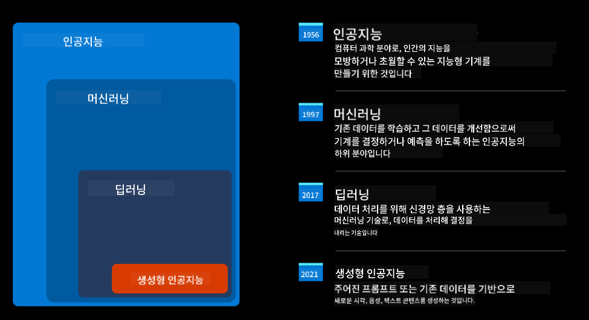
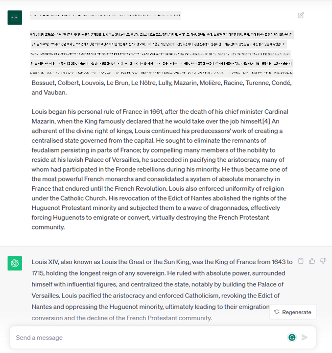
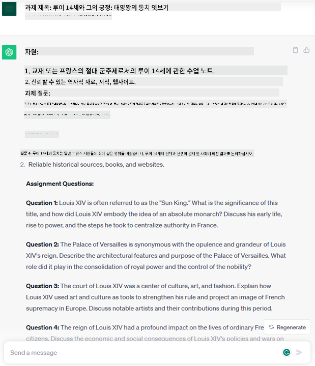
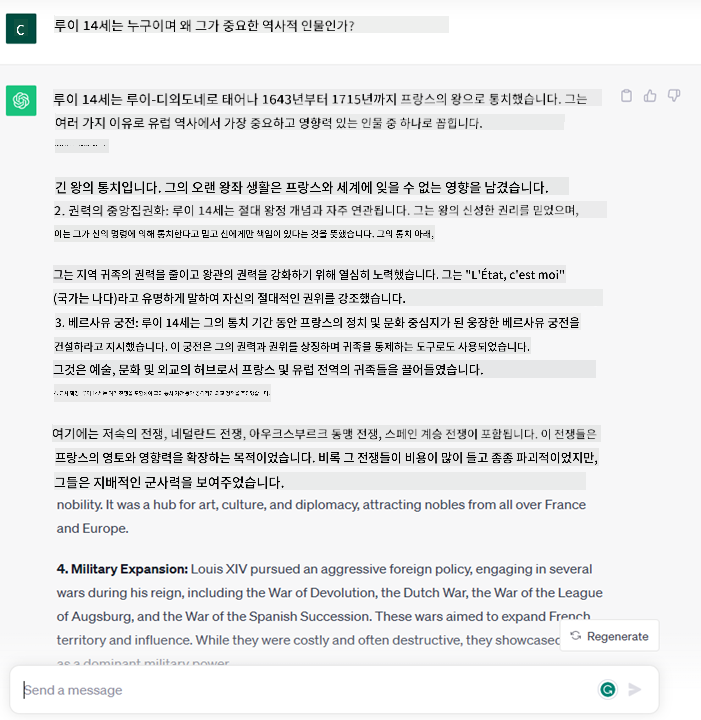
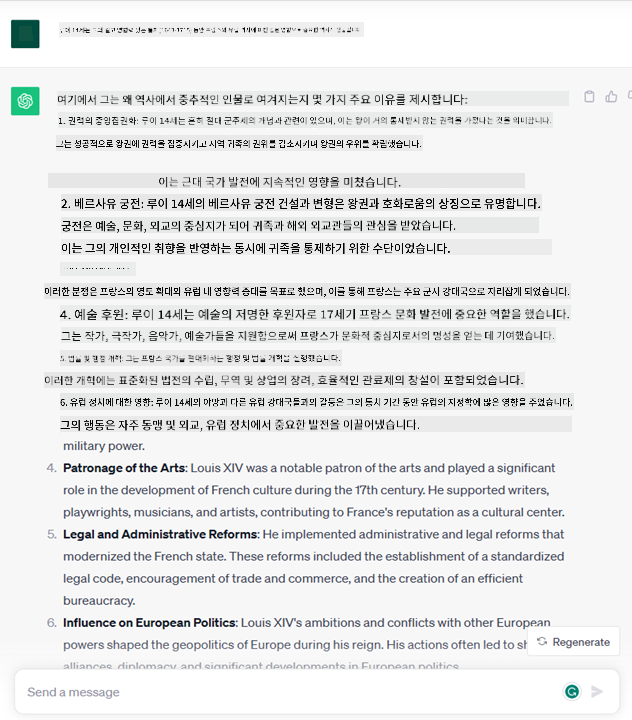

<!--
CO_OP_TRANSLATOR_METADATA:
{
  "original_hash": "f53ba0fa49164f9323043f1c6b11f2b1",
  "translation_date": "2025-05-19T09:09:54+00:00",
  "source_file": "01-introduction-to-genai/README.md",
  "language_code": "ko"
}
-->
# 생성 AI와 대규모 언어 모델 소개

_(위 이미지를 클릭하면 이 강의의 비디오를 볼 수 있습니다)_

생성 AI는 텍스트, 이미지 및 기타 유형의 콘텐츠를 생성할 수 있는 인공지능입니다. 이 기술의 놀라운 점은 AI를 민주화한다는 것입니다. 누구나 자연어로 작성된 문장 같은 텍스트 프롬프트만으로 사용할 수 있습니다. Java나 SQL 같은 언어를 배울 필요 없이, 원하는 것을 말하면 AI 모델이 제안을 제공합니다. 이로 인해 보고서를 작성하거나 이해하고, 애플리케이션을 작성하는 등의 작업을 몇 초 만에 수행할 수 있습니다.

이 교육 과정에서는 우리의 스타트업이 교육 분야에서 생성 AI를 활용하여 새로운 시나리오를 어떻게 열어가는지, 그리고 그 적용에 따른 사회적 영향과 기술적 한계를 어떻게 해결하는지를 탐구할 것입니다.

## 소개

이 강의에서는 다음 내용을 다룹니다:

- 비즈니스 시나리오 소개: 우리 스타트업 아이디어와 미션.
- 생성 AI와 현재의 기술 환경에 도달한 과정.
- 대규모 언어 모델의 내부 작동 방식.
- 대규모 언어 모델의 주요 기능과 실용적인 사용 사례.

## 학습 목표

이 강의를 완료하면 다음을 이해할 수 있습니다:

- 생성 AI가 무엇인지와 대규모 언어 모델이 어떻게 작동하는지.
- 교육 시나리오에 초점을 맞춰 대규모 언어 모델을 다양한 사용 사례에 어떻게 활용할 수 있는지.

## 시나리오: 우리의 교육 스타트업

생성 인공지능(AI)은 AI 기술의 정점으로, 한때 불가능하다고 여겨졌던 것의 경계를 넓히고 있습니다. 생성 AI 모델은 여러 가지 기능과 응용 프로그램을 가지고 있지만, 이 교육 과정에서는 가상의 스타트업을 통해 교육을 혁신하는 방법을 탐구할 것입니다. 이 스타트업을 _우리의 스타트업_이라고 부르겠습니다. 우리의 스타트업은 교육 분야에서 다음과 같은 야심찬 미션을 가지고 활동합니다:

> _글로벌 차원에서 학습 접근성을 개선하고, 교육의 공평한 접근을 보장하며, 학습자의 필요에 따라 개인화된 학습 경험을 제공한다._

우리의 스타트업 팀은 현대의 가장 강력한 도구 중 하나인 대규모 언어 모델(LLM)을 활용하지 않고서는 이 목표를 달성할 수 없다는 것을 알고 있습니다.

생성 AI는 오늘날 우리가 배우고 가르치는 방식을 혁신할 것으로 기대됩니다. 학생들은 24시간 가상 교사를 통해 방대한 양의 정보와 예제를 제공받을 수 있으며, 교사들은 학생을 평가하고 피드백을 제공하는 혁신적인 도구를 활용할 수 있습니다.

시작하기에 앞서, 교육 과정 내내 사용할 몇 가지 기본 개념과 용어를 정의해 보겠습니다.

## 생성 AI는 어떻게 등장했을까?

최근 생성 AI 모델 발표로 인해 놀라운 _열풍_이 일어났지만, 이 기술은 수십 년에 걸쳐 개발된 것입니다. 첫 번째 연구 노력은 60년대까지 거슬러 올라갑니다. 현재 우리는 대화와 같은 인간의 인지 능력을 가진 AI를 가지고 있는 시점에 도달했습니다. 예를 들어 [OpenAI ChatGPT](https://openai.com/chatgpt) 또는 [Bing Chat](https://www.microsoft.com/edge/features/bing-chat?WT.mc_id=academic-105485-koreyst)과 같은 예시가 있으며, 이는 웹 검색 Bing 대화에 GPT 모델을 사용합니다.

조금 뒤로 돌아가 보면, AI의 첫 번째 프로토타입은 타자기로 작성된 챗봇으로, 전문가 그룹에서 추출한 지식 기반을 컴퓨터에 표현한 것이었습니다. 지식 기반의 답변은 입력 텍스트에 나타나는 키워드에 의해 트리거되었습니다. 그러나 이러한 접근 방식, 즉 타자기로 작성된 챗봇을 사용하는 방식은 확장성이 좋지 않다는 것이 곧 명백해졌습니다.

### AI에 대한 통계적 접근: 머신 러닝

90년대에는 텍스트 분석에 대한 통계적 접근 방식이 적용되면서 전환점이 도래했습니다. 이는 명시적으로 프로그래밍되지 않고 데이터를 통해 패턴을 학습할 수 있는 새로운 알고리즘, 즉 머신 러닝의 개발로 이어졌습니다. 이 접근 방식은 기계가 인간의 언어 이해를 시뮬레이션할 수 있게 합니다: 통계 모델은 텍스트-레이블 쌍에 대해 훈련되어, 메시지의 의도를 나타내는 사전 정의된 레이블로 미지의 입력 텍스트를 분류할 수 있게 합니다.

### 신경망과 현대의 가상 비서

최근 몇 년 동안, 더 많은 데이터를 처리하고 더 복잡한 계산을 수행할 수 있는 하드웨어의 기술적 진화는 AI 연구를 장려하여 신경망 또는 딥러닝 알고리즘으로 알려진 고급 머신 러닝 알고리즘의 개발로 이어졌습니다.

신경망(특히 순환 신경망 – RNN)은 자연어 처리를 크게 향상시켜, 문장에서 단어의 문맥을 중시하여 텍스트의 의미를 보다 의미 있게 표현할 수 있게 했습니다.

이는 새로운 세기의 첫 10년 동안 태어난 가상 비서의 기술로, 인간 언어를 해석하고, 필요를 식별하며, 이를 충족시키기 위한 행동을 수행하는 데 매우 능숙했습니다 – 예를 들어, 사전 정의된 스크립트로 응답하거나 3자 서비스를 소비하는 것과 같은 행동입니다.

### 현재, 생성 AI

이제 우리는 딥러닝의 하위 집합으로 볼 수 있는 생성 AI에 도달했습니다.

AI 분야에서 수십 년간의 연구 끝에, _Transformer_라는 새로운 모델 아키텍처가 RNN의 한계를 극복하여 훨씬 더 긴 텍스트 시퀀스를 입력으로 받을 수 있게 되었습니다. 트랜스포머는 주의 메커니즘을 기반으로 하여, 모델이 입력받은 정보 중 가장 관련 있는 정보에 '더 많은 주의를 기울이도록' 하여, 텍스트 시퀀스의 순서에 상관없이 관련 정보를 강조할 수 있게 합니다.

대부분의 최근 생성 AI 모델 – 대규모 언어 모델(LLM)로도 알려져 있으며, 텍스트 입력 및 출력을 다루기 때문에 –은 실제로 이 아키텍처를 기반으로 합니다. 이 모델들의 흥미로운 점은 – 책, 기사, 웹사이트와 같은 다양한 출처에서 수집한 대량의 비라벨링 데이터로 훈련된 모델 – 다양한 작업에 적응할 수 있고, 창의성을 가진 듯한 문법적으로 올바른 텍스트를 생성할 수 있다는 것입니다. 따라서 기계가 입력 텍스트를 '이해'하는 능력을 크게 향상시켰을 뿐만 아니라, 인간 언어로 원본 응답을 생성할 수 있는 능력을 갖추게 되었습니다.

## 대규모 언어 모델은 어떻게 작동할까?

다음 장에서는 다양한 유형의 생성 AI 모델을 탐구할 것이지만, 지금은 대규모 언어 모델이 어떻게 작동하는지 살펴보고, OpenAI GPT(Generative Pre-trained Transformer) 모델에 초점을 맞춰보겠습니다.

- **토크나이저, 텍스트를 숫자로**: 대규모 언어 모델은 텍스트를 입력으로 받고 텍스트를 출력으로 생성합니다. 하지만 통계 모델이기 때문에, 텍스트 시퀀스보다 숫자와 더 잘 작동합니다. 그래서 모델에 대한 모든 입력은 핵심 모델에 사용되기 전에 토크나이저에 의해 처리됩니다. 토큰은 가변 길이의 문자로 구성된 텍스트 조각이며, 토크나이저의 주요 작업은 입력을 토큰 배열로 나누는 것입니다. 그런 다음 각 토큰은 원본 텍스트 조각의 정수 인코딩인 토큰 인덱스로 매핑됩니다.

- **출력 토큰 예측**: n개의 토큰을 입력으로 받으면(최대 n은 모델마다 다름), 모델은 하나의 토큰을 출력으로 예측할 수 있습니다. 이 토큰은 다음 반복의 입력에 통합되어 확장 창 패턴으로 작동하여, 사용자에게 하나 이상의 문장을 답변으로 제공하는 더 나은 사용자 경험을 제공합니다. 이것은 ChatGPT를 사용해 본 적이 있다면, 가끔 문장의 중간에서 멈추는 것처럼 보이는 이유를 설명합니다.

- **선택 과정, 확률 분포**: 출력 토큰은 현재 텍스트 시퀀스 이후 발생할 확률에 따라 모델에 의해 선택됩니다. 이는 모델이 훈련에 기반하여 모든 가능한 '다음 토큰'에 대한 확률 분포를 예측하기 때문입니다. 그러나 항상 가장 높은 확률의 토큰이 선택되는 것은 아닙니다. 모델이 비결정론적으로 작동하도록 하기 위해 선택에 무작위성이 추가됩니다 - 동일한 입력에 대해 정확히 같은 출력을 얻지 못합니다. 이러한 무작위성의 정도는 창의적 사고 과정을 시뮬레이션하기 위해 추가되며, 온도라는 모델 매개변수를 사용하여 조정할 수 있습니다.

## 우리의 스타트업은 대규모 언어 모델을 어떻게 활용할 수 있을까?

이제 대규모 언어 모델의 내부 작동 방식을 더 잘 이해했으니, 우리 비즈니스 시나리오를 염두에 두고 그들이 잘 수행할 수 있는 가장 일반적인 작업의 몇 가지 실용적인 예를 살펴보겠습니다.
우리는 대규모 언어 모델의 주요 기능이 _자연어로 작성된 텍스트 입력에서 시작하여 텍스트를 처음부터 생성하는 것_이라고 말했습니다.

그러나 어떤 종류의 텍스트 입력과 출력일까요?
대규모 언어 모델의 입력은 프롬프트라고 하며, 출력은 현재 입력을 완료하기 위해 다음 토큰을 생성하는 모델 메커니즘을 나타내는 완료라고 합니다. 우리는 프롬프트가 무엇인지, 그리고 모델에서 최대한의 결과를 얻기 위해 어떻게 설계할 수 있는지 깊이 탐구할 것입니다. 하지만 지금은 프롬프트에 다음이 포함될 수 있다고 말할 수 있습니다:

- 우리가 모델로부터 기대하는 출력 유형을 지정하는 **지시**. 이 지시는 때때로 몇 가지 예제나 추가 데이터를 포함할 수 있습니다.

  1. 기사, 책, 제품 리뷰 등의 요약과 비정형 데이터에서 통찰력 추출.
    
    
  
  2. 기사, 에세이, 과제 등의 창의적 아이디어와 디자인.
      
     

- 에이전트와의 대화 형식으로 묻는 **질문**.
  
  

- 암묵적으로 글쓰기 지원을 요청하는 **완료할 텍스트 조각**.
  
  

- 특정 작업을 수행하는 코드 조각을 생성하라는 주석과 함께 설명하고 문서화할 것을 요청하는 **코드 조각**.
  
  

위의 예는 매우 간단하며 대규모 언어 모델의 기능을 포괄적으로 시연하려는 것이 아닙니다. 이들은 특히 교육적 맥락에 국한되지 않고 생성 AI를 사용하는 잠재력을 보여주기 위한 것입니다.

또한 생성 AI 모델의 출력은 완벽하지 않으며 때로는 모델의 창의성이 그것에 반하여 인간 사용자가 현실을 왜곡한 것으로 해석할 수 있는 단어 조합을 생성하거나 모욕적일 수 있습니다. 생성 AI는 지능적이지 않습니다 - 비판적이고 창의적인 추론이나 감정적 지능을 포함한 더 포괄적인 정의의 지능에서는 그렇지 않습니다; 결정론적이지 않으며, 신뢰할 수 없습니다, 왜냐하면 잘못된 참조, 콘텐츠 및 진술이 올바른 정보와 결합되어 설득력 있고 자신감 있게 제시될 수 있기 때문입니다. 다음 강의에서는 이러한 모든 한계를 다루고, 이를 완화하기 위해 무엇을 할 수 있는지 살펴볼 것입니다.

## 과제

당신의 과제는 [생성 AI](https://en.wikipedia.org/wiki/Generative_artificial_intelligence?WT.mc_id=academic-105485-koreyst)에 대해 더 읽고, 오늘날 생성 AI가 없는 분야에 추가할 수 있는 영역을 식별해 보는 것입니다. "옛 방식"으로 하는 것과 비교했을 때 영향이 어떻게 다를까요, 이전에는 할 수 없었던 것을 할 수 있나요, 아니면 더 빠른가요? 당신의 꿈의 AI 스타트업이 어떻게 보일지에 대한 300자 요약을 작성하고 "문제", "AI를 어떻게 사용할 것인지", "영향"과 같은 헤더를 포함하고 선택적으로 비즈니스 계획을 포함하세요.

이 작업을 수행했다면, Microsoft의 인큐베이터인 [Microsoft for Startups Founders Hub](https://www.microsoft.com/startups?WT.mc_id=academic-105485-koreyst)에 지원할 준비가 되었을 수도 있습니다. 우리는 Azure, OpenAI, 멘토링 등을 위한 크레딧을 제공합니다, 확인해 보세요!

## 지식 확인

대규모 언어 모델에 대한 진실은 무엇인가요?

1. 매번 정확히 같은 응답을 얻습니다.
1. 완벽하게 일을 수행하며, 숫자를 더하거나 작동하는 코드를 생성하는 데 탁월합니다.
1. 동일한 프롬프트를 사용해도 응답이 다를 수 있습니다. 또한 텍스트나 코드의 초안을 제공하는 데 탁월합니다. 하지만 결과를 개선해야 합니다.

A: 3, LLM은 비결정론적이며, 응답이 다릅니다, 그러나 온도 설정을 통해 그 변화를 제어할 수 있습니다. 또한 그것이 완벽하게 일을 수행할 것으로 기대하지 말아야 하며, 이는 종종 당신이 점진적으로 개선해야 하는 무언가에 대한 좋은 첫 시도를 얻는다는 것을 의미하는 무거운 작업을 대신 해주는 것입니다.

## 잘 했습니다! 여정을 계속하세요

이 강의를 완료한 후, 우리의 [생성 AI 학습 컬렉션](https://aka.ms/genai-collection?WT.mc_id=academic-105485-koreyst)을 확인하여 생성 AI 지식을 계속 향상시키세요!

레슨 2로 이동하여 [다양한 LLM 유형 탐색 및 비교](../02-exploring-and-comparing-different-llms/README.md?WT.mc_id=academic-105485-koreyst)를 확인하세요!

**면책 조항**:  
이 문서는 AI 번역 서비스 [Co-op Translator](https://github.com/Azure/co-op-translator)를 사용하여 번역되었습니다. 우리는 정확성을 위해 노력하지만, 자동 번역은 오류나 부정확성을 포함할 수 있음을 유의하시기 바랍니다. 원본 문서는 해당 언어로 작성된 것이 권위 있는 자료로 간주되어야 합니다. 중요한 정보의 경우, 전문적인 인간 번역을 권장합니다. 이 번역 사용으로 인해 발생하는 오해나 잘못된 해석에 대해 우리는 책임을 지지 않습니다.