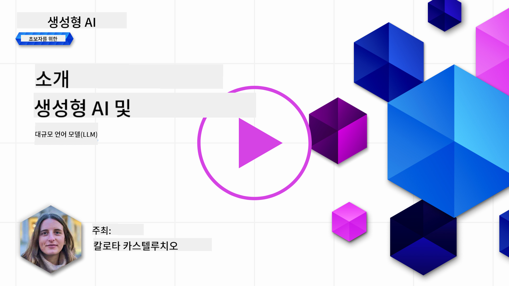
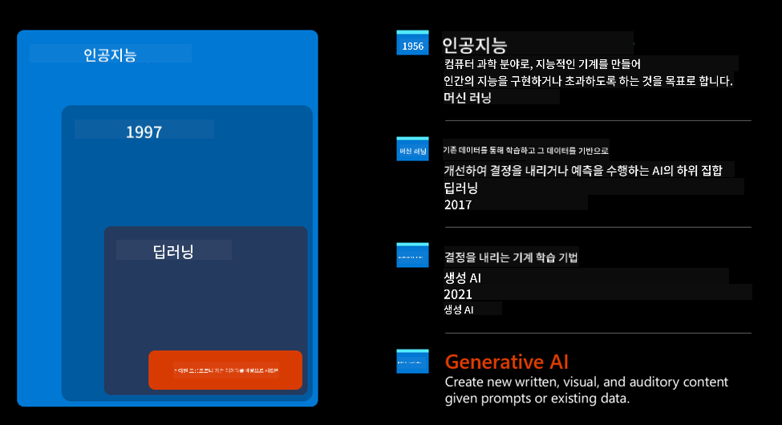
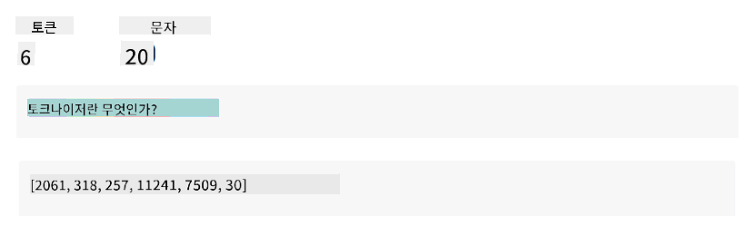
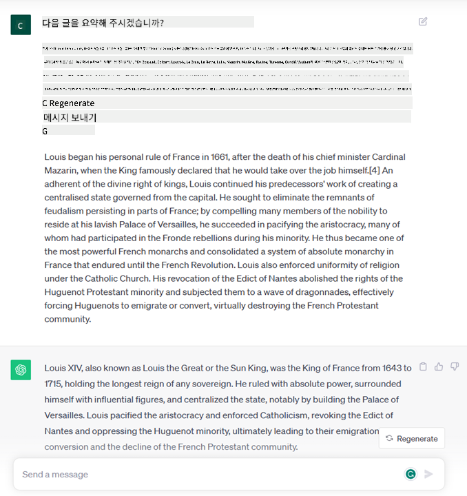
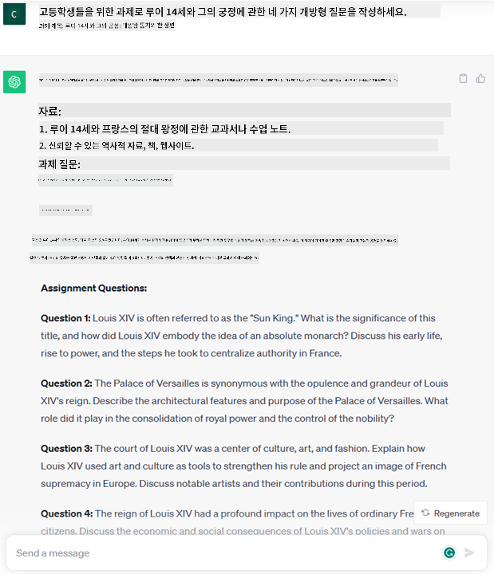
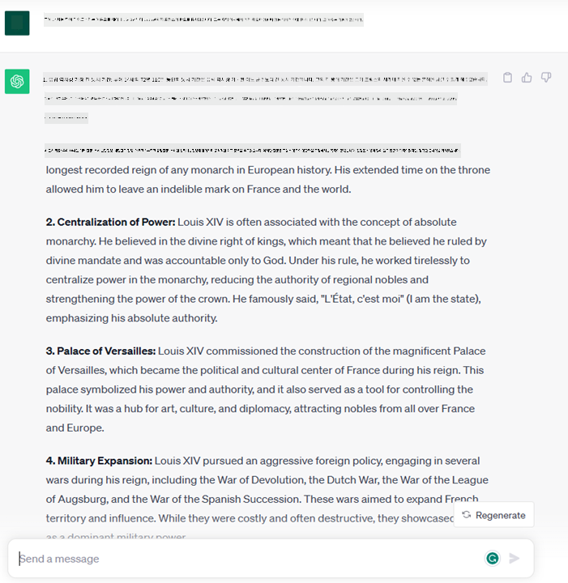
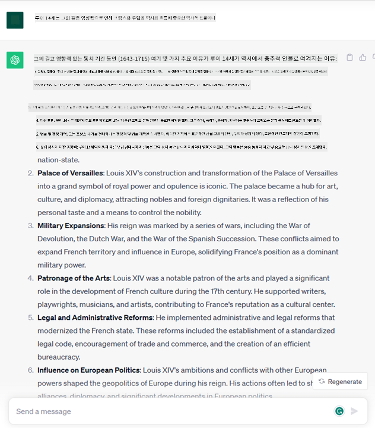
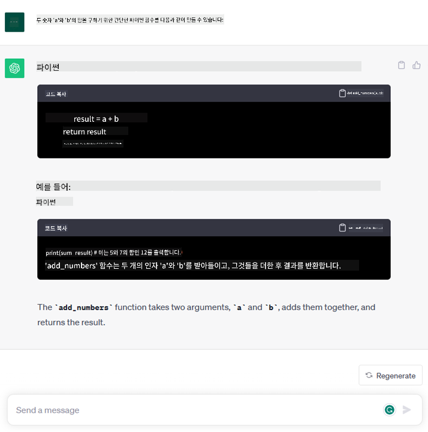

<!--
CO_OP_TRANSLATOR_METADATA:
{
  "original_hash": "f53ba0fa49164f9323043f1c6b11f2b1",
  "translation_date": "2025-06-25T09:43:20+00:00",
  "source_file": "01-introduction-to-genai/README.md",
  "language_code": "ko"
}
-->
# 생성 AI와 대규모 언어 모델 소개

_(위 이미지를 클릭하여 이 강의의 비디오를 시청하세요)_

생성 AI는 텍스트, 이미지 및 다른 유형의 콘텐츠를 생성할 수 있는 인공지능입니다. 이 기술이 환상적인 이유는 AI를 민주화하여 누구나 자연어로 작성된 문장만으로도 사용할 수 있다는 점입니다. Java나 SQL 같은 언어를 배울 필요 없이, 원하는 것을 말하면 AI 모델이 제안을 내놓습니다. 이를 통해 보고서를 작성하거나 이해하고, 애플리케이션을 작성하는 등 다양한 작업을 몇 초 만에 수행할 수 있습니다.

이 커리큘럼에서는 우리 스타트업이 교육 분야에서 새로운 시나리오를 열어가는 방법과 그 적용의 사회적 함의 및 기술적 한계와 관련된 필연적인 도전에 어떻게 대응하는지 탐구할 것입니다.

## 소개

이 강의에서는 다음을 다룹니다:

- 비즈니스 시나리오 소개: 우리 스타트업 아이디어와 미션.
- 생성 AI와 현재 기술 환경에 도달한 과정.
- 대규모 언어 모델의 내부 작동 방식.
- 대규모 언어 모델의 주요 기능과 실용적인 사용 사례.

## 학습 목표

이 강의를 완료한 후, 여러분은 다음을 이해할 것입니다:

- 생성 AI가 무엇인지와 대규모 언어 모델이 어떻게 작동하는지.
- 교육 시나리오에 중점을 두고 다양한 사용 사례에 대규모 언어 모델을 활용하는 방법.

## 시나리오: 우리의 교육 스타트업

생성 인공지능(AI)은 AI 기술의 정점으로, 한때 불가능하다고 여겨졌던 경계를 확장합니다. 생성 AI 모델은 여러 기능과 응용 분야를 가지고 있지만, 이 커리큘럼에서는 가상의 스타트업을 통해 교육을 혁신하는 방법을 탐구할 것입니다. 이 스타트업을 _우리 스타트업_이라고 부르겠습니다. 우리 스타트업은 교육 분야에서 다음과 같은 야심찬 미션을 가지고 있습니다:

> _전 세계적으로 학습 접근성을 개선하여 교육의 공정한 접근을 보장하고, 각 학습자의 요구에 맞춘 개인화된 학습 경험을 제공합니다._

우리 스타트업 팀은 대규모 언어 모델(LLMs)이라는 현대의 가장 강력한 도구 중 하나를 활용하지 않고서는 이 목표를 달성할 수 없다는 것을 알고 있습니다.

생성 AI는 오늘날 우리가 배우고 가르치는 방식을 혁신할 것으로 예상되며, 학생들은 방대한 양의 정보와 예시를 제공하는 가상 교사를 24시간 사용할 수 있고, 교사들은 혁신적인 도구를 활용하여 학생들을 평가하고 피드백을 제공할 수 있습니다.

시작하기 위해, 커리큘럼 전반에 걸쳐 사용할 기본 개념과 용어를 정의해 보겠습니다.

## 생성 AI는 어떻게 얻었나요?

최근 생성 AI 모델 발표로 인해 만들어진 엄청난 _열광_에도 불구하고, 이 기술은 수십 년에 걸쳐 개발되었으며, 최초의 연구 노력은 60년대로 거슬러 올라갑니다. 이제 우리는 AI가 인간의 인지 능력을 갖춘 지점에 도달했습니다. 예를 들어 [OpenAI ChatGPT](https://openai.com/chatgpt) 또는 [Bing Chat](https://www.microsoft.com/edge/features/bing-chat?WT.mc_id=academic-105485-koreyst)과 같은 대화가 이를 보여줍니다. Bing 대화 검색을 위한 GPT 모델을 사용합니다.

조금 뒤로 물러서면, 최초의 AI 프로토타입은 타자기로 작성된 챗봇으로 구성되었으며, 전문가 그룹에서 추출한 지식 기반을 컴퓨터에 표현했습니다. 지식 기반의 답변은 입력 텍스트에 나타나는 키워드에 의해 트리거되었습니다. 그러나 곧 타자기로 작성된 챗봇을 사용하는 접근 방식이 잘 확장되지 않는다는 것이 분명해졌습니다.

### AI에 대한 통계적 접근: 기계 학습

90년대에 도착한 전환점은 텍스트 분석에 통계적 접근을 적용하는 것이었습니다. 이는 데이터에서 명시적으로 프로그래밍되지 않고 패턴을 학습할 수 있는 알고리즘, 즉 기계 학습의 개발로 이어졌습니다. 이 접근 방식은 기계가 인간의 언어 이해를 시뮬레이션할 수 있게 해줍니다: 통계 모델은 텍스트-레이블 페어링에 대해 훈련되어 모델이 메시지의 의도를 나타내는 미리 정의된 레이블로 알 수 없는 입력 텍스트를 분류할 수 있게 합니다.

### 신경망과 현대 가상 비서

최근 몇 년간, 더 많은 데이터와 복잡한 계산을 처리할 수 있는 하드웨어의 기술적 진화가 AI 연구를 장려하여 신경망 또는 딥 러닝 알고리즘으로 알려진 고급 기계 학습 알고리즘의 개발로 이어졌습니다.

신경망(특히 순환 신경망 – RNNs)은 자연어 처리를 크게 향상시켜 문장 내 단어의 문맥을 중요시하여 텍스트의 의미를 더 의미 있게 표현할 수 있게 했습니다.

이 기술은 새로운 세기의 첫 번째 10년 동안 탄생한 가상 비서를 구동했으며, 인간의 언어를 해석하고 필요를 식별하고 이를 충족시키기 위한 행동을 수행하는 데 매우 능숙합니다. 예를 들어 미리 정의된 스크립트로 응답하거나 3자 서비스를 소비하는 것처럼 말입니다.

### 오늘날의 생성 AI

이것이 우리가 오늘날의 생성 AI에 도달한 방법입니다. 이는 딥 러닝의 하위 집합으로 볼 수 있습니다.

AI 분야에서 수십 년간의 연구 끝에 _Transformer_라는 새로운 모델 아키텍처가 RNNs의 한계를 극복하여 훨씬 더 긴 텍스트 시퀀스를 입력으로 받을 수 있게 되었습니다. Transformers는 주의 메커니즘을 기반으로 하여 모델이 수신하는 입력에 다른 가중치를 부여하여 가장 관련 있는 정보가 집중된 부분에 '더 많은 주의'를 기울일 수 있게 합니다. 텍스트 시퀀스 내 순서에 관계없이 말입니다.

대부분의 최근 생성 AI 모델 – 대규모 언어 모델(LLMs)이라고도 하며, 텍스트 입력 및 출력으로 작업합니다 – 실제로 이 아키텍처를 기반으로 합니다. 이 모델들은 책, 기사 및 웹사이트와 같은 다양한 출처에서 엄청난 양의 레이블 없는 데이터를 훈련받아 다양한 작업에 적응할 수 있고 창의성의 일종을 갖춘 문법적으로 올바른 텍스트를 생성할 수 있습니다. 따라서 기계가 입력 텍스트를 '이해'하는 능력을 놀라울 정도로 향상시켰을 뿐만 아니라 인간 언어로 원본 응답을 생성할 수 있는 능력을 제공했습니다.

## 대규모 언어 모델은 어떻게 작동하나요?

다음 장에서는 다양한 생성 AI 모델 유형을 탐구할 것입니다. 하지만 지금은 대규모 언어 모델이 어떻게 작동하는지, 특히 OpenAI GPT(Generative Pre-trained Transformer) 모델에 초점을 맞춰 보겠습니다.

- **토크나이저, 텍스트를 숫자로 변환**: 대규모 언어 모델은 텍스트를 입력으로 받고 텍스트를 출력으로 생성합니다. 하지만 통계 모델이기 때문에 텍스트 시퀀스보다는 숫자로 더 잘 작동합니다. 그래서 모델의 모든 입력은 코어 모델에 사용되기 전에 토크나이저에 의해 처리됩니다. 토큰은 가변 문자 수로 구성된 텍스트 조각입니다. 따라서 토크나이저의 주요 작업은 입력을 토큰 배열로 분할하는 것입니다. 그런 다음 각 토큰은 원본 텍스트 조각의 정수 인코딩인 토큰 인덱스로 매핑됩니다.

- **출력 토큰 예측**: n개의 토큰을 입력으로 받으면(모델마다 최대 n이 다름), 모델은 출력으로 하나의 토큰을 예측할 수 있습니다. 이 토큰은 다음 반복의 입력에 통합되어 확장 창 패턴으로 사용자가 하나(또는 여러 개)의 문장을 답변으로 받을 수 있게 합니다. 이것이 ChatGPT를 사용해본 적이 있다면 왜 때때로 문장 중간에서 멈추는 것처럼 보이는지 설명합니다.

- **선택 과정, 확률 분포**: 출력 토큰은 현재 텍스트 시퀀스 이후 발생할 확률에 따라 모델에 의해 선택됩니다. 이는 모델이 훈련을 기반으로 모든 가능한 '다음 토큰'에 대한 확률 분포를 예측하기 때문입니다. 그러나 항상 가장 높은 확률의 토큰이 결과 분포에서 선택되는 것은 아닙니다. 모델이 비결정론적 방식으로 작동하도록 일부 무작위성이 이 선택에 추가됩니다 - 동일한 입력에 대해 정확히 같은 출력을 얻지 않습니다. 이 무작위성의 정도는 창의적 사고 과정을 시뮬레이션하기 위해 추가되며 온도라는 모델 매개변수를 사용하여 조정할 수 있습니다.

## 우리 스타트업은 대규모 언어 모델을 어떻게 활용할 수 있을까요?

이제 대규모 언어 모델의 내부 작동 방식을 더 잘 이해했으니, 비즈니스 시나리오를 염두에 두고 그들이 수행할 수 있는 가장 일반적인 작업의 몇 가지 실용적인 예를 살펴보겠습니다. 대규모 언어 모델의 주요 기능은 _자연어로 작성된 텍스트 입력에서 시작하여 텍스트를 처음부터 생성하는 것_이라고 했습니다.

하지만 어떤 종류의 텍스트 입력과 출력일까요?
대규모 언어 모델의 입력은 프롬프트로 알려져 있으며, 출력은 현재 입력을 완료하기 위해 다음 토큰을 생성하는 모델 메커니즘을 나타내는 완료라고 합니다. 프롬프트가 무엇인지, 모델을 최대한 활용할 수 있도록 설계하는 방법에 대해 깊이 탐구할 것입니다. 하지만 지금은 프롬프트가 다음을 포함할 수 있다고만 말씀드리겠습니다:

- 모델에서 기대하는 출력 유형을 지정하는 **지침**. 이 지침은 때때로 몇 가지 예시나 추가 데이터를 포함할 수 있습니다.

  1. 기사, 책, 제품 리뷰 등의 요약과 비정형 데이터에서 인사이트 추출.
    
    
  
  2. 기사, 에세이, 과제 등의 창의적 아이디어와 디자인.
      
     

- 에이전트와의 대화 형태로 묻는 **질문**.
  
  

- 암묵적으로 글쓰기 지원을 요청하는 **완성할 텍스트 조각**.
  
  

- 특정 작업을 수행하는 코드 조각을 생성하거나 설명 및 문서화를 요청하는 **코드 조각**.
  
  

위의 예시는 매우 간단하며 대규모 언어 모델의 기능을 포괄적으로 보여주려는 것이 아닙니다. 교육적 맥락에 국한되지 않고 생성 AI를 사용하는 잠재력을 보여주기 위한 것입니다.

또한 생성 AI 모델의 출력은 완벽하지 않으며 때로는 모델의 창의성이 이를 방해하여 인간 사용자가 현실 왜곡으로 해석할 수 있는 단어 조합을 생성하거나 불쾌감을 줄 수 있습니다. 생성 AI는 지능적이지 않습니다 - 비판적이고 창의적인 추론 또는 감정적 지능을 포함하는 더 포괄적인 지능의 정의에서; 결정론적이지 않으며, 신뢰할 수 없습니다. 잘못된 참조, 콘텐츠 및 진술이 올바른 정보와 결합되어 설득력 있고 자신감 있게 제시될 수 있습니다. 다음 강의에서는 이러한 모든 제한 사항을 다루고 이를 완화할 수 있는 방법을 살펴볼 것입니다.

## 과제

[생성 AI](https://en.wikipedia.org/wiki/Generative_artificial_intelligence?WT.mc_id=academic-105485-koreyst)에 대해 더 읽고 현재 생성 AI가 없는 영역을 식별하는 것이 여러분의 과제입니다. "옛 방식"으로 하는 것과 어떻게 다를까요, 이전에는 할 수 없었던 일을 할 수 있나요, 아니면 더 빠른가요? 여러분의 꿈의 AI 스타트업이 어떤 모습일지 "문제", "AI를 활용하는 방법", "영향" 및 선택적으로 사업 계획과 같은 헤더를 포함하여 300단어 요약을 작성하세요.

이 작업을 완료했다면 Microsoft의 인큐베이터, [Microsoft for Startups Founders Hub](https://www.microsoft.com/startups?WT.mc_id=academic-105485-koreyst)에 지원할 준비가 되었을 수도 있습니다. 우리는 Azure, OpenAI, 멘토링 및 더 많은 크레딧을 제공합니다. 확인해 보세요!

## 지식 점검

대규모 언어 모델에 대한 사실은 무엇인가요?

1. 매번 정확히 같은 응답을 받습니다.
1. 모든 것을 완벽하게 수행합니다. 숫자 더하기에 뛰어나고 작동하는 코드를 생성합니다.
1. 동일한 프롬프트를 사용해도 응답이 달라질 수 있습니다. 텍스트든 코드든 무언가의 첫 번째 초안을 제공하는 데 뛰어납니다. 하지만 결과를 개선해야 합니다.

A: 3, LLM은 비결정론적이며 응답이 달라집니다. 그러나 온도 설정을 통해 그 변화를 제어할 수 있습니다. 또한 완벽하게 수행할 것으로 기대해서는 안 됩니다. 그것은 종종 점진적으로 개선해야 하는 무언가의 첫 번째 시도를 잘 수행하는 것입니다.

## 훌륭한 작업! 여정을 계속하세요

이 강의를 완료한 후, 우리의 [생성 AI 학습 컬렉션](https://aka.ms/genai-collection?WT.mc_id=academic-105485-koreyst)을 확인하여 생성 AI 지식을 계속해서 향상시키세요!

2강으로 이동하여 [다양한 LLM 유형 탐색 및 비교](../02-exploring-and-comparing-different-llms/README.md?WT.mc_id=academic-105485-koreyst)를 살펴보세요!

**면책 조항**:  
이 문서는 AI 번역 서비스 [Co-op Translator](https://github.com/Azure/co-op-translator)를 사용하여 번역되었습니다. 정확성을 위해 노력하고 있지만 자동 번역에는 오류나 부정확성이 있을 수 있습니다. 원본 문서의 모국어 버전이 권위 있는 자료로 간주되어야 합니다. 중요한 정보의 경우, 전문적인 인간 번역을 권장합니다. 이 번역의 사용으로 인한 오해나 잘못된 해석에 대해 당사는 책임을 지지 않습니다.