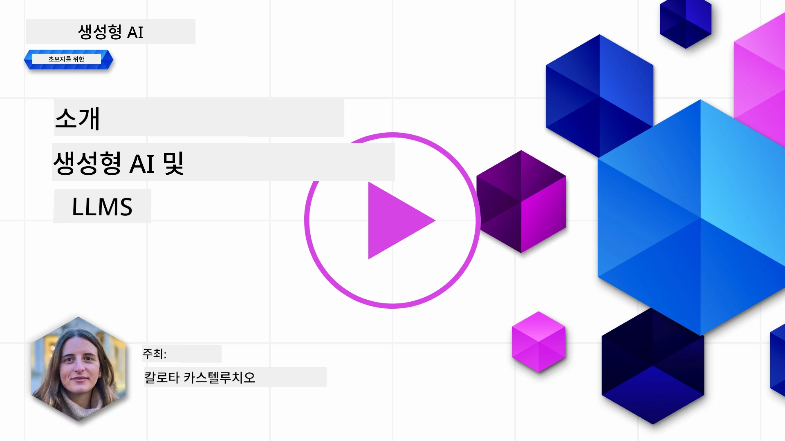
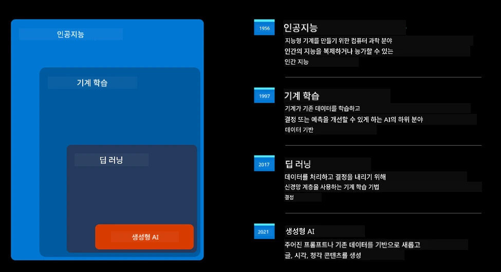
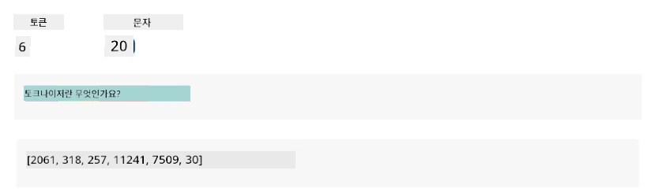
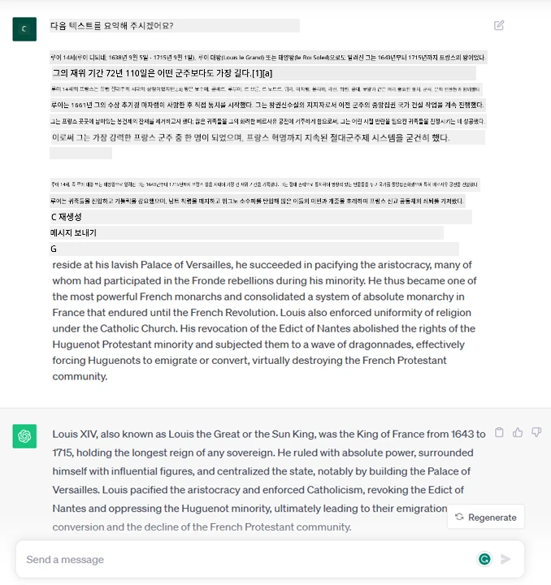
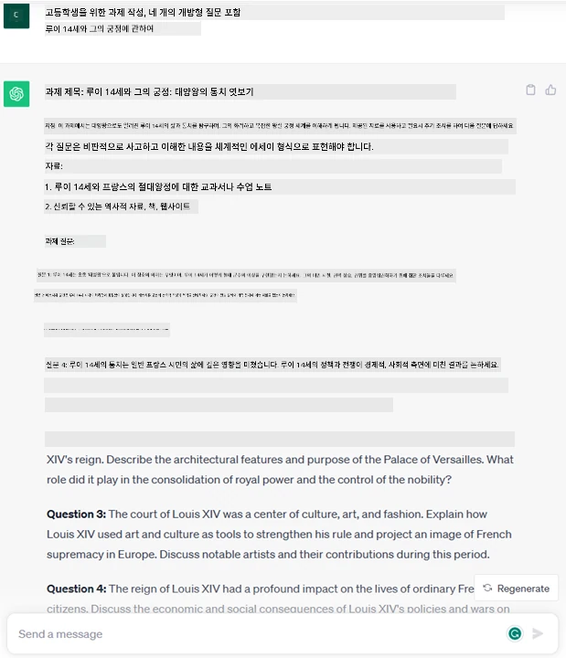
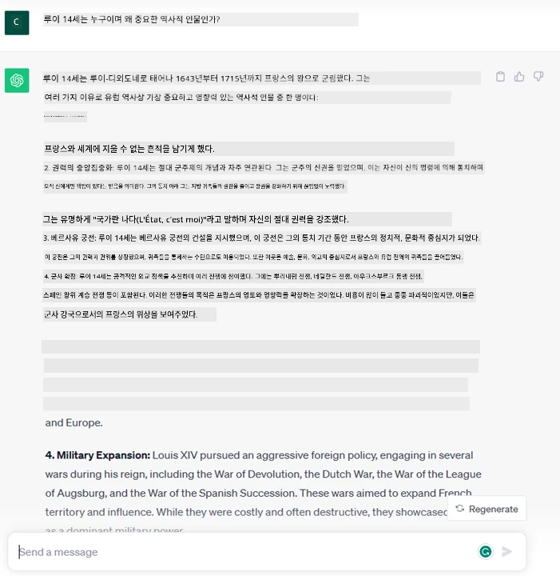
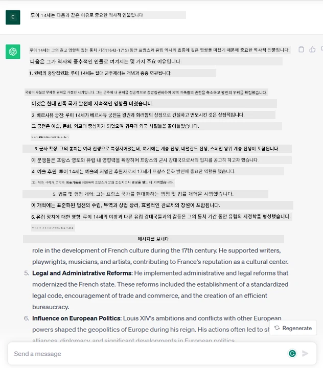
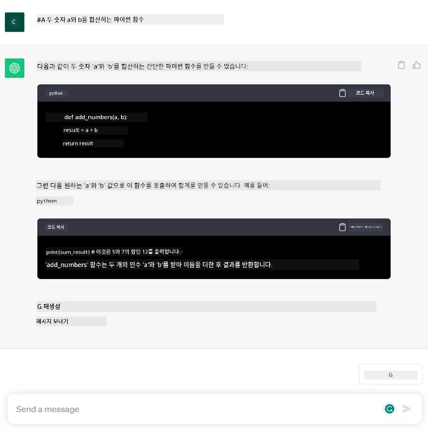

# 생성형 AI 및 대형 언어 모델 소개

_(위 이미지를 클릭하여 이 수업의 비디오를 시청하세요)_

생성형 AI는 텍스트, 이미지 및 기타 유형의 콘텐츠를 생성할 수 있는 인공지능입니다. 이 기술이 훌륭한 이유는 AI를 민주화하여 누구나 자연어로 작성한 간단한 텍스트 프롬프트로 사용할 수 있다는 점입니다. Java나 SQL 같은 언어를 배울 필요 없이 원하는 바를 말하면 AI 모델이 제안을 내놓습니다. 이 기술의 응용과 영향력은 막대하며, 여러분은 보고서를 작성하거나 이해하고, 응용 프로그램을 작성하는 등 다방면에서 몇 초 만에 결과를 얻을 수 있습니다.

이 커리큘럼에서는 우리 스타트업이 생성형 AI를 어떻게 교육 분야에서 새로운 시나리오를 열어가는지, 그리고 그 적용으로 인한 사회적 영향과 기술적 한계에 어떻게 대응하는지 탐구할 것입니다.

## 소개

이 수업에서 다룰 내용:

- 비즈니스 시나리오 소개: 우리 스타트업 아이디어와 미션.
- 생성형 AI와 현재 기술 환경에 도달하기까지의 과정.
- 대형 언어 모델의 내부 작동 원리.
- 대형 언어 모델의 주요 기능과 실제 사용 사례.

## 학습 목표

이 수업을 완료하면 다음을 이해하게 될 것입니다:

- 생성형 AI가 무엇인지, 대형 언어 모델이 어떻게 작동하는지.
- 교육 시나리오에 중점을 두고 다양한 사용 사례에서 대형 언어 모델을 어떻게 활용할 수 있는지.

## 시나리오: 우리 교육 스타트업

생성형 인공 지능(AI)은 AI 기술의 정점으로, 이전에는 불가능하다고 여겨졌던 가능성을 확장하고 있습니다. 생성형 AI 모델은 여러 기능과 응용 분야가 있지만, 이 커리큘럼에서는 한 가상의 스타트업을 통해 교육 분야를 혁신하는 방법을 탐구할 것입니다. 이 스타트업을 _우리 스타트업_이라고 부르겠습니다. 우리 스타트업은 교육 분야에서 다음과 같은 야심찬 미션 문구를 가지고 일하고 있습니다:

> _전 세계적으로 학습 접근성을 향상시키고, 교육에 대한 공평한 접근을 보장하며, 각 학습자의 필요에 맞는 개인화된 학습 경험을 제공하는 것_.

우리 스타트업 팀은 가장 강력한 현대 도구 중 하나인 대형 언어 모델(LLM)을 활용하지 않고서는 이 목표를 달성할 수 없다는 것을 잘 알고 있습니다.

생성형 AI는 오늘날 우리가 학습하고 가르치는 방식을 혁신할 것으로 기대됩니다. 학생들은 24시간 이용 가능한 가상 교사를 통해 방대한 정보와 예제를 얻을 수 있고, 교사들은 학생을 평가하고 피드백을 줄 수 있는 혁신적인 도구를 활용할 수 있습니다.

우선, 이 커리큘럼 내내 사용할 기본 개념과 용어를 정의해 봅시다.

## 생성형 AI는 어떻게 탄생했나요?

최근 생성형 AI 모델 발표로 인해 엄청난 _과대광고(하이프)_가 있었지만, 이 기술은 수십 년에 걸쳐 개발되어 왔으며, 첫 번째 연구 노력이 60년대까지 거슬러 올라갑니다. 현재 우리는 [OpenAI ChatGPT](https://openai.com/chatgpt)나 [Microsoft Copilot](https://copilot.microsoft.com/?WT.mc_id=academic-105485-koreyst)처럼 대화형 웹 검색 경험을 위해 GPT 모델을 사용하는 인공지능이 인간의 인지 능력, 예를 들어 대화 능력을 갖춘 단계에 이르렀습니다.

처음의 AI 프로토타입은 전문가 집단에서 추출한 지식을 컴퓨터에 표현한 유형 문서형 채팅 봇이었습니다. 지식 기반의 답변은 입력 텍스트 내의 키워드에 의해 트리거되었습니다.
하지만 곧 유형 문서형 채팅 봇과 같은 방식은 확장성이 떨어진다는 것이 명확해졌습니다.

### AI에 대한 통계적 접근법: 머신러닝

90년대에 텍스트 분석에 통계적 접근법이 적용되면서 전환점이 찾아왔습니다. 이로 인해 명확한 프로그래밍 없이도 데이터를 통해 패턴을 학습하는 머신러닝이라는 새로운 알고리즘들이 개발되었습니다. 이 방식을 통해 기계는 인간 언어 이해를 모방할 수 있게 되었고, 텍스트-라벨 쌍을 학습해 미지의 입력 텍스트를 메시지 의도를 나타내는 사전 정의된 라벨로 분류할 수 있습니다.

### 신경망과 현대 가상 비서

최근 몇 년 간, 더 많은 데이터를 처리하고 복잡한 계산을 수행할 수 있는 하드웨어 진화는 AI 연구를 촉진시켜 신경망 또는 딥러닝 알고리즘으로 불리는 고급 머신러닝 알고리즘을 개발하게 했습니다.

신경망(특히 순환 신경망 - RNN)은 자연어 처리를 크게 향상시켜 문장에서 단어의 맥락을 중요시하며 텍스트의 의미를 더 의미 있게 표현할 수 있게 했습니다.

이 기술은 21세기 첫 10년에 태어난 가상 비서들을 가능하게 했는데, 이들은 인간의 언어를 능숙하게 해석하고 요구를 식별하여 미리 정의된 스크립트로 대답하거나 제3자 서비스를 활용하는 등 행동을 취했습니다.

### 현재, 생성형 AI

이렇게 해서 현재의 생성형 AI에 이르렀으며, 이는 딥러닝의 하위 집합으로 볼 수 있습니다.

AI 분야의 수십 년 연구 끝에, _Transformer_라 불리는 새로운 모델 구조가 RNN의 한계를 극복했습니다. 이 구조는 훨씬 긴 텍스트 시퀀스를 입력으로 받을 수 있습니다. 트랜스포머는 주목 메커니즘(attention mechanism)에 기반해 모델이 받은 입력에 가중치를 다르게 부여할 수 있게 하여 텍스트 시퀀스에서 정보가 집중된 부분에 더 '주의를 기울이게' 합니다.

최근 생성형 AI 모델 대부분은 텍스트 입력과 출력을 다루므로 대형 언어 모델(LLM)으로 불리며, 이 구조를 기반으로 합니다. 이 모델들은 책, 기사, 웹사이트와 같은 다양한 출처에서 막대한 양의 비라벨 데이터로 훈련되어 다양한 작업에 적응할 수 있고 문법적으로 올바른 텍스트를 창의적으로 생성할 수 있다는 점이 흥미롭습니다. 따라서 기계가 입력 텍스트를 '이해'하는 능력을 현격히 향상시켰을 뿐 아니라, 인간 언어로 원본의 응답을 생성하는 능력도 가능하게 했습니다.

## 대형 언어 모델은 어떻게 작동하나요?

다음 장에서는 다양한 생성형 AI 모델 유형을 살펴보지만, 우선 OpenAI GPT(Generative Pre-trained Transformer) 모델에 초점을 맞춰 대형 언어 모델이 어떻게 작동하는지 살펴봅시다.

- **토크나이저, 텍스트를 숫자로 변환하기**: 대형 언어 모델은 텍스트를 입력으로 받고 텍스트를 출력으로 생성합니다. 하지만 통계적 모델이기 때문에 텍스트 시퀀스보다 숫자를 사용하는 편이 훨씬 효율적입니다. 따라서 모델에 입력되는 모든 텍스트는 핵심 모델에 사용되기 전에 토크나이저에 의해 처리됩니다. 토큰은 가변 길이의 문자 수로 구성된 텍스트 덩어리이며, 토크나이저의 주 임무는 입력을 토큰 배열로 분할하는 것입니다. 그 다음 각 토큰은 토큰 인덱스라는 원본 텍스트 덩어리의 정수 인코딩과 매핑됩니다.

- **출력 토큰 예측**: n개의 토큰이 입력으로 주어지면(최대 n의 크기는 모델에 따라 다름) 모델은 하나의 토큰을 출력으로 예측합니다. 이 토큰은 다음 반복의 입력에 포함되어 확장되는 윈도우 패턴으로 동작해 사용자가 한 문장 또는 여러 문장을 답변으로 받는 더 나은 경험을 제공합니다. 이로 인해 만약 ChatGPT를 사용해 보았다면 가끔 문장 중간에 멈추는 것처럼 보이는 현상을 경험했을 수 있습니다.

- **선택 과정, 확률 분포**: 출력 토큰은 현재 텍스트 시퀀스 이후에 나타날 확률에 따라 모델이 선택합니다. 모델은 훈련을 기반으로 가능한 모든 ‘다음 토큰’의 확률 분포를 예측합니다. 하지만 항상 가장 높은 확률을 가진 토큰이 선택되지는 않습니다. 창의적 사고 과정을 모방하기 위해 약간의 무작위성이 추가되어 모델은 비결정론적으로 작동하며, 동일한 입력에 대해 정확히 같은 출력을 항상 내놓지 않습니다. 이 무작위성 정도는 온도(temperature)라는 모델 매개변수로 조절할 수 있습니다.

## 우리 스타트업이 대형 언어 모델을 어떻게 활용할 수 있나요?

대형 언어 모델의 내부 작동 방식을 좀 더 이해했으니, 비즈니스 시나리오에 맞춰 이들이 잘 수행할 수 있는 가장 일반적인 작업의 실용적 예시들을 살펴봅시다.
대형 언어 모델의 주요 기능은 _자연어로 작성된 텍스트 입력으로부터 처음부터 텍스트를 생성하는 것_ 이라고 했습니다.

그렇다면 어떤 종류의 텍스트 입력과 출력일까요?
대형 언어 모델의 입력은 프롬프트(prompt)라 부르고 출력은 컴플리션(completion)이라 부릅니다. 컴플리션은 모델이 현재 입력을 완성하기 위해 다음 토큰을 생성하는 메커니즘을 의미합니다. 이제 프롬프트란 무엇이고 어떻게 설계하는 것이 모델 활용에 가장 효과적인지 자세히 배우겠지만, 일단 프롬프트는 다음을 포함할 수 있습니다:

- 모델이 기대하는 출력 유형을 지정하는 <strong>지시문</strong>. 때로는 예시나 추가 데이터를 포함하기도 합니다.

  1. 기사, 책, 상품 후기 등의 요약과 비정형 데이터에서 인사이트 추출 등이 있습니다.
    
    
  
  2. 기사, 에세이, 과제 등의 창의적 아이디어 구상과 설계도 포함됩니다.
      
     

- 에이전트와의 대화 형태로 묻는 <strong>질문</strong>.
  
  

- 암묵적으로 글쓰기 지원을 요청하는 **완성할 텍스트** 조각.
  
  

- 특정 작업 수행 코드 생성 요청이나 설명 및 문서화 요청이 포함된 <strong>코드</strong> 조각.
  
  

위 예시들은 꽤 간단하며 대형 언어 모델의 능력을 모두 보여주려는 의도가 아닙니다. 이는 특히 교육 맥락을 포함하되 제한하지 않는 생성형 AI 사용 가능성을 보여주기 위한 것입니다.

또한 생성형 AI 모델의 출력은 완벽하지 않고, 때때로 모델의 창의성이 현실 왜곡으로 인간 사용자가 해석할 수 있거나 공격적일 수 있는 결과를 낳기도 합니다. 생성형 AI는 지능형이 아닙니다 – 적어도 비판적이고 창의적 추론 또는 감성 지능을 포함하는 더 포괄적 정의의 지능은 아닙니다; 결정론적이지 않고 신뢰할 수 없으며, 오류가 포함된 참조, 콘텐츠, 진술이 올바른 정보와 결합되어 설득력 있고 자신감 있게 제시될 수 있습니다. 이후 수업에서 이러한 한계들에 대해 다루고 완화할 방안을 살펴보겠습니다.

## 과제

여러분의 과제는 [생성형 AI](https://en.wikipedia.org/wiki/Generative_artificial_intelligence?WT.mc_id=academic-105485-koreyst)에 대해 더 읽고, 아직 생성형 AI가 적용되지 않은 영역을 찾아내는 것입니다. 기존 방식과 비교해 AI 도입이 어떤 영향을 줄지, 이전에 할 수 없던 것이 가능해졌는지, 아니면 더 빨라졌는지 등도 생각해 보세요. 300단어 분량으로 “문제점”, “내가 AI를 활용하는 방법”, “영향” 등의 제목을 포함해서 꿈의 AI 스타트업이 어떤 모습일지 요약해 작성하세요. 선택적으로 사업 계획도 포함해도 좋습니다.

이 과제를 완료했다면 Microsoft의 인큐베이터 [Microsoft for Startups Founders Hub](https://www.microsoft.com/startups?WT.mc_id=academic-105485-koreyst)에 지원할 준비가 된 것일 수 있습니다. Azure, OpenAI, 멘토링 등 다양한 크레딧을 제공하니 꼭 확인하세요!

## 지식 점검

대형 언어 모델에 대해 옳은 것은 무엇인가요?

1. 매번 정확히 같은 답변을 받는다.
1. 완벽하게 수행하며, 숫자 덧셈이나 작동하는 코드를 생성하는 데 능숙하다.
1. 같은 프롬프트를 사용해도 답변이 달라질 수 있다. 또한 텍스트나 코드 초안을 잘 작성하지만 결과물을 개선할 필요가 있다.

답: 3번, LLM은 비결정론적이며 답변이 달라집니다. 그러나 온도 설정을 통해 변동성을 조절할 수 있습니다. 또한 완벽하게 수행하지는 않으며, 무거운 작업을 대신 처리해 주어 처음 시도 결과를 받고 점차 개선할 수 있도록 돕습니다.

## 훌륭합니다! 여정을 계속하세요

이 수업을 마친 후 [생성형 AI 학습 컬렉션](https://aka.ms/genai-collection?WT.mc_id=academic-105485-koreyst)을 확인하여 생성형 AI 지식을 계속 발전시키세요!

2과로 이동하여 [다양한 LLM 유형을 탐색하고 비교하는 방법](../02-exploring-and-comparing-different-llms/README.md?WT.mc_id=academic-105485-koreyst)을 살펴보겠습니다!

---

<!-- CO-OP TRANSLATOR DISCLAIMER START -->
**면책 조항**:
이 문서는 AI 번역 서비스 [Co-op Translator](https://github.com/Azure/co-op-translator)를 사용하여 번역되었습니다. 정확성을 기하기 위해 노력하고 있으나, 자동 번역은 오류나 부정확한 부분이 있을 수 있음을 유의하시기 바랍니다. 원본 문서의 원어본이 권위 있는 자료로 간주되어야 합니다. 중요한 정보의 경우, 전문가의 인간 번역을 권장합니다. 이 번역 사용으로 인해 발생하는 오해나 잘못된 해석에 대해 당사는 책임을 지지 않습니다.
<!-- CO-OP TRANSLATOR DISCLAIMER END -->