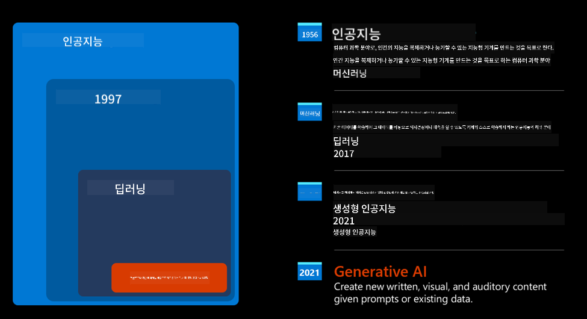
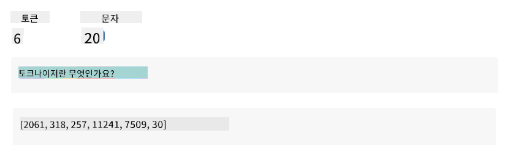
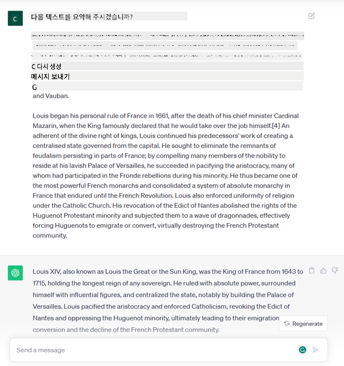

<!--
CO_OP_TRANSLATOR_METADATA:
{
  "original_hash": "bfb7901bdbece1ba3e9f35c400ca33e8",
  "translation_date": "2025-10-18T00:06:01+00:00",
  "source_file": "01-introduction-to-genai/README.md",
  "language_code": "ko"
}
-->
# 생성형 AI와 대규모 언어 모델 소개

_(위 이미지를 클릭하면 이 강의의 동영상을 볼 수 있습니다)_

생성형 AI는 텍스트, 이미지 및 기타 유형의 콘텐츠를 생성할 수 있는 인공지능입니다. 이 기술이 놀라운 이유는 AI를 민주화한다는 점입니다. 누구나 자연어로 작성된 문장과 같은 간단한 텍스트 프롬프트만으로 이를 사용할 수 있습니다. Java나 SQL과 같은 언어를 배우지 않아도 가치 있는 일을 할 수 있으며, 자신의 언어를 사용하여 원하는 것을 말하면 AI 모델이 제안을 제공합니다. 이를 통해 보고서를 작성하거나 이해하고, 애플리케이션을 작성하는 등 다양한 작업을 몇 초 만에 수행할 수 있습니다.

이 커리큘럼에서는 우리 스타트업이 생성형 AI를 활용하여 교육 분야에서 새로운 시나리오를 어떻게 열어가는지, 그리고 그 응용과 기술적 한계와 관련된 사회적 함의를 어떻게 해결하는지 탐구할 것입니다.

## 소개

이 강의에서는 다음 내용을 다룹니다:

- 비즈니스 시나리오 소개: 우리 스타트업 아이디어와 미션.
- 생성형 AI와 현재 기술 환경에 도달한 과정.
- 대규모 언어 모델의 내부 작동 방식.
- 대규모 언어 모델의 주요 기능과 실용적인 사용 사례.

## 학습 목표

이 강의를 완료한 후, 여러분은 다음을 이해할 수 있습니다:

- 생성형 AI가 무엇인지와 대규모 언어 모델이 어떻게 작동하는지.
- 대규모 언어 모델을 다양한 사용 사례에 활용하는 방법, 특히 교육 시나리오에 초점을 맞춘 활용법.

## 시나리오: 우리의 교육 스타트업

생성형 인공지능(AI)은 AI 기술의 정점으로, 한때 불가능하다고 여겨졌던 한계를 뛰어넘고 있습니다. 생성형 AI 모델은 여러 기능과 응용 사례를 가지고 있지만, 이 커리큘럼에서는 가상의 스타트업을 통해 교육을 혁신하는 방법을 탐구할 것입니다. 이 스타트업을 _우리 스타트업_이라고 부르겠습니다. 우리 스타트업은 교육 분야에서 다음과 같은 야심 찬 미션을 가지고 있습니다:

> _전 세계적으로 학습 접근성을 개선하고, 공정한 교육 접근을 보장하며, 학습자의 필요에 따라 개인화된 학습 경험을 제공한다._

우리 스타트업 팀은 현대의 가장 강력한 도구 중 하나인 대규모 언어 모델(LLM)을 활용하지 않고는 이 목표를 달성할 수 없다는 것을 알고 있습니다.

생성형 AI는 오늘날 우리가 배우고 가르치는 방식을 혁신할 것으로 기대되며, 학생들은 24시간 가상 교사를 통해 방대한 정보와 예제를 제공받고, 교사들은 혁신적인 도구를 활용하여 학생들을 평가하고 피드백을 제공할 수 있습니다.

먼저, 커리큘럼 전반에서 사용할 기본 개념과 용어를 정의해 보겠습니다.

## 생성형 AI는 어떻게 탄생했을까?

최근 생성형 AI 모델 발표로 인해 엄청난 _열풍_이 일었지만, 이 기술은 수십 년에 걸쳐 개발된 것입니다. 최초의 연구는 1960년대로 거슬러 올라갑니다. 오늘날 우리는 인간의 인지 능력을 갖춘 AI의 시대에 도달했으며, 예를 들어 [OpenAI ChatGPT](https://openai.com/chatgpt) 또는 [Bing Chat](https://www.microsoft.com/edge/features/bing-chat?WT.mc_id=academic-105485-koreyst)과 같은 대화형 AI를 통해 이를 확인할 수 있습니다. Bing Chat은 웹 검색 대화에 GPT 모델을 사용합니다.

조금 더 거슬러 올라가면, 초기 AI 프로토타입은 전문가 그룹에서 추출한 지식 기반을 컴퓨터에 표현하여 작동하는 타자 입력 챗봇으로 구성되었습니다. 지식 기반의 답변은 입력 텍스트에 나타나는 키워드에 의해 트리거되었습니다. 그러나 이러한 접근 방식은 타자 입력 챗봇을 사용하는 것이 잘 확장되지 않는다는 점이 곧 명확해졌습니다.

### AI의 통계적 접근: 머신 러닝

1990년대에는 텍스트 분석에 통계적 접근 방식을 적용하면서 전환점이 찾아왔습니다. 이를 통해 머신 러닝으로 알려진 새로운 알고리즘이 개발되었으며, 이는 명시적으로 프로그래밍되지 않고 데이터에서 패턴을 학습할 수 있었습니다. 이 접근 방식은 기계가 인간의 언어 이해를 시뮬레이션할 수 있게 했습니다. 통계 모델은 텍스트-레이블 페어링으로 훈련되어 미리 정의된 메시지 의도를 나타내는 레이블로 미지의 입력 텍스트를 분류할 수 있게 되었습니다.

### 신경망과 현대의 가상 비서

최근 몇 년 동안 더 많은 데이터와 복잡한 계산을 처리할 수 있는 하드웨어의 기술적 진화는 AI 연구를 장려하여 신경망 또는 딥 러닝 알고리즘으로 알려진 고급 머신 러닝 알고리즘을 개발하게 했습니다.

신경망(특히 순환 신경망 – RNN)은 자연어 처리(NLP)를 크게 향상시켜 문장에서 단어의 문맥을 중시하며 텍스트의 의미를 더 의미 있게 표현할 수 있게 했습니다.

이 기술은 21세기 첫 10년 동안 탄생한 가상 비서들을 지원했으며, 인간의 언어를 해석하고, 필요를 파악하며, 이를 충족시키기 위한 행동을 수행하는 데 매우 능숙했습니다. 예를 들어, 미리 정의된 스크립트로 답변하거나 제3자 서비스를 사용하는 것 등이 있습니다.

### 현재, 생성형 AI

이렇게 해서 오늘날의 생성형 AI에 도달하게 되었습니다. 생성형 AI는 딥 러닝의 하위 집합으로 볼 수 있습니다.

AI 분야에서 수십 년간의 연구 끝에 _Transformer_라는 새로운 모델 아키텍처가 RNN의 한계를 극복하며 훨씬 더 긴 텍스트 시퀀스를 입력으로 받을 수 있게 되었습니다. Transformer는 주의 메커니즘(attention mechanism)을 기반으로 하며, 모델이 받은 입력에 서로 다른 가중치를 부여하여 텍스트 시퀀스에서 가장 관련성이 높은 정보에 '더 많은 주의'를 기울일 수 있게 합니다.

대부분의 최신 생성형 AI 모델 – 텍스트 입력과 출력을 다루기 때문에 대규모 언어 모델(LLM)이라고도 불리는 –은 실제로 이 아키텍처를 기반으로 합니다. 이 모델들은 책, 기사, 웹사이트와 같은 다양한 출처에서 방대한 양의 라벨이 없는 데이터로 훈련되었으며, 다양한 작업에 적응할 수 있고 문법적으로 올바른 텍스트를 창의적으로 생성할 수 있습니다. 따라서 이 모델들은 기계가 입력 텍스트를 '이해'하는 능력을 놀라울 정도로 향상시켰을 뿐만 아니라, 인간 언어로 독창적인 응답을 생성할 수 있는 능력도 가능하게 했습니다.

## 대규모 언어 모델은 어떻게 작동할까?

다음 장에서는 다양한 유형의 생성형 AI 모델을 탐구할 예정이지만, 지금은 대규모 언어 모델이 어떻게 작동하는지, 특히 OpenAI GPT(Generative Pre-trained Transformer) 모델에 초점을 맞춰 살펴보겠습니다.

- **토크나이저, 텍스트를 숫자로 변환**: 대규모 언어 모델은 텍스트를 입력으로 받고 텍스트를 출력으로 생성합니다. 그러나 통계 모델이기 때문에 텍스트 시퀀스보다 숫자로 작업하는 것이 훨씬 더 효과적입니다. 그래서 모델의 핵심 부분에 사용되기 전에 모든 입력은 토크나이저에 의해 처리됩니다. 토큰은 가변 길이의 문자로 구성된 텍스트 조각이며, 토크나이저의 주요 작업은 입력을 토큰 배열로 나누는 것입니다. 그런 다음 각 토큰은 원래 텍스트 조각의 정수 인코딩인 토큰 인덱스와 매핑됩니다.

- **출력 토큰 예측**: n개의 토큰을 입력으로 받으면(최대 n은 모델마다 다름), 모델은 하나의 토큰을 출력으로 예측할 수 있습니다. 이 토큰은 다음 반복의 입력에 통합되어 확장 창 패턴으로 작동하며, 사용자 경험을 개선하여 하나(또는 여러 개)의 문장을 답변으로 받을 수 있게 합니다. 따라서 ChatGPT를 사용해 본 적이 있다면, 때때로 문장 중간에서 멈추는 것처럼 보이는 이유를 설명할 수 있습니다.

- **선택 과정, 확률 분포**: 출력 토큰은 현재 텍스트 시퀀스 이후 발생할 확률에 따라 모델에 의해 선택됩니다. 이는 모델이 훈련을 기반으로 모든 가능한 '다음 토큰'에 대한 확률 분포를 예측하기 때문입니다. 그러나 항상 가장 높은 확률을 가진 토큰이 선택되는 것은 아닙니다. 이 선택에 약간의 무작위성이 추가되어 모델이 비결정론적으로 작동하게 됩니다. 즉, 동일한 입력에 대해 정확히 동일한 출력을 얻지 못할 수 있습니다. 이 무작위성은 창의적 사고 과정을 시뮬레이션하기 위해 추가되며, 온도라는 모델 매개변수를 사용하여 조정할 수 있습니다.

## 우리 스타트업은 대규모 언어 모델을 어떻게 활용할 수 있을까?

이제 대규모 언어 모델의 내부 작동 방식을 더 잘 이해했으니, 가장 일반적인 작업 중 일부를 실용적인 예를 통해 살펴보겠습니다. 이러한 작업은 우리 비즈니스 시나리오에 초점을 맞추어 잘 수행될 수 있습니다. 대규모 언어 모델의 주요 기능은 _자연어로 작성된 텍스트 입력을 시작으로 새로운 텍스트를 생성하는 것_입니다.

그렇다면 어떤 종류의 텍스트 입력과 출력이 있을까요? 대규모 언어 모델의 입력은 프롬프트라고 하며, 출력은 완료(completion)라고 합니다. 완료는 현재 입력을 완성하기 위해 다음 토큰을 생성하는 모델 메커니즘을 나타냅니다. 프롬프트는 다음을 포함할 수 있습니다:

- **출력 유형을 지정하는 지침**. 이 지침은 때로는 몇 가지 예제나 추가 데이터를 포함할 수 있습니다.

  1. 기사, 책, 제품 리뷰 등의 요약 및 비정형 데이터에서 통찰력 추출.
    
    
  
  2. 기사, 에세이, 과제 등의 창의적 아이디어 및 디자인.
      
     

- **에이전트와의 대화 형태로 질문**.
  
  

- **완성해야 할 텍스트 조각**, 이는 암묵적으로 글쓰기 지원 요청을 의미합니다.
  
  

- **코드 조각**과 함께 이를 설명하고 문서화하거나 특정 작업을 수행하는 코드 생성을 요청하는 주석.
  
  

위의 예시는 매우 간단하며 대규모 언어 모델의 기능을 포괄적으로 보여주기 위한 것이 아닙니다. 이들은 생성형 AI를 사용하는 잠재력을 보여주기 위한 것이며, 특히 교육적 맥락에 국한되지 않습니다.

또한 생성형 AI 모델의 출력은 완벽하지 않으며, 때로는 모델의 창의성이 역효과를 낼 수 있습니다. 결과적으로 인간 사용자가 현실 왜곡으로 해석할 수 있는 단어 조합이나 공격적인 내용이 생성될 수 있습니다. 생성형 AI는 지능적이지 않습니다 - 특히 비판적이고 창의적인 추론이나 감정적 지능을 포함한 포괄적인 지능의 정의에 따르면 그렇습니다. 결정론적이지 않으며 신뢰할 수 없습니다. 잘못된 참조, 콘텐츠 및 진술이 올바른 정보와 결합되어 설득력 있고 자신감 있는 방식으로 제시될 수 있습니다. 다음 강의에서는 이러한 한계에 대해 다루고 이를 완화하기 위해 우리가 할 수 있는 일을 살펴볼 것입니다.

## 과제

[생성형 AI](https://en.wikipedia.org/wiki/Generative_artificial_intelligence?WT.mc_id=academic-105485-koreyst)에 대해 더 읽어보고 현재 생성형 AI가 적용되지 않은 영역을 찾아보세요. 기존 방식으로 작업을 수행하는 것과 비교했을 때 어떤 차이가 있을까요? 이전에는 할 수 없었던 일을 할 수 있게 되거나 더 빠르게 작업을 수행할 수 있을까요? 여러분의 꿈의 AI 스타트업이 어떤 모습일지 "문제", "AI 활용 방법", "영향"과 선택적으로 "비즈니스 계획"과 같은 헤더를 포함하여 300단어 요약을 작성해 보세요.

이 과제를 완료했다면 Microsoft의 인큐베이터 프로그램인 [Microsoft for Startups Founders Hub](https://www.microsoft.com/startups?WT.mc_id=academic-105485-koreyst)에 지원할 준비가 되었을지도 모릅니다. 이 프로그램은 Azure, OpenAI, 멘토링 등 다양한 크레딧을 제공합니다. 확인해 보세요!

## 지식 점검

대규모 언어 모델에 대한 사실은 무엇인가요?

1. 매번 동일한 응답을 얻을 수 있다.
1. 완벽하게 작업을 수행하며, 숫자를 더하거나 작동하는 코드를 생성하는 데 뛰어나다.
1. 동일한 프롬프트를 사용하더라도 응답이 달라질 수 있다. 또한 텍스트나 코드의 초안을 제공하는 데 매우 유용하다. 하지만 결과를 개선해야 한다.

A: 3, LLM은 비결정론적이며 응답이 달라질 수 있습니다. 그러나 온도 설정을 통해 변동성을 제어할 수 있습니다. 또한 완벽한 결과를 기대해서는 안 되며, 무거운 작업을 대신 수행해주는 도구로서 종종 개선이 필요한 좋은 첫 시도를 제공합니다.

## 훌륭한 작업! 여정을 계속하세요

이 강의를 완료한 후 [생성형 AI 학습 컬렉션](https://aka.ms/genai-collection?WT.mc_id=academic-105485-koreyst)을 확인하여 생성형 AI 지식을 계속 향상시키세요!
Lesson 2로 이동하여 [다양한 LLM 유형을 탐색하고 비교하는 방법](../02-exploring-and-comparing-different-llms/README.md?WT.mc_id=academic-105485-koreyst)을 살펴보세요!

---

**면책 조항**:  
이 문서는 AI 번역 서비스 [Co-op Translator](https://github.com/Azure/co-op-translator)를 사용하여 번역되었습니다. 정확성을 위해 최선을 다하고 있지만, 자동 번역에는 오류나 부정확성이 포함될 수 있습니다. 원본 문서의 원어 버전을 권위 있는 출처로 간주해야 합니다. 중요한 정보의 경우, 전문적인 인간 번역을 권장합니다. 이 번역 사용으로 인해 발생하는 오해나 잘못된 해석에 대해 책임지지 않습니다.