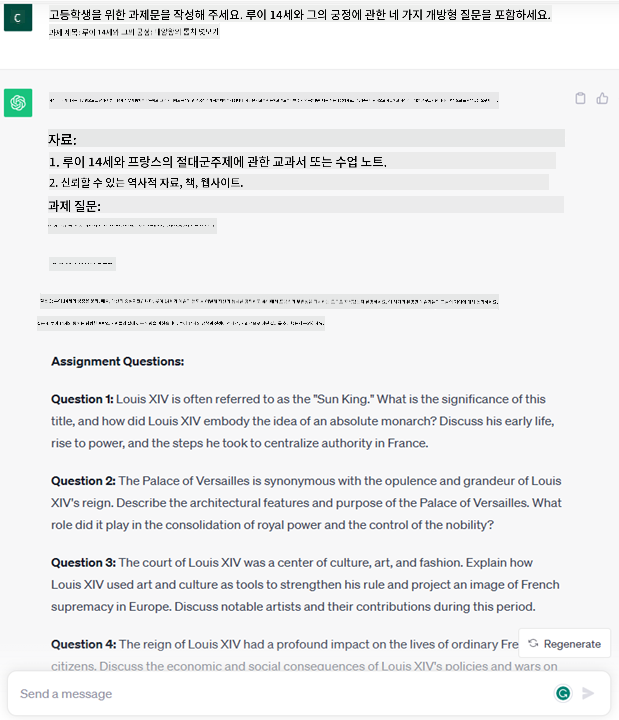
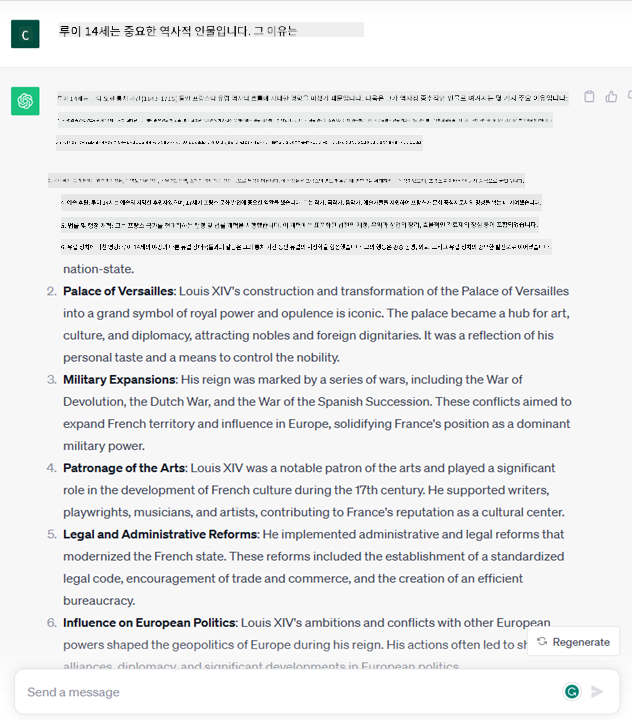
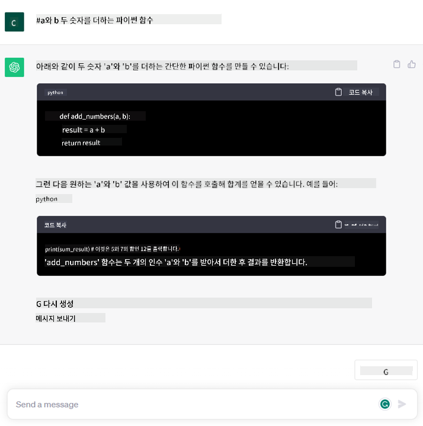

<!--
CO_OP_TRANSLATOR_METADATA:
{
  "original_hash": "f53ba0fa49164f9323043f1c6b11f2b1",
  "translation_date": "2025-07-09T07:46:28+00:00",
  "source_file": "01-introduction-to-genai/README.md",
  "language_code": "ko"
}
-->
# 생성 AI와 대형 언어 모델 소개

_(위 이미지를 클릭하면 이 수업의 영상을 볼 수 있습니다)_

생성 AI는 텍스트, 이미지 및 기타 유형의 콘텐츠를 생성할 수 있는 인공지능입니다. 이 기술이 놀라운 이유는 AI를 민주화하여 누구나 자연어로 작성한 간단한 문장, 즉 텍스트 프롬프트만으로 사용할 수 있게 했기 때문입니다. Java나 SQL 같은 프로그래밍 언어를 배울 필요 없이, 자신의 언어로 원하는 바를 말하면 AI 모델이 제안을 내놓습니다. 이 기술의 응용과 영향력은 매우 큽니다. 보고서를 작성하거나 이해하고, 애플리케이션을 작성하는 등 다양한 작업을 몇 초 만에 할 수 있습니다.

이 커리큘럼에서는 우리 스타트업이 생성 AI를 활용해 교육 분야에서 새로운 시나리오를 열어가는 방법과, 그 과정에서 발생하는 사회적 영향과 기술적 한계에 어떻게 대응하는지 살펴보겠습니다.

## 소개

이번 수업에서는 다음 내용을 다룹니다:

- 비즈니스 시나리오 소개: 우리 스타트업의 아이디어와 미션
- 생성 AI와 현재 기술 환경에 도달한 과정
- 대형 언어 모델의 내부 작동 원리
- 대형 언어 모델의 주요 기능과 실용 사례

## 학습 목표

이 수업을 마치면 다음을 이해할 수 있습니다:

- 생성 AI가 무엇인지, 대형 언어 모델이 어떻게 작동하는지
- 교육 시나리오를 중심으로 다양한 용도에서 대형 언어 모델을 어떻게 활용할 수 있는지

## 시나리오: 우리 교육 스타트업

생성 인공지능(AI)은 AI 기술의 정점으로, 과거에는 불가능하다고 여겨졌던 한계를 뛰어넘고 있습니다. 생성 AI 모델은 여러 기능과 응용 분야가 있지만, 이 커리큘럼에서는 가상의 스타트업을 통해 교육 분야에서 어떻게 혁신을 일으키고 있는지 살펴보겠습니다. 이 스타트업을 _우리 스타트업_이라고 부르겠습니다. 우리 스타트업은 교육 분야에서 다음과 같은 야심찬 미션을 가지고 있습니다.

> _전 세계적으로 학습 접근성을 개선하고, 교육의 공평한 기회를 보장하며, 학습자의 필요에 맞춘 개인화된 학습 경험을 제공하는 것_

우리 스타트업 팀은 이 목표를 달성하기 위해 현대에서 가장 강력한 도구 중 하나인 대형 언어 모델(LLM)을 활용하지 않고는 불가능하다는 것을 잘 알고 있습니다.

생성 AI는 오늘날 우리가 배우고 가르치는 방식을 혁신할 것으로 기대됩니다. 학생들은 24시간 언제든지 방대한 정보와 예시를 제공하는 가상 교사를 이용할 수 있고, 교사들은 혁신적인 도구를 활용해 학생들을 평가하고 피드백을 줄 수 있습니다.

우선, 이 커리큘럼 전반에 걸쳐 사용할 기본 개념과 용어를 정의해 보겠습니다.

## 생성 AI는 어떻게 탄생했을까?

최근 생성 AI 모델 발표로 인해 엄청난 _과대광고_가 있었지만, 이 기술은 수십 년에 걸쳐 발전해 왔으며, 최초 연구는 1960년대로 거슬러 올라갑니다. 현재 AI는 인간의 인지 능력, 예를 들어 [OpenAI ChatGPT](https://openai.com/chatgpt)나 [Bing Chat](https://www.microsoft.com/edge/features/bing-chat?WT.mc_id=academic-105485-koreyst)처럼 대화가 가능한 수준에 이르렀습니다. Bing Chat 역시 웹 검색 대화에 GPT 모델을 사용합니다.

조금 뒤로 돌아가 보면, 최초의 AI 프로토타입은 전문가 그룹에서 추출한 지식 기반을 컴퓨터에 입력해 만든 타자기식 챗봇이었습니다. 입력 텍스트에 나타난 키워드에 따라 지식 기반의 답변이 트리거되는 방식이었죠. 하지만 이런 방식은 확장성이 떨어진다는 점이 곧 명확해졌습니다.

### AI에 대한 통계적 접근: 머신러닝

90년대에 텍스트 분석에 통계적 접근법이 적용되면서 전환점이 찾아왔습니다. 머신러닝이라 불리는 새로운 알고리즘이 개발되어, 명시적으로 프로그래밍하지 않아도 데이터에서 패턴을 학습할 수 있게 되었습니다. 이 방법은 기계가 인간의 언어 이해를 모방할 수 있게 해줍니다. 통계 모델은 텍스트-레이블 쌍으로 학습되어, 미지의 입력 텍스트를 메시지 의도를 나타내는 사전 정의된 레이블로 분류할 수 있습니다.

### 신경망과 현대 가상 비서

최근 몇 년간, 더 많은 데이터와 복잡한 계산을 처리할 수 있는 하드웨어의 발전이 AI 연구를 촉진했고, 신경망 또는 딥러닝 알고리즘이라 불리는 고급 머신러닝 알고리즘이 개발되었습니다.

신경망(특히 순환 신경망, RNN)은 자연어 처리를 크게 향상시켜, 문장 내 단어의 맥락을 고려해 텍스트의 의미를 더 잘 표현할 수 있게 했습니다.

이 기술은 21세기 초에 등장한 가상 비서의 기반이 되었으며, 인간의 언어를 해석하고 필요를 파악해 미리 정해진 스크립트로 답하거나 제3자 서비스를 이용하는 등 행동을 수행하는 데 매우 능숙했습니다.

### 현재, 생성 AI

이렇게 해서 오늘날의 생성 AI에 이르게 되었으며, 이는 딥러닝의 하위 분야로 볼 수 있습니다.

수십 년간 AI 연구 끝에, _Transformer_라는 새로운 모델 구조가 RNN의 한계를 극복했습니다. Transformer는 훨씬 더 긴 텍스트 시퀀스를 입력으로 받을 수 있습니다. 이 모델은 어텐션 메커니즘을 기반으로 하여, 입력받은 정보 중 가장 중요한 부분에 ‘더 많은 주의’를 기울일 수 있습니다. 텍스트 순서와 상관없이 관련 정보에 가중치를 부여하는 방식입니다.

최근의 대부분 생성 AI 모델, 즉 대형 언어 모델(LLM)은 이 구조를 기반으로 합니다. 이 모델들은 책, 기사, 웹사이트 등 다양한 출처의 방대한 비라벨 데이터로 학습되었으며, 다양한 작업에 적응할 수 있고 문법적으로 올바른, 창의성이 느껴지는 텍스트를 생성할 수 있습니다. 즉, 입력 텍스트를 ‘이해’하는 능력을 크게 향상시켰을 뿐 아니라, 인간 언어로 독창적인 답변을 생성하는 능력도 갖추게 된 것입니다.

## 대형 언어 모델은 어떻게 작동할까?

다음 장에서는 다양한 생성 AI 모델 유형을 살펴보겠지만, 지금은 OpenAI GPT(Generative Pre-trained Transformer) 모델을 중심으로 대형 언어 모델이 어떻게 작동하는지 알아보겠습니다.

- **토크나이저, 텍스트를 숫자로 변환**: 대형 언어 모델은 텍스트를 입력받아 텍스트를 출력합니다. 하지만 통계 모델이기 때문에 텍스트 시퀀트보다 숫자를 더 잘 다룹니다. 그래서 모델에 입력되기 전에 토크나이저가 텍스트를 처리합니다. 토큰은 가변 길이의 문자 덩어리이며, 토크나이저의 주요 임무는 입력을 토큰 배열로 나누는 것입니다. 각 토큰은 토큰 인덱스라는 정수 인코딩으로 매핑됩니다.

- **출력 토큰 예측**: n개의 토큰을 입력받으면(최대 n은 모델마다 다름) 모델은 한 개의 토큰을 출력으로 예측합니다. 이 토큰은 다음 반복의 입력에 포함되어 점점 확장되는 창 패턴을 만듭니다. 덕분에 사용자는 한 문장 또는 여러 문장으로 된 답변을 받을 수 있습니다. 그래서 ChatGPT를 사용하다 보면 가끔 문장 중간에 멈추는 것처럼 보이는 경우가 있습니다.

- **선택 과정, 확률 분포**: 출력 토큰은 현재 텍스트 시퀀스 다음에 나올 확률에 따라 모델이 선택합니다. 모델은 훈련을 바탕으로 가능한 모든 ‘다음 토큰’에 대한 확률 분포를 예측합니다. 하지만 항상 가장 높은 확률의 토큰이 선택되는 것은 아닙니다. 일정 정도의 무작위성이 추가되어 모델이 비결정론적으로 작동합니다. 즉, 같은 입력에도 항상 똑같은 출력을 내지 않습니다. 이 무작위성은 창의적 사고 과정을 모방하기 위한 것이며, temperature라는 모델 매개변수로 조절할 수 있습니다.

## 우리 스타트업은 대형 언어 모델을 어떻게 활용할 수 있을까?

대형 언어 모델의 내부 작동 원리를 이해했으니, 이제 우리 비즈니스 시나리오에 맞춰 이 모델들이 잘 수행할 수 있는 대표적인 작업 예시를 살펴보겠습니다. 대형 언어 모델의 주요 기능은 _자연어로 작성된 텍스트 입력을 바탕으로 텍스트를 처음부터 생성하는 것_입니다.

그렇다면 어떤 종류의 텍스트 입력과 출력을 다룰까요? 대형 언어 모델의 입력은 프롬프트(prompt)라 불리며, 출력은 컴플리션(completion)이라 부릅니다. 컴플리션은 현재 입력을 완성하기 위해 다음 토큰을 생성하는 모델 메커니즘을 의미합니다. 프롬프트가 무엇인지, 어떻게 설계해야 모델을 최대한 활용할 수 있는지 자세히 다룰 예정이지만, 우선 프롬프트에는 다음과 같은 내용이 포함될 수 있습니다.

- 모델에게 기대하는 출력 유형을 명시하는 **지시문**. 때로는 예시나 추가 데이터가 포함되기도 합니다.

  1. 기사, 책, 제품 리뷰 등의 요약과 비정형 데이터에서 인사이트 추출
    
    
  
  2. 기사, 에세이, 과제 등의 창의적 아이디어 구상 및 작성
      
     

- 에이전트와의 대화 형식으로 묻는 **질문**
  
  

- 암묵적으로 글쓰기 지원을 요청하는 **완성할 텍스트 덩어리**
  
  

- 코드 덩어리와 함께 설명 및 문서화를 요청하거나, 특정 작업을 수행하는 코드를 생성해 달라는 주석
  
  

위 예시들은 매우 단순하며 대형 언어 모델의 모든 기능을 보여주려는 목적은 아닙니다. 다만 생성 AI, 특히 교육 분야에서의 잠재력을 보여주기 위한 것입니다.

또한 생성 AI 모델의 출력은 완벽하지 않으며, 때로는 모델의 창의성이 오히려 현실 왜곡이나 불쾌감을 줄 수 있는 결과를 낳기도 합니다. 생성 AI는 지능적이지 않습니다 — 적어도 비판적이고 창의적인 추론이나 감성 지능을 포함하는 더 포괄적인 의미의 지능은 아닙니다. 결정론적이지 않고 신뢰할 수 없으며, 잘못된 참조, 내용, 진술이 올바른 정보와 섞여 설득력 있고 자신감 있게 제시될 수 있습니다. 다음 수업에서는 이러한 한계들을 다루고 이를 완화할 수 있는 방법을 살펴보겠습니다.

## 과제

[생성 AI](https://en.wikipedia.org/wiki/Generative_artificial_intelligence?WT.mc_id=academic-105485-koreyst)에 대해 더 조사하고, 아직 생성 AI가 도입되지 않은 분야를 찾아보세요. 기존 방식과 비교해 어떤 점이 달라질지, 이전에는 할 수 없었던 일을 할 수 있게 되는지, 아니면 더 빨라지는지 생각해 보세요. 그리고 300단어 분량으로 “문제점”, “내가 AI를 활용하는 방법”, “영향” 등의 제목을 포함해 당신이 꿈꾸는 AI 스타트업에 대해 요약해 보세요. 선택적으로 사업 계획도 포함할 수 있습니다.

이 과제를 완료하면 Microsoft의 인큐베이터인 [Microsoft for Startups Founders Hub](https://www.microsoft.com/startups?WT.mc_id=academic-105485-koreyst)에 지원할 준비가 된 것일 수 있습니다. Azure, OpenAI, 멘토링 등 다양한 크레딧을 제공하니 꼭 확인해 보세요!

## 지식 점검

대형 언어 모델에 대해 옳은 것은?

1. 매번 똑같은 응답을 받는다.
2. 완벽하게 작동하며, 숫자 계산이나 코드 생성도 완벽하다.
3. 같은 프롬프트를 사용해도 응답이 달라질 수 있다. 텍스트나 코드 초안을 잘 만들어 주지만, 결과를 개선해야 한다.

정답: 3번. LLM은 비결정론적이며 응답이 달라질 수 있습니다. 온도 설정을 통해 변동성을 조절할 수 있습니다. 완벽한 결과를 기대하기보다는, 무거운 작업을 대신해 주는 도구로서 좋은 첫 시도를 제공하고, 사용자가 점차 개선해 나가는 방식입니다.

## 수고하셨습니다! 여정을 계속하세요

이 수업을 마친 후에는 [Generative AI Learning collection](https://aka.ms/genai-collection?WT.mc_id=academic-105485-koreyst)을 확인해 생성 AI 지식을 더욱 심화해 보세요!
Lesson 2로 이동하여 [다양한 LLM 유형을 탐색하고 비교하는 방법](../02-exploring-and-comparing-different-llms/README.md?WT.mc_id=academic-105485-koreyst)을 살펴보겠습니다!

**면책 조항**:  
이 문서는 AI 번역 서비스 [Co-op Translator](https://github.com/Azure/co-op-translator)를 사용하여 번역되었습니다. 정확성을 위해 노력하고 있으나, 자동 번역에는 오류나 부정확한 부분이 있을 수 있음을 유의하시기 바랍니다. 원문은 해당 언어의 원본 문서가 권위 있는 출처로 간주되어야 합니다. 중요한 정보의 경우 전문적인 인간 번역을 권장합니다. 본 번역 사용으로 인해 발생하는 오해나 잘못된 해석에 대해 당사는 책임을 지지 않습니다.