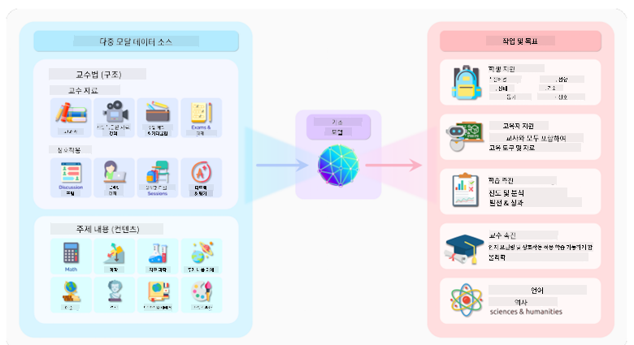
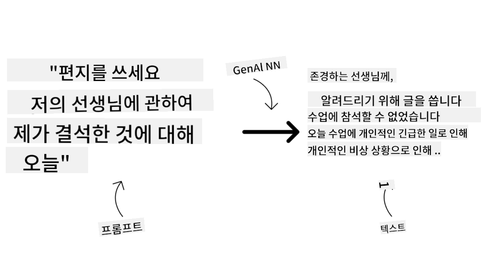
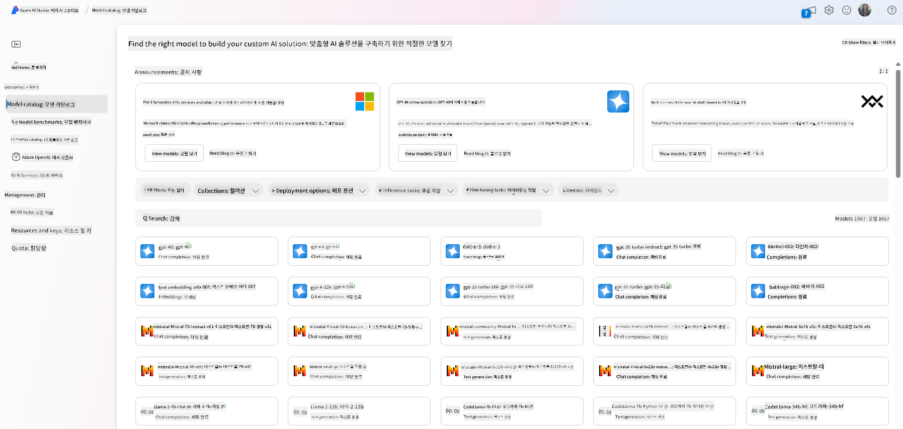
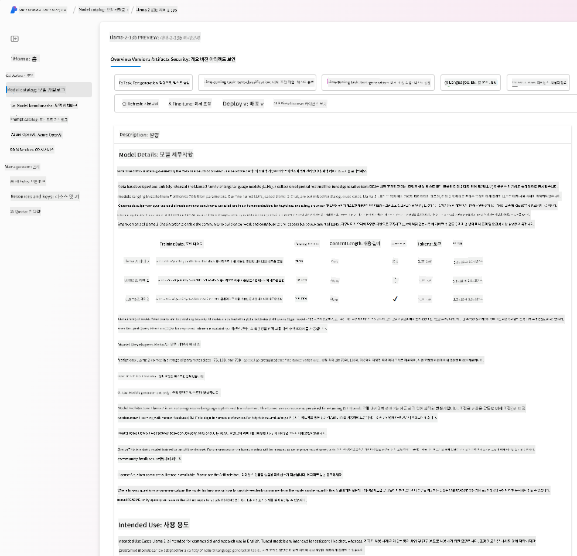
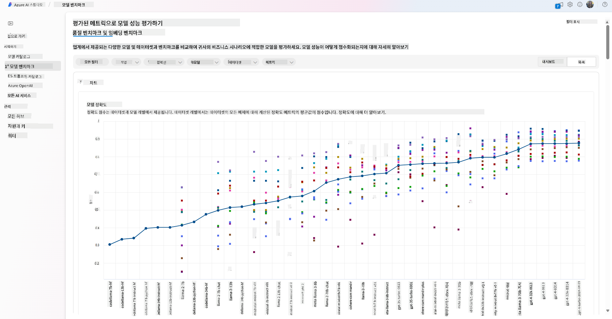
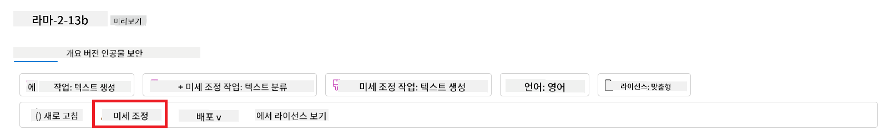
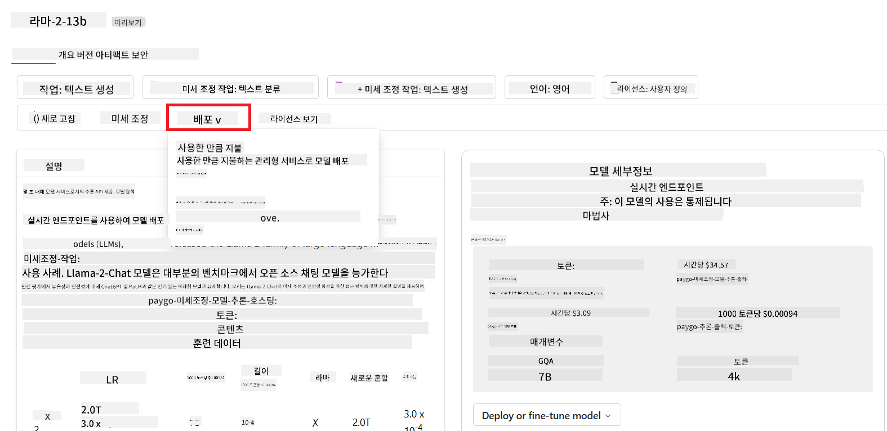

<!--
CO_OP_TRANSLATOR_METADATA:
{
  "original_hash": "e2f686f2eb794941761252ac5e8e090b",
  "translation_date": "2025-05-19T09:18:17+00:00",
  "source_file": "02-exploring-and-comparing-different-llms/README.md",
  "language_code": "ko"
}
-->
# 다양한 LLM 탐색 및 비교

> _위 이미지를 클릭하면 이 강의의 동영상을 볼 수 있습니다_

이전 강의에서는 생성 AI가 기술 지형을 어떻게 변화시키고 있는지, 대규모 언어 모델(LLM)이 어떻게 작동하는지, 그리고 우리 스타트업과 같은 기업이 이를 어떻게 활용하여 성장할 수 있는지를 알아보았습니다! 이번 장에서는 다양한 유형의 대규모 언어 모델(LLM)을 비교하고 대조하여 그 장단점을 이해하려고 합니다.

우리 스타트업의 다음 단계는 현재 LLM의 지형을 탐색하고 우리 사용 사례에 적합한 모델을 이해하는 것입니다.

## 소개

이 강의에서는 다음 내용을 다룹니다:

- 현재 지형의 다양한 LLM 유형.
- Azure에서 사용 사례에 맞는 다양한 모델 테스트, 반복 및 비교.
- LLM 배포 방법.

## 학습 목표

이 강의를 완료하면 다음을 수행할 수 있습니다:

- 사용 사례에 맞는 적절한 모델 선택.
- 모델의 성능을 테스트, 반복 및 개선하는 방법 이해.
- 기업이 모델을 배포하는 방법 이해.

## 다양한 유형의 LLM 이해하기

LLM은 아키텍처, 학습 데이터 및 사용 사례에 따라 여러 가지로 분류될 수 있습니다. 이러한 차이를 이해하면 우리 스타트업이 시나리오에 맞는 적절한 모델을 선택하고 성능을 테스트, 반복 및 개선하는 방법을 이해하는 데 도움이 됩니다.

LLM 모델은 매우 다양하며, 모델 선택은 사용 목적, 데이터, 예산 등에 따라 달라집니다.

텍스트, 오디오, 비디오, 이미지 생성 등 사용 목적에 따라 다른 유형의 모델을 선택할 수 있습니다.

- **오디오 및 음성 인식**. 이 목적에는 Whisper 유형의 모델이 일반적인 용도로 음성 인식을 목표로 하여 훌륭한 선택입니다. 다양한 오디오로 학습되어 다국어 음성 인식을 수행할 수 있습니다. [Whisper 유형 모델에 대해 자세히 알아보세요](https://platform.openai.com/docs/models/whisper?WT.mc_id=academic-105485-koreyst).

- **이미지 생성**. 이미지 생성에는 DALL-E와 Midjourney가 잘 알려진 선택입니다. DALL-E는 Azure OpenAI에서 제공합니다. [DALL-E에 대해 자세히 알아보세요](https://platform.openai.com/docs/models/dall-e?WT.mc_id=academic-105485-koreyst) 그리고 이 커리큘럼의 9장에서 더 알아보세요.

- **텍스트 생성**. 대부분의 모델은 텍스트 생성에 학습되며, GPT-3.5부터 GPT-4까지 다양한 선택지가 있습니다. 비용은 GPT-4가 가장 비쌉니다. [Azure OpenAI 플레이그라운드](https://oai.azure.com/portal/playground?WT.mc_id=academic-105485-koreyst)에서 기능과 비용 면에서 어떤 모델이 가장 적합한지 평가해보는 것이 좋습니다.

- **다중 모달리티**. 입력 및 출력에서 여러 유형의 데이터를 처리하려는 경우, [gpt-4 turbo with vision 또는 gpt-4o](https://learn.microsoft.com/azure/ai-services/openai/concepts/models#gpt-4-and-gpt-4-turbo-models?WT.mc_id=academic-105485-koreyst)와 같은 모델을 살펴보는 것이 좋습니다. 이는 자연어 처리와 시각적 이해를 결합하여 다중 모달 인터페이스를 통해 상호작용할 수 있습니다.

모델을 선택하는 것은 기본 기능을 얻는 것이지만, 이는 충분하지 않을 수 있습니다. 종종 회사 특정 데이터가 있어 이를 LLM에 전달해야 합니다. 이에 대한 접근 방법은 다음 섹션에서 더 다룹니다.

### 기초 모델 대 LLM

기초 모델이라는 용어는 [스탠포드 연구원들이](https://arxiv.org/abs/2108.07258?WT.mc_id=academic-105485-koreyst) 만들어낸 것으로, 다음과 같은 기준을 따르는 AI 모델로 정의됩니다:

- **비지도 학습 또는 자가 지도 학습을 사용하여 학습됨**, 즉 라벨이 없는 다중 모달 데이터를 사용하여 학습되며, 학습 과정에서 데이터에 대한 인간의 주석이나 라벨링이 필요하지 않음.
- **매우 큰 모델**, 수십억 개의 매개변수로 학습된 매우 깊은 신경망 기반.
- **다른 모델의 ‘기초’로 사용될 의도**, 즉 다른 모델이 이 위에 구축될 수 있는 시작점으로 사용될 수 있으며, 이는 미세 조정을 통해 이루어질 수 있음.

이미지 출처: [기초 모델 및 대규모 언어 모델에 대한 필수 가이드 | Babar M Bhatti | Medium
](https://thebabar.medium.com/essential-guide-to-foundation-models-and-large-language-models-27dab58f7404)

이 구분을 더 명확히 하기 위해, ChatGPT를 예로 들어보겠습니다. ChatGPT의 첫 번째 버전을 구축하기 위해 GPT-3.5라는 모델이 기초 모델로 사용되었습니다. 이는 OpenAI가 대화 시나리오, 예를 들어 챗봇에서 잘 수행되도록 GPT-3.5를 튜닝한 버전을 만들기 위해 일부 채팅 관련 데이터를 사용했음을 의미합니다.

이미지 출처: [2108.07258.pdf (arxiv.org)](https://arxiv.org/pdf/2108.07258.pdf?WT.mc_id=academic-105485-koreyst)

### 오픈 소스 대 독점 모델

LLM을 분류하는 또 다른 방법은 오픈 소스인지 독점적인지에 따라 나누는 것입니다.

오픈 소스 모델은 대중에게 공개되어 누구나 사용할 수 있는 모델입니다. 이러한 모델은 종종 모델을 만든 회사나 연구 커뮤니티에 의해 제공됩니다. 이러한 모델은 다양한 LLM 사용 사례에 맞게 검사, 수정 및 사용자 정의할 수 있습니다. 그러나 항상 생산 사용에 최적화되어 있지는 않으며, 독점 모델만큼 성능이 뛰어나지 않을 수 있습니다. 또한, 오픈 소스 모델에 대한 자금 지원은 제한적일 수 있으며, 장기적으로 유지되지 않거나 최신 연구로 업데이트되지 않을 수 있습니다. 인기 있는 오픈 소스 모델의 예로는 [Alpaca](https://crfm.stanford.edu/2023/03/13/alpaca.html?WT.mc_id=academic-105485-koreyst), [Bloom](https://huggingface.co/bigscience/bloom) 및 [LLaMA](https://llama.meta.com)가 있습니다.

독점 모델은 회사가 소유하고 대중에게 공개되지 않은 모델입니다. 이러한 모델은 종종 생산 사용에 최적화되어 있습니다. 그러나 다양한 사용 사례에 맞게 검사, 수정 또는 사용자 정의할 수 없습니다. 또한, 항상 무료로 제공되지는 않으며, 사용하려면 구독이나 결제가 필요할 수 있습니다. 또한, 모델을 학습하는 데 사용된 데이터에 대한 통제권이 없어 모델 소유자가 데이터 프라이버시와 AI의 책임 있는 사용을 보장해야 합니다. 인기 있는 독점 모델의 예로는 [OpenAI 모델](https://platform.openai.com/docs/models/overview?WT.mc_id=academic-105485-koreyst), [Google Bard](https://sapling.ai/llm/bard?WT.mc_id=academic-105485-koreyst) 또는 [Claude 2](https://www.anthropic.com/index/claude-2?WT.mc_id=academic-105485-koreyst)가 있습니다.

### 임베딩 대 이미지 생성 대 텍스트 및 코드 생성

LLM은 생성하는 출력에 따라 분류될 수도 있습니다.

임베딩은 텍스트를 숫자 형태로 변환할 수 있는 모델 세트로, 입력 텍스트의 숫자 표현인 임베딩이라고 합니다. 임베딩은 기계가 단어나 문장 간의 관계를 이해하는 데 도움이 되며, 분류 모델이나 클러스터링 모델과 같은 다른 모델의 입력으로 사용할 수 있습니다. 임베딩 모델은 종종 전이 학습에 사용되며, 데이터가 풍부한 대리 작업을 위해 모델을 구축한 후, 모델 가중치(임베딩)를 다른 다운스트림 작업에 재사용합니다. 이 카테고리의 예로는 [OpenAI 임베딩](https://platform.openai.com/docs/models/embeddings?WT.mc_id=academic-105485-koreyst)이 있습니다.

이미지 생성 모델은 이미지를 생성하는 모델입니다. 이러한 모델은 종종 이미지 편집, 이미지 합성 및 이미지 번역에 사용됩니다. 이미지 생성 모델은 종종 [LAION-5B](https://laion.ai/blog/laion-5b/?WT.mc_id=academic-105485-koreyst)와 같은 대규모 이미지 데이터 세트로 학습되며, 새로운 이미지를 생성하거나 인페인팅, 초해상도 및 컬러화 기술로 기존 이미지를 편집하는 데 사용할 수 있습니다. 예로는 [DALL-E-3](https://openai.com/dall-e-3?WT.mc_id=academic-105485-koreyst) 및 [Stable Diffusion 모델](https://github.com/Stability-AI/StableDiffusion?WT.mc_id=academic-105485-koreyst)이 있습니다.

텍스트 및 코드 생성 모델은 텍스트 또는 코드를 생성하는 모델입니다. 이러한 모델은 종종 텍스트 요약, 번역 및 질문 응답에 사용됩니다. 텍스트 생성 모델은 종종 [BookCorpus](https://www.cv-foundation.org/openaccess/content_iccv_2015/html/Zhu_Aligning_Books_and_ICCV_2015_paper.html?WT.mc_id=academic-105485-koreyst)와 같은 대규모 텍스트 데이터 세트로 학습되며, 새로운 텍스트를 생성하거나 질문에 답하는 데 사용할 수 있습니다. 코드 생성 모델은 [CodeParrot](https://huggingface.co/codeparrot?WT.mc_id=academic-105485-koreyst)과 같이 종종 GitHub와 같은 대규모 코드 데이터 세트로 학습되며, 새로운 코드를 생성하거나 기존 코드의 버그를 수정하는 데 사용할 수 있습니다.

### 인코더-디코더 대 디코더 전용

LLM의 다양한 아키텍처 유형에 대해 이야기하기 위해 비유를 사용해 봅시다.

매니저가 학생들을 위한 퀴즈를 작성하는 과제를 주었다고 상상해 보세요. 두 명의 동료가 있는데, 한 명은 콘텐츠를 생성하고 다른 한 명은 이를 검토합니다.

콘텐츠 생성자는 디코더 전용 모델과 같으며, 주제를 보고 이미 작성한 내용을 보고 이를 기반으로 코스를 작성할 수 있습니다. 이들은 매력적이고 유익한 콘텐츠를 작성하는 데 뛰어나지만, 주제와 학습 목표를 이해하는 데는 그다지 뛰어나지 않습니다. 디코더 모델의 예로는 GPT 계열 모델, 예를 들어 GPT-3가 있습니다.

검토자는 인코더 전용 모델과 같으며, 작성된 코스와 답변을 보고 그 관계를 이해하지만 콘텐츠 생성에는 능하지 않습니다. 인코더 전용 모델의 예로는 BERT가 있습니다.

퀴즈를 생성하고 검토할 수 있는 사람도 있다고 상상해 보세요, 이는 인코더-디코더 모델입니다. 예로는 BART와 T5가 있습니다.

### 서비스 대 모델

이제 서비스와 모델의 차이점에 대해 이야기해 봅시다. 서비스는 클라우드 서비스 제공자가 제공하는 제품으로, 종종 모델, 데이터 및 기타 구성 요소의 조합입니다. 모델은 서비스의 핵심 구성 요소로, 종종 LLM과 같은 기초 모델입니다.

서비스는 종종 생산 사용에 최적화되어 있으며, 그래픽 사용자 인터페이스를 통해 모델보다 사용하기 쉬운 경우가 많습니다. 그러나 서비스는 항상 무료로 제공되지는 않으며, 사용하려면 구독이나 결제가 필요할 수 있습니다. 서비스 소유자의 장비와 리소스를 활용하여 비용을 최적화하고 쉽게 확장할 수 있는 대가로 제공됩니다. 서비스의 예로는 [Azure OpenAI 서비스](https://learn.microsoft.com/azure/ai-services/openai/overview?WT.mc_id=academic-105485-koreyst)가 있으며, 사용량에 비례하여 사용자가 청구되는 요금제를 제공합니다. 또한, Azure OpenAI 서비스는 모델의 기능 위에 엔터프라이즈급 보안과 책임 있는 AI 프레임워크를 제공합니다.

모델은 매개변수, 가중치 등을 포함한 신경망 자체입니다. 회사가 로컬에서 실행할 수 있도록 허용하지만, 장비를 구입하고 확장할 구조를 구축하며 라이센스를 구입하거나 오픈 소스 모델을 사용해야 합니다. LLaMA와 같은 모델은 사용 가능하며, 모델을 실행하기 위한 컴퓨팅 파워가 필요합니다.

## Azure에서 성능을 이해하기 위해 다양한 모델을 테스트하고 반복하는 방법

우리 팀이 현재 LLM 지형을 탐색하고 시나리오에 적합한 후보를 식별한 후, 다음 단계는 데이터를 기반으로 모델을 테스트하고 작업 부하에 대해 테스트하는 것입니다. 이는 실험과 측정을 통해 수행되는 반복적인 과정입니다. 이전 단락에서 언급한 대부분의 모델(OpenAI 모델, Llama2와 같은 오픈 소스 모델, Hugging Face 트랜스포머)은 [Azure AI Studio](https://ai.azure.com/?WT.mc_id=academic-105485-koreyst)의 [모델 카탈로그](https://learn.microsoft.com/azure/ai-studio/how-to/model-catalog-overview?WT.mc_id=academic-105485-koreyst)에서 사용할 수 있습니다.

[Azure AI Studio](https://learn.microsoft.com/azure/ai-studio/what-is-ai-studio?WT.mc_id=academic-105485-koreyst)는 개발자가 생성 AI 애플리케이션을 구축하고 실험에서 평가까지 전체 개발 수명을 관리할 수 있도록 설계된 클라우드 플랫폼입니다. 모든 Azure AI 서비스를 단일 허브로 결합하여 편리한 GUI를 제공합니다. Azure AI Studio의 모델 카탈로그는 사용자가 다음을 수행할 수 있도록 합니다:

- 관심 있는 기초 모델을 카탈로그에서 찾기 - 독점적이든 오픈 소스든, 작업, 라이센스 또는 이름으로 필터링합니다. 검색성을 향상시키기 위해 모델은 Azure OpenAI 컬렉션, Hugging Face 컬렉션 등과 같은 컬렉션으로 조직됩니다.

- 모델 카드 검토, 의도된 사용 및 학습 데이터, 코드 샘플 및 내부 평가 라이브러리에 대한 평가 결과에 대한 자세한 설명 포함.

- 산업 내에서 사용 가능한 모델 및 데이터셋의 벤치마크를 비교하여 비즈니스 시나리오에 적합한 것을 평가하십시오. [Model Benchmarks](https://learn.microsoft.com/azure/ai-studio/how-to/model-benchmarks?WT.mc_id=academic-105485-koreyst) 창을 통해 가능합니다.

- Azure AI Studio의 실험 및 추적 기능을 활용하여 특정 작업 부하에서 모델 성능을 향상시키기 위해 사용자 정의 학습 데이터를 사용하여 모델을 미세 조정합니다.

- 원래의 사전 학습된 모델 또는 미세 조정된 버전을 원격 실시간 추론 - 관리 컴퓨트 - 또는 서버리스 API 엔드포인트 - [사용한 만큼 지불](https://learn.microsoft.com/azure/ai-studio/how-to/model-catalog-overview#model-deployment-managed-compute-and-serverless-api-pay-as-you-go?WT.mc_id=academic-105485-koreyst) - 로 배포하여 애플리케이션이 이를 소비할 수 있게 합니다.

> [!NOTE]
> 카탈로그의 모든 모델이 현재 미세 조정 및/또는 사용한 만큼 지불 배포를 지원하는 것은 아닙니다. 모델 카드에서 모델의 기능 및 제한 사항에 대한 세부 정보를 확인하세요.

## LLM 결과 개선하기

우리 스타트업 팀은 다양한 LLM과 클라우드 플랫폼(Azure Machine Learning)을 탐색하여 다양한 모델을 비교하고 테스트 데이터로 평가하며 성능을 개선하고 추론 엔드포인트에 배포할 수 있었습니다.

그러나 언제 모델을 미세 조정하는 것이 사전 학습된 모델을 사용하는 것보다 나을까요? 특정 작업 부하에서 모델 성능을 개선하기 위한 다른 접근 방법이 있을까요?

비즈니스가 LLM에서 원하는 결과를 얻기 위해 사용할 수 있는 몇 가지 접근 방식이 있습니다. LLM을 프로덕션에 배포할 때 다양한 유형의 모델을 선택할 수 있으며, 각기 다른 복잡성, 비용, 품질 수준을 갖습니다. 다음은 몇 가지 다른 접근 방식입니다:

- **컨텍스트를 활용한 프롬프트 엔지니어링**. 필요한 응답을 얻기 위해 프롬프트 시 충분한 컨텍스트를 제공하는 것입니다.

- **검색 증강 생성, RAG**. 데이터가 데이터베이스나 웹 엔드포인트에 존재할 수 있으며, 프롬프트 시 이 데이터나 그 일부가 포함되도록 하기 위해 관련 데이터를 가져와 사용자의 프롬프트에 포함시킬 수 있습니다.

- **미세 조정된 모델**. 여기서는 모델을 자체 데이터로 추가 학습하여 필요에 더 정확하고 응답성이 높아지지만 비용이 많이 들 수 있습니다.

이미지 출처: [기업이 LLM을 배포하는 네 가지 방법 | Fiddler AI 블로그](https://www.fiddler.ai/blog/four-ways-that-enterprises-deploy-llms?WT.mc_id=academic-105485-koreyst)

### 컨텍스트를 활용한 프롬프트 엔지니어링

사전 학습된 LLM은 일반화된 자연어 작업에서 매우 잘 작동하며, 문장 완성이나 질문과 같은 짧은 프롬프트로 호출할 때도 훌륭한 성능을 보입니다 - 이른바 "제로샷" 학습.

그러나 사용자가 자세한 요청과 예제 - 컨텍스트 - 를 통해 쿼리를 구성할수록 응답이 사용자 기대에 더 정확하고 가까워집니다. 프롬프트에 하나의 예제만 포함된 경우 "원샷" 학습이라고 하고, 여러 예제를 포함하면 "몇 샷" 학습이라고 합니다. 컨텍스트를 활용한 프롬프트 엔지니어링은 가장 비용 효율적인 접근 방식입니다.

### 검색 증강 생성 (RAG)

LLM은 학습 과정에서 사용된 데이터만을 이용해 답변을 생성할 수 있는 한계가 있습니다. 이는 학습 과정 이후에 발생한 사실에 대해 아무것도 알지 못하며, 비공개 정보(예: 회사 데이터)에 접근할 수 없음을 의미합니다.
이 문제는 RAG를 통해 극복할 수 있습니다. 이는 프롬프트 길이 제한을 고려하여 외부 데이터로 프롬프트를 증강하는 기술입니다. 다양한 미리 정의된 데이터 소스에서 유용한 문서 조각을 검색하여 프롬프트 컨텍스트에 추가하는 Vector 데이터베이스 도구(예: [Azure Vector Search](https://learn.microsoft.com/azure/search/vector-search-overview?WT.mc_id=academic-105485-koreyst))가 지원됩니다.

이 기술은 비즈니스가 충분한 데이터, 충분한 시간, 또는 LLM을 미세 조정할 자원이 없지만 특정 작업 부하에서 성능을 개선하고 현실 왜곡이나 유해한 콘텐츠의 위험을 줄이고자 할 때 매우 유용합니다.

### 미세 조정된 모델

미세 조정은 전이 학습을 활용하여 모델을 다운스트림 작업에 '적응'시키거나 특정 문제를 해결하는 과정입니다. 몇 샷 학습 및 RAG와 달리 새로운 모델이 생성되며, 업데이트된 가중치와 바이어스를 갖습니다. 이는 단일 입력(프롬프트)과 관련된 출력(완성)을 포함하는 학습 예제 세트를 필요로 합니다.
이 접근 방식은 다음과 같은 경우 선호됩니다:

- **미세 조정된 모델 사용**. 비즈니스가 높은 성능 모델 대신 임베딩 모델과 같은 덜 강력한 모델을 미세 조정하여 비용 효율적이고 빠른 솔루션을 원하는 경우.

- **지연 시간 고려**. 특정 사용 사례에서 지연 시간이 중요하며, 매우 긴 프롬프트를 사용할 수 없거나 모델이 학습해야 할 예제 수가 프롬프트 길이 제한에 맞지 않는 경우.

- **최신 상태 유지**. 비즈니스가 고품질 데이터와 진실 라벨을 많이 가지고 있으며, 시간이 지나면서 이 데이터를 최신 상태로 유지하기 위한 자원이 있는 경우.

### 학습된 모델

LLM을 처음부터 학습하는 것은 가장 어렵고 복잡한 접근 방식이며, 방대한 양의 데이터, 숙련된 자원, 적절한 계산 능력이 필요합니다. 이 옵션은 비즈니스가 도메인 특화 사용 사례와 많은 도메인 중심 데이터를 가지고 있는 시나리오에서만 고려되어야 합니다.

## 지식 점검

LLM 완성 결과를 개선하기 위한 좋은 접근 방식은 무엇일까요?

1. 컨텍스트를 활용한 프롬프트 엔지니어링
1. RAG
1. 미세 조정된 모델

A:3, 시간이 있고 자원과 고품질 데이터가 있다면 미세 조정이 최신 상태를 유지하기에 더 나은 옵션입니다. 그러나 개선이 필요하고 시간이 부족하다면 먼저 RAG를 고려할 가치가 있습니다.

## 🚀 도전

비즈니스에 [RAG 사용](https://learn.microsoft.com/azure/search/retrieval-augmented-generation-overview?WT.mc_id=academic-105485-koreyst)에 대해 더 알아보세요.

## 훌륭한 작업, 학습 계속하기

이 강의를 완료한 후, [Generative AI Learning collection](https://aka.ms/genai-collection?WT.mc_id=academic-105485-koreyst)을 확인하여 생성적 AI 지식을 계속 향상하세요!

3강으로 이동하여 [책임감 있게 생성적 AI 사용](../03-using-generative-ai-responsibly/README.md?WT.mc_id=academic-105485-koreyst)에 대해 알아보세요!

**면책 조항**:  
이 문서는 AI 번역 서비스 [Co-op Translator](https://github.com/Azure/co-op-translator)를 사용하여 번역되었습니다. 우리는 정확성을 위해 노력하지만 자동 번역에는 오류나 부정확성이 포함될 수 있음을 유의하시기 바랍니다. 원본 문서는 해당 언어로 작성된 권위 있는 출처로 간주되어야 합니다. 중요한 정보에 대해서는 전문적인 인간 번역을 권장합니다. 이 번역 사용으로 인해 발생하는 오해나 잘못된 해석에 대해서는 책임을 지지 않습니다.