<!--
CO_OP_TRANSLATOR_METADATA:
{
  "original_hash": "e2f686f2eb794941761252ac5e8e090b",
  "translation_date": "2025-06-25T10:24:46+00:00",
  "source_file": "02-exploring-and-comparing-different-llms/README.md",
  "language_code": "ko"
}
-->
# 다양한 LLM 탐색 및 비교

[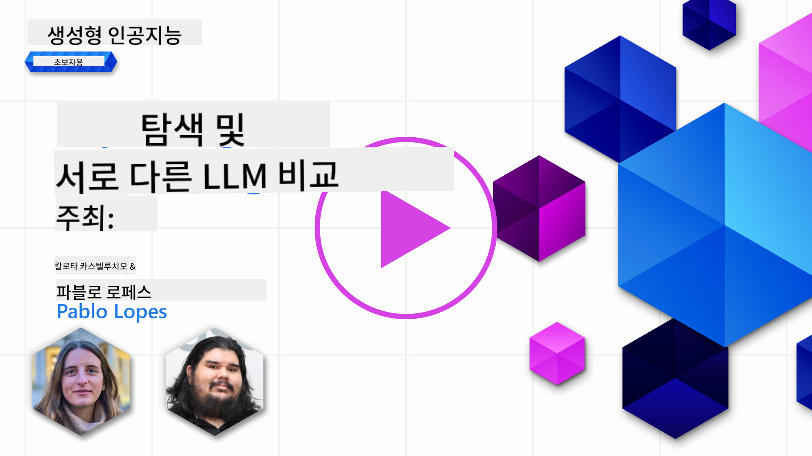](https://aka.ms/gen-ai-lesson2-gh?WT.mc_id=academic-105485-koreyst)

> _위의 이미지를 클릭하면 이 강의의 비디오를 볼 수 있습니다_

이전 강의에서는 생성 AI가 기술 환경을 어떻게 변화시키고 있는지, 대규모 언어 모델(LLM)이 어떻게 작동하는지, 그리고 우리 스타트업 같은 기업이 이를 어떻게 활용하여 성장할 수 있는지 살펴보았습니다! 이번 장에서는 다양한 유형의 대규모 언어 모델(LLM)을 비교하여 그 장단점을 이해하고자 합니다.

우리 스타트업의 다음 단계는 현재의 LLM 환경을 탐색하고 우리의 사용 사례에 적합한 모델을 이해하는 것입니다.

## 소개

이 강의에서는 다음을 다룹니다:

- 현재 환경에서의 다양한 유형의 LLM.
- Azure에서 사용 사례에 맞는 다양한 모델을 테스트, 반복, 비교하는 방법.
- LLM을 배포하는 방법.

## 학습 목표

이 강의를 완료하면 다음을 할 수 있습니다:

- 사용 사례에 맞는 적절한 모델 선택.
- 모델의 성능을 테스트, 반복, 개선하는 방법 이해.
- 기업이 모델을 배포하는 방법 알기.

## 다양한 유형의 LLM 이해하기

LLM은 그 아키텍처, 훈련 데이터 및 사용 사례에 따라 여러 범주로 나뉠 수 있습니다. 이러한 차이를 이해하면 우리 스타트업이 시나리오에 맞는 적절한 모델을 선택하고, 테스트 및 성능 개선 방법을 이해하는 데 도움이 됩니다.

LLM 모델은 매우 다양하며, 모델 선택은 사용 목적, 데이터, 지불 준비 정도 등에 따라 달라집니다.

모델을 텍스트, 오디오, 비디오, 이미지 생성 등에 사용하려는 경우, 다른 유형의 모델을 선택할 수 있습니다.

- **오디오 및 음성 인식**. 이 목적에는 Whisper 유형 모델이 적합합니다. Whisper 모델은 일반적인 용도로 사용되며 음성 인식에 특화되어 있습니다. 다양한 오디오에 대해 훈련되었으며 다국어 음성 인식을 수행할 수 있습니다. [Whisper 유형 모델에 대해 자세히 알아보기](https://platform.openai.com/docs/models/whisper?WT.mc_id=academic-105485-koreyst).

- **이미지 생성**. 이미지 생성에는 DALL-E와 Midjourney가 잘 알려져 있습니다. DALL-E는 Azure OpenAI에서 제공됩니다. [DALL-E에 대해 더 읽어보기](https://platform.openai.com/docs/models/dall-e?WT.mc_id=academic-105485-koreyst) 그리고 이 커리큘럼의 9장에서 더 알아보세요.

- **텍스트 생성**. 대부분의 모델은 텍스트 생성에 대해 훈련되었으며 GPT-3.5부터 GPT-4까지 다양한 선택지가 있습니다. GPT-4는 가장 비싼 모델입니다. [Azure OpenAI 플레이그라운드](https://oai.azure.com/portal/playground?WT.mc_id=academic-105485-koreyst)에서 능력과 비용 측면에서 어떤 모델이 가장 적합한지 평가해보세요.

- **멀티 모달리티**. 입력 및 출력에서 여러 유형의 데이터를 처리하려는 경우, [gpt-4 turbo with vision 또는 gpt-4o](https://learn.microsoft.com/azure/ai-services/openai/concepts/models#gpt-4-and-gpt-4-turbo-models?WT.mc_id=academic-105485-koreyst)와 같은 모델을 고려해볼 수 있습니다. 이는 자연어 처리와 시각적 이해를 결합하여 멀티 모달 인터페이스를 통해 상호작용할 수 있습니다.

모델을 선택하면 기본적인 기능을 얻을 수 있지만, 이것만으로는 충분하지 않을 수 있습니다. 종종 회사 특정 데이터를 LLM에 전달해야 할 필요가 있습니다. 이를 접근하는 방법에는 여러 가지가 있으며, 다음 섹션에서 더 자세히 설명합니다.

### 기초 모델 대 LLM

기초 모델이라는 용어는 [스탠포드 연구원에 의해 만들어졌습니다](https://arxiv.org/abs/2108.07258?WT.mc_id=academic-105485-koreyst) 그리고 다음과 같은 기준을 따르는 AI 모델로 정의됩니다:

- **비지도 학습 또는 자기 지도 학습을 사용하여 훈련됩니다**, 즉, 레이블이 없는 멀티 모달 데이터를 훈련하며, 데이터에 대한 인간의 주석이나 레이블이 필요하지 않습니다.
- **매우 큰 모델입니다**, 수십억 개의 매개변수로 훈련된 매우 깊은 신경망을 기반으로 합니다.
- **다른 모델의 '기초'로 사용되도록 의도됩니다**, 즉, 다른 모델이 그 위에 구축될 수 있는 시작점으로 사용될 수 있으며, 이는 미세 조정을 통해 가능합니다.

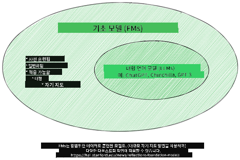

이미지 출처: [기초 모델과 대규모 언어 모델에 대한 필수 가이드 | Babar M Bhatti | Medium](https://thebabar.medium.com/essential-guide-to-foundation-models-and-large-language-models-27dab58f7404)

이 구분을 더 명확히 하기 위해 ChatGPT를 예로 들어보겠습니다. ChatGPT의 첫 번째 버전을 구축하기 위해, GPT-3.5라는 모델이 기초 모델로 사용되었습니다. 이는 OpenAI가 대화형 시나리오에서 잘 작동하도록 GPT-3.5를 튜닝하여 만든 특화된 버전임을 의미합니다.

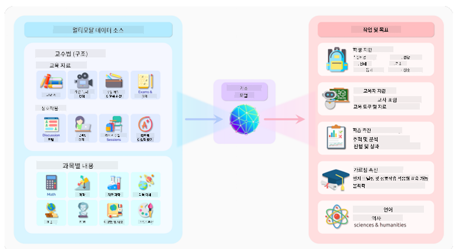

이미지 출처: [2108.07258.pdf (arxiv.org)](https://arxiv.org/pdf/2108.07258.pdf?WT.mc_id=academic-105485-koreyst)

### 오픈 소스 대 독점 모델

또 다른 LLM을 분류하는 방법은 그것들이 오픈 소스인지 독점적인지 여부입니다.

오픈 소스 모델은 대중에게 공개되어 누구나 사용할 수 있는 모델입니다. 종종 모델을 만든 회사나 연구 커뮤니티에 의해 공개됩니다. 이러한 모델은 다양한 LLM 사용 사례에 대해 검사, 수정, 사용자 정의가 허용됩니다. 그러나, 항상 생산 사용에 최적화되어 있지는 않으며, 독점 모델만큼 성능이 좋지 않을 수 있습니다. 또한, 오픈 소스 모델에 대한 자금 지원이 제한될 수 있으며, 장기적으로 유지되지 않거나 최신 연구로 업데이트되지 않을 수 있습니다. 인기 있는 오픈 소스 모델의 예로는 [Alpaca](https://crfm.stanford.edu/2023/03/13/alpaca.html?WT.mc_id=academic-105485-koreyst), [Bloom](https://huggingface.co/bigscience/bloom) 및 [LLaMA](https://llama.meta.com)가 있습니다.

독점 모델은 회사가 소유하고 대중에게 공개되지 않는 모델입니다. 이러한 모델은 종종 생산 사용에 최적화되어 있습니다. 그러나, 다양한 사용 사례에 대해 검사, 수정 또는 사용자 정의가 허용되지 않습니다. 또한, 항상 무료로 제공되지 않으며, 사용하려면 구독이나 지불이 필요할 수 있습니다. 또한, 모델을 훈련하는 데 사용된 데이터에 대한 통제권이 없으므로, 데이터 개인정보 보호 및 AI의 책임 있는 사용에 대한 모델 소유자의 약속을 신뢰해야 합니다. 인기 있는 독점 모델의 예로는 [OpenAI 모델](https://platform.openai.com/docs/models/overview?WT.mc_id=academic-105485-koreyst), [Google Bard](https://sapling.ai/llm/bard?WT.mc_id=academic-105485-koreyst) 또는 [Claude 2](https://www.anthropic.com/index/claude-2?WT.mc_id=academic-105485-koreyst)가 있습니다.

### 임베딩 대 이미지 생성 대 텍스트 및 코드 생성

LLM은 생성하는 출력에 따라 분류될 수도 있습니다.

임베딩은 텍스트를 임베딩이라는 수치 형태로 변환할 수 있는 모델 세트입니다. 임베딩은 기계가 단어 또는 문장 간의 관계를 이해하는 것을 더 쉽게 만들어주며, 다른 모델, 예를 들어 수치 데이터에서 더 나은 성능을 보이는 분류 모델이나 클러스터링 모델의 입력으로 사용될 수 있습니다. 임베딩 모델은 종종 전이 학습에 사용되며, 이 경우 대량의 데이터가 있는 대리 작업에 대해 모델이 구축되고, 그런 다음 모델 가중치(임베딩)가 다른 다운스트림 작업에 재사용됩니다. 이 범주의 예로는 [OpenAI 임베딩](https://platform.openai.com/docs/models/embeddings?WT.mc_id=academic-105485-koreyst)이 있습니다.

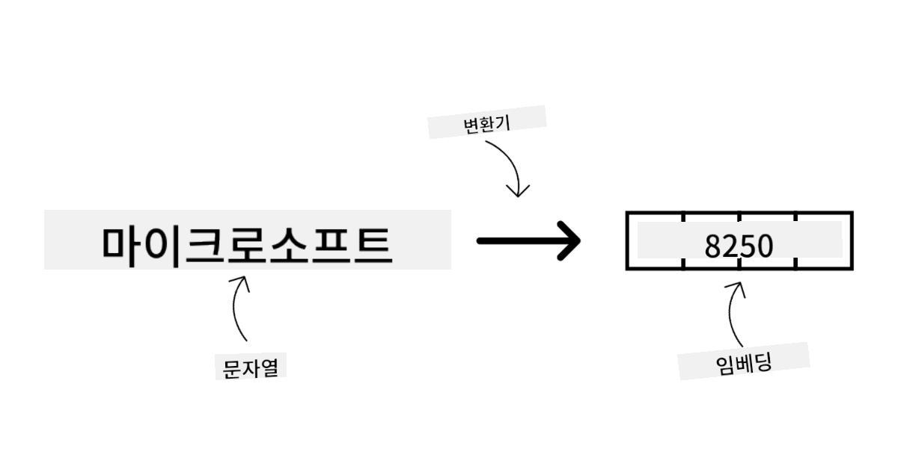

이미지 생성 모델은 이미지를 생성하는 모델입니다. 이러한 모델은 종종 이미지 편집, 이미지 합성 및 이미지 번역에 사용됩니다. 이미지 생성 모델은 종종 [LAION-5B](https://laion.ai/blog/laion-5b/?WT.mc_id=academic-105485-koreyst)와 같은 대규모 이미지 데이터셋에 대해 훈련되며, 새로운 이미지를 생성하거나 기존 이미지를 편집하는 데 사용될 수 있습니다. 예로는 [DALL-E-3](https://openai.com/dall-e-3?WT.mc_id=academic-105485-koreyst) 및 [Stable Diffusion 모델](https://github.com/Stability-AI/StableDiffusion?WT.mc_id=academic-105485-koreyst)이 있습니다.

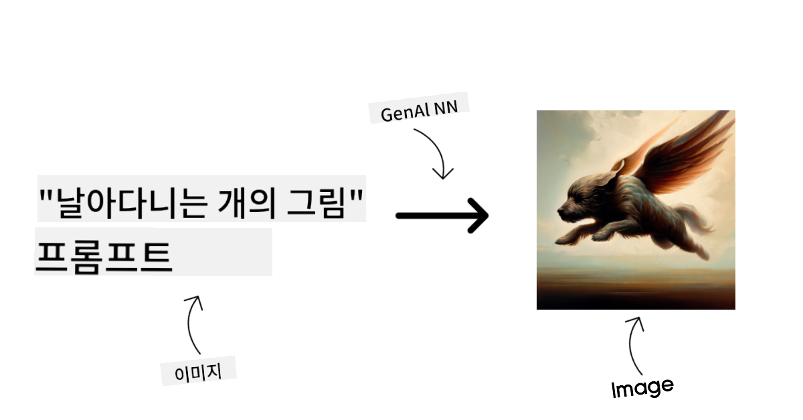

텍스트 및 코드 생성 모델은 텍스트 또는 코드를 생성하는 모델입니다. 이러한 모델은 종종 텍스트 요약, 번역 및 질문 응답에 사용됩니다. 텍스트 생성 모델은 종종 [BookCorpus](https://www.cv-foundation.org/openaccess/content_iccv_2015/html/Zhu_Aligning_Books_and_ICCV_2015_paper.html?WT.mc_id=academic-105485-koreyst)와 같은 대규모 텍스트 데이터셋에 대해 훈련되며, 새로운 텍스트를 생성하거나 질문에 답할 수 있습니다. 코드 생성 모델, 예를 들어 [CodeParrot](https://huggingface.co/codeparrot?WT.mc_id=academic-105485-koreyst),은 종종 GitHub와 같은 대규모 코드 데이터셋에 대해 훈련되며, 새로운 코드를 생성하거나 기존 코드의 버그를 수정하는 데 사용될 수 있습니다.

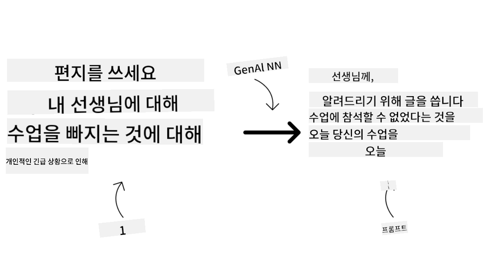

### 인코더-디코더 대 디코더 전용

LLM의 다양한 아키텍처 유형에 대해 이야기하기 위해 비유를 사용해보겠습니다.

매니저가 학생들을 위한 퀴즈를 작성하라는 과제를 주었다고 상상해보세요. 두 명의 동료가 있습니다; 한 명은 콘텐츠 생성, 다른 한 명은 검토를 담당합니다.

콘텐츠 생성자는 디코더 전용 모델과 같습니다. 그들은 주제를 보고 당신이 이미 작성한 내용을 확인한 다음, 그에 따라 코스를 작성할 수 있습니다. 그들은 매력적이고 유익한 콘텐츠를 작성하는 데 매우 능숙하지만, 주제와 학습 목표를 이해하는 데는 능숙하지 않습니다. 디코더 모델의 예로는 GPT 계열 모델, 예를 들어 GPT-3가 있습니다.

검토자는 인코더 전용 모델과 같습니다. 그들은 작성된 코스와 답변을 보고 그들 간의 관계를 이해하며 맥락을 이해하지만, 콘텐츠 생성에는 능숙하지 않습니다. 인코더 전용 모델의 예로는 BERT가 있습니다.

퀴즈를 생성하고 검토할 수 있는 사람도 있다고 상상해보세요. 이는 인코더-디코더 모델입니다. 예로는 BART와 T5가 있습니다.

### 서비스 대 모델

이제 서비스와 모델의 차이에 대해 이야기해보겠습니다. 서비스는 클라우드 서비스 제공자가 제공하는 제품이며, 종종 모델, 데이터 및 기타 구성 요소의 조합입니다. 모델은 서비스의 핵심 구성 요소이며, 종종 LLM과 같은 기초 모델입니다.

서비스는 종종 생산 사용에 최적화되어 있으며, 그래픽 사용자 인터페이스를 통해 모델보다 사용하기 더 쉽습니다. 그러나 서비스는 항상 무료로 제공되지 않으며, 사용하기 위해 구독이나 지불이 필요할 수 있습니다. 서비스 소유자의 장비 및 자원을 활용하여 비용을 최적화하고 쉽게 확장할 수 있습니다. 서비스의 예로는 [Azure OpenAI Service](https://learn.microsoft.com/azure/ai-services/openai/overview?WT.mc_id=academic-105485-koreyst)가 있으며, 이는 사용량에 비례하여 요금이 부과되는 요금제를 제공합니다. 또한, Azure OpenAI Service는 모델의 기능에 기업급 보안 및 책임 있는 AI 프레임워크를 제공합니다.

모델은 매개변수, 가중치 등을 포함한 신경망입니다. 회사가 로컬에서 실행할 수 있도록 허용하지만, 장비를 구매하고 확장 구조를 구축하며 라이선스를 구매하거나 오픈 소스 모델을 사용해야 합니다. LLaMA와 같은 모델은 사용이 가능하며, 모델을 실행하기 위해 계산 능력이 필요합니다.

## Azure에서 성능을 이해하기 위해 다양한 모델을 테스트하고 반복하는 방법

우리 팀이 현재의 LLM 환경을 탐색하고 시나리오에 적합한 후보를 찾았다면, 다음 단계는 데이터를 통해 그들을 테스트하는 것입니다. 이는 실험과 측정을 통해 이루어지는 반복적인 과정입니다. 이전 단락에서 언급한 대부분의 모델(OpenAI 모델, Llama2와 같은 오픈 소스 모델, Hugging Face 변환기)은 [Azure AI Studio](https://ai.azure.com/?WT.mc_id=academic-105485-koreyst)의 [모델 카탈로그](https://learn.microsoft.com/azure/ai-studio/how-to/model-catalog-overview?WT.mc_id=academic-105485-koreyst)에서 사용할 수 있습니다.

[Azure AI Studio](https://learn.microsoft.com/azure/ai-studio/what-is-ai-studio?WT.mc_id=academic-105485-koreyst)는 개발자가 생성 AI 애플리케이션을 구축하고 실험에서 평가까지의 전체 개발 수명 주기를 관리할 수 있도록 설계된 클라우드 플랫폼으로, 모든 Azure AI 서비스를 단일 허브에 결합하여 편리한 GUI를 제공합니다. Azure AI Studio의 모델 카탈로그는 사용자가 다음을 할 수 있게 합니다:

- 관심 있는 기초 모델을 카탈로그에서 찾기 - 독점적이든 오픈 소스든, 작업, 라이선스 또는 이름으로 필터링합니다. 검색성을 개선하기 위해 모델은 Azure OpenAI 컬렉션, Hugging Face 컬렉션 등과 같은 컬렉션으로 조직됩니다.

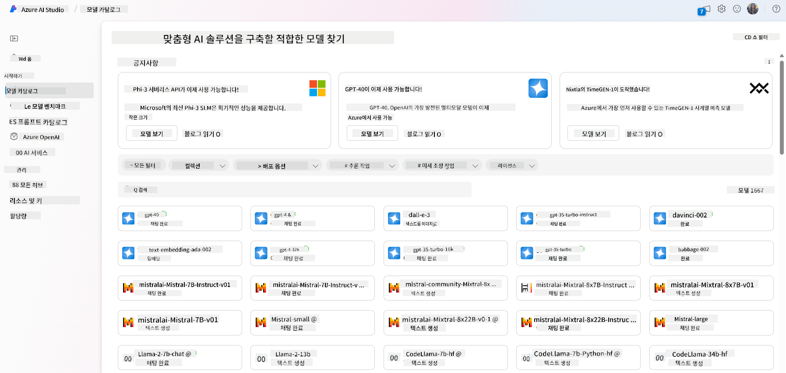

- 모델 카드 검토, 사용 의도 및 훈련 데이터에 대한 자세한 설명, 코드 샘플 및 내부 평가 라이브러리에 대한 평가 결과 포함.

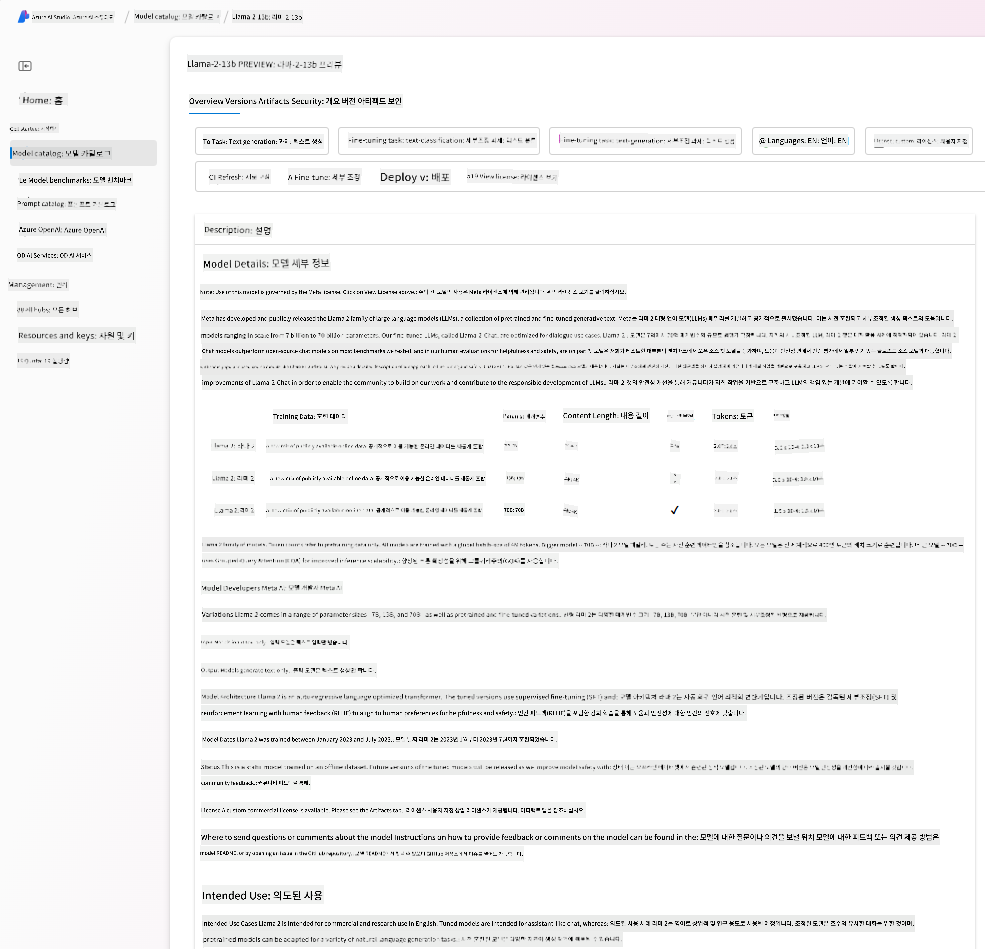
- 산업에서 사용 가능한 모델과 데이터셋 간의 벤치마크를 비교하여 비즈니스 시나리오에 적합한 모델을 평가합니다. [모델 벤치마크](https://learn.microsoft.com/azure/ai-studio/how-to/model-benchmarks?WT.mc_id=academic-105485-koreyst) 창을 통해 가능합니다.

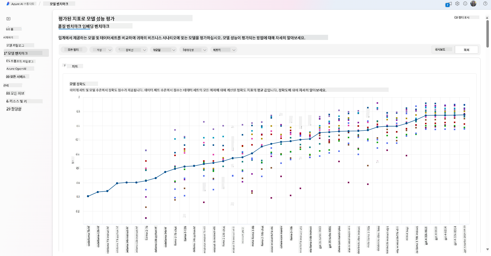

- 특정 작업에서 모델 성능을 향상시키기 위해 Azure AI Studio의 실험 및 추적 기능을 활용하여 맞춤형 학습 데이터로 모델을 미세 조정합니다.

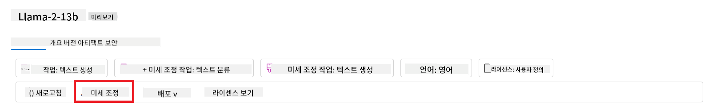

- 원래의 사전 학습된 모델 또는 미세 조정된 버전을 원격 실시간 추론 - 관리형 컴퓨팅 - 또는 서버리스 API 엔드포인트 - [사용량 기반 요금제](https://learn.microsoft.com/azure/ai-studio/how-to/model-catalog-overview#model-deployment-managed-compute-and-serverless-api-pay-as-you-go?WT.mc_id=academic-105485-koreyst) - 에 배포하여 애플리케이션이 이를 활용할 수 있게 합니다.

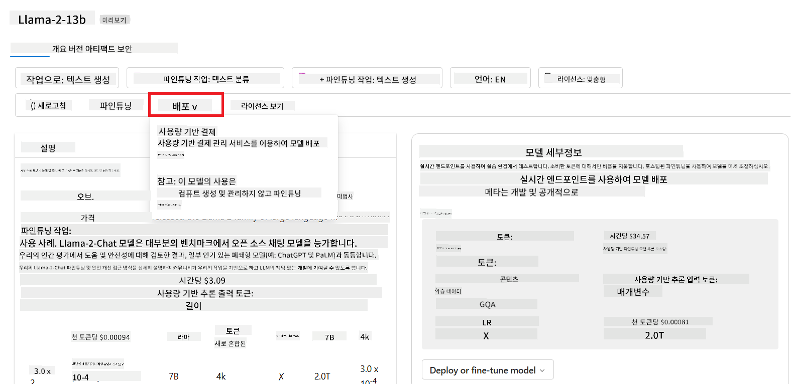

> [!NOTE]
> 카탈로그에 있는 모든 모델이 현재 미세 조정 및/또는 사용량 기반 요금제 배포에 사용할 수 있는 것은 아닙니다. 모델의 기능 및 제한 사항에 대한 세부 정보는 모델 카드를 확인하세요.

## LLM 결과 개선하기

스타트업 팀과 함께 다양한 종류의 LLM과 클라우드 플랫폼(Azure Machine Learning)을 탐색하여 다양한 모델을 비교하고, 테스트 데이터를 평가하며, 성능을 개선하고, 추론 엔드포인트에 배포할 수 있게 되었습니다.

그러나 언제 사전 학습된 모델을 사용하는 대신 모델을 미세 조정해야 할까요? 특정 작업에서 모델 성능을 개선할 수 있는 다른 접근 방식이 있을까요?

비즈니스가 LLM에서 필요한 결과를 얻기 위해 사용할 수 있는 여러 가지 접근 방식이 있습니다. LLM을 생산 환경에 배포할 때 다양한 수준의 학습을 가진 다양한 종류의 모델을 선택할 수 있으며, 복잡성, 비용, 품질이 다릅니다. 다음은 몇 가지 다른 접근 방식입니다:

- **컨텍스트를 활용한 프롬프트 엔지니어링**. 프롬프트를 제공할 때 필요한 응답을 얻을 수 있도록 충분한 컨텍스트를 제공하는 것입니다.

- **검색 증강 생성, RAG**. 예를 들어 데이터가 데이터베이스나 웹 엔드포인트에 존재할 수 있으며, 프롬프트 시 이 데이터 또는 일부를 포함시키기 위해 관련 데이터를 가져와 사용자의 프롬프트에 포함시킬 수 있습니다.

- **미세 조정된 모델**. 여기서는 모델을 추가로 학습시켜 더욱 정확하고 요구에 맞게 반응하지만 비용이 많이 들 수 있습니다.

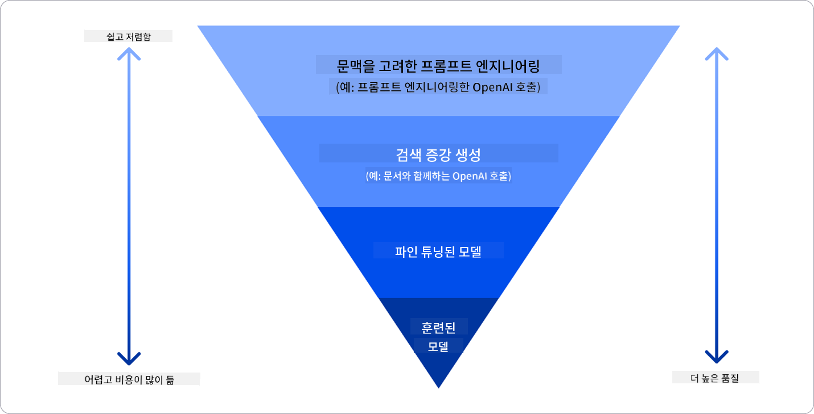

이미지 출처: [기업이 LLM을 배포하는 네 가지 방법 | Fiddler AI 블로그](https://www.fiddler.ai/blog/four-ways-that-enterprises-deploy-llms?WT.mc_id=academic-105485-koreyst)

### 컨텍스트를 활용한 프롬프트 엔지니어링

사전 학습된 LLM은 일반적인 자연어 작업에서 매우 잘 작동하며, 짧은 프롬프트로 호출하더라도 (문장을 완성하거나 질문을 하는 것과 같은) "제로 샷" 학습이라고 불립니다.

그러나 사용자가 자신의 요청을 더 자세하게 구성할수록, 즉 자세한 요청과 예시 - 컨텍스트 - 를 제공할수록 응답이 더 정확하고 사용자의 기대에 가까워집니다. 이 경우 프롬프트에 하나의 예시만 포함되면 "원샷" 학습이라고 하고, 여러 예시가 포함되면 "몇 샷" 학습이라고 합니다. 컨텍스트를 활용한 프롬프트 엔지니어링은 가장 비용 효율적인 접근 방식입니다.

### 검색 증강 생성 (RAG)

LLM은 훈련 중 사용된 데이터만을 사용하여 답변을 생성할 수 있다는 한계가 있습니다. 이는 훈련 과정 이후에 발생한 사실에 대해 아무것도 알지 못하며, 비공개 정보(예: 회사 데이터)에 접근할 수 없음을 의미합니다.
이러한 문제는 RAG를 통해 해결할 수 있으며, 프롬프트 길이 제한을 고려하여 외부 데이터를 문서의 청크 형태로 프롬프트에 증강하는 기술입니다. 이는 다양한 사전 정의된 데이터 소스에서 유용한 청크를 검색하여 프롬프트 컨텍스트에 추가하는 벡터 데이터베이스 도구(예: [Azure Vector Search](https://learn.microsoft.com/azure/search/vector-search-overview?WT.mc_id=academic-105485-koreyst))에 의해 지원됩니다.

이 기술은 비즈니스가 충분한 데이터, 충분한 시간 또는 LLM을 미세 조정할 자원이 없지만 특정 작업에서 성능을 개선하고 현실 왜곡 또는 유해한 콘텐츠의 위험을 줄이기를 원할 때 매우 유용합니다.

### 미세 조정된 모델

미세 조정은 전이 학습을 활용하여 모델을 다운스트림 작업에 '적응'시키거나 특정 문제를 해결하는 과정입니다. 몇 샷 학습과 RAG와 달리, 새로운 모델이 생성되며, 업데이트된 가중치와 편향이 있습니다. 이는 프롬프트(입력)와 관련된 출력(완성)으로 구성된 학습 예제 세트를 필요로 합니다.
다음과 같은 경우 선호되는 접근 방식이 될 수 있습니다:

- **미세 조정된 모델 사용**. 비즈니스는 고성능 모델 대신 덜 능력 있는 미세 조정된 모델(예: 임베딩 모델)을 사용하여 더 비용 효율적이고 빠른 솔루션을 원할 수 있습니다.

- **지연 시간 고려**. 특정 사용 사례에 지연 시간이 중요하여 매우 긴 프롬프트를 사용할 수 없거나 모델이 학습해야 할 예제 수가 프롬프트 길이 제한과 맞지 않는 경우.

- **최신 상태 유지**. 비즈니스가 많은 양질의 데이터와 정확한 라벨을 가지고 있으며, 시간이 지남에 따라 이 데이터를 최신 상태로 유지하는 데 필요한 자원을 보유하고 있는 경우.

### 훈련된 모델

LLM을 처음부터 훈련하는 것은 가장 어려운 접근 방식이며, 막대한 양의 데이터, 숙련된 자원, 적절한 컴퓨팅 파워가 필요합니다. 이 옵션은 비즈니스가 도메인별 사용 사례와 많은 도메인 중심 데이터를 가지고 있는 시나리오에서만 고려해야 합니다.

## 지식 점검

LLM 완성 결과를 개선하기 위한 좋은 접근 방식은 무엇일까요?

1. 컨텍스트를 활용한 프롬프트 엔지니어링
1. RAG
1. 미세 조정된 모델

A:3, 시간과 자원, 고품질 데이터가 있다면 미세 조정이 최신 상태를 유지하는 더 나은 옵션입니다. 그러나 개선을 원하면서 시간이 부족하다면 먼저 RAG를 고려할 가치가 있습니다.

## 🚀 도전

비즈니스에 [RAG를 사용하는 방법](https://learn.microsoft.com/azure/search/retrieval-augmented-generation-overview?WT.mc_id=academic-105485-koreyst)에 대해 더 읽어보세요.

## 훌륭한 작업, 학습을 계속하세요

이 수업을 완료한 후, 우리의 [생성 AI 학습 컬렉션](https://aka.ms/genai-collection?WT.mc_id=academic-105485-koreyst)을 확인하여 생성 AI 지식을 계속 향상시키세요!

Lesson 3으로 이동하여 [책임 있게 생성 AI 구축하기](../03-using-generative-ai-responsibly/README.md?WT.mc_id=academic-105485-koreyst)를 살펴보세요!

**면책 조항**:  
이 문서는 AI 번역 서비스 [Co-op Translator](https://github.com/Azure/co-op-translator)를 사용하여 번역되었습니다. 정확성을 위해 최선을 다하고 있지만, 자동 번역에는 오류나 부정확성이 포함될 수 있습니다. 원본 문서를 권위 있는 자료로 간주해야 합니다. 중요한 정보의 경우, 전문적인 인간 번역을 권장합니다. 이 번역의 사용으로 인해 발생하는 오해나 오역에 대해 당사는 책임을 지지 않습니다.