# 다양한 LLM 탐색 및 비교

[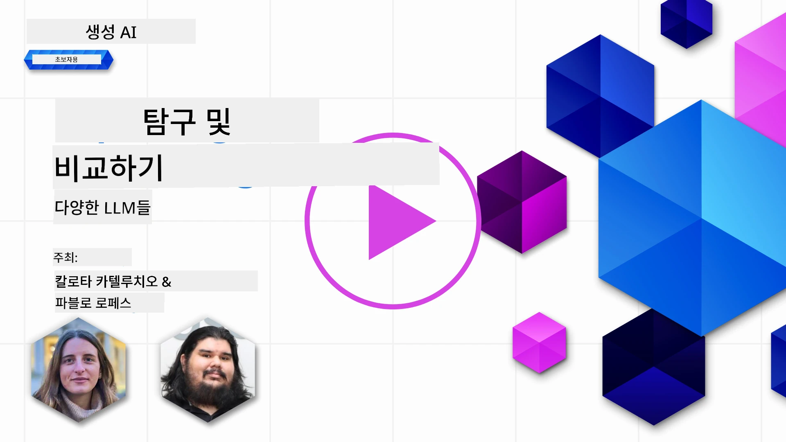](https://youtu.be/KIRUeDKscfI?si=8BHX1zvwzQBn-PlK)

> _비디오 강의를 보려면 위 이미지를 클릭하세요_

이전 강의에서 우리는 생성 AI가 기술 환경을 어떻게 변화시키고 있는지, 대형 언어 모델(LLM)이 어떻게 작동하는지, 그리고 스타트업과 같은 비즈니스가 이를 어떻게 활용해 성장할 수 있는지 살펴보았습니다! 이번 장에서는 다양한 유형의 대형 언어 모델(LLM)을 비교하고 대조하여 장단점을 이해해 보겠습니다.

우리 스타트업 여정의 다음 단계는 현재 LLM 환경을 탐색하고 우리 사례에 적합한 모델을 이해하는 것입니다.

## 소개

이 강의에서는 다음 내용을 다룹니다:

- 현재 환경에서의 다양한 유형의 LLM.
- Azure에서 다양한 모델을 테스트하고 반복하며 비교하는 방법.
- LLM 배포 방법.

## 학습 목표

이 강의를 완료하면 다음을 할 수 있게 됩니다:

- 사례에 적합한 모델 선택하기.
- 모델의 성능을 테스트, 반복 및 개선하는 방법 이해하기.
- 비즈니스가 모델을 어떻게 배포하는지 알기.

## 다양한 유형의 LLM 이해하기

LLM은 아키텍처, 학습 데이터, 사용 사례에 따라 여러 가지 분류가 가능합니다. 이러한 차이를 이해하면 스타트업이 적절한 모델을 선택하고, 테스트, 반복, 성능 개선 방법을 이해하는 데 도움이 됩니다.

LLM 모델에는 다양한 유형이 있으며, 모델 선택은 사용 목적, 데이터, 지불 가능 금액 등 여러 요소에 달려 있습니다.

텍스트, 오디오, 비디오, 이미지 생성 등 어떤 용도로 모델을 사용할지에 따라 다른 유형의 모델을 선택할 수 있습니다.

- **오디오 및 음성 인식**. Whisper 스타일 모델은 여전히 범용 음성 인식 모델로 유용하지만, 이제는 `gpt-4o-transcribe`, `gpt-4o-mini-transcribe` 등 최신 음성-텍스트 변환 모델과 발화자 분리(다이어리제이션) 변종도 선택지에 포함됩니다. 언어 지원 범위, 발화자 분리, 실시간 지원, 지연 시간, 비용 등을 평가하세요. 자세한 내용은 [OpenAI 음성-텍스트 문서](https://platform.openai.com/docs/guides/speech-to-text?WT.mc_id=academic-105485-koreyst)를 참고하세요.

- **이미지 생성**. DALL-E와 Midjourney가 잘 알려진 이미지 생성 옵션이지만, 현재 OpenAI 이미지 API는 `gpt-image-2` 같은 GPT 이미지 모델 중심이며, Stable Diffusion, Imagen, Flux 등의 모델 계열도 많이 사용됩니다. 프롬프트 준수, 편집 지원, 스타일 제어, 안전 요구사항, 라이선싱을 비교하세요. 자세한 내용은 [OpenAI 이미지 생성 가이드](https://platform.openai.com/docs/guides/images?WT.mc_id=academic-105485-koreyst)와 이 커리큘럼 9장을 참고하세요.

- **텍스트 생성**. 텍스트 모델은 첨단 모델, 추론 모델, 소형 저지연 모델, 오픈 웨이트 모델 등 다양합니다. 현재 예로는 OpenAI GPT-5.x 모델, Anthropic Claude 4.x 모델, Google Gemini 3.x 모델, Meta Llama 4 모델, Mistral 모델 등이 있습니다. 단순히 출시일이나 가격으로만 선택하지 마시고, 작업 품질, 지연 시간, 컨텍스트 창, 도구 사용, 안전 행동, 지역별 이용 가능성, 전체 비용을 비교하세요. [Microsoft Foundry 모델 카탈로그](https://ai.azure.com/catalog?WT.mc_id=academic-105485-koreyst)는 Azure에서 이용 가능한 모델 비교에 좋은 출처입니다.

- <strong>멀티모달리티</strong>. 많은 최신 모델이 텍스트 이상의 입력을 처리할 수 있습니다. 일부는 이미지, 오디오, 비디오 입력을 받으며, 도구 호출이 가능하고, 전문화된 모델은 이미지, 오디오, 비디오를 생성할 수 있습니다. 예를 들어, 현재 OpenAI 모델은 텍스트와 이미지 입력을 지원하고, Gemini 모델은 변형에 따라 텍스트, 코드, 이미지, 오디오, 비디오 입력을 지원하며, Llama 4 Scout 및 Maverick는 오픈 웨이트의 본질적 멀티모달 모델입니다. 워크플로우 구축 전 각 모델 카드에서 지원하는 입력과 출력 형태를 반드시 확인하세요.

모델을 선택한다는 것은 기본적인 기능을 얻는 것을 의미하지만, 이는 충분하지 않을 수 있습니다. 종종 회사별 특정 데이터를 LLM에 알려야 하는데, 이를 접근하는 몇 가지 방법이 있습니다. 이에 대해서는 다음 섹션에서 더 다룹니다.

### Foundation Models와 LLM 차이

Foundation Model이라는 용어는 [스탠포드 연구진에 의해 만들어졌으며](https://arxiv.org/abs/2108.07258?WT.mc_id=academic-105485-koreyst), 다음과 같은 기준을 충족하는 AI 모델로 정의됩니다:

- <strong>비지도 학습 또는 자기지도 학습</strong>으로 훈련됨: 레이블 없는 다중 모달 데이터를 기반으로 훈련되며, 학습 과정에 인력에 의한 주석이나 라벨이 필요하지 않습니다.
- **아주 큰 모델**: 수십억 개의 파라미터를 가진 매우 깊은 신경망 기반입니다.
- **주로 다른 모델들의 ‘기초’ 역할 수행**: 미세 조정을 통해 다른 모델이 구축될 수 있는 출발점으로 활용됩니다.

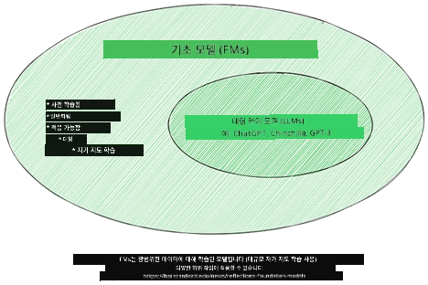

이미지 출처: [Essential Guide to Foundation Models and Large Language Models | by Babar M Bhatti | Medium
](https://thebabar.medium.com/essential-guide-to-foundation-models-and-large-language-models-27dab58f7404)

이 차이를 더 명확히 하기 위해, 역사적 예로 ChatGPT를 볼 수 있습니다. 초기 ChatGPT 버전은 GPT-3.5를 기반 모델로 사용했으며, OpenAI는 이후 챗봇 같은 대화 시나리오에서 더 나은 성능을 내도록 특정 대화 데이터와 정렬 기법을 적용해 튜닝된 버전을 만들었습니다. 현대 AI 서비스는 여러 모델 변형을 경유하기 때문에, 서비스 이름과 기본 모델 이름이 항상 동일하지는 않습니다.

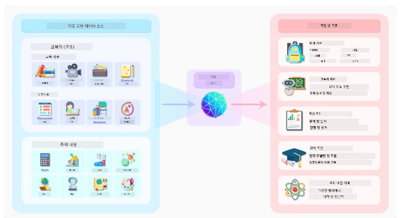

이미지 출처: [2108.07258.pdf (arxiv.org)](https://arxiv.org/pdf/2108.07258.pdf?WT.mc_id=academic-105485-koreyst)

### 오픈 웨이트/오픈 소스와 독점 모델 차이

또 다른 분류 기준은 LLM이 오픈 웨이트, 오픈 소스, 혹은 독점 모델인지 여부입니다.

오픈 소스 및 오픈 웨이트 모델은 모델 산출물을 검사, 다운로드, 맞춤화할 수 있지만 라이선스 조건이 다릅니다. 일부는 완전 오픈 소스이고, 일부는 사용 제한이 있는 오픈 웨이트 모델입니다. 비즈니스가 배포, 데이터 위치, 비용, 맞춤화에 더 많은 제어가 필요할 때 유용합니다. 다만, 실제 운영 전에 라이선스 조건, 제공 비용, 유지보수, 보안 업데이트, 평가 품질 등을 반드시 검토해야 합니다. 예로는 [Meta Llama 4](https://ai.meta.com/blog/llama-4-multimodal-intelligence/?WT.mc_id=academic-105485-koreyst), 일부 [Mistral 모델](https://docs.mistral.ai/models/overview?WT.mc_id=academic-105485-koreyst), 그리고 [Hugging Face](https://huggingface.co/models?WT.mc_id=academic-105485-koreyst)에서 호스팅되는 여러 모델이 있습니다.

독점 모델은 제공자가 소유하고 호스팅합니다. 이러한 모델은 관리형 생산 사용에 최적화되어 강력한 지원, 안전 시스템, 도구 통합, 확장성을 제공할 수 있습니다. 다만, 고객은 모델 웨이트를 검사하거나 수정할 수 없으며, 제공자의 개인정보, 보관, 준수, 허용 사용 조건을 반드시 확인해야 합니다. 예로는 [OpenAI 모델](https://platform.openai.com/docs/models?WT.mc_id=academic-105485-koreyst), [Google Gemini](https://deepmind.google/models/gemini/pro/?WT.mc_id=academic-105485-koreyst), [Anthropic Claude](https://platform.claude.com/docs/en/about-claude/models/overview?WT.mc_id=academic-105485-koreyst)가 있습니다.

### 임베딩과 이미지 생성, 텍스트 및 코드 생성 비교

LLM은 생성하는 출력 형태에 따라 분류할 수도 있습니다.

임베딩은 텍스트를 임베딩이라 부르는 수치 형태로 변환하는 모델군입니다. 임베딩은 기계가 단어 또는 문장 간의 관계를 이해하기 쉽게 하며, 분류 모델이나 군집화 모델과 같이 수치 데이터에서 나은 성능을 내는 모델들이 입력으로 사용할 수 있습니다. 임베딩 모델은 종종 전이 학습에 사용되며, 대량의 데이터가 있는 대리 작업에 대해 모델을 구축한 후 해당 모델 가중치(임베딩)를 다른 하위 작업에 재활용합니다. 이 범주의 예는 [OpenAI 임베딩](https://platform.openai.com/docs/models/embeddings?WT.mc_id=academic-105485-koreyst)입니다.

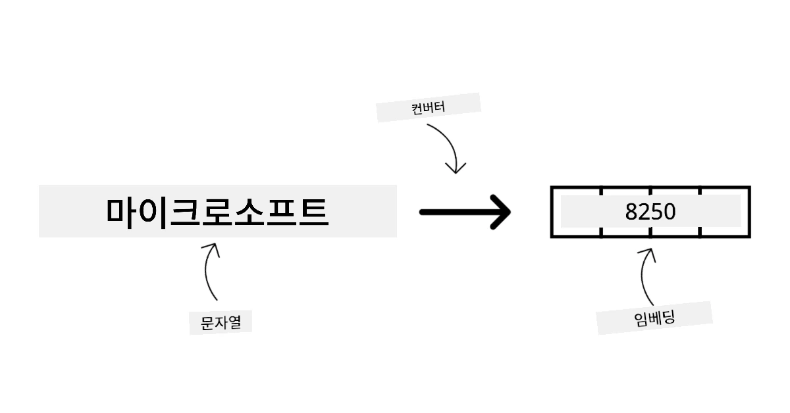

이미지 생성 모델은 이미지를 생성하는 모델입니다. 이 모델은 주로 이미지 편집, 합성, 번역에 사용되며, [LAION-5B](https://laion.ai/blog/laion-5b/?WT.mc_id=academic-105485-koreyst) 같은 대규모 이미지 데이터셋에서 학습되었습니다. 새 이미지를 생성하거나 인페인팅, 초해상도, 컬러라이징 기법으로 기존 이미지를 편집할 수 있습니다. 예로 [GPT 이미지 모델](https://platform.openai.com/docs/guides/images?WT.mc_id=academic-105485-koreyst), [Stable Diffusion 모델](https://github.com/Stability-AI/StableDiffusion?WT.mc_id=academic-105485-koreyst), Imagen 모델이 있습니다.

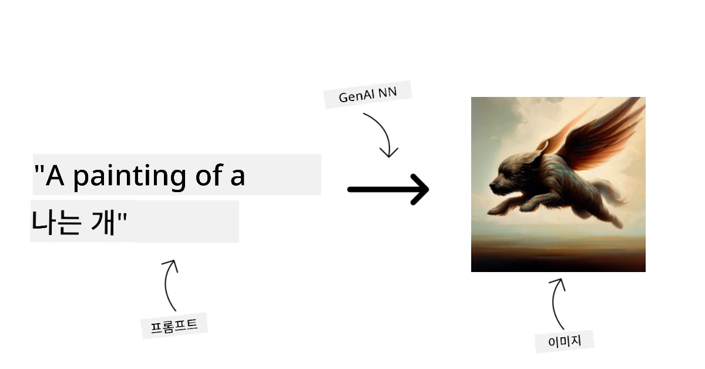

텍스트 및 코드 생성 모델은 텍스트나 코드를 생성하는 모델입니다. 주로 텍스트 요약, 번역, 질문 응답에 사용됩니다. 텍스트 생성 모델은 [BookCorpus](https://www.cv-foundation.org/openaccess/content_iccv_2015/html/Zhu_Aligning_Books_and_ICCV_2015_paper.html?WT.mc_id=academic-105485-koreyst) 같은 대규모 텍스트 데이터셋에서 학습하고, 새 텍스트 생성이나 질문에 답하는 데 사용됩니다. 코드 생성 모델은 [CodeParrot](https://huggingface.co/codeparrot?WT.mc_id=academic-105485-koreyst)처럼 GitHub 같은 대규모 코드 데이터셋에서 학습하며, 새 코드 생성 또는 기존 코드의 버그 수정에 활용됩니다.

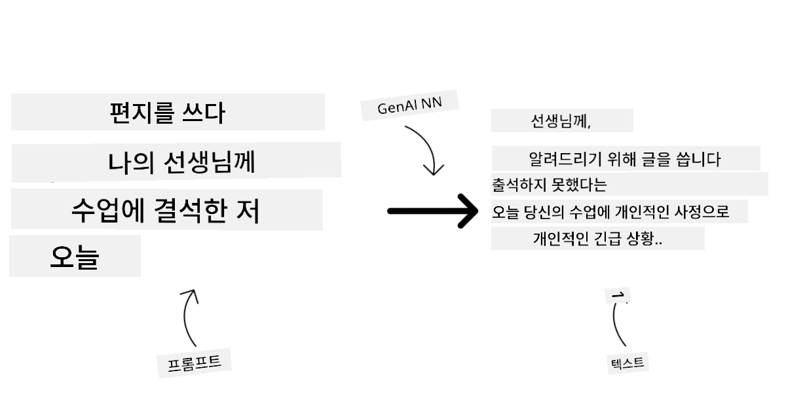

### 인코더-디코더와 디코더 전용 모델

LLM의 다양한 아키텍처 유형을 설명하기 위해 유추를 사용해 보겠습니다.

매니저가 학생들을 위한 퀴즈 작성 작업을 부여했다고 가정합시다. 동료 두 명이 있는데, 한 명은 콘텐츠 생성, 다른 한 명은 검토를 담당합니다.

콘텐츠 생성자는 디코더 전용 모델과 같습니다: 주어진 주제를 보고 이미 작성한 내용을 참고하여 그 맥락에 기반해 내용을 계속 생성합니다. 흥미롭고 유익한 콘텐츠 작성에 뛰어나지만, 정보 분류, 검색, 인코딩 작업에는 항상 최적이 아닙니다. 디코더 전용 모델 예시는 GPT 및 Llama 모델입니다.

검토자는 인코더 전용 모델과 같으며, 작성된 내용과 답변을 보고 관계를 파악하고 맥락을 이해하지만, 직접 콘텐츠를 생성하는 데는 적합하지 않습니다. 인코더 전용 모델 예시는 BERT입니다.

콘텐츠 생성과 검토를 모두 수행할 수 있는 사람이 있다고 상상해 보세요. 이것이 인코더-디코더 모델입니다. 예시로는 BART와 T5가 있습니다.

### 서비스와 모델의 차이

이제 서비스와 모델의 차이점을 이야기해봅시다. 서비스는 클라우드 서비스 제공자가 제공하는 제품으로, 보통 여러 모델, 데이터, 구성요소를 결합한 것입니다. 모델은 서비스의 핵심 구성 요소로, 보통 LLM과 같은 기초 모델입니다.

서비스는 생산용으로 최적화되어 있고, 그래픽 사용자 인터페이스를 통해 모델보다 사용하기 쉬운 경우가 많습니다. 하지만 서비스는 항상 무료가 아니며, 구독이나 사용량 기반 과금이 있을 수 있습니다. 이는 서비스를 제공하는 업체의 장비와 자원을 활용하고, 비용을 최적화하며, 확장성을 쉽게 하는 대가입니다. 예로는 사용량 기반 과금제를 제공하는 [Azure OpenAI 서비스](https://learn.microsoft.com/azure/ai-foundry/openai/overview?WT.mc_id=academic-105485-koreyst)가 있습니다. Azure OpenAI 서비스는 또한 엔터프라이즈급 보안과 책임 있는 AI 프레임워크를 제공합니다.

모델은 신경망 산출물: 파라미터, 웨이트, 아키텍처, 토크나이저, 지원 구성 요소입니다. 로컬 또는 프라이빗 환경에서 모델을 실행하려면 적절한 하드웨어, 서빙 인프라, 모니터링이 필요하며, 호환 가능한 오픈 소스/오픈 웨이트 라이선스 또는 상업용 라이선스가 필요합니다. Llama 4나 Mistral 같은 오픈 웨이트 모델은 자체 호스팅할 수 있지만, 여전히 계산 능력과 운영 전문 지식이 요구됩니다.

## Azure에서 다양한 모델을 테스트하고 반복하여 성능 이해하기

우리 팀이 현재 LLM(대형 언어 모델) 환경을 탐색하고 시나리오에 적합한 후보를 선정했다면, 다음 단계는 해당 데이터와 작업 부하에서 모델을 테스트하는 것입니다. 이것은 실험과 측정을 통해 수행되는 반복적인 과정입니다.
이전 단락에서 언급한 대부분의 모델(OpenAI 모델, Llama 4 및 Mistral 같은 오픈 웨이트 모델, Hugging Face 모델)은 [Microsoft Foundry Models](https://learn.microsoft.com/azure/foundry/concepts/foundry-models-overview?WT.mc_id=academic-105485-koreyst)에서 이용할 수 있습니다.

[Microsoft Foundry](https://learn.microsoft.com/azure/foundry/what-is-foundry?WT.mc_id=academic-105485-koreyst)는 이전의 Azure AI Studio/Azure AI Foundry였으며, AI 애플리케이션 및 에이전트를 구축하기 위한 통합 Azure 플랫폼입니다. 이는 개발자가 실험 및 평가에서 배포, 모니터링, 거버넌스에 이르기까지 수명 주기를 관리할 수 있도록 돕습니다. Microsoft Foundry의 모델 카탈로그를 통해 사용자는 다음을 할 수 있습니다:

- Azure가 판매하는 모델과 파트너 및 커뮤니티 제공자의 모델을 포함하여 카탈로그에서 관심 있는 기본 모델을 찾을 수 있습니다. 사용자는 작업, 제공자, 라이선스, 배포 옵션 또는 이름별로 필터링할 수 있습니다.

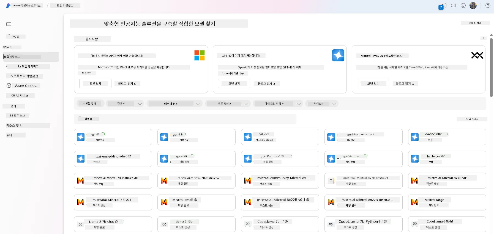

- 모델 카드(의도된 사용과 학습 데이터에 대한 상세 설명, 코드 샘플 및 내부 평가 라이브러리의 평가 결과 포함)를 검토할 수 있습니다.

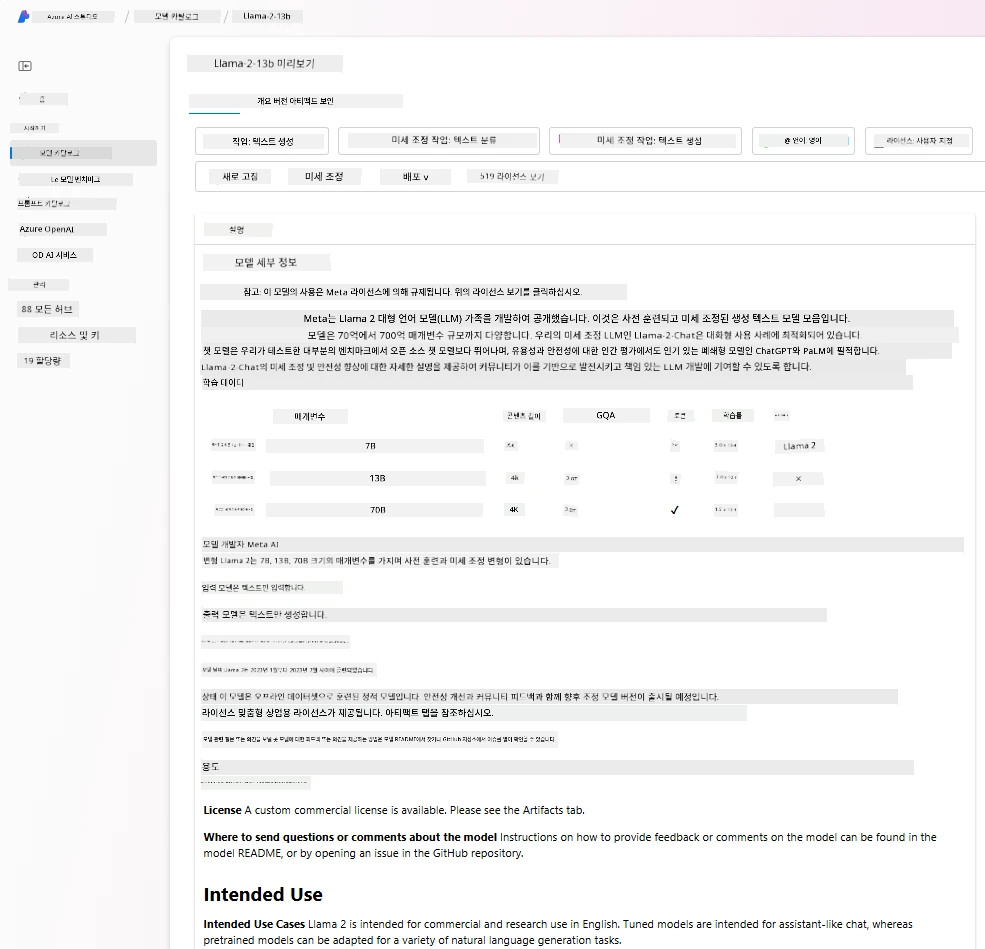

- [모델 벤치마크](https://learn.microsoft.com/azure/ai-foundry/concepts/model-benchmarks?WT.mc_id=academic-105485-koreyst) 창을 통해 산업 내 제공되는 모델과 데이터셋 간 벤치마크를 비교하여 비즈니스 시나리오에 적합한 모델을 평가할 수 있습니다.

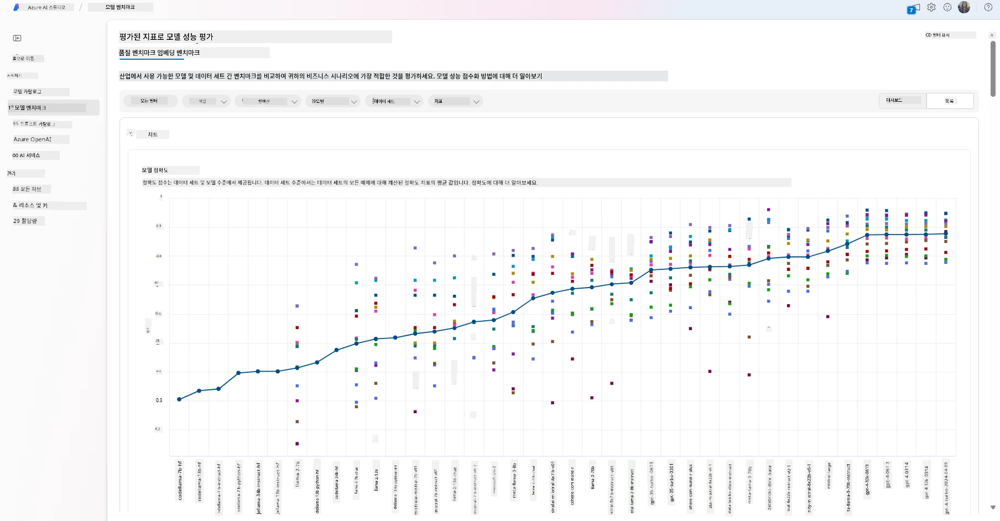

- Microsoft Foundry의 실험 및 추적 기능을 활용해 특화된 워크로드에서 모델 성능을 향상시키기 위해 지원되는 모델을 맞춤 학습시킬 수 있습니다.

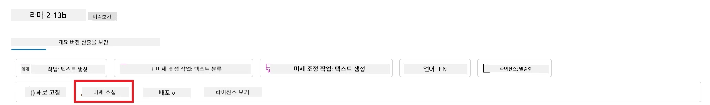

- 원래의 사전 학습된 모델 또는 맞춤 학습된 버전을 원격 실시간 추론 엔드포인트에 배포할 수 있으며, 관리형 컴퓨트 또는 서버리스 배포 옵션을 이용해 애플리케이션이 이를 사용할 수 있도록 합니다.

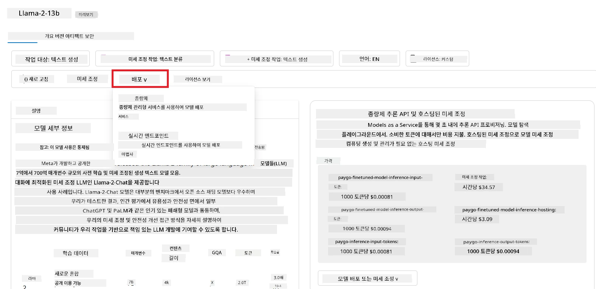

> [!NOTE]
> 카탈로그 내 모든 모델이 현재 모두 맞춤 학습 및/또는 종량제 배포가 가능한 것은 아닙니다. 모델의 기능과 제한 사항에 관한 세부 내용은 모델 카드를 확인하십시오.

## LLM 결과 개선하기

우리 스타트업 팀은 다양한 종류의 LLM과 여러 모델을 비교, 테스트 데이터 평가, 성능 개선, 추론 엔드포인트에 배포할 수 있는 클라우드 플랫폼(Microsoft Foundry)을 탐색했습니다.

하지만 언제 사전 학습된 모델을 사용하는 것보다 맞춤 학습하는 것이 좋을까요? 특정 워크로드에서 모델 성능을 향상할 수 있는 다른 접근법은 무엇이 있을까요?

비즈니스가 LLM에서 원하는 결과를 얻기 위해 사용할 수 있는 여러 접근법이 있습니다. 각기 복잡성, 비용, 품질 면에서 다른 훈련 정도의 모델을 선택해 프로덕션에 배포할 수 있습니다. 다음은 몇 가지 다른 접근법입니다:

- **맥락이 포함된 프롬프트 엔지니어링**. 프롬프트 시에 충분한 맥락을 제공하여 필요한 응답을 얻도록 하는 방법입니다.

- **검색 증강 생성(RAG)**. 데이터가 데이터베이스나 웹 엔드포인트 등에 존재할 수 있는데, 프롬프트 시에 그 데이터 또는 일부가 포함되도록 관련 데이터를 가져와 사용자 프롬프트의 일부로 만드는 방법입니다.

- **맞춤 학습된 모델**. 이 경우는 모델을 자체 데이터로 추가 학습시켜 모델이 필요에 더 정확하고 반응적이 되도록 하였으나 비용이 더 들 수 있습니다.

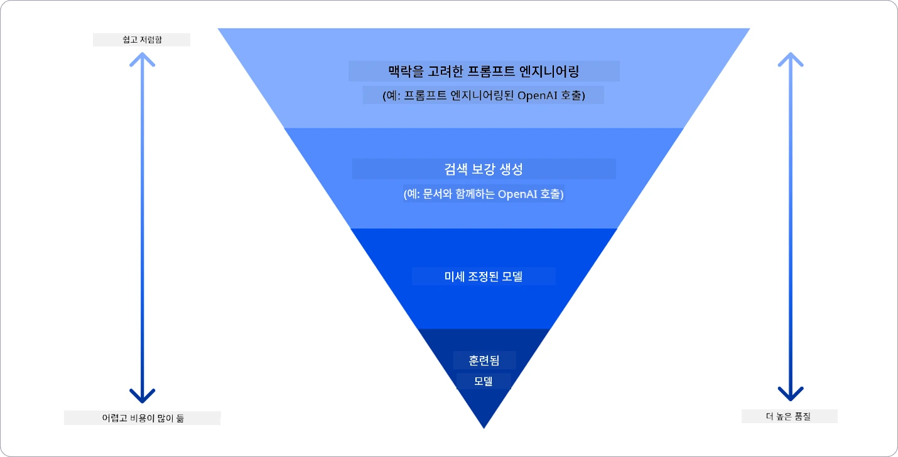

이미지 출처: [Four Ways that Enterprises Deploy LLMs | Fiddler AI Blog](https://www.fiddler.ai/blog/four-ways-that-enterprises-deploy-llms?WT.mc_id=academic-105485-koreyst)

### 맥락이 포함된 프롬프트 엔지니어링

사전 학습된 LLM은 간단한 프롬프트(예: 완성할 문장이나 질문)만으로도 일반화된 자연어 작업에서 매우 잘 작동합니다. 이를 흔히 “제로샷(zero-shot)” 학습이라고 합니다.

그러나 사용자가 자세한 요청과 예시 — 즉, 맥락 —를 포함하여 쿼리를 구성할수록 응답은 더 정확하고 사용자의 기대에 가까워집니다. 프롬프트에 하나의 예시만 있다면 “원샷(one-shot)” 학습, 여러 예시가 있으면 “소수 샷(few-shot)” 학습이라 합니다. 맥락이 포함된 프롬프트 엔지니어링은 가장 비용 효율적으로 시작할 수 있는 방법입니다.

이는 문서 조각 형태의 외부 데이터를 프롬프트에 추가하는 기술인 RAG로 극복할 수 있습니다. 프롬프트 길이 제한을 고려하여 Vector 데이터베이스 도구(예: [Azure Vector Search](https://learn.microsoft.com/azure/search/vector-search-overview?WT.mc_id=academic-105485-koreyst))가 다양한 사전 정의된 데이터 소스에서 유용한 조각을 검색해 프롬프트 맥락에 추가합니다.

이 방법은 다음과 같은 경우 선호됩니다:

- **안정적인 동작 적응**. 비즈니스에는 많은 고품질 예제가 있고, 모델이 작업 패턴, 출력 형식, 톤 또는 도메인별 스타일을 일관되게 따라야 합니다. 주요 문제가 자주 변경되는 최신 사실이나 비공개 지식인 경우, 미세 조정만 의존하지 말고 RAG를 사용하세요.

### 훈련된 모델

LLM을 처음부터 훈련하는 것은 의심할 여지 없이 가장 어렵고 복잡한 접근 방식이며, 방대한 양의 데이터, 숙련된 인력, 적절한 컴퓨팅 파워가 필요합니다. 이 옵션은 비즈니스에 도메인별 사용 사례와 대량의 도메인 중심 데이터가 있을 때만 고려해야 합니다.

## 지식 점검

LLM 완성 결과를 개선하기 위한 좋은 접근법은 무엇일까요?

1. 문맥을 활용한 프롬프트 엔지니어링
1. RAG
1. 미세 조정된 모델

답변: 세 가지 모두 도움이 될 수 있습니다. 빠른 개선을 위해 문맥을 활용한 프롬프트 엔지니어링부터 시작하고, 모델에 최신 사실이나 비공개 비즈니스 데이터가 필요할 때는 RAG를 사용하세요. 충분한 고품질 예제가 있고, 모델이 작업, 형식, 톤, 도메인 패턴을 일관되게 따라야 할 때는 미세 조정을 선택하세요.

## 🚀 도전 과제

비즈니스에 [RAG 사용법](https://learn.microsoft.com/azure/search/retrieval-augmented-generation-overview?WT.mc_id=academic-105485-koreyst)에 대해 더 읽어보세요.

## 훌륭합니다, 학습을 계속하세요

이 강의를 완료한 후, 우리의 [Generative AI 학습 컬렉션](https://aka.ms/genai-collection?WT.mc_id=academic-105485-koreyst)을 확인하여 생성형 AI 지식을 계속 향상하세요!

3강으로 이동하여 [책임감 있게 생성형 AI를 구축하는 방법](../03-using-generative-ai-responsibly/README.md?WT.mc_id=academic-105485-koreyst)을 살펴봅니다!

---

<!-- CO-OP TRANSLATOR DISCLAIMER START -->
**면책 조항**:
이 문서는 AI 번역 서비스 [Co-op Translator](https://github.com/Azure/co-op-translator)를 사용하여 번역되었습니다. 정확성을 기하기 위해 노력하고 있으나, 자동 번역은 오류나 부정확한 부분이 있을 수 있음을 유의하시기 바랍니다. 원본 문서의 원어본이 권위 있는 자료로 간주되어야 합니다. 중요한 정보의 경우, 전문가의 인간 번역을 권장합니다. 이 번역 사용으로 인해 발생하는 오해나 잘못된 해석에 대해 당사는 책임을 지지 않습니다.
<!-- CO-OP TRANSLATOR DISCLAIMER END -->