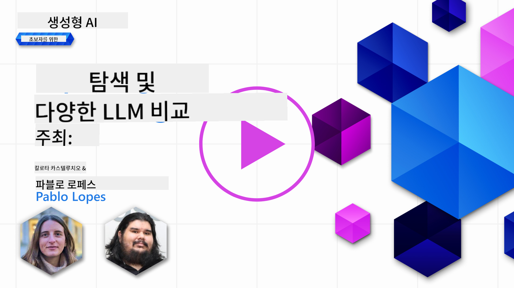
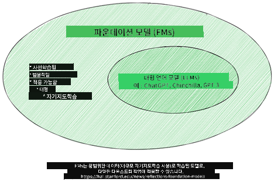
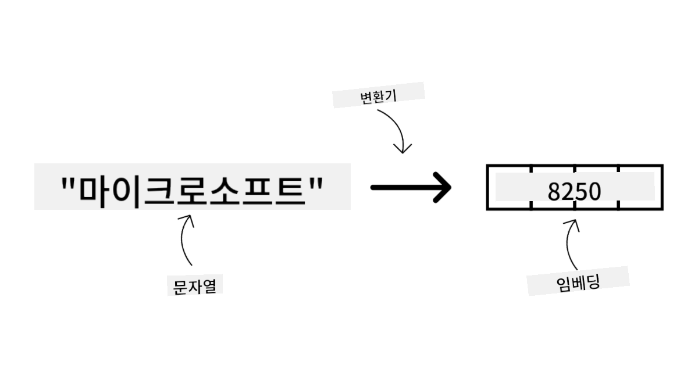
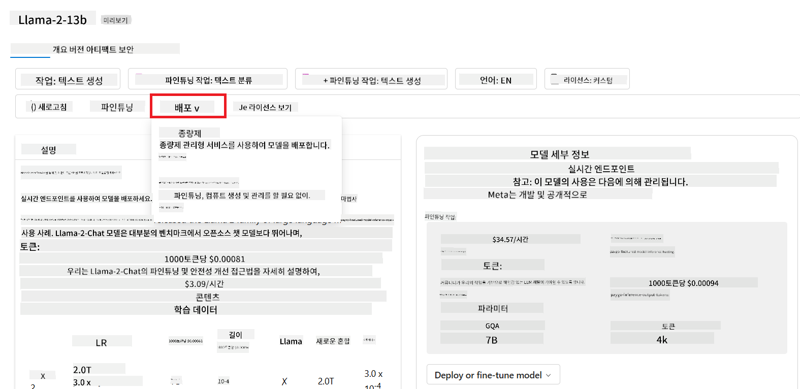

<!--
CO_OP_TRANSLATOR_METADATA:
{
  "original_hash": "6b7629b8ee4d7d874a27213e903d86a7",
  "translation_date": "2025-10-18T00:03:04+00:00",
  "source_file": "02-exploring-and-comparing-different-llms/README.md",
  "language_code": "ko"
}
-->
# 다양한 LLM 탐구 및 비교

> _위 이미지를 클릭하면 이 강의의 동영상을 볼 수 있습니다_

이전 강의에서는 생성형 AI가 기술 환경을 어떻게 변화시키고 있는지, 대규모 언어 모델(LLM)이 어떻게 작동하는지, 그리고 우리 스타트업과 같은 비즈니스가 이를 어떻게 활용하여 성장할 수 있는지에 대해 알아보았습니다! 이번 장에서는 다양한 유형의 대규모 언어 모델(LLM)을 비교하고 대조하여 각각의 장단점을 이해하려고 합니다.

우리 스타트업의 다음 단계는 현재 LLM의 환경을 탐구하고 우리의 사용 사례에 적합한 모델을 이해하는 것입니다.

## 소개

이 강의에서는 다음 내용을 다룹니다:

- 현재 LLM 환경의 다양한 유형.
- Azure에서 사용 사례에 맞는 다양한 모델을 테스트, 반복 및 비교하는 방법.
- LLM을 배포하는 방법.

## 학습 목표

이 강의를 완료한 후, 여러분은 다음을 할 수 있습니다:

- 사용 사례에 적합한 모델을 선택할 수 있습니다.
- 모델의 성능을 테스트, 반복 및 개선하는 방법을 이해할 수 있습니다.
- 비즈니스에서 모델을 배포하는 방법을 알 수 있습니다.

## 다양한 유형의 LLM 이해하기

LLM은 그 아키텍처, 학습 데이터, 사용 사례에 따라 여러 가지로 분류될 수 있습니다. 이러한 차이를 이해하면 우리 스타트업이 시나리오에 적합한 모델을 선택하고 성능을 테스트, 반복 및 개선하는 방법을 이해하는 데 도움이 됩니다.

LLM 모델은 매우 다양하며, 어떤 모델을 선택할지는 사용 목적, 데이터, 비용 등 여러 요인에 따라 달라집니다.

텍스트, 오디오, 비디오, 이미지 생성 등 모델을 사용하려는 목적에 따라 다른 유형의 모델을 선택할 수 있습니다.

- **오디오 및 음성 인식**. 이 목적을 위해 Whisper 유형의 모델이 훌륭한 선택입니다. 이 모델은 일반적인 용도로 설계되었으며 음성 인식에 초점이 맞춰져 있습니다. 다양한 오디오로 학습되었으며 다국어 음성 인식이 가능합니다. [Whisper 유형 모델에 대해 자세히 알아보기](https://platform.openai.com/docs/models/whisper?WT.mc_id=academic-105485-koreyst).

- **이미지 생성**. 이미지 생성의 경우 DALL-E와 Midjourney가 잘 알려진 두 가지 선택지입니다. DALL-E는 Azure OpenAI에서 제공됩니다. [DALL-E에 대해 자세히 알아보기](https://platform.openai.com/docs/models/dall-e?WT.mc_id=academic-105485-koreyst) 및 이 커리큘럼의 9장에서 더 알아보세요.

- **텍스트 생성**. 대부분의 모델은 텍스트 생성에 대해 학습되었으며 GPT-3.5에서 GPT-4까지 다양한 선택지가 있습니다. 비용은 GPT-4가 가장 비쌉니다. [Azure OpenAI 플레이그라운드](https://oai.azure.com/portal/playground?WT.mc_id=academic-105485-koreyst)를 살펴보며 기능과 비용 측면에서 어떤 모델이 가장 적합한지 평가해보는 것이 좋습니다.

- **멀티모달**. 입력 및 출력에서 여러 유형의 데이터를 처리하려는 경우, [gpt-4 turbo with vision 또는 gpt-4o](https://learn.microsoft.com/azure/ai-services/openai/concepts/models#gpt-4-and-gpt-4-turbo-models?WT.mc_id=academic-105485-koreyst)와 같은 모델을 고려해볼 수 있습니다. 이는 자연어 처리와 시각적 이해를 결합하여 멀티모달 인터페이스를 통해 상호작용할 수 있는 최신 OpenAI 모델입니다.

모델을 선택하면 기본적인 기능을 얻을 수 있지만, 이것만으로는 충분하지 않을 수 있습니다. 종종 회사 고유의 데이터를 LLM에 전달해야 할 필요가 있습니다. 이를 접근하는 방법에는 여러 가지가 있으며, 이에 대한 자세한 내용은 다음 섹션에서 다룰 것입니다.

### Foundation Models와 LLM의 차이점

Foundation Model이라는 용어는 [스탠포드 연구원들에 의해 만들어졌습니다](https://arxiv.org/abs/2108.07258?WT.mc_id=academic-105485-koreyst) 그리고 다음 기준을 따르는 AI 모델로 정의됩니다:

- **비지도 학습 또는 자기 지도 학습을 사용하여 학습**하며, 이는 다중 모달 데이터에 라벨이 없는 상태에서 학습되며, 학습 과정에서 데이터에 대한 인간의 주석이나 라벨링이 필요하지 않음을 의미합니다.
- **매우 큰 모델**로, 수십억 개의 매개변수로 학습된 매우 깊은 신경망을 기반으로 합니다.
- **다른 모델의 '기초'로 사용될 의도로 설계됨**, 즉 다른 모델이 이를 기반으로 구축될 수 있으며, 이는 미세 조정을 통해 이루어질 수 있습니다.

이미지 출처: [Essential Guide to Foundation Models and Large Language Models | by Babar M Bhatti | Medium
](https://thebabar.medium.com/essential-guide-to-foundation-models-and-large-language-models-27dab58f7404)

이 차이를 더 명확히 하기 위해 ChatGPT를 예로 들어보겠습니다. ChatGPT의 첫 번째 버전을 구축하기 위해 GPT-3.5라는 모델이 Foundation Model로 사용되었습니다. 이는 OpenAI가 일부 채팅 관련 데이터를 사용하여 GPT-3.5의 튜닝 버전을 생성했으며, 이 버전은 채팅봇과 같은 대화 시나리오에서 우수한 성능을 발휘하도록 특화되었습니다.

이미지 출처: [2108.07258.pdf (arxiv.org)](https://arxiv.org/pdf/2108.07258.pdf?WT.mc_id=academic-105485-koreyst)

### 오픈소스 모델과 독점 모델

LLM을 분류하는 또 다른 방법은 오픈소스인지 독점적인지 여부입니다.

오픈소스 모델은 대중에게 공개되어 누구나 사용할 수 있는 모델입니다. 이러한 모델은 종종 이를 만든 회사나 연구 커뮤니티에 의해 제공됩니다. 이러한 모델은 다양한 LLM 사용 사례에 맞게 검사, 수정 및 맞춤화할 수 있습니다. 그러나 항상 생산 사용에 최적화되어 있지는 않으며, 독점 모델만큼 성능이 뛰어나지 않을 수 있습니다. 또한, 오픈소스 모델에 대한 자금 지원이 제한적일 수 있으며, 장기적으로 유지 관리되지 않거나 최신 연구로 업데이트되지 않을 수 있습니다. 인기 있는 오픈소스 모델의 예로는 [Alpaca](https://crfm.stanford.edu/2023/03/13/alpaca.html?WT.mc_id=academic-105485-koreyst), [Bloom](https://huggingface.co/bigscience/bloom), [LLaMA](https://llama.meta.com)가 있습니다.

독점 모델은 특정 회사가 소유하고 있으며 대중에게 공개되지 않는 모델입니다. 이러한 모델은 종종 생산 사용에 최적화되어 있습니다. 그러나 다양한 사용 사례에 맞게 검사, 수정 또는 맞춤화할 수 없으며, 항상 무료로 제공되는 것은 아니며 사용하려면 구독 또는 비용을 지불해야 할 수 있습니다. 또한, 사용자는 모델을 학습하는 데 사용된 데이터에 대한 통제권이 없으므로 데이터 개인정보 보호 및 AI의 책임 있는 사용을 보장하는 모델 소유자에게 의존해야 합니다. 인기 있는 독점 모델의 예로는 [OpenAI 모델](https://platform.openai.com/docs/models/overview?WT.mc_id=academic-105485-koreyst), [Google Bard](https://sapling.ai/llm/bard?WT.mc_id=academic-105485-koreyst), [Claude 2](https://www.anthropic.com/index/claude-2?WT.mc_id=academic-105485-koreyst)가 있습니다.

### 임베딩, 이미지 생성, 텍스트 및 코드 생성

LLM은 생성하는 출력에 따라 분류될 수도 있습니다.

임베딩은 텍스트를 임베딩이라고 하는 숫자 형태로 변환할 수 있는 모델 세트입니다. 임베딩은 기계가 단어 또는 문장 간의 관계를 이해하기 쉽게 만들어주며, 분류 모델이나 클러스터링 모델과 같은 다른 모델에서 입력으로 소비될 수 있습니다. 임베딩 모델은 종종 전이 학습에 사용되며, 대체 작업을 위해 모델을 구축하고 데이터가 풍부한 경우 모델 가중치(임베딩)를 다른 다운스트림 작업에 재사용합니다. 이 범주의 예로는 [OpenAI 임베딩](https://platform.openai.com/docs/models/embeddings?WT.mc_id=academic-105485-koreyst)이 있습니다.

이미지 생성 모델은 이미지를 생성하는 모델입니다. 이러한 모델은 종종 이미지 편집, 이미지 합성 및 이미지 번역에 사용됩니다. 이미지 생성 모델은 종종 [LAION-5B](https://laion.ai/blog/laion-5b/?WT.mc_id=academic-105485-koreyst)와 같은 대규모 이미지 데이터 세트로 학습되며, 새로운 이미지를 생성하거나 기존 이미지를 인페인팅, 초고해상도 및 색상화 기술로 편집하는 데 사용할 수 있습니다. 예로는 [DALL-E-3](https://openai.com/dall-e-3?WT.mc_id=academic-105485-koreyst)와 [Stable Diffusion 모델](https://github.com/Stability-AI/StableDiffusion?WT.mc_id=academic-105485-koreyst)이 있습니다.

텍스트 및 코드 생성 모델은 텍스트 또는 코드를 생성하는 모델입니다. 이러한 모델은 종종 텍스트 요약, 번역 및 질문 응답에 사용됩니다. 텍스트 생성 모델은 종종 [BookCorpus](https://www.cv-foundation.org/openaccess/content_iccv_2015/html/Zhu_Aligning_Books_and_ICCV_2015_paper.html?WT.mc_id=academic-105485-koreyst)와 같은 대규모 텍스트 데이터 세트로 학습되며, 새로운 텍스트를 생성하거나 질문에 답변하는 데 사용할 수 있습니다. 코드 생성 모델인 [CodeParrot](https://huggingface.co/codeparrot?WT.mc_id=academic-105485-koreyst)은 종종 GitHub과 같은 대규모 코드 데이터 세트로 학습되며, 새로운 코드를 생성하거나 기존 코드의 버그를 수정하는 데 사용할 수 있습니다.

### 인코더-디코더 대 디코더 전용

LLM의 다양한 아키텍처 유형에 대해 이야기하기 위해 비유를 사용해 보겠습니다.

여러분의 매니저가 학생들을 위한 퀴즈를 작성하는 과제를 주었다고 가정해 보세요. 두 명의 동료가 있는데, 한 명은 콘텐츠를 작성하고 다른 한 명은 이를 검토하는 역할을 맡고 있습니다.

콘텐츠 작성자는 디코더 전용 모델과 같습니다. 주제를 보고 여러분이 이미 작성한 내용을 바탕으로 강의를 작성할 수 있습니다. 이들은 매력적이고 유익한 콘텐츠를 작성하는 데 매우 능숙하지만, 주제와 학습 목표를 이해하는 데는 그다지 능숙하지 않습니다. 디코더 모델의 예로는 GPT 계열 모델, 예를 들어 GPT-3이 있습니다.

검토자는 인코더 전용 모델과 같습니다. 작성된 강의와 답변을 보고 그들 간의 관계를 파악하며 맥락을 이해합니다. 하지만 콘텐츠를 생성하는 데는 능숙하지 않습니다. 인코더 전용 모델의 예로는 BERT가 있습니다.

퀴즈를 작성하고 검토할 수 있는 사람도 있다고 상상해 보세요. 이것이 바로 인코더-디코더 모델입니다. 예로는 BART와 T5가 있습니다.

### 서비스 대 모델

이제 서비스와 모델의 차이에 대해 이야기해 보겠습니다. 서비스는 클라우드 서비스 제공자가 제공하는 제품으로, 종종 모델, 데이터 및 기타 구성 요소의 조합입니다. 모델은 서비스의 핵심 구성 요소이며, 종종 LLM과 같은 Foundation Model입니다.

서비스는 종종 생산 사용에 최적화되어 있으며, 그래픽 사용자 인터페이스를 통해 모델보다 사용하기 쉽습니다. 그러나 서비스는 항상 무료로 제공되는 것은 아니며, 사용량에 따라 비용을 지불해야 할 수 있습니다. 서비스 제공자의 장비와 자원을 활용하여 비용을 최적화하고 쉽게 확장할 수 있습니다. 서비스의 예로는 [Azure OpenAI Service](https://learn.microsoft.com/azure/ai-services/openai/overview?WT.mc_id=academic-105485-koreyst)가 있습니다. 이 서비스는 사용량에 따라 요금을 부과하는 요금제를 제공하며, 사용자가 서비스를 얼마나 사용하는지에 비례하여 비용이 청구됩니다. 또한, Azure OpenAI Service는 모델의 기능 위에 엔터프라이즈급 보안과 책임 있는 AI 프레임워크를 제공합니다.

모델은 매개변수, 가중치 등을 포함한 신경망 자체입니다. 이를 로컬에서 실행하려면 장비를 구매하고 확장 구조를 구축하며 라이센스를 구매하거나 오픈소스 모델을 사용해야 합니다. LLaMA와 같은 모델은 사용할 수 있지만, 모델을 실행하려면 계산 능력이 필요합니다.

## Azure에서 성능을 이해하기 위해 다양한 모델을 테스트하고 반복하는 방법

우리 팀이 현재 LLM 환경을 탐구하고 시나리오에 적합한 후보를 식별한 후, 다음 단계는 데이터를 기반으로 워크로드에서 이를 테스트하는 것입니다. 이는 실험과 측정을 통해 이루어지는 반복적인 과정입니다.
이전 단락에서 언급한 대부분의 모델(OpenAI 모델, Llama2와 같은 오픈 소스 모델, Hugging Face transformers)은 [Azure AI Studio](https://ai.azure.com/?WT.mc_id=academic-105485-koreyst)의 [모델 카탈로그](https://learn.microsoft.com/azure/ai-studio/how-to/model-catalog-overview?WT.mc_id=academic-105485-koreyst)에서 이용할 수 있습니다.

[Azure AI Studio](https://learn.microsoft.com/azure/ai-studio/what-is-ai-studio?WT.mc_id=academic-105485-koreyst)는 개발자가 생성형 AI 애플리케이션을 구축하고 실험부터 평가까지 전체 개발 라이프사이클을 관리할 수 있도록 설계된 클라우드 플랫폼입니다. Azure AI 서비스들을 하나의 허브로 통합하고 직관적인 GUI를 제공합니다. Azure AI Studio의 모델 카탈로그는 사용자에게 다음과 같은 기능을 제공합니다:

- 관심 있는 기본 모델을 카탈로그에서 찾을 수 있습니다. 독점 모델이든 오픈 소스 모델이든 작업, 라이선스 또는 이름으로 필터링할 수 있습니다. 검색 편의성을 높이기 위해 모델은 Azure OpenAI 컬렉션, Hugging Face 컬렉션 등과 같은 컬렉션으로 구성되어 있습니다.

- 모델 카드 검토: 사용 의도와 학습 데이터, 코드 샘플, 내부 평가 라이브러리의 평가 결과에 대한 자세한 설명을 포함합니다.

- 산업에서 이용 가능한 모델과 데이터셋 간의 벤치마크를 비교하여 비즈니스 시나리오에 적합한 모델을 평가할 수 있습니다. 이는 [모델 벤치마크](https://learn.microsoft.com/azure/ai-studio/how-to/model-benchmarks?WT.mc_id=academic-105485-koreyst) 패널을 통해 가능합니다.

- 특정 작업에서 모델 성능을 향상시키기 위해 사용자 지정 학습 데이터를 사용하여 모델을 미세 조정할 수 있습니다. Azure AI Studio의 실험 및 추적 기능을 활용합니다.

- 원래 사전 학습된 모델 또는 미세 조정된 버전을 원격 실시간 추론 - 관리형 컴퓨팅 - 또는 서버리스 API 엔드포인트 - [사용한 만큼 지불](https://learn.microsoft.com/azure/ai-studio/how-to/model-catalog-overview#model-deployment-managed-compute-and-serverless-api-pay-as-you-go?WT.mc_id=academic-105485-koreyst) - 방식으로 배포하여 애플리케이션이 이를 사용할 수 있도록 합니다.

> [!NOTE]
> 카탈로그에 있는 모든 모델이 현재 미세 조정 및/또는 사용한 만큼 지불 방식의 배포를 지원하는 것은 아닙니다. 모델 카드에서 모델의 기능과 제한 사항에 대한 세부 정보를 확인하세요.

## LLM 결과 개선하기

우리 스타트업 팀은 다양한 종류의 LLM과 클라우드 플랫폼(Azure Machine Learning)을 탐구하여 다양한 모델을 비교하고, 테스트 데이터로 평가하며, 성능을 개선하고 추론 엔드포인트에 배포할 수 있었습니다.

그렇다면 언제 사전 학습된 모델을 사용하는 대신 모델을 미세 조정해야 할까요? 특정 작업에서 모델 성능을 개선하기 위한 다른 접근 방식은 무엇일까요?

비즈니스가 LLM에서 원하는 결과를 얻기 위해 사용할 수 있는 여러 가지 접근 방식이 있습니다. LLM을 프로덕션에 배포할 때 다양한 수준의 복잡성, 비용 및 품질을 가진 다양한 유형의 모델을 선택할 수 있습니다. 다음은 몇 가지 접근 방식입니다:

- **컨텍스트를 활용한 프롬프트 엔지니어링**. 필요한 응답을 얻기 위해 프롬프트를 제공할 때 충분한 컨텍스트를 제공하는 것이 중요합니다.

- **검색 증강 생성(RAG)**. 데이터가 데이터베이스나 웹 엔드포인트에 존재할 수 있습니다. 이 데이터를 포함하거나 일부를 포함하기 위해 프롬프트 시점에 관련 데이터를 가져와 사용자 프롬프트의 일부로 만들 수 있습니다.

- **미세 조정된 모델**. 여기서는 모델을 자체 데이터로 추가 학습시켜 모델이 더 정확하고 요구에 더 잘 반응하도록 하지만 비용이 많이 들 수 있습니다.

이미지 출처: [Four Ways that Enterprises Deploy LLMs | Fiddler AI Blog](https://www.fiddler.ai/blog/four-ways-that-enterprises-deploy-llms?WT.mc_id=academic-105485-koreyst)

### 컨텍스트를 활용한 프롬프트 엔지니어링

사전 학습된 LLM은 일반적인 자연어 작업에서 매우 잘 작동하며, 짧은 프롬프트(예: 완성해야 할 문장 또는 질문)로 호출해도 훌륭한 결과를 제공합니다. 이를 "제로샷 학습"이라고 합니다.

그러나 사용자가 자신의 요청을 더 구체적으로 작성하고 자세한 요청과 예제를 제공할수록(컨텍스트) 답변이 더 정확하고 사용자의 기대에 가까워집니다. 프롬프트에 예제가 하나만 포함된 경우 "원샷 학습"이라고 하며, 여러 예제가 포함된 경우 "몇 샷 학습"이라고 합니다. 컨텍스트를 활용한 프롬프트 엔지니어링은 시작하기에 가장 비용 효율적인 접근 방식입니다.

### 검색 증강 생성(RAG)

LLM은 학습 중 사용된 데이터만을 사용하여 답변을 생성할 수 있다는 한계가 있습니다. 이는 학습 과정 이후에 발생한 사실에 대해 아무것도 알지 못하며, 비공개 정보(예: 회사 데이터)에 접근할 수 없음을 의미합니다. 

이 문제는 RAG를 통해 해결할 수 있습니다. RAG는 문서 조각 형태의 외부 데이터를 프롬프트에 추가하여 프롬프트 길이 제한을 고려합니다. 이는 [Azure Vector Search](https://learn.microsoft.com/azure/search/vector-search-overview?WT.mc_id=academic-105485-koreyst)와 같은 벡터 데이터베이스 도구를 통해 미리 정의된 다양한 데이터 소스에서 유용한 조각을 검색하고 이를 프롬프트 컨텍스트에 추가함으로써 지원됩니다.

이 기술은 비즈니스가 충분한 데이터, 시간 또는 자원이 부족하지만 특정 작업에서 성능을 개선하고 현실 왜곡이나 유해 콘텐츠와 같은 위험을 줄이고자 할 때 매우 유용합니다.

### 미세 조정된 모델

미세 조정은 전이 학습을 활용하여 모델을 하위 작업에 맞게 '적응'시키거나 특정 문제를 해결하는 과정입니다. 몇 샷 학습 및 RAG와는 달리, 새로운 모델이 생성되며 업데이트된 가중치와 바이어스를 포함합니다. 이 과정은 단일 입력(프롬프트)과 관련된 출력(완성)으로 구성된 학습 예제 세트를 필요로 합니다. 

다음과 같은 경우에 선호되는 접근 방식입니다:

- **미세 조정된 모델 사용**. 비즈니스가 고성능 모델 대신 덜 강력한 모델(예: 임베딩 모델)을 사용하고자 할 때, 더 비용 효율적이고 빠른 솔루션을 제공합니다.

- **지연 시간 고려**. 특정 사용 사례에서 지연 시간이 중요하며, 매우 긴 프롬프트를 사용할 수 없거나 모델이 학습해야 할 예제 수가 프롬프트 길이 제한에 맞지 않을 때.

- **최신 상태 유지**. 비즈니스가 고품질 데이터와 정확한 레이블을 많이 보유하고 있으며, 시간이 지남에 따라 이 데이터를 최신 상태로 유지할 자원이 있을 때.

### 학습된 모델

LLM을 처음부터 학습시키는 것은 가장 어렵고 복잡한 접근 방식으로, 방대한 양의 데이터, 숙련된 자원, 적절한 계산 능력이 필요합니다. 이 옵션은 비즈니스가 도메인별 사용 사례와 대량의 도메인 중심 데이터를 보유한 경우에만 고려해야 합니다.

## 지식 점검

LLM 완성 결과를 개선하기 위한 좋은 접근 방식은 무엇일까요?

1. 컨텍스트를 활용한 프롬프트 엔지니어링  
1. RAG  
1. 미세 조정된 모델  

A:3, 시간이 있고 자원과 고품질 데이터가 있다면, 미세 조정이 최신 상태를 유지하는 데 더 나은 옵션입니다. 그러나 개선이 필요하고 시간이 부족하다면 먼저 RAG를 고려할 가치가 있습니다.

## 🚀 도전 과제

[비즈니스에서 RAG를 사용하는 방법](https://learn.microsoft.com/azure/search/retrieval-augmented-generation-overview?WT.mc_id=academic-105485-koreyst)에 대해 더 알아보세요.

## 훌륭한 작업, 학습을 계속하세요

이 레슨을 완료한 후, [Generative AI Learning collection](https://aka.ms/genai-collection?WT.mc_id=academic-105485-koreyst)을 확인하여 생성형 AI 지식을 계속 향상시키세요!

Lesson 3로 이동하여 [책임감 있는 생성형 AI 구축](../03-using-generative-ai-responsibly/README.md?WT.mc_id=academic-105485-koreyst)에 대해 알아보세요!

---

**면책 조항**:  
이 문서는 AI 번역 서비스 [Co-op Translator](https://github.com/Azure/co-op-translator)를 사용하여 번역되었습니다. 정확성을 위해 최선을 다하고 있지만, 자동 번역에는 오류나 부정확성이 포함될 수 있습니다. 원본 문서의 원어를 권위 있는 출처로 간주해야 합니다. 중요한 정보의 경우, 전문적인 인간 번역을 권장합니다. 이 번역 사용으로 인해 발생하는 오해나 잘못된 해석에 대해 책임지지 않습니다.