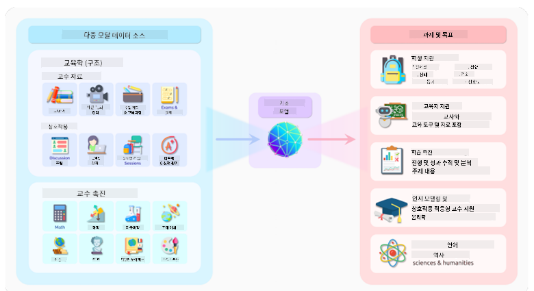
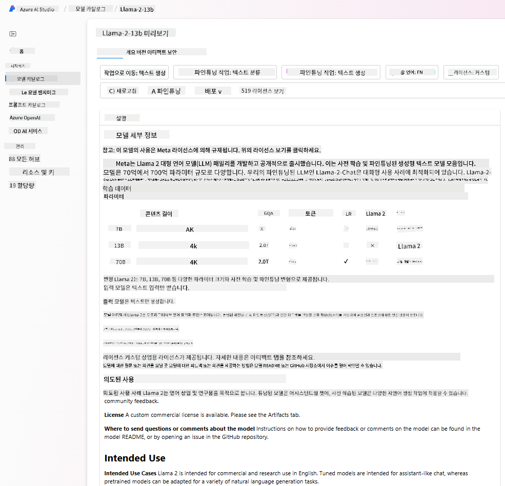
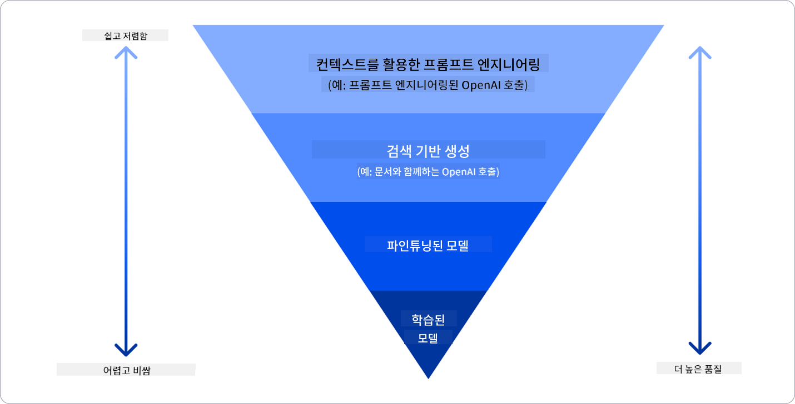

<!--
CO_OP_TRANSLATOR_METADATA:
{
  "original_hash": "e2f686f2eb794941761252ac5e8e090b",
  "translation_date": "2025-07-09T08:17:18+00:00",
  "source_file": "02-exploring-and-comparing-different-llms/README.md",
  "language_code": "ko"
}
-->
# 다양한 LLM 탐색 및 비교

> _위 이미지를 클릭하면 이 수업의 영상을 볼 수 있습니다_

이전 수업에서는 생성 AI가 기술 환경을 어떻게 변화시키고 있는지, 대형 언어 모델(LLM)이 어떻게 작동하는지, 그리고 스타트업과 같은 비즈니스가 이를 어떻게 활용해 성장할 수 있는지 살펴보았습니다. 이번 장에서는 다양한 유형의 대형 언어 모델(LLM)을 비교하고 대조하여 각각의 장단점을 이해해보겠습니다.

우리 스타트업 여정의 다음 단계는 현재 LLM 환경을 탐색하고 우리 사용 사례에 적합한 모델이 무엇인지 파악하는 것입니다.

## 소개

이번 수업에서는 다음 내용을 다룹니다:

- 현재 환경에서의 다양한 LLM 유형
- Azure에서 다양한 모델을 테스트, 반복, 비교하는 방법
- LLM 배포 방법

## 학습 목표

이 수업을 마치면 다음을 할 수 있습니다:

- 사용 사례에 맞는 적절한 모델 선택
- 모델의 성능을 테스트, 반복, 개선하는 방법 이해
- 비즈니스에서 모델을 배포하는 방법 알기

## 다양한 LLM 유형 이해하기

LLM은 아키텍처, 학습 데이터, 사용 사례에 따라 여러 가지로 분류할 수 있습니다. 이러한 차이를 이해하면 우리 스타트업이 상황에 맞는 모델을 선택하고, 테스트, 반복, 성능 개선 방법을 이해하는 데 도움이 됩니다.

LLM 모델은 매우 다양하며, 어떤 모델을 선택할지는 사용 목적, 데이터, 예산 등에 따라 달라집니다.

텍스트, 오디오, 비디오, 이미지 생성 등 어떤 용도로 모델을 사용할지에 따라 적합한 모델 유형이 달라질 수 있습니다.

- **오디오 및 음성 인식**: Whisper 유형 모델은 범용적이며 음성 인식에 특화되어 있어 좋은 선택입니다. 다양한 오디오 데이터를 학습했으며 다국어 음성 인식이 가능합니다. [Whisper 유형 모델에 대해 더 알아보기](https://platform.openai.com/docs/models/whisper?WT.mc_id=academic-105485-koreyst).

- **이미지 생성**: 이미지 생성에는 DALL-E와 Midjourney가 잘 알려져 있습니다. DALL-E는 Azure OpenAI에서 제공됩니다. [DALL-E에 대해 더 읽어보기](https://platform.openai.com/docs/models/dall-e?WT.mc_id=academic-105485-koreyst) 및 이 커리큘럼 9장 참고.

- **텍스트 생성**: 대부분의 모델은 텍스트 생성에 특화되어 있으며, GPT-3.5부터 GPT-4까지 다양한 선택지가 있습니다. GPT-4가 가장 비용이 높습니다. [Azure OpenAI 플레이그라운드](https://oai.azure.com/portal/playground?WT.mc_id=academic-105485-koreyst)에서 기능과 비용 측면에서 어떤 모델이 적합한지 평가해보는 것이 좋습니다.

- **멀티모달**: 입력과 출력을 여러 유형의 데이터로 다루고 싶다면, [gpt-4 turbo with vision 또는 gpt-4o](https://learn.microsoft.com/azure/ai-services/openai/concepts/models#gpt-4-and-gpt-4-turbo-models?WT.mc_id=academic-105485-koreyst) 같은 최신 OpenAI 모델을 살펴보세요. 자연어 처리와 시각적 이해를 결합해 멀티모달 인터페이스를 통한 상호작용이 가능합니다.

모델을 선택하면 기본적인 기능을 얻을 수 있지만, 회사 고유의 데이터를 LLM에 반영해야 할 때가 많습니다. 이를 처리하는 방법에는 여러 가지가 있으며, 다음 섹션에서 자세히 다룹니다.

### Foundation Models와 LLM의 차이

Foundation Model이라는 용어는 [스탠포드 연구진이 처음 제안](https://arxiv.org/abs/2108.07258?WT.mc_id=academic-105485-koreyst)했으며, 다음과 같은 기준을 갖춘 AI 모델을 의미합니다:

- **비지도 학습 또는 자기지도 학습으로 훈련됨**: 라벨이 없는 멀티모달 데이터를 학습하며, 데이터에 대한 사람의 주석이나 라벨링이 필요하지 않습니다.
- **매우 큰 규모의 모델**: 수십억 개의 파라미터를 가진 매우 깊은 신경망 기반입니다.
- **다른 모델의 ‘기반’ 역할을 함**: 파인튜닝을 통해 다른 모델의 출발점으로 사용될 수 있습니다.

이미지 출처: [Essential Guide to Foundation Models and Large Language Models | by Babar M Bhatti | Medium](https://thebabar.medium.com/essential-guide-to-foundation-models-and-large-language-models-27dab58f7404)

이 차이를 좀 더 명확히 하기 위해 ChatGPT를 예로 들어보겠습니다. ChatGPT의 첫 버전을 만들 때 GPT-3.5 모델이 Foundation Model 역할을 했습니다. 즉, OpenAI는 채팅에 특화된 데이터를 사용해 GPT-3.5를 튜닝하여 대화 시나리오에 최적화된 버전을 만들었습니다.

이미지 출처: [2108.07258.pdf (arxiv.org)](https://arxiv.org/pdf/2108.07258.pdf?WT.mc_id=academic-105485-koreyst)

### 오픈 소스 모델과 독점 모델

LLM을 분류하는 또 다른 방법은 오픈 소스인지 독점인지입니다.

오픈 소스 모델은 공개되어 누구나 사용할 수 있습니다. 보통 해당 모델을 만든 회사나 연구 커뮤니티에서 공개합니다. 이 모델들은 검토, 수정, 맞춤화가 가능하지만, 항상 프로덕션 환경에 최적화되어 있지 않고 독점 모델만큼 성능이 뛰어나지 않을 수 있습니다. 또한 오픈 소스 모델은 자금 지원이 제한적일 수 있고, 장기 유지보수나 최신 연구 반영이 어려울 수 있습니다. 대표적인 오픈 소스 모델로는 [Alpaca](https://crfm.stanford.edu/2023/03/13/alpaca.html?WT.mc_id=academic-105485-koreyst), [Bloom](https://huggingface.co/bigscience/bloom), [LLaMA](https://llama.meta.com) 등이 있습니다.

독점 모델은 회사가 소유하며 공개되지 않습니다. 보통 프로덕션 환경에 최적화되어 있지만, 검토, 수정, 맞춤화가 불가능합니다. 무료로 제공되지 않는 경우가 많고, 구독이나 사용료가 필요할 수 있습니다. 또한 사용자는 모델 학습에 사용된 데이터에 대한 통제권이 없으므로, 데이터 프라이버시와 AI 책임 사용에 대해 모델 소유자를 신뢰해야 합니다. 대표적인 독점 모델로는 [OpenAI 모델](https://platform.openai.com/docs/models/overview?WT.mc_id=academic-105485-koreyst), [Google Bard](https://sapling.ai/llm/bard?WT.mc_id=academic-105485-koreyst), [Claude 2](https://www.anthropic.com/index/claude-2?WT.mc_id=academic-105485-koreyst) 등이 있습니다.

### 임베딩, 이미지 생성, 텍스트 및 코드 생성

LLM은 생성하는 출력 유형에 따라 분류할 수도 있습니다.

임베딩 모델은 텍스트를 임베딩이라는 수치 형태로 변환합니다. 임베딩은 입력 텍스트의 수치적 표현으로, 기계가 단어 또는 문장 간 관계를 이해하기 쉽게 해줍니다. 임베딩은 분류 모델이나 클러스터링 모델 같은 다른 모델의 입력으로 사용되며, 수치 데이터에서 더 좋은 성능을 냅니다. 임베딩 모델은 전이 학습에 자주 사용되며, 풍부한 데이터가 있는 대체 작업에 대해 학습한 후 그 가중치(임베딩)를 다른 하위 작업에 재사용합니다. 이 범주의 예로는 [OpenAI 임베딩](https://platform.openai.com/docs/models/embeddings?WT.mc_id=academic-105485-koreyst)이 있습니다.

이미지 생성 모델은 이미지를 생성합니다. 이미지 편집, 합성, 변환에 자주 사용되며, [LAION-5B](https://laion.ai/blog/laion-5b/?WT.mc_id=academic-105485-koreyst) 같은 대규모 이미지 데이터셋으로 학습됩니다. 새로운 이미지를 생성하거나 인페인팅, 초해상도, 색상 보정 등의 기법으로 기존 이미지를 편집할 수 있습니다. 예로는 [DALL-E-3](https://openai.com/dall-e-3?WT.mc_id=academic-105485-koreyst)와 [Stable Diffusion 모델](https://github.com/Stability-AI/StableDiffusion?WT.mc_id=academic-105485-koreyst)이 있습니다.

텍스트 및 코드 생성 모델은 텍스트나 코드를 생성합니다. 텍스트 요약, 번역, 질문 답변 등에 사용되며, [BookCorpus](https://www.cv-foundation.org/openaccess/content_iccv_2015/html/Zhu_Aligning_Books_and_ICCV_2015_paper.html?WT.mc_id=academic-105485-koreyst) 같은 대규모 텍스트 데이터셋으로 학습됩니다. 새로운 텍스트를 생성하거나 질문에 답할 수 있습니다. 코드 생성 모델은 [CodeParrot](https://huggingface.co/codeparrot?WT.mc_id=academic-105485-koreyst)처럼 GitHub 등 대규모 코드 데이터셋으로 학습되어 새로운 코드를 생성하거나 기존 코드의 버그를 수정할 수 있습니다.

### 인코더-디코더 vs 디코더 전용

LLM의 아키텍처 유형을 설명하기 위해 비유를 들어보겠습니다.

매니저가 학생들을 위한 퀴즈를 작성하라는 과제를 주었다고 상상해보세요. 두 명의 동료가 있는데, 한 명은 콘텐츠를 만들고 다른 한 명은 검토를 담당합니다.

콘텐츠 제작자는 디코더 전용 모델과 같습니다. 주제를 보고 이미 작성한 내용을 참고해 강의를 작성할 수 있습니다. 매력적이고 유익한 콘텐츠 작성에 능하지만, 주제와 학습 목표를 깊이 이해하는 데는 약합니다. 디코더 모델의 예로는 GPT 계열 모델(GPT-3 등)이 있습니다.

검토자는 인코더 전용 모델과 같습니다. 작성된 강의와 답변을 보고 그 관계를 파악하며 문맥을 이해하지만, 콘텐츠 생성에는 능하지 않습니다. 인코더 전용 모델의 예로는 BERT가 있습니다.

콘텐츠 제작과 검토를 모두 할 수 있는 사람이 있다면, 이것이 인코더-디코더 모델입니다. 예로는 BART와 T5가 있습니다.

### 서비스와 모델의 차이

이제 서비스와 모델의 차이를 이야기해보겠습니다. 서비스는 클라우드 서비스 제공자가 제공하는 제품으로, 보통 여러 모델, 데이터, 기타 구성 요소의 조합입니다. 모델은 서비스의 핵심 구성 요소이며, 보통 Foundation Model이나 LLM입니다.

서비스는 프로덕션 환경에 최적화되어 있고, 그래픽 사용자 인터페이스를 통해 모델보다 사용하기 쉽습니다. 하지만 무료가 아닐 수 있고, 구독이나 사용료가 필요할 수 있습니다. 서비스 제공자의 장비와 자원을 활용해 비용을 최적화하고 쉽게 확장할 수 있습니다. 예로는 [Azure OpenAI Service](https://learn.microsoft.com/azure/ai-services/openai/overview?WT.mc_id=academic-105485-koreyst)가 있으며, 사용량에 따라 요금이 부과되는 종량제 요금제를 제공합니다. 또한 엔터프라이즈급 보안과 책임 있는 AI 프레임워크를 모델 기능 위에 제공합니다.

모델은 파라미터, 가중치 등 신경망 그 자체입니다. 기업이 로컬에서 실행할 수 있지만, 장비 구매, 확장 구조 구축, 라이선스 구매 또는 오픈 소스 모델 사용이 필요합니다. 예를 들어 LLaMA 모델은 사용 가능하지만, 실행을 위한 컴퓨팅 파워가 필요합니다.

## Azure에서 다양한 모델을 테스트하고 반복하며 성능 이해하기

우리 팀이 현재 LLM 환경을 탐색하고 시나리오에 적합한 후보 모델을 선정했다면, 다음 단계는 데이터를 사용해 모델을 테스트하고 워크로드에 맞게 평가하는 것입니다. 이 과정은 실험과 측정을 통해 반복적으로 진행됩니다.
이전 단락에서 언급한 대부분의 모델들(OpenAI 모델, Llama2와 같은 오픈 소스 모델, Hugging Face 트랜스포머 등)은 [Azure AI Studio](https://ai.azure.com/?WT.mc_id=academic-105485-koreyst)의 [Model Catalog](https://learn.microsoft.com/azure/ai-studio/how-to/model-catalog-overview?WT.mc_id=academic-105485-koreyst)에서 이용할 수 있습니다.

[Azure AI Studio](https://learn.microsoft.com/azure/ai-studio/what-is-ai-studio?WT.mc_id=academic-105485-koreyst)는 개발자가 생성형 AI 애플리케이션을 구축하고 실험부터 평가까지 전체 개발 주기를 관리할 수 있도록 모든 Azure AI 서비스를 하나의 편리한 GUI 허브로 통합한 클라우드 플랫폼입니다. Azure AI Studio의 Model Catalog를 통해 사용자는 다음을 할 수 있습니다:

- 관심 있는 Foundation Model을 카탈로그에서 찾기 - 독점 모델이든 오픈 소스 모델이든 작업, 라이선스, 이름으로 필터링할 수 있습니다. 검색 편의를 위해 모델들은 Azure OpenAI 컬렉션, Hugging Face 컬렉션 등과 같은 컬렉션으로 분류되어 있습니다.

- 모델 카드 검토하기, 여기에는 의도된 사용 목적과 학습 데이터에 대한 상세 설명, 코드 샘플, 내부 평가 라이브러리의 평가 결과가 포함됩니다.

- [Model Benchmarks](https://learn.microsoft.com/azure/ai-studio/how-to/model-benchmarks?WT.mc_id=academic-105485-koreyst) 창을 통해 업계에서 제공하는 다양한 모델과 데이터셋의 벤치마크를 비교하여 비즈니스 시나리오에 적합한 모델을 평가할 수 있습니다.

- Azure AI Studio의 실험 및 추적 기능을 활용해 특정 작업 부하에 맞게 맞춤 학습 데이터를 사용하여 모델을 미세 조정하여 성능을 향상시킬 수 있습니다.

- 원래의 사전 학습된 모델이나 미세 조정된 버전을 원격 실시간 추론 - 관리형 컴퓨트 - 또는 서버리스 API 엔드포인트 - [사용량 기반 결제](https://learn.microsoft.com/azure/ai-studio/how-to/model-catalog-overview#model-deployment-managed-compute-and-serverless-api-pay-as-you-go?WT.mc_id=academic-105485-koreyst) - 에 배포하여 애플리케이션에서 사용할 수 있도록 할 수 있습니다.

> [!NOTE]
> 카탈로그에 있는 모든 모델이 현재 미세 조정 및/또는 사용량 기반 결제 배포가 가능한 것은 아닙니다. 모델의 기능과 제한 사항에 대해서는 모델 카드를 확인하세요.

## LLM 결과 개선하기

저희 스타트업 팀은 다양한 종류의 LLM과 Azure Machine Learning 같은 클라우드 플랫폼을 활용해 여러 모델을 비교하고, 테스트 데이터로 평가하며, 성능을 개선하고, 추론 엔드포인트에 배포하는 과정을 경험했습니다.

그렇다면 언제 사전 학습된 모델을 사용하는 대신 미세 조정을 고려해야 할까요? 특정 작업 부하에서 모델 성능을 개선할 수 있는 다른 방법은 무엇일까요?

비즈니스가 LLM에서 원하는 결과를 얻기 위해 사용할 수 있는 여러 접근법이 있습니다. LLM을 프로덕션에 배포할 때는 훈련 정도가 다른 다양한 유형의 모델을 선택할 수 있으며, 복잡성, 비용, 품질 수준도 다릅니다. 다음은 몇 가지 접근법입니다:

- **컨텍스트를 활용한 프롬프트 엔지니어링**. 필요한 응답을 얻기 위해 프롬프트에 충분한 컨텍스트를 제공하는 방법입니다.

- **Retrieval Augmented Generation, RAG**. 예를 들어 데이터가 데이터베이스나 웹 엔드포인트에 존재할 수 있는데, 프롬프트 시점에 이 데이터나 일부를 포함시키기 위해 관련 데이터를 가져와 사용자 프롬프트의 일부로 만드는 방법입니다.

- **미세 조정된 모델**. 자체 데이터를 사용해 모델을 추가로 학습시켜 더 정확하고 요구에 맞는 응답을 얻는 방법이지만 비용이 들 수 있습니다.

이미지 출처: [Four Ways that Enterprises Deploy LLMs | Fiddler AI Blog](https://www.fiddler.ai/blog/four-ways-that-enterprises-deploy-llms?WT.mc_id=academic-105485-koreyst)

### 컨텍스트를 활용한 프롬프트 엔지니어링

사전 학습된 LLM은 일반적인 자연어 작업에 매우 잘 작동하며, 짧은 프롬프트(예: 완성할 문장이나 질문)만으로도 “제로샷” 학습이 가능합니다.

하지만 사용자가 자세한 요청과 예시—즉, 컨텍스트—를 포함해 쿼리를 구성할수록, 답변은 더 정확하고 기대에 가까워집니다. 프롬프트에 예시가 하나만 포함되면 “원샷” 학습, 여러 개가 포함되면 “퓨샷” 학습이라고 합니다. 컨텍스트를 활용한 프롬프트 엔지니어링은 가장 비용 효율적으로 시작할 수 있는 방법입니다.

### Retrieval Augmented Generation (RAG)

LLM은 학습에 사용된 데이터만을 기반으로 답변을 생성할 수 있다는 한계가 있습니다. 즉, 학습 이후에 발생한 사실이나 비공개 정보(예: 회사 데이터)는 알지 못합니다. 

이 문제는 RAG를 통해 극복할 수 있는데, 이는 문서 조각 형태의 외부 데이터를 프롬프트에 추가하는 기법입니다. 프롬프트 길이 제한을 고려하면서, [Azure Vector Search](https://learn.microsoft.com/azure/search/vector-search-overview?WT.mc_id=academic-105485-koreyst) 같은 벡터 데이터베이스 도구가 다양한 사전 정의된 데이터 소스에서 유용한 조각을 검색해 프롬프트 컨텍스트에 포함시킵니다.

이 방법은 비즈니스가 충분한 데이터, 시간, 자원이 없어 LLM을 미세 조정할 수 없지만 특정 작업 부하에서 성능을 개선하고 허위 정보나 유해 콘텐츠 위험을 줄이고자 할 때 매우 유용합니다.

### 미세 조정된 모델

미세 조정은 전이 학습을 활용해 모델을 하위 작업에 맞게 ‘적응’시키거나 특정 문제를 해결하는 과정입니다. 퓨샷 학습이나 RAG와 달리, 가중치와 편향이 업데이트된 새로운 모델이 생성됩니다. 입력(프롬프트)과 그에 대응하는 출력(완성)으로 구성된 학습 예시 세트가 필요합니다.

다음과 같은 경우 미세 조정이 선호됩니다:

- **미세 조정된 모델 사용**. 비즈니스가 고성능 모델 대신 미세 조정된 덜 복잡한 모델(예: 임베딩 모델)을 사용해 비용 효율적이고 빠른 솔루션을 원할 때.

- **지연 시간 고려**. 특정 사용 사례에서 지연 시간이 중요해 매우 긴 프롬프트를 사용할 수 없거나, 모델이 학습해야 할 예시 수가 프롬프트 길이 제한에 맞지 않을 때.

- **최신 상태 유지**. 비즈니스가 고품질 데이터와 정확한 레이블을 많이 보유하고 있으며, 이를 지속적으로 최신 상태로 유지할 자원이 있을 때.

### 직접 학습한 모델

LLM을 처음부터 직접 학습하는 것은 가장 어렵고 복잡한 방법으로, 방대한 데이터, 숙련된 인력, 적절한 컴퓨팅 파워가 필요합니다. 이 옵션은 도메인 특화된 사용 사례와 대량의 도메인 중심 데이터를 보유한 비즈니스에만 고려되어야 합니다.

## 지식 점검

LLM 완성 결과를 개선하기 위한 좋은 접근법은 무엇일까요?

1. 컨텍스트를 활용한 프롬프트 엔지니어링  
2. RAG  
3. 미세 조정된 모델

답: 3번, 시간과 자원, 고품질 데이터가 있다면 미세 조정이 최신 상태를 유지하는 더 나은 선택입니다. 하지만 시간이 부족하다면 우선 RAG를 고려해보는 것이 좋습니다.

## 🚀 도전 과제

비즈니스에 [RAG를 어떻게 활용할 수 있는지](https://learn.microsoft.com/azure/search/retrieval-augmented-generation-overview?WT.mc_id=academic-105485-koreyst) 더 자세히 알아보세요.

## 훌륭합니다, 학습을 계속하세요

이 수업을 마친 후에는 [Generative AI Learning collection](https://aka.ms/genai-collection?WT.mc_id=academic-105485-koreyst)을 확인해 생성형 AI 지식을 계속 향상시키세요!

3강으로 넘어가서 [생성형 AI를 책임감 있게 구축하는 방법](../03-using-generative-ai-responsibly/README.md?WT.mc_id=academic-105485-koreyst)을 살펴봅시다!

**면책 조항**:  
이 문서는 AI 번역 서비스 [Co-op Translator](https://github.com/Azure/co-op-translator)를 사용하여 번역되었습니다. 정확성을 위해 최선을 다하고 있으나, 자동 번역에는 오류나 부정확한 부분이 있을 수 있음을 유의하시기 바랍니다. 원문은 해당 언어의 원본 문서가 권위 있는 출처로 간주되어야 합니다. 중요한 정보의 경우 전문적인 인간 번역을 권장합니다. 본 번역 사용으로 인해 발생하는 오해나 잘못된 해석에 대해 당사는 책임을 지지 않습니다.