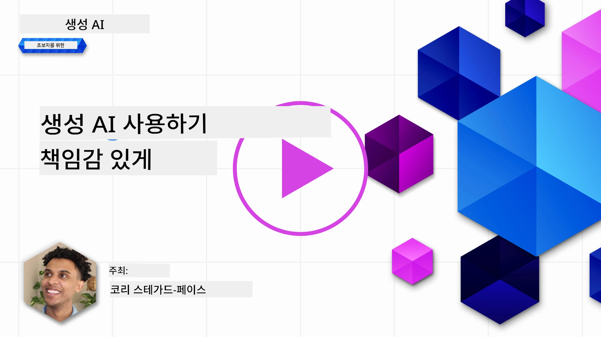
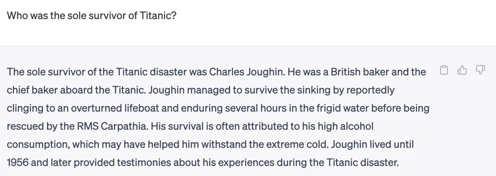
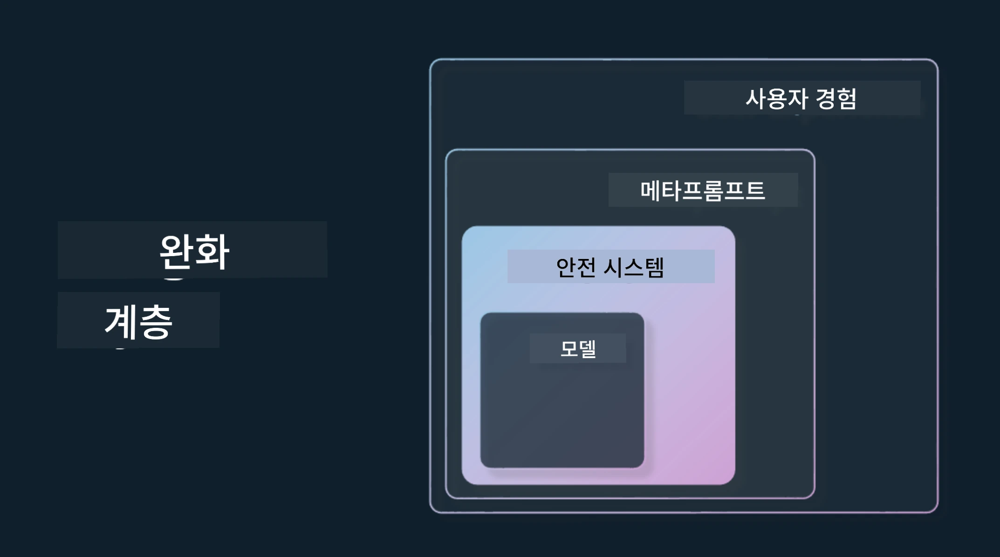

# 생성 AI를 책임감 있게 사용하기

> _위 이미지를 클릭하면 이 수업의 비디오를 볼 수 있습니다_

AI, 특히 생성 AI에 매료되기 쉽지만, 이를 책임감 있게 사용하는 방법을 고려해야 합니다. 출력물이 공정하고 해롭지 않도록 하는 방법 등 여러 가지를 고려해야 합니다. 이 장에서는 앞서 언급한 맥락, 고려해야 할 사항, AI 사용을 개선하기 위한 적극적인 조치를 취하는 방법을 제공하는 것을 목표로 합니다.

## 소개

이 수업에서는 다음을 다룰 것입니다:

- 생성 AI 애플리케이션을 구축할 때 책임 있는 AI를 우선시해야 하는 이유.
- 책임 있는 AI의 핵심 원칙과 생성 AI와의 관련성.
- 전략과 도구를 통해 이러한 책임 있는 AI 원칙을 실천하는 방법.

## 학습 목표

이 수업을 완료하면 다음 내용을 알게 됩니다:

- 생성 AI 애플리케이션을 구축할 때 책임 있는 AI의 중요성.
- 생성 AI 애플리케이션을 구축할 때 책임 있는 AI의 핵심 원칙을 생각하고 적용해야 하는 시기.
- 책임 있는 AI 개념을 실천할 수 있는 도구와 전략.

## 책임 있는 AI 원칙

생성 AI에 대한 관심은 어느 때보다 높습니다. 이 관심은 많은 신규 개발자, 주목, 자금을 이 영역으로 끌어왔습니다. 생성 AI를 사용해 제품과 회사를 구축하려는 사람들에게 매우 긍정적이지만, 책임감 있게 진행하는 것도 중요합니다.

이 과정 전반에서 우리는 스타트업과 AI 교육 제품을 구축하는 데 초점을 맞추고 있습니다. 우리는 책임 있는 AI 원칙인 공정성, 포용성, 신뢰성/안전성, 보안 및 개인 정보 보호, 투명성 및 책임성을 사용할 것입니다. 이러한 원칙을 통해 생성 AI를 제품에 사용하는 방법을 탐구할 것입니다.

## 왜 책임 있는 AI를 우선시해야 하나요

제품을 구축할 때 사용자의 최선의 이익을 염두에 둔 인간 중심 접근 방식이 최상의 결과를 가져옵니다.

생성 AI의 독특한 점은 유용한 답변, 정보, 안내 및 콘텐츠를 사용자에게 제공할 수 있는 능력입니다. 많은 수작업 없이도 매우 인상적인 결과를 낼 수 있습니다. 그러나 적절한 계획과 전략이 없으면 사용자의 경험, 제품, 그리고 사회 전체에 해로운 결과를 초래할 수 있습니다.

잠재적으로 해로운 결과 중 몇 가지(모두는 아님)를 살펴보겠습니다:

### 환각 (Hallucinations)

환각은 대형 언어 모델(LLM)이 완전히 무의미하거나 다른 정보원에 비추어 사실과 다른 내용을 생성할 때 사용되는 용어입니다.

예를 들어, 우리 스타트업에 학생들이 역사적 질문을 모델에게 할 수 있는 기능을 구축했다고 가정해 봅시다. 한 학생이 ‘타이타닉의 유일한 생존자는 누구인가?’라는 질문을 합니다.

모델이 아래와 같은 답변을 생성합니다:

> _(출처: [Flying bisons](https://flyingbisons.com?WT.mc_id=academic-105485-koreyst))_

매우 자신감 있고 완전한 답변이지만 불행하게도 틀렸습니다. 약간의 조사만 해도 타이타닉 사고의 생존자가 한 명 이상임을 알 수 있습니다. 이 주제를 갓 연구하기 시작한 학생에게 이 답변은 쉽게 의심하지 않고 사실로 받아들여질 수 있습니다. 그 결과 AI 시스템에 대한 신뢰성이 떨어지고 우리 스타트업의 평판에 부정적인 영향을 미칠 수 있습니다.

모든 LLM의 각 버전마다 우리는 환각을 최소화하는 성능 향상을 목격했습니다. 이러한 개선에도 불구하고, 애플리케이션 개발자와 사용자로서 우리는 이러한 한계를 계속 인지해야 합니다.

### 해로운 콘텐츠

앞 섹션에서 LLM이 부정확하거나 무의미한 응답을 생성하는 경우를 다루었지만, 또 다른 위험은 모델이 해로운 콘텐츠를 생성하는 것입니다.

해로운 콘텐츠는 다음과 같이 정의할 수 있습니다:

- 자해 또는 특정 집단에 대한 해를 지시하거나 권장하는 내용.
- 증오적이거나 모욕적인 내용.
- 공격이나 폭력 행위 계획의 지도.
- 불법 콘텐츠 찾기나 불법 행위 수행 방법의 지시.
- 성적으로 노골적인 콘텐츠 표시.

우리 스타트업에서는 학생들이 이러한 콘텐츠를 보지 않도록 적절한 도구와 전략을 갖추는 것이 중요합니다.

### 공정성 결여

공정성은 "AI 시스템이 편견과 차별에서 벗어나 모두에게 공정하고 평등하게 대하는 것"으로 정의됩니다. 생성 AI 세계에서는 소외된 집단에 대한 배타적 세계관이 모델 출력으로 강화되지 않도록 해야 합니다.

이런 유형의 출력은 사용자에게 긍정적인 제품 경험을 만드는 데 방해가 될 뿐만 아니라 사회 전체에 추가적인 해를 끼칩니다. 애플리케이션 개발자로서 우리는 항상 다양한 사용자 기반을 염두에 두고 생성 AI로 솔루션을 구축해야 합니다.

## 생성 AI를 책임감 있게 사용하는 방법

이제 책임감 있는 생성 AI의 중요성을 확인했으니, AI 솔루션을 책임감 있게 구축하기 위해 취할 수 있는 4단계에 대해 살펴보겠습니다:

### 잠재적 해악 측정

소프트웨어 테스트에서는 사용자가 애플리케이션에서 수행할 예상 작업을 테스트합니다. 마찬가지로, 사용자가 가장 많이 사용할 만한 다양한 프롬프트를 테스트하는 것은 잠재적 해악을 측정하는 좋은 방법입니다.

우리 스타트업은 교육 제품을 만들고 있으므로, 교육 관련 프롬프트 목록을 준비하는 것이 좋습니다. 이는 특정 주제, 역사적 사실, 학생 생활과 관련된 프롬프트일 수 있습니다.

### 잠재적 해악 완화

이제 모델과 그 응답으로 인해 발생할 수 있는 잠재적 해악을 방지하거나 제한할 방법을 찾아야 할 때입니다. 이는 4가지 층에서 살펴볼 수 있습니다:

- <strong>모델</strong>. 올바른 사용 사례에 맞는 모델 선택. GPT-4 같은 크고 복잡한 모델은 작고 특정한 사용 사례에 적용할 때 해로운 콘텐츠 위험이 더 클 수 있습니다. 학습 데이터를 사용해 미세 조정하는 것도 해로운 콘텐츠 위험을 줄입니다.

- **안전 시스템**. 안전 시스템은 모델을 제공하는 플랫폼 상의 도구 및 설정 모음으로, 해악을 완화합니다. 예를 들어 Azure OpenAI 서비스의 콘텐츠 필터링 시스템이 있습니다. 시스템은 또한 탈옥 공격과 봇 요청 같은 원치 않는 활동도 감지해야 합니다.

- <strong>메타프롬프트</strong>. 메타프롬프트와 그라운딩은 특정 행동과 정보를 기준으로 모델을 지시하거나 제한하는 방법입니다. 시스템 입력을 사용하여 모델의 특정 한계를 정의하거나, 시스템의 범위나 도메인에 더 관련성 높은 출력을 제공합니다.

또한 신뢰할 수 있는 소스만 모델이 정보로 활용하게 하는 검색 보강 생성(Retrieval Augmented Generation, RAG) 같은 기법을 사용할 수 있습니다. 이 과정 후반에 [검색 응용 프로그램 구축](../08-building-search-applications/README.md?WT.mc_id=academic-105485-koreyst)에 관한 수업이 있습니다.

- **사용자 경험**. 최종 층은 사용자가 애플리케이션 인터페이스를 통해 모델과 직접 상호작용하는 곳입니다. 이 방법으로 UI/UX를 설계하여 사용자가 모델에 보낼 수 있는 입력 유형과 사용자에게 표시되는 텍스트 또는 이미지를 제한할 수 있습니다. AI 애플리케이션을 배포할 때는 생성 AI 애플리케이션이 할 수 있는 것과 할 수 없는 것에 대해 투명해야 합니다.

우리는 [AI 애플리케이션을 위한 UX 설계](../12-designing-ux-for-ai-applications/README.md?WT.mc_id=academic-105485-koreyst)에 대한 전체 수업을 가지고 있습니다.

- **모델 평가**. LLM을 다루는 것은 모델이 학습된 데이터에 대해 항상 통제할 수 없기 때문에 어려울 수 있습니다. 그럼에도 불구하고 우리는 항상 모델의 성능과 출력을 평가해야 합니다. 모델 출력의 정확성, 유사성, 근거성, 관련성을 측정하는 것은 투명성과 신뢰를 이해 관계자와 사용자에게 제공합니다.

### 책임감 있는 생성 AI 솔루션 운영

AI 애플리케이션에 대한 운영 관행을 구축하는 것은 마지막 단계입니다. 여기에는 법률 및 보안 부서와 협력하여 모든 규제 정책을 준수하는 것이 포함됩니다. 출시 전에 전달 계획, 사고 처리 및 롤백 계획을 세워 사용자에게 발생할 수 있는 피해를 방지하려고 합니다.

## 도구

책임 있는 AI 솔루션 개발 업무가 많아 보일 수 있지만 노력할 가치가 있습니다. 생성 AI 영역이 성장함에 따라 개발자가 책임감을 쉽게 통합할 수 있도록 돕는 도구도 발전할 것입니다. 예를 들어, [Azure AI 콘텐츠 안전](https://learn.microsoft.com/azure/ai-services/content-safety/overview?WT.mc_id=academic-105485-koreyst)은 API 요청을 통해 해로운 콘텐츠와 이미지를 감지하는 데 도움을 줍니다.

## 지식 점검

책임 있는 AI 사용을 보장하기 위해 신경 써야 할 사항은 무엇인가요?

1. 답변이 정확한지 여부.
1. AI가 범죄에 사용되지 않도록 해로운 사용 방지.
1. AI가 편견과 차별에서 자유로운지 보장.

답: 2번과 3번이 맞습니다. 책임 있는 AI는 해로운 영향과 편견을 완화하는 방법 등을 고려하도록 도와줍니다.

## 🚀 도전 과제

[Azure AI 콘텐츠 안전](https://learn.microsoft.com/azure/ai-services/content-safety/overview?WT.mc_id=academic-105485-koreyst)에 대해 읽고 자신의 사용 사례에 적용할 수 있는 부분을 찾아보세요.

## 훌륭합니다, 학습을 계속하세요

이 수업을 마친 후, [생성 AI 학습 모음](https://aka.ms/genai-collection?WT.mc_id=academic-105485-koreyst)을 확인하여 생성 AI 지식을 계속 향상시키세요!

4강으로 이동하여 [프롬프트 엔지니어링 기초](../04-prompt-engineering-fundamentals/README.md?WT.mc_id=academic-105485-koreyst)를 살펴보겠습니다!

---

<!-- CO-OP TRANSLATOR DISCLAIMER START -->
**면책 조항**:
이 문서는 AI 번역 서비스 [Co-op Translator](https://github.com/Azure/co-op-translator)를 사용하여 번역되었습니다. 정확성을 기하기 위해 노력하고 있으나, 자동 번역은 오류나 부정확한 부분이 있을 수 있음을 유의하시기 바랍니다. 원본 문서의 원어본이 권위 있는 자료로 간주되어야 합니다. 중요한 정보의 경우, 전문가의 인간 번역을 권장합니다. 이 번역 사용으로 인해 발생하는 오해나 잘못된 해석에 대해 당사는 책임을 지지 않습니다.
<!-- CO-OP TRANSLATOR DISCLAIMER END -->