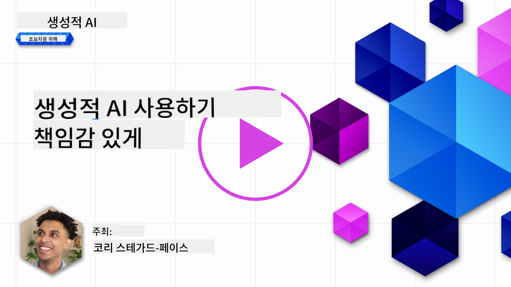
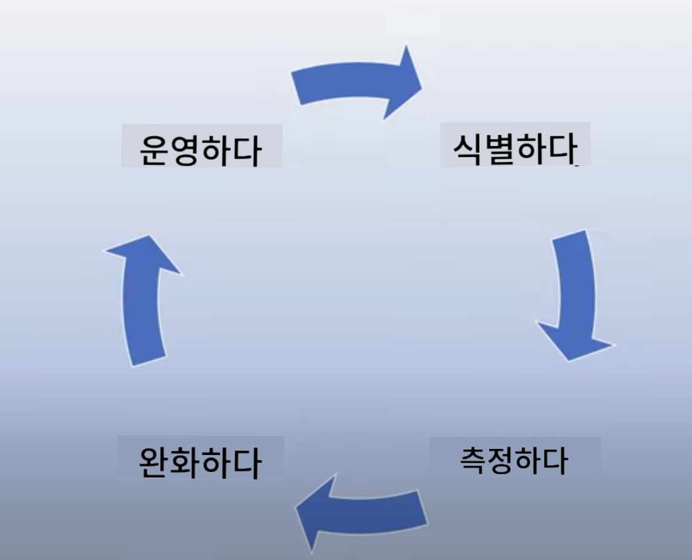
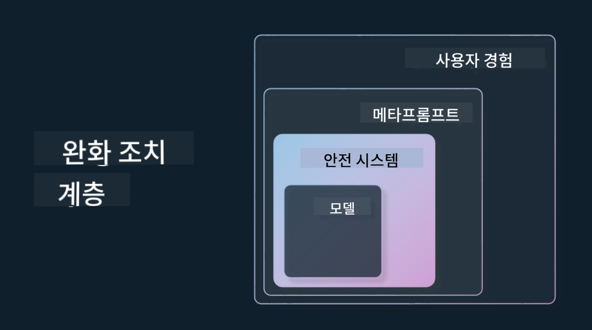

<!--
CO_OP_TRANSLATOR_METADATA:
{
  "original_hash": "13084c6321a2092841b9a081b29497ba",
  "translation_date": "2025-06-25T11:16:23+00:00",
  "source_file": "03-using-generative-ai-responsibly/README.md",
  "language_code": "ko"
}
-->
# 생성적 AI를 책임감 있게 사용하기

> _위 이미지를 클릭하면 이 강의의 비디오를 볼 수 있습니다_

AI, 특히 생성적 AI에 매료되기 쉽지만, 책임감 있게 사용하는 방법을 고려해야 합니다. 출력이 공정하고 해롭지 않도록 보장하는 방법 등 여러 가지를 고려해야 합니다. 이 장에서는 이러한 맥락과 고려해야 할 사항, AI 사용을 개선하기 위한 적극적인 조치를 제공하는 것을 목표로 합니다.

## 소개

이 강의에서는 다음을 다룹니다:

- 생성적 AI 애플리케이션을 구축할 때 왜 책임 있는 AI를 우선시해야 하는지.
- 책임 있는 AI의 핵심 원칙과 생성적 AI와의 관계.
- 전략과 도구를 통해 이러한 책임 있는 AI 원칙을 실천하는 방법.

## 학습 목표

이 강의를 완료한 후에는 다음을 알게 됩니다:

- 생성적 AI 애플리케이션을 구축할 때 책임 있는 AI의 중요성.
- 생성적 AI 애플리케이션을 구축할 때 책임 있는 AI의 핵심 원칙을 언제 생각하고 적용해야 하는지.
- 책임 있는 AI 개념을 실천할 수 있는 도구와 전략.

## 책임 있는 AI 원칙

생성적 AI에 대한 열정은 그 어느 때보다 높습니다. 이 열정은 많은 새로운 개발자, 관심, 자금을 이 공간에 가져왔습니다. 생성적 AI를 사용하여 제품과 회사를 구축하려는 사람들에게는 매우 긍정적이지만, 우리는 책임감 있게 진행해야 합니다.

이 과정 내내 우리는 스타트업과 AI 교육 제품을 구축하는 데 집중하고 있습니다. 우리는 책임 있는 AI의 원칙인 공정성, 포용성, 신뢰성/안전성, 보안 및 프라이버시, 투명성, 책임성을 사용할 것입니다. 이러한 원칙을 통해 제품에서 생성적 AI를 사용하는 방법과 관련성을 탐구할 것입니다.

## 왜 책임 있는 AI를 우선시해야 하는가

제품을 구축할 때 사용자의 최선의 이익을 염두에 두고 인간 중심 접근 방식을 취하면 최고의 결과를 얻을 수 있습니다.

생성적 AI의 독특함은 사용자에게 유용한 답변, 정보, 지침, 콘텐츠를 생성할 수 있는 능력입니다. 이는 많은 수작업 단계를 거치지 않고도 매우 인상적인 결과를 얻을 수 있습니다. 적절한 계획과 전략이 없다면 사용자, 제품, 전체 사회에 해로운 결과를 초래할 수 있습니다.

잠재적으로 해로운 결과 중 일부(모두는 아님)를 살펴보겠습니다:

### 환각

환각은 LLM이 완전히 터무니없는 내용이나 다른 정보 소스를 기반으로 사실적으로 잘못된 내용을 생성할 때 사용하는 용어입니다.

예를 들어, 학생들이 모델에게 역사적 질문을 할 수 있는 기능을 스타트업에 구축했다고 가정해봅시다. 학생이 `Who was the sole survivor of Titanic?`라는 질문을 합니다.

모델은 아래와 같은 응답을 생성합니다:

> _(출처: [Flying bisons](https://flyingbisons.com?WT.mc_id=academic-105485-koreyst))_

이것은 매우 자신감 있고 철저한 답변입니다. 불행히도 이것은 잘못된 답변입니다. 최소한의 연구만으로도 타이타닉 재난의 생존자가 한 명 이상이라는 것을 알 수 있습니다. 이 주제에 대해 연구를 시작하는 학생에게는 이 답변이 충분히 설득력이 있어 질문되지 않고 사실로 취급될 수 있습니다. 이로 인해 AI 시스템이 신뢰할 수 없게 되고 스타트업의 명성에 부정적인 영향을 미칠 수 있습니다.

주어진 LLM의 각 반복에서 환각을 최소화하는 성능 향상이 이루어졌습니다. 이러한 개선에도 불구하고 애플리케이션 구축자 및 사용자는 이러한 제한을 인식해야 합니다.

### 해로운 콘텐츠

이전 섹션에서 LLM이 잘못되거나 터무니없는 응답을 생성할 때에 대해 다뤘습니다. 모델이 해로운 콘텐츠로 응답할 때의 위험도 인식해야 합니다.

해로운 콘텐츠는 다음과 같이 정의할 수 있습니다:

- 자해 또는 특정 그룹에 대한 해를 제공하는 지침 또는 권장.
- 혐오적이거나 경멸적인 콘텐츠.
- 공격 또는 폭력 행위 계획을 안내.
- 불법 콘텐츠를 찾거나 불법 행위를 저지르는 방법에 대한 지침 제공.
- 성적으로 노골적인 콘텐츠 표시.

우리 스타트업에서는 학생들이 이러한 유형의 콘텐츠를 보지 않도록 적절한 도구와 전략을 마련하고 싶습니다.

### 공정성 부족

공정성은 "AI 시스템이 편향과 차별이 없고 모든 사람을 공정하고 평등하게 대우하는 것을 보장하는 것"으로 정의됩니다. 생성적 AI의 세계에서는 모델의 출력이 소외된 그룹의 배제적 세계관을 강화하지 않도록 보장하고 싶습니다.

이러한 유형의 출력은 사용자에게 긍정적인 제품 경험을 구축하는 데 파괴적일 뿐만 아니라 사회적 해악을 초래합니다. 애플리케이션 구축자로서 우리는 생성적 AI를 사용하여 솔루션을 구축할 때 항상 넓고 다양한 사용자 기반을 염두에 두어야 합니다.

## 생성적 AI를 책임감 있게 사용하는 방법

이제 책임 있는 생성적 AI의 중요성을 확인했으므로 AI 솔루션을 책임감 있게 구축하기 위해 취할 수 있는 4단계를 살펴보겠습니다:

### 잠재적 해악 측정

소프트웨어 테스트에서는 사용자의 예상 행동을 애플리케이션에서 테스트합니다. 마찬가지로 사용자가 가장 많이 사용할 것으로 예상되는 다양한 프롬프트를 테스트하는 것은 잠재적 해악을 측정하는 좋은 방법입니다.

우리 스타트업이 교육 제품을 구축하고 있으므로 교육 관련 프롬프트 목록을 준비하는 것이 좋습니다. 이는 특정 과목, 역사적 사실, 학생 생활에 관한 프롬프트를 다룰 수 있습니다.

### 잠재적 해악 완화

이제 모델과 그 응답이 초래할 수 있는 잠재적 해악을 예방하거나 제한할 방법을 찾을 때입니다. 이를 4가지 다른 계층에서 살펴볼 수 있습니다:

- **모델**. 올바른 사용 사례에 적합한 모델 선택. GPT-4와 같은 더 크고 복잡한 모델은 더 작은 특정 사용 사례에 적용될 때 해로운 콘텐츠의 위험을 증가시킬 수 있습니다. 교육 데이터를 사용하여 미세 조정하면 해로운 콘텐츠의 위험을 줄일 수 있습니다.

- **안전 시스템**. 안전 시스템은 모델을 제공하는 플랫폼에서 해악을 완화하는 데 도움이 되는 도구와 구성의 집합입니다. 예를 들어 Azure OpenAI 서비스의 콘텐츠 필터링 시스템이 있습니다. 시스템은 탈옥 공격 및 봇 요청과 같은 원치 않는 활동을 감지해야 합니다.

- **메타프롬프트**. 메타프롬프트와 그라운딩은 특정 행동 및 정보에 따라 모델을 지시하거나 제한하는 방법입니다. 이는 시스템 입력을 사용하여 모델의 특정 제한을 정의하는 것일 수 있습니다. 또한 시스템의 범위 또는 도메인에 더 관련성이 있는 출력을 제공하는 것입니다.

또한 신뢰할 수 있는 출처에서만 정보를 추출하도록 모델을 설정하는 Retrieval Augmented Generation (RAG)과 같은 기술을 사용할 수 있습니다. 이 과정의 후반부에 [검색 애플리케이션 구축](../08-building-search-applications/README.md?WT.mc_id=academic-105485-koreyst)에 관한 강의가 있습니다.

- **사용자 경험**. 마지막 계층은 사용자가 애플리케이션의 인터페이스를 통해 모델과 직접 상호작용하는 곳입니다. 이 방식으로 사용자가 모델에 보낼 수 있는 입력 유형과 사용자에게 표시되는 텍스트 또는 이미지를 제한하도록 UI/UX를 설계할 수 있습니다. AI 애플리케이션을 배포할 때 생성적 AI 애플리케이션이 할 수 있는 것과 할 수 없는 것에 대해 투명해야 합니다.

우리는 [AI 애플리케이션을 위한 UX 디자인](../12-designing-ux-for-ai-applications/README.md?WT.mc_id=academic-105485-koreyst)에 관한 전체 강의를 준비했습니다.

- **모델 평가**. LLM을 다루는 것은 모델이 훈련된 데이터에 항상 제어할 수 없기 때문에 어려울 수 있습니다. 그럼에도 불구하고 모델의 성능과 출력을 항상 평가해야 합니다. 모델의 정확성, 유사성, 근거성, 출력의 관련성을 측정하는 것은 여전히 중요합니다. 이는 이해관계자와 사용자에게 투명성과 신뢰를 제공합니다.

### 책임 있는 생성적 AI 솔루션 운영

AI 애플리케이션에 대한 운영 실습을 구축하는 것이 최종 단계입니다. 이는 규제 정책을 준수하기 위해 법률 및 보안과 같은 스타트업의 다른 부문과 협력하는 것을 포함합니다. 출시 전에 사용자에게 해를 입히는 것을 방지하기 위해 전달, 사고 처리, 롤백 계획을 구축하고자 합니다.

## 도구

책임 있는 AI 솔루션을 개발하는 작업은 많은 것처럼 보일 수 있지만, 노력할 가치가 있는 작업입니다. 생성적 AI 분야가 성장함에 따라 개발자가 워크플로에 책임감을 효율적으로 통합할 수 있도록 돕는 도구가 성숙해질 것입니다. 예를 들어, [Azure AI Content Safety](https://learn.microsoft.com/azure/ai-services/content-safety/overview?WT.mc_id=academic-105485-koreyst)는 API 요청을 통해 해로운 콘텐츠와 이미지를 감지하는 데 도움을 줄 수 있습니다.

## 지식 확인

책임 있는 AI 사용을 보장하기 위해 신경 써야 할 몇 가지 사항은 무엇인가요?

1. 답변이 정확한지 확인합니다.
1. 해로운 사용, AI가 범죄 목적으로 사용되지 않도록 합니다.
1. AI가 편향과 차별이 없도록 보장합니다.

A: 2와 3이 맞습니다. 책임 있는 AI는 해로운 영향과 편향을 완화하는 방법을 고려하는 데 도움이 됩니다.

## 🚀 도전

[Azure AI Content Safety](https://learn.microsoft.com/azure/ai-services/content-safety/overview?WT.mc_id=academic-105485-koreyst)를 읽고 사용에 맞게 채택할 수 있는 것을 찾아보세요.

## 훌륭한 작업, 학습 계속하기

이 강의를 완료한 후에는 [Generative AI Learning collection](https://aka.ms/genai-collection?WT.mc_id=academic-105485-koreyst)을 확인하여 생성적 AI 지식을 계속 향상시키세요!

Lesson 4로 이동하여 [Prompt Engineering Fundamentals](../04-prompt-engineering-fundamentals/README.md?WT.mc_id=academic-105485-koreyst)를 살펴보세요!

**면책 조항**:  
이 문서는 AI 번역 서비스 [Co-op Translator](https://github.com/Azure/co-op-translator)를 사용하여 번역되었습니다. 우리는 정확성을 위해 노력하지만, 자동 번역에는 오류나 부정확성이 있을 수 있음을 유의하시기 바랍니다. 원본 문서는 해당 언어로 작성된 것이 권위 있는 출처로 간주되어야 합니다. 중요한 정보의 경우, 전문적인 인간 번역을 권장합니다. 이 번역 사용으로 인한 오해나 잘못된 해석에 대해 우리는 책임을 지지 않습니다.