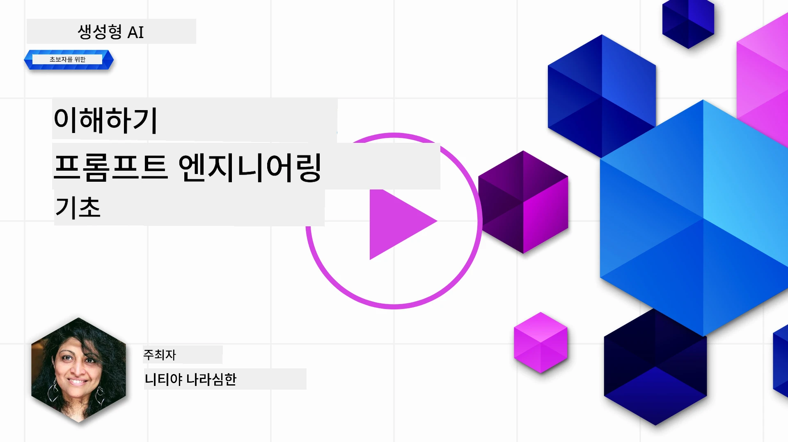
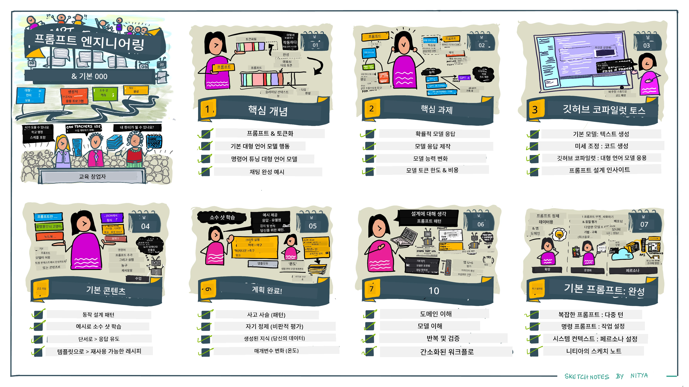
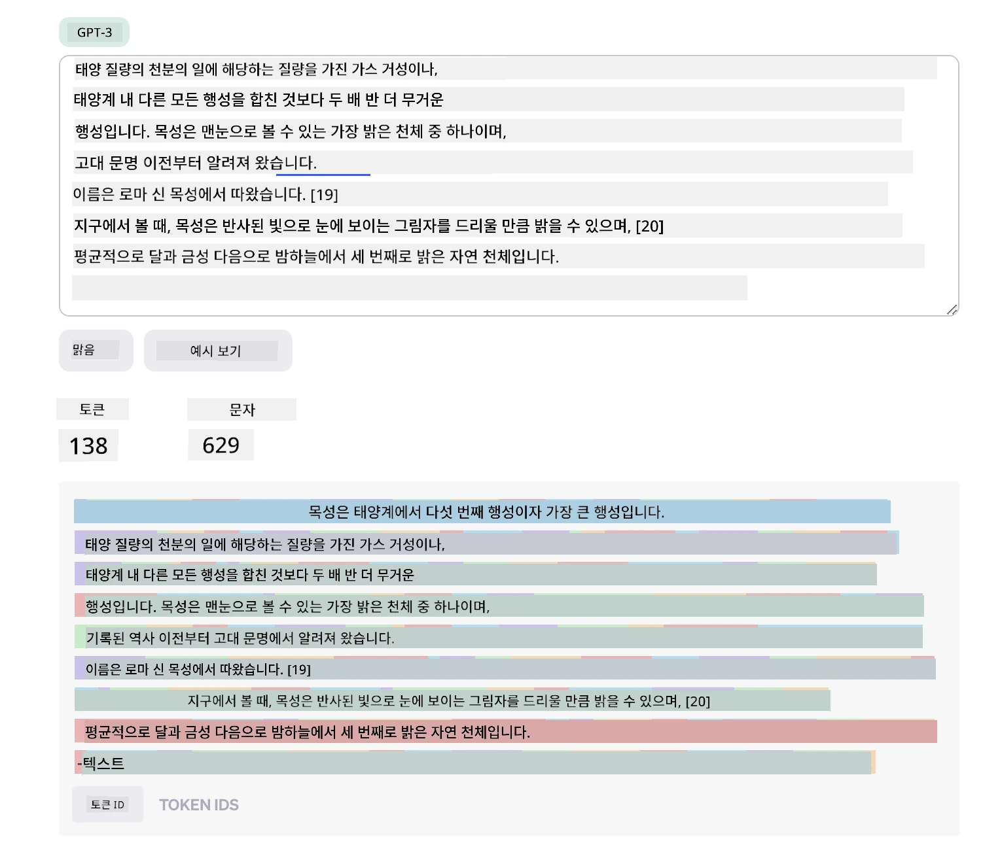
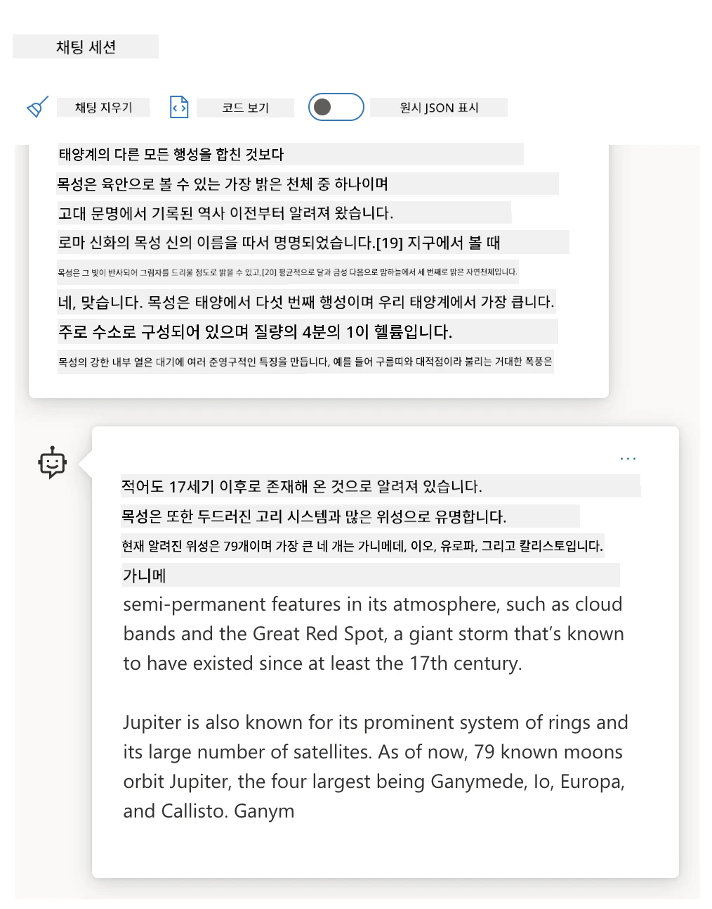
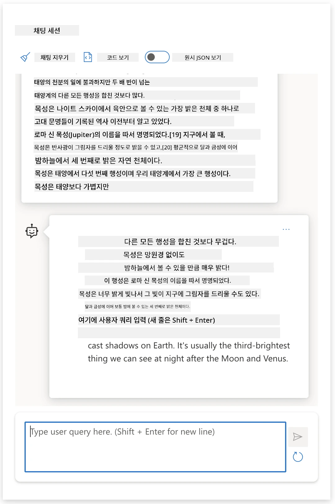
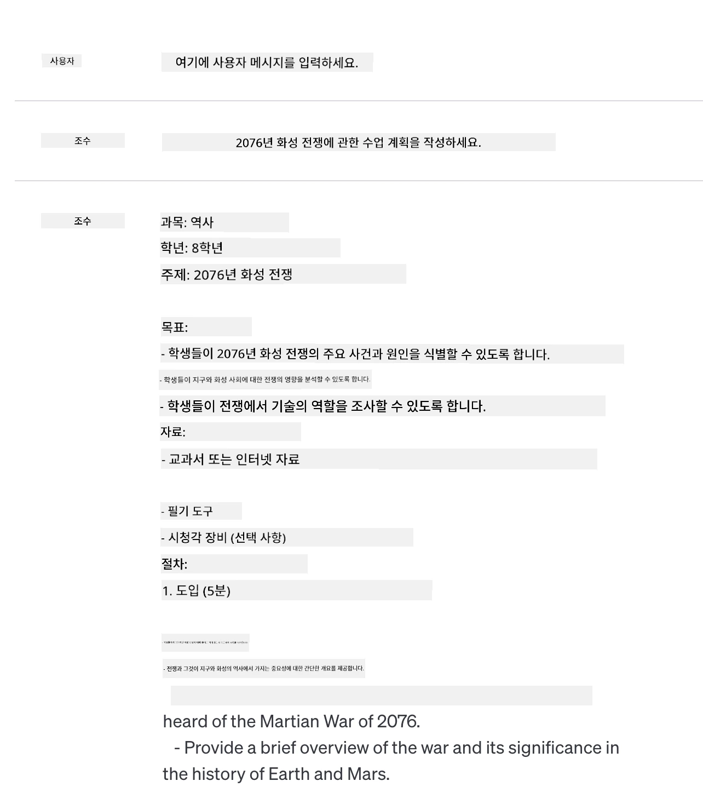
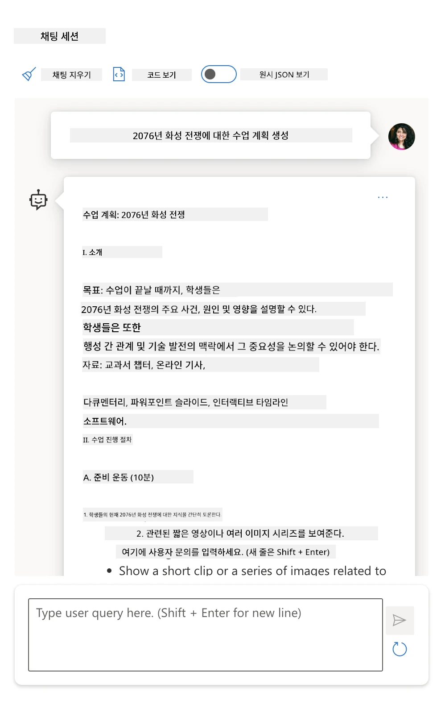
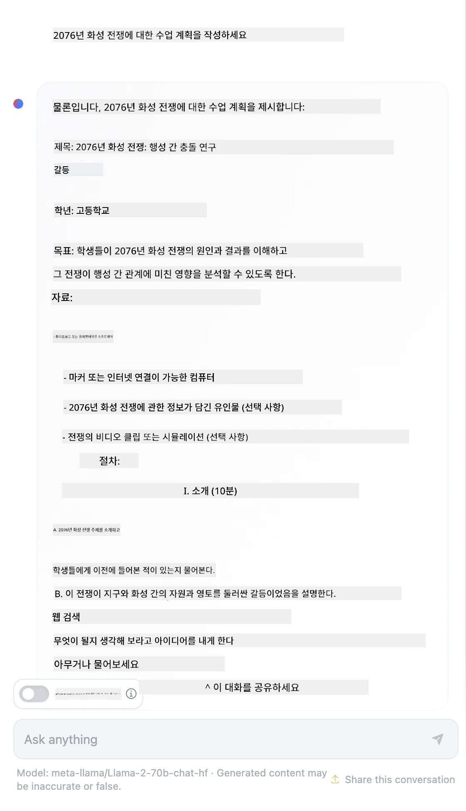

# 프롬프트 엔지니어링 기초

[](https://youtu.be/GElCu2kUlRs?si=qrXsBvXnCW12epb8)

## 소개
이 모듈은 생성형 AI 모델에서 효과적인 프롬프트를 만드는 데 필수적인 개념과 기술을 다룹니다. LLM에 프롬프트를 작성하는 방식도 중요합니다. 신중하게 설계된 프롬프트는 더 나은 품질의 응답을 얻을 수 있습니다. 그런데 _프롬프트_와 _프롬프트 엔지니어링_이라는 용어는 정확히 무엇을 의미하며, LLM에 보내는 프롬프트 _입력_을 어떻게 개선할 수 있을까요? 이 장과 다음 장에서 이러한 질문에 답하려고 합니다.

_생성형 AI_는 사용자 요청에 대응하여 새로운 콘텐츠(예: 텍스트, 이미지, 오디오, 코드 등)를 생성할 수 있습니다. 이는 자연어와 코드를 사용하도록 훈련된 OpenAI의 GPT("Generative Pre-trained Transformer") 시리즈와 같은 _대형 언어 모델(LLM)_을 사용하여 실현됩니다.

사용자는 이제 채팅과 같은 익숙한 방식으로 이 모델들과 상호작용할 수 있으며, 별도의 기술 전문 지식이나 훈련이 필요 없습니다. 이 모델들은 _프롬프트 기반_으로 동작하며, 사용자는 텍스트 입력(프롬프트)을 보내면 AI 응답(완성)을 받습니다. 그런 다음 다중 대화(turn)로 "AI와 채팅"하며 프롬프트를 반복적으로 다듬어 응답이 기대에 부합할 때까지 조정할 수 있습니다.

"프롬프트"는 이제 생성형 AI 앱의 주요 _프로그래밍 인터페이스_가 되어, 모델에 수행할 작업을 알려주고 응답 품질에 영향을 줍니다. "프롬프트 엔지니어링"은 일관성 있고 품질 높은 응답을 대규모로 제공하기 위해 프롬프트 _설계 및 최적화_에 집중하는 빠르게 성장하는 연구 분야입니다.

## 학습 목표

이 수업에서는 프롬프트 엔지니어링이 무엇인지, 왜 중요한지, 주어진 모델과 응용 목표에 맞게 더 효과적인 프롬프트를 작성하는 방법을 배웁니다. 프롬프트 엔지니어링의 핵심 개념과 모범 사례를 이해하고, Jupyter 노트북 “샌드박스” 환경에서 실제 예제에 이를 적용하는 방법을 익힙니다.

이 수업이 끝나면 다음을 할 수 있습니다:

1. 프롬프트 엔지니어링이 무엇이며 왜 중요한지 설명한다.
2. 프롬프트 구성 요소와 그것들이 어떻게 사용되는지 설명한다.
3. 프롬프트 엔지니어링을 위한 모범 사례와 기법을 배운다.
4. 학습한 기법을 OpenAI 엔드포인트를 사용해 실제 예제에 적용한다.

## 주요 용어

프롬프트 엔지니어링: AI 모델이 원하는 출력을 생성하도록 안내하기 위해 입력을 설계하고 다듬는 작업.
토크나이제이션(Tokenization): 텍스트를 모델이 이해하고 처리할 수 있는 더 작은 단위인 토큰으로 변환하는 과정.
명령 조정 LLM(Instruction-Tuned LLM): 반응 정확도와 적합성을 높이기 위해 특정 명령에 맞춰 미세조정된 대형 언어 모델.

## 학습 샌드박스

프롬프트 엔지니어링은 현재 과학이라기보다는 예술에 가깝습니다. 직관을 개선하는 가장 좋은 방법은 _더 많이 연습_하고, 응용 도메인 전문성과 권장 기술 및 모델별 최적화를 결합한 시행착오 방식을 채택하는 것입니다.

이 수업에 제공되는 Jupyter 노트북은 학습 내용을 시도해 볼 수 있는 _샌드박스_ 환경을 제공합니다. 연습 문제를 실행하려면 다음이 필요합니다:

1. **Azure OpenAI API 키** - 배포된 LLM의 서비스 엔드포인트.
2. **파이썬 런타임** - 노트북을 실행할 환경.
3. **로컬 환경 변수** - _지금 [SETUP](./../00-course-setup/02-setup-local.md?WT.mc_id=academic-105485-koreyst) 단계를 완료하여 준비하세요_.

노트북은 _스타터_ 연습 문제와 함께 제공되며, 자신만의 _마크다운_ (설명)과 _코드_ (프롬프트 요청) 섹션을 추가해 더 많은 예제나 아이디어를 시도하며 프롬프트 설계 직관을 쌓을 수도 있습니다.

## 일러스트 가이드

이 수업에서 다루는 내용을 간략히 파악하고 싶으신가요? 이 일러스트 가이드를 참고하세요. 주요 주제와 핵심 요점을 한눈에 보여주며, 각 내용에 대해 생각할 거리를 제공합니다. 이 수업 로드맵은 핵심 개념과 도전 과제를 이해하는 것부터 관련 프롬프트 엔지니어링 기법과 모범 사례로 문제를 해결하는 과정까지 안내합니다. 이 가이드의 "고급 기법" 섹션은 이 커리큘럼의 _다음_ 장에서 다루는 내용입니다.



## 우리 스타트업

이제 _이 주제_가 [AI 혁신을 교육에 도입하려는](https://educationblog.microsoft.com/2023/06/collaborating-to-bring-ai-innovation-to-education?WT.mc_id=academic-105485-koreyst) 우리 스타트업 미션과 어떻게 연관되는지 이야기해 보겠습니다. 우리는 _개인화 학습_의 AI 지원 애플리케이션을 구축하고자 합니다. 따라서 애플리케이션의 다양한 사용자가 프롬프트를 어떻게 "설계"할 수 있을지 생각해 봅시다:

- **관리자**는 AI에 _교육 과정 데이터 분석을 요청하여 누락된 부분을 식별_할 수 있습니다. AI는 결과를 요약하거나 코드로 시각화할 수 있습니다.
- **교육자**는 AI에 _대상 청중과 주제에 맞는 수업 계획을 생성_하도록 요청할 수 있습니다. AI는 지정된 형식으로 개인화된 계획을 만들 수 있습니다.
- **학생**은 AI에 _어려운 과목에 대해 튜터링_을 요청할 수 있습니다. AI는 수준에 맞춘 강의, 힌트 및 예시로 학생들을 지도할 수 있습니다.

이것은 빙산의 일각에 불과합니다. 교육 전문가들이 큐레이션한 오픈소스 프롬프트 라이브러리인 [Prompts For Education](https://github.com/microsoft/prompts-for-edu/tree/main?WT.mc_id=academic-105485-koreyst)를 확인해 보세요. 더 다양한 가능성을 감지할 수 있습니다! _샌드박스나 OpenAI 플레이그라운드에서 프롬프트를 실행해 보며 어떤 결과가 나오는지 체험해 보세요!_

<!--
LESSON TEMPLATE:
이 단원은 핵심 개념 #1을 다뤄야 합니다.
예제와 참고 자료로 개념을 강화합니다.

개념 #1:
프롬프트 엔지니어링.
정의하고 왜 필요한지 설명합니다.
-->

## 프롬프트 엔지니어링이란?

이 수업은 **프롬프트 엔지니어링**을 주어진 응용 목표와 모델에 대해 일관성 있고 품질 좋은 응답(완성)을 제공하기 위해 텍스트 입력(프롬프트)을 _설계하고 최적화하는_ 과정으로 정의하며 시작했습니다. 이를 2단계 과정으로 생각할 수 있습니다:

- 특정 모델과 목표에 맞게 초기 프롬프트를 _설계_함
- 응답 품질 향상을 위해 프롬프트를 반복적으로 _다듬음_

이는 최적의 결과를 위해 사용자 직관과 노력이 필요한 필연적인 시행착오 과정입니다. 왜 중요할까요? 이 질문에 답하려면 우선 세 가지 개념을 이해해야 합니다:

- _토크나이제이션_ = 모델이 프롬프트를 "보는" 방식
- _기본 LLM_ = 기반 모델이 프롬프트를 "처리"하는 방식
- _명령 조정 LLM_ = 모델이 이제 "작업"을 이해하는 방식

### 토크나이제이션

LLM은 프롬프트를 _토큰의 시퀀스_로 인식하며, 서로 다른 모델(또는 모델 버전)은 같은 프롬프트를 다르게 토크나이즈할 수 있습니다. LLM은 토큰을 기준으로 훈련되었으며(원시 텍스트가 아니라), 프롬프트가 토크나이즈되는 방식은 생성된 응답의 품질에 직접적인 영향을 미칩니다.

토크나이제이션이 어떻게 작동하는지 감을 잡으려면 [OpenAI 토크나이저](https://platform.openai.com/tokenizer?WT.mc_id=academic-105485-koreyst) 같은 도구를 사용해 보세요. 프롬프트를 복사하여 붙여넣으면 공백 문자와 구두점이 어떻게 처리되는지 포함해 토큰으로 변환되는 과정을 볼 수 있습니다. 이 예는 구버전 LLM(GPT-3)을 보여주므로, 최신 모델로 시도하면 다른 결과가 나올 수도 있습니다.



### 개념: 기반 모델(Foundation Models)

프롬프트가 토크나이즈되면, ["기본 LLM"](https://blog.gopenai.com/an-introduction-to-base-and-instruction-tuned-large-language-models-8de102c785a6?WT.mc_id=academic-105485-koreyst) 또는 기반 모델의 주요 기능은 그 시퀀스 안의 다음 토큰을 예측하는 것입니다. LLM은 방대한 텍스트 데이터셋으로 훈련되어 토큰 간 통계적 관계를 잘 파악하므로 자신 있게 다음 토큰을 예측할 수 있습니다. 단어 뜻을 이해하는 것이 아니라, 완성할 수 있는 패턴으로 인식합니다. 사용자 개입이나 미리 정해진 조건에 의해 종료될 때까지 시퀀스를 계속 예측합니다.

프롬프트 기반 완성이 어떻게 작동하는지 보고 싶으면 위 프롬프트를 Azure OpenAI Studio [_Chat Playground_](https://oai.azure.com/playground?WT.mc_id=academic-105485-koreyst)에 기본 설정으로 입력해 보세요. 시스템은 프롬프트를 정보 요청으로 처리하도록 구성되어 있어 이 맥락에 맞는 완성을 볼 수 있습니다.

하지만 사용자가 특정 기준이나 작업 목표에 부합하는 내용을 원한다면 어떻게 할까요? 이때 _명령 조정_ LLM이 등장합니다.



### 개념: 명령 조정 LLM

[명령 조정 LLM](https://blog.gopenai.com/an-introduction-to-base-and-instruction-tuned-large-language-models-8de102c785a6?WT.mc_id=academic-105485-koreyst)은 기반 모델을 시작으로 명확한 지시가 포함된 예제 또는 입출력 쌍(예: 다중 대화 "메시지")로 미세조정하여 AI가 그 지시를 따르도록 학습합니다.

이는 인간 피드백을 이용한 강화 학습(RLHF)과 같은 기법을 사용해 모델이 _지침을 따르고_ _피드백으로부터 학습_하도록 훈련합니다. 따라서 실제 응용에 더 적합하고 사용자 목표에 더 관련성 높은 응답을 생성합니다.

직접 시도해 보세요. 위의 프롬프트를 다시 입력하되, _시스템 메시지_를 다음 지침으로 변경해 보세요:

> _제공된 내용을 2학년 학생이 이해할 수 있도록 요약하세요. 결과는 한 단락에 3~5개의 핵심 사항으로 유지하세요._

결과가 목표와 형식에 맞게 조정된 것을 볼 수 있나요? 교육자는 이제 이 응답을 수업 슬라이드에 바로 사용할 수 있습니다.



## 왜 프롬프트 엔지니어링이 필요한가?

이제 프롬프트가 LLM에 의해 어떻게 처리되는지 알았으니, _왜_ 프롬프트 엔지니어링이 필요한지 이야기해 봅시다. 그 답은 현재 LLM들이 여러 도전 과제를 안고 있어서 프롬프트 작성과 최적화에 노력하지 않으면 _신뢰할 수 있고 일관된 완성_을 얻기 어렵다는 사실에 있습니다. 예를 들면:

1. **모델 응답은 확률적이다.** _같은 프롬프트_라도 다른 모델이나 모델 버전에서는 다른 결과가 나올 수 있습니다. 심지어 _같은 모델_이라도 시간에 따라 결과가 다를 수 있습니다. _프롬프트 엔지니어링 기법은 이러한 변동을 최소화하는 데 도움을 줍니다._

2. **모델은 허구의 응답을 생성할 수 있다.** 모델은 _방대하지만 한정된_ 데이터로 사전훈련되어 훈련 범위 밖의 개념에 대해선 지식이 부족합니다. 따라서 부정확하거나 허구이거나 알려진 사실과 모순되는 응답을 생성할 수 있습니다. _프롬프트 엔지니어링 기법은 인용이나 추론을 요청하는 등 허구를 식별하고 완화하도록 사용자에게 도움을 줍니다._

3. **모델 역량은 다양하다.** 최신 모델이나 신세대 모델은 더 풍부한 역량을 제공하지만, 비용과 복잡성에 있어 독특한 특성과 타협점도 있습니다. _프롬프트 엔지니어링은 차이를 추상화하고 모델별 요구사항에 맞게 확장 가능하고 원활하게 적응하는 모범 사례와 워크플로우 개발에 도움을 줍니다._

OpenAI 또는 Azure OpenAI 플레이그라운드에서 직접 확인해 봅시다:

- 동일한 프롬프트를 서로 다른 LLM 배포 환경(OpenAI, Azure OpenAI, Hugging Face 등)에서 사용해 보세요 - 변동성을 확인할 수 있나요?
- 동일한 프롬프트를 _같은_ LLM 배포(예: Azure OpenAI 플레이그라운드)에서 반복 사용해 보세요 - 변동성은 어떻게 달랐나요?

### 허구 사례

본 과정에서는 LLM이 훈련 한계나 기타 제약으로 인해 가끔 사실과 다른 정보를 생성하는 현상을 **"허구(fabrication)"**라고 부릅니다. 일반 기사나 연구 논문에서는 이를 _"환각(hallucinations)"_이라고도 합니다. 하지만 우리는 기계 구동 결과에 인간과 같은 특성을 부여하지 않도록 _"허구"_라는 용어 사용을 권장합니다. 이는 일부 맥락에서 공격적이거나 비포괄적일 수 있는 용어 사용을 배제하며, [책임 있는 AI 가이드라인](https://www.microsoft.com/ai/responsible-ai?WT.mc_id=academic-105485-koreyst)의 용어 측면을 준수합니다.

허구 현상이 어떻게 작동하는지 감을 잡으려면, AI가 존재하지 않는 주제에 대한 콘텐츠를 생성하도록 지시하는 프롬프트를 생각해 보세요(해당 내용이 훈련 데이터셋에 없음을 확실히 하는 목적). 예를 들어, 저는 다음과 같은 프롬프트를 시도했습니다:

> **프롬프트:** 2076년 화성 전쟁에 관한 수업 계획을 생성하세요.
웹 검색 결과 2076년에 관한 화성 전쟁 허구 계정(예: TV 시리즈나 책)이 있었지만, 2076년 관련 내용은 없었습니다. 상식적으로도 2076년은 _미래_이므로 실제 사건과 연관될 수 없습니다.

그렇다면 서로 다른 LLM 제공자들로 이 프롬프트를 실행하면 어떻게 될까요?

> **응답 1**: OpenAI Playground (GPT-35)



> **응답 2**: Azure OpenAI Playground (GPT-35)



> **응답 3**: : Hugging Face Chat Playground (LLama-2)



예상대로, 각 모델(또는 모델 버전)은 확률적 행동 및 모델 역량 차이로 인해 약간씩 다른 응답을 생성합니다. 예를 들어, 한 모델은 8학년 학생을 대상으로 하고 다른 모델은 고등학생을 대상으로 합니다. 하지만 세 가지 모델 모두 정보가 없는 사용자를 설득할 수 있을 정도로 실제 사건인 것처럼 응답을 생성했습니다.

_메타프롬프트(metaprompting)_ 및 _온도 설정(temperature configuration)_ 같은 프롬프트 엔지니어링 기법은 모델의 허구 생성(fabrication)을 어느 정도 줄일 수 있습니다. 새로운 프롬프트 엔지니어링 _아키텍처_들은 이러한 효과를 완화하거나 줄이기 위해 새로운 도구와 기법을 프롬프트 흐름에 원활히 통합합니다.

## 사례 연구: GitHub Copilot

이 섹션을 마무리하며 실무 솔루션에서 프롬프트 엔지니어링이 어떻게 사용되는지 알아보기 위해 사례 연구 하나를 살펴보겠습니다: [GitHub Copilot](https://github.com/features/copilot?WT.mc_id=academic-105485-koreyst).

GitHub Copilot은 "AI 페어 프로그래머"로서, 텍스트 프롬프트를 코드 완성으로 변환하며 개발 환경(예: Visual Studio Code)에 통합되어 원활한 사용자 경험을 제공합니다. 다음 블로그 시리즈에서 문서화된 대로, 초기 버전은 OpenAI Codex 모델 기반이었고, 엔지니어들은 모델 미세조정과 더 나은 프롬프트 엔지니어링이 코드 품질 향상에 필요함을 빠르게 깨달았습니다. 7월에는 [Codex를 넘어선 개선된 AI 모델](https://github.blog/2023-07-28-smarter-more-efficient-coding-github-copilot-goes-beyond-codex-with-improved-ai-model/?WT.mc_id=academic-105485-koreyst)을 선보여 제안 속도를 더욱 높였습니다.

학습 여정을 따라가려면 아래 게시물을 순서대로 읽으세요.

- **2023년 5월** | [GitHub Copilot이 코드를 더 잘 이해하는 법](https://github.blog/2023-05-17-how-github-copilot-is-getting-better-at-understanding-your-code/?WT.mc_id=academic-105485-koreyst)
- **2023년 5월** | [GitHub 내부: GitHub Copilot 뒤의 LLM 작업](https://github.blog/2023-05-17-inside-github-working-with-the-llms-behind-github-copilot/?WT.mc_id=academic-105485-koreyst)
- **2023년 6월** | [GitHub Copilot을 위한 더 나은 프롬프트 작성법](https://github.blog/2023-06-20-how-to-write-better-prompts-for-github-copilot/?WT.mc_id=academic-105485-koreyst)
- **2023년 7월** | [.. 개선된 AI 모델과 함께 Codex를 넘어선 GitHub Copilot](https://github.blog/2023-07-28-smarter-more-efficient-coding-github-copilot-goes-beyond-codex-with-improved-ai-model/?WT.mc_id=academic-105485-koreyst)
- **2023년 7월** | [프롬프트 엔지니어링과 LLM을 위한 개발자 가이드](https://github.blog/2023-07-17-prompt-engineering-guide-generative-ai-llms/?WT.mc_id=academic-105485-koreyst)
- **2023년 9월** | [기업용 LLM 앱 구축 방법: GitHub Copilot 사례에서 배우기](https://github.blog/2023-09-06-how-to-build-an-enterprise-llm-application-lessons-from-github-copilot/?WT.mc_id=academic-105485-koreyst)

또한 [Engineering 블로그](https://github.blog/category/engineering/?WT.mc_id=academic-105485-koreyst)에서 [이와 같은](https://github.blog/2023-09-27-how-i-used-github-copilot-chat-to-build-a-reactjs-gallery-prototype/?WT.mc_id=academic-105485-koreyst) 게시물을 찾아보면, 이 모델과 기법들이 실세계 응용에 어떻게 _적용_되는지 확인할 수 있습니다.

---

<!--
LESSON TEMPLATE:
이 단원은 핵심 개념 #2를 다룹니다.
예제와 참고 자료로 개념을 강화합니다.

CONCEPT #2:
프롬프트 설계.
예제로 설명합니다.
-->

## 프롬프트 구성

프롬프트 엔지니어링의 중요성을 이해했으니, 이제 프롬프트가 어떻게 _구성_되는지 알아보고 다양한 기법을 평가해 더 효과적인 프롬프트 설계를 해봅시다.

### 기본 프롬프트

기본 프롬프트는 아무런 맥락 없이 모델에 텍스트 입력을 보내는 것입니다. 예를 들어 OpenAI [Completion API](https://platform.openai.com/docs/api-reference/completions?WT.mc_id=academic-105485-koreyst)에 미국 국가 가사의 첫 몇 단어를 보내면, 모델은 즉시 다음 가사 구절로 _완성_해 기본 예측 동작을 보여줍니다.

| 프롬프트 (입력)      | 완성 (출력)                                                                                                                        |
| :----------------- | :----------------------------------------------------------------------------------------------------------------------------------------- |
| Oh say can you see | 미국 국가인 "The Star-Spangled Banner"의 가사를 시작하시는 것 같네요. 전체 가사는 ... |

### 복합 프롬프트

기본 프롬프트에 맥락과 지시사항을 추가해 봅시다. [Chat Completion API](https://learn.microsoft.com/azure/ai-services/openai/how-to/chatgpt?WT.mc_id=academic-105485-koreyst)를 통해 다음과 같은 _메시지_ 모음으로 복합 프롬프트를 구성할 수 있습니다:

- _사용자_ 입력과 _어시스턴트_ 응답의 입출력 쌍
- 어시스턴트 행동이나 성격에 대한 맥락을 설정하는 시스템 메시지

이 요청은 이제 아래 형태이며, _토큰화_가 맥락과 대화에서 적절한 정보를 효과적으로 포착합니다. 시스템 맥락 변경은 사용자 입력만큼이나 출력 품질에 영향을 줍니다.

```python
response = openai.chat.completions.create(
    model="gpt-3.5-turbo",
    messages=[
        {"role": "system", "content": "You are a helpful assistant."},
        {"role": "user", "content": "Who won the world series in 2020?"},
        {"role": "assistant", "content": "The Los Angeles Dodgers won the World Series in 2020."},
        {"role": "user", "content": "Where was it played?"}
    ]
)
```

### 명령형 프롬프트

위 예들에서 사용자 프롬프트는 단순 정보 요청 형태였으나, _명령형_ 프롬프트는 그 텍스트를 작업 지시로 활용해 AI에게 더 나은 안내를 제공합니다. 예를 들면 다음과 같습니다:

| 프롬프트 (입력)                                                                                                                                                                                                                         | 완성 (출력)                                                                                                        | 명령 유형          |
| :------------------------------------------------------------------------------------------------------------------------------------------------------------------------------------------------------------------------------------- | :----------------------------------------------------------------------------------------------------------------- | :----------------- |
| Write a description of the Civil War                                                                                                                                                                                                   | _간단 단락 반환_                                                                                                   | 단순              |
| Write a description of the Civil War. Provide key dates and events and describe their significance                                                                                                                                     | _단락과 주요 사건 날짜 및 설명 목록 반환_                                                                           | 복합              |
| Write a description of the Civil War in 1 paragraph. Provide 3 bullet points with key dates and their significance. Provide 3 more bullet points with key historical figures and their contributions. Return the output as a JSON file | _더 상세한 내용이 JSON 형식으로 텍스트 박스에 출력되어 필요 시 복사-붙여넣기 및 검증 가능_                               | 복합. 형식 있음.  |

## 주 콘텐츠

위 예시는 여전히 프롬프트가 꽤 자유로워 LLM이 선학습 데이터 중 관련 부분을 선택하는 형태였습니다. _주 콘텐츠(primary content)_ 설계 패턴은 입력 텍스트를 두 부분으로 나눕니다:

- 명령어(행동)
- 행동에 영향을 주는 관련 콘텐츠

예를 들어 "2문장으로 요약하라"는 지시문이 있습니다.

| 프롬프트 (입력)                                                                                                                                                                                                                                                                                                                                                                                                                                                                                                                                                                                                                                                                                      | 완성 (출력)                                                                                                                                                                                                                                                                             |
| :-------------------------------------------------------------------------------------------------------------------------------------------------------------------------------------------------------------------------------------------------------------------------------------------------------------------------------------------------------------------------------------------------------------------------------------------------------------------------------------------------------------------------------------------------------------------------------------------------------------------------------------------------------------------------------------------------- | :---------------------------------------------------------------------------------------------------------------------------------------------------------------------------------------------------------------------------------------------------------------------------------------------- |
| 목성은 태양에서 다섯 번째 행성이자 태양계에서 가장 큰 행성입니다. 태양 질량의 천분의 일에 불과하지만, 태양계의 다른 모든 행성 질량을 합친 것보다 두 배 반이나 됩니다. 육안으로 볼 수 있는 가장 밝은 천체 중 하나이며, 고대 문명 이전부터 알려져 왔습니다. 목성은 로마 신화의 주피터 신 이름을 따서 명명되었습니다.[19] 지구에서 볼 때, 반사된 빛이 눈에 띄는 그림자를 만들 정도로 밝으며,[20] 평균적으로는 달과 금성 다음으로 밤하늘에서 세 번째로 밝은 자연 천체입니다. <br/> **이 내용을 두 문장으로 요약해 주세요** | 목성은 태양에서 다섯 번째이자 태양계에서 가장 큰 행성으로, 밤하늘에서 가장 빛나는 천체 중 하나입니다. 로마 신 주피터의 이름을 따 명명되었으며, 태양계 다른 모든 행성 질량을 합친 것보다 두 배 반이나 무거운 가스 거성입니다. |

주 콘텐츠 부분은 더 효과적인 지시를 위해 다양하게 활용할 수 있습니다:

- **예시** - 명령어 대신 모델에게 원하는 출력 예시를 보여주고 패턴을 추론하게 함
- **큐(cues)** - 명령어 뒤에 "큐"를 넣어 출력 방향을 유도
- **템플릿** - 반복 가능하며 변수(플레이스홀더)를 포함해 데이터와 맞춤화 가능한 프롬프트 '레시피'

이제 실제 활용을 살펴봅시다.

### 예시 사용하기

주 콘텐츠로 명령에 따른 원하는 출력 예시를 모델에 제공해 출력 패턴을 추론하게 하는 방법입니다. 예시 개수에 따라 제로샷(zero-shot), 원샷(one-shot), 퓨샷(few-shot) 프롬프트 등이 있습니다.

프롬프트는 다음 세 요소로 구성됩니다:

- 작업 설명
- 원하는 출력 예시 몇 개
- 새 예시 시작 (암묵적 작업 설명 역할)

| 학습 유형    | 프롬프트 (입력)                                                                                                                                        | 완성 (출력)         |
| :---------- | :---------------------------------------------------------------------------------------------------------------------------------------------------- | :------------------ |
| 제로샷      | "The Sun is Shining". 스페인어로 번역                                                                                                              | "El Sol está brillando".    |
| 원샷        | "The Sun is Shining" => ""El Sol está brillando". <br> "It's a Cold and Windy Day" =>                                                                | "Es un día frío y ventoso". |
| 퓨샷        | The player ran the bases => Baseball <br/> The player hit an ace => Tennis <br/> The player hit a six => Cricket <br/> The player made a slam-dunk => | Basketball          |
|             |                                                                                                                                                       |                      |

제로샷에서는 명시적 지시("스페인어로 번역")가 필요하지만, 원샷에서는 예시로 추론됩니다. 퓨샷에서는 여러 예시 덕분에 명시적 지시 없이도 더 정확한 추론이 가능합니다.

### 프롬프트 큐

주 콘텐츠를 사용하는 또 다른 기법은 예시가 아닌 _큐_를 제공하는 것입니다. 이 경우, 원하는 응답 형식을 반영한 구문을 제공해 모델에 방향성을 제시하고 모델이 그 형식에 맞게 응답하도록 유도합니다.

| 큐 개수     | 프롬프트 (입력)                                                                                                                                                                                                                                                                                                                                                                                                                                               | 완성 (출력)                                                                                                                                                                                                                                                                                       |
| :---------- | :----------------------------------------------------------------------------------------------------------------------------------------------------------------------------------------------------------------------------------------------------------------------------------------------------------------------------------------------------------------------------------------------------------------------------------------------------------- | :-------------------------------------------------------------------------------------------------------------------------------------------------------------------------------------------------------------------------------------------------------------------------------------------------- |
| 0           | 목성은 태양에서 다섯 번째 행성이며 태양계에서 가장 큽니다. 태양 질량의 천분의 일에 불과하지만 태양계 다른 행성 전체 질량의 두 배 반 이상입니다. 목성은 육안으로 가장 밝게 보이는 천체 중 하나이며, 기록된 역사 이전부터 고대 문명에 알려져 있었습니다. <br/>**요약해 주세요**                                                                  | 목성은 태양계에서 가장 큰 행성이자 다섯 번째 행성입니다. 태양 질량의 1/1000에 불과하지만 다른 모든 행성 질량을 합친 것보다 무겁습니다. 고대 문명에서도 목성을 오래전부터 인지하고 있었으며 밤하늘에서 쉽게 볼 수 있습니다. |
| 1              | 목성은 태양에서 다섯 번째 행성이자 태양계에서 가장 큰 행성입니다. 목성은 태양 질량의 천분의 일에 불과하지만, 태양계의 다른 모든 행성 질량을 합친 것보다 두 배 반이나 더 무거운 가스 거인입니다. 목성은 육안으로 볼 수 있는 가장 밝은 천체 중 하나이며, 기록된 역사 이전부터 고대 문명에서 알려져 왔습니다. <br/>**요약하기** <br/> 우리가 배운 것은 목성이 | 태양에서 다섯 번째 행성이며 태양계에서 가장 크다는 것입니다. 목성은 태양 질량의 천분의 일에 해당하는 가스 거인이지만 다른 모든 행성 질량 합계의 두 배 반에 달합니다. 육안으로 쉽게 볼 수 있고 고대부터 알려져 있었습니다.                        |
| 2              | 목성은 태양에서 다섯 번째 행성이자 태양계에서 가장 큰 행성입니다. 목성은 태양 질량의 천분의 일에 불과하지만, 태양계의 다른 모든 행성 질량을 합친 것보다 두 배 반이나 더 무거운 가스 거인입니다. 목성은 육안으로 볼 수 있는 가장 밝은 천체 중 하나이며, 기록된 역사 이전부터 고대 문명에서 알려져 왔습니다. <br/>**요약하기** <br/> 배운 상위 3가지 사실:         | 1. 목성은 태양에서 다섯 번째 행성이자 태양계에서 가장 큽니다. <br/> 2. 목성은 태양 질량의 천분의 일에 불과한 가스 거인입니다...<br/> 3. 목성은 고대부터 육안으로 볼 수 있었습니다...                                                                       |
|                |                                                                                                                                                                                                                                                                                                                                                                                                                                                              |                                                                                                                                                                                                                                                                                                           |

### 프롬프트 템플릿

프롬프트 템플릿은 _사전 정의된 프롬프트 레시피_로서 필요에 따라 저장하고 재사용하여 대규모로 더 일관된 사용자 경험을 제공할 수 있습니다. 가장 단순한 형태로, 이는 [OpenAI의 이 예시](https://platform.openai.com/examples?WT.mc_id=academic-105485-koreyst)처럼 상호작용 프롬프트 구성 요소(사용자 및 시스템 메시지)와 API 기반 요청 형식을 모두 제공하는 프롬프트 예제 모음입니다 - 재사용을 지원합니다.

좀 더 복잡한 형태는 [LangChain의 이 예시](https://python.langchain.com/docs/concepts/prompt_templates/?WT.mc_id=academic-105485-koreyst)처럼 다양한 출처(사용자 입력, 시스템 컨텍스트, 외부 데이터 등)의 데이터를 동적으로 치환할 수 있는 _플레이스홀더_를 포함합니다. 이에 따라 프로그램적으로 일관된 사용자 경험을 만들기 위한 재사용 가능한 프롬프트 라이브러리를 구축할 수 있습니다.

마지막으로, 템플릿의 진정한 가치는 특정 응용 분야 도메인을 위한 _프롬프트 라이브러리_를 생성 및 게시하는 데 있습니다. 여기서는 템플릿이 해당 응용 분야 특유의 맥락이나 예시를 반영하여 특정 사용자 대상에게 더 적합하고 정확한 응답을 제공하도록 _최적화_됩니다. [Prompts For Edu](https://github.com/microsoft/prompts-for-edu?WT.mc_id=academic-105485-koreyst) 저장소가 이런 접근법의 좋은 예로, 수업 계획, 커리큘럼 설계, 학생 튜터링 등 교육 분야 주요 목표에 중점을 둔 프롬프트 라이브러리를 큐레이션하고 있습니다.

## 보조 콘텐츠

프롬프트 구성을 _지시(과제)_와 _대상(주요 콘텐츠)_으로 본다면, _보조 콘텐츠_는 출력에 _영향을 주기 위한_ 추가 컨텍스트입니다. 이는 모델이 원하는 사용자 목표나 기대에 맞게 응답을 _맞춤_하도록 도와주는 튜닝 파라미터, 포맷팅 지시, 주제 분류 체계 등이 될 수 있습니다.

예를 들어: 커리큘럼에 있는 모든 코스에 대해 광범위한 메타데이터(이름, 설명, 수준, 메타데이터 태그, 강사 등)를 갖춘 코스 카탈로그가 있다고 가정하면:

- "2023년 가을 코스 카탈로그 요약"이라는 지시문을 정의할 수 있고
- 주요 콘텐츠로 원하는 출력 예시 몇 개를 제공하며
- 보조 콘텐츠로 가장 관심 있는 상위 5개 ‘태그’를 지정할 수 있습니다.

이제 모델은 제공된 예시에 맞는 형식으로 요약을 제공할 수 있지만, 결과에 다수의 태그가 있을 경우 보조 콘텐츠로 지정된 5개 태그를 우선시할 수 있습니다.

---

<!--
LESSON TEMPLATE:
이 단원에서는 핵심 개념 #1을 다뤄야 합니다.
예제와 참고자료로 개념을 강화하세요.

CONCEPT #3:
프롬프트 엔지니어링 기법.
기본적인 프롬프트 엔지니어링 기술은 무엇인가요?
몇 가지 연습 문제로 보여주세요.
-->

## 프롬프트 모범 사례

이제 프롬프트가 _구성_되는 방식을 알았으니, 최적 설계에 도움이 되는 _올바른 사고방식_과 _기술_에 관해 생각해볼 수 있습니다.

### 프롬프트 엔지니어링 사고방식

프롬프트 엔지니어링은 시행착오 과정임을 기억하며, 세 가지 주요 지침을 유념하세요:

1. **도메인 이해가 중요합니다.** 응답 정확도와 연관성은 해당 애플리케이션이나 사용자가 속한 _도메인_에 따라 달라집니다. 도메인 전문지식과 직관을 활용해 **기법을 맞춤화** 하세요. 예를 들어, 시스템 프롬프트에 _도메인 특화 성격_을 정의하거나, 사용자 프롬프트에 _도메인 맞춤 템플릿_을 사용하세요. 도메인별 맥락을 반영한 보조 콘텐츠를 제공하거나 _도메인 특화 단서 및 예시_를 사용해 모델을 익숙한 사용 패턴으로 안내하세요.

2. **모델 이해가 중요합니다.** 모델은 확률적 특성을 가집니다. 하지만 훈련 데이터(사전 학습 지식), 제공하는 기능(API 혹은 SDK), 최적화 대상 콘텐츠 유형(코드, 이미지, 텍스트 등)에 따라 구현이 다를 수 있습니다. 사용 중인 모델의 강점과 한계를 파악하고, 그에 맞게 _우선순위 작업_을 정하거나 _맞춤형 템플릿_을 만드세요.

3. **반복과 검증이 중요합니다.** 모델과 프롬프트 엔지니어링 기법은 빠르게 발전합니다. 도메인 전문가인 여러분은 _귀하만의_ 애플리케이션 맥락이나 기준이 있을 수 있으며, 이는 일반 커뮤니티와 다를 수 있습니다. 프롬프트 엔지니어링 도구와 기법을 활용해 "빠른 시작"을 한 뒤, 직관과 도메인 전문지식으로 반복 검증하세요. 통찰을 기록하고, 이를 새 기준으로 삼아 다른 사람이 더 빠르게 반복작업을 진행할 수 있도록 **지식 기반**(예: 프롬프트 라이브러리)을 구축하세요.

## 모범 사례

이제 [OpenAI](https://help.openai.com/en/articles/6654000-best-practices-for-prompt-engineering-with-openai-api?WT.mc_id=academic-105485-koreyst)와 [Azure OpenAI](https://learn.microsoft.com/azure/ai-services/openai/concepts/prompt-engineering#best-practices?WT.mc_id=academic-105485-koreyst) 실무자들이 권장하는 일반적인 모범 사례를 보겠습니다.

| 무엇을 할까                         | 이유                                                                                                                                                                                                                                             |
| :-------------------------------- | :--------------------------------------------------------------------------------------------------------------------------------------------------------------------------------------------------------------------------------------------- |
| 최신 모델 평가하기                  | 최신 모델은 향상된 기능과 품질을 가질 가능성이 높지만 더 높은 비용이 발생할 수 있습니다. 영향을 평가하고 이전 여부를 결정하세요.                                                                                                             |
| 지시문과 컨텍스트 구분하기          | 모델 또는 제공자가 지시, 주요 및 보조 콘텐츠를 명확히 구분하는 _구분자_를 정의하는지 확인하세요. 이는 모델이 토큰에 더 정확한 가중치를 부여하는 데 도움이 됩니다.                                                                           |
| 구체적이고 명확하게 지시하기         | 원하는 컨텍스트, 결과, 길이, 형식, 스타일 등에 대한 자세한 내용을 제공합니다. 이는 응답 품질과 일관성을 높입니다. 재사용 가능한 템플릿에 레시피를 기록하세요.                                                                              |
| 서술적으로, 예시를 활용하기          | 모델은 "보여주고 말하기" 방식을 더 잘 이해할 수 있습니다. 예를 들어, 먼저 `제로샷` 방식으로 지시문만 주고(예시 없이), 다음으로 원하는 출력 예시 몇 개를 제공하는 `퓨샷` 방식으로 세분화해보세요. 유추도 활용해보세요.                          |
| 완성 시작을 위한 단서 활용하기        | 시작 어귀나 문구를 주어 모델이 이를 시작점으로 활용해 원하는 결과로 유도하세요.                                                                                                                                                            |
| 반복 활용하기                       | 때로는 모델에 같은 내용을 반복해서 알려야 할 수도 있습니다. 지시문 전후에 주거나, 지시문과 단서를 함께 써보는 등 반복과 검증으로 효과적인 방법을 찾으세요.                                                                                   |
| 순서에 유의하기                    | 학습 예시에서조차, 정보를 어떤 순서로 제시하느냐에 따라 결과에 영향을 미칠 수 있습니다. 다양한 방식을 시도해 최적의 방법을 찾아보세요.                                                                                                         |
| 모델에 “대체 응답” 여지를 주기       | 모델이 작업을 완료할 수 없는 경우 제공할 _예비_ 응답을 정해두세요. 이는 거짓 또는 조작된 응답 생성 가능성을 줄여줍니다.                                                                                                                    |
|                                   |                                                                                                                                                                                                                                               |

모든 모범 사례는 모델, 과제, 도메인에 따라 _결과가 다를 수 있음을 기억하세요_. 여기서 출발해 가장 적합한 방법을 찾도록 반복하세요. 신규 모델과 도구가 출시되면 프롬프트 엔지니어링 과정을 재평가하며 프로세스 확장성 및 응답 품질에 집중하세요.

<!--
LESSON TEMPLATE:
필요 시 코드 챌린지 제공

CHALLENGE:
코드 주석만 포함된 Jupyter Notebook 링크 (코드 섹션은 비어 있음).

SOLUTION:
작성 완료 후 실행한 Notebook 복사본 링크, 한 가지 예시 결과 포함.
-->

## 과제

축하합니다! 수업을 마쳤습니다! 이제 개념과 기법을 실전 예제로 시험해볼 차례입니다!

과제는 대화형으로 완료할 수 있는 Jupyter Notebook을 사용합니다. 필요 시 자체 마크다운과 코드 셀을 추가해 아이디어와 기법을 자유롭게 탐색할 수 있습니다.

### 시작하려면, 저장소를 포크하세요.

- (권장) GitHub Codespaces 사용
- (또는) 로컬 장치에 저장소 클론 후 Docker Desktop으로 실행
- (또는) 선호하는 Notebook 런타임에서 Notebook 열기

### 다음, 환경 변수 구성

- 저장소 루트에 있는 `.env.copy` 파일을 `.env`로 복사한 뒤 `AZURE_OPENAI_API_KEY`, `AZURE_OPENAI_ENDPOINT`, `AZURE_OPENAI_DEPLOYMENT` 값을 채우세요. 진행 방법은 [Learning Sandbox 섹션](../../../04-prompt-engineering-fundamentals) 참조.

### 다음, Jupyter Notebook 열기

- 런타임 커널 선택. 1번 또는 2번 방법을 사용할 경우, 개발 컨테이너가 제공하는 기본 Python 3.10.x 커널 선택하면 됩니다.

준비 완료! 연습 문제를 실행해보세요. 여기에는 정답과 오답이 없으며, 시행착오를 통해 특정 모델과 도메인에 적합한 직관을 쌓는 과정임을 기억하세요.

_따라서 이번 수업에는 코드 솔루션 섹션이 없습니다. 대신 "나의 해결책:"이라 제목 붙인 마크다운 셀에 참조용 예시 결과가 포함됩니다._

 <!--
LESSON TEMPLATE:
섹션 요약과 자기 주도 학습 자료 포함.
-->

## 지식 점검

다음 중 합리적인 모범 사례에 따른 좋은 프롬프트는?

1. 빨간 차 이미지를 보여줘
2. 해 지는 태양 아래 절벽 옆에 주차된 볼보 XC90 빨간 차 이미지를 보여줘
3. 볼보 XC90 빨간 차 이미지를 보여줘

A: 2, "무엇을 원하는지" 세부내용과 구체적인 설명(특정 제조사, 모델, 환경을 포함)이 포함돼 최고의 프롬프트입니다. 3번도 많은 설명이 들어가 있어 다음으로 좋습니다.

## 🚀 도전 과제

프롬프트 "Show me an image of red car of make Volvo and "에 "단서(cue)" 기법을 활용해보세요. 모델이 어떤 응답을 하는지 확인하고, 어떻게 개선할지 고민해보세요.

## 훌륭합니다! 학습을 이어가세요

다양한 프롬프트 엔지니어링 개념에 대해 더 배우고 싶다면 [계속 학습 페이지](https://aka.ms/genai-collection?WT.mc_id=academic-105485-koreyst)에서 관련 훌륭한 자료를 확인하세요.

5강으로 이동해 [고급 프롬프트 기법](../05-advanced-prompts/README.md?WT.mc_id=academic-105485-koreyst)을 살펴보세요!

---

<!-- CO-OP TRANSLATOR DISCLAIMER START -->
**면책 조항**:  
이 문서는 AI 번역 서비스 [Co-op Translator](https://github.com/Azure/co-op-translator)를 사용하여 번역되었습니다. 정확성을 위해 노력하고 있으나, 자동 번역에는 오류나 부정확한 부분이 있을 수 있음을 유의하시기 바랍니다. 원본 문서가 권위 있는 공식 자료로 간주되어야 합니다. 중요한 정보의 경우 전문적인 인간 번역을 권장합니다. 본 번역 사용으로 인한 어떠한 오해나 잘못된 해석에 대해서도 저희는 책임을 지지 않습니다.
<!-- CO-OP TRANSLATOR DISCLAIMER END -->