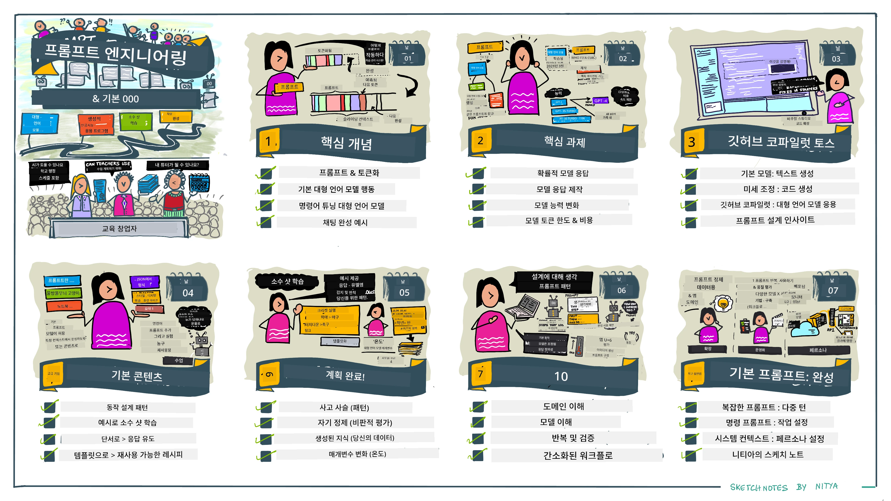
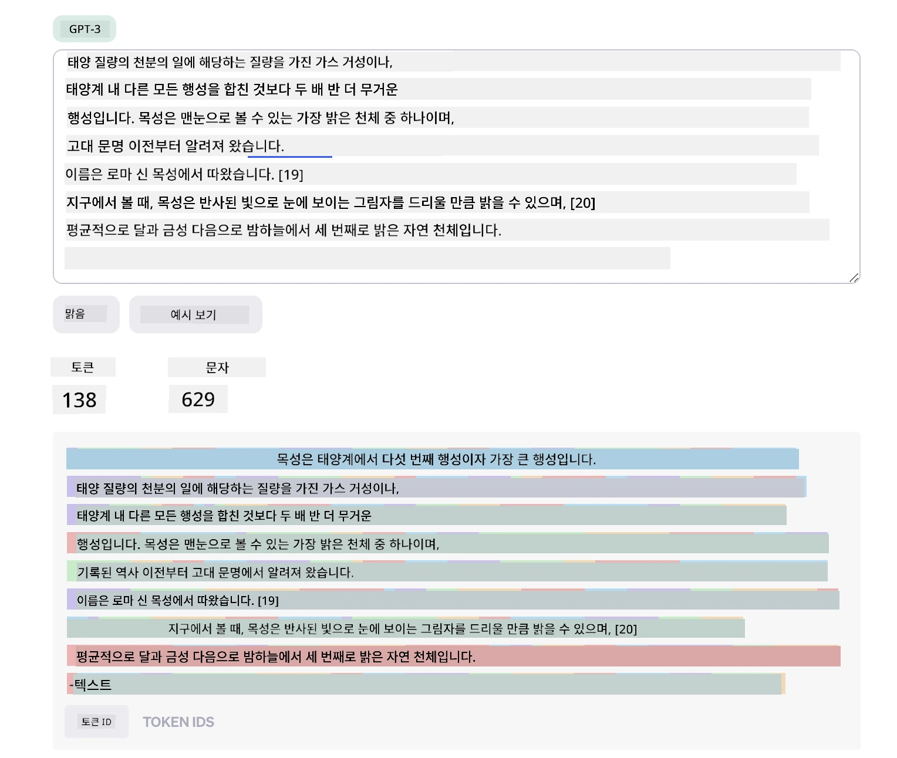
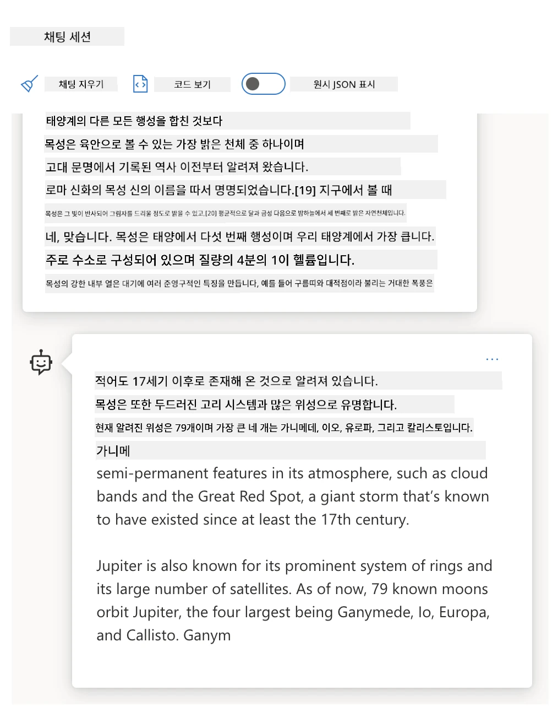
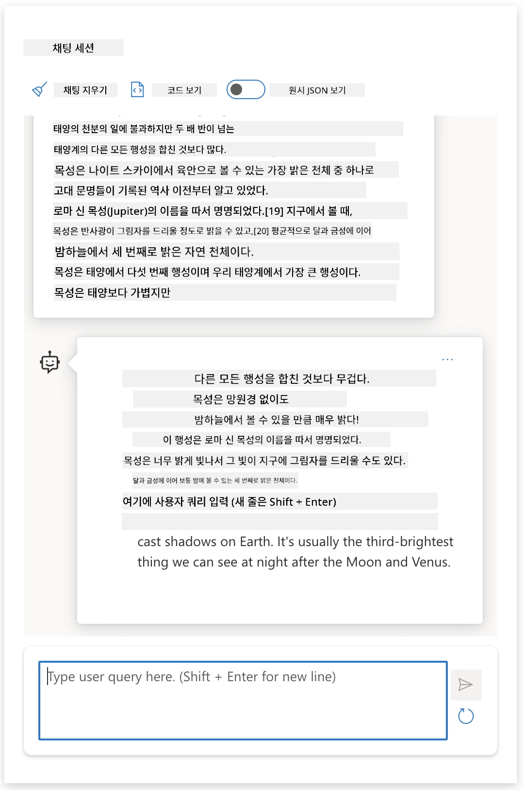
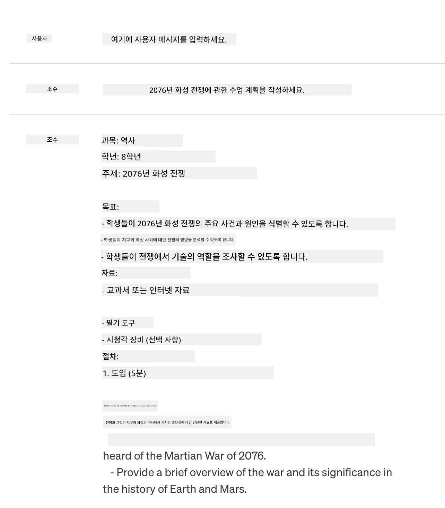
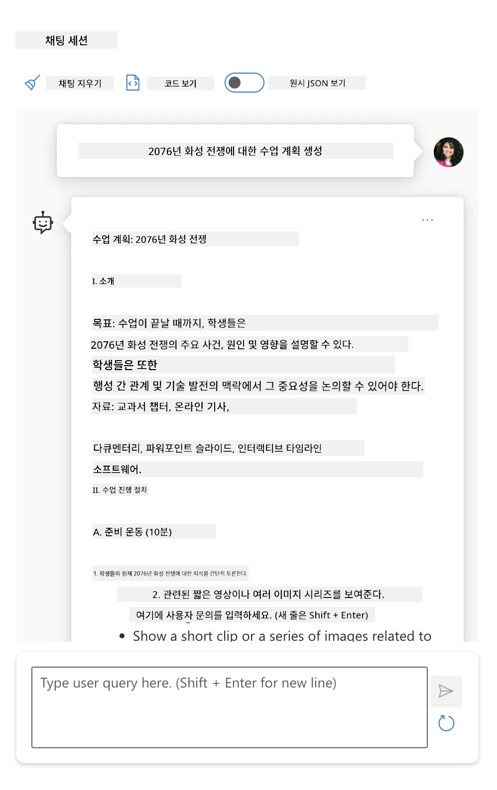
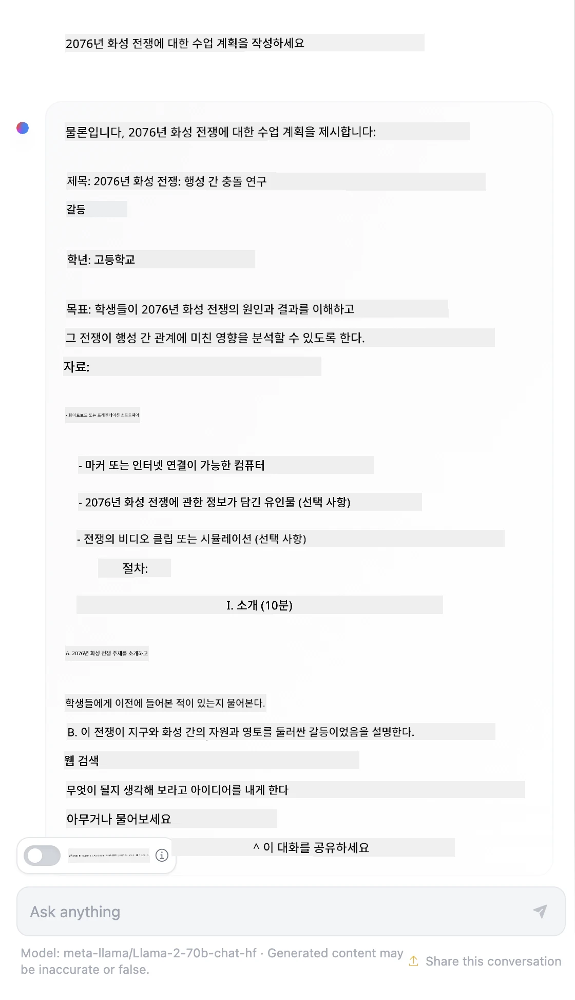

# 프롬프트 엔지니어링 기초

[](https://youtu.be/GElCu2kUlRs?si=qrXsBvXnCW12epb8)

## 소개
이 모듈은 생성 AI 모델에서 효과적인 프롬프트를 만드는 데 필수적인 개념과 기술을 다룹니다. LLM에 프롬프트를 작성하는 방식도 중요합니다. 신중하게 작성된 프롬프트는 더 나은 품질의 응답을 얻을 수 있습니다. 그런데 _프롬프트_와 _프롬프트 엔지니어링_이라는 용어는 정확히 무엇을 의미할까요? 그리고 LLM에 보내는 프롬프트 _입력_을 어떻게 개선할 수 있을까요? 이러한 질문들을 이 장과 다음 장에서 답해보겠습니다.

_생성 AI_는 사용자 요청에 응답하여 새로운 콘텐츠(예: 텍스트, 이미지, 오디오, 코드 등)를 생성할 수 있습니다. 이는 자연어와 코드를 사용하도록 훈련된 OpenAI의 GPT(“Generative Pre-trained Transformer”) 시리즈와 같은 _대형 언어 모델_ (LLM)을 사용하여 달성합니다.

사용자는 이제 기술 전문 지식이나 훈련 없이도 채팅과 같은 익숙한 방식으로 이러한 모델과 상호 작용할 수 있습니다. 이 모델들은 _프롬프트 기반_으로 동작합니다 - 사용자는 텍스트 입력(프롬프트)을 보내고 AI 응답(완성)을 받습니다. 그런 다음 여러 차례 대화를 반복하며 프롬프트를 다듬어 응답이 기대에 부합할 때까지 "AI와 대화"할 수 있습니다.

"프롬프트"는 이제 생성 AI 앱에 대한 주요 _프로그래밍 인터페이스_가 되어 모델에게 무엇을 할지 지시하고 반환되는 응답 품질에 영향을 미칩니다. "프롬프트 엔지니어링"은 일관되고 질 높은 응답을 대규모로 제공하기 위해 프롬프트의 _설계 및 최적화_에 집중하는 빠르게 성장하는 연구 분야입니다.

## 학습 목표

이 수업에서는 프롬프트 엔지니어링이 무엇인지, 왜 중요한지, 주어진 모델과 애플리케이션 목표에 대해 더 효과적인 프롬프트를 만드는 방법을 배웁니다. 프롬프트 엔지니어링의 핵심 개념과 모범 사례를 이해하고, 실제 예제에 이 개념을 적용해 볼 수 있는 대화형 주피터 노트북 "샌드박스" 환경에 대해 배웁니다.

이 수업이 끝나면 우리는 다음을 할 수 있습니다:

1. 프롬프트 엔지니어링이 무엇인지, 왜 중요한지 설명할 수 있습니다.
2. 프롬프트의 구성 요소와 사용법을 설명할 수 있습니다.
3. 프롬프트 엔지니어링을 위한 모범 사례와 기술을 배울 수 있습니다.
4. 학습한 기술을 실제 예제에 적용하여 OpenAI 엔드포인트를 사용할 수 있습니다.

## 주요 용어

프롬프트 엔지니어링: AI 모델이 원하는 출력을 생성하도록 입력을 설계하고 다듬는 작업.
토크나이제이션: 텍스트를 모델이 이해하고 처리할 수 있는 더 작은 단위인 토큰으로 변환하는 과정.
명령어 조정 LLM: 응답 정확도와 관련성을 개선하기 위해 특정 명령어로 미세 조정된 대형 언어 모델(LLM).

## 학습 샌드박스

프롬프트 엔지니어링은 현재 과학보다 예술에 가깝습니다. 이를 향상시키는 가장 좋은 방법은 _더 많이 연습_하고 도메인 전문 지식과 권장 기술 및 모델별 최적화를 결합한 시행착오 방식을 채택하는 것입니다.

이 수업에 동봉된 주피터 노트북은 여러분이 배우는 내용을 즉시 시도해 볼 수 있는 _샌드박스_ 환경을 제공합니다 - 수업 진행 중이거나 마지막에 있는 코드 챌린지에 활용할 수 있습니다. 연습 문제를 실행하려면 다음이 필요합니다:

1. **Azure OpenAI API 키** - 배포된 LLM 서비스 엔드포인트.
2. **파이썬 런타임** - 노트북을 실행할 수 있는 환경.
3. **로컬 환경 변수** - _지금 [SETUP](./../00-course-setup/02-setup-local.md?WT.mc_id=academic-105485-koreyst) 단계를 완료하여 준비하세요_.

노트북에는 _시작_ 연습 문제들이 포함되어 있지만, 여러분이 직접 더 많은 예제나 아이디어를 시도해보고 프롬프트 설계 감각을 키우도록 _마크다운_(설명)과 _코드_(프롬프트 요청) 섹션을 추가하는 것을 권장합니다.

## 도해 가이드

본격적으로 시작하기 전에 이 수업에서 다루는 핵심 주제와 각 주제에서 생각할 주요 포인트를 한눈에 볼 수 있는 도해 가이드를 확인해 보세요. 수업 로드맵은 핵심 개념과 도전 과제를 이해하고 관련 프롬프트 엔지니어링 기법과 모범 사례로 해결하는 과정을 안내합니다. 이 가이드의 "고급 기법" 섹션은 이 커리큘럼의 _다음_ 장에서 다루는 내용을 가리킵니다.



## 우리의 스타트업

이제 _이 주제_가 [교육에 AI 혁신을 가져오는](https://educationblog.microsoft.com/2023/06/collaborating-to-bring-ai-innovation-to-education?WT.mc_id=academic-105485-koreyst) 우리의 스타트업 미션과 어떻게 연결되는지 이야기해 봅시다. 우리는 _개인화 학습_ 기반의 AI 애플리케이션을 구축하고자 하므로, 애플리케이션의 다양한 사용자가 어떻게 프롬프트를 "설계"할 수 있을지 생각해 봅니다:

- <strong>관리자</strong>는 AI에게 _교육 과정 데이터를 분석하여 갭을 식별_하도록 요청할 수 있습니다. AI는 결과를 요약하거나 코드로 시각화할 수 있습니다.
- <strong>교육자</strong>는 AI에게 _대상 청중과 주제에 맞는 수업 계획을 생성_하도록 요청할 수 있습니다. AI는 지정된 형식으로 개인화된 계획을 작성할 수 있습니다.
- <strong>학생</strong>은 AI에게 _어려운 과목을 튜터링_해 달라고 요청할 수 있습니다. AI는 이제 학생 수준에 맞게 맞춤화된 수업, 힌트 및 예제로 학생들을 안내할 수 있습니다.

이것은 시작에 불과합니다. 교육 전문가가 선별한 오픈 소스 프롬프트 라이브러리인 [Prompts For Education](https://github.com/microsoft/prompts-for-edu/tree/main?WT.mc_id=academic-105485-koreyst)를 확인해 보세요 - 가능성을 더 넓게 이해할 수 있습니다! _샌드박스에서 일부 프롬프트를 실행하거나 OpenAI 플레이그라운드에서 시험해 보세요!_

<!--
수업 템플릿:
이 단원은 핵심 개념 #1을 다루어야 합니다.
개념을 예제와 참고 자료로 강화합니다.

개념 #1:
프롬프트 엔지니어링.
이를 정의하고 왜 필요한지 설명합니다.
-->

## 프롬프트 엔지니어링이란 무엇인가?

우리는 이 수업을 시작하며 <strong>프롬프트 엔지니어링</strong>을 주어진 애플리케이션 목표와 모델에 대해 일관되고 품질 높은 응답(완성)을 전달하기 위해 텍스트 입력(프롬프트)을 _설계하고 최적화하는_ 과정으로 정의했습니다. 이를 두 단계 과정으로 생각할 수 있습니다:

- 주어진 모델과 목표를 위한 초기 프롬프트 _설계_
- 응답 품질을 개선하기 위한 프롬프트 _반복 다듬기_

이 과정은 사용자 직관과 노력이 필요한 필연적인 시행착오 과정입니다. 그럼 왜 이것이 중요한가요? 그 질문에 답하려면 다음 세 가지 개념을 먼저 이해해야 합니다:

- _토크나이제이션_ = 모델이 프롬프트를 "보는" 방식
- _기초 LLM_ = 기본 모델이 프롬프트를 "처리"하는 방식
- _명령어 조정 LLM_ = 모델이 이제 "작업"을 인식하는 방식

### 토크나이제이션

LLM은 프롬프트를 _토큰 시퀀스_로 인식하며, 각 모델(또는 모델 버전)은 같은 프롬프트를 다르게 토큰화할 수 있습니다. LLM은 토큰을 기준으로 학습되었으므로(원시 텍스트가 아님), 프롬프트가 어떻게 토큰화되느냐가 생성된 응답 품질에 직접적인 영향을 미칩니다.

토크나이제이션 동작을 직관적으로 이해하려면 아래에 소개된 [OpenAI 토크나이저](https://platform.openai.com/tokenizer?WT.mc_id=academic-105485-koreyst) 같은 도구를 사용해 보세요. 프롬프트를 복사해 넣고 공백 문자와 구두점이 어떻게 처리되는지 확인해 보세요. 이 예시는 구형 LLM(GPT-3)을 보여주므로 최신 모델로 시도하면 결과가 다를 수 있다는 점에 유의하세요.



### 개념: 기초 모델

프롬프트가 토큰화되면, ["기초 LLM"](https://blog.gopenai.com/an-introduction-to-base-and-instruction-tuned-large-language-models-8de102c785a6?WT.mc_id=academic-105485-koreyst) (또는 기초 모델)의 주요 기능은 해당 시퀀스 내 토큰을 예측하는 것입니다. LLM은 방대한 텍스트 데이터셋으로 학습했기 때문에 토큰 간 통계적 관계를 잘 이해하여 어느 정도 신뢰성 있게 예측할 수 있습니다. 단, 단어의 _의미_를 이해하는 것이 아니라, 다음 예측으로 "완성"할 수 있는 패턴으로 봅니다. 사용자가 중단하거나 특정 조건이 발생할 때까지 시퀀스 예측을 계속합니다.

프롬프트 기반 완성 작동 방식을 직접 보고 싶다면 위 프롬프트를 기본 설정으로 [Microsoft Foundry playground](https://ai.azure.com?WT.mc_id=academic-105485-koreyst)에 입력해 보세요. 시스템은 프롬프트를 정보 요청으로 처리하도록 구성되어 있어 그 맥락에 맞는 완성을 보실 수 있습니다.

그런데 사용자가 특정 기준이나 작업 목표에 부합하는 결과를 원한다면 어떻게 할까요? 여기서 _명령어 조정_ LLM이 등장합니다.



### 개념: 명령어 조정 LLM

[명령어 조정 LLM](https://blog.gopenai.com/an-introduction-to-base-and-instruction-tuned-large-language-models-8de102c785a6?WT.mc_id=academic-105485-koreyst)은 기초 모델을 시작점으로 삼아 명확한 명령어를 포함하는 예제나 입력/출력 쌍(예: 다회차 "메시지")으로 미세 조정됩니다. AI는 해당 명령을 따르려 시도하며 응답을 생성합니다.

이는 강화학습(RLHF)과 같은 기법을 사용하여 모델이 _명령어를 따르고_ _피드백을 학습하도록_ 훈련함으로써 실제 응용에 더 적합하고 사용자 목적에 더 관련 있는 응답을 생성할 수 있게 합니다.

한번 시도해 보세요 - 위 프롬프트를 다시 입력하되, 이번에는 _시스템 메시지_를 다음과 같은 명령으로 설정해 보세요:

> _제공된 내용을 2학년 학생이 이해할 수 있도록 요약하세요. 결과는 3-5개의 글머리표가 포함된 한 단락으로 간단히 표현하세요._

결과가 이제 원하는 목표와 형식에 맞게 조정된 것을 볼 수 있나요? 교육자는 이 응답을 바로 수업 슬라이드에 활용할 수 있습니다.



## 왜 프롬프트 엔지니어링이 필요한가?

이제 프롬프트가 LLM에서 어떻게 처리되는지 알았으니, _왜_ 프롬프트 엔지니어링이 필요한지 이야기해 보겠습니다. 그 답은 현재 LLM들이 여러 도전을 안고 있어 _신뢰할 수 있고 일관된 완성_을 위해 프롬프트 구성과 최적화에 노력을 기울여야 하기 때문입니다. 예를 들어:

1. **모델 응답은 확률적입니다.** _같은 프롬프트_라도 서로 다른 모델이나 모델 버전에서는 다른 응답이 나올 수 있습니다. 같은 모델이라도 시간에 따라 응답이 달라질 수 있습니다. _프롬프트 엔지니어링 기법은 이러한 변이를 최소화하고 더 좋은 가이드라인을 제공하는 데 도움을 줍니다_.

1. **모델은 응답을 만들어 낼 수 있습니다.** 모델은 _큰 규모지만 한정된_ 데이터셋으로 사전 훈련되어 특정 범위 밖 개념에 대한 지식이 부족합니다. 따라서 부정확하거나 허구적이거나 알려진 사실과 직접 모순된 완성을 생성할 수 있습니다. _프롬프트 엔지니어링 기법은 AI에 출처나 근거를 묻는 식으로 이러한 허구 생성(fabrication)을 탐지하고 완화하는 데 도움을 줍니다_.

1. **모델 능력은 다릅니다.** 최신 모델이나 새 세대는 더 풍부한 능력을 갖추지만, 비용과 복잡성에서 독특한 특성과 절충점을 가져옵니다. _프롬프트 엔지니어링은 이러한 차이를 추상화하고 모델별 요구사항에 맞춰 확장 가능하고 원활히 적응하는 모범 사례와 워크플로우를 개발하는 데 도움을 줍니다_.

이것을 OpenAI 또는 Azure OpenAI 플레이그라운드에서 실제로 살펴보세요:

- 동일한 프롬프트를 다른 LLM 배포(예: OpenAI, Azure OpenAI, Hugging Face)에서 사용해보세요 - 차이를 관찰했나요?
- 동일한 프롬프트를 같은 LLM 배포(예: Azure OpenAI 플레이그라운드)에서 여러 번 반복 사용해보세요 - 변이 양상은 어땠나요?

### 허구 생성 예제

본 과정에서는 LLM이 훈련 한계나 기타 제약 때문에 사실과 다른 정보를 생성하는 현상을 <strong>"허구 생성(fabrication)"</strong>이라고 합니다. 대중 기사나 연구 논문에서는 이를 _"환상(hallucinations)"_이라고도 부르지만, 우리는 기계 구동 결과에 인간적 특성을 부여하지 않기 위해 _"허구 생성"_이라는 용어 사용을 권장합니다. 이는 [책임 있는 AI 가이드라인](https://www.microsoft.com/ai/responsible-ai?WT.mc_id=academic-105485-koreyst)에서도 용어 측면에서 도움이 되며, 때로는 공격적이거나 비포괄적으로 여겨질 수 있는 용어를 제거하는 데 기여합니다.

허구 생성이 어떻게 작동하는지 감을 잡아보시겠나요? AI에 존재하지 않는 주제에 대해 콘텐츠를 생성하도록 요청하는 프롬프트를 생각해 보세요(즉, 훈련 데이터셋에 없을 가능성이 높은). 예를 들어, 저는 다음 프롬프트를 시도했습니다:

> **프롬프트:** 2076년 화성 전쟁에 관한 수업 계획을 생성하세요.

웹 검색 결과, 화성 전쟁을 다룬 허구(예: TV 시리즈나 책)는 있었으나 2076년 화성 전쟁은 없었습니다. 상식적으로 2076년은 _미래_이기 때문에 실제 사건과 연관 지을 수 없습니다.


그렇다면 이 프롬프트를 다양한 LLM 제공자와 함께 실행하면 무슨 일이 일어날까요?

> **응답 1**: OpenAI Playground (GPT-35)



> **응답 2**: Azure OpenAI Playground (GPT-35)



> **응답 3**: : Hugging Face Chat Playground (LLama-2)



예상대로, 각 모델(또는 모델 버전)은 확률적 동작과 모델 능력의 차이로 인해 약간씩 다른 응답을 생성합니다. 예를 들어, 한 모델은 8학년 학생을 대상으로 하며, 다른 모델은 고등학생을 기준으로 합니다. 하지만 세 모델 모두 해당 사건이 실제였다고 믿을 수 있도록 설득력 있는 응답을 생성했습니다.

_메타프롬프트링_이나 _온도 설정_ 같은 프롬프트 엔지니어링 기술은 모델의 허구 생성(fabrications)을 어느 정도 줄일 수 있습니다. 새로운 프롬프트 엔지니어링 _아키텍처_는 새로운 도구와 기술을 프롬프트 흐름에 원활하게 통합하여 이러한 영향을 완화하거나 감소시키기도 합니다.

## 사례 연구: GitHub Copilot

이 섹션을 마무리하며, 실제 솔루션에서 프롬프트 엔지니어링이 어떻게 사용되는지 감을 잡기 위해 사례 연구 하나를 살펴봅시다: [GitHub Copilot](https://github.com/features/copilot?WT.mc_id=academic-105485-koreyst).

GitHub Copilot은 당신의 "AI 페어 프로그래머"입니다 - 텍스트 프롬프트를 코드 완성으로 변환하며, 개발 환경(예: Visual Studio Code)에 통합되어 매끄러운 사용자 경험을 제공합니다. 아래 블로그 시리즈에 문서화된 대로, 최초 버전은 OpenAI Codex 모델을 기반으로 했으며, 엔지니어들은 빠르게 모델을 미세 조정하고 더 나은 프롬프트 엔지니어링 기법을 개발해야 함을 깨달아 코드 품질을 향상시켰습니다. 7월에는 [Codex를 뛰어넘는 향상된 AI 모델을 선보였습니다](https://github.blog/2023-07-28-smarter-more-efficient-coding-github-copilot-goes-beyond-codex-with-improved-ai-model/?WT.mc_id=academic-105485-koreyst), 더욱 빠른 제안을 제공합니다.

학습 여정을 따라가려면 게시물을 순서대로 읽어보세요.

- **2023년 5월** | [GitHub Copilot이 코드 이해 능력을 향상시키고 있습니다](https://github.blog/2023-05-17-how-github-copilot-is-getting-better-at-understanding-your-code/?WT.mc_id=academic-105485-koreyst)
- **2023년 5월** | [GitHub 내부 이야기: GitHub Copilot 뒤에 있는 LLM과 함께 작업하기](https://github.blog/2023-05-17-inside-github-working-with-the-llms-behind-github-copilot/?WT.mc_id=academic-105485-koreyst).
- **2023년 6월** | [GitHub Copilot을 위한 더 나은 프롬프트 작성법](https://github.blog/2023-06-20-how-to-write-better-prompts-for-github-copilot/?WT.mc_id=academic-105485-koreyst).
- **2023년 7월** | [GitHub Copilot, 향상된 AI 모델과 함께 Codex를 넘어서다](https://github.blog/2023-07-28-smarter-more-efficient-coding-github-copilot-goes-beyond-codex-with-improved-ai-model/?WT.mc_id=academic-105485-koreyst)
- **2023년 7월** | [개발자를 위한 프롬프트 엔지니어링 및 LLM 가이드](https://github.blog/2023-07-17-prompt-engineering-guide-generative-ai-llms/?WT.mc_id=academic-105485-koreyst)
- **2023년 9월** | [엔터프라이즈 LLM 앱 구축 방법: GitHub Copilot에서 얻은 교훈](https://github.blog/2023-09-06-how-to-build-an-enterprise-llm-application-lessons-from-github-copilot/?WT.mc_id=academic-105485-koreyst)

[Engineering blog](https://github.blog/category/engineering/?WT.mc_id=academic-105485-koreyst)도 방문해 보세요. [이 게시물](https://github.blog/2023-09-27-how-i-used-github-copilot-chat-to-build-a-reactjs-gallery-prototype/?WT.mc_id=academic-105485-koreyst)처럼, 이 모델과 기법들이 실제 애플리케이션에 어떻게 _적용_되는지 보여줍니다.

---

<!--
학습 템플릿:
이 단원은 핵심 개념 #2를 다뤄야 합니다.
예시와 참고자료로 개념을 강화하세요.

핵심 개념 #2:
프롬프트 설계.
예시를 통해 설명합니다.
-->

## 프롬프트 구성

프롬프트 엔지니어링이 왜 중요한지 살펴보았습니다. 이제 다양한 기법을 평가하기 위해 프롬프트가 어떻게 _구성_되는지 알아봅시다.

### 기본 프롬프트

기본 프롬프트부터 시작해 보겠습니다: 다른 맥락 없이 모델에 보내는 텍스트 입력입니다. 예를 들어, 미국 국가의 첫 몇 단어를 OpenAI [Completion API](https://platform.openai.com/docs/api-reference/completions?WT.mc_id=academic-105485-koreyst)에 보내면, 기본 예측 동작을 보여주며 다음 몇 줄을 즉시 _완성_합니다.

| 프롬프트 (입력)       | 완성 (출력)                                                                                                                   |
| :------------------- | :---------------------------------------------------------------------------------------------------------------------------- |
| Oh say can you see   | 미국 국가인 "The Star-Spangled Banner"의 가사를 시작하는 것 같습니다. 전체 가사는 ...                                                |

### 복합 프롬프트

이제 그 기본 프롬프트에 맥락과 지시사항을 추가해 보겠습니다. [Chat Completion API](https://learn.microsoft.com/azure/ai-foundry/openai/how-to/chatgpt?WT.mc_id=academic-105485-koreyst)를 사용하면, 다음과 같이 _메시지_ 모음으로 복합 프롬프트를 구성할 수 있습니다:

- _사용자_ 입력과 _어시스턴트_ 응답을 반영하는 입출력 쌍
- 어시스턴트 행동이나 성격에 대한 맥락을 설정하는 시스템 메시지

요청은 이제 아래 형식으로, _토크나이제이션_을 통해 맥락과 대화에서 관련 정보를 효과적으로 캡처합니다. 시스템 맥락 변경은 제공된 사용자 입력만큼 완성 품질에 큰 영향을 미칠 수 있습니다.

```python
response = client.responses.create(
    model="gpt-5-mini",
    input=[
        {"role": "system", "content": "You are a helpful assistant."},
        {"role": "user", "content": "Who won the world series in 2020?"},
        {"role": "assistant", "content": "The Los Angeles Dodgers won the World Series in 2020."},
        {"role": "user", "content": "Where was it played?"}
    ]
)
```

### 지시 프롬프트

위 예시에서, 사용자 프롬프트는 정보 요청으로 해석될 수 있는 간단한 텍스트 쿼리였습니다. _지시_ 프롬프트에서는 그 텍스트를 사용해 작업을 더 자세히 명시해 AI에 더 나은 안내를 제공합니다. 예시는 다음과 같습니다:

| 프롬프트 (입력)                                                                                                                                                                                                                         | 완성 (출력)                                                                                                           | 지시 유형            |
| :------------------------------------------------------------------------------------------------------------------------------------------------------------------------------------------------------------------------------------- | :-------------------------------------------------------------------------------------------------------------------- | :-------------------- |
| Write a description of the Civil War                                                                                                                                                                                                   | _간단한 단락을 반환_                                                                                                 | 단순                  |
| Write a description of the Civil War. Provide key dates and events and describe their significance                                                                                                                                     | _단락과 주요 사건 날짜 및 설명 목록을 반환_                                                                           | 복합                  |
| Write a description of the Civil War in 1 paragraph. Provide 3 bullet points with key dates and their significance. Provide 3 more bullet points with key historical figures and their contributions. Return the output as a JSON file | _JSON 형식으로 포맷된 더 자세한 내용을 텍스트 상자에 반환, 복사/붙여넣기 및 검증 가능_                                   | 복합. 포맷됨.         |

## 주요 내용

위 예시에서, 프롬프트는 여전히 꽤 개방적이어서 LLM이 사전 학습 데이터 중 어떤 부분이 관련 있는지 결정할 수 있었습니다. _주요 내용_ 설계 패턴에서는 입력 텍스트를 두 부분으로 나눕니다:

- 지시사항 (행동)
- 관련 내용 (행동에 영향을 주는)

여기에 "이것을 두 문장으로 요약하라"는 지시가 포함된 예가 있습니다.

| 프롬프트 (입력)                                                                                                                                                                                                                                                                                                                                                                                                                                                                                                                                                                                                                      | 완성 (출력)                                                                                                                                                                                                                                                                             |
| :-------------------------------------------------------------------------------------------------------------------------------------------------------------------------------------------------------------------------------------------------------------------------------------------------------------------------------------------------------------------------------------------------------------------------------------------------------------------------------------------------------------------------------------------------------------------------------------------------------------------------------------------------------------------------------------------------- | :------------------------------------------------------------------------------------------------------------------------------------------------------------------------------------------------------------------------------------------------------------------------------------------- |
| 목성은 태양에서 다섯 번째 행성이며 태양계에서 가장 큽니다. 태양 질량의 천분의 일에 불과하지만 태양계 내 모든 다른 행성을 합친 것보다 두 배 반 더 무거운 가스 거성입니다. 목성은 육안으로 볼 수 있는 가장 밝은 천체 중 하나이며, 기록된 역사 이전부터 고대 문명에 알려져 있었습니다. 로마 신 목성의 이름을 따서 명명되었습니다.[19] 지구에서 보면 목성은 반사광으로 눈에 띄는 그림자를 드리울 정도로 밝을 수 있으며,[20] 평균적으로 달과 금성 다음으로 밤하늘에서 세 번째로 밝은 자연 천체입니다. <br/> **이것을 두 문장으로 요약하라** | 목성은 태양에서 다섯 번째이자 태양계에서 가장 큰 행성으로, 밤하늘에서 가장 밝은 천체 중 하나입니다. 로마 신 목성의 이름을 딴 이 가스 거성의 질량은 태양계 다른 모든 행성을 합친 것보다 두 배 반 더 무겁습니다.                        |

주요 내용 부분은 더 효과적인 지시를 하기 위해 다양한 방식으로 사용할 수 있습니다:

- <strong>예시</strong> - 명시적 지시 대신 모델에 수행할 작업 예시를 제공하고, 패턴을 추론하도록 합니다.
- <strong>큐</strong> - 지시 뒤에 "큐"를 추가해 완성을 유도하고, 모델이 더 관련 있는 응답을 하도록 안내합니다.
- <strong>템플릿</strong> - 자리 표시자(변수)가 포함된 반복 가능한 프롬프트 '레시피'로, 특정 사용 사례에 맞춰 데이터를 커스터마이즈할 수 있습니다.

이제 이를 실제로 살펴봅시다.

### 예시 사용하기

이 방법은 주요 내용을 사용해 원하는 출력 예시를 모델에 '제공'하고, 모델이 원하는 출력 패턴을 추론하게 하는 것입니다. 제공된 예시 개수에 따라 제로샷 프롬프트, 원샷 프롬프트, 퓨샷 프롬프트 등을 할 수 있습니다.

프롬프트는 이제 세 가지 구성요소로 이루어집니다:

- 작업 설명
- 원하는 출력의 몇 가지 예시
- 새로운 예시의 시작 (암묵적 작업 설명이 됨)

| 학습 유형     | 프롬프트 (입력)                                                                                   | 완성 (출력)              |
| :------------ | :----------------------------------------------------------------------------------------------- | :----------------------- |
| 제로샷       | "The Sun is Shining". 스페인어로 번역하세요                                                     | "El Sol está brillando". |
| 원샷         | "The Sun is Shining" => ""El Sol está brillando". <br> "It's a Cold and Windy Day" =>              | "Es un día frío y ventoso". |
| 퓨샷         | 선수는 베이스를 돌았다 => 야구 <br/> 선수가 에이스를 쳤다 => 테니스 <br/> 선수가 6점을 쳤다 => 크리켓 <br/> 선수가 슬램덩크를 했다 => | 농구                     |
|               |                                                                                                |                         |

제로샷 프롬프트에서는 명시적 지시("스페인어로 번역하세요")가 필요하지만, 원샷 프롬프트에서는 자동으로 추론되는 것을 알 수 있습니다. 퓨샷 예시는 더 많은 예시를 추가함으로써 모델이 추가 지시 없이도 더 정확한 추론을 할 수 있음을 보여줍니다.

### 프롬프트 큐

주요 내용을 사용하는 또 다른 기법은 예시 대신 _큐_를 제공하는 것입니다. 이 경우, 모델이 원하는 응답 형식을 반영하는 일부 구절로 _시작_하도록 유도하여, 모델이 그 방향으로 계속 응답하도록 '큐'를 주는 것입니다.

| 큐 개수       | 프롬프트 (입력)                                                                                                                                                                                                                                                                                                                                                                                                                | 완성 (출력)                                                                                                                                                                                                                                                                                           |
| :------------ | :------------------------------------------------------------------------------------------------------------------------------------------------------------------------------------------------------------------------------------------------------------------------------------------------------------------------------------------------------------------------------------------------------------------------------ | :-------------------------------------------------------------------------------------------------------------------------------------------------------------------------------------------------------------------------------------------------------------------------------------------------- |
| 0             | 목성은 태양에서 다섯 번째 행성이며 태양계에서 가장 큽니다. 태양 질량의 천분의 일에 불과하지만 태양계 내 모든 다른 행성을 합친 것보다 두 배 반 더 무거운 가스 거성입니다. 목성은 육안으로 볼 수 있는 가장 밝은 천체 중 하나이며, 기록된 역사 이전부터 고대 문명에 알려져 있었습니다. <br/>**이것을 요약하라**                                                                 | 목성은 우리 태양계에서 가장 큰 행성이자 태양에서 다섯 번째 행성입니다. 질량은 태양의 1/1000이지만 다른 모든 행성을 합친 것보다 무겁습니다. 고대 문명에서도 오래 전부터 알려져 있었으며, 밤하늘에서 쉽게 관찰할 수 있습니다.    |
| 1             | 목성은 태양에서 다섯 번째 행성이며 태양계에서 가장 큽니다. 태양 질량의 천분의 일에 불과하지만 태양계 내 모든 다른 행성을 합친 것보다 두 배 반 더 무거운 가스 거성입니다. 목성은 육안으로 볼 수 있는 가장 밝은 천체 중 하나이며, 기록된 역사 이전부터 고대 문명에 알려져 있었습니다. <br/>**이것을 요약하라** <br/> 우리가 알아낸 것은 목성이 | 태양에서 다섯 번째이자 태양계에서 가장 큰 행성이라는 것입니다. 가스 거성으로서 태양 질량의 천분의 일에 불과하지만 태양계 내 다른 모든 행성을 합친 것보다 두 배 반 더 무겁습니다. 육안으로 관찰 가능하며 고대부터 알려져 있습니다.          |

| 2              | 목성은 태양에서 다섯 번째 행성이자 태양계에서 가장 큰 행성입니다. 태양 질량의 천분의 일에 불과한 가스 거인이지만, 태양계 내 다른 모든 행성들의 질량을 합친 것의 두 배 반에 이릅니다. 목성은 맨눈으로 볼 수 있는 밤하늘의 가장 밝은 천체 중 하나이며, 기록된 역사 이전부터 고대 문명에 알려져 있었습니다. <br/><strong>요약하기</strong> <br/> 우리가 배운 상위 3가지 사실:         | 1. 목성은 태양에서 다섯 번째 행성이자 태양계에서 가장 큰 행성입니다. <br/> 2. 태양 질량의 천분의 일에 불과한 가스 거인이지만...<br/> 3. 목성은 고대부터 맨눈으로 볼 수 있었습니다 ...                                                                       |
|                |                                                                                                                                                                                                                                                                                                                                                                                                                                                              |                                                                                                                                                                                                                                                                                                           |

### 프롬프트 템플릿

프롬프트 템플릿은 일관된 사용자 경험을 대규모로 제공하기 위해 필요에 따라 저장하고 재사용할 수 있는 _사전 정의된 프롬프트 레시피_입니다. 가장 단순한 형태에서는 [OpenAI의 이 예시](https://cookbook.openai.com/examples/gpt4-1_prompting_guide?WT.mc_id=academic-105485-koreyst)와 같이 대화형 프롬프트 구성 요소(사용자 및 시스템 메시지)와 API 기반 요청 형식을 모두 제공하는 프롬프트 예시 모음입니다.

좀 더 복잡한 형태로 [LangChain의 이 예시](https://python.langchain.com/docs/concepts/prompt_templates/?WT.mc_id=academic-105485-koreyst)에서는 다양한 소스(사용자 입력, 시스템 컨텍스트, 외부 데이터 소스 등)에서 가져온 데이터로 교체할 수 있는 _플레이스홀더_가 포함되어 있어 동적으로 프롬프트를 생성할 수 있습니다. 이를 통해 일관된 사용자 경험을 <strong>프로그래밍적으로</strong> 대규모에서 구동할 수 있는 재사용 가능한 프롬프트 라이브러리를 만들 수 있습니다.

마지막으로 템플릿의 진정한 가치는 수직 도메인 애플리케이션의 용도를 위해 _프롬프트 라이브러리_를 생성 및 배포할 수 있다는 점에 있습니다. 여기서 프롬프트 템플릿은 특정 애플리케이션 맥락이나 예제를 반영하여 대상 사용자에 더 적합하고 정확한 응답이 나오도록 _최적화_됩니다. [Prompts For Edu](https://github.com/microsoft/prompts-for-edu?WT.mc_id=academic-105485-koreyst) 저장소가 훌륭한 사례로, 수업 계획, 교육과정 설계, 학생 튜터링 등 핵심 목표에 중점을 두고 교육 도메인용 프롬프트를 큐레이션합니다.

## 지원 콘텐츠

프롬프트 구성은 지시문(작업)과 대상(주요 콘텐츠)으로 생각할 수 있습니다. 이때 _부차적 콘텐츠_는 결과에 _어떤 식으로든_ 영향을 주기 위해 제공하는 추가 맥락과 같습니다. 이는 튜닝 매개변수, 형식 지침, 주제 분류 등으로 모델이 원하는 사용자 목표나 기대에 맞게 응답을 _조정_하도록 돕습니다.

예를 들어, 모든 교과과정 코스에 대한 광범위한 메타데이터(이름, 설명, 수준, 메타데이터 태그, 강사 등)가 포함된 코스 카탈로그가 있다고 하면:

- "2023년 가을 학기 코스 카탈로그 요약"이라는 지침을 정의할 수 있고
- 주요 콘텐츠에 원하는 출력 예시를 몇 개 제공할 수 있으며
- 부차적 콘텐츠로 가장 중요한 상위 5개 "태그"를 지정할 수 있습니다.

이제 모델은 몇 가지 예시에서 제시된 형식으로 요약을 제공할 수 있습니다. 다중 태그가 있을 경우 부차적 콘텐츠에서 지정된 5개 태그를 우선순위로 반영할 수 있습니다.

---

<!--
수업 템플릿:
이 단원에서는 핵심 개념 #1을 다룹니다.
개념을 사례 및 참고자료를 통해 강화합니다.

개념 #3:
프롬프트 엔지니어링 기법.
프롬프트 엔지니어링에 기본적인 기법들은 무엇인가요?
몇 가지 연습문제로 설명하세요.
-->

## 프롬프트 모범 사례

프롬프트를 _구성하는_ 방법을 알았으니 이제 이를 _설계_하여 모범 사례를 반영하는 방법을 생각할 수 있습니다. 여기에는 두 부분이 있습니다 - 올바른 _마인드셋_을 갖추고 올바른 _기법_을 적용하는 것.

### 프롬프트 엔지니어링 마인드셋

프롬프트 엔지니어링은 시행착오 과정이므로 다음 세 가지 큰 지침을 기억하세요:

1. **도메인 이해가 중요하다.** 응답 정확성과 적합성은 애플리케이션이나 사용자가 속한 _도메인_에 따라 달라집니다. 직관과 도메인 전문 지식을 활용해 <strong>기법을 맞춤화</strong>하세요. 예를 들어, 시스템 프롬프트에 _도메인별 페르소나_를 정의하거나 사용자 프롬프트에 _도메인별 템플릿_을 사용합니다. 부차적 콘텐츠에 도메인별 맥락을 반영하거나 _도메인별 신호 및 예시_를 활용해 모델을 친숙한 용법으로 유도하세요.

2. **모델 이해가 중요하다.** 모델은 본질적으로 확률적이지만, 훈련 데이터셋(사전 학습 지식), 제공하는 기능(API 또는 SDK 등), 최적화된 콘텐츠 유형(코드, 이미지, 텍스트 등)에 따라 구현이 다를 수 있습니다. 사용하는 모델의 강점과 한계를 이해하고 이를 바탕으로 작업 우선순위를 정하거나 모델 역량에 최적화된 _맞춤 템플릿_을 만드세요.

3. **반복과 검증이 중요하다.** 모델과 프롬프트 엔지니어링 기법은 빠르게 발전합니다. 도메인 전문가로서 특정 애플리케이션에만 적용되는 별도의 상황이나 기준이 있을 수 있습니다. 프롬프트 엔지니어링 도구와 기법을 활용해 "프롬프트 작성을 빠르게 시작"하고, 직관과 도메인 전문성으로 결과를 반복 검증하세요. 인사이트를 기록하고 **지식 베이스**(예: 프롬프트 라이브러리)를 만들어 다른 사람이 더 빠르게 반복할 수 있도록 하세요.

## 모범 사례

이제 [OpenAI](https://help.openai.com/en/articles/6654000-best-practices-for-prompt-engineering-with-openai-api?WT.mc_id=academic-105485-koreyst)와 [Azure OpenAI](https://learn.microsoft.com/azure/ai-foundry/openai/concepts/prompt-engineering#best-practices?WT.mc_id=academic-105485-koreyst) 실무자들이 권장하는 일반적인 모범 사례를 살펴보겠습니다.

| 내용                              | 이유                                                                                                                                                                                                                                               |
| :-------------------------------- | :------------------------------------------------------------------------------------------------------------------------------------------------------------------------------------------------------------------------------------------------ |
| 최신 모델 평가하기               | 새로운 모델 세대는 향상된 기능과 품질을 갖기는 하지만 비용이 더 들 수도 있습니다. 영향을 평가한 후 마이그레이션 여부를 결정하세요.                                                                                                           |
| 지침과 컨텍스트 구분하기         | 모델 또는 제공자가 지침, 주요 및 부차적 콘텐츠를 명확히 구분하는 _구분자_를 제공하는지 확인하세요. 이는 토큰에 가중치를 더 정확히 할당하는 데 도움이 됩니다.                                                                            |
| 구체적이고 명확하게 작성하기     | 원하는 맥락, 결과, 길이, 형식, 스타일 등에 대한 상세 정보를 제공하세요. 이렇게 하면 응답의 품질과 일관성이 향상됩니다. 재사용 가능한 템플릿에 레시피를 기록하세요.                                                                         |
| 설명적이고 예시 사용하기         | 모델은 '보여주기' 방식을 통해 더 잘 응답할 수 있습니다. 우선 `제로샷` 방식으로 지침만 제공하고(예시 없음), 이어서 원하는 출력의 몇 가지 예시를 주는 `퓨샷` 방식으로 정제해보세요. 비유를 사용해도 좋습니다.                                         |
| 응답을 유도하는 신호 사용하기     | 답변의 출발점으로 쓸 수 있는 선행 단어나 구문을 주어 원하는 결과로 유도하세요.                                                                                                                                            |
| 반복 강조하기                   | 때로 모델에 같은 내용을 여러 번 반복해야 할 수 있습니다. 주요 콘텐츠 전후에 지침을 주거나 지침과 신호를 함께 사용하는 것 등 반복과 검증을 통해 효과적인 방식을 찾으세요.                                                                       |
| 순서가 중요하다                 | 정보 제시 순서가 결과에 영향을 미칠 수 있습니다. 학습 예시에서도 최신성 편향 때문에 그렇습니다. 다양한 순서로 시도해 효과적인 방식을 찾으세요.                                                                                      |
| 모델에게 '탈출구' 주기           | 모델이 어떤 이유로 작업을 완수할 수 없을 때 제공할 수 있는 _대체_ 응답을 주어 거짓 정보나 허구 생성 가능성을 줄이세요.                                                                                                |
|                                   |                                                                                                                                                                                                                                                   |

모든 모범 사례는 _모델, 작업, 도메인에 따라 달라질 수 있다는 점_을 잊지 마세요. 이것을 출발점으로 삼고 자신에게 가장 잘 맞는 방법을 찾아 반복하세요. 새 모델과 도구가 등장할 때마다 프롬프트 엔지니어링 프로세스를 재평가하되 프로세스 확장성과 응답 품질에 중점을 두세요.

<!--
수업 템플릿:
상황에 따라 코드 챌린지를 제공해야 합니다.

챌린지:
주석만 포함된 지침이 있고 코드 섹션은 비어 있는 Jupyter Notebook 링크를 제공합니다.

솔루션:
프롬프트가 채워지고 실행된 Notebook 사본 링크로, 하나의 예시 출력을 보여줍니다.
-->

## 과제

축하합니다! 수업 마지막까지 왔습니다! 이제 배운 개념과 기법을 실제 예제로 시험해 볼 시간입니다!

과제에서는 상호작용할 수 있는 연습문제가 포함된 Jupyter Notebook을 사용할 것입니다. 직접 아이디어와 기법을 탐구하기 위해 Notebook에 자신의 Markdown 및 코드 셀을 추가할 수도 있습니다.

### 시작하려면, 저장소를 포크한 후

- (권장) GitHub Codespaces 실행
- (대안) 저장소를 로컬 장치에 클론하여 Docker Desktop과 함께 사용
- (대안) 선호하는 노트북 실행 환경에서 Notebook 열기

### 다음, 환경 변수를 설정하세요

- 저장소 루트에 있는 `.env.copy` 파일을 `.env`로 복사한 후 `AZURE_OPENAI_API_KEY`, `AZURE_OPENAI_ENDPOINT`, `AZURE_OPENAI_DEPLOYMENT` 값을 입력하세요. 방법은 [학습 샌드박스 섹션](#학습-샌드박스)으로 돌아가 확인할 수 있습니다.

### 그 다음 Jupyter Notebook을 엽니다

- 런타임 커널을 선택하세요. 1번 또는 2번 옵션을 사용하는 경우 개발 컨테이너가 제공하는 기본 Python 3.10.x 커널을 선택하면 됩니다.

이제 모든 연습문제를 실행할 준비가 되었습니다. 여기에는 _정답과 오답_이 따로 없습니다 - 시행착오를 통해 옵션을 탐색하고 특정 모델과 응용 도메인에 잘 맞는 방법에 대한 직관을 기르는 것이 목적입니다.

_이 때문에 이 수업에는 코드 솔루션 섹션이 없습니다. 대신 Notebook에 "내 솔루션:"이라는 제목의 Markdown 셀을 두어 참조용으로 한 가지 예시 출력을 보여줍니다._

 <!--
수업 템플릿:
섹션을 요약과 자기 주도 학습 자료로 마무리합니다.
-->

## 지식 점검

다음 중 합리적인 모범 사례를 준수하는 좋은 프롬프트는 무엇인가요?

1. 빨간색 차 이미지를 보여줘
2. 해질녘 절벽 옆에 주차된 볼보 XC90 빨간색 차 이미지를 보여줘
3. 볼보 XC90 빨간색 차 이미지를 보여줘

답: 2, "무엇을" 원하는지 상세히 제공하며 특정 제조사와 모델뿐만 아니라 전체 설정까지 설명하므로 최선의 프롬프트입니다. 3번도 많은 설명이 들어 있어 다음으로 좋습니다.

## 🚀 챌린지

"Show me an image of red car of make Volvo and "라는 문장을 완성하는 '신호' 기법을 활용해보세요. 어떤 응답을 주며 어떻게 개선할 수 있을까요?

## 훌륭합니다! 학습을 계속하세요

프롬프트 엔지니어링 관련 다른 개념을 더 배우고 싶나요? [추가 학습 페이지](https://aka.ms/genai-collection?WT.mc_id=academic-105485-koreyst)에서 관련 훌륭한 자료들을 확인하세요.

5번째 수업(../05-advanced-prompts/README.md?WT.mc_id=academic-105485-koreyst)에서는 [고급 프롬프트 기법]을 살펴봅니다!

---

<!-- CO-OP TRANSLATOR DISCLAIMER START -->
**면책 조항**:
이 문서는 AI 번역 서비스 [Co-op Translator](https://github.com/Azure/co-op-translator)를 사용하여 번역되었습니다. 정확성을 기하기 위해 노력하고 있으나, 자동 번역은 오류나 부정확한 부분이 있을 수 있음을 유의하시기 바랍니다. 원본 문서의 원어본이 권위 있는 자료로 간주되어야 합니다. 중요한 정보의 경우, 전문가의 인간 번역을 권장합니다. 이 번역 사용으로 인해 발생하는 오해나 잘못된 해석에 대해 당사는 책임을 지지 않습니다.
<!-- CO-OP TRANSLATOR DISCLAIMER END -->