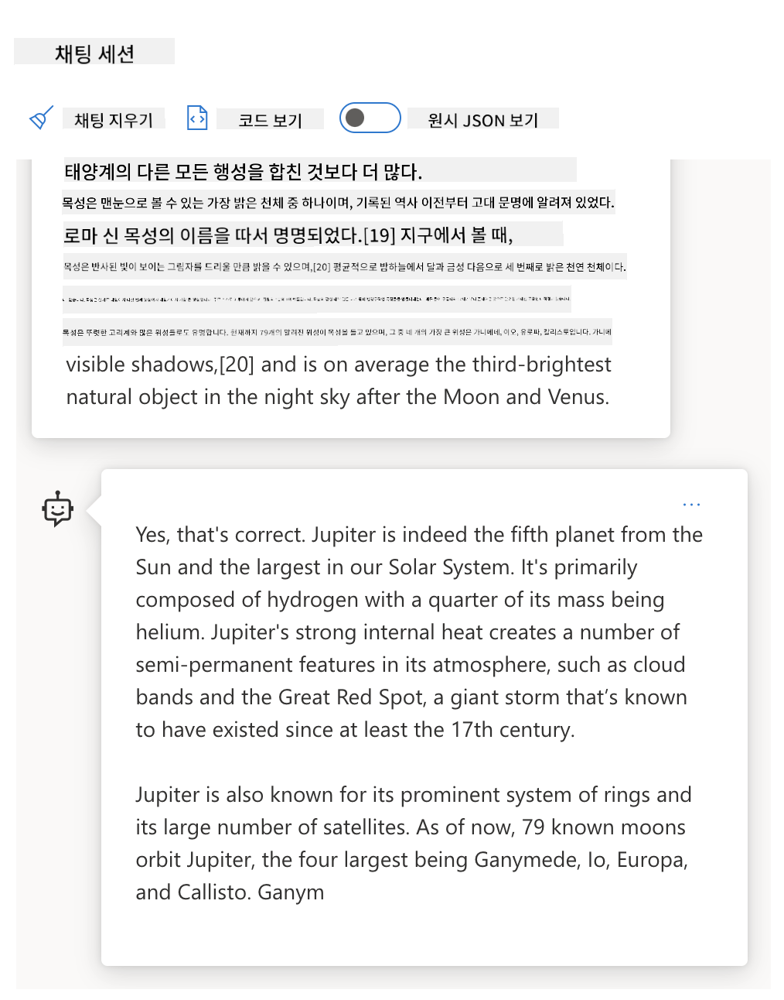
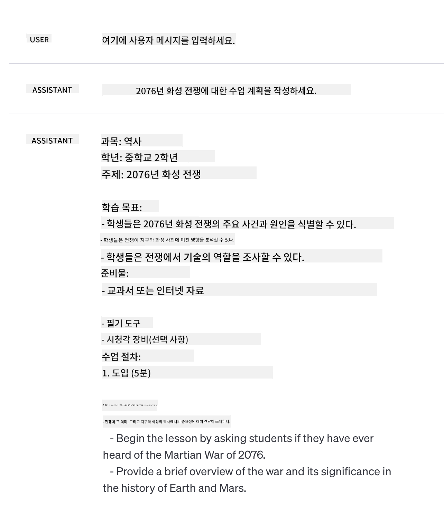
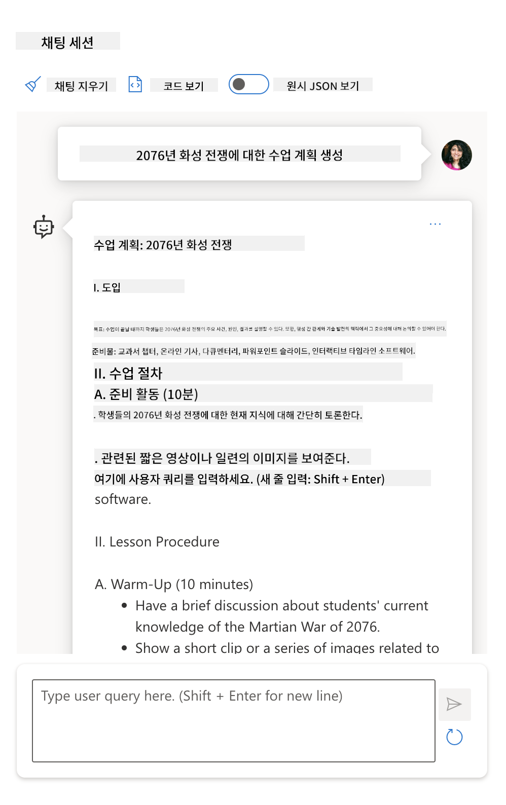

<!--
CO_OP_TRANSLATOR_METADATA:
{
  "original_hash": "8b3cb38518cf4fe7714d2f5e74dfa3eb",
  "translation_date": "2025-10-03T08:45:05+00:00",
  "source_file": "04-prompt-engineering-fundamentals/README.md",
  "language_code": "ko"
}
-->
# 프롬프트 엔지니어링 기초

[](https://aka.ms/gen-ai-lesson4-gh?WT.mc_id=academic-105485-koreyst)

## 소개
이 모듈에서는 생성형 AI 모델에서 효과적인 프롬프트를 작성하기 위한 필수 개념과 기술을 다룹니다. LLM에 전달하는 프롬프트를 어떻게 작성하느냐도 중요합니다. 신중하게 작성된 프롬프트는 더 나은 품질의 응답을 얻을 수 있습니다. 하지만 _프롬프트_와 _프롬프트 엔지니어링_ 같은 용어는 정확히 무엇을 의미할까요? 그리고 LLM에 전달하는 프롬프트 _입력_을 어떻게 개선할 수 있을까요? 이 장과 다음 장에서 이러한 질문에 답하려고 합니다.

_생성형 AI_는 사용자 요청에 따라 새로운 콘텐츠(예: 텍스트, 이미지, 오디오, 코드 등)를 생성할 수 있습니다. 이는 자연어와 코드를 사용하는 방식으로 훈련된 OpenAI의 GPT("Generative Pre-trained Transformer") 시리즈와 같은 _대규모 언어 모델_을 사용하여 이루어집니다.

사용자는 이제 기술적 전문 지식이나 훈련 없이도 채팅과 같은 친숙한 방식으로 이러한 모델과 상호작용할 수 있습니다. 모델은 _프롬프트 기반_으로 작동하며, 사용자가 텍스트 입력(프롬프트)을 보내면 AI 응답(완성)을 받습니다. 이후 "AI와 채팅"을 반복적으로 진행하며, 다중 턴 대화를 통해 프롬프트를 수정하여 응답이 기대에 부합하도록 할 수 있습니다.

"프롬프트"는 이제 생성형 AI 앱의 주요 _프로그래밍 인터페이스_가 되어 모델에게 무엇을 해야 하는지 지시하고 반환된 응답의 품질에 영향을 미칩니다. "프롬프트 엔지니어링"은 일관되고 품질 높은 응답을 대규모로 제공하기 위해 프롬프트를 _설계하고 최적화_하는 데 초점을 맞춘 빠르게 성장하는 연구 분야입니다.

## 학습 목표

이 강의에서는 프롬프트 엔지니어링이 무엇인지, 왜 중요한지, 특정 모델과 애플리케이션 목표에 대해 더 효과적인 프롬프트를 작성하는 방법을 배웁니다. 프롬프트 엔지니어링의 핵심 개념과 모범 사례를 이해하고, 실제 예제에 이러한 개념을 적용할 수 있는 대화형 Jupyter Notebook "샌드박스" 환경에 대해 알아봅니다.

이 강의를 마치면 다음을 할 수 있습니다:

1. 프롬프트 엔지니어링이 무엇인지, 왜 중요한지 설명할 수 있습니다.
2. 프롬프트의 구성 요소와 사용 방법을 설명할 수 있습니다.
3. 프롬프트 엔지니어링의 모범 사례와 기술을 배울 수 있습니다.
4. 배운 기술을 OpenAI 엔드포인트를 사용하여 실제 예제에 적용할 수 있습니다.

## 주요 용어

프롬프트 엔지니어링: AI 모델이 원하는 출력을 생성하도록 입력을 설계하고 수정하는 실천.
토크나이제이션: 텍스트를 모델이 이해하고 처리할 수 있는 작은 단위인 토큰으로 변환하는 과정.
Instruction-Tuned LLMs: 특정 지침으로 응답의 정확성과 관련성을 개선하기 위해 세부 조정된 대규모 언어 모델(LLMs).

## 학습 샌드박스

프롬프트 엔지니어링은 현재 과학보다는 예술에 가깝습니다. 이를 개선하기 위한 가장 좋은 방법은 _더 많이 연습하고_ 애플리케이션 도메인 전문 지식과 추천 기술 및 모델별 최적화를 결합한 시행착오 접근 방식을 채택하는 것입니다.

이 강의에 포함된 Jupyter Notebook은 배운 내용을 실습할 수 있는 _샌드박스_ 환경을 제공합니다. 이를 실행하려면 다음이 필요합니다:

1. **Azure OpenAI API 키** - 배포된 LLM의 서비스 엔드포인트.
2. **Python 런타임** - Notebook을 실행할 수 있는 환경.
3. **로컬 환경 변수** - _[SETUP](./../00-course-setup/02-setup-local.md?WT.mc_id=academic-105485-koreyst) 단계를 완료하여 준비하세요_.

Notebook에는 _초기_ 연습 문제가 포함되어 있지만, 더 많은 예제나 아이디어를 시도해보고 프롬프트 설계에 대한 직관을 키우기 위해 자신의 _Markdown_ (설명) 및 _Code_ (프롬프트 요청) 섹션을 추가하는 것이 좋습니다.

## 그림으로 보는 가이드

이 강의에서 다루는 내용을 시작하기 전에 전체적인 그림을 보고 싶으신가요? 주요 주제와 각 주제에서 생각해야 할 핵심 사항을 보여주는 그림 가이드를 확인하세요. 강의 로드맵은 핵심 개념과 과제를 이해하는 것에서 시작하여 관련 프롬프트 엔지니어링 기술과 모범 사례로 이를 해결하는 방법으로 이어집니다. 이 가이드의 "고급 기술" 섹션은 이 커리큘럼의 _다음_ 장에서 다루는 내용을 참조합니다.


## 우리의 스타트업

이제 _이 주제_가 [교육에 AI 혁신을 가져오는](https://educationblog.microsoft.com/2023/06/collaborating-to-bring-ai-innovation-to-education?WT.mc_id=academic-105485-koreyst) 우리의 스타트업 미션과 어떻게 관련되는지 이야기해봅시다. 우리는 _개인화된 학습_의 AI 기반 애플리케이션을 구축하고자 합니다. 따라서 우리의 애플리케이션의 다양한 사용자가 어떻게 프롬프트를 "설계"할지 생각해봅시다:

- **관리자**는 AI에게 _커리큘럼 데이터를 분석하여 커버리지의 격차를 식별_하도록 요청할 수 있습니다. AI는 결과를 요약하거나 코드를 사용하여 시각화할 수 있습니다.
- **교육자**는 AI에게 _대상 청중과 주제에 맞는 수업 계획을 생성_하도록 요청할 수 있습니다. AI는 지정된 형식으로 개인화된 계획을 작성할 수 있습니다.
- **학생**은 AI에게 _어려운 과목을 지도_해달라고 요청할 수 있습니다. AI는 이제 학생의 수준에 맞춘 수업, 힌트 및 예제를 제공할 수 있습니다.

이것은 빙산의 일각에 불과합니다. [교육을 위한 프롬프트](https://github.com/microsoft/prompts-for-edu/tree/main?WT.mc_id=academic-105485-koreyst) - 교육 전문가가 큐레이션한 오픈 소스 프롬프트 라이브러리를 확인하여 가능성의 폭을 더 넓게 살펴보세요! _샌드박스에서 또는 OpenAI Playground를 사용하여 이러한 프롬프트를 실행해보고 어떤 결과가 나오는지 확인하세요!_

<!--
LESSON TEMPLATE:
이 단원은 핵심 개념 #1을 다루어야 합니다.
예제와 참고 자료로 개념을 강화하세요.

CONCEPT #1:
프롬프트 엔지니어링.
이를 정의하고 왜 필요한지 설명하세요.
-->

## 프롬프트 엔지니어링이란 무엇인가?

이 강의는 **프롬프트 엔지니어링**을 특정 애플리케이션 목표와 모델에 대해 일관되고 품질 높은 응답(완성)을 제공하기 위해 텍스트 입력(프롬프트)을 _설계하고 최적화_하는 과정으로 정의하며 시작했습니다. 이를 2단계 과정으로 생각할 수 있습니다:

- 특정 모델과 목표에 맞는 초기 프롬프트를 _설계_
- 응답 품질을 개선하기 위해 프롬프트를 반복적으로 _수정_

이는 최적의 결과를 얻기 위해 사용자 직관과 노력이 필요한 시행착오 과정입니다. 그렇다면 왜 이것이 중요할까요? 이 질문에 답하기 위해 먼저 세 가지 개념을 이해해야 합니다:

- _토크나이제이션_ = 모델이 프롬프트를 "보는" 방식
- _기본 LLM_ = 기본 모델이 프롬프트를 "처리"하는 방식
- _Instruction-Tuned LLMs_ = 모델이 이제 "작업"을 볼 수 있는 방식

### 토크나이제이션

LLM은 프롬프트를 _토큰의 시퀀스_로 봅니다. 서로 다른 모델(또는 모델 버전)은 동일한 프롬프트를 서로 다르게 토크나이즈할 수 있습니다. LLM은 토큰(원시 텍스트가 아닌)으로 훈련되므로 프롬프트가 토크나이즈되는 방식은 생성된 응답의 품질에 직접적인 영향을 미칩니다.

토크나이제이션이 어떻게 작동하는지 직관을 얻으려면 아래에 표시된 [OpenAI Tokenizer](https://platform.openai.com/tokenizer?WT.mc_id=academic-105485-koreyst)와 같은 도구를 사용해보세요. 프롬프트를 복사하여 붙여넣고 공백 문자와 구두점이 처리되는 방식을 주의 깊게 관찰하며 토큰으로 변환되는 과정을 확인하세요. 이 예는 이전 LLM(GPT-3)을 보여주므로 최신 모델을 사용하면 다른 결과가 나올 수 있습니다.


### 개념: 기본 모델

프롬프트가 토크나이즈되면 ["기본 LLM"](https://blog.gopenai.com/an-introduction-to-base-and-instruction-tuned-large-language-models-8de102c785a6?WT.mc_id=academic-105485-koreyst)의 주요 기능은 해당 시퀀스에서 다음 토큰을 예측하는 것입니다. LLM은 방대한 텍스트 데이터셋으로 훈련되었기 때문에 토큰 간의 통계적 관계를 잘 이해하고 어느 정도의 확신을 가지고 예측할 수 있습니다. 그러나 프롬프트나 토큰의 _의미_를 이해하지는 못하며, 단지 "완성"할 수 있는 패턴을 보고 다음 예측을 합니다. 사용자가 개입하거나 사전에 설정된 조건에 의해 종료될 때까지 시퀀스를 계속 예측할 수 있습니다.

프롬프트 기반 완성이 어떻게 작동하는지 보고 싶으신가요? 위의 프롬프트를 Azure OpenAI Studio [_Chat Playground_](https://oai.azure.com/playground?WT.mc_id=academic-105485-koreyst)에 기본 설정으로 입력하세요. 시스템은 프롬프트를 정보 요청으로 처리하도록 구성되어 있으므로 이 컨텍스트를 만족시키는 완성을 볼 수 있습니다.

하지만 사용자가 특정 기준이나 작업 목표를 충족하는 내용을 보고 싶다면 어떻게 될까요? 이때 _Instruction-Tuned_ LLM이 등장합니다.



### 개념: Instruction-Tuned LLMs

[Instruction-Tuned LLM](https://blog.gopenai.com/an-introduction-to-base-and-instruction-tuned-large-language-models-8de102c785a6?WT.mc_id=academic-105485-koreyst)은 기본 모델에서 시작하여 명확한 지침을 포함할 수 있는 예제 또는 입력/출력 쌍(예: 다중 턴 "메시지")으로 세부 조정됩니다. AI는 이러한 지침을 따르려고 시도하며 응답을 생성합니다.

이는 인간 피드백을 활용한 강화 학습(RLHF)과 같은 기술을 사용하여 모델이 _지침을 따르고_ _피드백에서 학습_할 수 있도록 훈련하여 실용적인 애플리케이션에 더 적합하고 사용자 목표에 더 관련성 높은 응답을 생성합니다.

직접 시도해보세요 - 위의 프롬프트를 다시 사용하되, 이제 _시스템 메시지_를 다음 지침으로 변경하여 컨텍스트를 제공합니다:

> _제공된 내용을 초등학교 2학년 학생을 위해 요약하세요. 결과를 한 단락으로 3-5개의 주요 포인트로 유지하세요._

결과가 원하는 목표와 형식을 반영하도록 조정된 것을 확인할 수 있습니다. 교육자는 이제 이 응답을 해당 수업의 슬라이드에 직접 사용할 수 있습니다.


## 왜 프롬프트 엔지니어링이 필요한가?

이제 프롬프트가 LLM에 의해 처리되는 방식을 알았으니, _왜_ 프롬프트 엔지니어링이 필요한지 이야기해봅시다. 그 이유는 현재 LLM이 _신뢰할 수 있고 일관된 완성_을 달성하기 어렵게 만드는 여러 과제를 제시하기 때문입니다. 프롬프트 작성 및 최적화에 노력을 기울이지 않으면 이러한 과제를 해결하기 어렵습니다. 예를 들어:

1. **모델 응답은 확률적입니다.** _동일한 프롬프트_는 다른 모델이나 모델 버전에서 다른 응답을 생성할 가능성이 높습니다. 그리고 _동일한 모델_에서도 다른 시간에 다른 결과를 생성할 수 있습니다. _프롬프트 엔지니어링 기술은 더 나은 가드레일을 제공하여 이러한 변동을 최소화하는 데 도움을 줄 수 있습니다._

1. **모델은 응답을 조작할 수 있습니다.** 모델은 _크지만 유한한_ 데이터셋으로 사전 훈련되었기 때문에 그 훈련 범위 밖의 개념에 대한 지식이 부족합니다. 결과적으로 부정확하거나 상상적이거나 알려진 사실과 직접적으로 모순되는 완성을 생성할 수 있습니다. _프롬프트 엔지니어링 기술은 사용자가 AI에게 인용 또는 추론을 요청하여 이러한 조작을 식별하고 완화하는 데 도움을 줄 수 있습니다._

1. **모델의 능력은 다양합니다.** 최신 모델이나 모델 세대는 더 풍부한 기능을 제공하지만 비용 및 복잡성에서 고유한 특성과 트레이드오프를 가져옵니다. _프롬프트 엔지니어링은 차이를 추상화하고 모델별 요구 사항에 적응하는 모범 사례와 워크플로를 개발하여 확장 가능하고 원활한 방식으로 이를 해결할 수 있습니다._

OpenAI 또는 Azure OpenAI Playground에서 이를 직접 확인해보세요:

- 동일한 프롬프트를 다른 LLM 배포(예: OpenAI, Azure OpenAI, Hugging Face)에서 사용해보세요 - 변동을 확인했나요?
- 동일한 프롬프트를 _동일한_ LLM 배포(예: Azure OpenAI Playground)에서 반복적으로 사용해보세요 - 이러한 변동은 어떻게 달랐나요?

### 조작 예제

이 강의에서는 LLM이 훈련의 제한이나 기타 제약으로 인해 사실적으로 부정확한 정보를 생성하는 현상을 **"조작"**이라는 용어로 참조합니다. 이는 인기 있는 기사나 연구 논문에서 _"환각"_이라는 용어로 언급되기도 합니다. 그러나 기계 기반 결과에 인간과 같은 특성을 부여하여 행동을 의인화하지 않도록 _"조작"_이라는 용어를 사용하는 것이 좋습니다. 이는 용어 관점에서 [책임 있는 AI 가이드라인](https://www.microsoft.com/ai/responsible-ai?WT.mc_id=academic-105485-koreyst)을 강화하며, 일부 맥락에서 공격적이거나 비포괄적으로 간주될 수 있는 용어를 제거합니다.

조작이 어떻게 작동하는지 감을 잡고 싶으신가요? AI에게 훈련 데이터셋에서 찾을 수 없는 주제에 대한 콘텐츠를 생성하도록 지시하는 프롬프트를 생각해보세요. 예를 들어, 저는 다음 프롬프트를 시도했습니다:

> **프롬프트:** 2076년 화성 전쟁에 대한 수업 계획을 작성하세요.
웹 검색 결과, 화성 전쟁에 대한 허구의 이야기들(예: TV 시리즈나 책)이 존재한다는 것을 알게 되었지만, 2076년에 관한 이야기는 없었습니다. 상식적으로도 2076년은 _미래_에 해당하므로 실제 사건과 연관될 수 없습니다.

그렇다면, 이 프롬프트를 다른 LLM 제공업체에서 실행하면 어떤 결과가 나올까요?

> **응답 1**: OpenAI Playground (GPT-35)



> **응답 2**: Azure OpenAI Playground (GPT-35)



> **응답 3**: Hugging Face Chat Playground (LLama-2)


예상대로, 각 모델(또는 모델 버전)은 확률적 동작과 모델 능력의 차이로 인해 약간 다른 응답을 생성합니다. 예를 들어, 한 모델은 8학년 수준의 청중을 대상으로 하고, 다른 모델은 고등학생을 대상으로 합니다. 하지만 세 모델 모두 정보가 부족한 사용자를 설득할 수 있을 만큼 실제 사건처럼 보이는 응답을 생성했습니다.

_메타프롬프트_ 및 _온도 설정_과 같은 프롬프트 엔지니어링 기술은 모델의 허구성을 어느 정도 줄일 수 있습니다. 새로운 프롬프트 엔지니어링 _아키텍처_는 이러한 효과를 완화하거나 줄이기 위해 새로운 도구와 기술을 프롬프트 흐름에 원활하게 통합합니다.

## 사례 연구: GitHub Copilot

이 섹션을 마무리하며, 실제 솔루션에서 프롬프트 엔지니어링이 어떻게 사용되는지 살펴보기 위해 한 가지 사례 연구를 살펴보겠습니다: [GitHub Copilot](https://github.com/features/copilot?WT.mc_id=academic-105485-koreyst).

GitHub Copilot은 "AI 페어 프로그래머"로, 텍스트 프롬프트를 코드 완성으로 변환하며 Visual Studio Code와 같은 개발 환경에 통합되어 원활한 사용자 경험을 제공합니다. 아래 블로그 시리즈에 문서화된 바와 같이, 초기 버전은 OpenAI Codex 모델을 기반으로 했으며, 엔지니어들은 코드 품질을 개선하기 위해 모델을 미세 조정하고 더 나은 프롬프트 엔지니어링 기술을 개발할 필요성을 빠르게 깨달았습니다. 7월에는 [Codex를 넘어선 개선된 AI 모델을 선보였습니다](https://github.blog/2023-07-28-smarter-more-efficient-coding-github-copilot-goes-beyond-codex-with-improved-ai-model/?WT.mc_id=academic-105485-koreyst) - 더 빠른 제안을 위해 설계된 모델입니다.

이들의 학습 여정을 따라가려면 아래 게시물을 순서대로 읽어보세요.

- **2023년 5월** | [GitHub Copilot이 코드를 더 잘 이해하도록 개선되고 있습니다](https://github.blog/2023-05-17-how-github-copilot-is-getting-better-at-understanding-your-code/?WT.mc_id=academic-105485-koreyst)
- **2023년 5월** | [GitHub 내부: GitHub Copilot 뒤에 있는 LLM과 작업하기](https://github.blog/2023-05-17-inside-github-working-with-the-llms-behind-github-copilot/?WT.mc_id=academic-105485-koreyst)
- **2023년 6월** | [GitHub Copilot을 위한 더 나은 프롬프트 작성 방법](https://github.blog/2023-06-20-how-to-write-better-prompts-for-github-copilot/?WT.mc_id=academic-105485-koreyst)
- **2023년 7월** | [GitHub Copilot이 Codex를 넘어선 개선된 AI 모델로 발전하다](https://github.blog/2023-07-28-smarter-more-efficient-coding-github-copilot-goes-beyond-codex-with-improved-ai-model/?WT.mc_id=academic-105485-koreyst)
- **2023년 7월** | [개발자를 위한 프롬프트 엔지니어링 및 LLM 가이드](https://github.blog/2023-07-17-prompt-engineering-guide-generative-ai-llms/?WT.mc_id=academic-105485-koreyst)
- **2023년 9월** | [기업용 LLM 앱 구축 방법: GitHub Copilot에서 얻은 교훈](https://github.blog/2023-09-06-how-to-build-an-enterprise-llm-application-lessons-from-github-copilot/?WT.mc_id=academic-105485-koreyst)

또한, [GitHub 엔지니어링 블로그](https://github.blog/category/engineering/?WT.mc_id=academic-105485-koreyst)에서 [이 게시물](https://github.blog/2023-09-27-how-i-used-github-copilot-chat-to-build-a-reactjs-gallery-prototype/?WT.mc_id=academic-105485-koreyst)과 같은 실제 응용 프로그램을 구동하기 위해 이러한 모델과 기술이 _적용되는_ 방식을 보여주는 더 많은 게시물을 찾아볼 수 있습니다.

---

## 프롬프트 구성

프롬프트 엔지니어링이 왜 중요한지 살펴보았으니, 이제 프롬프트가 _구성_되는 방식을 이해하여 더 효과적인 프롬프트 설계를 위한 다양한 기술을 평가해 보겠습니다.

### 기본 프롬프트

기본 프롬프트부터 시작해 보겠습니다: 모델에 다른 컨텍스트 없이 전송되는 텍스트 입력입니다. 예를 들어, OpenAI [Completion API](https://platform.openai.com/docs/api-reference/completions?WT.mc_id=academic-105485-koreyst)에 미국 국가의 첫 몇 마디를 전송하면, 모델이 다음 몇 줄을 _완성_하여 기본 예측 동작을 보여줍니다.

| 프롬프트 (입력)     | 완성 (출력)                                                                                                                        |
| :----------------- | :----------------------------------------------------------------------------------------------------------------------------------------- |
| Oh say can you see | "The Star-Spangled Banner"의 가사를 시작하는 것 같네요. 미국 국가의 전체 가사는 ... |

### 복잡한 프롬프트

이제 기본 프롬프트에 컨텍스트와 지침을 추가해 보겠습니다. [Chat Completion API](https://learn.microsoft.com/azure/ai-services/openai/how-to/chatgpt?WT.mc_id=academic-105485-koreyst)를 사용하면 _메시지_ 모음으로 구성된 복잡한 프롬프트를 작성할 수 있습니다:

- _사용자_ 입력과 _어시스턴트_ 응답을 반영하는 입력/출력 쌍.
- 어시스턴트의 동작이나 성격에 대한 컨텍스트를 설정하는 시스템 메시지.

요청은 이제 아래와 같은 형식으로 제공되며, _토큰화_를 통해 컨텍스트와 대화에서 관련 정보를 효과적으로 캡처합니다. 이제 시스템 컨텍스트를 변경하는 것이 제공된 사용자 입력만큼이나 응답 품질에 영향을 미칠 수 있습니다.

```python
response = openai.chat.completions.create(
    model="gpt-3.5-turbo",
    messages=[
        {"role": "system", "content": "You are a helpful assistant."},
        {"role": "user", "content": "Who won the world series in 2020?"},
        {"role": "assistant", "content": "The Los Angeles Dodgers won the World Series in 2020."},
        {"role": "user", "content": "Where was it played?"}
    ]
)
```


### 지침 프롬프트

위의 예에서 사용자 프롬프트는 정보 요청으로 해석될 수 있는 간단한 텍스트 쿼리였습니다. _지침_ 프롬프트를 사용하면, 텍스트를 사용해 작업을 더 자세히 지정하고 AI에 더 나은 지침을 제공할 수 있습니다. 예를 들어:

| 프롬프트 (입력)                                                                                                                                                                                                                         | 완성 (출력)                                                                                                        | 지침 유형          |
| :------------------------------------------------------------------------------------------------------------------------------------------------------------------------------------------------------------------------------------- | :------------------------------------------------------------------------------------------------------------------------- | :------------------ |
| 남북전쟁에 대한 설명을 작성하세요                                                                                                                                                                                                   | _간단한 단락 반환_                                                                                              | 간단한 지침        |
| 남북전쟁에 대한 설명을 작성하세요. 주요 날짜와 사건을 제공하고 그 중요성을 설명하세요                                                                                                                                     | _단락과 주요 사건 날짜 및 설명 목록 반환_                                             | 복잡한 지침        |
| 남북전쟁에 대한 설명을 1단락으로 작성하세요. 주요 날짜와 그 중요성을 포함한 3개의 글머리 기호를 제공하세요. 주요 역사적 인물과 그들의 기여를 포함한 3개의 글머리 기호를 추가로 제공하세요. 출력은 JSON 파일 형식으로 반환하세요 | _더 많은 세부 정보를 텍스트 상자에 반환하며, JSON 형식으로 복사-붙여넣기 및 검증 가능_ | 복잡한 지침. 형식화됨 |

## 주요 콘텐츠

위의 예에서 프롬프트는 여전히 상당히 개방적이어서 LLM이 사전 학습된 데이터셋의 어떤 부분이 관련이 있는지 결정하도록 했습니다. _주요 콘텐츠_ 설계 패턴을 사용하면 입력 텍스트를 두 부분으로 나눌 수 있습니다:

- 지침 (작업)
- 관련 콘텐츠 (작업에 영향을 미침)

예를 들어, 지침이 "이 내용을 두 문장으로 요약하세요"인 경우를 보겠습니다.

| 프롬프트 (입력)                                                                                                                                                                                                                                                                                                                                                                                                                                                                                                                                                                                                                                                                                      | 완성 (출력)                                                                                                                                                                                                                                                                             |
| :-------------------------------------------------------------------------------------------------------------------------------------------------------------------------------------------------------------------------------------------------------------------------------------------------------------------------------------------------------------------------------------------------------------------------------------------------------------------------------------------------------------------------------------------------------------------------------------------------------------------------------------------------------------------------------------------------- | :---------------------------------------------------------------------------------------------------------------------------------------------------------------------------------------------------------------------------------------------------------------------------------------------- |
| 목성은 태양에서 다섯 번째 행성이며 태양계에서 가장 큽니다. 이는 태양 질량의 1/1000에 불과하지만, 태양계의 다른 모든 행성을 합친 것보다 2.5배 더 무겁습니다. 목성은 육안으로 밤하늘에서 볼 수 있는 가장 밝은 천체 중 하나이며, 기록된 역사 이전부터 고대 문명에 알려져 있었습니다. 로마 신 목성의 이름을 따서 명명되었습니다. 지구에서 볼 때 목성은 반사된 빛이 보이는 그림자를 드리울 만큼 밝을 수 있으며, 평균적으로 달과 금성 다음으로 밤하늘에서 세 번째로 밝은 자연 천체입니다. <br/> **이 내용을 두 문장으로 요약하세요** | 목성은 태양에서 다섯 번째 행성이며 태양계에서 가장 큰 행성으로, 밤하늘에서 가장 밝은 천체 중 하나로 알려져 있습니다. 로마 신 목성의 이름을 딴 이 가스 거대 행성은 태양계의 다른 모든 행성을 합친 것보다 2.5배 더 무겁습니다. |

주요 콘텐츠 세그먼트는 더 효과적인 지침을 유도하기 위해 다양한 방식으로 사용될 수 있습니다:

- **예제** - 명시적 지침 대신 모델에 무엇을 해야 할지 예제를 제공하고 패턴을 유추하도록 합니다.
- **단서** - 지침 뒤에 "단서"를 추가하여 모델이 더 관련성 높은 응답을 생성하도록 유도합니다.
- **템플릿** - 특정 사용 사례에 맞게 데이터를 사용자 정의할 수 있는 자리 표시자(변수)가 포함된 반복 가능한 '레시피'입니다.

이제 이를 실제로 살펴보겠습니다.

### 예제 사용

이 접근법은 주요 콘텐츠를 사용하여 원하는 출력의 예제를 모델에 제공하고, 모델이 원하는 출력 패턴을 유추하도록 하는 방식입니다. 제공된 예제 수에 따라 제로샷 프롬프트, 원샷 프롬프트, 몇샷 프롬프트 등이 있습니다.

프롬프트는 이제 세 가지 구성 요소로 이루어집니다:

- 작업 설명
- 원하는 출력의 몇 가지 예제
- 새 예제의 시작(암시적 작업 설명이 됨)

| 학습 유형 | 프롬프트 (입력)                                                                                                                                        | 완성 (출력)         |
| :------------ | :---------------------------------------------------------------------------------------------------------------------------------------------------- | :-------------------------- |
| 제로샷     | "The Sun is Shining". 스페인어로 번역                                                                                                            | "El Sol está brillando".    |
| 원샷      | "The Sun is Shining" => ""El Sol está brillando". <br> "It's a Cold and Windy Day" =>                                                                 | "Es un día frío y ventoso". |
| 몇샷      | The player ran the bases => Baseball <br/> The player hit an ace => Tennis <br/> The player hit a six => Cricket <br/> The player made a slam-dunk => | Basketball                  |
|               |                                                                                                                                                       |                             |

제로샷 프롬프트에서는 명시적 지침("스페인어로 번역")을 제공해야 했지만, 원샷 프롬프트 예제에서는 이를 유추할 수 있었습니다. 몇샷 예제는 더 많은 예제를 추가하면 추가 지침 없이도 모델이 더 정확한 추론을 할 수 있음을 보여줍니다.

### 프롬프트 단서

주요 콘텐츠를 사용하는 또 다른 기술은 _단서_를 제공하는 것입니다. 이 경우, 모델이 원하는 응답 형식을 반영하는 스니펫으로 _시작_하도록 하여 올바른 방향으로 모델을 유도합니다. 모델은 "단서를 받아" 그 방향으로 계속 진행합니다.

| 단서 수 | 프롬프트 (입력)                                                                                                                                                                                                                                                                                                                                                                                                                                               | 완성 (출력)                                                                                                                                                                                                                                                                                       |
| :------------- | :----------------------------------------------------------------------------------------------------------------------------------------------------------------------------------------------------------------------------------------------------------------------------------------------------------------------------------------------------------------------------------------------------------------------------------------------------------- | :-------------------------------------------------------------------------------------------------------------------------------------------------------------------------------------------------------------------------------------------------------------------------------------------------------- |
| 0              | 목성은 태양에서 다섯 번째 행성이며 태양계에서 가장 큽니다. 이는 태양 질량의 1/1000에 불과하지만, 태양계의 다른 모든 행성을 합친 것보다 2.5배 더 무겁습니다. 목성은 육안으로 밤하늘에서 볼 수 있는 가장 밝은 천체 중 하나이며, 기록된 역사 이전부터 고대 문명에 알려져 있었습니다. <br/>**요약하세요**                                       | 목성은 태양계에서 가장 큰 행성으로, 태양에서 다섯 번째에 위치하며 밤하늘에서 가장 밝은 천체 중 하나로 알려져 있습니다. 이 가스 거대 행성은 태양계의 다른 모든 행성을 합친 것보다 2.5배 더 무겁습니다. 고대 문명에서도 목성은 잘 알려져 있었습니다. |
| 1              | 목성은 태양에서 다섯 번째 행성이며 태양계에서 가장 큰 행성입니다. 목성은 가스형 행성으로, 질량은 태양의 1/1000에 불과하지만 태양계의 다른 모든 행성을 합친 것보다 2.5배 더 큽니다. 목성은 밤하늘에서 육안으로 볼 수 있는 가장 밝은 천체 중 하나이며, 기록된 역사 이전부터 고대 문명에 알려져 있었습니다. <br/>**요약하기** <br/> 우리가 배운 것은 목성이 | 태양에서 다섯 번째 행성이며 태양계에서 가장 큰 행성이라는 것입니다. 목성은 가스형 행성으로, 질량은 태양의 1/1000에 불과하지만 다른 모든 행성을 합친 것보다 2.5배 더 큽니다. 육안으로 쉽게 볼 수 있으며 고대부터 알려져 있었습니다.                        |
| 2              | 목성은 태양에서 다섯 번째 행성이며 태양계에서 가장 큰 행성입니다. 목성은 가스형 행성으로, 질량은 태양의 1/1000에 불과하지만 태양계의 다른 모든 행성을 합친 것보다 2.5배 더 큽니다. 목성은 밤하늘에서 육안으로 볼 수 있는 가장 밝은 천체 중 하나이며, 기록된 역사 이전부터 고대 문명에 알려져 있었습니다. <br/>**요약하기** <br/> 우리가 배운 주요 3가지 사실:         | 1. 목성은 태양에서 다섯 번째 행성이며 태양계에서 가장 큰 행성입니다. <br/> 2. 목성은 가스형 행성으로, 질량은 태양의 1/1000에 불과합니다...<br/> 3. 목성은 고대부터 육안으로 관찰할 수 있었습니다 ...                                                                       |
|                |                                                                                                                                                                                                                                                                                                                                                                                                                                                              |                                                                                                                                                                                                                                                                                                           |

### 프롬프트 템플릿

프롬프트 템플릿은 _프롬프트를 위한 사전 정의된 레시피_로, 필요할 때 저장하고 재사용하여 대규모로 더 일관된 사용자 경험을 제공할 수 있습니다. 가장 간단한 형태로는 [OpenAI의 이 예시](https://platform.openai.com/examples?WT.mc_id=academic-105485-koreyst)처럼 사용자와 시스템 메시지의 상호작용 프롬프트 구성 요소와 API 기반 요청 형식을 제공하여 재사용을 지원합니다.

더 복잡한 형태로는 [LangChain의 이 예시](https://python.langchain.com/docs/concepts/prompt_templates/?WT.mc_id=academic-105485-koreyst)처럼 _플레이스홀더_를 포함하여 사용자 입력, 시스템 컨텍스트, 외부 데이터 소스 등 다양한 소스의 데이터를 대체하여 동적으로 프롬프트를 생성할 수 있습니다. 이를 통해 재사용 가능한 프롬프트 라이브러리를 생성하여 대규모로 일관된 사용자 경험을 **프로그래밍 방식으로** 제공할 수 있습니다.

마지막으로, 템플릿의 진정한 가치는 특정 응용 분야를 위한 _프롬프트 라이브러리_를 생성하고 게시할 수 있는 능력에 있습니다. 여기서 프롬프트 템플릿은 이제 응용 프로그램별 컨텍스트나 예시를 반영하도록 _최적화_되어 대상 사용자에게 더 관련성 있고 정확한 응답을 제공합니다. [Prompts For Edu](https://github.com/microsoft/prompts-for-edu?WT.mc_id=academic-105485-koreyst) 저장소는 교육 분야를 위한 프롬프트 라이브러리를 큐레이팅하여 수업 계획, 커리큘럼 설계, 학생 지도 등 주요 목표에 중점을 둔 훌륭한 예시입니다.

## 지원 콘텐츠

프롬프트 구성은 지침(작업)과 대상(주요 콘텐츠)을 포함한다고 생각하면, _보조 콘텐츠_는 **출력을 어떤 방식으로든 영향을 주기 위해** 제공하는 추가 컨텍스트와 같습니다. 이는 모델이 응답을 사용자 목표나 기대에 맞게 _조정_할 수 있도록 돕는 튜닝 매개변수, 형식 지침, 주제 분류 등일 수 있습니다.

예를 들어: 커리큘럼의 모든 과정에 대한 이름, 설명, 수준, 메타데이터 태그, 강사 등 광범위한 메타데이터를 포함한 과정 카탈로그가 주어졌을 때:

- "2023년 가을 학기 과정 카탈로그를 요약하라"는 지침을 정의할 수 있습니다.
- 원하는 출력의 몇 가지 예를 제공하여 주요 콘텐츠를 사용할 수 있습니다.
- 관심 있는 상위 5개의 "태그"를 식별하여 보조 콘텐츠를 사용할 수 있습니다.

이제 모델은 몇 가지 예시에서 보여준 형식으로 요약을 제공할 수 있습니다. 하지만 결과에 여러 태그가 있는 경우, 보조 콘텐츠에서 식별된 5개의 태그를 우선적으로 처리할 수 있습니다.

---

<!--
수업 템플릿:
이 단원은 핵심 개념 #1을 다루어야 합니다.
예시와 참고 자료로 개념을 강화하세요.

개념 #3:
프롬프트 엔지니어링 기법.
프롬프트 엔지니어링의 기본 기법은 무엇인가요?
연습 문제로 설명하세요.
-->

## 프롬프트 작성 모범 사례

프롬프트를 _구성_하는 방법을 알게 되었으니, 이제 모범 사례를 반영하도록 _설계_하는 방법을 생각해볼 수 있습니다. 이를 두 부분으로 나눌 수 있습니다 - 올바른 _사고방식_을 가지는 것과 올바른 _기법_을 적용하는 것입니다.

### 프롬프트 엔지니어링 사고방식

프롬프트 엔지니어링은 시행착오 과정이므로 세 가지 주요 지침을 염두에 두세요:

1. **도메인 이해가 중요합니다.** 응답의 정확성과 관련성은 응용 프로그램이나 사용자가 운영하는 _도메인_의 함수입니다. 직관과 도메인 전문 지식을 활용하여 **기법을 맞춤화**하세요. 예를 들어, 시스템 프롬프트에서 _도메인별 성격_을 정의하거나 사용자 프롬프트에서 _도메인별 템플릿_을 사용하세요. 도메인별 컨텍스트를 반영하는 보조 콘텐츠를 제공하거나 모델이 익숙한 사용 패턴으로 안내할 수 있도록 _도메인별 단서와 예시_를 사용하세요.

2. **모델 이해가 중요합니다.** 모델은 본질적으로 확률적입니다. 하지만 모델 구현은 사용된 학습 데이터셋(사전 학습 지식), 제공되는 기능(API 또는 SDK를 통해) 및 최적화된 콘텐츠 유형(코드, 이미지, 텍스트 등)에 따라 다를 수 있습니다. 사용 중인 모델의 강점과 한계를 이해하고 이를 활용하여 _작업을 우선순위화_하거나 모델의 기능에 최적화된 _맞춤 템플릿_을 구축하세요.

3. **반복과 검증이 중요합니다.** 모델과 프롬프트 엔지니어링 기법은 빠르게 진화하고 있습니다. 도메인 전문가로서, 더 넓은 커뮤니티에는 적용되지 않을 수 있는 특정 응용 프로그램에 대한 다른 컨텍스트나 기준을 가질 수 있습니다. 프롬프트 엔지니어링 도구와 기법을 사용하여 프롬프트 구성을 "빠르게 시작"한 다음, 직관과 도메인 전문 지식을 사용하여 결과를 반복하고 검증하세요. 통찰력을 기록하고 다른 사람들이 미래에 더 빠르게 반복할 수 있도록 새로운 기준으로 사용할 수 있는 **지식 기반**(예: 프롬프트 라이브러리)을 만드세요.

## 모범 사례

이제 [OpenAI](https://help.openai.com/en/articles/6654000-best-practices-for-prompt-engineering-with-openai-api?WT.mc_id=academic-105485-koreyst)와 [Azure OpenAI](https://learn.microsoft.com/azure/ai-services/openai/concepts/prompt-engineering#best-practices?WT.mc_id=academic-105485-koreyst) 전문가들이 추천하는 일반적인 모범 사례를 살펴보겠습니다.

| 내용                              | 이유                                                                                                                                                                                                                                               |
| :-------------------------------- | :------------------------------------------------------------------------------------------------------------------------------------------------------------------------------------------------------------------------------------------------ |
| 최신 모델 평가하기               | 새로운 모델 세대는 개선된 기능과 품질을 제공할 가능성이 높지만, 비용이 더 많이 들 수 있습니다. 영향을 평가한 후 마이그레이션 결정을 내리세요.                                                                                              |
| 지침과 컨텍스트 분리하기         | 모델/제공자가 지침, 주요 콘텐츠 및 보조 콘텐츠를 더 명확하게 구분하기 위한 _구분자_를 정의하는지 확인하세요. 이는 모델이 토큰에 더 정확하게 가중치를 할당하는 데 도움이 될 수 있습니다.                                                         |
| 구체적이고 명확하게 작성하기     | 원하는 컨텍스트, 결과, 길이, 형식, 스타일 등에 대한 세부 정보를 더 많이 제공하세요. 이는 응답의 품질과 일관성을 개선합니다. 레시피를 재사용 가능한 템플릿으로 캡처하세요.                                                          |
| 설명적이고 예시를 사용하기       | 모델은 "보여주고 말하기" 접근 방식에 더 잘 반응할 수 있습니다. `제로샷` 접근 방식으로 시작하여 지침만 제공하고(예시는 없음), 그런 다음 원하는 출력의 몇 가지 예를 제공하는 `몇샷` 접근 방식으로 개선하세요. 비유를 사용하세요. |
| 단서를 사용하여 완성을 시작하기 | 원하는 결과로 모델을 유도하기 위해 응답의 시작점으로 사용할 수 있는 몇 가지 선행 단어 또는 구문을 제공하세요.                                                                                                               |
| 반복 강조하기                    | 때로는 모델에 반복적으로 지시해야 할 수도 있습니다. 주요 콘텐츠 이전과 이후에 지침을 제공하거나, 지침과 단서를 함께 사용하세요. 반복하고 검증하여 어떤 것이 효과적인지 확인하세요.                                                         |
| 순서가 중요합니다                | 모델에 정보를 제공하는 순서는 출력에 영향을 미칠 수 있습니다. 학습 예시에서도 마찬가지입니다. 이는 최신성 편향 때문입니다. 어떤 것이 가장 효과적인지 확인하기 위해 다양한 옵션을 시도하세요.                                                               |
| 모델에 "출구" 제공하기           | 모델이 어떤 이유로든 작업을 완료할 수 없는 경우 제공할 수 있는 _대체_ 응답을 제공하세요. 이는 모델이 잘못된 응답이나 허구의 응답을 생성할 가능성을 줄일 수 있습니다.                                                         |
|                                   |                                                                                                                                                                                                                                                   |

모든 모범 사례와 마찬가지로, 모델, 작업 및 도메인에 따라 _결과가 다를 수 있습니다_. 이를 시작점으로 사용하고, 자신에게 가장 효과적인 방법을 찾기 위해 반복하세요. 새로운 모델과 도구가 제공됨에 따라 프롬프트 엔지니어링 프로세스를 지속적으로 재평가하고, 프로세스 확장성과 응답 품질에 중점을 두세요.

<!--
수업 템플릿:
이 단원은 코드 챌린지를 제공해야 합니다(적용 가능한 경우).

챌린지:
지침에 코드 주석만 포함된 Jupyter Notebook 링크(코드 섹션은 비어 있음).

솔루션:
프롬프트가 채워지고 실행된 Notebook 복사본 링크, 하나의 예시를 보여줌.
-->

## 과제

축하합니다! 수업을 끝까지 마쳤습니다! 이제 실제 예제를 통해 배운 개념과 기법을 테스트해볼 시간입니다!

이번 과제에서는 Jupyter Notebook을 사용하여 대화형으로 연습 문제를 완료할 수 있습니다. 또한 Markdown 및 코드 셀을 추가하여 자신의 아이디어와 기법을 탐구할 수 있습니다.

### 시작하려면, 저장소를 포크하세요

- (추천) GitHub Codespaces 실행
- (대안) 저장소를 로컬 장치에 클론하여 Docker Desktop과 함께 사용
- (대안) 선호하는 Notebook 실행 환경에서 Notebook 열기

### 다음으로, 환경 변수를 구성하세요

- 저장소 루트에 있는 `.env.copy` 파일을 `.env`로 복사하고 `AZURE_OPENAI_API_KEY`, `AZURE_OPENAI_ENDPOINT`, `AZURE_OPENAI_DEPLOYMENT` 값을 채우세요. [학습 샌드박스 섹션](../../../04-prompt-engineering-fundamentals/04-prompt-engineering-fundamentals)으로 돌아가서 방법을 배우세요.

### 다음으로, Jupyter Notebook을 여세요

- 실행 커널을 선택하세요. 옵션 1 또는 2를 사용하는 경우, dev 컨테이너에서 제공하는 기본 Python 3.10.x 커널을 선택하세요.

이제 연습 문제를 실행할 준비가 되었습니다. 여기에는 _정답과 오답_이 없습니다 - 단지 시행착오를 통해 옵션을 탐구하고 특정 모델과 응용 분야에 적합한 방법에 대한 직관을 구축하는 것입니다.

_이러한 이유로 이 수업에는 코드 솔루션 섹션이 없습니다. 대신 Notebook에는 "내 솔루션:"이라는 제목의 Markdown 셀이 있어 참조용으로 하나의 예시 출력을 보여줍니다._

 <!--
수업 템플릿:
요약 및 자기 주도 학습을 위한 리소스로 섹션을 마무리하세요.
-->

## 지식 점검

다음 중 합리적인 모범 사례를 따르는 좋은 프롬프트는 무엇인가요?

1. 빨간 차의 이미지를 보여줘
2. 빨간 차, Volvo 제조, XC90 모델, 절벽 옆에 주차된 모습, 해가 지는 배경의 이미지를 보여줘
3. 빨간 차, Volvo 제조, XC90 모델의 이미지를 보여줘

A: 2번, 가장 좋은 프롬프트로 "무엇"에 대한 세부 정보를 제공하며 구체적으로 설명합니다(아무 차가 아니라 특정 제조사와 모델). 또한 전체적인 설정을 묘사합니다. 3번은 다음으로 좋은 프롬프트로 많은 설명을 포함하고 있습니다.

## 🚀 챌린지

"단서" 기법을 활용하여 프롬프트를 완성해보세요: "빨간 차, Volvo 제조, " 문장을 완성하세요. 모델이 어떻게 응답하는지, 그리고 이를 어떻게 개선할 수 있을지 생각해보세요.

## 훌륭한 작업! 학습을 계속하세요

다양한 프롬프트 엔지니어링 개념에 대해 더 배우고 싶으신가요? [학습 페이지](https://aka.ms/genai-collection?WT.mc_id=academic-105485-koreyst)로 이동하여 이 주제에 대한 다른 훌륭한 리소스를 찾아보세요.

Lesson 5로 이동하여 [고급 프롬프트 기법](../05-advanced-prompts/README.md?WT.mc_id=academic-105485-koreyst)을 살펴보세요!

---

**면책 조항**:  
이 문서는 AI 번역 서비스 [Co-op Translator](https://github.com/Azure/co-op-translator)를 사용하여 번역되었습니다. 정확성을 위해 최선을 다하고 있으나, 자동 번역에는 오류나 부정확성이 포함될 수 있습니다. 원본 문서의 원어 버전을 신뢰할 수 있는 권위 있는 자료로 간주해야 합니다. 중요한 정보의 경우, 전문적인 인간 번역을 권장합니다. 이 번역 사용으로 인해 발생하는 오해나 잘못된 해석에 대해 당사는 책임을 지지 않습니다.