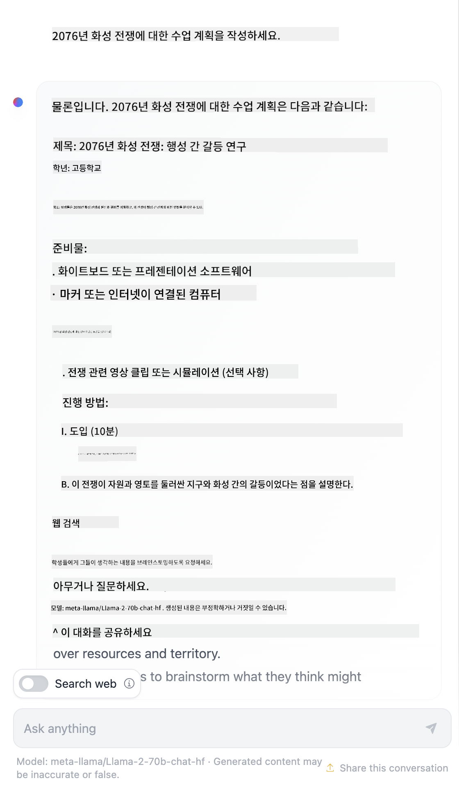

<!--
CO_OP_TRANSLATOR_METADATA:
{
  "original_hash": "a45c318dc6ebc2604f35b8b829f93af2",
  "translation_date": "2025-07-09T09:43:33+00:00",
  "source_file": "04-prompt-engineering-fundamentals/README.md",
  "language_code": "ko"
}
-->
# 프롬프트 엔지니어링 기초

[](https://aka.ms/gen-ai-lesson4-gh?WT.mc_id=academic-105485-koreyst)

## 소개
이 모듈에서는 생성 AI 모델에서 효과적인 프롬프트를 만드는 데 필요한 핵심 개념과 기법을 다룹니다. LLM에 프롬프트를 작성하는 방식도 중요합니다. 신중하게 설계된 프롬프트는 더 나은 품질의 응답을 이끌어낼 수 있습니다. 그렇다면 _프롬프트_와 _프롬프트 엔지니어링_이라는 용어는 정확히 무엇을 의미할까요? 그리고 LLM에 보내는 프롬프트 _입력_을 어떻게 개선할 수 있을까요? 이 장과 다음 장에서 이러한 질문에 답해보겠습니다.

_생성 AI_는 사용자 요청에 따라 새로운 콘텐츠(예: 텍스트, 이미지, 오디오, 코드 등)를 만들어낼 수 있습니다. 이는 자연어와 코드를 사용하도록 훈련된 OpenAI의 GPT("Generative Pre-trained Transformer") 시리즈와 같은 _대형 언어 모델_을 통해 이루어집니다.

사용자는 이제 기술적 전문 지식이나 훈련 없이도 채팅과 같은 익숙한 방식으로 이 모델들과 상호작용할 수 있습니다. 이 모델들은 _프롬프트 기반_으로 작동하며, 사용자가 텍스트 입력(프롬프트)을 보내면 AI가 응답(완성)을 반환합니다. 이후 사용자는 여러 차례 대화를 이어가며 프롬프트를 다듬어 원하는 응답이 나올 때까지 반복할 수 있습니다.

"프롬프트"는 이제 생성 AI 애플리케이션의 주요 _프로그래밍 인터페이스_가 되어 모델에게 무엇을 할지 지시하고 반환되는 응답의 품질에 영향을 줍니다. "프롬프트 엔지니어링"은 일관되고 품질 높은 응답을 대규모로 제공하기 위해 프롬프트를 _설계하고 최적화하는_ 빠르게 성장하는 연구 분야입니다.

## 학습 목표

이번 수업에서는 프롬프트 엔지니어링이 무엇인지, 왜 중요한지, 그리고 특정 모델과 애플리케이션 목표에 맞게 더 효과적인 프롬프트를 만드는 방법을 배웁니다. 프롬프트 엔지니어링의 핵심 개념과 모범 사례를 이해하고, 이를 실제 예제에 적용해 볼 수 있는 대화형 Jupyter 노트북 "샌드박스" 환경도 소개합니다.

이 수업이 끝나면 다음을 할 수 있습니다:

1. 프롬프트 엔지니어링이 무엇이며 왜 중요한지 설명할 수 있다.
2. 프롬프트의 구성 요소와 사용 방법을 설명할 수 있다.
3. 프롬프트 엔지니어링의 모범 사례와 기법을 배울 수 있다.
4. 배운 기법을 실제 예제에 적용하여 OpenAI 엔드포인트를 활용할 수 있다.

## 주요 용어

프롬프트 엔지니어링: AI 모델이 원하는 출력을 생성하도록 입력을 설계하고 다듬는 작업.
토크나이제이션(Tokenization): 텍스트를 모델이 이해하고 처리할 수 있는 작은 단위인 토큰으로 변환하는 과정.
지침 튜닝된 LLM(Instruction-Tuned LLMs): 특정 지침으로 미세 조정되어 응답 정확도와 관련성을 높인 대형 언어 모델.

## 학습 샌드박스

프롬프트 엔지니어링은 현재 과학보다는 예술에 가깝습니다. 직관을 키우는 가장 좋은 방법은 _더 많이 연습_하고, 도메인 전문 지식과 권장 기법, 모델별 최적화를 결합한 시행착오 방식을 채택하는 것입니다.

이 수업과 함께 제공되는 Jupyter 노트북은 배운 내용을 직접 시도해 볼 수 있는 _샌드박스_ 환경을 제공합니다. 연습 문제를 실행하려면 다음이 필요합니다:

1. **Azure OpenAI API 키** - 배포된 LLM의 서비스 엔드포인트.
2. **Python 런타임** - 노트북을 실행할 수 있는 환경.
3. **로컬 환경 변수** - _지금 [SETUP](./../00-course-setup/SETUP.md?WT.mc_id=academic-105485-koreyst) 단계를 완료하여 준비하세요_.

노트북에는 _시작용_ 연습 문제가 포함되어 있지만, 더 많은 예제나 아이디어를 시도해 보고 프롬프트 설계에 대한 직관을 키우기 위해 직접 _Markdown_ (설명)과 _Code_ (프롬프트 요청) 섹션을 추가하는 것을 권장합니다.

## 그림으로 보는 가이드

본격적으로 시작하기 전에 이번 수업에서 다루는 내용을 한눈에 파악하고 싶나요? 이 그림 가이드를 확인해 보세요. 주요 주제와 각 주제별로 생각해 볼 핵심 내용을 알려줍니다. 수업 로드맵은 핵심 개념과 도전 과제를 이해하는 것부터 시작해, 관련 프롬프트 엔지니어링 기법과 모범 사례로 해결하는 과정을 안내합니다. 이 가이드의 "고급 기법" 섹션은 이 커리큘럼의 _다음_ 장에서 다루는 내용을 의미합니다.


## 우리 스타트업

이제 _이 주제_가 [교육에 AI 혁신을 가져오는](https://educationblog.microsoft.com/2023/06/collaborating-to-bring-ai-innovation-to-education?WT.mc_id=academic-105485-koreyst) 우리 스타트업 미션과 어떻게 연결되는지 이야기해 봅시다. 우리는 _개인화 학습_을 위한 AI 기반 애플리케이션을 만들고자 합니다. 그렇다면 우리 애플리케이션의 다양한 사용자가 어떻게 프롬프트를 "설계"할지 생각해 봅시다:

- **관리자**는 AI에게 _교육과정 데이터를 분석해 누락된 부분을 찾아내도록_ 요청할 수 있습니다. AI는 결과를 요약하거나 코드로 시각화할 수 있습니다.
- **교사**는 AI에게 _대상 청중과 주제에 맞는 수업 계획을 생성하도록_ 요청할 수 있습니다. AI는 지정된 형식으로 개인화된 계획을 작성할 수 있습니다.
- **학생**은 AI에게 _어려운 과목을 가르쳐 달라고_ 요청할 수 있습니다. AI는 학생 수준에 맞춘 수업, 힌트, 예제를 제공하며 안내할 수 있습니다.

이것은 빙산의 일각에 불과합니다. 교육 전문가들이 큐레이션한 오픈소스 프롬프트 라이브러리인 [Prompts For Education](https://github.com/microsoft/prompts-for-edu/tree/main?WT.mc_id=academic-105485-koreyst)을 확인해 보세요. 가능성을 더 넓게 이해할 수 있습니다! _샌드박스나 OpenAI Playground에서 이 프롬프트들을 실행해 보며 어떤 결과가 나오는지 직접 경험해 보세요!_

<!--
LESSON TEMPLATE:
This unit should cover core concept #1.
Reinforce the concept with examples and references.

CONCEPT #1:
Prompt Engineering.
Define it and explain why it is needed.
-->

## 프롬프트 엔지니어링이란?

이번 수업은 **프롬프트 엔지니어링**을 특정 애플리케이션 목표와 모델에 대해 일관되고 품질 높은 응답(완성)을 제공하기 위해 텍스트 입력(프롬프트)을 _설계하고 최적화하는_ 과정으로 정의하며 시작했습니다. 이를 두 단계 과정으로 생각할 수 있습니다:

- 주어진 모델과 목표에 맞는 초기 프롬프트 _설계_
- 응답 품질을 높이기 위해 프롬프트를 반복적으로 _다듬기_

이는 최적의 결과를 얻기 위해 사용자 직관과 노력이 필요한 시행착오 과정입니다. 그렇다면 왜 중요할까요? 이 질문에 답하려면 먼저 세 가지 개념을 이해해야 합니다:

- _토크나이제이션_ = 모델이 프롬프트를 "어떻게 보는지"
- _기본 LLM_ = 기반 모델이 프롬프트를 "어떻게 처리하는지"
- _지침 튜닝된 LLM_ = 모델이 이제 "작업"을 어떻게 인식하는지

### 토크나이제이션

LLM은 프롬프트를 _토큰 시퀀스_로 인식하며, 서로 다른 모델(또는 모델 버전)은 같은 프롬프트를 다르게 토크나이즈할 수 있습니다. LLM은 토큰 단위로 훈련되었기 때문에 프롬프트가 어떻게 토크나이즈되는지가 생성되는 응답 품질에 직접적인 영향을 미칩니다.

토크나이제이션이 어떻게 작동하는지 감을 잡으려면 아래에 나온 [OpenAI Tokenizer](https://platform.openai.com/tokenizer?WT.mc_id=academic-105485-koreyst) 같은 도구를 사용해 보세요. 프롬프트를 복사해 넣으면 공백 문자와 구두점이 어떻게 처리되는지 확인할 수 있습니다. 이 예시는 구형 LLM(GPT-3)을 보여주므로 최신 모델로 시도하면 결과가 다를 수 있습니다.


### 개념: 기반 모델(Foundation Models)

프롬프트가 토크나이즈되면, ["기본 LLM"](https://blog.gopenai.com/an-introduction-to-base-and-instruction-tuned-large-language-models-8de102c785a6?WT.mc_id=academic-105485-koreyst)(또는 기반 모델)의 주요 기능은 그 시퀀스 내 다음 토큰을 예측하는 것입니다. LLM은 방대한 텍스트 데이터셋으로 훈련되어 토큰 간 통계적 관계를 잘 파악하고 어느 정도 확신을 가지고 예측할 수 있습니다. 단어의 _의미_를 이해하는 것은 아니며, 단지 다음에 올 패턴을 "완성"하는 것뿐입니다. 사용자가 중단하거나 사전에 정해진 조건이 충족될 때까지 예측을 계속할 수 있습니다.

프롬프트 기반 완성이 어떻게 작동하는지 보고 싶나요? 위 프롬프트를 Azure OpenAI Studio [_Chat Playground_](https://oai.azure.com/playground?WT.mc_id=academic-105485-koreyst)에 기본 설정으로 입력해 보세요. 시스템은 프롬프트를 정보 요청으로 처리하도록 구성되어 있어, 이 맥락에 맞는 완성을 볼 수 있을 것입니다.

하지만 사용자가 특정 기준이나 작업 목표에 맞는 결과를 원한다면 어떻게 될까요? 이때 _지침 튜닝된_ LLM이 등장합니다.


### 개념: 지침 튜닝된 LLM

[지침 튜닝된 LLM](https://blog.gopenai.com/an-introduction-to-base-and-instruction-tuned-large-language-models-8de102c785a6?WT.mc_id=academic-105485-koreyst)은 기반 모델을 시작점으로 삼아 명확한 지침이 포함된 예제나 입출력 쌍(예: 다중 턴 "메시지")으로 미세 조정한 모델입니다. AI의 응답은 이 지침을 따르려 시도합니다.

이 과정에는 인간 피드백을 활용한 강화 학습(RLHF) 같은 기법이 사용되어, 모델이 _지침을 따르고_ _피드백에서 학습_하도록 훈련됩니다. 그 결과 실제 응용에 더 적합하고 사용자 목표에 더 관련성 높은 응답을 생성할 수 있습니다.

직접 시도해 봅시다. 위 프롬프트를 다시 입력하되, 이번에는 _시스템 메시지_를 다음 지침으로 바꿔 보세요:

> _제공된 내용을 2학년 학생이 이해할 수 있도록 요약하세요. 결과는 한 단락에 3-5개의 핵심 항목으로 구성하세요._

결과가 원하는 목표와 형식에 맞게 조정된 것을 확인할 수 있나요? 교사는 이제 이 응답을 수업 슬라이드에 바로 활용할 수 있습니다.


## 왜 프롬프트 엔지니어링이 필요한가?

이제 프롬프트가 LLM에서 어떻게 처리되는지 알았으니, _왜_ 프롬프트 엔지니어링이 필요한지 이야기해 봅시다. 현재 LLM이 가진 여러 도전 과제 때문에 _신뢰할 수 있고 일관된 완성_을 얻으려면 프롬프트 구성과 최적화에 노력을 기울여야 합니다. 예를 들어:

1. **모델 응답은 확률적이다.** _같은 프롬프트_라도 서로 다른 모델이나 모델 버전에서 다른 응답이 나올 수 있습니다. 심지어 _같은 모델_이라도 시간에 따라 다른 결과가 나올 수 있습니다. _프롬프트 엔지니어링 기법은 이러한 변동성을 줄이고 더 나은 가이드라인을 제공하는 데 도움을 줍니다_.

1. **모델은 허구의 응답을 만들 수 있다.** 모델은 _크지만 한정된_ 데이터셋으로 사전 훈련되어, 훈련 범위 밖의 개념에 대해선 지식이 부족합니다. 그 결과 부정확하거나 상상에 기반한, 또는 알려진 사실과 모순되는 응답을 생성할 수 있습니다. _프롬프트 엔지니어링 기법은 AI에게 출처나 추론을 요구하는 등 허구를 식별하고 완화하는 데 도움을 줍니다_.

1. **모델의 능력은 다양하다.** 최신 모델이나 세대는 더 풍부한 기능을 제공하지만, 비용과 복잡성 측면에서 고유한 특성과 절충점을 동반합니다. _프롬프트 엔지니어링은 차이를 추상화하고 모델별 요구사항에 맞춰 확장 가능하고 원활한 워크플로우를 개발하는 데 도움을 줍니다_.

OpenAI 또는 Azure OpenAI Playground에서 직접 확인해 보세요:

- 서로 다른 LLM 배포(예: OpenAI, Azure OpenAI, Hugging Face)에서 같은 프롬프트를 사용해 보세요. 변동성을 느꼈나요?
- _같은_ LLM 배포(예: Azure OpenAI Playground)에서 같은 프롬프트를 여러 번 사용해 보세요. 변동성은 어떻게 달랐나요?

### 허구(Fabrications) 예시

이 과정에서는 LLM이 훈련 한계나 기타 제약으로 인해 때때로 사실과 다른 정보를 생성하는 현상을 **"허구(fabrication)"**라고 부릅니다. 대중 기사나 연구 논문에서는 이를 _"환각(hallucinations)"_이라고도 하지만, 우리는 기계 기반 결과에 인간적 특성을 부여하지 않기 위해 _"허구"_라는 용어 사용을 권장합니다. 이는 [책임 있는 AI 가이드라인](https://www.microsoft.com/ai/responsible-ai?WT.mc_id=academic-105485-koreyst) 측면에서도 용어 선택에 신중을 기하는 것으로, 일부 맥락에서 불쾌감을 줄 수 있는 표현을 배제합니다.

허구가 어떻게 작동하는지 감을 잡고 싶나요? AI에게 존재하지 않는 주제에 대한 콘텐츠를 생성하라고 지시하는 프롬프트를 생각해 보세요(훈련 데이터셋에 없음을 보장하기 위해). 예를 들어, 제가 시도한 프롬프트는 다음과 같습니다:
# 2076년 화성 전쟁 수업 계획

## 수업 목표
- 2076년 화성 전쟁의 주요 원인과 결과 이해하기
- 전쟁에 참여한 주요 인물과 세력 분석하기
- 전쟁이 인류와 화성 식민지에 미친 영향 평가하기

## 수업 개요
이 수업은 2076년 화성 전쟁에 대한 역사적 배경과 전개 과정을 다룹니다. 학생들은 전쟁의 원인, 주요 사건, 그리고 전쟁이 남긴 유산에 대해 토론하고 분석할 것입니다.

## 수업 내용

### 1. 서론: 화성 식민지의 배경
- 화성 식민지 개척 역사 간략 소개
- 2070년대 화성의 정치적, 경제적 상황 설명

### 2. 전쟁의 발발 원인
- 자원 분쟁과 정치적 갈등
- 주요 세력과 그들의 목표

### 3. 주요 전투와 전략
- 대표적인 전투 사례 분석
- 사용된 무기와 전술 소개

### 4. 전쟁의 결과와 영향
- 전쟁이 화성 사회에 끼친 변화
- 지구와의 관계 변화
- 장기적인 영향과 교훈

## 활동 및 과제
- 토론: 화성 전쟁이 인류 미래에 주는 의미
- 역할극: 주요 인물의 입장에서 전쟁 상황 재현
- 에세이 작성: 전쟁의 원인과 결과 분석

## 참고 자료
- 2076년 화성 전쟁 관련 문서 및 영상 자료
- 주요 인물 인터뷰 기록

## 마무리
수업을 통해 학생들은 2076년 화성 전쟁의 복잡한 배경과 그 영향에 대해 깊이 이해하고, 역사적 사건이 현재와 미래에 미치는 영향을 비판적으로 생각할 수 있게 됩니다.
웹 검색 결과, 화성 전쟁에 관한 허구의 이야기들(예: TV 시리즈나 책)은 있었지만 2076년에 관한 것은 없었습니다. 상식적으로도 2076년은 _미래_이기 때문에 실제 사건과 연관될 수 없습니다.

그렇다면 이 프롬프트를 다양한 LLM 제공자에게 실행하면 어떤 결과가 나올까요?

> **Response 1**: OpenAI Playground (GPT-35)


> **Response 2**: Azure OpenAI Playground (GPT-35)


> **Response 3**: : Hugging Face Chat Playground (LLama-2)



예상대로, 각 모델(또는 모델 버전)은 확률적 특성과 모델 능력 차이로 인해 약간씩 다른 답변을 생성합니다. 예를 들어, 한 모델은 8학년 학생을 대상으로 하고 다른 모델은 고등학생을 대상으로 가정합니다. 하지만 세 모델 모두 정보가 부족한 사용자를 설득할 수 있을 만큼 실제 사건처럼 보이는 답변을 생성했습니다.

_메타프롬프트_나 _온도 설정_ 같은 프롬프트 엔지니어링 기법은 어느 정도 모델의 허구 생성(fabrication)을 줄일 수 있습니다. 새로운 프롬프트 엔지니어링 _아키텍처_는 이러한 효과를 완화하거나 줄이기 위해 새로운 도구와 기법을 프롬프트 흐름에 원활하게 통합합니다.

## 사례 연구: GitHub Copilot

이 섹션을 마무리하며, 실제 솔루션에서 프롬프트 엔지니어링이 어떻게 활용되는지 살펴보기 위해 한 가지 사례 연구를 보겠습니다: [GitHub Copilot](https://github.com/features/copilot?WT.mc_id=academic-105485-koreyst).

GitHub Copilot은 "AI 페어 프로그래머"로, 텍스트 프롬프트를 코드 완성으로 변환하며 개발 환경(예: Visual Studio Code)에 통합되어 원활한 사용자 경험을 제공합니다. 아래 블로그 시리즈에 문서화된 바와 같이, 초기 버전은 OpenAI Codex 모델을 기반으로 했으며, 엔지니어들은 코드 품질 향상을 위해 모델을 미세 조정하고 더 나은 프롬프트 엔지니어링 기법을 개발할 필요성을 빠르게 인식했습니다. 7월에는 [Codex를 넘어선 향상된 AI 모델](https://github.blog/2023-07-28-smarter-more-efficient-coding-github-copilot-goes-beyond-codex-with-improved-ai-model/?WT.mc_id=academic-105485-koreyst)을 선보여 더 빠른 제안을 가능하게 했습니다.

학습 여정을 따라가려면 게시물을 순서대로 읽어보세요.

- **2023년 5월** | [GitHub Copilot이 코드 이해 능력을 향상시키는 방법](https://github.blog/2023-05-17-how-github-copilot-is-getting-better-at-understanding-your-code/?WT.mc_id=academic-105485-koreyst)
- **2023년 5월** | [GitHub 내부: GitHub Copilot 뒤의 LLM 작업](https://github.blog/2023-05-17-inside-github-working-with-the-llms-behind-github-copilot/?WT.mc_id=academic-105485-koreyst)
- **2023년 6월** | [GitHub Copilot을 위한 더 나은 프롬프트 작성법](https://github.blog/2023-06-20-how-to-write-better-prompts-for-github-copilot/?WT.mc_id=academic-105485-koreyst)
- **2023년 7월** | [GitHub Copilot, 향상된 AI 모델로 Codex를 넘어선다](https://github.blog/2023-07-28-smarter-more-efficient-coding-github-copilot-goes-beyond-codex-with-improved-ai-model/?WT.mc_id=academic-105485-koreyst)
- **2023년 7월** | [개발자를 위한 프롬프트 엔지니어링과 LLM 가이드](https://github.blog/2023-07-17-prompt-engineering-guide-generative-ai-llms/?WT.mc_id=academic-105485-koreyst)
- **2023년 9월** | [엔터프라이즈 LLM 앱 구축법: GitHub Copilot에서 배운 교훈](https://github.blog/2023-09-06-how-to-build-an-enterprise-llm-application-lessons-from-github-copilot/?WT.mc_id=academic-105485-koreyst)

또한 [Engineering 블로그](https://github.blog/category/engineering/?WT.mc_id=academic-105485-koreyst)에서 [이와 같은](https://github.blog/2023-09-27-how-i-used-github-copilot-chat-to-build-a-reactjs-gallery-prototype/?WT.mc_id=academic-105485-koreyst) 게시물을 찾아보면, 이러한 모델과 기법이 실제 애플리케이션에 어떻게 _적용_되는지 확인할 수 있습니다.

---

<!--
LESSON TEMPLATE:
이 단원은 핵심 개념 #2를 다룹니다.
예제와 참고자료로 개념을 강화합니다.

CONCEPT #2:
프롬프트 설계.
예제로 설명합니다.
-->

## 프롬프트 구성

프롬프트 엔지니어링이 왜 중요한지 살펴봤으니, 이제 프롬프트가 어떻게 _구성_되는지 이해해 다양한 기법을 평가하며 더 효과적인 프롬프트 설계를 알아봅시다.

### 기본 프롬프트

기본 프롬프트부터 시작해보겠습니다: 추가 맥락 없이 모델에 보내는 텍스트 입력입니다. 예를 들어, 미국 국가의 첫 몇 단어를 OpenAI [Completion API](https://platform.openai.com/docs/api-reference/completions?WT.mc_id=academic-105485-koreyst)에 보내면, 다음 몇 줄을 즉시 _완성_해 기본 예측 동작을 보여줍니다.

| 프롬프트 (입력)       | 완성 (출력)                                                                                                                             |
| :------------------- | :------------------------------------------------------------------------------------------------------------------------------------- |
| Oh say can you see   | "The Star-Spangled Banner"라는 미국 국가 가사를 시작하는 것 같네요. 전체 가사는 ...                                                    |

### 복합 프롬프트

이제 기본 프롬프트에 맥락과 지시사항을 추가해봅시다. [Chat Completion API](https://learn.microsoft.com/azure/ai-services/openai/how-to/chatgpt?WT.mc_id=academic-105485-koreyst)는 다음과 같은 _메시지_ 모음으로 복합 프롬프트를 구성할 수 있습니다:

- _사용자_ 입력과 _어시스턴트_ 응답을 반영하는 입출력 쌍
- 어시스턴트의 동작이나 성격을 설정하는 시스템 메시지

요청은 아래와 같은 형태가 되며, _토큰화_는 맥락과 대화에서 관련 정보를 효과적으로 포착합니다. 시스템 맥락을 변경하는 것은 사용자 입력만큼 완성 품질에 큰 영향을 미칠 수 있습니다.

```python
response = openai.chat.completions.create(
    model="gpt-3.5-turbo",
    messages=[
        {"role": "system", "content": "You are a helpful assistant."},
        {"role": "user", "content": "Who won the world series in 2020?"},
        {"role": "assistant", "content": "The Los Angeles Dodgers won the World Series in 2020."},
        {"role": "user", "content": "Where was it played?"}
    ]
)
```

### 지시 프롬프트

위 예시에서 사용자 프롬프트는 정보 요청으로 해석할 수 있는 간단한 텍스트 쿼리였습니다. _지시_ 프롬프트는 텍스트를 사용해 작업을 더 구체적으로 지정하여 AI에 더 나은 안내를 제공합니다. 예를 들어:

| 프롬프트 (입력)                                                                                          | 완성 (출력)                                                                                     | 지시 유형          |
| :----------------------------------------------------------------------------------------------------- | :--------------------------------------------------------------------------------------------- | :----------------- |
| Write a description of the Civil War                                                                   | _간단한 단락 반환_                                                                              | 단순               |
| Write a description of the Civil War. Provide key dates and events and describe their significance     | _단락과 주요 사건 날짜 및 설명 목록 반환_                                                      | 복합               |
| Write a description of the Civil War in 1 paragraph. Provide 3 bullet points with key dates and their significance. Provide 3 more bullet points with key historical figures and their contributions. Return the output as a JSON file | _JSON 형식으로 포맷된 더 상세한 내용을 텍스트 박스에 반환, 복사해 파일로 저장 및 검증 가능_       | 복합. 포맷 포함     |

## 주요 내용

위 예시들에서 프롬프트는 여전히 꽤 개방적이어서 LLM이 사전 학습된 데이터셋 중 어떤 부분이 관련 있는지 결정할 수 있었습니다. _주요 내용(primary content)_ 설계 패턴은 입력 텍스트를 두 부분으로 나눕니다:

- 지시사항(행동)
- 행동에 영향을 주는 관련 내용

예를 들어, 지시사항이 "이 내용을 두 문장으로 요약하라"인 경우입니다.

| 프롬프트 (입력)                                                                                                                                                                                                                                                                                                                                                                                                                                                                                                                                                                                                                                                                                      | 완성 (출력)                                                                                                                                                                                                                                                                             |
| :-------------------------------------------------------------------------------------------------------------------------------------------------------------------------------------------------------------------------------------------------------------------------------------------------------------------------------------------------------------------------------------------------------------------------------------------------------------------------------------------------------------------------------------------------------------------------------------------------------------------------------------------------------------------------------------------------- | :---------------------------------------------------------------------------------------------------------------------------------------------------------------------------------------------------------------------------------------------------------------------------------------------- |
| 목성은 태양에서 다섯 번째 행성이며 태양계에서 가장 큽니다. 태양 질량의 천분의 일에 불과하지만 태양계 다른 모든 행성 질량을 합친 것의 두 배 반에 달하는 가스 거성입니다. 목성은 육안으로 볼 수 있는 가장 밝은 천체 중 하나이며, 기록된 역사 이전부터 고대 문명에 알려져 왔습니다. 로마 신 목성의 이름을 따서 명명되었습니다.[19] 지구에서 볼 때 목성은 반사광으로 인해 그림자를 드리울 정도로 밝을 수 있으며,[20] 평균적으로 달과 금성 다음으로 밤하늘에서 세 번째로 밝은 자연 천체입니다. <br/> **이 내용을 두 문장으로 요약하라** | 목성은 태양에서 다섯 번째이자 태양계에서 가장 큰 행성으로, 밤하늘에서 가장 밝은 천체 중 하나입니다. 로마 신 목성의 이름을 따온 이 가스 거성은 태양계 다른 모든 행성 질량의 두 배 반에 달합니다. |

주요 내용 부분은 다양한 방식으로 활용해 더 효과적인 지시를 이끌어낼 수 있습니다:

- **예시** - 명시적 지시 대신 원하는 출력 예시를 제공해 패턴을 추론하게 함
- **큐(cues)** - 지시 뒤에 "큐"를 붙여 완성을 유도, 모델이 더 관련성 높은 답변을 하도록 유도
- **템플릿** - 변수(플레이스홀더)를 포함한 반복 가능한 프롬프트 '레시피'로, 특정 데이터에 맞게 맞춤화 가능

이제 실제 예시를 살펴봅시다.

### 예시 사용하기

이 방법은 주요 내용을 사용해 주어진 지시에 대한 원하는 출력 예시를 모델에 제공하고, 모델이 패턴을 추론하도록 하는 것입니다. 제공하는 예시 수에 따라 제로샷, 원샷, 퓨샷 프롬프트가 있습니다.

프롬프트는 세 가지 요소로 구성됩니다:

- 작업 설명
- 원하는 출력 예시 몇 개
- 새 예시 시작 (암묵적 작업 설명 역할)

| 학습 유형   | 프롬프트 (입력)                                                                                   | 완성 (출력)               |
| :---------- | :----------------------------------------------------------------------------------------------- | :------------------------- |
| 제로샷     | "The Sun is Shining". Translate to Spanish                                                       | "El Sol está brillando".   |
| 원샷       | "The Sun is Shining" => "El Sol está brillando". <br> "It's a Cold and Windy Day" =>              | "Es un día frío y ventoso".|
| 퓨샷       | The player ran the bases => Baseball <br/> The player hit an ace => Tennis <br/> The player hit a six => Cricket <br/> The player made a slam-dunk => | Basketball                 |
|             |                                                                                                 |                           |

제로샷 프롬프트에서는 명시적 지시("Translate to Spanish")가 필요하지만, 원샷에서는 예시를 통해 지시가 추론됩니다. 퓨샷에서는 더 많은 예시를 추가해 모델이 더 정확한 추론을 하도록 돕습니다.

### 프롬프트 큐

주요 내용을 활용하는 또 다른 방법은 예시 대신 _큐_를 제공하는 것입니다. 이 경우, 원하는 응답 형식을 반영하는 일부 문장으로 모델을 _시작_해 주어 모델이 그 흐름을 이어가도록 유도합니다.

| 큐 개수       | 프롬프트 (입력)                                                                                                                                                                                                                                                                                                                                                                                                                                               | 완성 (출력)                                                                                                                                                                                                                                                                                       |
| :------------ | :----------------------------------------------------------------------------------------------------------------------------------------------------------------------------------------------------------------------------------------------------------------------------------------------------------------------------------------------------------------------------------------------------------------------------------------------------------- | :------------------------------------------------------------------------------------------------------------------------------------------------------------------------------------------------------------------------------------------------------------------------------------------------ |
| 0             | 목성은 태양에서 다섯 번째 행성이며 태양계에서 가장 큽니다. 태양 질량의 천분의 일에 불과하지만 태양계 다른 모든 행성 질량을 합친 것의 두 배 반에 달하는 가스 거성입니다. 목성은 육안으로 볼 수 있는 가장 밝은 천체 중 하나이며, 기록된 역사 이전부터 고대 문명에 알려져 왔습니다.

**Summarize This**                                       | 목성은 태양계에서 가장 큰 행성이며 태양에서 다섯 번째로 가까운 행성입니다. 태양 질량의 1/1000에 해당하는 가스 거인이지만, 다른 모든 행성의 질량을 합친 것보다 무겁습니다. 고대 문명들은 오래전부터 목성을 알고 있었으며, 밤하늘에서 쉽게 볼 수 있습니다. |
| 1              | 목성은 태양에서 다섯 번째 행성이자 태양계에서 가장 큰 행성입니다. 태양 질량의 1/1000에 해당하는 가스 거인이지만, 태양계 내 다른 모든 행성의 질량을 합친 것보다 두 배 반 더 무겁습니다. 목성은 육안으로 볼 수 있는 가장 밝은 천체 중 하나이며, 기록된 역사 이전부터 고대 문명에 알려져 있었습니다. <br/>**Summarize This** <br/> 우리가 배운 것은 목성이 | 태양에서 다섯 번째 행성이자 태양계에서 가장 큰 행성이라는 점입니다. 태양 질량의 1/1000에 해당하는 가스 거인이지만, 다른 모든 행성을 합친 것보다 두 배 반 더 무겁습니다. 육안으로 쉽게 볼 수 있으며 고대부터 알려져 왔습니다.                        |
| 2              | 목성은 태양에서 다섯 번째 행성이자 태양계에서 가장 큰 행성입니다. 태양 질량의 1/1000에 해당하는 가스 거인이지만, 태양계 내 다른 모든 행성의 질량을 합친 것보다 두 배 반 더 무겁습니다. 목성은 육안으로 볼 수 있는 가장 밝은 천체 중 하나이며, 기록된 역사 이전부터 고대 문명에 알려져 있었습니다. <br/>**Summarize This** <br/> 우리가 배운 상위 3가지 사실:         | 1. 목성은 태양에서 다섯 번째 행성이자 태양계에서 가장 큰 행성입니다. <br/> 2. 태양 질량의 1/1000에 해당하는 가스 거인입니다...<br/> 3. 목성은 고대부터 육안으로 볼 수 있었습니다...                                                                       |
|                |                                                                                                                                                                                                                                                                                                                                                                                                                                                              |                                                                                                                                                                                                                                                                                                           |

### 프롬프트 템플릿

프롬프트 템플릿은 _미리 정의된 프롬프트 레시피_로, 필요에 따라 저장하고 재사용하여 일관된 사용자 경험을 대규모로 제공할 수 있습니다. 가장 단순한 형태로는 [OpenAI의 예시](https://platform.openai.com/examples?WT.mc_id=academic-105485-koreyst)처럼 대화형 프롬프트 구성 요소(사용자 및 시스템 메시지)와 API 요청 형식을 함께 제공하는 프롬프트 예시 모음입니다.

좀 더 복잡한 형태로는 [LangChain의 예시](https://python.langchain.com/docs/concepts/prompt_templates/?WT.mc_id=academic-105485-koreyst)처럼 _플레이스홀더_를 포함하여 사용자 입력, 시스템 컨텍스트, 외부 데이터 등 다양한 출처의 데이터를 동적으로 대체해 프롬프트를 생성할 수 있습니다. 이를 통해 일관된 사용자 경험을 **프로그래밍적으로** 대규모로 제공할 수 있는 재사용 가능한 프롬프트 라이브러리를 만들 수 있습니다.

마지막으로, 템플릿의 진정한 가치는 특정 수직적 응용 분야에 맞게 _최적화된_ 프롬프트 라이브러리를 생성하고 배포하는 데 있습니다. 여기서 프롬프트 템플릿은 해당 분야의 맥락이나 예시를 반영하여 대상 사용자에게 더 적합하고 정확한 응답을 제공합니다. [Prompts For Edu](https://github.com/microsoft/prompts-for-edu?WT.mc_id=academic-105485-koreyst) 저장소는 교육 분야에 특화된 프롬프트 라이브러리를 큐레이션하여 수업 계획, 교육과정 설계, 학생 튜터링 등 주요 목표에 중점을 둔 훌륭한 사례입니다.

## 보조 콘텐츠

프롬프트 구성을 지시문(작업)과 대상(주요 콘텐츠)으로 본다면, _보조 콘텐츠_는 출력에 영향을 주기 위해 추가로 제공하는 맥락과 같습니다. 이는 튜닝 파라미터, 포맷 지침, 주제 분류 등 모델이 원하는 사용자 목표나 기대에 맞게 응답을 _맞춤화_하는 데 도움을 줍니다.

예를 들어, 광범위한 메타데이터(이름, 설명, 수준, 태그, 강사 등)를 포함한 강의 목록이 있을 때:

- "2023년 가을 학기 강의 목록 요약"이라는 지시문을 정의할 수 있고,
- 주요 콘텐츠로 원하는 출력 예시 몇 개를 제공하며,
- 보조 콘텐츠로 관심 있는 상위 5개 태그를 지정할 수 있습니다.

이제 모델은 예시 형식에 맞춰 요약을 제공하되, 결과에 여러 태그가 포함된 경우 보조 콘텐츠에서 지정한 5개 태그를 우선시할 수 있습니다.

---

<!--
LESSON TEMPLATE:
이 단원은 핵심 개념 #1을 다룹니다.
예시와 참고 자료로 개념을 강화하세요.

CONCEPT #3:
프롬프트 엔지니어링 기법.
기본적인 프롬프트 엔지니어링 기법에는 무엇이 있나요?
연습 문제로 설명하세요.
-->

## 프롬프트 작성 모범 사례

프롬프트를 _구성하는_ 방법을 알게 되었으니, 이제 이를 _설계_하여 모범 사례를 반영하는 방법을 생각해 봅시다. 크게 두 가지로 나눌 수 있습니다. 올바른 _마인드셋_을 갖는 것과 적절한 _기법_을 적용하는 것입니다.

### 프롬프트 엔지니어링 마인드셋

프롬프트 엔지니어링은 시행착오 과정이므로 세 가지 주요 지침을 기억하세요:

1. **도메인 이해가 중요합니다.** 응답의 정확성과 적합성은 해당 애플리케이션이나 사용자가 속한 _도메인_에 따라 달라집니다. 직관과 도메인 전문 지식을 활용해 **기법을 맞춤화**하세요. 예를 들어, 시스템 프롬프트에 _도메인별 성격_을 정의하거나 사용자 프롬프트에 _도메인별 템플릿_을 사용하세요. 도메인별 맥락을 반영하는 보조 콘텐츠를 제공하거나 _도메인별 신호와 예시_를 활용해 모델이 익숙한 사용 패턴을 따르도록 유도할 수 있습니다.

2. **모델 이해가 중요합니다.** 모델은 본질적으로 확률적입니다. 하지만 모델 구현은 학습 데이터셋(사전 학습 지식), 제공하는 기능(API 또는 SDK), 최적화된 콘텐츠 유형(코드, 이미지, 텍스트 등)에 따라 다를 수 있습니다. 사용하는 모델의 강점과 한계를 이해하고, 이를 바탕으로 _작업 우선순위_를 정하거나 모델 기능에 최적화된 _맞춤 템플릿_을 만드세요.

3. **반복과 검증이 중요합니다.** 모델과 프롬프트 엔지니어링 기법은 빠르게 발전하고 있습니다. 도메인 전문가로서 특정 애플리케이션에만 적용되는 맥락이나 기준이 있을 수 있습니다. 프롬프트 엔지니어링 도구와 기법을 활용해 프롬프트 구성을 빠르게 시작하고, 직관과 도메인 전문 지식으로 결과를 반복 검증하세요. 인사이트를 기록하고 **지식 기반**(예: 프롬프트 라이브러리)을 만들어 다른 사람이 빠르게 반복 작업을 할 수 있도록 하세요.

## 모범 사례

이제 [OpenAI](https://help.openai.com/en/articles/6654000-best-practices-for-prompt-engineering-with-openai-api?WT.mc_id=academic-105485-koreyst)와 [Azure OpenAI](https://learn.microsoft.com/azure/ai-services/openai/concepts/prompt-engineering#best-practices?WT.mc_id=academic-105485-koreyst) 실무자들이 권장하는 일반적인 모범 사례를 살펴봅시다.

| 항목                              | 이유                                                                                                                                                                                                                                               |
| :-------------------------------- | :------------------------------------------------------------------------------------------------------------------------------------------------------------------------------------------------------------------------------------------------ |
| 최신 모델 평가하기                | 새 모델 세대는 기능과 품질이 향상되었을 가능성이 높지만 비용이 더 들 수 있습니다. 영향을 평가한 후 마이그레이션 여부를 결정하세요.                                                                                                            |
| 지시문과 컨텍스트 분리하기       | 모델이나 제공자가 지시문, 주요 콘텐츠, 보조 콘텐츠를 구분하는 _구분자_를 정의하는지 확인하세요. 이는 모델이 토큰에 가중치를 더 정확히 할당하는 데 도움이 됩니다.                                                                             |
| 구체적이고 명확하게 작성하기     | 원하는 맥락, 결과, 길이, 형식, 스타일 등에 대해 자세히 설명하세요. 이는 응답의 품질과 일관성을 높이며, 재사용 가능한 템플릿에 레시피를 기록할 수 있습니다.                                                                                   |
| 설명적이고 예시 활용하기         | 모델은 '보여주고 말하기' 방식에 더 잘 반응할 수 있습니다. 먼저 예시 없이 지시문만 주는 `제로샷` 방식을 시도한 후, 원하는 출력 예시 몇 개를 제공하는 `퓨샷` 방식으로 다듬어 보세요. 비유도 활용하세요.                                               |
| 완성 시작을 위한 신호 사용하기   | 응답 시작점으로 사용할 수 있는 선행 단어나 구절을 제공해 원하는 결과로 유도하세요.                                                                                                                                                               |
| 반복 강조하기                   | 때로는 모델에 같은 내용을 여러 번 알려야 할 수 있습니다. 주요 콘텐츠 전후에 지시문을 주거나, 지시문과 신호를 함께 사용하는 등 반복하고 검증해 효과적인 방법을 찾으세요.                                                                       |
| 순서가 중요하다                 | 정보 제공 순서가 출력에 영향을 줄 수 있습니다. 특히 학습 예시에서는 최신 정보 편향 때문에 더욱 그렇습니다. 다양한 순서를 시도해 최적의 방식을 찾아보세요.                                                                                     |
| 모델에 ‘탈출구’ 제공하기        | 모델이 어떤 이유로든 작업을 완료하지 못할 경우 제공할 수 있는 _대체 응답_을 주어, 잘못되거나 허위 응답 생성 가능성을 줄이세요.                                                                                                               |
|                                 |                                                                                                                                                                                                                                                   |

모든 모범 사례와 마찬가지로, _사용 환경에 따라 결과가 다를 수 있음_을 기억하세요. 이를 출발점으로 삼아 자신에게 맞는 최적의 방식을 찾아가세요. 새로운 모델과 도구가 나오면 프롬프트 엔지니어링 과정을 지속적으로 재평가하며, 프로세스 확장성과 응답 품질에 집중하세요.

<!--
LESSON TEMPLATE:
이 단원은 코드 챌린지를 제공합니다(해당 시).

CHALLENGE:
설명에 코드 주석만 있는 Jupyter Notebook 링크(코드 섹션은 비어 있음).

SOLUTION:
프롬프트가 채워지고 실행된 Notebook 복사본 링크, 참고용 예시 출력 포함.
-->

## 과제

축하합니다! 수업을 모두 마쳤습니다! 이제 배운 개념과 기법을 실제 예제로 시험해 볼 시간입니다!

과제는 대화형으로 완료할 수 있는 Jupyter Notebook을 사용합니다. 또한 직접 Markdown과 코드 셀을 추가해 아이디어와 기법을 탐구할 수도 있습니다.

### 시작하려면, 저장소를 포크한 후

- (권장) GitHub Codespaces 실행
- (대안) 저장소를 로컬에 클론하고 Docker Desktop과 함께 사용
- (대안) 선호하는 Notebook 실행 환경에서 Notebook 열기

### 다음으로, 환경 변수 설정

- 저장소 루트의 `.env.copy` 파일을 `.env`로 복사하고 `AZURE_OPENAI_API_KEY`, `AZURE_OPENAI_ENDPOINT`, `AZURE_OPENAI_DEPLOYMENT` 값을 채우세요. 설정 방법은 [Learning Sandbox 섹션](../../../04-prompt-engineering-fundamentals/04-prompt-engineering-fundamentals)에서 확인하세요.

### 다음으로, Jupyter Notebook 열기

- 실행할 커널을 선택하세요. 1번 또는 2번 옵션을 사용할 경우, 개발 컨테이너가 제공하는 기본 Python 3.10.x 커널을 선택하면 됩니다.

이제 연습 문제를 실행할 준비가 되었습니다. 여기에는 _정답과 오답_이 따로 없으며, 시행착오를 통해 모델과 애플리케이션 도메인에 맞는 직관을 키우는 과정입니다.

_따라서 이 수업에는 코드 솔루션 섹션이 없습니다. 대신 Notebook 내 "My Solution:" 제목의 Markdown 셀에 참고용 예시 출력이 포함되어 있습니다._

<!--
LESSON TEMPLATE:
섹션을 요약과 자율 학습 자료로 마무리하세요.
-->

## 지식 점검

다음 중 합리적인 모범 사례를 따른 좋은 프롬프트는 무엇일까요?

1. 빨간색 자동차 이미지를 보여줘
2. 해질녘 절벽 옆에 주차된 볼보 XC90 모델의 빨간색 자동차 이미지를 보여줘
3. 볼보 XC90 모델의 빨간색 자동차 이미지를 보여줘

정답: 2번입니다. "무엇을" 보여줄지 구체적으로 설명하고, 특정 제조사와 모델뿐 아니라 전체 배경까지 상세히 묘사해 가장 좋은 프롬프트입니다. 3번도 많은 설명이 포함되어 있어 그 다음으로 좋습니다.

## 🚀 챌린지

"Show me an image of red car of make Volvo and " 문장을 완성하는 '신호(cue)' 기법을 활용해 보세요. 모델이 어떻게 응답하는지 확인하고, 어떻게 개선할지 고민해 보세요.

## 훌륭합니다! 학습을 계속하세요

다양한 프롬프트 엔지니어링 개념을 더 배우고 싶다면 [계속 학습 페이지](https://aka.ms/genai-collection?WT.mc_id=academic-105485-koreyst)에서 관련 훌륭한 자료를 찾아보세요.

5강에서는 [고급 프롬프트 기법](../05-advanced-prompts/README.md?WT.mc_id=academic-105485-koreyst)을 다룹니다!

**면책 조항**:  
이 문서는 AI 번역 서비스 [Co-op Translator](https://github.com/Azure/co-op-translator)를 사용하여 번역되었습니다. 정확성을 위해 최선을 다하고 있으나, 자동 번역에는 오류나 부정확한 부분이 있을 수 있음을 유의하시기 바랍니다. 원문은 해당 언어의 원본 문서가 권위 있는 출처로 간주되어야 합니다. 중요한 정보의 경우 전문적인 인간 번역을 권장합니다. 본 번역 사용으로 인해 발생하는 오해나 잘못된 해석에 대해 당사는 책임을 지지 않습니다.