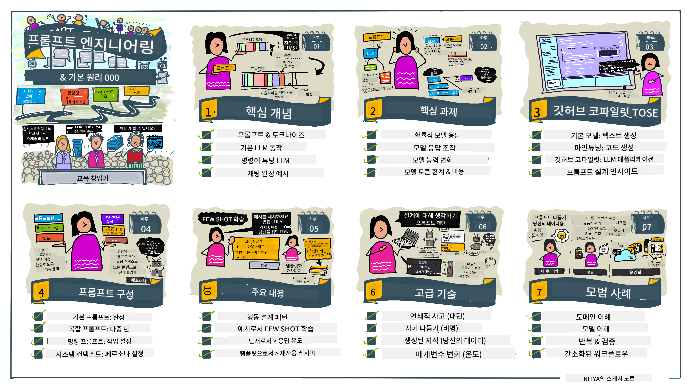
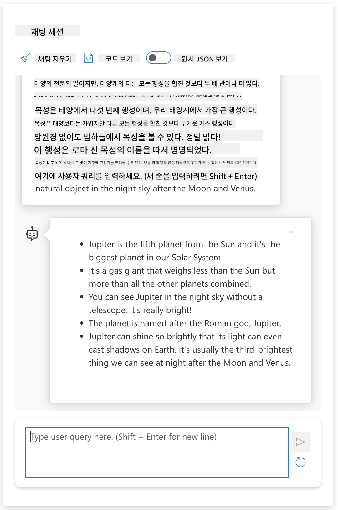

<!--
CO_OP_TRANSLATOR_METADATA:
{
  "original_hash": "dcbaaae026cb50fee071e690685b5843",
  "translation_date": "2025-08-26T15:18:53+00:00",
  "source_file": "04-prompt-engineering-fundamentals/README.md",
  "language_code": "ko"
}
-->
# 프롬프트 엔지니어링 기초

[](https://aka.ms/gen-ai-lesson4-gh?WT.mc_id=academic-105485-koreyst)

## 소개
이 모듈에서는 생성형 AI 모델에서 효과적인 프롬프트를 만들기 위한 핵심 개념과 기법을 다룹니다. LLM에 프롬프트를 어떻게 작성하느냐도 매우 중요합니다. 신중하게 작성된 프롬프트는 더 나은 품질의 응답을 이끌어낼 수 있습니다. 하지만 _프롬프트_와 _프롬프트 엔지니어링_ 같은 용어는 정확히 무엇을 의미할까요? 그리고 LLM에 보내는 프롬프트 _입력_을 어떻게 개선할 수 있을까요? 이 장과 다음 장에서 이러한 질문에 답해보겠습니다.

_생성형 AI_는 사용자의 요청에 따라 새로운 콘텐츠(예: 텍스트, 이미지, 오디오, 코드 등)를 만들어낼 수 있습니다. 이는 자연어와 코드를 사용할 수 있도록 훈련된 OpenAI의 GPT("Generative Pre-trained Transformer") 시리즈와 같은 _대형 언어 모델_을 활용합니다.

이제 사용자는 별도의 기술 지식이나 교육 없이도 채팅과 같은 익숙한 방식으로 이러한 모델과 상호작용할 수 있습니다. 이 모델들은 _프롬프트 기반_으로 동작합니다. 사용자가 텍스트 입력(프롬프트)을 보내면 AI가 응답(컴플리션)을 반환합니다. 이후 사용자는 AI와 여러 차례 대화를 주고받으며, 원하는 응답이 나올 때까지 프롬프트를 다듬을 수 있습니다.

이제 "프롬프트"는 생성형 AI 앱의 주요 _프로그래밍 인터페이스_가 되어, 모델에게 무엇을 해야 하는지 지시하고 반환되는 응답의 품질에 영향을 줍니다. "프롬프트 엔지니어링"은 일관되고 고품질의 응답을 대규모로 얻기 위해 프롬프트의 _설계와 최적화_에 집중하는 빠르게 성장하는 연구 분야입니다.

## 학습 목표

이 강의에서는 프롬프트 엔지니어링이 무엇인지, 왜 중요한지, 그리고 주어진 모델과 애플리케이션 목표에 맞는 더 효과적인 프롬프트를 어떻게 만들 수 있는지 배웁니다. 프롬프트 엔지니어링의 핵심 개념과 모범 사례를 이해하고, 실제 예제에 이러한 개념이 어떻게 적용되는지 볼 수 있는 대화형 Jupyter 노트북 "샌드박스" 환경에 대해 알아봅니다.

이 강의를 마치면 다음을 할 수 있습니다:

1. 프롬프트 엔지니어링이 무엇이며 왜 중요한지 설명할 수 있다.
2. 프롬프트의 구성 요소와 그 사용 방법을 설명할 수 있다.
3. 프롬프트 엔지니어링을 위한 모범 사례와 기법을 배울 수 있다.
4. 배운 기법을 실제 예제에 적용해 볼 수 있다(OpenAI 엔드포인트 사용).

## 주요 용어

프롬프트 엔지니어링: AI 모델이 원하는 출력을 생성하도록 입력을 설계하고 다듬는 실천.
토크나이제이션: 텍스트를 모델이 이해하고 처리할 수 있는 더 작은 단위인 토큰으로 변환하는 과정.
Instruction-Tuned LLMs: 특정 지침을 통해 응답의 정확성과 관련성을 높이도록 미세 조정된 대형 언어 모델(LLM).

## 학습 샌드박스

프롬프트 엔지니어링은 현재 과학보다는 예술에 가깝습니다. 이를 잘 다루기 위한 가장 좋은 방법은 _직접 많이 연습_하고, 도메인 전문성과 추천 기법, 모델별 최적화를 결합한 시행착오 방식을 채택하는 것입니다.

이 강의에 포함된 Jupyter 노트북은 여러분이 배운 내용을 바로 실습해 볼 수 있는 _샌드박스_ 환경을 제공합니다. 실습을 진행하려면 다음이 필요합니다:

1. **Azure OpenAI API 키** - 배포된 LLM의 서비스 엔드포인트
2. **Python 런타임** - 노트북을 실행할 수 있는 환경
3. **로컬 환경 변수** - _지금 [SETUP](./../00-course-setup/02-setup-local.md?WT.mc_id=academic-105485-koreyst) 단계를 완료해 준비하세요_

노트북에는 _시작용_ 실습이 포함되어 있지만, 여러분만의 _Markdown_ (설명)과 _Code_ (프롬프트 요청) 섹션을 추가해 더 많은 예제나 아이디어를 시도해보고, 프롬프트 설계에 대한 감각을 키워보길 권장합니다.

## 그림으로 보는 가이드

이 강의에서 다루는 전체 내용을 한눈에 보고 싶으신가요? 아래 그림 가이드를 참고하세요. 주요 주제와 각 주제에서 생각해볼 핵심 포인트를 시각적으로 정리했습니다. 이 강의의 로드맵은 핵심 개념과 도전 과제를 이해하는 것에서 시작해, 관련 프롬프트 엔지니어링 기법과 모범 사례로 이를 해결하는 과정까지 안내합니다. 참고로, 이 가이드의 "고급 기법" 섹션은 다음 장에서 다룰 내용입니다.



## 우리의 스타트업

이제 _이 주제_가 [교육에 AI 혁신을 도입](https://educationblog.microsoft.com/2023/06/collaborating-to-bring-ai-innovation-to-education?WT.mc_id=academic-105485-koreyst)하려는 우리의 스타트업 미션과 어떻게 연결되는지 이야기해봅시다. 우리는 _개인화 학습_을 위한 AI 기반 애플리케이션을 만들고자 합니다. 그렇다면 우리 앱의 다양한 사용자가 어떻게 프롬프트를 "설계"할 수 있을지 생각해봅시다:

- **관리자**는 AI에게 _교육과정 데이터를 분석해 커버리지의 빈틈을 찾아달라_고 요청할 수 있습니다. AI는 결과를 요약하거나 코드를 통해 시각화할 수 있습니다.
- **교사**는 AI에게 _특정 대상과 주제에 맞는 수업 계획을 만들어달라_고 요청할 수 있습니다. AI는 지정된 형식에 맞춰 개인화된 계획을 만들어줍니다.
- **학생**은 AI에게 _어려운 과목을 튜터링해달라_고 요청할 수 있습니다. AI는 학생 수준에 맞는 수업, 힌트, 예시로 학습을 도와줄 수 있습니다.

이것은 빙산의 일각에 불과합니다. [Prompts For Education](https://github.com/microsoft/prompts-for-edu/tree/main?WT.mc_id=academic-105485-koreyst) - 교육 전문가들이 엄선한 오픈소스 프롬프트 라이브러리 - 를 참고해 더 다양한 가능성을 확인해보세요! _샌드박스나 OpenAI Playground에서 이러한 프롬프트를 직접 실행해보며 결과를 확인해보세요!_

<!--
LESSON TEMPLATE:
This unit should cover core concept #1.
Reinforce the concept with examples and references.

CONCEPT #1:
Prompt Engineering.
Define it and explain why it is needed.
-->

## 프롬프트 엔지니어링이란?

이 강의의 시작에서 **프롬프트 엔지니어링**을 _텍스트 입력(프롬프트)을 설계하고 최적화_하여 주어진 애플리케이션 목표와 모델에 대해 일관되고 고품질의 응답(컴플리션)을 얻는 과정으로 정의했습니다. 이를 두 단계로 생각할 수 있습니다:

- 주어진 모델과 목표에 맞는 초기 프롬프트를 _설계_하기
- 응답의 품질을 높이기 위해 프롬프트를 반복적으로 _다듬기_

이 과정은 시행착오가 필수적이며, 최적의 결과를 얻기 위해 사용자의 직관과 노력이 필요합니다. 그렇다면 왜 이것이 중요할까요? 그 답을 위해 먼저 세 가지 개념을 이해해야 합니다:

- _토크나이제이션_ = 모델이 프롬프트를 "어떻게 보는지"
- _Base LLMs_ = 기반 모델이 프롬프트를 "어떻게 처리하는지"
- _Instruction-Tuned LLMs_ = 모델이 "작업"을 어떻게 인식하는지

### 토크나이제이션

LLM은 프롬프트를 _토큰의 시퀀스_로 인식합니다. 모델(또는 모델 버전)에 따라 동일한 프롬프트도 토크나이즈 방식이 다를 수 있습니다. LLM은 토큰 단위로 학습되기 때문에(원본 텍스트가 아님), 프롬프트가 어떻게 토크나이즈되는지가 생성되는 응답의 품질에 직접적인 영향을 미칩니다.

토크나이제이션이 어떻게 동작하는지 감을 잡으려면 아래에 소개된 [OpenAI Tokenizer](https://platform.openai.com/tokenizer?WT.mc_id=academic-105485-koreyst)와 같은 도구를 사용해보세요. 프롬프트를 입력해보면, 공백 문자나 구두점이 어떻게 처리되는지 확인할 수 있습니다. 이 예시는 구버전 LLM(GPT-3)을 보여주므로, 최신 모델로 시도하면 결과가 다를 수 있습니다.


### 개념: 기반 모델(Foundation Models)

프롬프트가 토크나이즈되면, ["Base LLM"](https://blog.gopenai.com/an-introduction-to-base-and-instruction-tuned-large-language-models-8de102c785a6?WT.mc_id=academic-105485-koreyst) (또는 Foundation model)의 주요 기능은 그 시퀀스에서 다음에 올 토큰을 예측하는 것입니다. LLM은 방대한 텍스트 데이터셋으로 학습되어 토큰 간의 통계적 관계를 잘 파악하고 있어, 어느 정도 신뢰를 가지고 예측할 수 있습니다. 하지만 프롬프트나 토큰의 _의미_를 이해하는 것은 아니며, 단지 다음에 올 패턴을 예측해 "완성"하는 것입니다. 사용자가 중단하거나 미리 정해진 조건에 도달할 때까지 시퀀스 예측을 계속할 수 있습니다.

프롬프트 기반 컴플리션이 어떻게 동작하는지 보고 싶으신가요? 위의 프롬프트를 Azure OpenAI Studio의 [_Chat Playground_](https://oai.azure.com/playground?WT.mc_id=academic-105485-koreyst)에 기본 설정으로 입력해보세요. 시스템은 프롬프트를 정보 요청으로 처리하도록 설정되어 있으니, 해당 맥락에 맞는 컴플리션을 볼 수 있을 것입니다.

하지만 사용자가 특정 기준이나 작업 목표에 맞는 결과를 원한다면 어떻게 해야 할까요? 이때 _instruction-tuned_ LLM이 등장합니다.


### 개념: Instruction Tuned LLMs

[Instruction Tuned LLM](https://blog.gopenai.com/an-introduction-to-base-and-instruction-tuned-large-language-models-8de102c785a6?WT.mc_id=academic-105485-koreyst)은 기반 모델에서 시작해, 명확한 지침이 포함된 예시나 입력/출력 쌍(예: 여러 차례의 "메시지")으로 미세 조정됩니다. AI는 이러한 지침을 따르려는 응답을 생성합니다.

이 과정에는 인간 피드백을 활용한 강화학습(RLHF)과 같은 기법이 사용되어, 모델이 _지침을 따르고_ _피드백에서 학습_할 수 있도록 훈련합니다. 이를 통해 실제 애플리케이션에 더 적합하고 사용자 목표에 더 부합하는 응답을 생성할 수 있습니다.

직접 시도해봅시다. 위의 프롬프트를 다시 사용하되, 이번에는 _system message_를 다음과 같이 바꿔 맥락을 제공합니다:

> _제공된 내용을 초등학교 2학년 학생에게 맞게 요약해 주세요. 결과는 한 단락과 3~5개의 핵심 bullet point로 작성해 주세요._

이제 결과가 원하는 목표와 형식에 맞게 조정된 것을 볼 수 있습니다. 교사는 이 응답을 바로 수업 자료에 활용할 수 있습니다.



## 왜 프롬프트 엔지니어링이 필요한가?

이제 프롬프트가 LLM에서 어떻게 처리되는지 알았으니, _왜_ 프롬프트 엔지니어링이 필요한지 이야기해봅시다. 그 이유는 현재의 LLM이 _신뢰할 수 있고 일관된 컴플리션_을 얻기 어렵게 만드는 여러 도전 과제를 가지고 있기 때문입니다. 프롬프트를 신경 써서 설계하고 최적화하지 않으면 원하는 결과를 얻기 어렵습니다. 예를 들어:

1. **모델 응답은 확률적입니다.** _같은 프롬프트_라도 모델이나 모델 버전에 따라 다른 응답이 나올 수 있습니다. 심지어 _같은 모델_로 여러 번 시도해도 결과가 달라질 수 있습니다. _프롬프트 엔지니어링 기법을 활용하면 이러한 변동성을 줄이고 더 나은 가이드라인을 제공할 수 있습니다._

1. **모델이 허구의 응답을 만들어낼 수 있습니다.** 모델은 _방대하지만 한정된_ 데이터셋으로 사전 학습되기 때문에, 그 범위를 벗어난 개념에 대해서는 지식이 부족합니다. 그 결과, 부정확하거나 상상에 기반한, 혹은 알려진 사실과 모순되는 컴플리션을 생성할 수 있습니다. _프롬프트 엔지니어링 기법은 AI에게 인용이나 추론을 요청하는 등, 사용자가 이러한 허구를 식별하고 완화하는 데 도움을 줍니다._

1. **모델의 능력은 다양합니다.** 최신 모델이나 새로운 세대의 모델은 더 풍부한 기능을 제공하지만, 비용과 복잡성 측면에서 고유한 특성과 트레이드오프도 있습니다. _프롬프트 엔지니어링을 통해 모델별 요구사항에 맞게 차이를 추상화하고, 확장 가능하고 매끄럽게 워크플로우를 개발할 수 있습니다._

OpenAI 또는 Azure OpenAI Playground에서 직접 확인해봅시다:

- 동일한 프롬프트를 여러 LLM 배포(예: OpenAI, Azure OpenAI, Hugging Face)에서 사용해보세요. 결과의 차이를 확인할 수 있나요?
- 동일한 프롬프트를 _같은_ LLM 배포(예: Azure OpenAI playground)에서 여러 번 사용해보세요. 결과가 어떻게 달라지나요?

### 허구(Fabrications) 예시

이 강의에서는 LLM이 학습의 한계나 기타 제약으로 인해 사실과 다른 정보를 생성하는 현상을 **"허구(fabrication)"**라고 부릅니다. 대중 기사나 연구 논문에서는 _"환각(hallucination)"_이라는 용어로도 알려져 있습니다. 하지만 우리는 기계적 결과에 인간적인 특성을 부여하는 것을 피하기 위해 _"허구(fabrication)"_라는 용어 사용을 권장합니다. 이는 [Responsible AI 가이드라인](https://www.microsoft.com/ai/responsible-ai?WT.mc_id=academic-105485-koreyst)에서 권장하는 용어 사용과도 일치하며, 일부 맥락에서 불쾌감을 줄 수 있는 용어를 배제하는 데 도움이 됩니다.

허구가 어떻게 동작하는지 감을 잡고 싶으신가요? 학습 데이터셋에 없는 주제에 대해 AI에게 콘텐츠를 생성하도록 지시하는 프롬프트를 생각해보세요. 예를 들어, 저는 이런 프롬프트를 시도해봤습니다:
# 2076년 화성 전쟁 수업 계획안

## 수업 목표
- 2076년에 발생한 화성 전쟁의 주요 사건과 원인을 이해한다.
- 전쟁이 인류와 화성 사회에 미친 영향을 분석한다.
- 역사적 사건을 비판적으로 사고하고 토론하는 능력을 기른다.

## 준비물
- 교과서 발췌문
- 지도(지구와 화성)
- 프레젠테이션 자료
- 토론 질문지

## 도입 (10분)
- 2076년 화성 전쟁이란 무엇인지 간단히 소개한다.
- 학생들에게 "왜 인류는 화성에서 전쟁을 벌이게 되었을까?"라는 질문을 던진다.
- 화성 식민지의 성장과 지구와의 갈등에 대해 간략히 설명한다.

## 본 수업 (30분)

### 1. 전쟁의 배경 (10분)
- 2060년대 후반, 화성 식민지의 인구 증가와 자원 부족 문제를 설명한다.
- 지구 정부와 화성 식민지 간의 정치적 긴장과 독립 요구에 대해 토론한다.

### 2. 주요 사건 (10분)
- 2076년 3월, 첫 번째 충돌이 발생한 경위와 전개 과정을 설명한다.
- 양측의 전략, 주요 전투, 그리고 결정적인 순간들을 살펴본다.

### 3. 전쟁의 결과와 영향 (10분)
- 전쟁 이후 화성의 독립 선언과 새로운 정부 수립 과정을 설명한다.
- 인류 사회, 과학 기술, 문화에 미친 변화와 영향에 대해 토론한다.

## 활동 (15분)
- 학생들을 소그룹으로 나누어 "화성 전쟁이 인류에게 남긴 교훈"에 대해 토론하게 한다.
- 각 그룹이 토론 결과를 발표한다.

## 정리 및 평가 (5분)
- 오늘 배운 내용을 요약한다.
- 학생들에게 "만약 여러분이 화성 식민지 주민이었다면 어떤 선택을 했을 것 같은가?"라는 질문을 던진다.
- 간단한 퀴즈나 질문으로 학습 내용을 확인한다.

## 추가 자료 및 과제
- 2076년 화성 전쟁 관련 다큐멘터리 시청
- 전쟁의 원인과 결과에 대한 에세이 작성
웹 검색 결과, 화성 전쟁에 관한 허구의 이야기(예: TV 시리즈나 책)는 있었지만, 2076년에 관한 것은 없었습니다. 상식적으로도 2076년은 _미래_이기 때문에 실제 사건과 연관될 수 없습니다.

그렇다면 이 프롬프트를 다양한 LLM 제공자에서 실행하면 어떤 결과가 나올까요?

> **Response 1**: OpenAI Playground (GPT-35)


> **Response 2**: Azure OpenAI Playground (GPT-35)


> **Response 3**: : Hugging Face Chat Playground (LLama-2)


예상대로, 각 모델(혹은 모델 버전)은 확률적 특성과 모델 능력의 차이로 인해 약간씩 다른 답변을 생성합니다. 예를 들어, 한 모델은 중학생을 대상으로 하고, 다른 모델은 고등학생을 대상으로 합니다. 하지만 세 모델 모두 실제로는 존재하지 않는 사건을 실제처럼 보이게 답변을 생성했습니다.

_metaprompting_이나 _temperature 설정_ 같은 프롬프트 엔지니어링 기법을 활용하면 모델의 허구 생성 현상을 어느 정도 줄일 수 있습니다. 최근에는 새로운 프롬프트 엔지니어링 _아키텍처_가 등장하여, 다양한 도구와 기법을 프롬프트 흐름에 자연스럽게 통합해 이런 현상을 완화하거나 줄이고 있습니다.

## 사례 연구: GitHub Copilot

이번 섹션을 마무리하며, 실제 솔루션에서 프롬프트 엔지니어링이 어떻게 활용되는지 한 가지 사례로 살펴보겠습니다: [GitHub Copilot](https://github.com/features/copilot?WT.mc_id=academic-105485-koreyst).

GitHub Copilot은 "AI 페어 프로그래머"로, 텍스트 프롬프트를 코드 완성으로 변환해 개발 환경(예: Visual Studio Code)에 통합되어 사용자 경험을 향상시킵니다. 아래 블로그 시리즈에 따르면, 초기 버전은 OpenAI Codex 모델을 기반으로 했으며, 엔지니어들은 빠르게 모델을 미세 조정하고 더 나은 프롬프트 엔지니어링 기법을 개발해야 한다는 필요성을 깨달았습니다. 7월에는 [Codex를 뛰어넘는 향상된 AI 모델을 선보였습니다](https://github.blog/2023-07-28-smarter-more-efficient-coding-github-copilot-goes-beyond-codex-with-improved-ai-model/?WT.mc_id=academic-105485-koreyst) 덕분에 더 빠른 제안을 받을 수 있게 되었습니다.

아래 글들을 순서대로 읽으며 그들의 학습 여정을 따라가 보세요.

- **2023년 5월** | [GitHub Copilot이 여러분의 코드를 더 잘 이해하게 되었습니다](https://github.blog/2023-05-17-how-github-copilot-is-getting-better-at-understanding-your-code/?WT.mc_id=academic-105485-koreyst)
- **2023년 5월** | [GitHub 내부: Copilot의 LLM과 함께 작업하기](https://github.blog/2023-05-17-inside-github-working-with-the-llms-behind-github-copilot/?WT.mc_id=academic-105485-koreyst)
- **2023년 6월** | [GitHub Copilot을 위한 더 나은 프롬프트 작성법](https://github.blog/2023-06-20-how-to-write-better-prompts-for-github-copilot/?WT.mc_id=academic-105485-koreyst)
- **2023년 7월** | [.. GitHub Copilot, 향상된 AI 모델로 Codex를 뛰어넘다](https://github.blog/2023-07-28-smarter-more-efficient-coding-github-copilot-goes-beyond-codex-with-improved-ai-model/?WT.mc_id=academic-105485-koreyst)
- **2023년 7월** | [개발자를 위한 프롬프트 엔지니어링 및 LLM 가이드](https://github.blog/2023-07-17-prompt-engineering-guide-generative-ai-llms/?WT.mc_id=academic-105485-koreyst)
- **2023년 9월** | [엔터프라이즈 LLM 앱 구축법: GitHub Copilot에서 얻은 교훈](https://github.blog/2023-09-06-how-to-build-an-enterprise-llm-application-lessons-from-github-copilot/?WT.mc_id=academic-105485-koreyst)

또한 [엔지니어링 블로그](https://github.blog/category/engineering/?WT.mc_id=academic-105485-koreyst)에서 [이 글](https://github.blog/2023-09-27-how-i-used-github-copilot-chat-to-build-a-reactjs-gallery-prototype/?WT.mc_id=academic-105485-koreyst)처럼 실제 애플리케이션에 모델과 기법이 어떻게 _적용_되는지 확인할 수 있습니다.

---

## 프롬프트 구성

프롬프트 엔지니어링이 왜 중요한지 살펴봤으니, 이제 프롬프트가 어떻게 _구성_되는지 이해하고, 더 효과적인 프롬프트 설계를 위한 다양한 기법을 평가해봅시다.

### 기본 프롬프트

가장 기본적인 프롬프트부터 시작해봅시다. 아무런 추가 정보 없이 모델에 텍스트 입력을 보내는 방식입니다. 예를 들어, 미국 국가의 첫 구절을 OpenAI [Completion API](https://platform.openai.com/docs/api-reference/completions?WT.mc_id=academic-105485-koreyst)에 보내면, 모델은 바로 다음 구절을 _예측_해서 응답합니다. 이는 기본적인 예측 동작을 보여줍니다.

| 프롬프트(입력)     | 완성(출력)                                                                                                                        |
| :----------------- | :----------------------------------------------------------------------------------------------------------------------------------------- |
| Oh say can you see | 미국 국가 "The Star-Spangled Banner"의 가사로 시작하는 것 같네요. 전체 가사는 ... |

### 복합 프롬프트

이제 기본 프롬프트에 맥락과 지시사항을 추가해봅시다. [Chat Completion API](https://learn.microsoft.com/azure/ai-services/openai/how-to/chatgpt?WT.mc_id=academic-105485-koreyst)를 사용하면 여러 _메시지_로 구성된 복합 프롬프트를 만들 수 있습니다.

- _사용자_ 입력과 _어시스턴트_ 응답의 쌍
- 어시스턴트의 행동이나 성격을 설정하는 시스템 메시지

요청은 아래와 같은 형태가 되며, _토크나이징_을 통해 맥락과 대화에서 중요한 정보를 효과적으로 추출합니다. 이제 시스템 맥락을 바꾸는 것만으로도 완성 품질에 큰 영향을 줄 수 있습니다.

```python
response = openai.chat.completions.create(
    model="gpt-3.5-turbo",
    messages=[
        {"role": "system", "content": "You are a helpful assistant."},
        {"role": "user", "content": "Who won the world series in 2020?"},
        {"role": "assistant", "content": "The Los Angeles Dodgers won the World Series in 2020."},
        {"role": "user", "content": "Where was it played?"}
    ]
)
```

### 지시 프롬프트

위 예시에서는 사용자 프롬프트가 정보를 요청하는 간단한 텍스트 쿼리였습니다. _지시_ 프롬프트에서는 텍스트를 활용해 AI에게 더 구체적으로 작업을 지시할 수 있습니다. 예를 들어:

| 프롬프트(입력)                                                                                                                                                                                                                         | 완성(출력)                                                                                                        | 지시 유형    |
| :------------------------------------------------------------------------------------------------------------------------------------------------------------------------------------------------------------------------------------- | :------------------------------------------------------------------------------------------------------------------------- | :------------------ |
| Write a description of the Civil War                                                                                                                                                                                                   | _간단한 단락이 반환됨_                                                                                              | 단순              |
| Write a description of the Civil War. Provide key dates and events and describe their significance                                                                                                                                     | _단락과 주요 사건 날짜 및 설명이 리스트로 반환됨_                                             | 복합             |
| Write a description of the Civil War in 1 paragraph. Provide 3 bullet points with key dates and their significance. Provide 3 more bullet points with key historical figures and their contributions. Return the output as a JSON file | _더 많은 세부 정보가 텍스트 박스에 JSON 형식으로 반환되어 파일로 복사/검증 가능_ | 복합. 포맷 지정. |

## 주요 콘텐츠

위 예시들에서는 프롬프트가 비교적 자유로워서 LLM이 사전 학습 데이터셋 중 어떤 부분이 적합한지 스스로 결정했습니다. _주요 콘텐츠_ 설계 패턴에서는 입력 텍스트를 두 부분으로 나눕니다:

- 지시(행동)
- 관련 콘텐츠(행동에 영향을 주는 정보)

예를 들어, "2문장으로 요약하라"는 지시가 있을 때:

| 프롬프트(입력)                                                                                                                                                                                                                                                                                                                                                                                                                                                                                                                                                                                                                                                                                      | 완성(출력)                                                                                                                                                                                                                                                                             |
| :-------------------------------------------------------------------------------------------------------------------------------------------------------------------------------------------------------------------------------------------------------------------------------------------------------------------------------------------------------------------------------------------------------------------------------------------------------------------------------------------------------------------------------------------------------------------------------------------------------------------------------------------------------------------------------------------------- | :---------------------------------------------------------------------------------------------------------------------------------------------------------------------------------------------------------------------------------------------------------------------------------------------- |
| Jupiter is the fifth planet from the Sun and the largest in the Solar System. It is a gas giant with a mass one-thousandth that of the Sun, but two-and-a-half times that of all the other planets in the Solar System combined. Jupiter is one of the brightest objects visible to the naked eye in the night sky, and has been known to ancient civilizations since before recorded history. It is named after the Roman god Jupiter.[19] When viewed from Earth, Jupiter can be bright enough for its reflected light to cast visible shadows,[20] and is on average the third-brightest natural object in the night sky after the Moon and Venus. <br/> **Summarize this in 2 short sentences** | 목성은 태양에서 다섯 번째 행성이며, 태양계에서 가장 크고 밤하늘에서 가장 밝게 보이는 천체 중 하나입니다. 로마 신 목성의 이름을 딴 이 행성은 다른 모든 행성의 질량을 합친 것보다 두 배 반이나 무겁고, 가스 행성입니다. |

주요 콘텐츠 구간은 다양한 방식으로 더 효과적인 지시를 이끌어낼 수 있습니다:

- **예시** - 명시적으로 모델에게 무엇을 하라고 지시하는 대신, 원하는 결과의 예시를 제공해 패턴을 추론하게 합니다.
- **큐** - 지시 뒤에 "큐"를 추가해 완성 방향을 유도합니다.
- **템플릿** - 반복 가능한 프롬프트 '레시피'로, 변수(플레이스홀더)를 활용해 특정 용도에 맞게 데이터를 넣어 사용할 수 있습니다.

이제 각각을 실제로 살펴봅시다.

### 예시 활용

이 방식은 주요 콘텐츠에 원하는 출력의 예시를 "모델에게 먹여"서, 모델이 원하는 출력 패턴을 추론하게 합니다. 예시 개수에 따라 zero-shot, one-shot, few-shot 프롬프트 등이 있습니다.

프롬프트는 세 가지 요소로 구성됩니다:

- 작업 설명
- 원하는 출력의 몇 가지 예시
- 새로운 예시의 시작(암묵적 작업 설명)

| 학습 유형 | 프롬프트(입력)                                                                                                                                        | 완성(출력)         |
| :------------ | :---------------------------------------------------------------------------------------------------------------------------------------------------- | :-------------------------- |
| Zero-shot     | "The Sun is Shining". Translate to Spanish                                                                                                            | "El Sol está brillando".    |
| One-shot      | "The Sun is Shining" => ""El Sol está brillando". <br> "It's a Cold and Windy Day" =>                                                                 | "Es un día frío y ventoso". |
| Few-shot      | The player ran the bases => Baseball <br/> The player hit an ace => Tennis <br/> The player hit a six => Cricket <br/> The player made a slam-dunk => | Basketball                  |
|               |                                                                                                                                                       |                             |

zero-shot 프롬프트에서는 "Translate to Spanish"처럼 명확한 지시가 필요하지만, one-shot에서는 예시만으로도 모델이 작업을 추론합니다. few-shot 예시에서는 더 많은 예시를 추가해 별도의 지시 없이도 모델이 더 정확하게 추론할 수 있습니다.

### 프롬프트 큐

주요 콘텐츠를 활용하는 또 다른 방법은 _큐_를 제공하는 것입니다. 이 경우, 원하는 응답 형식의 일부를 미리 제시해 모델이 그 방향으로 답변을 이어가도록 유도합니다.

| 큐 개수 | 프롬프트(입력)                                                                                                                                                                                                                                                                                                                                                                                                                                               | 완성(출력)                                                                                                                                                                                                                                                                                       |
| :------------- | :----------------------------------------------------------------------------------------------------------------------------------------------------------------------------------------------------------------------------------------------------------------------------------------------------------------------------------------------------------------------------------------------------------------------------------------------------------- | :-------------------------------------------------------------------------------------------------------------------------------------------------------------------------------------------------------------------------------------------------------------------------------------------------------- |
| 0              | Jupiter is the fifth planet from the Sun and the largest in the Solar System. It is a gas giant with a mass one-thousandth that of the Sun, but two-and-a-half times that of all the other planets in the Solar System combined. Jupiter is one of the brightest objects visible to the naked eye in the night sky, and has been known to ancient civilizations since before recorded history.

**요약하기**                                       | 목성은 태양계에서 가장 큰 행성이며 태양에서 다섯 번째로 가까운 행성입니다. 태양 질량의 1/1000에 해당하는 질량을 가진 가스 행성이지만, 다른 모든 행성을 합친 것보다 더 무겁습니다. 고대 문명에서도 오랫동안 목성을 알고 있었으며, 밤하늘에서 쉽게 볼 수 있습니다. |
| 1              | 목성은 태양에서 다섯 번째 행성이자 태양계에서 가장 큰 행성입니다. 태양 질량의 1/1000에 해당하는 가스 행성이지만, 태양계의 다른 모든 행성을 합친 것보다 두 배 반이나 더 무겁습니다. 목성은 밤하늘에서 육안으로 볼 수 있는 가장 밝은 천체 중 하나이며, 기록 이전의 고대 문명에서도 알려져 있었습니다. <br/>**요약하기** <br/> 우리가 알게 된 것은 목성이 | 태양에서 다섯 번째 행성이자 태양계에서 가장 큰 행성이라는 점입니다. 태양 질량의 1/1000에 해당하는 가스 행성이지만, 다른 모든 행성을 합친 것보다 두 배 반이나 더 무겁습니다. 육안으로 쉽게 볼 수 있고, 고대부터 알려져 있었습니다.                        |
| 2              | 목성은 태양에서 다섯 번째 행성이자 태양계에서 가장 큰 행성입니다. 태양 질량의 1/1000에 해당하는 가스 행성이지만, 태양계의 다른 모든 행성을 합친 것보다 두 배 반이나 더 무겁습니다. 목성은 밤하늘에서 육안으로 볼 수 있는 가장 밝은 천체 중 하나이며, 기록 이전의 고대 문명에서도 알려져 있었습니다. <br/>**요약하기** <br/> 우리가 알게 된 주요 사실 3가지:         | 1. 목성은 태양에서 다섯 번째 행성이자 태양계에서 가장 큰 행성입니다. <br/> 2. 태양 질량의 1/1000에 해당하는 가스 행성입니다...<br/> 3. 목성은 고대부터 육안으로 볼 수 있었습니다 ...                                                                       |
|                |                                                                                                                                                                                                                                                                                                                                                                                                                                                              |                                                                                                                                                                                                                                                                                                           |

### 프롬프트 템플릿

프롬프트 템플릿은 _미리 정의된 프롬프트 레시피_로, 필요할 때 저장하고 재사용할 수 있어 대규모로 일관된 사용자 경험을 제공하는 데 도움이 됩니다. 가장 단순한 형태로는 [OpenAI의 예시](https://platform.openai.com/examples?WT.mc_id=academic-105485-koreyst)처럼 프롬프트 예시 모음(사용자 및 시스템 메시지)과 API 요청 형식을 함께 제공하여 재사용을 지원합니다.

좀 더 복잡한 형태로는 [LangChain의 예시](https://python.langchain.com/docs/concepts/prompt_templates/?WT.mc_id=academic-105485-koreyst)처럼 _플레이스홀더_를 포함하여 다양한 소스(사용자 입력, 시스템 컨텍스트, 외부 데이터 등)에서 데이터를 받아 동적으로 프롬프트를 생성할 수 있습니다. 이를 통해 재사용 가능한 프롬프트 라이브러리를 만들어 대규모로 일관된 사용자 경험을 **프로그래밍 방식**으로 제공할 수 있습니다.

마지막으로, 템플릿의 진정한 가치는 _프롬프트 라이브러리_를 특정 분야에 맞게 만들어 배포할 수 있다는 점에 있습니다. 이때 프롬프트 템플릿은 해당 분야의 맥락이나 예시를 반영해 응답이 더 적합하고 정확하게 나오도록 _최적화_됩니다. [Prompts For Edu](https://github.com/microsoft/prompts-for-edu?WT.mc_id=academic-105485-koreyst) 저장소는 교육 분야에 맞춘 프롬프트 라이브러리를 큐레이션한 좋은 예시로, 수업 계획, 커리큘럼 설계, 학생 튜터링 등 주요 목표에 중점을 두고 있습니다.

## 보조 콘텐츠

프롬프트 구성에서 지시(작업)와 대상(주요 콘텐츠)이 있다면, _보조 콘텐츠_는 **출력에 영향을 주기 위해 추가로 제공하는 맥락**입니다. 예를 들어, 튜닝 파라미터, 포맷 지침, 주제 분류 등 모델이 응답을 _사용자 목적이나 기대에 맞게 조정_할 수 있도록 도와줍니다.

예시: 모든 강좌에 대한 풍부한 메타데이터(이름, 설명, 수준, 태그, 강사 등)가 있는 강좌 카탈로그가 있다고 가정해봅시다.

- "2023년 가을 강좌 카탈로그를 요약하라"는 지시를 정의할 수 있습니다.
- 주요 콘텐츠로 원하는 출력 예시 몇 개를 제공합니다.
- 보조 콘텐츠로 관심 있는 상위 5개 "태그"를 지정할 수 있습니다.

이제 모델은 예시에서 보여준 형식으로 요약을 제공할 수 있고, 결과에 여러 태그가 있을 경우 보조 콘텐츠에서 지정한 5개 태그를 우선적으로 보여줄 수 있습니다.

---

<!--
LESSON TEMPLATE:
이 단원에서는 핵심 개념 #1을 다룹니다.
예시와 참고 자료로 개념을 강화하세요.

CONCEPT #3:
프롬프트 엔지니어링 기법.
프롬프트 엔지니어링의 기본 기법에는 무엇이 있나요?
연습 문제로 설명하세요.
-->

## 프롬프트 작성 모범 사례

프롬프트를 어떻게 _구성_할 수 있는지 알았다면, 이제 _설계_할 때 지켜야 할 모범 사례를 생각해볼 수 있습니다. 크게 두 가지로 나눌 수 있는데, 올바른 _마인드셋_을 갖는 것과 적절한 _기법_을 적용하는 것입니다.

### 프롬프트 엔지니어링 마인드셋

프롬프트 엔지니어링은 시행착오의 과정이므로 세 가지 큰 원칙을 기억하세요:

1. **도메인 이해가 중요합니다.** 응답의 정확성과 적합성은 그 응용 분야(도메인)에 따라 달라집니다. 직관과 도메인 전문성을 활용해 **기법을 맞춤화**하세요. 예를 들어, 시스템 프롬프트에 도메인별 성격을 정의하거나, 사용자 프롬프트에 도메인별 템플릿을 사용하세요. 보조 콘텐츠에 도메인 특유의 맥락을 반영하거나, 도메인에 익숙한 예시와 힌트를 제공해 모델이 자연스럽게 따라오도록 유도할 수 있습니다.

2. **모델 이해가 중요합니다.** 모델은 본질적으로 확률적입니다. 하지만 모델 구현에 따라 학습 데이터(사전 학습 지식), 제공 기능(API, SDK 등), 최적화된 콘텐츠 유형(코드, 이미지, 텍스트 등)이 다를 수 있습니다. 사용하는 모델의 강점과 한계를 파악해 _작업 우선순위_를 정하거나, 모델에 맞는 _맞춤 템플릿_을 만들어 최적화하세요.

3. **반복과 검증이 중요합니다.** 모델과 프롬프트 엔지니어링 기법은 빠르게 발전하고 있습니다. 도메인 전문가로서 여러분의 응용 분야에만 적용되는 맥락이나 기준이 있을 수 있습니다. 프롬프트 엔지니어링 도구와 기법으로 프롬프트 작성을 "빠르게 시작"한 뒤, 직접 반복하고 검증하세요. 인사이트를 기록해 **지식 베이스**(예: 프롬프트 라이브러리)를 만들어, 다른 사람들이 더 빠르게 반복할 수 있도록 새로운 기준을 제공하세요.

## 모범 사례

이제 [OpenAI](https://help.openai.com/en/articles/6654000-best-practices-for-prompt-engineering-with-openai-api?WT.mc_id=academic-105485-koreyst)와 [Azure OpenAI](https://learn.microsoft.com/azure/ai-services/openai/concepts/prompt-engineering#best-practices?WT.mc_id=academic-105485-koreyst) 전문가들이 추천하는 일반적인 모범 사례를 살펴봅시다.

| 내용                              | 이유                                                                                                                                                                                                                                               |
| :-------------------------------- | :------------------------------------------------------------------------------------------------------------------------------------------------------------------------------------------------------------------------------------------------ |
| 최신 모델 평가                   | 새로운 모델은 기능과 품질이 향상될 가능성이 높지만, 비용이 더 들 수 있습니다. 효과를 평가한 뒤, 마이그레이션 여부를 결정하세요.                                                                                |
| 지시와 맥락 분리                  | 모델/제공자가 지시, 주요/보조 콘텐츠를 구분하는 _구분자_를 정의하는지 확인하세요. 이렇게 하면 모델이 토큰에 더 정확하게 가중치를 줄 수 있습니다.                                                         |
| 구체적이고 명확하게 작성          | 원하는 맥락, 결과, 길이, 형식, 스타일 등을 자세히 설명하세요. 응답의 품질과 일관성이 높아집니다. 레시피를 재사용 가능한 템플릿에 담으세요.                                                          |
| 설명과 예시 활용                  | 모델은 "보여주고 설명하는" 방식에 더 잘 반응할 수 있습니다. 먼저 `zero-shot` 방식(예시 없이 지시만 제공)으로 시작한 뒤, `few-shot` 방식(원하는 출력 예시 몇 개 제공)으로 다듬으세요. 비유도 활용하세요. |
| 힌트로 응답 유도                  | 원하는 결과로 유도할 수 있도록, 응답의 시작점이 될 만한 단어나 문구를 제공하세요.                                                                                                               |
| 반복 강조                        | 때로는 모델에게 같은 지시를 여러 번 해야 할 수도 있습니다. 주요 콘텐츠 앞뒤로 지시를 반복하거나, 지시와 힌트를 함께 사용하세요. 반복과 검증을 통해 효과를 확인하세요.                                                         |
| 순서가 중요                      | 정보를 모델에 제시하는 순서가 출력에 영향을 줄 수 있습니다. 예시에서도 최신 정보가 더 크게 반영될 수 있으니, 다양한 순서를 시도해보세요.                                                               |
| 모델에 "탈출구" 제공              | 모델이 어떤 이유로든 작업을 완료할 수 없을 때 제공할 _대체_ 응답을 지정하세요. 이렇게 하면 잘못된 정보나 허구의 응답이 나올 가능성을 줄일 수 있습니다.                                                         |
|                                   |                                                                                                                                                                                                                                                   |

모든 모범 사례는 모델, 작업, 도메인에 따라 _효과가 다를 수_ 있습니다. 출발점으로 삼고, 반복해서 자신에게 가장 잘 맞는 방법을 찾으세요. 새로운 모델과 도구가 등장할 때마다 프롬프트 엔지니어링 과정을 재평가하며, 확장성과 응답 품질에 집중하세요.

<!--
LESSON TEMPLATE:
이 단원에서는 코드 챌린지가 있다면 제공하세요

CHALLENGE:
지침에는 코드 주석만 있고 코드 부분은 비어 있는 Jupyter Notebook 링크.

SOLUTION:
프롬프트가 채워지고 실행된 Notebook 복사본 링크, 예시 결과 포함.
-->

## 과제

축하합니다! 드디어 수업의 마지막까지 왔네요! 이제 실제 예시로 개념과 기법을 시험해볼 시간입니다.

이번 과제에서는 Jupyter Notebook을 사용해 직접 연습 문제를 풀 수 있습니다. 자신만의 Markdown이나 코드 셀을 추가해 아이디어와 기법을 자유롭게 탐구해보세요.

### 시작하려면, 저장소를 포크한 뒤

- (추천) GitHub Codespaces 실행
- (대안) 저장소를 로컬에 클론해서 Docker Desktop으로 사용
- (대안) 원하는 Notebook 실행 환경에서 Notebook 열기

### 다음으로, 환경 변수 설정

- 저장소 루트의 `.env.copy` 파일을 `.env`로 복사한 뒤, `AZURE_OPENAI_API_KEY`, `AZURE_OPENAI_ENDPOINT`, `AZURE_OPENAI_DEPLOYMENT` 값을 입력하세요. [학습 샌드박스 섹션](../../../04-prompt-engineering-fundamentals/04-prompt-engineering-fundamentals)에서 자세히 알아볼 수 있습니다.

### 다음으로, Jupyter Notebook 열기

- 실행 커널을 선택하세요. 옵션 1 또는 2를 사용할 경우, dev 컨테이너에서 제공하는 기본 Python 3.10.x 커널을 선택하면 됩니다.

이제 연습 문제를 실행할 준비가 되었습니다. 여기에는 _정답과 오답_이 없으니, 다양한 방법을 시도하며 모델과 응용 분야에 맞는 직관을 키워보세요.

_이런 이유로 이번 수업에는 코드 솔루션 부분이 없습니다. 대신 Notebook에는 "My Solution:"이라는 제목의 Markdown 셀이 있어, 참고용 예시 결과를 보여줍니다._

 <!--
LESSON TEMPLATE:
요약과 자기주도 학습을 위한 자료로 마무리하세요.
-->

## 지식 점검

다음 중 모범 사례를 따른 좋은 프롬프트는 무엇인가요?

1. 빨간 자동차 이미지를 보여줘
2. 절벽 옆에 주차되어 있고 해가 지는 풍경의 Volvo XC90 모델 빨간 자동차 이미지를 보여줘
3. Volvo XC90 모델의 빨간 자동차 이미지를 보여줘

A: 2번이 가장 좋은 프롬프트입니다. "무엇"을 구체적으로 설명하고(아무 자동차가 아니라 특정 브랜드와 모델), 전체적인 상황까지 묘사합니다. 3번도 많은 설명이 들어가 있어 그 다음으로 좋습니다.

## 🚀 챌린지

"Show me an image of red car of make Volvo and " 문장 완성 프롬프트에 "힌트" 기법을 적용해보세요. 어떤 응답이 나오는지, 어떻게 개선할 수 있을지 생각해보세요.

## 훌륭합니다! 계속 학습해보세요

다양한 프롬프트 엔지니어링 개념을 더 배우고 싶다면 [추가 학습 페이지](https://aka.ms/genai-collection?WT.mc_id=academic-105485-koreyst)에서 관련 자료를 확인해보세요.

다음 5강에서는 [고급 프롬프트 기법](../05-advanced-prompts/README.md?WT.mc_id=academic-105485-koreyst)을 살펴봅니다!

---

**면책 조항**:  
이 문서는 AI 번역 서비스 [Co-op Translator](https://github.com/Azure/co-op-translator)를 사용하여 번역되었습니다. 정확성을 위해 노력하고 있지만, 자동 번역에는 오류나 부정확성이 포함될 수 있습니다. 원본 문서(원어)가 권위 있는 자료로 간주되어야 합니다. 중요한 정보의 경우 전문적인 인간 번역을 권장합니다. 이 번역의 사용으로 인해 발생하는 오해나 잘못된 해석에 대해 당사는 책임을 지지 않습니다.