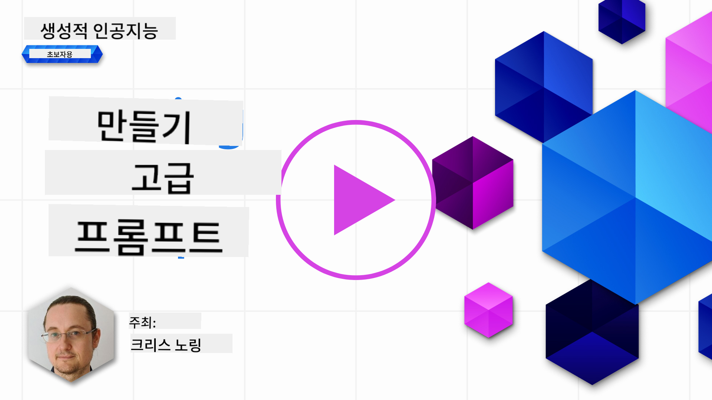

<!--
CO_OP_TRANSLATOR_METADATA:
{
  "original_hash": "b2651fb16bcfbc62b8e518751ed90fdb",
  "translation_date": "2025-10-17T23:58:41+00:00",
  "source_file": "05-advanced-prompts/README.md",
  "language_code": "ko"
}
-->
# 고급 프롬프트 생성하기

[](https://youtu.be/BAjzkaCdRok?si=NmUIyRf7-cDgbjtt)

이전 챕터에서 배운 내용을 간단히 복습해봅시다:

> 프롬프트 _엔지니어링_은 **모델이 더 관련성 높은 응답을 제공하도록 안내**하기 위해 더 유용한 지침이나 컨텍스트를 제공하는 과정입니다.

프롬프트 작성에는 두 가지 단계가 있습니다: 관련 컨텍스트를 제공하여 프롬프트를 구성하는 것과 점진적으로 프롬프트를 개선하는 _최적화_입니다.

현재 우리는 프롬프트 작성에 대한 기본적인 이해를 가지고 있지만, 더 깊이 알아볼 필요가 있습니다. 이번 챕터에서는 다양한 프롬프트를 시도하는 것에서 시작하여 어떤 프롬프트가 다른 것보다 더 나은 이유를 이해하는 단계로 나아갈 것입니다. 모든 LLM에 적용할 수 있는 몇 가지 기본 기술을 따라 프롬프트를 구성하는 방법을 배우게 됩니다.

## 소개

이번 챕터에서는 다음 주제를 다룹니다:

- 다양한 기술을 프롬프트에 적용하여 프롬프트 엔지니어링에 대한 지식을 확장합니다.
- 프롬프트를 구성하여 출력 결과를 다양화합니다.

## 학습 목표

이 강의를 완료한 후, 여러분은 다음을 할 수 있습니다:

- 프롬프트 결과를 개선하는 프롬프트 엔지니어링 기술을 적용합니다.
- 다양하거나 결정론적인 프롬프트를 수행합니다.

## 프롬프트 엔지니어링

프롬프트 엔지니어링은 원하는 결과를 생성할 프롬프트를 만드는 과정입니다. 프롬프트 엔지니어링은 단순히 텍스트 프롬프트를 작성하는 것 이상의 작업입니다. 프롬프트 엔지니어링은 공학적 학문이라기보다는 원하는 결과를 얻기 위해 적용할 수 있는 기술들의 집합입니다.

### 프롬프트의 예

다음과 같은 기본 프롬프트를 살펴봅시다:

> 지리학에 관한 질문 10개를 생성하세요.

이 프롬프트에서 실제로 다양한 프롬프트 기술을 적용하고 있습니다.

이를 분석해봅시다.

- **컨텍스트**, "지리학"에 관한 것임을 명시합니다.
- **출력 제한**, 질문을 10개로 제한합니다.

### 간단한 프롬프트의 한계

원하는 결과를 얻을 수도 있고 얻지 못할 수도 있습니다. 질문은 생성되겠지만, 지리학은 광범위한 주제이므로 다음과 같은 이유로 원하는 결과를 얻지 못할 수도 있습니다:

- **광범위한 주제**, 국가, 수도, 강 등 무엇에 관한 것인지 알 수 없습니다.
- **형식**, 질문이 특정 형식으로 작성되기를 원한다면 어떻게 해야 할까요?

이처럼 프롬프트를 생성할 때 고려해야 할 사항이 많습니다.

지금까지 간단한 프롬프트 예제를 살펴보았지만, 생성형 AI는 다양한 역할과 산업에서 사람들을 돕기 위해 훨씬 더 많은 일을 할 수 있습니다. 이제 몇 가지 기본 기술을 탐구해봅시다.

### 프롬프트 기술

먼저, 프롬프트가 LLM의 _발현적_ 특성이라는 것을 이해해야 합니다. 이는 모델에 내장된 기능이 아니라 모델을 사용하면서 발견되는 특성입니다.

LLM을 프롬프트하는 데 사용할 수 있는 몇 가지 기본 기술이 있습니다. 이를 살펴봅시다.

- **제로샷 프롬프트**, 가장 기본적인 형태의 프롬프트입니다. LLM의 학습 데이터만을 기반으로 응답을 요청하는 단일 프롬프트입니다.
- **퓨샷 프롬프트**, 이 유형의 프롬프트는 LLM이 응답을 생성할 때 의존할 수 있는 하나 이상의 예제를 제공하여 안내합니다.
- **사고의 흐름**, 이 유형의 프롬프트는 문제를 단계별로 나누는 방법을 LLM에게 알려줍니다.
- **생성된 지식**, 프롬프트의 응답을 개선하기 위해 생성된 사실이나 지식을 추가로 제공할 수 있습니다.
- **최소에서 최대**, 사고의 흐름과 유사하게, 이 기술은 문제를 일련의 단계로 나누고 이러한 단계를 순서대로 수행하도록 요청하는 것입니다.
- **자기 개선**, 이 기술은 LLM의 출력을 비판하고 개선하도록 요청하는 것입니다.
- **산파적 프롬프트**, 여기서는 LLM의 답변이 올바른지 확인하고 답변의 다양한 부분을 설명하도록 요청합니다. 이는 자기 개선의 한 형태입니다.

### 제로샷 프롬프트

이 프롬프트 스타일은 매우 간단하며 단일 프롬프트로 구성됩니다. 이 기술은 LLM에 대해 배우기 시작할 때 사용하는 가장 기본적인 방식일 것입니다. 다음은 예제입니다:

- 프롬프트: "대수학이란 무엇인가요?"
- 답변: "대수학은 수학 기호와 이 기호를 조작하는 규칙을 연구하는 수학의 한 분야입니다."

### 퓨샷 프롬프트

이 프롬프트 스타일은 요청과 함께 몇 가지 예제를 제공하여 모델을 돕습니다. 단일 프롬프트와 추가적인 작업별 데이터를 포함합니다. 다음은 예제입니다:

- 프롬프트: "셰익스피어 스타일로 시를 작성하세요. 다음은 셰익스피어 소네트의 몇 가지 예입니다:
  소네트 18: '그대를 여름날에 비유할까? 그대는 더 사랑스럽고 온화하구나...'
  소네트 116: '진정한 마음의 결합에 장애를 허락하지 않으리라. 사랑은 변화가 있을 때 변하는 것이 아니니...'
  소네트 132: '그대의 눈을 사랑하노라, 그들은 나를 불쌍히 여기며 내 마음이 고통받는 것을 알고 경멸로 나를 괴롭히는구나,...'
  이제 달의 아름다움에 대한 소네트를 작성하세요."
- 답변: "하늘 위에서 달은 부드럽게 빛나며, 은빛 빛이 그 부드러운 은혜를 드리우고,..."

예제는 LLM에게 원하는 출력의 컨텍스트, 형식 또는 스타일을 제공합니다. 이는 모델이 특정 작업을 이해하고 더 정확하고 관련성 있는 응답을 생성하는 데 도움을 줍니다.

### 사고의 흐름

사고의 흐름은 매우 흥미로운 기술로, LLM을 일련의 단계로 안내하는 것입니다. 아이디어는 LLM에게 무언가를 올바르게 수행하는 방법을 이해하도록 지시하는 것입니다. 다음 예제를 사고의 흐름을 사용하지 않은 경우와 사용한 경우로 비교해봅시다:

    - 프롬프트: "앨리스는 사과 5개를 가지고 있고, 3개를 던지고, 2개를 밥에게 주고, 밥이 하나를 돌려줍니다. 앨리스는 몇 개의 사과를 가지고 있나요?"
    - 답변: 5

LLM은 5라고 답변했지만, 이는 잘못된 답변입니다. 올바른 답은 계산에 따라 1개입니다 (5 - 3 - 2 + 1 = 1).

그렇다면 LLM에게 올바르게 계산하는 방법을 어떻게 가르칠 수 있을까요?

사고의 흐름을 시도해봅시다. 사고의 흐름을 적용한다는 것은 다음을 의미합니다:

1. LLM에게 유사한 예제를 제공합니다.
1. 계산을 보여주고 올바르게 계산하는 방법을 설명합니다.
1. 원래 프롬프트를 제공합니다.

다음과 같이 작성합니다:

- 프롬프트: "리사는 사과 7개를 가지고 있고, 1개를 던지고, 4개를 바트에게 주고, 바트가 하나를 돌려줍니다:
  7 - 1 = 6
  6 - 4 = 2
  2 + 1 = 3  
  앨리스는 사과 5개를 가지고 있고, 3개를 던지고, 2개를 밥에게 주고, 밥이 하나를 돌려줍니다. 앨리스는 몇 개의 사과를 가지고 있나요?"
  답변: 1

이처럼 더 긴 프롬프트를 작성하여 다른 예제, 계산 방법, 원래 프롬프트를 제공하면 올바른 답변인 1에 도달할 수 있습니다.

사고의 흐름은 매우 강력한 기술임을 알 수 있습니다.

### 생성된 지식

프롬프트를 구성할 때 종종 자신의 회사 데이터를 사용하고 싶을 때가 있습니다. 프롬프트의 일부는 회사 데이터에서 가져오고 나머지 부분은 관심 있는 실제 프롬프트여야 합니다.

예를 들어, 보험 업계에 있다면 프롬프트는 다음과 같이 구성될 수 있습니다:

```text
{{company}}: {{company_name}}
{{products}}:
{{products_list}}
Please suggest an insurance given the following budget and requirements:
Budget: {{budget}}
Requirements: {{requirements}}
```

위에서 볼 수 있듯이 프롬프트는 템플릿을 사용하여 구성됩니다. 템플릿에는 `{{variable}}`로 표시된 여러 변수가 있으며, 이는 회사 API에서 실제 값으로 대체됩니다.

변수가 회사의 콘텐츠로 대체된 후 프롬프트가 어떻게 보일 수 있는지 예제를 살펴봅시다:

```text
Insurance company: ACME Insurance
Insurance products (cost per month):
- Car, cheap, 500 USD
- Car, expensive, 1100 USD
- Home, cheap, 600 USD
- Home, expensive, 1200 USD
- Life, cheap, 100 USD

Please suggest an insurance given the following budget and requirements:
Budget: $1000
Requirements: Car, Home, and Life insurance
```

이 프롬프트를 LLM에 실행하면 다음과 같은 응답이 생성됩니다:

```output
Given the budget and requirements, we suggest the following insurance package from ACME Insurance:
- Car, cheap, 500 USD
- Home, cheap, 600 USD
- Life, cheap, 100 USD
Total cost: $1,200 USD
```

보시다시피, 생명 보험도 제안하고 있는데, 이는 원하지 않는 결과입니다. 이 결과는 프롬프트를 더 명확히 하여 허용할 수 있는 내용을 명확히 해야 한다는 신호입니다. 몇 번의 _시도와 오류_를 거친 후 다음과 같은 프롬프트에 도달합니다:

```text
Insurance company: ACME Insurance
Insurance products (cost per month):
- type: Car, cheap, cost: 500 USD
- type: Car, expensive, cost: 1100 USD
- type: Home, cheap, cost: 600 USD
- type: Home, expensive, cost: 1200 USD
- type: Life, cheap, cost: 100 USD

Please suggest an insurance given the following budget and requirements:
Budget: $1000 restrict choice to types: Car, Home
```

_type_과 _cost_를 추가하고 _restrict_라는 키워드를 사용하는 것이 LLM이 우리가 원하는 것을 이해하는 데 도움이 되는 것을 알 수 있습니다.

이제 다음과 같은 응답을 얻습니다:

```output
Given the budget and requirements, we suggest the Car, Cheap insurance product which costs 500 USD per month.
```

이 예제의 요점은 _생성된 지식_이라는 기본 기술을 사용하더라도 원하는 결과를 얻기 위해 대부분의 경우 프롬프트를 최적화해야 한다는 것을 보여주는 것입니다.

### 최소에서 최대

최소에서 최대 프롬프트의 아이디어는 더 큰 문제를 하위 문제로 나누는 것입니다. 이렇게 하면 LLM이 더 큰 문제를 "정복"하는 방법을 안내할 수 있습니다. 데이터 과학의 좋은 예는 다음과 같습니다:

> 프롬프트: 데이터 과학을 5단계로 수행하는 방법은?

AI 어시스턴트가 다음과 같이 답변합니다:

1. 데이터 수집
1. 데이터 정리
1. 데이터 분석
1. 데이터 시각화
1. 데이터 발표

### 자기 개선, 결과 비판하기

생성형 AI와 LLM의 출력은 신뢰할 수 없습니다. 반드시 검증해야 합니다. 결국, LLM은 올바른 것을 제시하는 것이 아니라 다음에 가장 적합한 말을 제시하는 것입니다. 따라서 LLM에게 스스로를 비판하도록 요청하는 것이 좋은 아이디어이며, 이것이 자기 개선 기술로 이어집니다.

작동 방식은 다음 단계로 이루어집니다:

1. LLM에게 문제를 해결하도록 요청하는 초기 프롬프트
1. LLM의 응답
1. 응답을 비판하고 AI에게 개선을 요청
1. LLM이 비판을 고려하여 다시 응답하고 제안한 솔루션을 제시

이 과정을 원하는 만큼 반복할 수 있습니다.

다음은 이 기술을 사용하는 예제입니다:

> 프롬프트: "제품과 고객 경로를 가진 Python 웹 API를 생성하세요"

AI 응답:

```python
import flask
app = Flask(__name__)

@app.route('/products')
def products():
    return 'Products'

@app.route('/customers')
def customers():
    return 'Customers'
```

> 프롬프트: 위 코드의 개선 사항 3가지를 제안하세요

AI 응답:

```text
Sure, here are three suggestions to improve the code:

Import the correct module: The first line should import Flask instead of flask. The correct import statement should be from flask import Flask.

Add a main function: Add a if __name__ == '__main__': block to the end of the file to run the application when the file is executed.

Use f-strings: Use f-strings to format the return statements in the route functions. For example, return 'Products' can be changed to return f'This is the {request.path} page'.
```

```python
from flask import Flask, request

app = Flask(__name__)

@app.route('/products')
def products():
    return f'This is the {request.path} page'

@app.route('/customers')
def customers():
    return f'This is the {request.path} page'

if __name__ == '__main__':
    app.run()
```

위의 AI 응답은 첫 번째 제안된 코드를 비판하여 개선된 결과를 보여줍니다.

### 산파적 프롬프트

산파적 프롬프트는 자기 개선과 유사하지만, LLM에게 스스로를 설명하도록 요청하는 데 더 중점을 둡니다. 목표는 LLM의 출력에서 일관성을 줄여 올바른 답변에 도달하도록 하는 것입니다. 따라야 할 워크플로는 다음과 같습니다:

1. LLM에게 질문에 답변하도록 요청합니다.
1. 답변의 각 부분에 대해 LLM에게 더 깊이 설명하도록 요청합니다.
1. 일관성이 없는 부분이 있다면, 일관성이 없는 부분을 버립니다.

2와 3을 반복하여 모든 부분을 검토하고 답변에 만족할 때까지 진행합니다.

다음은 예제 프롬프트입니다:

> 프롬프트: 팬데믹을 완화하기 위한 위기 계획을 5단계로 작성하는 방법은?
> LLM 응답:

```text
1. Identify the risks
1. Identify the stakeholders
1. Identify the resources
1. Identify the actions
1. Identify the communication channels
```

5단계를 식별했지만, 이것이 올바른지 확인할 수 있을까요? LLM에게 각 단계를 더 자세히 설명하도록 요청해봅시다:

> 프롬프트: 첫 번째 단계를 더 자세히 설명해주세요. 팬데믹의 위험은 무엇인가요?

```text
The risks are the following:

- Loss of life
- Loss of business
- Loss of reputation
- Loss of customers
- Loss of employees
```

이 시점에서 LLM이 올바른지 확인하고 싶다면 첫 번째 위험을 더 자세히 설명하도록 요청하고 위의 응답과 일치하는지 확인합니다:

> 프롬프트: 팬데믹에서 가장 큰 위험은 무엇이며 그 이유는 무엇인가요?

```text
The biggest risk is loss of life because it's the most important thing to protect.
```

> 팬데믹에서 가장 큰 두 가지 위험은 무엇인가요?

```text
The two biggest risks are loss of life and loss of business.
```

이 시점에서 LLM은 일관성을 유지하며 "생명"과 "비즈니스"를 가장 큰 두 가지 위험으로 언급합니다. 이제 다음 단계로 진행할 수 있으며 비교적 확신을 가질 수 있습니다. 그러나 LLM을 맹목적으로 신뢰해서는 안 되며, 항상 출력을 검증해야 합니다.

## 출력 다양화

LLM은 본질적으로 비결정론적이므로 동일한 프롬프트를 실행할 때마다 다른 결과를 얻을 수 있습니다. 다음 프롬프트를 시도해보세요:

> "Python 웹 API 코드를 생성하세요"

```python
# Import necessary modules
import flask
from flask import request, jsonify

# Create a Flask app
app = flask.Flask(__name__)

# Create a route for the API
@app.route('/api', methods=['GET'])
def api():
    # Get the data from the request
    data = request.args

    # Process the data
    result = process_data(data)

    # Return the result as JSON
    return jsonify(result)

# Function to process the data
def process_data(data):
    # Do something with the data
    result = data + 1

    # Return the result
    return result

# Run the app
if __name__ == '__main__':
    app.run()

```

동일한 프롬프트를 다시 실행하면 약간 다른 응답이 생성됩니다:

```python
#import necessary packages
import flask
from flask import request, jsonify

#create the Flask application
app = flask.Flask(__name__)
app.config["DEBUG"] = True

#create a list of books
books = [
    {'id': 0,
     'title': 'A Fire Upon the Deep',
     'author': 'Vernor Vinge',
     'first_sentence': 'The coldsleep itself was dreamless.',
     'year_published': '1992'},
    {'id': 1,
     'title': 'The Ones Who Walk Away From Omelas',
     'author': 'Ursula K. Le Guin',
     'first_sentence': 'With a clamor of bells that set the swallows soaring, the Festival of Summer came to the city Omelas, bright-towered by the sea.',
     'published': '1973'},
    {'id': 2,
     'title': 'Dhalgren',
     'author': 'Samuel R. Delany',
     'first_sentence': 'to wound the autumnal city.',
     'published': '1975'}
]

#create an endpoint for the API
@app.route('/', methods=['GET'])
def home():
    return '''<h1>Books API</h1>
<p>A prototype API for retrieving books.</p>'''

#create an endpoint to return all books
@app.route('/api/v1/resources/books/all', methods=['GET'])
def api_all():
    return jsonify(books)

#create an endpoint to return a single book
@app.route('/api/v1/resources/books', methods=['GET'])
def api_id():
    #check if an ID was provided as part of the URL
    #if ID is provided, assign it to a variable
    #if no ID is provided, display an error
    if 'id' in request.args:
        id = int(request.args['id'])
    else:
        return "Error: No id field provided. Please specify an id."

    #create an empty list for our results
    results = []

    #loop through the data and match results that fit the requested ID
    #IDs are unique, but other fields might return many results
    for book in books:
        if book['id'] == id:
            results.append(book)

    #use the jsonify function from Flask to convert our list of
    #Python dictionaries to the JSON format
    return jsonify(results)

app.run()
```

> 그렇다면 출력의 다양성이 문제일까요?

여러분이 무엇을 하려고 하는지에 따라 다릅니다. 특정한 응답을 원한다면 문제일 수 있습니다. 하지만 "지리학에 관한 질문 3개를 생성하세요"와 같이 다양한 출력을 원한다면 문제가 되지 않습니다.

### 출력 다양화를 위한 온도 사용

좋습니다, 이제 출력을 더 예측 가능하게 제한하고 싶습니다, 즉 더 결정론적으로 만들고 싶습니다. 어떻게 해야 할까요?

온도는 0에서 1 사이의 값으로, 0은 가장 결정론적이고 1은 가장 다양합니다. 기본값은 0.7입니다. 온도를 0.1로 설정한 동일한 프롬프트를 두 번 실행했을 때 어떤 일이 발생하는지 살펴봅시다:

> "Python 웹 API 코드를 생성하세요"

```python
#import necessary libraries
import flask
from flask import request, jsonify

#create an instance of the Flask class
app = flask.Flask(__name__)

#create an endpoint for the API
@app.route('/api/v1/endpoint', methods=['GET'])
def api_endpoint():
    #get the request data
    data = request.get_json()

    #process the data
    result = process_data(data)

    #return the result
    return jsonify(result)

#function to process the data
def process_data(data):
    #process the data
    result = {'result': 'success'}

    #return the result
    return result

#run the Flask app
if __name__ == '__main__':
    app.run()

```

프롬프트를 다시 실행하면 다음 결과가 나옵니다:

```python
#import necessary libraries
import flask
from flask import request, jsonify

#create a Flask app
app = flask.Flask(__name__)

#create a route for the API
@app.route('/api', methods=['GET'])
def api_call():
    #get the data from the request
    data = request.get_json()

    #process the data
    result = process_data(data)

    #return the result
    return jsonify(result)

#define the process_data function
def process_data(data):
    #do something with the data
    result = data + 1

    #return the result
    return result

#run the app
if __name__ == '__main__':
    app.run()

```

이 두 출력 간의 차이는 거의 없습니다. 이번에는 반대로 온도를 0.9로 설정해봅시다:

```python
# Import necessary libraries
import flask
from flask import request, jsonify

# Create a Flask app
app = flask.Flask(__name__)

# Create a route for the API
@app.route('/api', methods=['GET'])
def api_call():
    # Get the data from the request
    data = request.args

    # Process the data
    result = process_data(data)

    # Return the result
    return jsonify(result)

# Function to process the data
def process_data(data):
    # Do something with the data
    result = data + 1

    # Return the result
    return result

# Run the app
if __name__ == '__main__':
    app.run()

```

온도 값을 0.9로 설정한 두 번째 시도:

```python
import flask
from flask import request, jsonify

# create the Flask app
app = flask.Flask(__name__)
app.config['DEBUG'] = True

# create some test data
books = [
    {'id': 0, 'title': 'A Fire Upon The Deep', 'author': 'Vernor Vinge', 'first_sentence': 'The coldsleep itself was dreamless.', 'year_published': '1992'},
    {'id': 1, 'title': 'The Ones Who Walk Away From Omelas', 'author': 'Ursula K. Le Guin', 'first_sentence': 'With a clamor of bells that set the swallows soaring, the Festival of Summer came to the city Omelas, bright-towered by the sea.', 'published': '1973'},
    {'id': 2, 'title': 'Dhalgren', 'author': 'Samuel R. Delany', 'first_sentence': 'to wound the autumnal city.', 'published': '1975'}
]

# create an endpoint
@app.route('/', methods=['GET'])
def home():
    return '''<h1>Welcome to our book API!</h1>'''

@app.route('/api/v1/resources/books

```

보시다시피, 결과는 매우 다양할 수 있습니다.

> 참고로, 출력 결과를 다양화하기 위해 변경할 수 있는 더 많은 매개변수들이 있습니다. 예를 들어, top-k, top-p, 반복 패널티, 길이 패널티, 다양성 패널티 등이 있지만, 이는 이 커리큘럼의 범위를 벗어납니다.

## 좋은 실천 방법

원하는 결과를 얻기 위해 적용할 수 있는 많은 실천 방법들이 있습니다. 프롬프트를 점점 더 많이 사용하면서 자신만의 스타일을 찾게 될 것입니다.

우리가 다룬 기술 외에도 LLM을 프롬프트할 때 고려해야 할 몇 가지 좋은 실천 방법이 있습니다.

다음은 고려해야 할 좋은 실천 방법들입니다:

- **컨텍스트를 명확히 하세요**. 컨텍스트는 중요합니다. 도메인, 주제 등 가능한 한 많이 명확히 할수록 더 좋습니다.
- 출력 제한. 특정 항목 수나 특정 길이를 원한다면 이를 명시하세요.
- **무엇과 어떻게를 명확히 하세요**. 원하는 것과 원하는 방식 모두를 언급하는 것을 기억하세요. 예를 들어, "제품과 고객 경로를 가진 Python 웹 API를 생성하고, 이를 3개의 파일로 나누세요."
- **템플릿을 사용하세요**. 종종 회사의 데이터를 사용하여 프롬프트를 풍부하게 만들고 싶을 것입니다. 이를 위해 템플릿을 사용하세요. 템플릿에는 실제 데이터로 대체할 수 있는 변수가 포함될 수 있습니다.
- **올바르게 철자하세요**. LLM이 올바른 응답을 제공할 수 있지만, 올바르게 철자하면 더 나은 응답을 받을 수 있습니다.

## 과제

다음은 Flask를 사용하여 간단한 API를 구축하는 방법을 보여주는 Python 코드입니다:

```python
from flask import Flask, request

app = Flask(__name__)

@app.route('/')
def hello():
    name = request.args.get('name', 'World')
    return f'Hello, {name}!'

if __name__ == '__main__':
    app.run()
```

GitHub Copilot 또는 ChatGPT와 같은 AI 도우미를 사용하여 "self-refine" 기술을 적용하여 코드를 개선하세요.

## 해결 방법

코드에 적합한 프롬프트를 추가하여 과제를 해결해 보세요.

> [!TIP]
> 개선을 요청하는 프롬프트를 작성하세요. 개선 사항의 수를 제한하는 것도 좋은 방법입니다. 또한 아키텍처, 성능, 보안 등 특정 방식으로 개선을 요청할 수도 있습니다.

[해결 방법](../../../05-advanced-prompts/python/aoai-solution.py)

## 지식 점검

왜 chain-of-thought 프롬프트를 사용할까요? 올바른 응답 1개와 잘못된 응답 2개를 보여주세요.

1. LLM에게 문제를 해결하는 방법을 가르치기 위해.
1. B, LLM에게 코드의 오류를 찾는 방법을 가르치기 위해.
1. C, LLM에게 다양한 해결책을 제시하도록 지시하기 위해.

A: 1번, 왜냐하면 chain-of-thought는 LLM에게 일련의 단계와 유사한 문제 및 해결 방법을 제공하여 문제를 해결하는 방법을 보여주는 것이기 때문입니다.

## 🚀 도전 과제

과제에서 self-refine 기술을 방금 사용했습니다. 자신이 만든 프로그램 중 하나를 선택하고 적용하고 싶은 개선 사항을 고려해 보세요. 이제 self-refine 기술을 사용하여 제안된 변경 사항을 적용하세요. 결과가 더 나아졌다고 생각하나요, 아니면 더 나빠졌나요?

## 훌륭한 작업! 학습을 계속하세요

이 강의를 완료한 후, [Generative AI Learning collection](https://aka.ms/genai-collection?WT.mc_id=academic-105485-koreyst)을 확인하여 생성형 AI 지식을 계속 향상시키세요!

Lesson 6으로 이동하여 [텍스트 생성 앱을 구축](../06-text-generation-apps/README.md?WT.mc_id=academic-105485-koreyst)하며 프롬프트 엔지니어링 지식을 적용해 봅시다!

---

**면책 조항**:  
이 문서는 AI 번역 서비스 [Co-op Translator](https://github.com/Azure/co-op-translator)를 사용하여 번역되었습니다. 정확성을 위해 최선을 다하고 있지만, 자동 번역에는 오류나 부정확성이 포함될 수 있습니다. 원본 문서의 원어 버전을 권위 있는 출처로 간주해야 합니다. 중요한 정보의 경우, 전문적인 인간 번역을 권장합니다. 이 번역 사용으로 인해 발생하는 오해나 잘못된 해석에 대해 책임을 지지 않습니다.