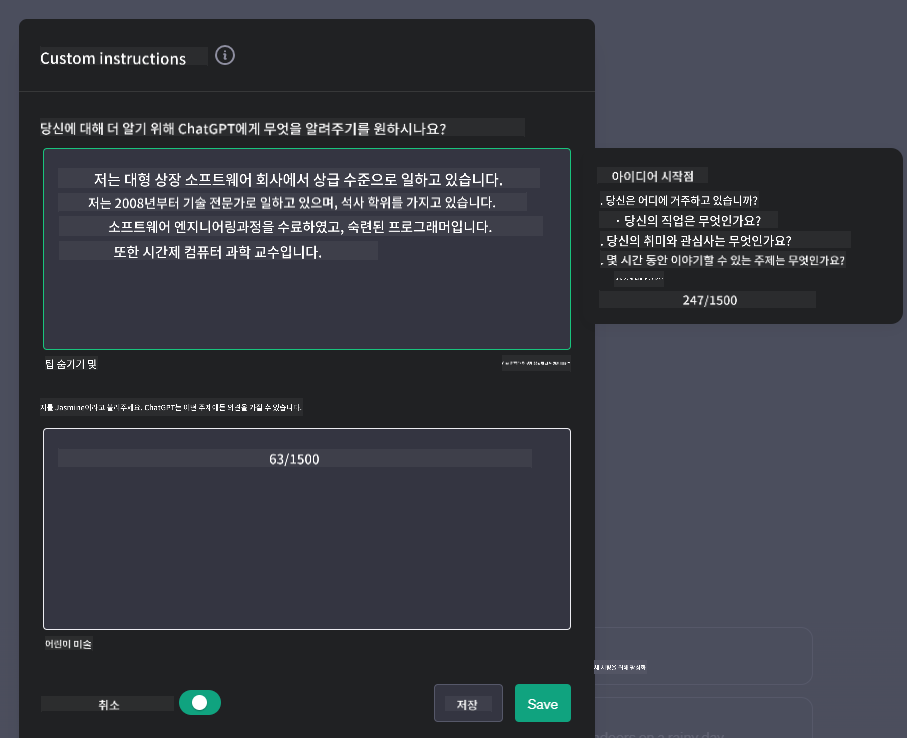
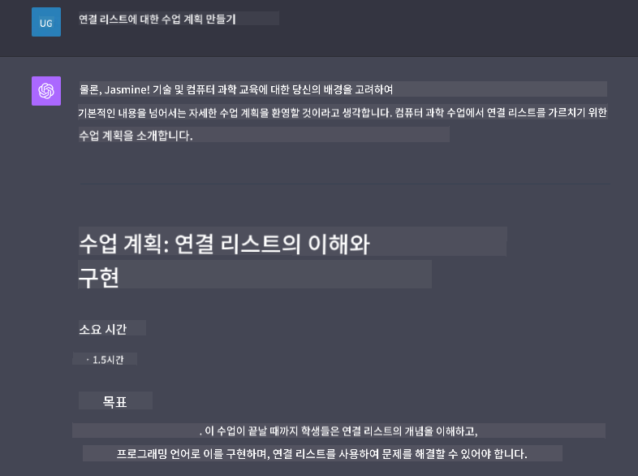

<!--
CO_OP_TRANSLATOR_METADATA:
{
  "original_hash": "ea4bbe640847aafbbba14dae4625e9af",
  "translation_date": "2025-07-09T12:20:56+00:00",
  "source_file": "07-building-chat-applications/README.md",
  "language_code": "ko"
}
-->
# 생성 AI 기반 채팅 애플리케이션 구축

[](https://aka.ms/gen-ai-lessons7-gh?WT.mc_id=academic-105485-koreyst)

> _(위 이미지를 클릭하면 이 강의의 영상을 볼 수 있습니다)_

텍스트 생성 앱을 만드는 방법을 살펴봤으니, 이제 채팅 애플리케이션에 대해 알아보겠습니다.

채팅 애플리케이션은 단순한 일상 대화 수단을 넘어 우리의 삶에 깊숙이 자리 잡았습니다. 고객 서비스, 기술 지원, 그리고 고도화된 자문 시스템의 핵심 요소로 활용되고 있죠. 아마 최근에 채팅 애플리케이션을 통해 도움을 받은 경험이 있을 겁니다. 생성 AI와 같은 첨단 기술이 이 플랫폼에 통합되면서, 시스템은 더욱 복잡해지고 도전 과제도 늘어나고 있습니다.

우리가 답을 찾아야 할 몇 가지 질문은 다음과 같습니다:

- **애플리케이션 구축**: 특정 용도에 맞는 AI 기반 애플리케이션을 어떻게 효율적으로 구축하고 원활하게 통합할 수 있을까?
- **모니터링**: 배포 후, 기능적 완성도와 [책임 있는 AI의 6대 원칙](https://www.microsoft.com/ai/responsible-ai?WT.mc_id=academic-105485-koreyst)을 준수하는지 어떻게 지속적으로 감시할 수 있을까?

자동화와 인간-기계 간 원활한 상호작용이 중심이 되는 시대에 접어들면서, 생성 AI가 채팅 애플리케이션의 범위, 깊이, 적응성을 어떻게 변화시키는지 이해하는 것이 필수적입니다. 이번 강의에서는 이러한 복잡한 시스템을 지원하는 아키텍처 측면을 살펴보고, 도메인별 작업에 맞게 미세 조정하는 방법론을 탐구하며, 책임 있는 AI 배포를 위한 지표와 고려사항을 평가할 것입니다.

## 소개

이번 강의에서는 다음 내용을 다룹니다:

- 채팅 애플리케이션을 효율적으로 구축하고 통합하는 기법
- 애플리케이션에 맞춤화 및 미세 조정 적용 방법
- 채팅 애플리케이션을 효과적으로 모니터링하기 위한 전략과 고려사항

## 학습 목표

이 강의를 마치면 다음을 할 수 있습니다:

- 채팅 애플리케이션을 기존 시스템에 구축하고 통합할 때 고려해야 할 사항 설명
- 특정 용도에 맞게 채팅 애플리케이션을 맞춤화
- AI 기반 채팅 애플리케이션의 품질을 효과적으로 모니터링하고 유지하기 위한 주요 지표와 고려사항 파악
- 채팅 애플리케이션이 책임감 있게 AI를 활용하도록 보장

## 생성 AI를 채팅 애플리케이션에 통합하기

생성 AI를 통해 채팅 애플리케이션을 향상시키는 것은 단순히 더 똑똑하게 만드는 것에 그치지 않습니다. 아키텍처, 성능, 사용자 인터페이스를 최적화하여 고품질 사용자 경험을 제공하는 데 중점을 둡니다. 이를 위해 아키텍처 기반, API 통합, 사용자 인터페이스 고려사항을 살펴봅니다. 이 섹션은 기존 시스템에 통합하든 독립형 플랫폼으로 구축하든 복잡한 환경을 효과적으로 탐색할 수 있는 종합적인 로드맵을 제공합니다.

이 섹션을 마치면 채팅 애플리케이션을 효율적으로 구축하고 통합하는 데 필요한 전문 지식을 갖추게 됩니다.

### 챗봇과 채팅 애플리케이션의 차이

채팅 애플리케이션 구축에 앞서, ‘챗봇’과 ‘AI 기반 채팅 애플리케이션’의 차이를 비교해 보겠습니다. 두 개념은 역할과 기능에서 차이가 있습니다. 챗봇은 주로 자주 묻는 질문에 답하거나 배송 추적과 같은 특정 대화 작업을 자동화하는 데 목적이 있습니다. 보통 규칙 기반 로직이나 복잡한 AI 알고리즘으로 작동하죠. 반면, AI 기반 채팅 애플리케이션은 텍스트, 음성, 영상 채팅 등 다양한 디지털 커뮤니케이션을 지원하는 훨씬 더 광범위한 환경입니다. 생성 AI 모델을 통합해 다양한 입력과 맥락을 바탕으로 인간과 유사한 대화를 시뮬레이션하며, 개방형 주제 토론, 대화 맥락 적응, 창의적이고 복잡한 대화 생성이 가능합니다.

아래 표는 두 개념의 주요 차이점과 공통점을 정리해 디지털 커뮤니케이션에서 각자의 역할을 이해하는 데 도움을 줍니다.

| 챗봇                                   | 생성 AI 기반 채팅 애플리케이션                  |
| ------------------------------------- | ---------------------------------------------- |
| 작업 중심, 규칙 기반                   | 맥락 인지 가능                                 |
| 종종 더 큰 시스템에 통합됨             | 하나 또는 여러 챗봇을 호스팅할 수 있음          |
| 프로그래밍된 기능에 한정됨             | 생성 AI 모델 통합                              |
| 전문적이고 구조화된 상호작용           | 개방형 주제 토론 가능                           |

### SDK와 API를 활용한 기성 기능 활용

채팅 애플리케이션을 구축할 때, 이미 존재하는 기능을 평가하는 것이 좋은 출발점입니다. SDK와 API를 활용해 채팅 애플리케이션을 만드는 것은 여러 면에서 유리한 전략입니다. 잘 문서화된 SDK와 API를 통합하면 확장성과 유지보수 문제를 해결하며 장기적인 성공을 도모할 수 있습니다.

- **개발 속도 향상 및 부담 감소**: 직접 기능을 개발하는 비용과 시간을 줄이고, 비즈니스 로직 등 더 중요한 부분에 집중할 수 있습니다.
- **더 나은 성능**: 직접 구축할 경우 “이 시스템은 얼마나 확장 가능한가? 갑작스러운 사용자 증가를 감당할 수 있나?”라는 질문이 생기는데, 잘 관리되는 SDK와 API는 이런 문제에 대한 내장 솔루션을 제공합니다.
- **유지보수 용이**: 대부분의 API와 SDK는 새 버전이 나오면 라이브러리 업데이트만으로 개선 사항을 적용할 수 있어 관리가 쉽습니다.
- **최신 기술 활용**: 광범위한 데이터셋으로 미세 조정되고 훈련된 모델을 활용해 자연어 처리 능력을 애플리케이션에 제공합니다.

SDK나 API 기능을 사용하려면 보통 고유 키나 인증 토큰을 통해 서비스 사용 권한을 얻어야 합니다. OpenAI Python 라이브러리를 사용해 이를 살펴보겠습니다. 직접 체험해보고 싶다면 이번 강의의 [OpenAI 노트북](../../../07-building-chat-applications/python/oai-assignment.ipynb)이나 [Azure OpenAI 서비스 노트북](../../../07-building-chat-applications/python/aoai-assignment.ipynb)을 참고하세요.

```python
import os
from openai import OpenAI

API_KEY = os.getenv("OPENAI_API_KEY","")

client = OpenAI(
    api_key=API_KEY
    )

chat_completion = client.chat.completions.create(model="gpt-3.5-turbo", messages=[{"role": "user", "content": "Suggest two titles for an instructional lesson on chat applications for generative AI."}])
```

위 예제는 GPT-3.5 Turbo 모델을 사용해 프롬프트를 완성하지만, API 키가 설정되어 있어야 합니다. 키를 설정하지 않으면 오류가 발생합니다.

## 사용자 경험 (UX)

일반적인 UX 원칙은 채팅 애플리케이션에도 적용되지만, 머신러닝 요소가 포함되면서 특히 중요한 추가 고려사항이 있습니다.

- **모호성 해결 메커니즘**: 생성 AI 모델은 때때로 애매한 답변을 내놓을 수 있습니다. 사용자가 명확한 답변을 요청할 수 있는 기능이 있으면 도움이 됩니다.
- **맥락 유지**: 고급 생성 AI 모델은 대화 내 맥락을 기억할 수 있어 사용자 경험에 큰 도움이 됩니다. 사용자가 맥락을 제어하고 관리할 수 있게 하면 경험이 향상되지만, 민감한 정보가 저장될 위험도 있습니다. 정보 저장 기간에 대한 정책을 도입하는 등 개인정보 보호와 맥락 유지의 균형을 고려해야 합니다.
- **개인화**: AI 모델이 학습하고 적응하는 능력을 활용해 사용자별 맞춤 경험을 제공합니다. 사용자 프로필 같은 기능을 통해 사용자가 이해받는 느낌을 주고, 원하는 답변을 더 쉽게 찾을 수 있어 효율적이고 만족스러운 상호작용이 가능합니다.

개인화의 한 예로 OpenAI ChatGPT의 "Custom instructions" 설정이 있습니다. 사용자가 자신의 정보를 입력해 프롬프트에 중요한 맥락을 제공할 수 있습니다. 아래는 맞춤 지시 예시입니다.



이 “프로필”은 ChatGPT가 연결 리스트에 관한 수업 계획을 작성하도록 유도합니다. 사용자의 경험을 고려해 더 심도 있는 수업 계획을 요청하는 점을 확인할 수 있습니다.



### 대형 언어 모델을 위한 Microsoft의 시스템 메시지 프레임워크

[Microsoft는 LLM에서 응답을 생성할 때 효과적인 시스템 메시지 작성법](https://learn.microsoft.com/azure/ai-services/openai/concepts/system-message#define-the-models-output-format?WT.mc_id=academic-105485-koreyst)을 4가지 영역으로 나누어 안내합니다:

1. 모델의 대상, 기능 및 한계 정의
2. 모델 출력 형식 정의
3. 모델의 의도된 동작을 보여주는 구체적인 예시 제공
4. 추가적인 행동 가이드라인 제공

### 접근성

시각, 청각, 운동, 인지 장애가 있는 사용자도 모두 사용할 수 있도록 잘 설계된 채팅 애플리케이션이어야 합니다. 다음은 다양한 장애 유형별 접근성 향상을 위한 기능 목록입니다.

- **시각 장애용 기능**: 고대비 테마, 크기 조절 가능한 텍스트, 화면 읽기 지원
- **청각 장애용 기능**: 텍스트-음성, 음성-텍스트 변환 기능, 오디오 알림에 대한 시각적 신호
- **운동 장애용 기능**: 키보드 내비게이션 지원, 음성 명령
- **인지 장애용 기능**: 단순화된 언어 옵션

## 도메인 특화 언어 모델을 위한 맞춤화 및 미세 조정

회사 내부 용어를 이해하고 사용자들이 자주 묻는 질문을 예상하는 채팅 애플리케이션을 상상해 보세요. 다음과 같은 접근법이 있습니다:

- **도메인 특화 언어 모델(DSL) 활용**: 특정 도메인에 맞춰 훈련된 DSL 모델을 활용해 해당 분야의 개념과 시나리오를 이해하도록 합니다.
- **미세 조정 적용**: 특정 데이터로 모델을 추가 훈련하는 과정입니다.

## 맞춤화: DSL 사용하기

도메인 특화 언어 모델(DSL 모델)을 활용하면 전문적이고 맥락에 맞는 상호작용을 제공해 사용자 참여도를 높일 수 있습니다. DSL 모델은 특정 분야, 산업, 주제에 관련된 텍스트를 이해하고 생성하도록 훈련되거나 미세 조정된 모델입니다. DSL 모델 사용 방법은 처음부터 직접 훈련하는 것부터 SDK와 API를 통해 기존 모델을 활용하는 것까지 다양합니다. 또 다른 방법은 기존 사전 훈련 모델을 특정 도메인에 맞게 미세 조정하는 것입니다.

## 맞춤화: 미세 조정 적용하기

미세 조정은 사전 훈련된 모델이 특정 도메인이나 작업에서 부족할 때 고려됩니다.

예를 들어, 의료 분야의 질문은 복잡하고 많은 맥락이 필요합니다. 의료진이 환자를 진단할 때는 생활 습관, 기존 질환, 최신 의학 논문 등 다양한 요소를 참고합니다. 이런 세밀한 상황에서 일반 목적 AI 채팅 애플리케이션은 신뢰할 수 있는 정보원이 되기 어렵습니다.

### 시나리오: 의료 애플리케이션

의료진이 치료 지침, 약물 상호작용, 최신 연구 결과를 빠르게 참고할 수 있도록 돕는 채팅 애플리케이션을 생각해 보세요.

일반 목적 모델은 기본적인 의료 질문이나 일반적인 조언에는 적합할 수 있지만, 다음과 같은 경우에는 한계가 있습니다:

- **매우 구체적이거나 복잡한 사례**: 예를 들어, 신경과 전문의가 “소아 환자의 약물 내성 간질 관리 최신 권고사항은 무엇인가요?”라고 묻는 경우
- **최신 의학 발전 반영 부족**: 일반 모델은 신경학과 약리학의 최신 연구 결과를 반영한 답변을 제공하기 어려울 수 있습니다.

이런 경우, 전문 의료 데이터셋으로 모델을 미세 조정하면 복잡한 의료 질문에 대해 더 정확하고 신뢰성 있는 답변을 제공할 수 있습니다. 이를 위해서는 도메인별 과제와 질문을 대표하는 방대한 관련 데이터셋이 필요합니다.

## 고품질 AI 기반 채팅 경험을 위한 고려사항

이 섹션에서는 “고품질” 채팅 애플리케이션의 기준을 설명하며, 실행 가능한 지표 수집과 책임감 있는 AI 활용 프레임워크 준수를 포함합니다.

### 주요 지표

애플리케이션의 고품질 성능을 유지하려면 주요 지표와 고려사항을 지속적으로 추적하는 것이 필수적입니다. 이 지표들은 애플리케이션의 기능뿐 아니라 AI 모델과 사용자 경험의 품질을 평가하는 데 도움을 줍니다. 아래는 기본, AI, 사용자 경험 지표를 포함한 목록입니다.

| 지표                          | 정의                                                                                                               | 채팅 개발자를 위한 고려사항                                         |
| ----------------------------- | ------------------------------------------------------------------------------------------------------------------ | ----------------------------------------------------------------- |
| **가동 시간(Uptime)**          | 애플리케이션이 정상 작동하며 사용자에게 접근 가능한 시간을 측정                                                  | 다운타임을 어떻게 최소화할 것인가?                               |
| **응답 시간(Response Time)**  | 사용자의 질의에 애플리케이션이 답변을 제공하는 데 걸리는 시간                                                    | 쿼리 처리 속도를 어떻게 최적화할 것인가?                         |
| **정밀도(Precision)**          | 실제 양성 중에서 모델이 양성으로 정확히 예측한 비율                                                               | 모델의 정밀도를 어떻게 검증할 것인가?                             |
| **재현율(Recall, 민감도)**    | 실제 양성 중에서 모델이 양성으로 예측한 비율                                                                       | 재현율을 어떻게 측정하고 개선할 것인가?                           |
| **F1 점수(F1 Score)**          | 정밀도와 재현율의 조화 평균으로 두 지표 간 균형을 평가                                                             | 목표 F1 점수는 얼마이며, 정밀도와 재현율을 어떻게 균형 맞출 것인가? |
| **혼란도(Perplexity)**         | 모델이 예측한 확률 분포가 실제 데이터 분포와 얼마나 일치하는지 측정                                               | 혼란도를 어떻게 최소화할 것인가?                                 |
| **사용자 만족도 지표**         | 설문조사 등을 통해 사용자가 애플리케이션에 대해 느끼는 만족도를 측정                                              | 사용자 피드백을 얼마나 자주 수집하고, 어떻게 반영할 것인가?       |
| **오류율(Error Rate)**          | 모델이 이해하거나 출력하는 데 실수하는 비율                                                                        | 오류율을 줄이기 위한 전략은 무엇인가?                             |
| **재학습 주기(Retraining Cycles)** | 새로운 데이터와 인사이트를 반영해 모델을 업데이트하는 빈도                                                        | 재학습은 얼마나 자주 진행하며, 어떤 상황에서 재학습을 시작할 것인가? |
| **이상 탐지**               | 예상되는 행동과 일치하지 않는 비정상적인 패턴을 식별하기 위한 도구와 기법입니다.                          | 이상 현상에 어떻게 대응할 것인가요?                                         |

### 채팅 애플리케이션에서 책임 있는 AI 실천 방안 구현하기

Microsoft의 책임 있는 AI 접근법은 AI 개발과 사용을 이끌어야 할 여섯 가지 원칙을 제시합니다. 아래는 각 원칙의 정의와 채팅 개발자가 고려해야 할 사항, 그리고 왜 이를 진지하게 받아들여야 하는지에 대한 설명입니다.

| 원칙                   | Microsoft의 정의                                      | 채팅 개발자가 고려할 점                                              | 중요한 이유                                                                        |
| ---------------------- | ----------------------------------------------------- | ------------------------------------------------------------------- | --------------------------------------------------------------------------------- |
| 공정성                 | AI 시스템은 모든 사람을 공정하게 대우해야 합니다.      | 채팅 애플리케이션이 사용자 데이터에 따라 차별하지 않도록 해야 합니다. | 사용자 간 신뢰와 포용성을 구축하고 법적 문제를 예방하기 위해서입니다.             |
| 신뢰성 및 안전성       | AI 시스템은 신뢰할 수 있고 안전하게 작동해야 합니다.    | 오류와 위험을 최소화하기 위해 테스트와 안전장치를 구현해야 합니다.   | 사용자 만족도를 보장하고 잠재적 피해를 방지하기 위해서입니다.                     |
| 개인정보 보호 및 보안  | AI 시스템은 안전해야 하며 개인정보를 존중해야 합니다.  | 강력한 암호화와 데이터 보호 조치를 적용해야 합니다.                 | 민감한 사용자 데이터를 보호하고 개인정보 보호법을 준수하기 위해서입니다.         |
| 포용성                 | AI 시스템은 모두에게 힘을 실어주고 참여를 유도해야 합니다. | 다양한 사용자가 쉽게 접근하고 사용할 수 있는 UI/UX를 설계해야 합니다. | 더 많은 사람들이 애플리케이션을 효과적으로 사용할 수 있도록 하기 위해서입니다.   |
| 투명성                 | AI 시스템은 이해하기 쉬워야 합니다.                    | AI 응답에 대한 명확한 문서화와 근거를 제공해야 합니다.               | 사용자가 의사결정 과정을 이해할 수 있어야 시스템을 더 신뢰할 수 있기 때문입니다.   |
| 책임성                 | AI 시스템에 대해 사람들은 책임을 져야 합니다.          | AI 결정에 대한 감사 및 개선 절차를 명확히 수립해야 합니다.           | 실수 발생 시 지속적인 개선과 시정 조치를 가능하게 하기 위해서입니다.             |

## 과제

[assignment](../../../07-building-chat-applications/python)를 확인하세요. 첫 채팅 프롬프트 실행부터 텍스트 분류 및 요약 등 다양한 연습 문제를 단계별로 안내합니다. 과제는 여러 프로그래밍 언어로 제공된다는 점도 참고하세요!

## 훌륭합니다! 여정을 계속하세요

이 수업을 마친 후에는 [Generative AI Learning collection](https://aka.ms/genai-collection?WT.mc_id=academic-105485-koreyst)을 방문해 생성 AI 지식을 더욱 심화해 보세요!

Lesson 8에서 [검색 애플리케이션 구축 시작하기](../08-building-search-applications/README.md?WT.mc_id=academic-105485-koreyst)를 확인할 수 있습니다!

**면책 조항**:  
이 문서는 AI 번역 서비스 [Co-op Translator](https://github.com/Azure/co-op-translator)를 사용하여 번역되었습니다. 정확성을 위해 노력하고 있으나, 자동 번역에는 오류나 부정확한 부분이 있을 수 있음을 유의하시기 바랍니다. 원문은 해당 언어의 원본 문서가 권위 있는 출처로 간주되어야 합니다. 중요한 정보의 경우 전문적인 인간 번역을 권장합니다. 본 번역의 사용으로 인해 발생하는 오해나 잘못된 해석에 대해 당사는 책임을 지지 않습니다.