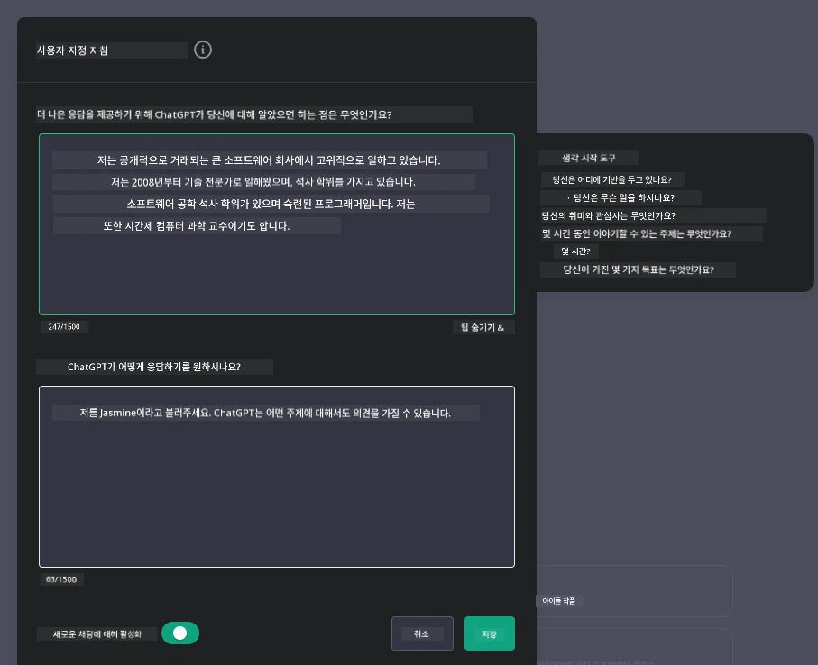
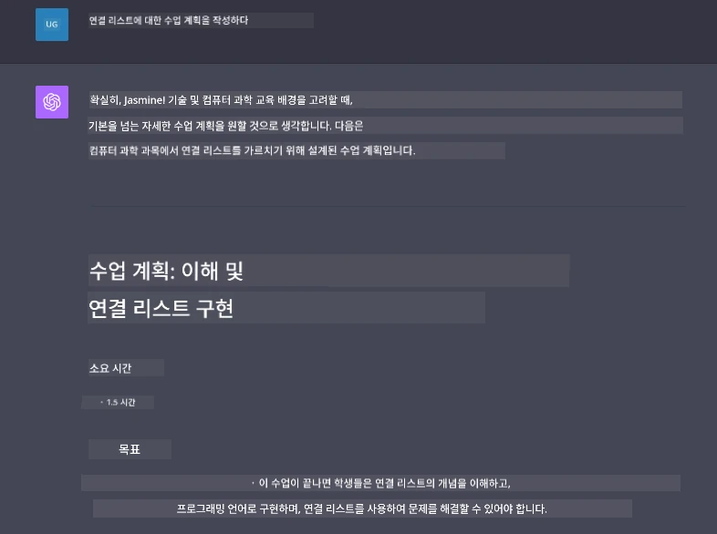

# 생성 AI 기반 채팅 애플리케이션 구축

[](https://youtu.be/R9V0ZY1BEQo?si=IHuU-fS9YWT8s4sA)

> _(위 이미지를 클릭하면 이번 수업의 동영상을 볼 수 있습니다)_

텍스트 생성 앱을 어떻게 구축하는지 알아봤으니, 이제 채팅 애플리케이션에 대해 살펴보겠습니다.

채팅 애플리케이션은 단순히 가벼운 대화를 위한 수단을 넘어 우리 일상에 깊이 통합되었습니다. 고객 서비스, 기술 지원, 심지어 고급 자문 시스템의 필수 구성 요소가 되었습니다. 최근에 채팅 애플리케이션에서 도움을 받으셨을 가능성이 높습니다. 이런 플랫폼에 생성 AI 같은 첨단 기술을 통합함에 따라 복잡성은 증가하고 도전도 커지고 있습니다.

우리가 답변해야 할 몇 가지 질문은 다음과 같습니다:

- **애플리케이션 구축**. 특정 사용 사례에 맞게 이 AI 기반 애플리케이션을 어떻게 효율적으로 구축하고 원활하게 통합할 수 있을까요?
- <strong>모니터링</strong>. 배포 후에는 애플리케이션이 기능성과 [책임 있는 AI의 6대 원칙](https://www.microsoft.com/ai/responsible-ai?WT.mc_id=academic-105485-koreyst)을 모두 준수하면서 최상급 품질로 작동하는지 어떻게 모니터링할 수 있을까요?

자동화와 원활한 인간-기계 상호작용 시대로 나아가면서, 생성 AI가 채팅 애플리케이션의 범위, 깊이, 적응력을 어떻게 변화시키는지 이해하는 것이 필수적입니다. 이 수업에서는 이 복잡한 시스템을 지원하는 아키텍처 측면을 조사하고, 도메인별 작업에 맞게 미세 조정하는 방법론을 탐구하며, 책임 있는 AI 배포를 위한 지표 및 고려 사항을 평가할 것입니다.

## 소개

이 수업에서 다루는 내용:

- 채팅 애플리케이션을 효율적으로 구축하고 통합하는 기술.
- 애플리케이션에 맞춤화 및 미세 조정 적용 방법.
- 채팅 애플리케이션을 효과적으로 모니터링하기 위한 전략과 고려 사항.

## 학습 목표

이 수업을 마치면 다음을 수행할 수 있습니다:

- 기존 시스템에 채팅 애플리케이션을 구축하고 통합할 때 고려해야 할 사항을 설명할 수 있습니다.
- 특정 사용 사례에 맞게 채팅 애플리케이션을 맞춤화할 수 있습니다.
- AI 기반 채팅 애플리케이션의 품질을 효과적으로 모니터링하고 유지할 수 있는 주요 지표 및 고려 사항을 식별할 수 있습니다.
- 채팅 애플리케이션이 책임감 있게 AI를 활용하도록 보장할 수 있습니다.

## 생성 AI를 채팅 애플리케이션에 통합하기

생성 AI를 통해 채팅 애플리케이션을 향상시키는 것은 단순히 더 똑똑하게 만드는 데 그치지 않습니다; 아키텍처, 성능, 사용자 인터페이스를 최적화하여 고품질 사용자 경험을 제공하는 것이 핵심입니다. 이는 아키텍처적 기반, API 통합, 사용자 인터페이스 고려 사항을 조사하는 것을 포함합니다. 이 섹션은 기존 시스템에 연결하든 독립 플랫폼으로 구축하든 복잡한 이 분야를 탐색할 수 있도록 포괄적인 로드맵을 제공하는 것을 목표로 합니다.

이 섹션을 마치면 채팅 애플리케이션을 효율적으로 구축하고 통합하는 데 필요한 전문 지식을 갖추게 됩니다.

### 챗봇 혹은 채팅 애플리케이션?

채팅 애플리케이션 구축에 들어가기 전에, ‘챗봇’과 ‘AI 기반 채팅 애플리케이션’을 비교해 보겠습니다. 각각 역할과 기능이 다릅니다. 챗봇은 주로 자주 묻는 질문에 답하거나 물품 추적 같은 특정 대화 작업을 자동화하는 데 목적이 있습니다. 보통 규칙 기반 논리나 복잡한 AI 알고리즘으로 제어됩니다. 반면 AI 기반 채팅 애플리케이션은 텍스트, 음성, 비디오 채팅 등 다양한 형태의 디지털 커뮤니케이션을 지원하는 훨씬 더 광범위한 환경입니다. 생성 AI 모델을 통합해 미묘하고 인간과 같은 대화를 시뮬레이션하며, 다양한 입력 및 맥락 신호를 바탕으로 응답을 생성합니다. 생성 AI 기반 채팅 애플리케이션은 개방형 도메인 토론에 참여하고, 대화 맥락 변화에 적응하며, 심지어 창의적이고 복잡한 대화를 생성할 수 있습니다.

아래 표는 디지털 커뮤니케이션에서 이들의 고유 역할을 이해하는 데 도움이 되도록 주요 차이점과 유사점을 정리한 것입니다.

| 챗봇                                  | 생성 AI 기반 채팅 애플리케이션                      |
| ------------------------------------- | --------------------------------------             |
| 작업 중심 및 규칙 기반                 | 맥락 인지                                         |
| 종종 더 큰 시스템에 통합됨             | 하나 이상의 챗봇을 포함할 수 있음                   |
| 프로그래밍된 기능에 한정됨             | 생성 AI 모델 포함                                  |
| 전문화되고 구조화된 상호작용 수행     | 개방형 도메인 토론 가능                             |

### SDK와 API를 활용한 기 구축 기능 활용

채팅 애플리케이션을 만들 때 가장 좋은 첫 단계는 이미 존재하는 것을 평가하는 것입니다. SDK와 API를 사용해 채팅 애플리케이션을 구축하는 것은 여러 측면에서 유리한 전략입니다. 잘 문서화된 SDK와 API를 통합하면 확장성과 유지 관리를 해결하여 애플리케이션의 장기적 성공을 전략적으로 도모할 수 있습니다.

- **개발 과정 단축 및 부담 경감**: 직접 구축하는 데 드는 비용 대신 이미 구축된 기능을 활용하면, 비즈니스 로직 같은 더 중요한 애플리케이션의 다른 측면에 집중할 수 있습니다.
- **더 나은 성능**: 기능을 처음부터 구축할 때 "이 기능은 얼마나 확장 가능할까? 갑작스러운 사용자 증가를 감당할 수 있을까?" 같은 질문을 하게 됩니다. 잘 관리되는 SDK와 API는 이런 고민에 대한 내장 솔루션을 제공하는 경우가 많습니다.
- **유지 보수 용이**: 업데이트 및 개선 사항 관리는, 대부분의 API와 SDK가 새 버전이 출시될 때 라이브러리 업데이트만 요구하므로 쉽습니다.
- **최첨단 기술 접근**: 광범위한 데이터셋으로 미세 조정되고 훈련된 모델을 활용하면, 애플리케이션에 자연어 기능을 제공합니다.

SDK나 API의 기능을 사용하려면, 보통 고유 키나 인증 토큰을 통해 서비스 사용 권한을 얻어야 합니다. 이제 OpenAI Python 라이브러리를 통해 그 실제 예시를 살펴보겠습니다. 또한 이번 수업의 [OpenAI 노트북](./python/oai-assignment.ipynb?WT.mc_id=academic-105485-koreyst)이나 [Azure OpenAI 서비스 노트북](./python/aoai-assignment.ipynb?WT.mc_id=academic-105485-koreys)에서 직접 시도해 볼 수도 있습니다.

```python
import os
from openai import OpenAI

API_KEY = os.getenv("OPENAI_API_KEY","")

client = OpenAI(
    api_key=API_KEY
    )

response = client.responses.create(model="gpt-5-mini", input="Suggest two titles for an instructional lesson on chat applications for generative AI.", store=False)
print(response.output_text)
```

위 예시는 GPT-5 미니 모델과 Responses API를 사용해 프롬프트를 완료하지만, API 키를 미리 설정했다는 점에 주의하세요. 키를 설정하지 않으면 오류가 발생합니다.

## 사용자 경험 (UX)

일반 UX 원칙이 채팅 애플리케이션에 적용되지만, 머신러닝 요소가 포함됨에 따라 특히 중요한 추가 고려사항이 있습니다.

- **모호성 해결 메커니즘**: 생성 AI 모델은 종종 모호한 답변을 생성합니다. 사용자가 이런 문제에 직면했을 때 명확한 답변을 요청할 수 있는 기능이 도움이 됩니다.
- **맥락 유지**: 고급 생성 AI 모델은 대화 내에서 맥락을 기억할 수 있어 사용자 경험에 필수적일 수 있습니다. 사용자가 맥락을 제어하고 관리할 수 있도록 하면 경험이 향상되지만, 민감한 사용자 정보가 저장될 위험도 있으므로, 저장 기간과 같은 정책(예: 유지 정책) 도입을 통해 맥락 유지와 개인정보 보호 간 균형을 맞추는 것이 좋습니다.
- <strong>개인화</strong>: 학습하고 적응하는 능력으로 AI 모델은 사용자에게 맞춤형 경험을 제공합니다. 사용자 프로필 같은 기능을 통해 사용자 경험을 맞춤화하면 사용자가 이해받는 느낌을 받을 뿐만 아니라 특정 답변을 찾는 여정이 더 효율적이고 만족스럽게 됩니다.

개인화의 한 예로 OpenAI의 ChatGPT 내 "사용자 지침(Custom instructions)" 설정이 있습니다. 사용자는 자신에 관한 중요한 맥락 정보를 제공할 수 있습니다. 아래는 사용자 지침 예시입니다.



이 "프로필"은 ChatGPT에게 연결 리스트에 관한 수업 계획을 생성하도록 지시합니다. ChatGPT가 사용자의 경험을 고려해 더 심층적인 수업 계획을 원할 수 있다는 점을 반영하는 것을 알 수 있습니다.



### Microsoft의 대형 언어 모델을 위한 시스템 메시지 프레임워크

[Microsoft는 LLM에서 응답 생성 시 효과적인 시스템 메시지를 작성하는 가이드라인](https://learn.microsoft.com/azure/ai-foundry/openai/concepts/system-message#define-the-models-output-format?WT.mc_id=academic-105485-koreyst)을 4가지 영역으로 나눠 제시했습니다:

1. 모델의 대상, 능력 및 한계 정의.
2. 모델 출력 형식 정의.
3. 모델의 의도된 동작을 보여주는 구체적 예제 제공.
4. 추가적인 행동 규칙 제공.

### 접근성

사용자가 시각, 청각, 운동, 인지 장애를 갖고 있더라도 잘 설계된 채팅 애플리케이션은 모두가 사용할 수 있어야 합니다. 아래 리스트는 다양한 장애 유형을 고려한 접근성 향상 기능을 나열합니다.

- **시각 장애용 기능**: 고대비 테마, 텍스트 크기 조정 가능, 화면 읽기기 호환성.
- **청각 장애용 기능**: 텍스트 음성 변환, 음성 텍스트 변환 기능, 오디오 알림 시 시각적 신호.
- **운동 장애용 기능**: 키보드 내비게이션 지원, 음성 명령.
- **인지 장애용 기능**: 간략화된 언어 옵션.

## 도메인별 언어 모델 맞춤화 및 미세 조정

회사의 전문 용어를 이해하고 사용자 기반에서 자주 제기되는 구체적 질문을 예상하는 채팅 애플리케이션을 상상해 보세요. 다음 두 가지 접근법을 소개합니다:

- **도메인별 언어 모델 활용**. DSL은 도메인별 언어(domain specific language)를 뜻합니다. 특정 도메인에 대해 훈련된 DSL 모델을 활용하여 그 개념과 시나리오를 이해할 수 있습니다.
- **미세 조정 적용**. 미세 조정은 특정 데이터로 모델을 추가 학습시키는 과정입니다.

## 맞춤화: DSL 사용

도메인별 언어 모델(DSL 모델)을 활용하면 전문적이고 맥락에 맞는 상호작용을 제공하여 사용자 참여를 늘릴 수 있습니다. DSL 모델은 특정 분야, 산업, 주제와 관련된 텍스트를 이해하고 생성하도록 훈련되거나 미세 조정된 모델입니다. DSL 모델 사용 방법은 처음부터 훈련하거나 SDK와 API를 통해 기존 모델을 이용하는 옵션이 있으며, 기존 사전훈련 모델을 특정 도메인에 맞게 조정하는 미세 조정도 선택지입니다.

## 맞춤화: 미세 조정 적용

미세 조정은 사전훈련된 모델이 전문 도메인이나 특정 작업에서 부족할 경우 자주 고려됩니다.

예를 들어, 의료 질문은 복잡하고 많은 맥락을 필요로 합니다. 의료 전문가는 환자 진단 시 생활 습관, 기존 질환, 최신 의학 논문 등 여러 요인을 바탕으로 진단을 내립니다. 이렇게 미묘한 상황에서 범용 AI 채팅 애플리케이션은 신뢰할 수 있는 출처가 되지 못할 수 있습니다.

### 시나리오: 의료 애플리케이션

의료진을 지원하기 위해 치료 지침, 약물 상호작용, 최신 연구 결과 등을 빠르게 참조할 수 있는 채팅 애플리케이션을 고려해 보세요.

범용 모델은 기본 의료 질문에 답하거나 일반적인 조언을 제공하는 데는 적합할 수 있지만, 다음과 같은 상황에서는 어려움을 겪을 수 있습니다:

- **매우 구체적이거나 복잡한 사례**. 예를 들어 신경과 전문의가 "소아 내약성 간질 치료에 대한 최신 최선의 방법은 무엇인가?"라고 질문할 수 있습니다.
- **최신 발전 내용 부족**. 범용 모델은 신경학 및 약학 분야 최신 발전을 반영한 답변 제공에 어려움을 겪을 수 있습니다.

이런 경우, 전문 의료 데이터셋으로 모델을 미세 조정하면 복잡한 의료 질문에 더 정확하고 신뢰성 있는 답변을 제공하는 능력이 크게 향상됩니다. 이를 위해서는 도메인별 문제와 질문을 대표하는 크고 관련성 높은 데이터셋에 접근할 수 있어야 합니다.

## 고품질 AI 기반 채팅 경험을 위한 고려사항

이 섹션에서는 실행 가능한 지표 수집과 AI 기술을 책임감 있게 활용하는 프레임워크 준수를 포함한 ‘고품질’ 채팅 애플리케이션의 기준을 설명합니다.

### 주요 지표

애플리케이션의 고품질 성능을 유지하려면 주요 지표와 고려사항을 반드시 파악해야 합니다. 이런 측정치는 애플리케이션 기능뿐 아니라 AI 모델과 사용자 경험의 품질을 평가하는 데 필수적입니다. 아래는 기본, AI 및 사용자 경험 지표를 포함한 목록입니다.

| 지표                           | 정의                                                                                                                 | 채팅 개발자 고려사항                                                    |
| ----------------------------- | -------------------------------------------------------------------------------------------------------------------- | ----------------------------------------------------------------------- |
| **가동 시간 (Uptime)**          | 애플리케이션이 정상 운영되고 사용자 접근이 가능한 시간을 측정한다.                                                    | 다운타임을 최소화하려면 어떻게 해야 할까?                              |
| **응답 시간 (Response Time)**  | 애플리케이션이 사용자 문의에 답변하는 데 걸리는 시간.                                                                  | 쿼리 처리 최적화를 통해 어떻게 응답 시간을 개선할까?                   |
| **정밀도 (Precision)**          | 참 긍정 예측 수를 전체 긍정 예측 수로 나눈 비율.                                                                       | 모델의 정밀도를 어떻게 검증할 것인가?                                  |
| **재현율 (Recall, 민감도)**    | 참 긍정 예측 수를 실제 긍정 사례 수로 나눈 비율.                                                                       | 재현율을 어떻게 측정하고 개선할 것인가?                                |
| **F1 점수 (F1 Score)**          | 정밀도와 재현율의 조화 평균으로, 두 요소 간 균형을 조절하는 지표.                                                      | 목표 F1 점수는 얼마인가? 정밀도와 재현율의 균형을 어떻게 맞출 것인가?  |
| **혼란도 (Perplexity)**         | 모델이 예측한 확률 분포가 실제 데이터 분포와 얼마나 일치하는지 측정하는 지표.                                            | 혼란도를 어떻게 최소화할 것인가?                                       |
| **사용자 만족도 지표**          | 사용자 인식을 측정하며, 종종 설문조사를 통해 수집된다.                                                                   | 사용자 피드백을 얼마나 자주 수집하고, 어떻게 반영할 것인가?            |
| **오류율 (Error Rate)**          | 모델이 이해하거나 출력하는 데에 있어 오류를 범하는 비율.                                                                | 오류율 감소를 위해 어떤 전략을 갖고 있는가?                            |
| **재교육 주기 (Retraining Cycles)** | 새로운 데이터와 인사이트를 반영해 모델을 업데이트하는 빈도.                                                             | 재교육은 얼마나 자주 진행하며, 어떤 조건에서 주기가 시작되는가?        |

| **이상 탐지**               | 예상되는 동작과 일치하지 않는 비정상적인 패턴을 식별하는 도구와 기법입니다.                 | 이상 현상에 어떻게 대응할 것인가요?                                         |

### 채팅 애플리케이션에서 책임 있는 AI 실천 구현

마이크로소프트의 책임 있는 AI 접근법은 AI 개발 및 사용을 안내할 여섯 가지 원칙을 제시했습니다. 아래는 원칙들, 정의, 채팅 개발자가 고려해야 할 사항 및 그 이유입니다.

| 원칙                   | 마이크로소프트 정의                                    | 채팅 개발자를 위한 고려사항                                          | 중요한 이유                                                                             |
| ---------------------- | ----------------------------------------------------- | ------------------------------------------------------------------ | -------------------------------------------------------------------------------------- |
| 공정성                 | AI 시스템은 모든 사람을 공정하게 대우해야 합니다.       | 채팅 애플리케이션이 사용자 데이터를 기반으로 차별하지 않도록 보장하세요. | 사용자 신뢰와 포용성 구축; 법적 문제를 방지합니다.                                    |
| 신뢰성 및 안전성       | AI 시스템은 신뢰할 수 있고 안전하게 작동해야 합니다.     | 오류와 위험을 최소화하기 위해 테스트 및 안전장치를 구현하세요.      | 사용자 만족도를 보장하고 잠재적 피해를 방지합니다.                                   |
| 개인정보 보호 및 보안  | AI 시스템은 안전해야 하며 개인정보를 존중해야 합니다.    | 강력한 암호화 및 데이터 보호 조치를 구현하세요.                  | 민감한 사용자 데이터를 보호하고 개인정보 보호법을 준수하기 위함입니다.              |
| 포용성                 | AI 시스템은 모든 사람을 지원하고 참여를 이끌어야 합니다.  | 다양한 사용자층이 접근하기 쉽고 사용하기 편리한 UI/UX를 설계하세요.   | 더 다양한 사용자가 효과적으로 애플리케이션을 사용할 수 있도록 보장합니다.            |
| 투명성                 | AI 시스템은 이해하기 쉬워야 합니다.                      | AI 응답에 대한 명확한 문서와 이유를 제공하세요.                    | 이용자가 의사결정 과정을 이해하면 시스템을 더 신뢰할 가능성이 높습니다.              |
| 책임성                 | AI 시스템에 대해 사람은 책임을 져야 합니다.              | AI 결정에 대한 감사 및 개선 절차를 명확히 수립하세요.               | 실수 발생 시 지속적인 개선과 시정 조치를 가능하게 합니다.                          |

## 과제

[assignment](../../../07-building-chat-applications/python)을(를) 참조하세요. 첫 채팅 프롬프트 실행부터 텍스트 분류 및 요약 등 일련의 연습을 진행할 수 있습니다. 과제는 여러 프로그래밍 언어로 제공된다는 점에 유의하세요!

## 훌륭합니다! 여정을 계속하세요

이 수업을 마친 후, [Generative AI Learning collection](https://aka.ms/genai-collection?WT.mc_id=academic-105485-koreyst)을(를) 확인하여 생성 AI 지식을 더욱 향상하세요!

8과로 이동하여 [검색 애플리케이션 구축 방법](../08-building-search-applications/README.md?WT.mc_id=academic-105485-koreyst)을 확인하세요!

---

<!-- CO-OP TRANSLATOR DISCLAIMER START -->
**면책 조항**:
이 문서는 AI 번역 서비스 [Co-op Translator](https://github.com/Azure/co-op-translator)를 사용하여 번역되었습니다. 정확성을 기하기 위해 노력하고 있으나, 자동 번역은 오류나 부정확한 부분이 있을 수 있음을 유의하시기 바랍니다. 원본 문서의 원어본이 권위 있는 자료로 간주되어야 합니다. 중요한 정보의 경우, 전문가의 인간 번역을 권장합니다. 이 번역 사용으로 인해 발생하는 오해나 잘못된 해석에 대해 당사는 책임을 지지 않습니다.
<!-- CO-OP TRANSLATOR DISCLAIMER END -->