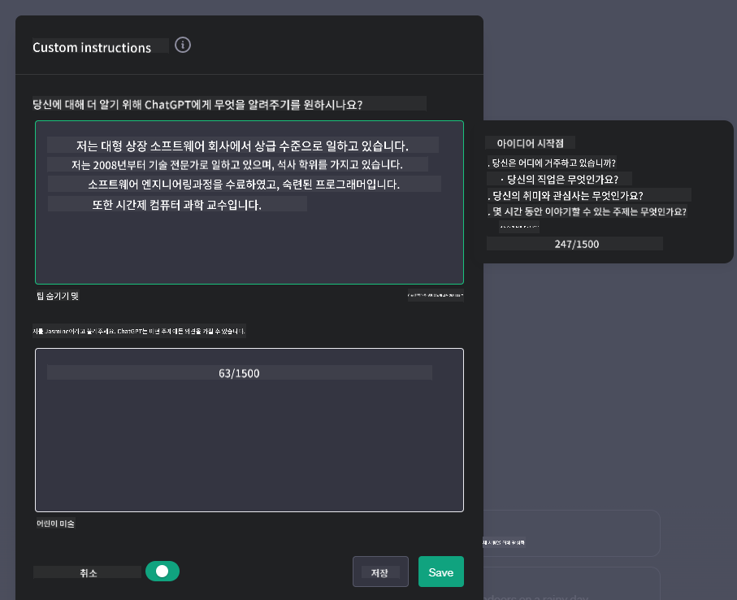
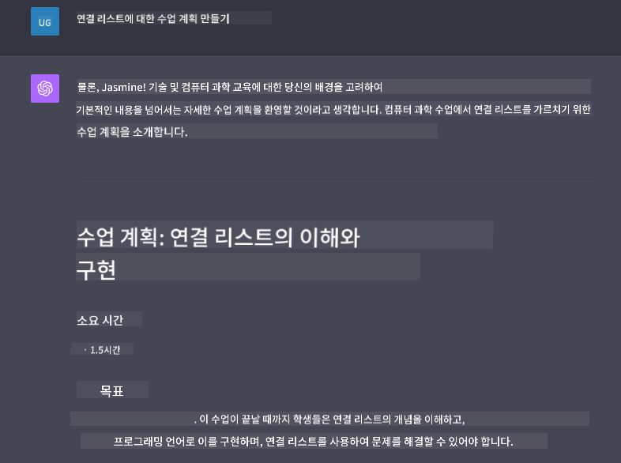

<!--
CO_OP_TRANSLATOR_METADATA:
{
  "original_hash": "ea4bbe640847aafbbba14dae4625e9af",
  "translation_date": "2025-06-25T15:16:23+00:00",
  "source_file": "07-building-chat-applications/README.md",
  "language_code": "ko"
}
-->
# 생성 AI 기반 채팅 애플리케이션 구축

[](https://aka.ms/gen-ai-lessons7-gh?WT.mc_id=academic-105485-koreyst)

> _(위 이미지를 클릭하면 이 강의의 비디오를 볼 수 있습니다)_

텍스트 생성 앱을 어떻게 구축할 수 있는지 살펴봤으니 이제 채팅 애플리케이션을 살펴보겠습니다.

채팅 애플리케이션은 일상 생활에 통합되어 단순한 대화 수단 이상의 기능을 제공합니다. 고객 서비스, 기술 지원, 심지어 복잡한 상담 시스템의 필수적인 부분입니다. 최근에 채팅 애플리케이션을 통해 도움을 받은 적이 있을 것입니다. 생성 AI와 같은 고급 기술을 이러한 플랫폼에 통합함에 따라 복잡성이 증가하고 도전 과제도 커집니다.

우리가 답해야 할 몇 가지 질문은 다음과 같습니다:

- **앱 구축**. 특정 사용 사례에 맞춰 이러한 AI 기반 애플리케이션을 효율적으로 구축하고 원활하게 통합하려면 어떻게 해야 할까요?
- **모니터링**. 배포 후 애플리케이션이 기능적으로 최고 수준의 품질을 유지하고 [책임 있는 AI의 여섯 가지 원칙](https://www.microsoft.com/ai/responsible-ai?WT.mc_id=academic-105485-koreyst)을 준수하는지 어떻게 모니터링하고 보장할 수 있을까요?

자동화와 원활한 인간-기계 상호작용으로 정의되는 시대에 접어들면서 생성 AI가 채팅 애플리케이션의 범위, 깊이, 적응성을 어떻게 변화시키는지를 이해하는 것이 필수적입니다. 이 강의에서는 이러한 복잡한 시스템을 지원하는 아키텍처의 측면을 조사하고, 도메인별 작업을 위한 세부 조정 방법론을 탐구하며, 책임 있는 AI 배포를 보장하기 위한 지표와 고려 사항을 평가할 것입니다.

## 소개

이 강의에서는 다음을 다룹니다:

- 채팅 애플리케이션을 효율적으로 구축하고 통합하는 기술.
- 애플리케이션에 맞춤화와 세부 조정을 적용하는 방법.
- 채팅 애플리케이션을 효과적으로 모니터링하는 전략과 고려 사항.

## 학습 목표

이 강의가 끝나면 다음을 할 수 있습니다:

- 기존 시스템에 채팅 애플리케이션을 구축하고 통합할 때 고려해야 할 사항을 설명합니다.
- 특정 사용 사례에 맞춰 채팅 애플리케이션을 맞춤화합니다.
- AI 기반 채팅 애플리케이션의 품질을 효과적으로 모니터링하고 유지하기 위한 주요 지표와 고려 사항을 식별합니다.
- AI를 책임감 있게 활용하는 채팅 애플리케이션을 보장합니다.

## 채팅 애플리케이션에 생성 AI 통합하기

생성 AI를 통해 채팅 애플리케이션을 향상시키는 것은 단순히 더 스마트하게 만드는 것이 아닙니다. 아키텍처, 성능, 사용자 인터페이스를 최적화하여 질 높은 사용자 경험을 제공하는 것입니다. 이는 아키텍처의 기초, API 통합, 사용자 인터페이스 고려 사항을 조사하는 것을 포함합니다. 이 섹션은 기존 시스템에 플러그를 꽂거나 독립형 플랫폼으로 구축할 때 이러한 복잡한 환경을 탐색하기 위한 포괄적인 로드맵을 제공하는 것을 목표로 합니다.

이 섹션이 끝날 때쯤, 채팅 애플리케이션을 효율적으로 구축하고 통합할 수 있는 전문 지식을 갖추게 될 것입니다.

### 챗봇 또는 채팅 애플리케이션?

채팅 애플리케이션을 구축하기 전에 '챗봇'과 'AI 기반 채팅 애플리케이션'을 비교해 봅시다. 이들은 서로 다른 역할과 기능을 제공합니다. 챗봇의 주요 목적은 자주 묻는 질문에 답하거나 패키지를 추적하는 것과 같은 특정 대화 작업을 자동화하는 것입니다. 이는 일반적으로 규칙 기반 논리 또는 복잡한 AI 알고리즘에 의해 관리됩니다. 반면, AI 기반 채팅 애플리케이션은 인간 사용자 간의 텍스트, 음성, 비디오 채팅과 같은 다양한 형태의 디지털 커뮤니케이션을 촉진하기 위해 설계된 훨씬 더 광범위한 환경입니다. 그 특징은 다양한 입력과 상황적 단서를 기반으로 인간과 유사한 대화를 시뮬레이션하는 생성 AI 모델의 통합입니다. 생성 AI 기반 채팅 애플리케이션은 오픈 도메인 토론에 참여하고, 진화하는 대화 맥락에 적응하며, 창의적이거나 복잡한 대화를 생성할 수도 있습니다.

아래 표는 디지털 커뮤니케이션에서 그들의 독특한 역할을 이해하는 데 도움이 되는 주요 차이점과 유사점을 설명합니다.

| 챗봇                                | 생성 AI 기반 채팅 애플리케이션         |
| ---------------------------------- | -------------------------------------- |
| 작업 중심 및 규칙 기반             | 상황 인식                             |
| 더 큰 시스템에 통합되는 경우가 많음 | 하나 이상의 챗봇을 호스트할 수 있음    |
| 프로그래밍된 기능에 제한됨          | 생성 AI 모델을 통합함                 |
| 전문적이고 구조화된 상호작용       | 오픈 도메인 토론이 가능함             |

### SDK와 API를 통한 사전 구축 기능 활용

채팅 애플리케이션을 구축할 때, 먼저 이미 나와 있는 것을 평가하는 것이 좋습니다. 채팅 애플리케이션을 구축할 때 SDK와 API를 사용하는 것은 다양한 이유로 유리한 전략입니다. 잘 문서화된 SDK와 API를 통합함으로써, 장기적인 성공을 위한 전략적 위치를 확보하고 확장성 및 유지보수 문제를 해결합니다.

- **개발 과정을 신속하게 하고 오버헤드를 줄임**: 직접 구축하는 비싼 과정 대신 사전 구축된 기능을 활용하면 비즈니스 로직과 같은 더 중요한 애플리케이션의 다른 측면에 집중할 수 있습니다.
- **더 나은 성능**: 기능을 처음부터 구축할 때 "어떻게 확장되는가? 이 애플리케이션이 갑작스러운 사용자 유입을 처리할 수 있는가?"라는 질문을 하게 될 것입니다. 잘 유지된 SDK와 API는 이러한 문제에 대한 내장 솔루션을 제공하는 경우가 많습니다.
- **유지보수가 더 쉬움**: 대부분의 API와 SDK는 새로운 버전이 출시될 때 라이브러리를 업데이트하는 것만으로도 업데이트와 개선이 쉽게 관리됩니다.
- **최첨단 기술에 접근**: 광범위한 데이터셋으로 세부 조정되고 훈련된 모델을 활용하면 자연어 기능을 애플리케이션에 제공합니다.

SDK나 API의 기능에 접근하는 것은 일반적으로 제공된 서비스를 사용할 수 있는 권한을 얻는 것을 포함하며, 이는 종종 고유 키나 인증 토큰을 사용하는 방식입니다. OpenAI Python Library를 사용하여 이것이 어떻게 보이는지 살펴보겠습니다. 이 강의의 [OpenAI 노트북](../../../07-building-chat-applications/python/oai-assignment.ipynb)이나 [Azure OpenAI Services 노트북](../../../07-building-chat-applications/python/aoai-assignment.ipynb)에서 직접 시도해 볼 수도 있습니다.

```python
import os
from openai import OpenAI

API_KEY = os.getenv("OPENAI_API_KEY","")

client = OpenAI(
    api_key=API_KEY
    )

chat_completion = client.chat.completions.create(model="gpt-3.5-turbo", messages=[{"role": "user", "content": "Suggest two titles for an instructional lesson on chat applications for generative AI."}])
```

위의 예시는 GPT-3.5 Turbo 모델을 사용하여 프롬프트를 완료하지만, API 키가 설정된 후에 이를 수행하는 것을 확인할 수 있습니다. 키를 설정하지 않으면 오류가 발생합니다.

## 사용자 경험 (UX)

일반적인 UX 원칙은 채팅 애플리케이션에도 적용되지만, 기계 학습 구성 요소가 포함되어 특별히 중요한 추가 고려 사항이 있습니다.

- **모호성을 해결하는 메커니즘**: 생성 AI 모델은 때때로 모호한 답변을 생성합니다. 사용자가 이 문제를 겪을 경우 명확성을 요청할 수 있는 기능이 도움이 될 수 있습니다.
- **컨텍스트 유지**: 고급 생성 AI 모델은 대화 내에서 컨텍스트를 기억할 수 있는 능력이 있어 사용자 경험에 필요한 자산이 될 수 있습니다. 사용자가 컨텍스트를 제어하고 관리할 수 있게 하는 것은 사용자 경험을 개선하지만 민감한 사용자 정보를 유지할 위험을 수반합니다. 정보가 얼마나 오래 저장되는지에 대한 고려 사항, 예를 들어 보존 정책 도입은 컨텍스트에 대한 필요와 개인정보 보호 사이의 균형을 맞출 수 있습니다.
- **개인화**: 학습하고 적응할 수 있는 AI 모델은 사용자에게 개인화된 경험을 제공합니다. 사용자 프로필과 같은 기능을 통해 사용자 경험을 맞춤화하면 사용자가 이해받는 느낌을 줄 뿐만 아니라 특정 답변을 찾는 과정을 더 효율적이고 만족스러운 상호작용으로 만듭니다.

개인화의 한 예로 OpenAI의 ChatGPT에서 "사용자 지정 지침" 설정이 있습니다. 이는 프롬프트에 중요한 컨텍스트가 될 수 있는 정보를 제공할 수 있게 합니다. 다음은 사용자 지정 지침의 예입니다.



이 "프로필"은 ChatGPT에게 연결 리스트에 대한 수업 계획을 만들도록 요청합니다. ChatGPT가 사용자의 경험에 기반하여 더 깊이 있는 수업 계획을 원할 수 있다고 고려하는 것을 확인할 수 있습니다.



### 마이크로소프트의 대형 언어 모델을 위한 시스템 메시지 프레임워크

[마이크로소프트는](https://learn.microsoft.com/azure/ai-services/openai/concepts/system-message#define-the-models-output-format?WT.mc_id=academic-105485-koreyst) LLM에서 응답을 생성할 때 효과적인 시스템 메시지를 작성하기 위한 지침을 제공하며, 이는 4가지 영역으로 나뉩니다:

1. 모델이 대상이 되는 사람과 모델의 기능 및 제한을 정의합니다.
2. 모델의 출력 형식을 정의합니다.
3. 모델의 의도된 행동을 보여주는 특정 예를 제공합니다.
4. 추가적인 행동적 안전장치를 제공합니다.

### 접근성

사용자가 시각, 청각, 운동, 인지 장애를 가지고 있든지 간에 잘 설계된 채팅 애플리케이션은 모든 사람이 사용할 수 있어야 합니다. 다음 목록은 다양한 사용자 장애를 위한 접근성을 향상시키기 위한 특정 기능을 설명합니다.

- **시각 장애를 위한 기능**: 고대비 테마와 텍스트 크기 조절, 화면 읽기 장치 호환성.
- **청각 장애를 위한 기능**: 텍스트 음성 변환 및 음성 텍스트 변환 기능, 오디오 알림에 대한 시각적 단서.
- **운동 장애를 위한 기능**: 키보드 탐색 지원, 음성 명령.
- **인지 장애를 위한 기능**: 단순화된 언어 옵션.

## 도메인 특화 언어 모델을 위한 맞춤화 및 세부 조정

회사의 용어를 이해하고 사용자 기반이 일반적으로 가지는 특정 질문을 예상하는 채팅 애플리케이션을 상상해보세요. 언급할 가치가 있는 몇 가지 접근 방식이 있습니다:

- **DSL 모델 활용**. DSL은 도메인 특화 언어를 의미합니다. 특정 도메인에 대해 훈련된 소위 DSL 모델을 활용하여 해당 개념과 시나리오를 이해할 수 있습니다.
- **세부 조정 적용**. 세부 조정은 특정 데이터로 모델을 추가로 훈련하는 과정입니다.

## 맞춤화: DSL 사용

도메인 특화 언어 모델(DSL 모델)을 활용하면 전문적이고 맥락에 맞는 상호작용을 제공하여 사용자 참여를 강화할 수 있습니다. 이는 특정 분야, 산업, 주제와 관련된 텍스트를 이해하고 생성할 수 있도록 훈련되거나 세부 조정된 모델입니다. DSL 모델을 사용하는 옵션은 처음부터 훈련하는 것부터 SDK와 API를 통해 기존 모델을 사용하는 것까지 다양합니다. 또 다른 옵션은 세부 조정으로, 기존의 사전 훈련된 모델을 특정 도메인에 맞게 적응시키는 것입니다.

## 맞춤화: 세부 조정 적용

세부 조정은 사전 훈련된 모델이 특정 도메인이나 특정 작업에서 부족할 때 고려됩니다.

예를 들어, 의료 문의는 복잡하고 많은 맥락을 필요로 합니다. 의료 전문가는 환자를 진단할 때 생활 방식이나 기존 조건과 같은 다양한 요소에 기반하며, 최근 의료 저널을 통해 진단을 검증하기도 합니다. 이러한 미묘한 시나리오에서는 일반 목적의 AI 채팅 애플리케이션이 신뢰할 수 있는 소스가 될 수 없습니다.

### 시나리오: 의료 애플리케이션

의료 전문가가 치료 지침, 약물 상호작용 또는 최근 연구 결과에 대한 빠른 참조를 제공하도록 설계된 채팅 애플리케이션을 고려해보세요.

일반 목적의 모델은 기본적인 의료 질문에 답하거나 일반적인 조언을 제공하는 데 충분할 수 있지만 다음과 같은 문제를 겪을 수 있습니다:

- **매우 특정하거나 복잡한 사례**. 예를 들어, 신경과 전문의가 "소아 환자의 약물 저항성 간질 관리에 대한 현재의 최선의 방법은 무엇인가요?"라는 질문을 할 수 있습니다.
- **최근 발전 부족**. 일반 목적의 모델은 신경학과 약리학의 가장 최근 발전을 포함한 현재의 답변을 제공하는 데 어려움을 겪을 수 있습니다.

이러한 경우에는 특정 의료 데이터셋으로 모델을 세부 조정하면 이러한 복잡한 의료 문의를 더 정확하고 신뢰할 수 있게 처리할 수 있는 능력이 크게 향상됩니다. 이는 도메인 특화 문제와 질문을 나타내는 크고 관련성 있는 데이터셋에 접근하는 것을 필요로 합니다.

## 고품질 AI 기반 채팅 경험을 위한 고려 사항

이 섹션에서는 "고품질" 채팅 애플리케이션의 기준을 설명하며, 이는 실행 가능한 메트릭의 수집과 AI 기술을 책임감 있게 활용하는 프레임워크를 준수하는 것을 포함합니다.

### 주요 메트릭

애플리케이션의 고품질 성능을 유지하려면 주요 메트릭과 고려 사항을 추적하는 것이 필수적입니다. 이러한 측정은 애플리케이션의 기능을 보장할 뿐만 아니라 AI 모델과 사용자 경험의 질을 평가합니다. 아래 목록은 기본, AI, 사용자 경험 메트릭을 고려합니다.

| 메트릭                        | 정의                                                                                                             | 채팅 개발자를 위한 고려 사항                                               |
| ----------------------------- | ----------------------------------------------------------------------------------------------------------------- | ------------------------------------------------------------------------- |
| **가동 시간**                 | 애플리케이션이 운영되고 사용자에게 접근 가능한 시간을 측정합니다.                                                | 다운타임을 어떻게 최소화할 것인가?                                        |
| **응답 시간**                 | 사용자의 질문에 애플리케이션이 응답하는 데 걸리는 시간입니다.                                                    | 응답 시간을 개선하기 위해 쿼리 처리를 어떻게 최적화할 것인가?             |
| **정밀도**                    | 긍정 예측의 총 수에 대한 실제 긍정 예측의 비율입니다.                                                           | 모델의 정밀도를 어떻게 검증할 것인가?                                     |
| **재현율 (민감도)**           | 실제 긍정 수에 대한 실제 긍정 예측의 비율입니다.                                                               | 재현율을 어떻게 측정하고 개선할 것인가?                                   |
| **F1 점수**                   | 정밀도와 재현율의 조화 평균으로, 둘 사이의 균형을 맞춥니다.                                                    | 목표 F1 점수는 무엇인가? 정밀도와 재현율을 어떻게 균형 잡을 것인가?       |
| **당혹도**                    | 모델이 예측한 확률 분포가 실제 데이터 분포와 얼마나 잘 맞는지를 측정합니다.                                   | 당혹도를 어떻게 최소화할 것인가?                                          |
| **사용자 만족도 메트릭**      | 애플리케이션에 대한 사용자의 인식을 측정합니다. 종종 설문 조사를 통해 수집됩니다.                              | 사용자 피드백을 얼마나 자주 수집할 것인가? 그것에 따라 어떻게 적응할 것인가? |
| **오류율**                    | 모델이 이해하거나 출력하는 데 실수를 하는 비율입니다.                                                          | 오류율을 줄이기 위한 전략은 무엇인가?                                      |
| **재훈련 주기**               | 새로운 데이터와 통찰력을 통합하기 위해 모델이 업데이트되는 빈도입니다.                                        | 모델을 얼마나 자주 재훈련할 것인가? 재훈련 주기를 무엇으로 유발할 것인가? |
| **이상 탐지**                 | 예상 행동에 맞지 않는 비정상적인 패턴을 식별하기 위한 도구와 기술입니다.                                       | 이상에 어떻게 대응할 것인가?                                               |

### 채팅 애플리케이션에서 책임 있는 AI 관행 구현하기

마이크로소프트의 책임 있는 AI 접근 방식은 AI 개발 및 사용을 안내하는 여섯 가지 원칙을 식별했습니다. 아래는 원칙, 정의, 채팅 개발자가 고려해야 할 사항과 왜 그것이 중요한지에 대한 설명입니다.

| 원칙                     | 마이크로소프트의 정의                              | 채팅 개발자를 위한 고려 사항                                             | 왜 중요한가                                                                           |
| ------------------------ | -------------------------------------------------- | ------------------------------------------------------------------------ | ------------------------------------------------------------------------------------ |
| 공정성                   | AI 시스템은 모든 사람을 공정하게 대해야 합니다.   | 사용자 데이터에 기반한 차별을 하지 않도록 채팅 애플리케이션을 보장합니다. | 사용자 간의 신뢰와 포용성을 구축하기 위해; 법적 문제를 피하기 위해.                 |
| 신뢰성과 안전성        

**면책 조항**:  
이 문서는 AI 번역 서비스 [Co-op Translator](https://github.com/Azure/co-op-translator)를 사용하여 번역되었습니다. 정확성을 위해 노력하고 있지만 자동 번역에는 오류나 부정확성이 있을 수 있습니다. 원본 문서가 권위 있는 출처로 간주되어야 합니다. 중요한 정보의 경우, 전문적인 인간 번역을 권장합니다. 이 번역 사용으로 인해 발생하는 오해나 오역에 대해서는 책임을 지지 않습니다.