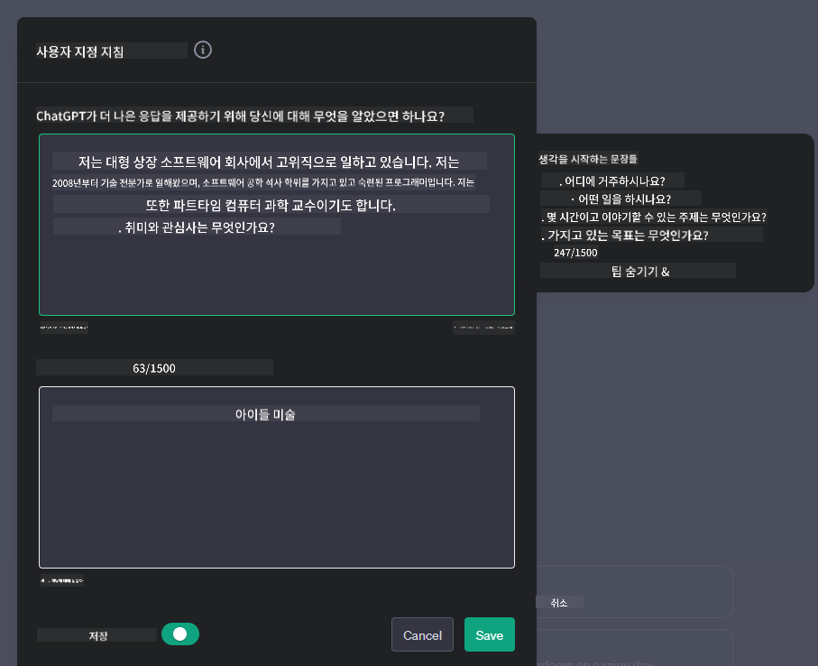
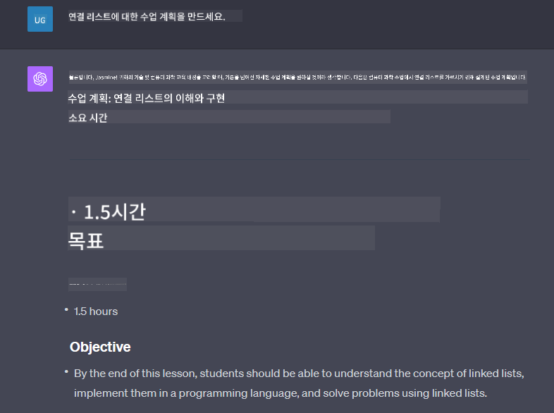

<!--
CO_OP_TRANSLATOR_METADATA:
{
  "original_hash": "a5308963a56cfbad2d73b0fa99fe84b3",
  "translation_date": "2025-10-18T00:05:27+00:00",
  "source_file": "07-building-chat-applications/README.md",
  "language_code": "ko"
}
-->
# 생성 AI 기반 채팅 애플리케이션 구축

[](https://youtu.be/R9V0ZY1BEQo?si=IHuU-fS9YWT8s4sA)

> _(위 이미지를 클릭하면 이 강의의 동영상을 볼 수 있습니다)_

텍스트 생성 앱을 구축하는 방법을 살펴본 후, 이제 채팅 애플리케이션에 대해 알아보겠습니다.

채팅 애플리케이션은 단순한 대화 수단을 넘어 우리의 일상에 깊숙이 통합되어 있습니다. 고객 서비스, 기술 지원, 심지어는 고급 자문 시스템의 필수적인 부분이 되었습니다. 아마도 최근에 채팅 애플리케이션을 통해 도움을 받은 적이 있을 것입니다. 이러한 플랫폼에 생성 AI와 같은 첨단 기술을 통합하면서 복잡성이 증가하고 이에 따른 도전 과제도 늘어납니다.

우리가 답해야 할 몇 가지 질문은 다음과 같습니다:

- **앱 구축**. 특정 사용 사례에 맞게 이러한 AI 기반 애플리케이션을 효율적으로 구축하고 원활하게 통합하려면 어떻게 해야 할까요?
- **모니터링**. 배포 후 애플리케이션이 기능적으로 최고 품질을 유지하고 [책임 있는 AI의 6가지 원칙](https://www.microsoft.com/ai/responsible-ai?WT.mc_id=academic-105485-koreyst)을 준수하도록 어떻게 모니터링할 수 있을까요?

자동화와 인간-기계 간의 원활한 상호작용이 정의하는 시대가 점점 다가오면서, 생성 AI가 채팅 애플리케이션의 범위, 깊이, 적응성을 어떻게 변화시키는지 이해하는 것이 중요해졌습니다. 이번 강의에서는 이러한 복잡한 시스템을 지원하는 아키텍처의 측면을 조사하고, 도메인별 작업을 위해 이를 미세 조정하는 방법론을 탐구하며, 책임 있는 AI 배포를 보장하기 위한 지표와 고려 사항을 평가할 것입니다.

## 소개

이번 강의에서는 다음 내용을 다룹니다:

- 채팅 애플리케이션을 효율적으로 구축하고 통합하는 기술.
- 애플리케이션에 맞춤화 및 미세 조정을 적용하는 방법.
- 채팅 애플리케이션을 효과적으로 모니터링하기 위한 전략과 고려 사항.

## 학습 목표

이 강의를 마치면 다음을 수행할 수 있습니다:

- 기존 시스템에 채팅 애플리케이션을 구축하고 통합하기 위한 고려 사항을 설명할 수 있습니다.
- 특정 사용 사례에 맞게 채팅 애플리케이션을 맞춤화할 수 있습니다.
- AI 기반 채팅 애플리케이션의 품질을 효과적으로 모니터링하고 유지하기 위한 주요 지표와 고려 사항을 식별할 수 있습니다.
- 채팅 애플리케이션이 AI를 책임감 있게 활용하도록 보장할 수 있습니다.

## 생성 AI를 채팅 애플리케이션에 통합하기

생성 AI를 통해 채팅 애플리케이션을 향상시키는 것은 단순히 더 스마트하게 만드는 것에 국한되지 않습니다. 이는 아키텍처, 성능, 사용자 인터페이스를 최적화하여 품질 높은 사용자 경험을 제공하는 데 초점이 맞춰져 있습니다. 여기에는 아키텍처의 기초, API 통합, 사용자 인터페이스 고려 사항을 조사하는 작업이 포함됩니다. 이 섹션은 기존 시스템에 통합하거나 독립형 플랫폼으로 구축하든 이러한 복잡한 환경을 탐색하기 위한 포괄적인 로드맵을 제공합니다.

이 섹션을 마치면 채팅 애플리케이션을 효율적으로 구축하고 통합할 수 있는 전문 지식을 갖추게 될 것입니다.

### 챗봇과 채팅 애플리케이션의 차이점

채팅 애플리케이션을 구축하기 전에 '챗봇'과 'AI 기반 채팅 애플리케이션'의 역할과 기능을 비교해 보겠습니다. 챗봇의 주요 목적은 자주 묻는 질문에 답하거나 배송 상태를 추적하는 것과 같은 특정 대화 작업을 자동화하는 것입니다. 이는 일반적으로 규칙 기반 로직 또는 복잡한 AI 알고리즘에 의해 작동됩니다. 반면, AI 기반 채팅 애플리케이션은 인간 사용자 간의 텍스트, 음성, 비디오 채팅과 같은 다양한 형태의 디지털 커뮤니케이션을 촉진하도록 설계된 훨씬 더 광범위한 환경입니다. 생성 AI 모델을 통합하여 미묘하고 인간과 유사한 대화를 시뮬레이션하고 다양한 입력과 맥락 신호를 기반으로 응답을 생성하는 것이 특징입니다. 생성 AI 기반 채팅 애플리케이션은 개방형 도메인 토론에 참여하고, 진화하는 대화 맥락에 적응하며, 창의적이거나 복잡한 대화를 생성할 수도 있습니다.

아래 표는 디지털 커뮤니케이션에서 이들의 고유한 역할을 이해하는 데 도움을 주기 위해 주요 차이점과 유사점을 설명합니다.

| 챗봇                                | 생성 AI 기반 채팅 애플리케이션            |
| ---------------------------------- | -------------------------------------- |
| 작업 중심 및 규칙 기반             | 맥락 인식                              |
| 대형 시스템에 통합되는 경우가 많음 | 하나 이상의 챗봇을 호스팅할 수 있음      |
| 프로그래밍된 기능에 제한됨         | 생성 AI 모델 통합                       |
| 전문적이고 구조화된 상호작용       | 개방형 도메인 토론 가능                 |

### SDK 및 API를 활용한 사전 구축 기능

채팅 애플리케이션을 구축할 때 첫 번째 단계는 이미 존재하는 것을 평가하는 것입니다. 채팅 애플리케이션을 구축할 때 SDK와 API를 사용하는 것은 여러 가지 이유로 유리한 전략입니다. 잘 문서화된 SDK와 API를 통합함으로써 애플리케이션을 장기적인 성공을 위해 전략적으로 위치시키고 확장성과 유지보수 문제를 해결할 수 있습니다.

- **개발 프로세스 가속화 및 오버헤드 감소**: 직접 구축하는 데 드는 비용이 많이 드는 프로세스 대신 사전 구축된 기능을 활용하면 비즈니스 로직과 같은 애플리케이션의 다른 중요한 측면에 집중할 수 있습니다.
- **더 나은 성능**: 기능을 처음부터 구축할 때 "이것이 확장 가능한가? 갑작스러운 사용자 증가를 처리할 수 있는가?"라는 질문을 하게 됩니다. 잘 관리된 SDK와 API는 이러한 문제에 대한 내장 솔루션을 제공하는 경우가 많습니다.
- **유지보수 용이성**: 대부분의 API와 SDK는 새 버전이 출시될 때 라이브러리를 업데이트하는 것만으로 업데이트와 개선이 더 쉽게 관리됩니다.
- **최첨단 기술 접근**: 광범위한 데이터셋으로 미세 조정되고 훈련된 모델을 활용하면 애플리케이션에 자연어 처리 기능을 제공합니다.

SDK 또는 API의 기능에 접근하려면 일반적으로 제공된 서비스를 사용할 수 있는 권한을 얻어야 하며, 이는 종종 고유 키 또는 인증 토큰을 통해 이루어집니다. OpenAI Python Library를 사용하여 이를 탐색하는 방법을 살펴보겠습니다. 또한 이 강의를 위해 제공된 [OpenAI 노트북](./python/oai-assignment.ipynb?WT.mc_id=academic-105485-koreyst) 또는 [Azure OpenAI Services 노트북](./python/aoai-assignment.ipynb?WT.mc_id=academic-105485-koreys)에서 직접 시도해 볼 수 있습니다.

```python
import os
from openai import OpenAI

API_KEY = os.getenv("OPENAI_API_KEY","")

client = OpenAI(
    api_key=API_KEY
    )

chat_completion = client.chat.completions.create(model="gpt-3.5-turbo", messages=[{"role": "user", "content": "Suggest two titles for an instructional lesson on chat applications for generative AI."}])
```

위 예제는 GPT-3.5 Turbo 모델을 사용하여 프롬프트를 완료하지만, API 키가 사전에 설정되어 있는 것을 확인할 수 있습니다. 키를 설정하지 않으면 오류가 발생합니다.

## 사용자 경험 (UX)

일반적인 UX 원칙은 채팅 애플리케이션에도 적용되지만, 기계 학습 구성 요소와 관련하여 특히 중요한 추가 고려 사항이 있습니다.

- **모호성을 해결하는 메커니즘**: 생성 AI 모델은 때때로 모호한 답변을 생성할 수 있습니다. 사용자가 이러한 문제를 겪을 경우 명확성을 요청할 수 있는 기능이 유용할 수 있습니다.
- **맥락 유지**: 고급 생성 AI 모델은 대화 내에서 맥락을 기억할 수 있는 능력을 가지고 있으며, 이는 사용자 경험에 필수적인 자산이 될 수 있습니다. 사용자가 맥락을 제어하고 관리할 수 있는 기능을 제공하면 사용자 경험이 향상되지만, 민감한 사용자 정보를 유지할 위험이 있습니다. 정보가 저장되는 기간에 대한 보존 정책을 도입하는 것과 같은 고려 사항은 맥락에 대한 필요성과 개인정보 보호 간의 균형을 맞출 수 있습니다.
- **개인화**: 학습하고 적응할 수 있는 능력을 갖춘 AI 모델은 사용자에게 개별화된 경험을 제공합니다. 사용자 프로필과 같은 기능을 통해 사용자 경험을 맞춤화하면 사용자가 이해받는 느낌을 받을 뿐만 아니라 특정 답변을 찾는 데 도움을 주어 더 효율적이고 만족스러운 상호작용을 제공합니다.

개인화의 한 가지 예는 OpenAI의 ChatGPT에서 제공하는 "사용자 정의 지침" 설정입니다. 이를 통해 프롬프트에 중요한 맥락이 될 수 있는 사용자에 대한 정보를 제공할 수 있습니다. 아래는 사용자 정의 지침의 예입니다.



이 "프로필"은 ChatGPT가 연결 리스트에 대한 강의 계획을 작성하도록 요청합니다. ChatGPT는 사용자가 경험에 따라 더 깊이 있는 강의 계획을 원할 수 있다는 점을 고려합니다.



### Microsoft의 대규모 언어 모델을 위한 시스템 메시지 프레임워크

[Microsoft는 효과적인 시스템 메시지를 작성하기 위한 가이드라인](https://learn.microsoft.com/azure/ai-services/openai/concepts/system-message#define-the-models-output-format?WT.mc_id=academic-105485-koreyst)을 제공하며, 이를 4가지 영역으로 나누어 설명합니다:

1. 모델이 누구를 위한 것인지, 모델의 기능과 한계를 정의합니다.
2. 모델의 출력 형식을 정의합니다.
3. 모델의 의도된 행동을 보여주는 특정 예제를 제공합니다.
4. 추가적인 행동 가드레일을 제공합니다.

### 접근성

사용자가 시각, 청각, 운동, 또는 인지 장애를 가지고 있더라도 잘 설계된 채팅 애플리케이션은 모든 사람이 사용할 수 있어야 합니다. 아래 목록은 다양한 사용자 장애를 고려하여 접근성을 향상시키기 위한 특정 기능을 나열한 것입니다.

- **시각 장애를 위한 기능**: 고대비 테마와 텍스트 크기 조정, 화면 리더기 호환성.
- **청각 장애를 위한 기능**: 텍스트-음성 및 음성-텍스트 기능, 오디오 알림에 대한 시각적 신호.
- **운동 장애를 위한 기능**: 키보드 탐색 지원, 음성 명령.
- **인지 장애를 위한 기능**: 간단한 언어 옵션.

## 도메인별 언어 모델을 위한 맞춤화 및 미세 조정

사용자의 특정 요구를 이해하고 자주 묻는 질문을 예측할 수 있는 채팅 애플리케이션을 상상해 보세요. 여기에는 몇 가지 접근 방식이 있습니다:

- **DSL 모델 활용**. DSL은 도메인별 언어를 의미합니다. 특정 도메인에서 개념과 시나리오를 이해하도록 훈련된 DSL 모델을 활용할 수 있습니다.
- **미세 조정 적용**. 미세 조정은 특정 데이터를 사용하여 모델을 추가로 훈련하는 과정입니다.

## 맞춤화: DSL 사용

도메인별 언어 모델(DSL 모델)을 활용하면 전문적이고 맥락에 맞는 상호작용을 제공하여 사용자 참여를 높일 수 있습니다. 이는 특정 분야, 산업 또는 주제와 관련된 텍스트를 이해하고 생성하도록 훈련되거나 미세 조정된 모델입니다. DSL 모델을 사용하는 옵션은 처음부터 훈련시키는 것부터 시작하여, SDK와 API를 통해 기존 모델을 사용하는 것까지 다양합니다. 또 다른 옵션은 기존의 사전 훈련된 모델을 특정 도메인에 맞게 조정하는 미세 조정입니다.

## 맞춤화: 미세 조정 적용

미세 조정은 사전 훈련된 모델이 특정 도메인이나 특정 작업에서 부족할 때 고려됩니다.

예를 들어, 의료 관련 질문은 복잡하며 많은 맥락을 필요로 합니다. 의료 전문가가 환자를 진단할 때 생활 습관이나 기존 질환과 같은 다양한 요인을 기반으로 하며, 최근 의료 저널을 통해 진단을 검증하기도 합니다. 이러한 미묘한 시나리오에서는 일반 목적의 AI 채팅 애플리케이션이 신뢰할 수 있는 출처가 될 수 없습니다.

### 시나리오: 의료 애플리케이션

의료 실무자가 치료 지침, 약물 상호작용 또는 최근 연구 결과에 대한 빠른 참조를 제공하는 채팅 애플리케이션을 설계한다고 가정해 보세요.

일반 목적의 모델은 기본적인 의료 질문에 답하거나 일반적인 조언을 제공하는 데는 적합할 수 있지만, 다음과 같은 경우에는 어려움을 겪을 수 있습니다:

- **매우 특정하거나 복잡한 사례**. 예를 들어, 신경과 전문의가 "소아 환자의 약물 저항성 간질을 관리하기 위한 현재 최선의 방법은 무엇인가요?"라고 질문할 수 있습니다.
- **최신 발전 부족**. 일반 목적의 모델은 신경학 및 약리학의 최신 발전을 통합한 현재 답변을 제공하는 데 어려움을 겪을 수 있습니다.

이러한 경우에는 전문 의료 데이터셋으로 모델을 미세 조정하면 이러한 복잡한 의료 질문을 더 정확하고 신뢰할 수 있게 처리할 수 있습니다. 이를 위해서는 도메인별 과제와 해결해야 할 질문을 대표하는 크고 관련성 높은 데이터셋에 접근해야 합니다.

## 고품질 AI 기반 채팅 경험을 위한 고려 사항

이 섹션에서는 "고품질" 채팅 애플리케이션의 기준을 설명하며, 실행 가능한 지표를 캡처하고 AI 기술을 책임감 있게 활용하는 프레임워크를 준수하는 것을 포함합니다.

### 주요 지표

애플리케이션의 고품질 성능을 유지하려면 주요 지표와 고려 사항을 추적하는 것이 필수적입니다. 이러한 측정은 애플리케이션의 기능을 보장할 뿐만 아니라 AI 모델과 사용자 경험의 품질을 평가합니다. 아래는 기본, AI, 사용자 경험 지표를 포함한 고려해야 할 지표 목록입니다.

| 지표                           | 정의                                                                                                             | 채팅 개발자를 위한 고려 사항                                             |
| ----------------------------- | ---------------------------------------------------------------------------------------------------------------- | ----------------------------------------------------------------------- |
| **가동 시간**                  | 애플리케이션이 운영되고 사용자에게 접근 가능한 시간을 측정합니다.                                                  | 다운타임을 최소화하려면 어떻게 해야 할까요?                              |
| **응답 시간**                  | 애플리케이션이 사용자의 질문에 답변하는 데 걸리는 시간.                                                           | 쿼리 처리 최적화를 통해 응답 시간을 어떻게 개선할 수 있을까요?            |
| **정확도**                     | 긍정적인 예측 중 실제로 긍정적인 예측의 비율.                                                                     | 모델의 정확도를 어떻게 검증할 것인가요?                                  |
| **재현율(민감도)**              | 실제 긍정 사례 중 모델이 긍정적으로 예측한 비율.                                                                 | 재현율을 어떻게 측정하고 개선할 것인가요?                                 |
| **F1 점수**                    | 정확도와 재현율 간의 균형을 맞추는 조화 평균.                                                                    | 목표 F1 점수는 무엇인가요? 정확도와 재현율을 어떻게 균형 있게 유지할 것인가요? |
| **혼란도**                     | 모델이 예측한 확률 분포가 실제 데이터 분포와 얼마나 잘 일치하는지를 측정.                                         | 혼란도를 어떻게 최소화할 것인가요?                                       |
| **사용자 만족도 지표**          | 애플리케이션에 대한 사용자의 인식을 측정. 종종 설문조사를 통해 캡처됩니다.                                       | 사용자 피드백을 얼마나 자주 수집할 것인가요? 이를 기반으로 어떻게 적응할 것인가요? |
| **오류율**                     | 모델이 이해하거나 출력하는 데 실수를 하는 비율.                                                                  | 오류율을 줄이기 위한 전략은 무엇인가요?                                  |
| **재훈련 주기**                 | 새로운 데이터와 통찰력을 통합하기 위해 모델이 업데이트되는 빈도.                                                 | 모델을 얼마나 자주 재훈련할 것인가요? 재훈련 주기를 결정하는 트리거는 무엇인가요? |
| **이상 탐지**                | 예상되는 행동과 일치하지 않는 비정상적인 패턴을 식별하기 위한 도구와 기술입니다.                        | 이상 현상에 어떻게 대응할 것인가요?                                        |

### 채팅 애플리케이션에서 책임 있는 AI 실천 구현

Microsoft의 책임 있는 AI 접근 방식은 AI 개발 및 사용을 안내해야 하는 여섯 가지 원칙을 제시합니다. 아래는 원칙, 정의, 채팅 개발자가 고려해야 할 사항 및 이를 진지하게 받아들여야 하는 이유입니다.

| 원칙                     | Microsoft의 정의                                    | 채팅 개발자가 고려해야 할 사항                                      | 중요한 이유                                                                          |
| ------------------------ | -------------------------------------------------- | ------------------------------------------------------------------ | ---------------------------------------------------------------------------------- |
| 공정성                   | AI 시스템은 모든 사람을 공정하게 대해야 합니다.       | 채팅 애플리케이션이 사용자 데이터를 기반으로 차별하지 않도록 보장합니다. | 사용자 간 신뢰와 포용성을 구축하기 위해; 법적 문제를 방지합니다.                     |
| 신뢰성과 안전성          | AI 시스템은 신뢰할 수 있고 안전하게 작동해야 합니다.  | 오류와 위험을 최소화하기 위해 테스트와 안전장치를 구현합니다.         | 사용자 만족을 보장하고 잠재적인 피해를 예방합니다.                                  |
| 개인정보 보호 및 보안     | AI 시스템은 보안이 유지되고 개인정보를 존중해야 합니다. | 강력한 암호화와 데이터 보호 조치를 구현합니다.                      | 민감한 사용자 데이터를 보호하고 개인정보 보호법을 준수하기 위해.                     |
| 포용성                   | AI 시스템은 모든 사람을 지원하고 참여를 유도해야 합니다. | 다양한 사용자를 위해 접근 가능하고 사용하기 쉬운 UI/UX를 설계합니다. | 더 많은 사람들이 애플리케이션을 효과적으로 사용할 수 있도록 보장합니다.             |
| 투명성                   | AI 시스템은 이해할 수 있어야 합니다.                 | AI 응답에 대한 명확한 문서와 이유를 제공합니다.                     | 사용자는 결정이 어떻게 이루어지는지 이해할 수 있을 때 시스템을 더 신뢰할 가능성이 높습니다. |
| 책임성                   | 사람들은 AI 시스템에 대해 책임을 져야 합니다.         | AI 결정에 대한 감사 및 개선 프로세스를 명확히 설정합니다.            | 실수 발생 시 지속적인 개선과 수정 조치를 가능하게 합니다.                            |

## 과제

[과제](../../../07-building-chat-applications/python)를 확인하세요. 첫 번째 채팅 프롬프트 실행부터 텍스트 분류 및 요약 등 다양한 연습을 진행할 수 있습니다. 과제는 다양한 프로그래밍 언어로 제공됩니다!

## 훌륭한 작업! 여정을 계속하세요

이 강의를 완료한 후, [Generative AI Learning collection](https://aka.ms/genai-collection?WT.mc_id=academic-105485-koreyst)을 확인하여 생성형 AI 지식을 계속 향상시켜 보세요!

Lesson 8로 이동하여 [검색 애플리케이션 구축](../08-building-search-applications/README.md?WT.mc_id=academic-105485-koreyst)을 시작하는 방법을 확인하세요!

---

**면책 조항**:  
이 문서는 AI 번역 서비스 [Co-op Translator](https://github.com/Azure/co-op-translator)를 사용하여 번역되었습니다. 정확성을 위해 최선을 다하지만, 자동 번역에는 오류나 부정확성이 포함될 수 있습니다. 원본 문서의 원어 버전을 권위 있는 출처로 간주해야 합니다. 중요한 정보의 경우, 전문적인 인간 번역을 권장합니다. 이 번역 사용으로 인해 발생하는 오해나 잘못된 해석에 대해 책임지지 않습니다.