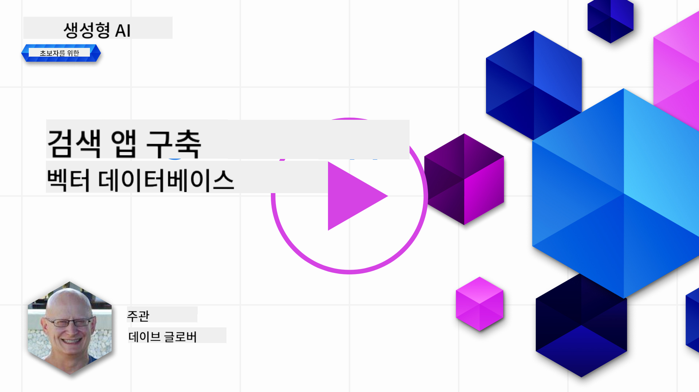
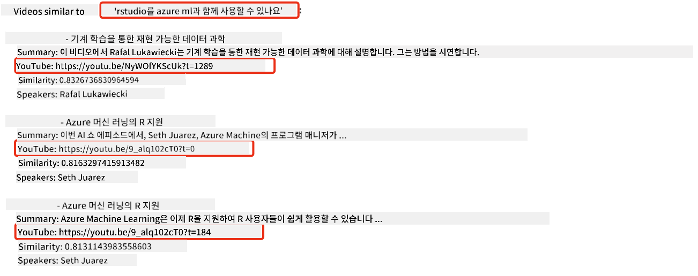
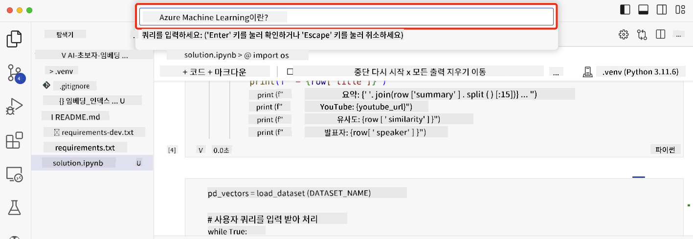

<!--
CO_OP_TRANSLATOR_METADATA:
{
  "original_hash": "d46aad0917a1a342d613e2c13d457da5",
  "translation_date": "2025-07-09T12:50:23+00:00",
  "source_file": "08-building-search-applications/README.md",
  "language_code": "ko"
}
-->
# 검색 애플리케이션 구축하기

[](https://aka.ms/gen-ai-lesson8-gh?WT.mc_id=academic-105485-koreyst)

> > _위 이미지를 클릭하면 이 수업의 동영상을 볼 수 있습니다_

LLM은 챗봇이나 텍스트 생성뿐만 아니라 임베딩을 활용해 검색 애플리케이션을 만드는 것도 가능합니다. 임베딩은 벡터라고도 불리는 데이터의 수치적 표현으로, 데이터에 대한 의미 기반 검색에 활용할 수 있습니다.

이번 수업에서는 교육 스타트업을 위한 검색 애플리케이션을 만들어 봅니다. 저희 스타트업은 개발도상국 학생들에게 무료 교육을 제공하는 비영리 단체입니다. AI를 배우기 위해 학생들이 활용할 수 있는 많은 유튜브 영상이 있으며, 학생들이 질문을 입력하면 관련된 유튜브 영상을 검색할 수 있는 애플리케이션을 만들고자 합니다.

예를 들어, 학생이 'Jupyter Notebooks가 무엇인가요?' 또는 'Azure ML이란 무엇인가요?'라고 입력하면, 검색 애플리케이션은 질문과 관련된 유튜브 영상 목록을 반환하고, 더 나아가 질문에 대한 답변이 나오는 영상 내 위치로 연결되는 링크도 제공합니다.

## 소개

이번 수업에서 다룰 내용은 다음과 같습니다:

- 의미 기반 검색과 키워드 검색의 차이
- 텍스트 임베딩이란 무엇인가
- 텍스트 임베딩 인덱스 생성하기
- 텍스트 임베딩 인덱스 검색하기

## 학습 목표

수업을 마치면 다음을 할 수 있습니다:

- 의미 기반 검색과 키워드 검색의 차이를 설명할 수 있다.
- 텍스트 임베딩이 무엇인지 설명할 수 있다.
- 임베딩을 활용해 데이터를 검색하는 애플리케이션을 만들 수 있다.

## 왜 검색 애플리케이션을 만들까요?

검색 애플리케이션을 만들면서 임베딩을 활용해 데이터를 검색하는 방법을 이해할 수 있습니다. 또한 학생들이 정보를 빠르게 찾을 수 있도록 돕는 검색 애플리케이션을 구축하는 방법을 배울 수 있습니다.

이번 수업에는 Microsoft [AI Show](https://www.youtube.com/playlist?list=PLlrxD0HtieHi0mwteKBOfEeOYf0LJU4O1) 유튜브 채널의 영상 대본 임베딩 인덱스가 포함되어 있습니다. AI Show는 AI와 머신러닝을 가르치는 유튜브 채널입니다. 임베딩 인덱스에는 2023년 10월까지의 유튜브 대본 임베딩이 포함되어 있습니다. 이 임베딩 인덱스를 활용해 스타트업을 위한 검색 애플리케이션을 만들 것입니다. 검색 애플리케이션은 질문에 대한 답변이 나오는 영상 내 위치로 연결되는 링크도 반환합니다. 학생들이 필요한 정보를 빠르게 찾는 데 매우 유용합니다.

아래는 'rstudio를 Azure ML과 함께 사용할 수 있나요?'라는 질문에 대한 의미 기반 쿼리 예시입니다. 유튜브 URL을 보면 질문에 대한 답변이 나오는 영상 위치로 이동하는 타임스탬프가 포함되어 있음을 알 수 있습니다.



## 의미 기반 검색이란?

의미 기반 검색이 무엇인지 궁금할 수 있습니다. 의미 기반 검색은 쿼리 내 단어들의 의미, 즉 의미론을 활용해 관련성 높은 결과를 반환하는 검색 기법입니다.

예를 들어, 자동차를 사고 싶다고 가정해 봅시다. '내 꿈의 차'를 검색하면 의미 기반 검색은 당신이 자동차에 대해 `꿈을 꾸는` 것이 아니라 `이상적인` 자동차를 찾고 있다는 의도를 이해합니다. 의미 기반 검색은 사용자의 의도를 파악해 관련성 높은 결과를 제공합니다. 반면, 키워드 검색은 문자 그대로 '꿈'과 '자동차'를 검색해 종종 관련 없는 결과를 반환합니다.

## 텍스트 임베딩이란?

[텍스트 임베딩](https://en.wikipedia.org/wiki/Word_embedding?WT.mc_id=academic-105485-koreyst)은 [자연어 처리](https://en.wikipedia.org/wiki/Natural_language_processing?WT.mc_id=academic-105485-koreyst)에서 사용하는 텍스트 표현 기법입니다. 텍스트 임베딩은 텍스트의 의미를 수치로 표현한 것입니다. 임베딩은 기계가 이해하기 쉬운 형태로 데이터를 표현하는 데 사용됩니다. 텍스트 임베딩을 생성하는 다양한 모델이 있지만, 이번 수업에서는 OpenAI 임베딩 모델을 사용해 임베딩을 생성하는 방법에 집중합니다.

예를 들어, AI Show 유튜브 채널의 한 에피소드 대본에 다음과 같은 텍스트가 있다고 가정해 봅시다:

```text
Today we are going to learn about Azure Machine Learning.
```

이 텍스트를 OpenAI 임베딩 API에 전달하면 1536개의 숫자로 구성된 임베딩 벡터를 반환합니다. 벡터 내 각 숫자는 텍스트의 서로 다른 측면을 나타냅니다. 간단히 첫 10개의 숫자만 보여드리면 다음과 같습니다.

```python
[-0.006655829958617687, 0.0026128944009542465, 0.008792596869170666, -0.02446001023054123, -0.008540431968867779, 0.022071078419685364, -0.010703742504119873, 0.003311325330287218, -0.011632772162556648, -0.02187200076878071, ...]
```

## 임베딩 인덱스는 어떻게 만들어지나요?

이번 수업의 임베딩 인덱스는 일련의 Python 스크립트로 생성되었습니다. 스크립트와 사용법은 이번 수업의 'scripts' 폴더 내 [README](./scripts/README.md?WT.mc_id=academic-105485-koreyst)에서 확인할 수 있습니다. 임베딩 인덱스가 제공되므로 이 스크립트를 직접 실행할 필요는 없습니다.

스크립트는 다음 작업을 수행합니다:

1. [AI Show](https://www.youtube.com/playlist?list=PLlrxD0HtieHi0mwteKBOfEeOYf0LJU4O1) 재생목록 내 각 유튜브 영상의 대본을 다운로드합니다.
2. [OpenAI Functions](https://learn.microsoft.com/azure/ai-services/openai/how-to/function-calling?WT.mc_id=academic-105485-koreyst)를 사용해 유튜브 대본 첫 3분에서 화자 이름을 추출하려 시도합니다. 각 영상의 화자 이름은 `embedding_index_3m.json` 임베딩 인덱스에 저장됩니다.
3. 대본 텍스트를 **3분 단위 텍스트 세그먼트**로 나눕니다. 각 세그먼트는 다음 세그먼트와 약 20단어가 겹치도록 포함해 임베딩이 끊기지 않고 더 나은 검색 컨텍스트를 제공합니다.
4. 각 텍스트 세그먼트를 OpenAI Chat API에 전달해 60단어 요약을 생성합니다. 요약도 `embedding_index_3m.json` 임베딩 인덱스에 저장됩니다.
5. 마지막으로 세그먼트 텍스트를 OpenAI 임베딩 API에 전달합니다. 임베딩 API는 세그먼트의 의미를 나타내는 1536차원 벡터를 반환합니다. 세그먼트와 임베딩 벡터는 `embedding_index_3m.json` 임베딩 인덱스에 저장됩니다.

### 벡터 데이터베이스

수업의 간단함을 위해 임베딩 인덱스는 `embedding_index_3m.json` JSON 파일에 저장되고 Pandas DataFrame으로 로드됩니다. 하지만 실제 운영 환경에서는 임베딩 인덱스를 [Azure Cognitive Search](https://learn.microsoft.com/training/modules/improve-search-results-vector-search?WT.mc_id=academic-105485-koreyst), [Redis](https://cookbook.openai.com/examples/vector_databases/redis/readme?WT.mc_id=academic-105485-koreyst), [Pinecone](https://cookbook.openai.com/examples/vector_databases/pinecone/readme?WT.mc_id=academic-105485-koreyst), [Weaviate](https://cookbook.openai.com/examples/vector_databases/weaviate/readme?WT.mc_id=academic-105485-koreyst) 등 벡터 데이터베이스에 저장합니다.

## 코사인 유사도 이해하기

텍스트 임베딩에 대해 배웠으니, 이제 텍스트 임베딩을 활용해 데이터를 검색하는 방법, 특히 코사인 유사도를 사용해 주어진 쿼리와 가장 유사한 임베딩을 찾는 방법을 배워봅니다.

### 코사인 유사도란?

코사인 유사도는 두 벡터 간 유사도를 측정하는 방법으로, `최근접 이웃 검색`이라고도 합니다. 코사인 유사도 검색을 하려면 OpenAI 임베딩 API를 사용해 쿼리 텍스트를 벡터화해야 합니다. 그런 다음 쿼리 벡터와 임베딩 인덱스 내 각 벡터 간 코사인 유사도를 계산합니다. 임베딩 인덱스에는 각 유튜브 대본 텍스트 세그먼트에 대한 벡터가 저장되어 있습니다. 마지막으로 코사인 유사도 순으로 결과를 정렬하면, 가장 유사한 텍스트 세그먼트를 찾을 수 있습니다.

수학적으로 코사인 유사도는 다차원 공간에 투영된 두 벡터 사이의 각도의 코사인을 측정합니다. 이 방법은 문서 크기 차이로 인해 유클리드 거리상 멀리 떨어져 있어도 각도가 작아 코사인 유사도가 높을 수 있다는 점에서 유용합니다. 코사인 유사도 공식에 대한 자세한 내용은 [Cosine similarity](https://en.wikipedia.org/wiki/Cosine_similarity?WT.mc_id=academic-105485-koreyst)를 참고하세요.

## 첫 번째 검색 애플리케이션 만들기

이제 임베딩을 활용해 검색 애플리케이션을 만드는 방법을 배워봅니다. 이 애플리케이션은 학생들이 질문을 입력하면 관련된 영상을 검색해 목록으로 보여주고, 질문에 대한 답변이 나오는 영상 위치로 연결되는 링크도 제공합니다.

이 솔루션은 Windows 11, macOS, Ubuntu 22.04에서 Python 3.10 이상으로 구축 및 테스트되었습니다. Python은 [python.org](https://www.python.org/downloads/?WT.mc_id=academic-105485-koreyst)에서 다운로드할 수 있습니다.

## 과제 - 학생들을 위한 검색 애플리케이션 구축

수업 초반에 소개한 스타트업을 위해 학생들이 평가 과제용 검색 애플리케이션을 만들 수 있도록 지원할 차례입니다.

이번 과제에서는 검색 애플리케이션 구축에 사용할 Azure OpenAI 서비스를 생성합니다. 다음 Azure OpenAI 서비스를 생성해야 하며, 과제를 완료하려면 Azure 구독이 필요합니다.

### Azure Cloud Shell 시작하기

1. [Azure 포털](https://portal.azure.com/?WT.mc_id=academic-105485-koreyst)에 로그인합니다.
2. Azure 포털 우측 상단의 Cloud Shell 아이콘을 선택합니다.
3. 환경 유형으로 **Bash**를 선택합니다.

#### 리소스 그룹 생성

> 이 안내에서는 East US 지역에 "semantic-video-search"라는 리소스 그룹을 사용합니다.
> 리소스 그룹 이름은 변경할 수 있지만, 리소스 위치를 변경할 경우
> [모델 가용성 표](https://aka.ms/oai/models?WT.mc_id=academic-105485-koreyst)를 확인하세요.

```shell
az group create --name semantic-video-search --location eastus
```

#### Azure OpenAI 서비스 리소스 생성

Azure Cloud Shell에서 다음 명령어를 실행해 Azure OpenAI 서비스 리소스를 생성합니다.

```shell
az cognitiveservices account create --name semantic-video-openai --resource-group semantic-video-search \
    --location eastus --kind OpenAI --sku s0
```

#### 애플리케이션에서 사용할 엔드포인트 및 키 가져오기

Azure Cloud Shell에서 다음 명령어를 실행해 Azure OpenAI 서비스 리소스의 엔드포인트와 키를 가져옵니다.

```shell
az cognitiveservices account show --name semantic-video-openai \
   --resource-group  semantic-video-search | jq -r .properties.endpoint
az cognitiveservices account keys list --name semantic-video-openai \
   --resource-group semantic-video-search | jq -r .key1
```

#### OpenAI 임베딩 모델 배포

Azure Cloud Shell에서 다음 명령어를 실행해 OpenAI 임베딩 모델을 배포합니다.

```shell
az cognitiveservices account deployment create \
    --name semantic-video-openai \
    --resource-group  semantic-video-search \
    --deployment-name text-embedding-ada-002 \
    --model-name text-embedding-ada-002 \
    --model-version "2"  \
    --model-format OpenAI \
    --sku-capacity 100 --sku-name "Standard"
```

## 솔루션

GitHub Codespaces에서 [솔루션 노트북](../../../08-building-search-applications/python/aoai-solution.ipynb)을 열고 Jupyter 노트북의 안내를 따라 진행하세요.

노트북을 실행하면 쿼리를 입력하라는 메시지가 나타납니다. 입력창은 다음과 같이 보입니다:



## 잘 하셨어요! 계속 학습하세요

이번 수업을 마친 후에는 [Generative AI 학습 컬렉션](https://aka.ms/genai-collection?WT.mc_id=academic-105485-koreyst)을 확인해 Generative AI 지식을 더 높여보세요!

다음 9강에서는 [이미지 생성 애플리케이션 구축](../09-building-image-applications/README.md?WT.mc_id=academic-105485-koreyst)에 대해 다룹니다!

**면책 조항**:  
이 문서는 AI 번역 서비스 [Co-op Translator](https://github.com/Azure/co-op-translator)를 사용하여 번역되었습니다. 정확성을 위해 최선을 다하고 있으나, 자동 번역에는 오류나 부정확한 부분이 있을 수 있음을 유의하시기 바랍니다. 원문은 해당 언어의 원본 문서가 권위 있는 출처로 간주되어야 합니다. 중요한 정보의 경우 전문적인 인간 번역을 권장합니다. 본 번역 사용으로 인해 발생하는 오해나 잘못된 해석에 대해 당사는 책임을 지지 않습니다.