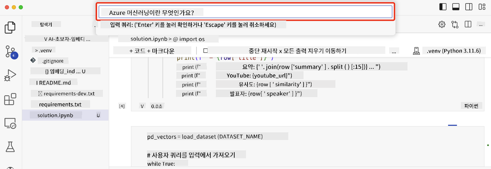

<!--
CO_OP_TRANSLATOR_METADATA:
{
  "original_hash": "d46aad0917a1a342d613e2c13d457da5",
  "translation_date": "2025-05-19T10:21:47+00:00",
  "source_file": "08-building-search-applications/README.md",
  "language_code": "ko"
}
-->
# 검색 애플리케이션 구축하기

[](https://aka.ms/gen-ai-lesson8-gh?WT.mc_id=academic-105485-koreyst)

> > _위의 이미지를 클릭하면 이 강의의 비디오를 볼 수 있습니다_

LLM은 챗봇과 텍스트 생성 외에도 더 많은 기능을 제공합니다. 임베딩을 사용하여 검색 애플리케이션을 구축하는 것도 가능합니다. 임베딩은 데이터의 숫자 표현, 즉 벡터로 알려져 있으며, 데이터의 의미적 검색에 사용할 수 있습니다.

이 강의에서는 교육 스타트업을 위한 검색 애플리케이션을 구축할 것입니다. 우리 스타트업은 개발도상국 학생들에게 무료 교육을 제공하는 비영리 조직입니다. 우리 스타트업은 학생들이 AI를 배우기 위해 사용할 수 있는 많은 YouTube 동영상을 보유하고 있습니다. 우리 스타트업은 학생들이 질문을 입력하여 YouTube 동영상을 검색할 수 있는 검색 애플리케이션을 만들고자 합니다.

예를 들어, 학생이 'Jupyter 노트북이 무엇인가요?' 또는 'Azure ML이 무엇인가요?'와 같은 질문을 입력하면 검색 애플리케이션은 해당 질문과 관련된 YouTube 동영상 목록을 반환하고, 더 나아가 질문의 답변이 위치한 동영상의 특정 부분 링크를 반환합니다.

## 소개

이 강의에서 다룰 내용:

- 의미 검색 vs 키워드 검색
- 텍스트 임베딩이란 무엇인가
- 텍스트 임베딩 인덱스 생성하기
- 텍스트 임베딩 인덱스 검색하기

## 학습 목표

이 강의를 완료하면 다음을 할 수 있습니다:

- 의미 검색과 키워드 검색의 차이점을 설명할 수 있습니다.
- 텍스트 임베딩이 무엇인지 설명할 수 있습니다.
- 임베딩을 사용하여 데이터를 검색하는 애플리케이션을 만들 수 있습니다.

## 왜 검색 애플리케이션을 구축해야 하나요?

검색 애플리케이션을 만드는 것은 임베딩을 사용하여 데이터를 검색하는 방법을 이해하는 데 도움이 됩니다. 또한 학생들이 정보를 빠르게 찾을 수 있는 검색 애플리케이션을 만드는 방법을 배울 수 있습니다.

강의에는 Microsoft [AI Show](https://www.youtube.com/playlist?list=PLlrxD0HtieHi0mwteKBOfEeOYf0LJU4O1) YouTube 채널의 YouTube 트랜스크립트에 대한 임베딩 인덱스가 포함되어 있습니다. AI Show는 AI와 머신 러닝에 대해 알려주는 YouTube 채널입니다. 임베딩 인덱스에는 2023년 10월까지의 각 YouTube 트랜스크립트에 대한 임베딩이 포함되어 있습니다. 이 임베딩 인덱스를 사용하여 스타트업을 위한 검색 애플리케이션을 구축할 것입니다. 검색 애플리케이션은 질문의 답변이 위치한 동영상의 특정 부분 링크를 반환합니다. 이는 학생들이 필요한 정보를 빠르게 찾는 훌륭한 방법입니다.

다음은 'Azure ML과 함께 rstudio를 사용할 수 있나요?'라는 질문에 대한 의미적 쿼리 예입니다. YouTube URL을 확인하면 질문의 답변이 위치한 동영상의 특정 부분으로 이동하는 타임스탬프가 포함된 URL을 볼 수 있습니다.


## 의미 검색이란 무엇인가요?

이제 의미 검색이 무엇인지 궁금할 수 있습니다. 의미 검색은 쿼리의 단어 의미를 사용하여 관련 결과를 반환하는 검색 기술입니다.

여기 의미 검색의 예가 있습니다. 예를 들어, 자동차를 구매하려고 할 때 '내 꿈의 차'를 검색할 수 있습니다. 의미 검색은 당신이 `dreaming` 자동차에 대해 말하고 있는 것이 아니라, 당신이 구매하려고 하는 `ideal` 자동차를 찾고 있다는 것을 이해합니다. 의미 검색은 당신의 의도를 이해하고 관련 결과를 반환합니다. 대안으로 `keyword search`는 자동차에 대한 꿈을 문자 그대로 검색하여 종종 관련 없는 결과를 반환합니다.

## 텍스트 임베딩이란 무엇인가요?

[텍스트 임베딩](https://en.wikipedia.org/wiki/Word_embedding?WT.mc_id=academic-105485-koreyst)은 [자연어 처리](https://en.wikipedia.org/wiki/Natural_language_processing?WT.mc_id=academic-105485-koreyst)에서 사용되는 텍스트 표현 기술입니다. 텍스트 임베딩은 텍스트의 의미적 숫자 표현입니다. 임베딩은 데이터를 기계가 이해하기 쉽게 표현하는 데 사용됩니다. 텍스트 임베딩을 구축하는 많은 모델이 있으며, 이 강의에서는 OpenAI 임베딩 모델을 사용하여 임베딩을 생성하는 데 초점을 맞출 것입니다.

예를 들어, 다음 텍스트가 AI Show YouTube 채널의 에피소드 중 하나에서 가져온 트랜스크립트에 있다고 상상해 보세요:

```text
Today we are going to learn about Azure Machine Learning.
```

텍스트를 OpenAI 임베딩 API에 전달하면 1536개의 숫자로 구성된 임베딩, 즉 벡터를 반환합니다. 벡터의 각 숫자는 텍스트의 다른 측면을 나타냅니다. 간략하게, 벡터의 처음 10개의 숫자는 다음과 같습니다.

```python
[-0.006655829958617687, 0.0026128944009542465, 0.008792596869170666, -0.02446001023054123, -0.008540431968867779, 0.022071078419685364, -0.010703742504119873, 0.003311325330287218, -0.011632772162556648, -0.02187200076878071, ...]
```

## 임베딩 인덱스는 어떻게 생성되나요?

이 강의의 임베딩 인덱스는 일련의 Python 스크립트를 사용하여 생성되었습니다. 'scripts' 폴더의 [README](./scripts/README.md?WT.mc_id=academic-105485-koreyst)에서 스크립트와 지침을 찾을 수 있습니다. 이 강의를 완료하기 위해 이러한 스크립트를 실행할 필요는 없으며, 임베딩 인덱스는 제공됩니다.

스크립트는 다음 작업을 수행합니다:

1. [AI Show](https://www.youtube.com/playlist?list=PLlrxD0HtieHi0mwteKBOfEeOYf0LJU4O1) 플레이리스트의 각 YouTube 비디오의 트랜스크립트를 다운로드합니다.
2. [OpenAI Functions](https://learn.microsoft.com/azure/ai-services/openai/how-to/function-calling?WT.mc_id=academic-105485-koreyst)를 사용하여 YouTube 트랜스크립트의 처음 3분에서 스피커 이름을 추출하려고 시도합니다. 각 비디오의 스피커 이름은 `embedding_index_3m.json`라는 이름의 임베딩 인덱스에 저장됩니다.
3. 트랜스크립트 텍스트는 **3분 텍스트 세그먼트**로 분할됩니다. 세그먼트에는 다음 세그먼트에서 약 20개의 단어가 겹쳐져 포함되어 임베딩이 잘리지 않고 더 나은 검색 컨텍스트를 제공할 수 있습니다.
4. 각 텍스트 세그먼트는 OpenAI Chat API에 전달되어 텍스트를 60단어로 요약합니다. 요약은 임베딩 인덱스 `embedding_index_3m.json`에 저장됩니다.
5. 마지막으로 세그먼트 텍스트는 OpenAI 임베딩 API에 전달됩니다. 임베딩 API는 세그먼트의 의미적 의미를 나타내는 1536개의 숫자로 구성된 벡터를 반환합니다. 세그먼트와 OpenAI 임베딩 벡터는 임베딩 인덱스 `embedding_index_3m.json`에 저장됩니다.

### 벡터 데이터베이스

강의의 간단함을 위해 임베딩 인덱스는 `embedding_index_3m.json`라는 JSON 파일에 저장되고 Pandas DataFrame으로 로드됩니다. 그러나 실제 환경에서는 임베딩 인덱스는 [Azure Cognitive Search](https://learn.microsoft.com/training/modules/improve-search-results-vector-search?WT.mc_id=academic-105485-koreyst), [Redis](https://cookbook.openai.com/examples/vector_databases/redis/readme?WT.mc_id=academic-105485-koreyst), [Pinecone](https://cookbook.openai.com/examples/vector_databases/pinecone/readme?WT.mc_id=academic-105485-koreyst), [Weaviate](https://cookbook.openai.com/examples/vector_databases/weaviate/readme?WT.mc_id=academic-105485-koreyst) 등의 벡터 데이터베이스에 저장될 것입니다.

## 코사인 유사성 이해하기

우리는 텍스트 임베딩에 대해 배웠으며, 다음 단계는 텍스트 임베딩을 사용하여 데이터를 검색하는 방법을 배우고 특히 코사인 유사성을 사용하여 주어진 쿼리에 가장 유사한 임베딩을 찾는 것입니다.

### 코사인 유사성이란 무엇인가요?

코사인 유사성은 두 벡터 간의 유사성을 측정하는 방법이며, `nearest neighbor search`라고도 불립니다. 코사인 유사성 검색을 수행하려면 OpenAI 임베딩 API를 사용하여 _쿼리_ 텍스트를 _벡터화_해야 합니다. 그런 다음 쿼리 벡터와 임베딩 인덱스의 각 벡터 간의 _코사인 유사성_을 계산합니다. 임베딩 인덱스에는 각 YouTube 트랜스크립트 텍스트 세그먼트에 대한 벡터가 있다는 것을 기억하세요. 마지막으로 코사인 유사성으로 결과를 정렬하고 가장 높은 코사인 유사성을 가진 텍스트 세그먼트가 쿼리와 가장 유사합니다.

수학적 관점에서 코사인 유사성은 다차원 공간에서 투영된 두 벡터 사이의 각도의 코사인을 측정합니다. 이 측정은 두 문서가 크기 때문에 유클리드 거리로 멀리 떨어져 있더라도 여전히 작은 각도를 가질 수 있어 높은 코사인 유사성을 가질 수 있기 때문에 유용합니다. 코사인 유사성 방정식에 대한 자세한 내용은 [코사인 유사성](https://en.wikipedia.org/wiki/Cosine_similarity?WT.mc_id=academic-105485-koreyst)을 참조하세요.

## 첫 번째 검색 애플리케이션 구축하기

다음으로, 우리는 임베딩을 사용하여 검색 애플리케이션을 구축하는 방법을 배울 것입니다. 검색 애플리케이션은 학생들이 질문을 입력하여 동영상을 검색할 수 있도록 합니다. 검색 애플리케이션은 질문과 관련된 동영상 목록을 반환합니다. 검색 애플리케이션은 또한 질문의 답변이 위치한 동영상의 특정 부분 링크를 반환합니다.

이 솔루션은 Windows 11, macOS, Ubuntu 22.04에서 Python 3.10 이상을 사용하여 구축되고 테스트되었습니다. [python.org](https://www.python.org/downloads/?WT.mc_id=academic-105485-koreyst)에서 Python을 다운로드할 수 있습니다.

## 과제 - 검색 애플리케이션 구축, 학생들을 지원하기 위해

우리는 이 강의의 시작 부분에서 우리 스타트업을 소개했습니다. 이제 학생들이 평가를 위해 검색 애플리케이션을 구축할 수 있도록 지원할 때입니다.

이 과제에서, 당신은 검색 애플리케이션을 구축하는 데 사용될 Azure OpenAI 서비스를 생성할 것입니다. 다음 Azure OpenAI 서비스를 생성할 것입니다. 이 과제를 완료하려면 Azure 구독이 필요합니다.

### Azure Cloud Shell 시작하기

1. [Azure 포털](https://portal.azure.com/?WT.mc_id=academic-105485-koreyst)에 로그인하세요.
2. Azure 포털의 오른쪽 상단에 있는 Cloud Shell 아이콘을 선택하세요.
3. 환경 유형으로 **Bash**를 선택하세요.

#### 리소스 그룹 생성하기

> 이 지침에서는 East US에 "semantic-video-search"라는 이름의 리소스 그룹을 사용합니다.
> 리소스 그룹의 이름을 변경할 수 있지만, 리소스의 위치를 변경할 때는 [모델 가용성 테이블](https://aka.ms/oai/models?WT.mc_id=academic-105485-koreyst)을 확인하세요.

```shell
az group create --name semantic-video-search --location eastus
```

#### Azure OpenAI 서비스 리소스 생성하기

Azure Cloud Shell에서 다음 명령을 실행하여 Azure OpenAI 서비스 리소스를 생성하세요.

```shell
az cognitiveservices account create --name semantic-video-openai --resource-group semantic-video-search \
    --location eastus --kind OpenAI --sku s0
```

#### 이 애플리케이션에서 사용할 엔드포인트와 키 가져오기

Azure Cloud Shell에서 다음 명령을 실행하여 Azure OpenAI 서비스 리소스의 엔드포인트와 키를 가져오세요.

```shell
az cognitiveservices account show --name semantic-video-openai \
   --resource-group  semantic-video-search | jq -r .properties.endpoint
az cognitiveservices account keys list --name semantic-video-openai \
   --resource-group semantic-video-search | jq -r .key1
```

#### OpenAI 임베딩 모델 배포하기

Azure Cloud Shell에서 다음 명령을 실행하여 OpenAI 임베딩 모델을 배포하세요.

```shell
az cognitiveservices account deployment create \
    --name semantic-video-openai \
    --resource-group  semantic-video-search \
    --deployment-name text-embedding-ada-002 \
    --model-name text-embedding-ada-002 \
    --model-version "2"  \
    --model-format OpenAI \
    --sku-capacity 100 --sku-name "Standard"
```

## 솔루션

GitHub Codespaces에서 [솔루션 노트북](../../../08-building-search-applications/python/aoai-solution.ipynb)을 열고 Jupyter 노트북의 지침을 따르세요.

노트북을 실행하면 쿼리를 입력하라는 메시지가 표시됩니다. 입력 상자는 다음과 같이 보일 것입니다:



## 훌륭한 작업! 학습 계속하기

이 강의를 완료한 후, 우리의 [생성 AI 학습 컬렉션](https://aka.ms/genai-collection?WT.mc_id=academic-105485-koreyst)을 확인하여 생성 AI 지식을 계속 강화하세요!

9강으로 이동하여 [이미지 생성 애플리케이션 구축](../09-building-image-applications/README.md?WT.mc_id=academic-105485-koreyst)을 살펴보세요!

**면책 조항**:  
이 문서는 AI 번역 서비스 [Co-op Translator](https://github.com/Azure/co-op-translator)를 사용하여 번역되었습니다. 정확성을 위해 노력하지만, 자동 번역에는 오류나 부정확성이 포함될 수 있음을 유의하시기 바랍니다. 원본 문서를 해당 언어로 작성된 문서를 권위 있는 자료로 간주해야 합니다. 중요한 정보의 경우, 전문적인 인간 번역을 권장합니다. 이 번역의 사용으로 인해 발생하는 오해나 잘못된 해석에 대해 책임을 지지 않습니다.