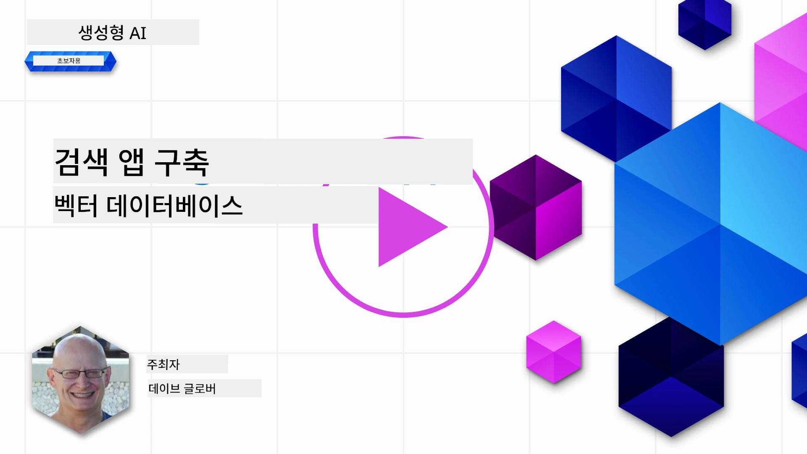
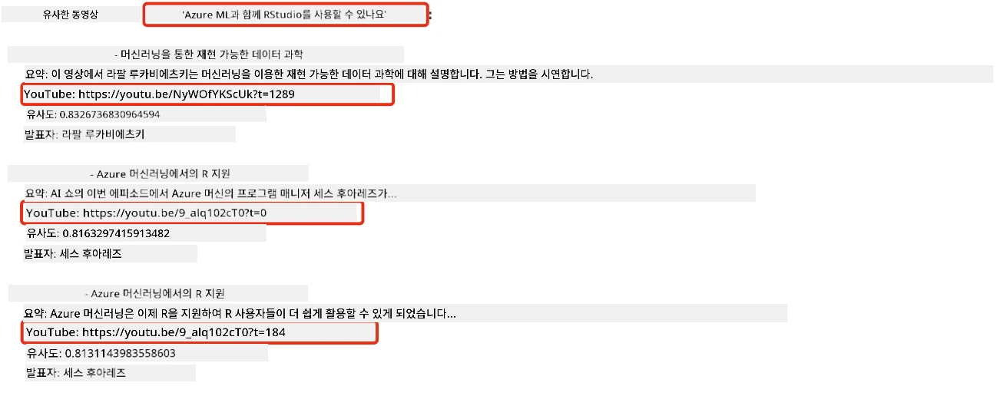
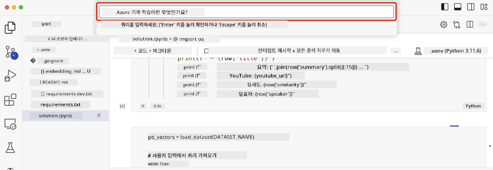

# 검색 애플리케이션 구축하기

[](https://youtu.be/W0-nzXjOjr0?si=GcsqiTTvd7RKbo7V)

> > _위 이미지를 클릭하면 이 강의의 동영상을 볼 수 있습니다_

LLM은 챗봇과 텍스트 생성 이상입니다. 임베딩을 사용하여 검색 애플리케이션을 구축하는 것도 가능합니다. 임베딩은 벡터라고도 하는 데이터의 수치적 표현이며, 데이터를 의미 기반으로 검색하는 데 사용될 수 있습니다.

이번 강의에서는 교육 스타트업을 위한 검색 애플리케이션을 구축할 것입니다. 우리의 스타트업은 개발 도상국 학생들에게 무료 교육을 제공하는 비영리 단체입니다. 우리 스타트업은 학생들이 AI에 대해 배울 수 있도록 많은 수의 YouTube 동영상을 보유하고 있습니다. 학생들이 질문을 입력하면 YouTube 동영상을 검색할 수 있는 검색 애플리케이션을 만들고자 합니다.

예를 들어, 학생이 'Jupyter 노트북이란 무엇인가?' 또는 'Azure ML이란 무엇인가?'라고 입력하면 검색 애플리케이션이 질문과 관련된 YouTube 동영상 목록을 반환하며, 더욱이 질문에 대한 답변이 동영상의 어느 부분에 있는지 위치를 가리키는 링크도 반환합니다.

## 소개

이번 강의에서는 다음 내용을 다룹니다:

- 의미 기반 검색과 키워드 검색의 차이
- 텍스트 임베딩이란 무엇인가
- 텍스트 임베딩 인덱스 생성하기
- 텍스트 임베딩 인덱스 검색하기

## 학습 목표

강의를 마치면 다음을 할 수 있게 됩니다:

- 의미 기반 검색과 키워드 검색을 구분할 수 있습니다.
- 텍스트 임베딩에 대해 설명할 수 있습니다.
- 임베딩을 사용하여 데이터를 검색하는 애플리케이션을 만들 수 있습니다.

## 왜 검색 애플리케이션을 만들까요?

검색 애플리케이션을 만들면 임베딩을 사용해 데이터를 검색하는 방법을 이해할 수 있습니다. 또한 학생들이 정보를 빠르게 찾을 수 있는 검색 애플리케이션을 구축하는 방법을 배울 수 있습니다.

강의에는 Microsoft [AI Show](https://www.youtube.com/playlist?list=PLlrxD0HtieHi0mwteKBOfEeOYf0LJU4O1) 유튜브 채널의 자막 텍스트 임베딩 인덱스가 포함되어 있습니다. AI Show는 AI와 머신러닝에 대해 가르치는 유튜브 채널입니다. 임베딩 인덱스에는 2023년 10월까지의 각 유튜브 자막 텍스트에 대한 임베딩이 포함되어 있습니다. 이 임베딩 인덱스를 사용해 우리 스타트업용 검색 애플리케이션을 구축할 것입니다. 검색 애플리케이션은 질문에 대한 답이 동영상 어느 부분에 있는지 가리키는 링크를 반환합니다. 이는 학생들이 필요한 정보를 빠르게 찾을 수 있는 훌륭한 방법입니다.

다음은 'rstudio를 Azure ML과 함께 사용할 수 있나요?'라는 질문에 대한 의미 기반 쿼리 예시입니다. 유튜브 URL을 확인하면 타임스탬프가 포함되어 있어 질문에 대한 답이 동영상 어느 부분에 있는지 바로 이동할 수 있습니다.



## 의미 기반 검색이란 무엇인가?

의미 기반 검색이 무엇인지 궁금할 수 있습니다. 의미 기반 검색은 쿼리 내 단어의 의미를 활용하여 관련성 높은 결과를 반환하는 검색 기법입니다.

의미 기반 검색의 예를 들면, 자동차를 사고 싶을 때 '내 꿈의 차'를 검색한다면, 의미 기반 검색은 당신이 단순히 `꿈꾸는` 것이 아니라 `이상적인` 자동차를 찾고 있다는 의도를 이해합니다. 의미 기반 검색은 당신의 의도를 파악하고 관련된 결과를 반환합니다. 반면 `키워드 검색`은 문자 그대로 ‘자동차에 관한 꿈’을 찾아서 종종 관련 없는 결과를 반환합니다.

## 텍스트 임베딩이란 무엇인가?

[텍스트 임베딩](https://en.wikipedia.org/wiki/Word_embedding?WT.mc_id=academic-105485-koreyst)은 [자연어 처리](https://en.wikipedia.org/wiki/Natural_language_processing?WT.mc_id=academic-105485-koreyst)에서 사용되는 텍스트 표현 기법입니다. 텍스트 임베딩은 텍스트의 의미를 수치로 표현한 것입니다. 임베딩은 데이터를 기계가 이해하기 쉬운 방식으로 표현하는 데 사용됩니다. 텍스트 임베딩을 생성하는 많은 모델이 있지만, 이번 강의에서는 OpenAI 임베딩 모델을 사용한 임베딩 생성에 집중합니다.

예를 들어, 다음 텍스트가 AI Show 유튜브 채널의 한 에피소드 자막에 있다고 상상해 보세요:

```text
Today we are going to learn about Azure Machine Learning.
```

이 텍스트를 OpenAI 임베딩 API에 전달하면 1536개의 숫자(벡터)로 구성된 임베딩을 반환합니다. 벡터 내 각각의 숫자는 텍스트의 서로 다른 측면을 나타냅니다. 간단히 하기 위해 벡터의 처음 10개 숫자를 살펴봅니다.

```python
[-0.006655829958617687, 0.0026128944009542465, 0.008792596869170666, -0.02446001023054123, -0.008540431968867779, 0.022071078419685364, -0.010703742504119873, 0.003311325330287218, -0.011632772162556648, -0.02187200076878071, ...]
```

## 임베딩 인덱스는 어떻게 생성되나요?

이번 강의의 임베딩 인덱스는 일련의 Python 스크립트를 이용해 생성되었습니다. 해당 스크립트와 사용법은 이번 강의의 'scripts' 폴더 내 [README](./scripts/README.md?WT.mc_id=academic-105485-koreyst)에서 확인할 수 있습니다. 이번 강의에서는 임베딩 인덱스가 제공되므로 직접 스크립트를 실행하지 않아도 됩니다.

스크립트는 다음 작업을 수행합니다:

1. [AI Show](https://www.youtube.com/playlist?list=PLlrxD0HtieHi0mwteKBOfEeOYf0LJU4O1) 재생목록의 각 유튜브 동영상 자막을 다운로드합니다.
2. [OpenAI Functions](https://learn.microsoft.com/azure/ai-foundry/openai/how-to/function-calling?WT.mc_id=academic-105485-koreyst)를 사용해 유튜브 자막 처음 3분에서 발표자 이름을 추출하려 시도합니다. 각 동영상의 발표자 이름은 `embedding_index_3m.json` 임베딩 인덱스에 저장됩니다.
3. 자막 텍스트를 <strong>3분 단위 텍스트 세그먼트</strong>로 나눕니다. 세그먼트 간에 약 20개의 단어가 겹치게 하여 임베딩이 잘리지 않고 검색 맥락도 향상시킵니다.
4. 각 텍스트 세그먼트를 OpenAI 챗 API에 전달하여 60단어 요약을 생성합니다. 요약도 `embedding_index_3m.json` 임베딩 인덱스에 저장됩니다.
5. 마지막으로 세그먼트 텍스트를 OpenAI 임베딩 API에 전달합니다. 임베딩 API는 세그먼트 의미를 나타내는 1536차원 벡터를 반환합니다. 세그먼트와 임베딩 벡터는 `embedding_index_3m.json` 임베딩 인덱스에 저장됩니다.

### 벡터 데이터베이스

강의의 간단한 구현을 위해 임베딩 인덱스는 `embedding_index_3m.json` JSON 파일에 저장되어 Pandas DataFrame으로 로드됩니다. 그러나 실제 서비스에서는 [Azure Cognitive Search](https://learn.microsoft.com/training/modules/improve-search-results-vector-search?WT.mc_id=academic-105485-koreyst), [Redis](https://cookbook.openai.com/examples/vector_databases/redis/readme?WT.mc_id=academic-105485-koreyst), [Pinecone](https://cookbook.openai.com/examples/vector_databases/pinecone/readme?WT.mc_id=academic-105485-koreyst), [Weaviate](https://cookbook.openai.com/examples/vector_databases/weaviate/readme?WT.mc_id=academic-105485-koreyst) 등 벡터 데이터베이스에 저장됩니다.

## 코사인 유사도 이해하기

텍스트 임베딩을 배웠으니 다음 단계는 텍스트 임베딩을 사용해 데이터를 검색하는 방법, 특히 코사인 유사도를 사용해 쿼리와 가장 유사한 임베딩을 찾는 방법을 배우는 것입니다.

### 코사인 유사도란 무엇인가?

코사인 유사도는 두 벡터 간 유사도를 측정하는 방법으로, ‘최단 거리 탐색(nearest neighbor search)’이라고도 합니다. 코사인 유사도 검색을 하려면 OpenAI 임베딩 API를 사용해 쿼리 텍스트를 벡터화한 후, 쿼리 벡터와 임베딩 인덱스 내 각 벡터 간의 코사인 유사도를 계산합니다. 임베딩 인덱스에는 각 유튜브 자막 텍스트 세그먼트별 벡터가 저장되어 있습니다. 마지막으로 코사인 유사도 순으로 결과를 정렬하면 가장 유사한 텍스트 세그먼트가 쿼리와 가장 유사한 결과가 됩니다.

수학적으로 코사인 유사도는 다차원 공간에 투영된 두 벡터 사이의 각도의 코사인을 측정합니다. 이 측정법은 두 문서가 크기로 인해 유클리드 거리상 멀리 떨어져 있어도 두 벡터 간 각도가 작으면 높은 코사인 유사도를 갖는다는 장점이 있습니다. 코사인 유사도 수학식에 대해 더 알고 싶다면 [Cosine similarity](https://en.wikipedia.org/wiki/Cosine_similarity?WT.mc_id=academic-105485-koreyst)를 참고하세요.

## 첫 번째 검색 애플리케이션 만들기

이제 임베딩을 이용해 검색 애플리케이션을 구축하는 방법을 배워봅시다. 이 검색 애플리케이션은 학생이 질문을 입력하면 관련 동영상 목록을 반환합니다. 또한 질문에 대한 답이 동영상 어느 부분에 있는지 위치를 가리키는 링크도 돌려줍니다.

이 솔루션은 Windows 11, macOS, 그리고 Ubuntu 22.04에서 Python 3.10 이상으로 구축 및 테스트되었습니다. Python은 [python.org](https://www.python.org/downloads/?WT.mc_id=academic-105485-koreyst)에서 다운로드할 수 있습니다.

## 과제 - 학생들을 위한 검색 애플리케이션 구축

이 강의 시작 부분에서 우리 스타트업을 소개했습니다. 이제 학생들이 과제용으로 검색 애플리케이션을 구축할 수 있도록 합니다.

이번 과제에서 검색 애플리케이션 구축에 사용할 Azure OpenAI 서비스를 생성합니다. Azure 구독이 필요합니다. 다음 Azure OpenAI 서비스를 생성하세요.

### Azure 클라우드 셸 시작하기

1. [Azure 포털](https://portal.azure.com/?WT.mc_id=academic-105485-koreyst)에 로그인합니다.
2. Azure 포털 우측 상단의 클라우드 셸 아이콘을 선택합니다.
3. 환경 유형으로 <strong>Bash</strong>를 선택합니다.

#### 리소스 그룹 만들기

> 이 안내에서는 "semantic-video-search"라는 이름의 리소스 그룹을 East US 지역에 만듭니다.
> 리소스 그룹 이름을 변경할 수 있지만, 위치를 변경할 경우,
> [모델 가용성 표](https://aka.ms/oai/models?WT.mc_id=academic-105485-koreyst)를 확인하세요.

```shell
az group create --name semantic-video-search --location eastus
```

#### Azure OpenAI 서비스 리소스 생성

Azure 클라우드 셸에서 다음 명령어를 실행해 Azure OpenAI 서비스 리소스를 생성합니다.

```shell
az cognitiveservices account create --name semantic-video-openai --resource-group semantic-video-search \
    --location eastus --kind OpenAI --sku s0
```

#### 애플리케이션에서 사용할 엔드포인트와 키 가져오기

Azure 클라우드 셸에서 다음 명령어를 실행해 Azure OpenAI 서비스 리소스의 엔드포인트와 키를 가져옵니다.

```shell
az cognitiveservices account show --name semantic-video-openai \
   --resource-group  semantic-video-search | jq -r .properties.endpoint
az cognitiveservices account keys list --name semantic-video-openai \
   --resource-group semantic-video-search | jq -r .key1
```

#### OpenAI 임베딩 모델 배포하기

Azure 클라우드 셸에서 다음 명령어를 실행해 OpenAI 임베딩 모델을 배포합니다.

```shell
az cognitiveservices account deployment create \
    --name semantic-video-openai \
    --resource-group  semantic-video-search \
    --deployment-name text-embedding-ada-002 \
    --model-name text-embedding-ada-002 \
    --model-version "2"  \
    --model-format OpenAI \
    --sku-capacity 100 --sku-name "Standard"
```

## 솔루션

GitHub Codespaces의 [솔루션 노트북](./python/aoai-solution.ipynb?WT.mc_id=academic-105485-koreyst)을 열고 Jupyter 노트북의 지침을 따르세요.

노트북을 실행하면 쿼리를 입력하라는 메시지가 표시됩니다. 입력 상자는 다음과 같습니다:



## 훌륭합니다! 학습을 계속하세요

이번 강의를 마친 후, [생성형 AI 학습 컬렉션](https://aka.ms/genai-collection?WT.mc_id=academic-105485-koreyst)을 확인하여 생성형 AI 지식을 계속 쌓으세요!

Lesson 9로 이동해 [이미지 생성 애플리케이션 구축 방법](../09-building-image-applications/README.md?WT.mc_id=academic-105485-koreyst)을 살펴보세요!

---

<!-- CO-OP TRANSLATOR DISCLAIMER START -->
**면책 조항**:
이 문서는 AI 번역 서비스 [Co-op Translator](https://github.com/Azure/co-op-translator)를 사용하여 번역되었습니다. 정확성을 기하기 위해 노력하고 있으나, 자동 번역은 오류나 부정확한 부분이 있을 수 있음을 유의하시기 바랍니다. 원본 문서의 원어본이 권위 있는 자료로 간주되어야 합니다. 중요한 정보의 경우, 전문가의 인간 번역을 권장합니다. 이 번역 사용으로 인해 발생하는 오해나 잘못된 해석에 대해 당사는 책임을 지지 않습니다.
<!-- CO-OP TRANSLATOR DISCLAIMER END -->