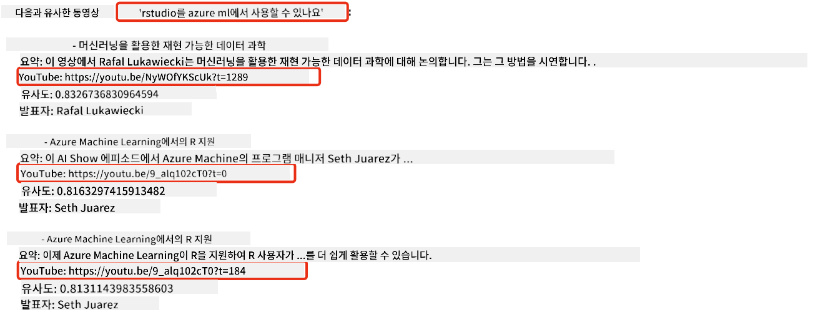
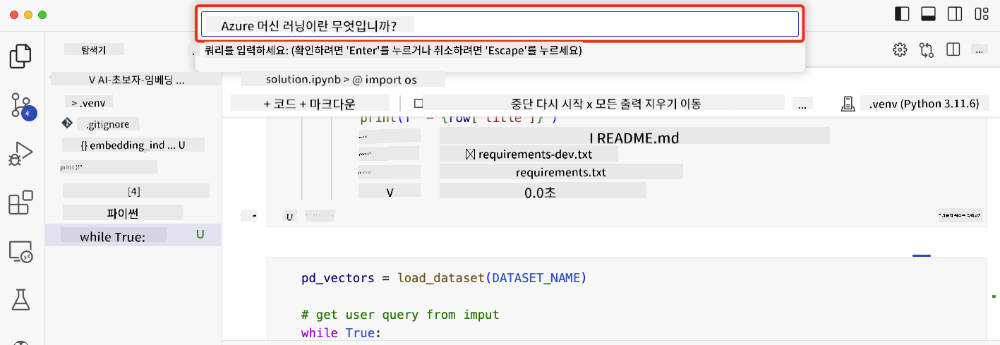

<!--
CO_OP_TRANSLATOR_METADATA:
{
  "original_hash": "58953c08b8ba7073b836d4270ea0fe86",
  "translation_date": "2025-10-18T00:00:08+00:00",
  "source_file": "08-building-search-applications/README.md",
  "language_code": "ko"
}
-->
# 검색 애플리케이션 구축하기

[](https://youtu.be/W0-nzXjOjr0?si=GcsqiTTvd7RKbo7V)

> > _위 이미지를 클릭하면 이 강의의 동영상을 볼 수 있습니다_

LLM은 챗봇과 텍스트 생성 이상의 기능을 제공합니다. 임베딩을 사용하여 검색 애플리케이션을 구축하는 것도 가능합니다. 임베딩은 벡터라고도 불리는 데이터의 수치적 표현이며, 데이터의 의미론적 검색에 사용할 수 있습니다.

이 강의에서는 교육 스타트업을 위한 검색 애플리케이션을 구축할 것입니다. 우리 스타트업은 개발도상국의 학생들에게 무료 교육을 제공하는 비영리 조직입니다. 스타트업은 학생들이 AI에 대해 배울 수 있는 많은 YouTube 동영상을 보유하고 있습니다. 스타트업은 학생들이 질문을 입력하여 YouTube 동영상을 검색할 수 있는 검색 애플리케이션을 구축하고자 합니다.

예를 들어, 학생이 'Jupyter 노트북이 무엇인가요?' 또는 'Azure ML이 무엇인가요?'라는 질문을 입력하면 검색 애플리케이션은 해당 질문과 관련된 YouTube 동영상 목록을 반환하며, 더 나아가 검색 애플리케이션은 질문에 대한 답변이 위치한 동영상의 특정 지점으로 연결되는 링크를 반환합니다.

## 소개

이 강의에서는 다음 내용을 다룹니다:

- 의미론적 검색 vs 키워드 검색
- 텍스트 임베딩이란 무엇인가
- 텍스트 임베딩 인덱스 생성하기
- 텍스트 임베딩 인덱스 검색하기

## 학습 목표

이 강의를 완료한 후, 여러분은 다음을 할 수 있습니다:

- 의미론적 검색과 키워드 검색의 차이를 설명할 수 있습니다.
- 텍스트 임베딩이 무엇인지 설명할 수 있습니다.
- 데이터를 검색하기 위해 임베딩을 사용하는 애플리케이션을 만들 수 있습니다.

## 왜 검색 애플리케이션을 구축해야 할까요?

검색 애플리케이션을 만드는 것은 임베딩을 사용하여 데이터를 검색하는 방법을 이해하는 데 도움이 됩니다. 또한 학생들이 정보를 빠르게 찾을 수 있도록 돕는 검색 애플리케이션을 구축하는 방법을 배울 수 있습니다.

이 강의에는 Microsoft [AI Show](https://www.youtube.com/playlist?list=PLlrxD0HtieHi0mwteKBOfEeOYf0LJU4O1) YouTube 채널의 YouTube 트랜스크립트에 대한 임베딩 인덱스가 포함되어 있습니다. AI Show는 AI와 머신러닝에 대해 가르치는 YouTube 채널입니다. 임베딩 인덱스는 2023년 10월까지의 모든 YouTube 트랜스크립트에 대한 임베딩을 포함하고 있습니다. 여러분은 이 임베딩 인덱스를 사용하여 스타트업을 위한 검색 애플리케이션을 구축할 것입니다. 검색 애플리케이션은 질문에 대한 답변이 위치한 동영상의 특정 지점으로 연결되는 링크를 반환합니다. 이는 학생들이 필요한 정보를 빠르게 찾을 수 있는 훌륭한 방법입니다.

다음은 'Azure ML에서 rstudio를 사용할 수 있나요?'라는 질문에 대한 의미론적 검색 예제입니다. YouTube URL을 확인해보면, URL에 질문에 대한 답변이 위치한 동영상의 특정 지점으로 연결되는 타임스탬프가 포함되어 있는 것을 볼 수 있습니다.



## 의미론적 검색이란 무엇인가?

이제 여러분은 의미론적 검색이 무엇인지 궁금할 것입니다. 의미론적 검색은 쿼리의 단어 의미를 사용하여 관련 결과를 반환하는 검색 기술입니다.

다음은 의미론적 검색의 예입니다. 예를 들어, 여러분이 차를 사고 싶다고 가정해 보겠습니다. '내 꿈의 차'라고 검색하면, 의미론적 검색은 여러분이 차를 '꿈꾸고' 있는 것이 아니라 '이상적인' 차를 사고 싶어 한다는 것을 이해합니다. 의미론적 검색은 여러분의 의도를 이해하고 관련 결과를 반환합니다. 반면, '키워드 검색'은 문자 그대로 차에 대한 꿈을 검색하며 종종 관련 없는 결과를 반환합니다.

## 텍스트 임베딩이란 무엇인가?

[텍스트 임베딩](https://en.wikipedia.org/wiki/Word_embedding?WT.mc_id=academic-105485-koreyst)은 [자연어 처리](https://en.wikipedia.org/wiki/Natural_language_processing?WT.mc_id=academic-105485-koreyst)에서 사용되는 텍스트 표현 기술입니다. 텍스트 임베딩은 텍스트의 의미론적 수치적 표현입니다. 임베딩은 데이터를 기계가 이해하기 쉽게 표현하는 데 사용됩니다. 텍스트 임베딩을 생성하는 모델은 여러 가지가 있지만, 이 강의에서는 OpenAI 임베딩 모델을 사용하여 임베딩을 생성하는 데 초점을 맞출 것입니다.

예를 들어, AI Show YouTube 채널의 에피소드 중 하나의 트랜스크립트에 다음과 같은 텍스트가 있다고 가정해 보겠습니다:

```text
Today we are going to learn about Azure Machine Learning.
```

이 텍스트를 OpenAI 임베딩 API에 전달하면 1536개의 숫자로 구성된 임베딩(벡터)을 반환합니다. 벡터의 각 숫자는 텍스트의 다른 측면을 나타냅니다. 간략히 말하면, 벡터의 처음 10개의 숫자는 다음과 같습니다.

```python
[-0.006655829958617687, 0.0026128944009542465, 0.008792596869170666, -0.02446001023054123, -0.008540431968867779, 0.022071078419685364, -0.010703742504119873, 0.003311325330287218, -0.011632772162556648, -0.02187200076878071, ...]
```

## 임베딩 인덱스는 어떻게 생성되나요?

이 강의의 임베딩 인덱스는 일련의 Python 스크립트를 사용하여 생성되었습니다. 스크립트와 지침은 'scripts' 폴더의 [README](./scripts/README.md?WT.mc_id=academic-105485-koreyst)에서 확인할 수 있습니다. 이 강의를 완료하기 위해 이 스크립트를 실행할 필요는 없습니다. 임베딩 인덱스가 제공됩니다.

스크립트는 다음 작업을 수행합니다:

1. [AI Show](https://www.youtube.com/playlist?list=PLlrxD0HtieHi0mwteKBOfEeOYf0LJU4O1) 재생목록의 각 YouTube 동영상에 대한 트랜스크립트를 다운로드합니다.
2. [OpenAI Functions](https://learn.microsoft.com/azure/ai-services/openai/how-to/function-calling?WT.mc_id=academic-105485-koreyst)를 사용하여 YouTube 트랜스크립트의 처음 3분에서 화자의 이름을 추출하려고 시도합니다. 각 동영상의 화자 이름은 `embedding_index_3m.json`이라는 임베딩 인덱스에 저장됩니다.
3. 트랜스크립트 텍스트는 **3분 텍스트 세그먼트**로 나뉩니다. 세그먼트는 다음 세그먼트에서 약 20개의 단어가 겹치도록 포함하여 세그먼트의 임베딩이 잘리지 않도록 하고 더 나은 검색 컨텍스트를 제공합니다.
4. 각 텍스트 세그먼트는 OpenAI Chat API에 전달되어 텍스트를 60단어로 요약합니다. 요약은 `embedding_index_3m.json` 임베딩 인덱스에 저장됩니다.
5. 마지막으로, 세그먼트 텍스트는 OpenAI 임베딩 API에 전달됩니다. 임베딩 API는 세그먼트의 의미론적 의미를 나타내는 1536개의 숫자로 구성된 벡터를 반환합니다. 세그먼트와 OpenAI 임베딩 벡터는 `embedding_index_3m.json` 임베딩 인덱스에 저장됩니다.

### 벡터 데이터베이스

강의의 간소화를 위해 임베딩 인덱스는 `embedding_index_3m.json`이라는 JSON 파일에 저장되고 Pandas DataFrame에 로드됩니다. 하지만 실제 환경에서는 임베딩 인덱스가 [Azure Cognitive Search](https://learn.microsoft.com/training/modules/improve-search-results-vector-search?WT.mc_id=academic-105485-koreyst), [Redis](https://cookbook.openai.com/examples/vector_databases/redis/readme?WT.mc_id=academic-105485-koreyst), [Pinecone](https://cookbook.openai.com/examples/vector_databases/pinecone/readme?WT.mc_id=academic-105485-koreyst), [Weaviate](https://cookbook.openai.com/examples/vector_databases/weaviate/readme?WT.mc_id=academic-105485-koreyst)와 같은 벡터 데이터베이스에 저장됩니다.

## 코사인 유사도 이해하기

텍스트 임베딩에 대해 배웠으니, 이제 텍스트 임베딩을 사용하여 데이터를 검색하고 특히 코사인 유사도를 사용하여 주어진 쿼리에 가장 유사한 임베딩을 찾는 방법을 배워야 합니다.

### 코사인 유사도란 무엇인가?

코사인 유사도는 두 벡터 간의 유사성을 측정하는 방법으로, `가장 가까운 이웃 검색`이라고도 합니다. 코사인 유사도 검색을 수행하려면 OpenAI 임베딩 API를 사용하여 _쿼리_ 텍스트를 _벡터화_해야 합니다. 그런 다음 쿼리 벡터와 임베딩 인덱스의 각 벡터 간의 _코사인 유사도_를 계산합니다. 임베딩 인덱스는 각 YouTube 트랜스크립트 텍스트 세그먼트에 대한 벡터를 포함하고 있습니다. 마지막으로 코사인 유사도로 결과를 정렬하면 코사인 유사도가 가장 높은 텍스트 세그먼트가 쿼리와 가장 유사합니다.

수학적으로 보면, 코사인 유사도는 다차원 공간에서 두 벡터 간의 각도의 코사인을 측정합니다. 이 측정은 유클리드 거리로 인해 문서가 크기 때문에 멀리 떨어져 있을 수 있지만, 여전히 각도가 작아 코사인 유사도가 높을 수 있다는 점에서 유용합니다. 코사인 유사도 방정식에 대한 자세한 내용은 [코사인 유사도](https://en.wikipedia.org/wiki/Cosine_similarity?WT.mc_id=academic-105485-koreyst)를 참조하세요.

## 첫 번째 검색 애플리케이션 구축하기

다음으로, 임베딩을 사용하여 검색 애플리케이션을 구축하는 방법을 배울 것입니다. 검색 애플리케이션은 학생들이 질문을 입력하여 동영상을 검색할 수 있도록 합니다. 검색 애플리케이션은 질문과 관련된 동영상 목록을 반환하며, 질문에 대한 답변이 위치한 동영상의 특정 지점으로 연결되는 링크도 반환합니다.

이 솔루션은 Windows 11, macOS, Ubuntu 22.04에서 Python 3.10 이상을 사용하여 구축 및 테스트되었습니다. Python은 [python.org](https://www.python.org/downloads/?WT.mc_id=academic-105485-koreyst)에서 다운로드할 수 있습니다.

## 과제 - 학생들을 위한 검색 애플리케이션 구축하기

강의 초반에 우리 스타트업을 소개했습니다. 이제 학생들이 검색 애플리케이션을 구축할 수 있도록 도와줄 시간입니다.

이 과제에서는 검색 애플리케이션을 구축하는 데 사용될 Azure OpenAI 서비스를 생성할 것입니다. 다음 Azure OpenAI 서비스를 생성합니다. 이 과제를 완료하려면 Azure 구독이 필요합니다.

### Azure Cloud Shell 시작하기

1. [Azure 포털](https://portal.azure.com/?WT.mc_id=academic-105485-koreyst)에 로그인합니다.
2. Azure 포털 오른쪽 상단의 Cloud Shell 아이콘을 선택합니다.
3. 환경 유형으로 **Bash**를 선택합니다.

#### 리소스 그룹 생성하기

> 이 지침에서는 East US에 "semantic-video-search"라는 리소스 그룹을 사용합니다.
> 리소스 그룹 이름을 변경할 수 있지만, 리소스 위치를 변경할 때는 [모델 가용성 표](https://aka.ms/oai/models?WT.mc_id=academic-105485-koreyst)를 확인하세요.

```shell
az group create --name semantic-video-search --location eastus
```

#### Azure OpenAI 서비스 리소스 생성하기

Azure Cloud Shell에서 다음 명령을 실행하여 Azure OpenAI 서비스 리소스를 생성합니다.

```shell
az cognitiveservices account create --name semantic-video-openai --resource-group semantic-video-search \
    --location eastus --kind OpenAI --sku s0
```

#### 이 애플리케이션에서 사용할 엔드포인트와 키 가져오기

Azure Cloud Shell에서 다음 명령을 실행하여 Azure OpenAI 서비스 리소스의 엔드포인트와 키를 가져옵니다.

```shell
az cognitiveservices account show --name semantic-video-openai \
   --resource-group  semantic-video-search | jq -r .properties.endpoint
az cognitiveservices account keys list --name semantic-video-openai \
   --resource-group semantic-video-search | jq -r .key1
```

#### OpenAI 임베딩 모델 배포하기

Azure Cloud Shell에서 다음 명령을 실행하여 OpenAI 임베딩 모델을 배포합니다.

```shell
az cognitiveservices account deployment create \
    --name semantic-video-openai \
    --resource-group  semantic-video-search \
    --deployment-name text-embedding-ada-002 \
    --model-name text-embedding-ada-002 \
    --model-version "2"  \
    --model-format OpenAI \
    --sku-capacity 100 --sku-name "Standard"
```

## 솔루션

GitHub Codespaces에서 [솔루션 노트북](./python/aoai-solution.ipynb?WT.mc_id=academic-105485-koreyst)을 열고 Jupyter Notebook의 지침을 따르세요.

노트북을 실행하면 쿼리를 입력하라는 메시지가 표시됩니다. 입력 상자는 다음과 같이 보입니다:



## 훌륭한 작업! 학습을 계속하세요

이 강의를 완료한 후, [생성형 AI 학습 컬렉션](https://aka.ms/genai-collection?WT.mc_id=academic-105485-koreyst)을 확인하여 생성형 AI 지식을 계속 향상시키세요!

9강으로 이동하여 [이미지 생성 애플리케이션 구축](../09-building-image-applications/README.md?WT.mc_id=academic-105485-koreyst)에 대해 알아보세요!

---

**면책 조항**:  
이 문서는 AI 번역 서비스 [Co-op Translator](https://github.com/Azure/co-op-translator)를 사용하여 번역되었습니다. 정확성을 위해 최선을 다하고 있으나, 자동 번역에는 오류나 부정확성이 포함될 수 있습니다. 원본 문서의 원어 버전이 권위 있는 출처로 간주되어야 합니다. 중요한 정보의 경우, 전문적인 인간 번역을 권장합니다. 이 번역 사용으로 인해 발생하는 오해나 잘못된 해석에 대해 책임을 지지 않습니다.