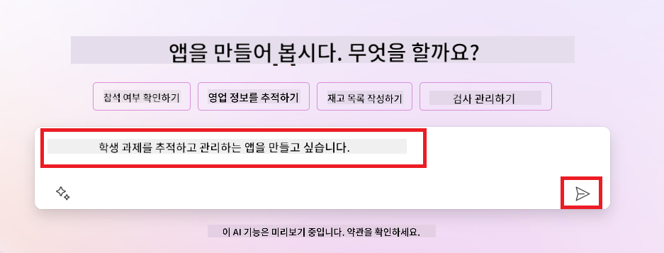
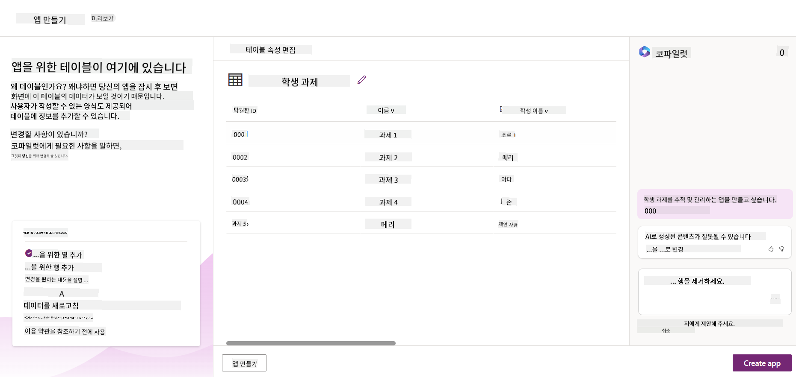
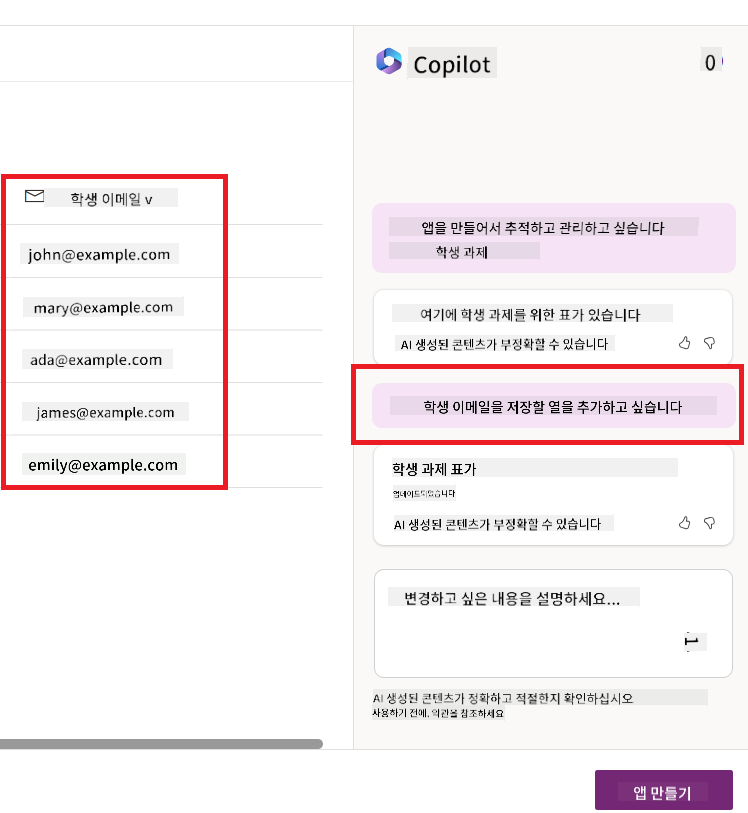
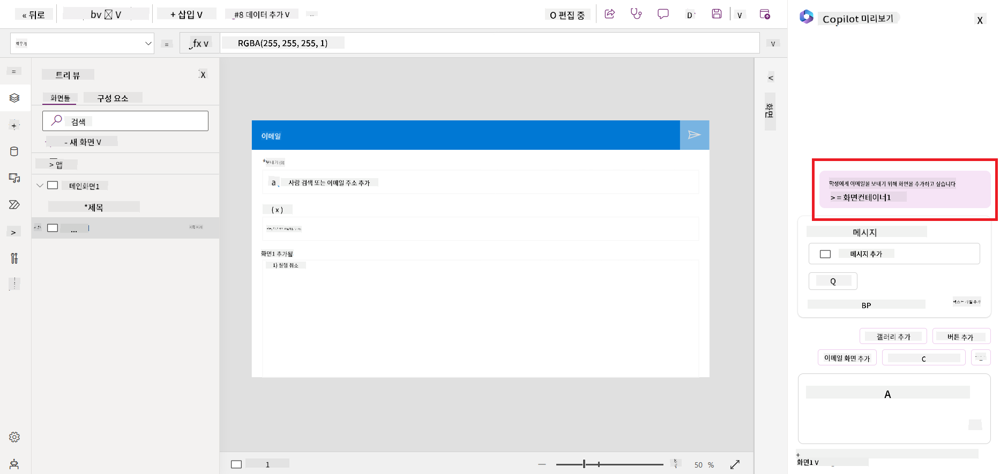
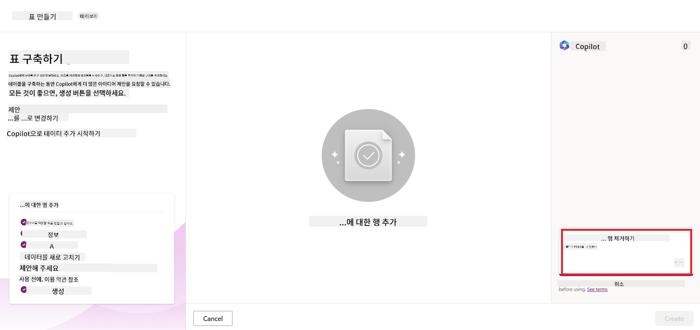
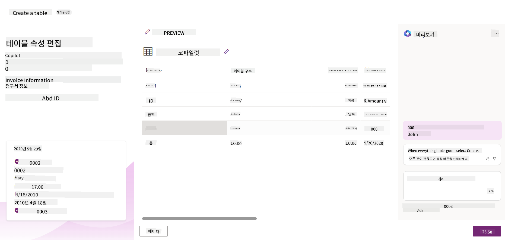
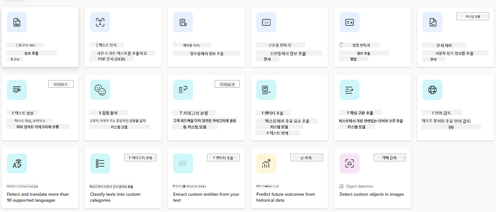
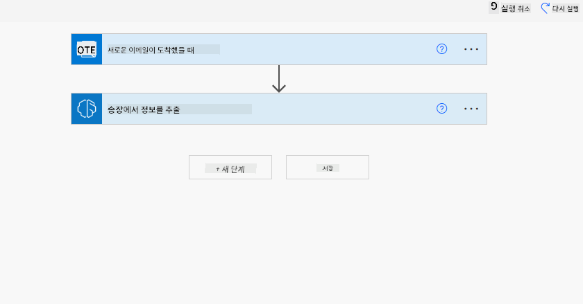
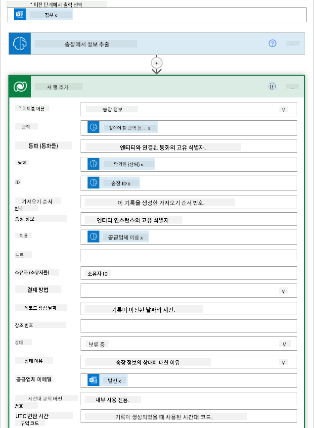
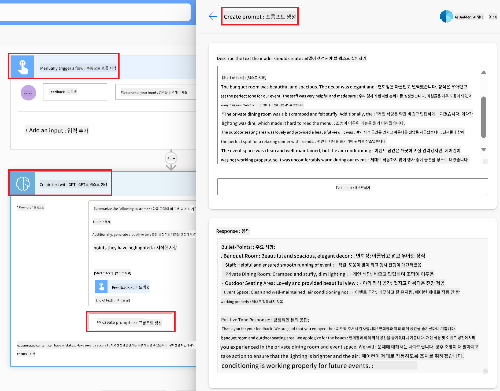

<!--
CO_OP_TRANSLATOR_METADATA:
{
  "original_hash": "f5ff3b6204a695a117d6f452403c95f7",
  "translation_date": "2025-05-19T19:55:42+00:00",
  "source_file": "10-building-low-code-ai-applications/README.md",
  "language_code": "ko"
}
-->
# 저코드 AI 애플리케이션 구축하기

> _(위 이미지를 클릭하면 이 강의의 비디오를 볼 수 있습니다)_

## 소개

이미지 생성 애플리케이션을 만드는 방법을 배웠으니 이제 저코드에 대해 이야기해 봅시다. 생성 AI는 저코드를 포함하여 다양한 분야에 사용될 수 있습니다. 하지만 저코드란 무엇이며 AI를 어떻게 추가할 수 있을까요?

저코드 개발 플랫폼을 통해 전통적인 개발자와 비개발자 모두 애플리케이션과 솔루션을 쉽게 구축할 수 있게 되었습니다. 저코드 개발 플랫폼은 시각적 개발 환경을 제공하여 애플리케이션과 솔루션을 구축하기 위해 컴포넌트를 드래그 앤 드롭하는 방식으로 적은 코드 또는 코드 없이 애플리케이션과 솔루션을 구축할 수 있게 합니다. 이를 통해 애플리케이션과 솔루션을 더 빠르고 적은 자원으로 구축할 수 있습니다. 이번 강의에서는 저코드를 사용하는 방법과 Power Platform을 통해 AI로 저코드 개발을 강화하는 방법을 깊이 탐구합니다.

Power Platform은 직관적인 저코드 또는 무코드 환경을 통해 팀이 자체 솔루션을 구축할 수 있는 기회를 제공합니다. 이 환경은 솔루션 구축 과정을 간소화하는 데 도움을 줍니다. Power Platform을 사용하면 솔루션을 몇 달 또는 몇 년이 아닌 며칠 또는 몇 주 만에 구축할 수 있습니다. Power Platform은 Power Apps, Power Automate, Power BI, Power Pages, Copilot Studio라는 다섯 가지 주요 제품으로 구성되어 있습니다.

이 강의는 다음 내용을 다룹니다:

- Power Platform에서 생성 AI 소개
- Copilot 소개 및 사용 방법
- Power Platform에서 생성 AI를 사용하여 앱과 흐름 구축하기
- AI Builder로 Power Platform의 AI 모델 이해하기

## 학습 목표

이 강의가 끝날 때까지 다음을 할 수 있습니다:

- Power Platform에서 Copilot이 어떻게 작동하는지 이해하기.

- 교육 스타트업을 위한 학생 과제 추적 앱 구축하기.

- AI를 사용하여 인보이스에서 정보를 추출하는 인보이스 처리 흐름 구축하기.

- GPT AI 모델을 사용하여 텍스트 생성할 때의 모범 사례 적용하기.

이 강의에서 사용할 도구와 기술은 다음과 같습니다:

- **Power Apps**: 학생 과제 추적 앱을 위한 저코드 개발 환경으로 데이터를 추적, 관리 및 상호작용하는 앱을 구축합니다.

- **Dataverse**: 학생 과제 추적 앱의 데이터를 저장하는 곳으로, 앱의 데이터를 저장하기 위한 저코드 데이터 플랫폼을 제공합니다.

- **Power Automate**: 인보이스 처리 흐름을 위한 저코드 개발 환경으로 인보이스 처리 프로세스를 자동화하기 위한 워크플로우를 구축합니다.

- **AI Builder**: 스타트업을 위한 인보이스 처리 AI 모델을 구축하기 위해 미리 구축된 AI 모델을 사용하여 인보이스를 처리합니다.

## Power Platform에서 생성 AI

저코드 개발과 애플리케이션을 생성 AI로 강화하는 것은 Power Platform의 주요 초점 영역입니다. 목표는 데이터 과학 전문 지식 없이도 AI 기반 앱, 사이트, 대시보드를 구축하고 프로세스를 자동화할 수 있도록 하는 것입니다. 이 목표는 Copilot과 AI Builder의 형태로 Power Platform의 저코드 개발 경험에 생성 AI를 통합함으로써 달성됩니다.

### 어떻게 작동하나요?

Copilot은 자연어를 사용하여 대화형 단계로 요구 사항을 설명함으로써 Power Platform 솔루션을 구축할 수 있게 하는 AI 어시스턴트입니다. 예를 들어, 앱이 사용할 필드를 지정하면 앱과 기본 데이터 모델을 생성하거나 Power Automate에서 흐름을 설정하는 방법을 지정할 수 있습니다.

Copilot 기능을 앱 화면의 기능으로 사용하여 사용자들이 대화형 상호작용을 통해 인사이트를 발견할 수 있도록 할 수 있습니다.

AI Builder는 Power Platform에서 사용할 수 있는 저코드 AI 기능으로, AI 모델을 사용하여 프로세스를 자동화하고 결과를 예측할 수 있게 합니다. AI Builder를 사용하면 Dataverse 또는 SharePoint, OneDrive, Azure와 같은 다양한 클라우드 데이터 소스에 연결된 앱과 흐름에 AI를 추가할 수 있습니다.

Copilot은 Power Platform의 모든 제품에서 사용할 수 있습니다: Power Apps, Power Automate, Power BI, Power Pages, Power Virtual Agents. AI Builder는 Power Apps와 Power Automate에서 사용할 수 있습니다. 이 강의에서는 교육 스타트업을 위한 솔루션을 구축하기 위해 Power Apps와 Power Automate에서 Copilot과 AI Builder를 사용하는 방법에 중점을 둘 것입니다.

### Power Apps에서 Copilot

Power Platform의 일부인 Power Apps는 데이터를 추적, 관리 및 상호작용하는 앱을 구축하기 위한 저코드 개발 환경을 제공합니다. 클라우드 서비스 및 온프레미스 데이터를 연결할 수 있는 확장 가능한 데이터 플랫폼과 앱 개발 서비스를 제공합니다. Power Apps는 브라우저, 태블릿, 휴대폰에서 실행되는 앱을 구축할 수 있으며, 동료들과 공유할 수 있습니다. Power Apps는 간단한 인터페이스를 통해 사용자들이 앱 개발에 쉽게 접근할 수 있게 하며, 모든 비즈니스 사용자 또는 전문 개발자가 맞춤형 앱을 구축할 수 있습니다. 앱 개발 경험은 Copilot을 통해 생성 AI로 강화됩니다.

Power Apps의 Copilot AI 어시스턴트 기능은 필요한 앱의 종류와 추적, 수집, 표시하고자 하는 정보를 설명할 수 있게 합니다. Copilot은 설명에 따라 반응형 캔버스 앱을 생성합니다. 그런 다음 앱을 필요에 맞게 맞춤화할 수 있습니다. AI Copilot은 데이터 추적을 위해 필요한 필드와 샘플 데이터를 포함한 Dataverse 테이블을 생성하고 제안합니다. 이 강의 후반부에서 Dataverse가 무엇인지와 Power Apps에서 어떻게 사용할 수 있는지 알아볼 것입니다. 그런 다음 대화형 단계로 AI Copilot 어시스턴트 기능을 사용하여 테이블을 필요에 맞게 맞춤화할 수 있습니다. 이 기능은 Power Apps 홈 화면에서 쉽게 사용할 수 있습니다.

### Power Automate에서 Copilot

Power Platform의 일부인 Power Automate는 애플리케이션과 서비스 간의 자동화된 워크플로우를 생성할 수 있게 합니다. 반복적인 비즈니스 프로세스, 예를 들어 커뮤니케이션, 데이터 수집 및 승인 결정을 자동화하는 데 도움을 줍니다. 간단한 인터페이스를 통해 초보자부터 숙련된 개발자까지 모든 기술 수준의 사용자가 작업을 자동화할 수 있습니다. 워크플로우 개발 경험은 Copilot을 통해 생성 AI로 강화됩니다.

Power Automate의 Copilot AI 어시스턴트 기능은 필요한 흐름의 종류와 흐름이 수행할 작업을 설명할 수 있게 합니다. Copilot은 설명에 따라 흐름을 생성합니다. 그런 다음 흐름을 필요에 맞게 맞춤화할 수 있습니다. AI Copilot은 자동화하려는 작업을 수행하기 위한 작업을 생성하고 제안합니다. 이 강의 후반부에서 흐름이 무엇인지와 Power Automate에서 어떻게 사용할 수 있는지 알아볼 것입니다. 그런 다음 대화형 단계로 AI Copilot 어시스턴트 기능을 사용하여 작업을 필요에 맞게 맞춤화할 수 있습니다. 이 기능은 Power Automate 홈 화면에서 쉽게 사용할 수 있습니다.

## 과제: Copilot을 사용하여 스타트업의 학생 과제 및 인보이스 관리하기

우리 스타트업은 학생들에게 온라인 강좌를 제공합니다. 스타트업은 급속히 성장하여 강좌 수요를 따라잡기 어려워졌습니다. 스타트업은 학생 과제와 인보이스를 관리할 저코드 솔루션을 구축하기 위해 당신을 Power Platform 개발자로 고용했습니다. 이 솔루션은 앱을 통해 학생 과제를 추적하고 관리하며 워크플로우를 통해 인보이스 처리 프로세스를 자동화할 수 있어야 합니다. 생성 AI를 사용하여 솔루션을 개발하라는 요청을 받았습니다.

Copilot을 사용하기 시작할 때 [Power Platform Copilot Prompt Library](https://github.com/pnp/powerplatform-prompts?WT.mc_id=academic-109639-somelezediko)를 사용하여 프롬프트를 시작할 수 있습니다. 이 라이브러리에는 Copilot을 사용하여 앱과 흐름을 구축하는 데 사용할 수 있는 프롬프트 목록이 포함되어 있습니다. 또한 라이브러리의 프롬프트를 사용하여 Copilot에 요구 사항을 설명하는 방법을 이해할 수 있습니다.

### 스타트업을 위한 학생 과제 추적 앱 구축하기

우리 스타트업의 교육자들은 학생 과제를 추적하는 데 어려움을 겪고 있습니다. 그들은 스프레드시트를 사용하여 과제를 추적하고 있지만 학생 수가 증가함에 따라 관리하기 어려워졌습니다. 그들은 과제를 추적하고 관리할 수 있는 앱을 구축해 달라고 요청했습니다. 앱은 새로운 과제를 추가하고, 과제를 조회하고, 과제를 업데이트하고, 과제를 삭제할 수 있어야 합니다. 또한 교육자와 학생은 채점된 과제와 채점되지 않은 과제를 조회할 수 있어야 합니다.

아래 단계에 따라 Power Apps의 Copilot을 사용하여 앱을 구축할 것입니다:

1. [Power Apps](https://make.powerapps.com?WT.mc_id=academic-105485-koreyst) 홈 화면으로 이동합니다.

1. 홈 화면의 텍스트 영역을 사용하여 구축하려는 앱을 설명합니다. 예를 들어, **_학생 과제를 추적하고 관리할 앱을 구축하고 싶습니다_**라고 입력합니다. **Send** 버튼을 클릭하여 AI Copilot에게 프롬프트를 전송합니다.

1. AI Copilot은 데이터 추적을 위해 필요한 필드와 샘플 데이터를 포함한 Dataverse 테이블을 제안합니다. 그런 다음 대화형 단계로 AI Copilot 어시스턴트 기능을 사용하여 테이블을 필요에 맞게 맞춤화할 수 있습니다.

   > **중요**: Dataverse는 Power Platform의 기본 데이터 플랫폼입니다. 앱의 데이터를 저장하기 위한 저코드 데이터 플랫폼입니다. Microsoft Cloud에서 데이터를 안전하게 저장하며 Power Platform 환경 내에서 프로비저닝됩니다. 데이터 분류, 데이터 계보, 세분화된 액세스 제어 등의 내장된 데이터 거버넌스 기능을 제공합니다. Dataverse에 대해 더 알아보려면 [여기](https://docs.microsoft.com/powerapps/maker/data-platform/data-platform-intro?WT.mc_id=academic-109639-somelezediko)를 참조하세요.

   

1. 교육자들은 과제를 제출한 학생들에게 과제 진행 상황을 업데이트하기 위해 이메일을 보내고 싶어 합니다. Copilot을 사용하여 테이블에 학생 이메일을 저장할 새 필드를 추가할 수 있습니다. 예를 들어, 다음 프롬프트를 사용하여 테이블에 새 필드를 추가할 수 있습니다: **_학생 이메일을 저장할 열을 추가하고 싶습니다_**. **Send** 버튼을 클릭하여 AI Copilot에게 프롬프트를 전송합니다.

1. AI Copilot은 새 필드를 생성하고 필요에 맞게 필드를 맞춤화할 수 있습니다.

1. 테이블 작업이 완료되면 **Create app** 버튼을 클릭하여 앱을 생성합니다.

1. AI Copilot은 설명에 따라 반응형 캔버스 앱을 생성합니다. 그런 다음 앱을 필요에 맞게 맞춤화할 수 있습니다.

1. 교육자가 학생에게 이메일을 보내기 위해 앱에 새 화면을 추가할 수 있습니다. 예를 들어, 다음 프롬프트를 사용하여 앱에 새 화면을 추가할 수 있습니다: **_학생에게 이메일을 보내는 화면을 추가하고 싶습니다_**. **Send** 버튼을 클릭하여 AI Copilot에게 프롬프트를 전송합니다.

1. AI Copilot은 새 화면을 생성하고 필요에 맞게 화면을 맞춤화할 수 있습니다.

1. 앱 작업이 완료되면 **Save** 버튼을 클릭하여 앱을 저장합니다.

1. 교육자와 앱을 공유하려면 **Share** 버튼을 클릭한 후 다시 **Share** 버튼을 클릭합니다. 교육자의 이메일 주소를 입력하여 앱을 공유할 수 있습니다.

> **과제**: 방금 구축한 앱은 좋은 시작이지만 개선될 수 있습니다. 이메일 기능으로 인해 교육자는 이메일을 수동으로 입력해야만 학생에게 이메일을 보낼 수 있습니다. 과제를 제출할 때 교육자가 학생에게 자동으로 이메일을 보낼 수 있는 자동화를 Copilot을 사용하여 구축할 수 있습니까? 힌트는 올바른 프롬프트를 사용하면 Power Automate에서 Copilot을 사용하여 이를 구축할 수 있다는 것입니다.

### 스타트업을 위한 인보이스 정보 테이블 구축하기

우리 스타트업의 재무팀은 인보이스를 추적하는 데 어려움을 겪고 있습니다. 그들은 스프레드시트를 사용하여 인보이스를 추적하고 있지만 인보이스 수가 증가함에 따라 관리하기 어려워졌습니다. 그들은 받은 인보이스 정보를 저장, 추적 및 관리할 수 있는 테이블을 구축해 달라고 요청했습니다. 테이블은 모든 인보이스 정보를 추출하여 테이블에 저장하는 자동화를 구축하는 데 사용되어야 합니다. 또한 재무팀은 지불된 인보이스와 지불되지 않은 인보이스를 조회할 수 있어야 합니다.

Power Platform에는 Dataverse라는 기본 데이터 플랫폼이 있어 앱과 솔루션의 데이터를 저장할 수 있습니다. Dataverse는 앱의 데이터를 저장하기 위한 저코드 데이터 플랫폼을 제공합니다. Microsoft Cloud에서 데이터를 안전하게 저장하며 Power Platform 환경 내에서 프로비저닝됩니다. 데이터 분류, 데이터 계보, 세분화된 액세스 제어 등의 내장된 데이터 거버넌스 기능을 제공합니다. [Dataverse에 대해 더 알아보려면 여기](https://docs.microsoft.com/powerapps/maker/data-platform/data-platform-intro?WT.mc_id=academic-109639-somelezediko)를 참조하세요.

왜 우리 스타트업에 Dataverse를 사용해야 할까요? Dataverse의 표준 및 사용자 지정 테이블은 데이터를 위한 안전하고 클라우드 기반의 저장 옵션을 제공합니다. 테이블을 사용하여 다양한 유형의 데이터를 저장할 수 있으며, Excel 워크북의 여러 시트처럼 사용할 수 있습니다. 테이블을 사용하여 조직이나 비즈니스 요구에 맞는 데이터를 저장할 수 있습니다. 우리 스타트업이 Dataverse를 사용함으로써 얻을 수 있는 이점은 다음과 같습니다:

- **관리하기 쉬움**: 메타데이터와 데이터가 클라우드에 저장되어 저장 및 관리 세부 사항을 걱정할 필요가 없습니다. 앱과 솔루션 구축에 집중할 수 있습니다.

- **안전함**: Dataverse는 데이터를 위한 안전하고 클라우드 기반의 저장 옵션을 제공합니다. 테이블의 데이터에 대한 액세스를 제어할 수 있으며 역할 기반 보안을 사용하여 액세스 방법을 제어할 수 있습니다.

- **풍부한 메타데이터**: 데이터 유형 및 관계가 Power Apps 내에서 직접 사용됩니다.

- **논리 및 검증**: 비즈니스 규칙, 계산된 필드 및 검증 규칙을 사용하여 비즈니스 논리를 적용하고 데이터 정확성을 유지할 수 있습니다.

이제 Dataverse가 무엇인지와 사용해야 하는 이유를 알았으니 Copilot을 사용하여 재무팀의 요구 사항을 충족하는 테이블을 Dataverse에 생성하는 방법을 살펴보겠습니다.

> **참고**: 다음 섹션에서 모든 인보이스 정보를 추출하여 테이블에 저장하는 자동화를 구축하기 위해 이 테이블을 사용할 것입니다.
Copilot을 사용하여 Dataverse에 테이블을 생성하려면 아래 단계를 따르세요: 1. [Power Apps](https://make.powerapps.com?WT.mc_id=academic-105485-koreyst) 홈 화면으로 이동합니다. 2. 왼쪽 탐색 막대에서 **Tables**를 선택한 후 **Describe the new Table**을 클릭합니다.  1. **Describe the new Table** 화면에서 생성하려는 테이블을 설명하는 텍스트 영역을 사용합니다. 예를 들어, **_인보이스 정보를 저장할 테이블을 생성하고 싶습니다_**라고 입력합니다. **Send** 버튼을 클릭하여 AI Copilot에게 프롬프트를 전송합니다.  1. AI Copilot은 데이터 추적을 위해 필요한 필드와 샘플 데이터를 포함한 Dataverse 테이블을 제안합니다. 그런 다음 대화형 단계로 AI Copilot 어시스턴트 기능을 사용하여 테이블을 필요에 맞게 맞춤화할 수 있습니다.  1. 재무팀은 공급자에게 현재 인보이스 상태를 업데이트하는 이메일을 보내고 싶어 합니다. Copilot을 사용하여 테이블에 공급자 이메일을 저장할 새 필드를 추가할 수 있습니다. 예를 들어, 다음 프롬프트를 사용하여 테이블에 새 필드를 추가할 수 있습니다: **_공급자 이메일을 저장할 열을 추가하고 싶습니다_**. **Send** 버튼을 클릭하여 AI Copilot에게 프롬프트를 전송합니다. 1. AI Copilot은 새 필드를 생성하고 필요에 맞게 필드를 맞춤화할 수 있습니다. 1. 테이블 작업이 완료되면 **
텍스트. - **감정 분석**: 이 모델은 텍스트에서 긍정적, 부정적, 중립적 또는 혼합된 감정을 감지합니다. - **명함 리더**: 이 모델은 명함에서 정보를 추출합니다. - **텍스트 인식**: 이 모델은 이미지에서 텍스트를 추출합니다. - **객체 감지**: 이 모델은 이미지에서 객체를 감지하고 추출합니다. - **문서 처리**: 이 모델은 양식에서 정보를 추출합니다. - **송장 처리**: 이 모델은 송장에서 정보를 추출합니다. 사용자 지정 AI 모델을 사용하면 AI Builder에 자체 모델을 도입하여 AI Builder 사용자 지정 모델처럼 작동할 수 있으며, 자신의 데이터를 사용하여 모델을 훈련할 수 있습니다. 이러한 모델을 사용하여 Power Apps와 Power Automate에서 프로세스를 자동화하고 결과를 예측할 수 있습니다. 자체 모델을 사용할 때는 제한 사항이 적용됩니다. 이러한 [제한 사항](https://learn.microsoft.com/ai-builder/byo-model#limitations?WT.mc_id=academic-105485-koreyst)에 대해 자세히 알아보세요. 

## 과제 #2 - 우리 스타트업을 위한 송장 처리 흐름 구축

재무 팀은 송장을 처리하는 데 어려움을 겪고 있습니다. 그들은 송장을 추적하기 위해 스프레드시트를 사용해 왔지만, 송장 수가 증가함에 따라 관리가 어려워졌습니다. AI를 사용하여 송장을 처리할 수 있는 워크플로를 구축해 달라고 요청했습니다. 이 워크플로는 송장에서 정보를 추출하고 Dataverse 테이블에 저장할 수 있도록 해야 합니다. 또한, 추출된 정보를 재무 팀에 이메일로 전송할 수 있도록 해야 합니다. 이제 AI Builder가 무엇인지, 왜 사용해야 하는지 알았으니, 이전에 다룬 AI Builder의 송장 처리 AI 모델을 사용하여 재무 팀이 송장을 처리할 수 있는 워크플로를 구축하는 방법을 살펴보겠습니다. AI Builder의 송장 처리 AI 모델을 사용하여 재무 팀이 송장을 처리할 수 있는 워크플로를 구축하려면 아래 단계를 따르세요:

1. [Power Automate](https://make.powerautomate.com?WT.mc_id=academic-105485-koreyst) 홈 화면으로 이동하세요.
2. 홈 화면의 텍스트 영역을 사용하여 구축하려는 워크플로를 설명하세요. 예를 들어, **_메일함에 도착하면 송장을 처리합니다_**. **보내기** 버튼을 클릭하여 AI Copilot에 프롬프트를 전송하세요. 
3. AI Copilot이 자동화하려는 작업에 필요한 작업을 제안합니다. **다음** 버튼을 클릭하여 다음 단계를 진행하세요.
4. 다음 단계에서 Power Automate가 흐름에 필요한 연결을 설정하라고 요청합니다. 완료되면 **흐름 생성** 버튼을 클릭하여 흐름을 만드세요.
5. AI Copilot이 흐름을 생성하고, 이후 필요에 맞게 흐름을 사용자 지정할 수 있습니다.
6. 흐름의 트리거를 업데이트하고 **폴더**를 송장이 저장될 폴더로 설정하세요. 예를 들어, 폴더를 **받은 편지함**으로 설정할 수 있습니다. **고급 옵션 표시**를 클릭하고 **첨부 파일만**을 **예**로 설정하세요. 이렇게 하면 첨부 파일이 있는 이메일이 폴더에 도착할 때만 흐름이 실행됩니다.
7. 다음 작업을 흐름에서 제거하세요: **HTML to text**, **Compose**, **Compose 2**, **Compose 3** 및 **Compose 4**. 이 작업들은 사용하지 않을 것입니다.
8. **조건** 작업을 흐름에서 제거하세요. 이 작업도 사용하지 않을 것입니다. 다음 스크린샷처럼 보여야 합니다: 
9. **작업 추가** 버튼을 클릭하고 **Dataverse**를 검색하세요. **새 행 추가** 작업을 선택하세요.
10. **송장에서 정보 추출** 작업에서 **송장 파일**을 이메일의 **첨부 파일 내용**으로 지정하세요. 이렇게 하면 흐름이 송장 첨부 파일에서 정보를 추출합니다.
11. 이전에 만든 **테이블**을 선택하세요. 예를 들어, **송장 정보** 테이블을 선택할 수 있습니다. 이전 작업의 동적 콘텐츠를 사용하여 다음 필드를 채우세요:
    - ID
    - 금액
    - 날짜
    - 이름
    - 상태
    - **상태**를 **대기 중**으로 설정하세요.
    - 공급업체 이메일
    - **새 이메일 도착 시** 트리거의 **발신자** 동적 콘텐츠를 사용하세요. 
12. 흐름이 완료되면 **저장** 버튼을 클릭하여 흐름을 저장하세요. 그런 다음, 트리거에 지정한 폴더로 송장이 포함된 이메일을 보내 흐름을 테스트할 수 있습니다.

> **숙제**: 방금 구축한 흐름은 좋은 시작입니다. 이제 우리 재무 팀이 송장의 현재 상태를 공급업체에 업데이트하는 이메일을 보낼 수 있는 자동화를 구축하는 방법을 생각해 보세요. 힌트: 송장의 상태가 변경될 때 흐름이 실행되어야 합니다.

## Power Automate에서 텍스트 생성 AI 모델 사용

AI Builder의 GPT AI 모델로 텍스트 생성 기능을 사용하면 프롬프트에 기반하여 텍스트를 생성할 수 있으며, 이는 Microsoft Azure OpenAI 서비스에 의해 지원됩니다. 이 기능을 통해 앱과 흐름에 GPT(Generative Pre-Trained Transformer) 기술을 통합하여 다양한 자동화 흐름과 통찰력 있는 애플리케이션을 구축할 수 있습니다.

GPT 모델은 방대한 양의 데이터를 기반으로 광범위한 훈련을 받으며, 프롬프트가 주어졌을 때 인간 언어와 유사한 텍스트를 생성할 수 있습니다. 워크플로 자동화와 통합될 때, GPT와 같은 AI 모델은 다양한 작업을 간소화하고 자동화하는 데 활용될 수 있습니다.

예를 들어, 다양한 사용 사례에 대한 텍스트를 자동으로 생성하는 흐름을 구축할 수 있습니다. 예를 들어 이메일 초안, 제품 설명 등을 생성할 수 있습니다. 또한, 모델을 사용하여 챗봇 및 고객 서비스 앱과 같은 다양한 애플리케이션에 대한 텍스트를 생성할 수 있으며, 고객 서비스 담당자가 고객 문의에 효과적이고 효율적으로 대응할 수 있도록 지원합니다.

Power Automate에서 이 AI 모델을 사용하는 방법을 배우려면 [AI Builder와 GPT로 지능 추가](https://learn.microsoft.com/training/modules/ai-builder-text-generation/?WT.mc_id=academic-109639-somelezediko) 모듈을 참조하세요.

## 훌륭한 작업! 학습을 계속하세요

이 수업을 완료한 후, [생성 AI 학습 컬렉션](https://aka.ms/genai-collection?WT.mc_id=academic-105485-koreyst)을 확인하여 생성 AI 지식을 계속 향상하세요!

Lesson 11로 이동하여 [함수 호출과 생성 AI 통합](../11-integrating-with-function-calling/README.md?WT.mc_id=academic-105485-koreyst)을 살펴보세요!

**면책 조항**:  
이 문서는 AI 번역 서비스 [Co-op Translator](https://github.com/Azure/co-op-translator)를 사용하여 번역되었습니다. 정확성을 위해 노력하고 있지만 자동 번역에는 오류나 부정확한 내용이 포함될 수 있습니다. 원본 문서는 해당 언어로 작성된 문서를 권위 있는 자료로 간주해야 합니다. 중요한 정보의 경우, 전문적인 인간 번역을 권장합니다. 이 번역 사용으로 인해 발생하는 오해나 잘못된 해석에 대해서는 책임을 지지 않습니다.