<!--
CO_OP_TRANSLATOR_METADATA:
{
  "original_hash": "f5ff3b6204a695a117d6f452403c95f7",
  "translation_date": "2025-06-25T18:15:54+00:00",
  "source_file": "10-building-low-code-ai-applications/README.md",
  "language_code": "ko"
}
-->
# 저코드 AI 애플리케이션 구축하기

> _(위 이미지를 클릭하면 이 강의의 영상을 볼 수 있습니다)_

## 소개

이미지 생성 애플리케이션을 만드는 방법을 배웠으니 이제 저코드에 대해 이야기해 봅시다. 생성 AI는 다양한 분야에 사용될 수 있으며 저코드도 포함됩니다. 그런데 저코드란 무엇이고 여기에 AI를 어떻게 추가할 수 있을까요?

저코드 개발 플랫폼을 사용하면 전통적인 개발자와 비개발자 모두 앱과 솔루션을 쉽게 만들 수 있습니다. 저코드 개발 플랫폼은 거의 코드를 작성하지 않고도 앱과 솔루션을 만들 수 있도록 합니다. 이는 시각적 개발 환경을 제공하여 구성 요소를 드래그 앤 드롭하여 앱과 솔루션을 구축할 수 있게 함으로써 이루어집니다. 이를 통해 더 빠르고 적은 자원으로 앱과 솔루션을 구축할 수 있습니다. 이번 강의에서는 저코드를 사용하는 방법과 Power Platform을 사용하여 AI로 저코드 개발을 강화하는 방법을 깊이 탐구합니다.

Power Platform은 조직이 직관적인 저코드 또는 무코드 환경을 통해 팀이 자체 솔루션을 구축할 수 있도록 합니다. 이 환경은 솔루션 구축 과정을 간소화하는 데 도움을 줍니다. Power Platform을 사용하면 솔루션을 몇 달이나 몇 년이 아닌 며칠이나 몇 주 만에 구축할 수 있습니다. Power Platform은 Power Apps, Power Automate, Power BI, Power Pages, Copilot Studio라는 다섯 가지 주요 제품으로 구성되어 있습니다.

이번 강의에서는 다음 내용을 다룹니다:

- Power Platform에서 생성 AI 소개
- Copilot 소개 및 사용 방법
- Power Platform에서 앱과 흐름을 구축하기 위한 생성 AI 사용
- AI Builder와 함께 Power Platform에서 AI 모델 이해하기

## 학습 목표

이 강의를 마치면 다음을 할 수 있습니다:

- Power Platform에서 Copilot이 어떻게 작동하는지 이해합니다.

- 우리 교육 스타트업을 위한 학생 과제 추적 앱을 구축합니다.

- AI를 사용하여 청구서에서 정보를 추출하는 청구서 처리 흐름을 구축합니다.

- GPT AI 모델로 텍스트 생성할 때의 모범 사례를 적용합니다.

이 강의에서 사용할 도구와 기술은 다음과 같습니다:

- **Power Apps**: 학생 과제 추적 앱을 위한 저코드 개발 환경으로 데이터 추적, 관리 및 상호작용할 수 있는 앱을 구축합니다.

- **Dataverse**: 학생 과제 추적 앱의 데이터를 저장하며, 앱의 데이터를 저장할 저코드 데이터 플랫폼을 제공합니다.

- **Power Automate**: 청구서 처리 흐름을 위한 저코드 개발 환경으로 청구서 처리 프로세스를 자동화하는 워크플로를 구축합니다.

- **AI Builder**: 청구서 처리 AI 모델을 위한 사전 구축된 AI 모델을 사용하여 우리 스타트업의 청구서를 처리합니다.

## Power Platform에서의 생성 AI

저코드 개발 및 애플리케이션을 생성 AI로 강화하는 것은 Power Platform의 핵심 집중 영역입니다. 목표는 _데이터 과학 전문 지식 없이_ 모든 사람이 AI 기반의 앱, 사이트, 대시보드를 구축하고 프로세스를 자동화할 수 있도록 하는 것입니다. 이 목표는 Power Platform의 저코드 개발 경험에 Copilot과 AI Builder 형태로 생성 AI를 통합함으로써 달성됩니다.

### 어떻게 작동하나요?

Copilot은 자연어를 사용하여 요구 사항을 설명하는 일련의 대화 단계를 통해 Power Platform 솔루션을 구축할 수 있게 해주는 AI 어시스턴트입니다. 예를 들어, 앱이 사용할 필드를 AI 어시스턴트에게 지시하면 앱과 기본 데이터 모델을 생성하거나 Power Automate에서 흐름을 설정하는 방법을 지정할 수 있습니다.

앱 화면의 기능으로 Copilot 기반 기능을 사용하여 사용자가 대화형 상호작용을 통해 통찰력을 발견할 수 있게 할 수 있습니다.

AI Builder는 Power Platform에서 사용할 수 있는 저코드 AI 기능으로, AI 모델을 사용하여 프로세스를 자동화하고 결과를 예측하는 데 도움을 줍니다. AI Builder를 사용하면 Dataverse 또는 SharePoint, OneDrive, Azure와 같은 다양한 클라우드 데이터 소스에 연결된 앱과 흐름에 AI를 가져올 수 있습니다.

Copilot은 Power Platform의 모든 제품에서 사용할 수 있습니다: Power Apps, Power Automate, Power BI, Power Pages, Power Virtual Agents. AI Builder는 Power Apps와 Power Automate에서 사용할 수 있습니다. 이번 강의에서는 교육 스타트업을 위한 솔루션을 구축하기 위해 Power Apps와 Power Automate에서 Copilot과 AI Builder를 사용하는 방법에 초점을 맞출 것입니다.

### Power Apps에서의 Copilot

Power Platform의 일부로서 Power Apps는 데이터 추적, 관리 및 상호작용할 수 있는 앱을 구축하기 위한 저코드 개발 환경을 제공합니다. 클라우드 서비스 및 온프레미스 데이터를 연결할 수 있는 확장 가능한 데이터 플랫폼과 함께 앱 개발 서비스를 제공합니다. Power Apps를 사용하면 브라우저, 태블릿, 휴대폰에서 실행되며 동료와 공유할 수 있는 앱을 구축할 수 있습니다. Power Apps는 간단한 인터페이스로 사용자에게 앱 개발을 쉽게 할 수 있도록 하여 모든 비즈니스 사용자나 프로 개발자가 맞춤형 앱을 구축할 수 있게 합니다. 앱 개발 경험은 Copilot을 통한 생성 AI로 더욱 향상됩니다.

Power Apps의 copilot AI 어시스턴트 기능은 필요로 하는 앱 종류와 앱이 추적, 수집 또는 표시하려는 정보를 설명할 수 있게 합니다. Copilot은 설명에 기반하여 반응형 Canvas 앱을 생성합니다. 그런 다음 앱을 필요에 맞게 사용자 정의할 수 있습니다. AI Copilot은 추적하려는 데이터를 저장할 필드와 샘플 데이터를 갖춘 Dataverse 테이블을 생성 및 제안합니다. 이번 강의에서는 Dataverse가 무엇인지, Power Apps에서 이를 어떻게 사용할 수 있는지 살펴볼 것입니다. 그런 다음 대화형 단계에서 AI Copilot 어시스턴트 기능을 사용하여 테이블을 필요에 맞게 사용자 정의할 수 있습니다. 이 기능은 Power Apps 홈 화면에서 쉽게 사용할 수 있습니다.

### Power Automate에서의 Copilot

Power Platform의 일부로서 Power Automate는 애플리케이션과 서비스 간의 자동화된 워크플로를 생성할 수 있게 합니다. 반복적인 비즈니스 프로세스, 예를 들어 커뮤니케이션, 데이터 수집 및 승인 결정을 자동화하는 데 도움을 줍니다. 간단한 인터페이스를 통해 초보자부터 숙련된 개발자까지 모든 기술 역량을 가진 사용자가 작업을 자동화할 수 있습니다. 워크플로 개발 경험은 Copilot을 통한 생성 AI로 더욱 향상됩니다.

Power Automate의 copilot AI 어시스턴트 기능은 필요로 하는 흐름 종류와 흐름이 수행하려는 작업을 설명할 수 있게 합니다. Copilot은 설명에 기반하여 흐름을 생성합니다. 그런 다음 흐름을 필요에 맞게 사용자 정의할 수 있습니다. AI Copilot은 자동화하려는 작업을 수행하기 위한 필요한 작업을 생성 및 제안합니다. 이번 강의에서는 흐름이 무엇인지, Power Automate에서 이를 어떻게 사용할 수 있는지 살펴볼 것입니다. 그런 다음 대화형 단계에서 AI Copilot 어시스턴트 기능을 사용하여 작업을 필요에 맞게 사용자 정의할 수 있습니다. 이 기능은 Power Automate 홈 화면에서 쉽게 사용할 수 있습니다.

## 과제: Copilot을 사용하여 스타트업의 학생 과제와 청구서를 관리하세요

우리 스타트업은 학생들에게 온라인 강의를 제공합니다. 스타트업은 빠르게 성장하고 있으며, 이제 강의 수요를 따라잡기 위해 고군분투하고 있습니다. 스타트업은 학생 과제와 청구서를 관리할 수 있는 저코드 솔루션을 구축하도록 Power Platform 개발자로 당신을 고용했습니다. 그들의 솔루션은 앱을 통해 학생 과제를 추적하고 관리하며 워크플로를 통해 청구서 처리 프로세스를 자동화할 수 있어야 합니다. 당신은 생성 AI를 사용하여 솔루션을 개발하도록 요청받았습니다.

Copilot을 사용하기 시작할 때 [Power Platform Copilot Prompt Library](https://github.com/pnp/powerplatform-prompts?WT.mc_id=academic-109639-somelezediko)를 사용하여 프롬프트를 시작할 수 있습니다. 이 라이브러리에는 Copilot으로 앱과 흐름을 구축하는 데 사용할 수 있는 프롬프트 목록이 포함되어 있습니다. 또한 라이브러리의 프롬프트를 사용하여 Copilot에 요구 사항을 설명하는 방법에 대한 아이디어를 얻을 수 있습니다.

### 우리 스타트업을 위한 학생 과제 추적 앱 구축하기

우리 스타트업의 교육자들은 학생 과제를 추적하는 데 어려움을 겪고 있습니다. 그들은 스프레드시트를 사용하여 과제를 추적했지만 학생 수가 증가하면서 관리하기 어려워졌습니다. 그들은 당신에게 학생 과제를 추적하고 관리할 수 있는 앱을 만들어 달라고 요청했습니다. 앱은 새로운 과제를 추가하고, 과제를 보고, 과제를 업데이트하고, 과제를 삭제할 수 있어야 합니다. 또한 교육자와 학생이 채점된 과제와 채점되지 않은 과제를 볼 수 있어야 합니다.

다음 단계에 따라 Power Apps에서 Copilot을 사용하여 앱을 구축합니다:

1. [Power Apps](https://make.powerapps.com?WT.mc_id=academic-105485-koreyst) 홈 화면으로 이동합니다.

1. 홈 화면의 텍스트 영역을 사용하여 만들고자 하는 앱을 설명합니다. 예를 들어, **_학생 과제를 추적하고 관리할 앱을 만들고 싶습니다_**. **Send** 버튼을 클릭하여 AI Copilot에 프롬프트를 보냅니다.

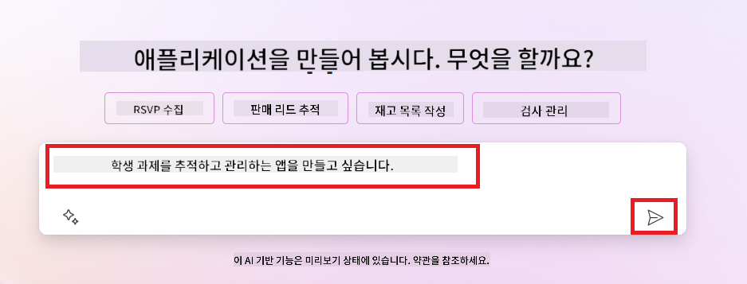

1. AI Copilot은 추적하려는 데이터를 저장할 필드와 샘플 데이터를 갖춘 Dataverse 테이블을 제안합니다. 그런 다음 대화형 단계에서 AI Copilot 어시스턴트 기능을 사용하여 테이블을 필요에 맞게 사용자 정의할 수 있습니다.

   > **중요**: Dataverse는 Power Platform의 기본 데이터 플랫폼입니다. 앱의 데이터를 저장할 저코드 데이터 플랫폼입니다. Microsoft 클라우드 내에서 데이터를 안전하게 저장하는 완전 관리 서비스이며, Power Platform 환경 내에서 프로비전됩니다. 데이터 분류, 데이터 계보, 세밀한 액세스 제어 등의 내장 데이터 거버넌스 기능이 함께 제공됩니다. Dataverse에 대해 더 알아보려면 [여기](https://docs.microsoft.com/powerapps/maker/data-platform/data-platform-intro?WT.mc_id=academic-109639-somelezediko)를 참조하세요.

   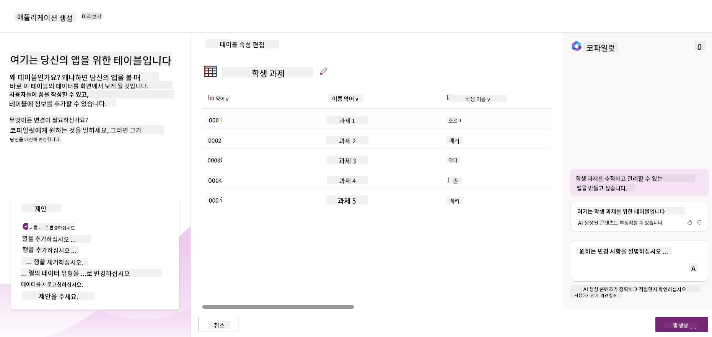

1. 교육자들은 과제를 제출한 학생들에게 이메일을 보내 과제 진행 상황을 업데이트하고 싶어합니다. Copilot을 사용하여 학생 이메일을 저장할 새 필드를 테이블에 추가할 수 있습니다. 예를 들어, 다음 프롬프트를 사용하여 테이블에 새 필드를 추가할 수 있습니다: **_학생 이메일을 저장할 열을 추가하고 싶습니다_**. **Send** 버튼을 클릭하여 AI Copilot에 프롬프트를 보냅니다.

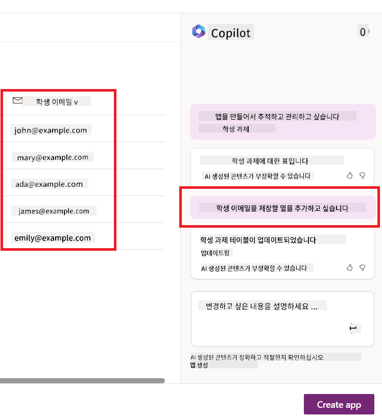

1. AI Copilot은 새 필드를 생성하고 필요에 맞게 필드를 사용자 정의할 수 있습니다.

1. 테이블이 완료되면 **Create app** 버튼을 클릭하여 앱을 생성합니다.

1. AI Copilot은 설명에 기반하여 반응형 Canvas 앱을 생성합니다. 그런 다음 앱을 필요에 맞게 사용자 정의할 수 있습니다.

1. 교육자들이 학생에게 이메일을 보내기 위해 Copilot을 사용하여 앱에 새 화면을 추가할 수 있습니다. 예를 들어, 다음 프롬프트를 사용하여 앱에 새 화면을 추가할 수 있습니다: **_학생에게 이메일을 보내는 화면을 추가하고 싶습니다_**. **Send** 버튼을 클릭하여 AI Copilot에 프롬프트를 보냅니다.

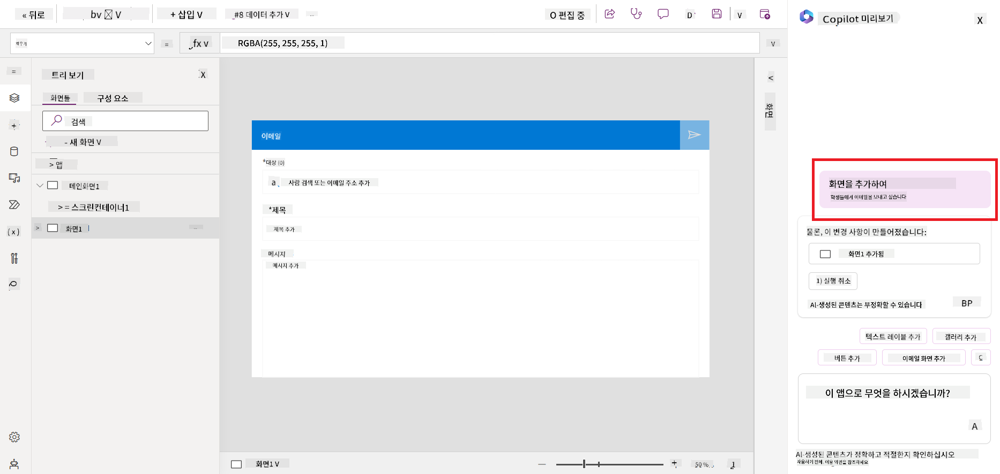

1. AI Copilot은 새 화면을 생성하고 필요에 맞게 화면을 사용자 정의할 수 있습니다.

1. 앱이 완료되면 **Save** 버튼을 클릭하여 앱을 저장합니다.

1. 교육자와 앱을 공유하려면 **Share** 버튼을 클릭하고 다시 **Share** 버튼을 클릭합니다. 그런 다음 교육자의 이메일 주소를 입력하여 앱을 공유할 수 있습니다.

> **과제**: 방금 만든 앱은 좋은 시작이지만 개선할 수 있습니다. 이메일 기능으로 교육자들은 학생의 이메일을 수동으로 입력해야만 이메일을 보낼 수 있습니다. 과제를 제출할 때 교육자가 학생에게 자동으로 이메일을 보낼 수 있도록 자동화를 구축할 수 있나요? 힌트는 적절한 프롬프트를 사용하여 Power Automate의 Copilot을 사용하여 이를 구축할 수 있다는 것입니다.

### 우리 스타트업을 위한 청구서 정보 테이블 구축하기

우리 스타트업의 재무팀은 청구서를 추적하는 데 어려움을 겪고 있습니다. 그들은 스프레드시트를 사용하여 청구서를 추적했지만 청구서 수가 증가하면서 관리하기 어려워졌습니다. 그들은 당신에게 받은 청구서의 정보를 저장, 추적 및 관리할 수 있는 테이블을 만들어 달라고 요청했습니다. 테이블은 모든 청구서 정보를 추출하여 테이블에 저장하는 자동화를 구축하는 데 사용되어야 합니다. 또한 재무팀이 지불된 청구서와 지불되지 않은 청구서를 볼 수 있어야 합니다.

Power Platform에는 Dataverse라는 기본 데이터 플랫폼이 있어 앱과 솔루션의 데이터를 저장할 수 있습니다. Dataverse는 앱의 데이터를 저장할 저코드 데이터 플랫폼을 제공합니다. Microsoft 클라우드 내에서 데이터를 안전하게 저장하는 완전 관리 서비스이며, Power Platform 환경 내에서 프로비전됩니다. 데이터 분류, 데이터 계보, 세밀한 액세스 제어 등의 내장 데이터 거버넌스 기능이 함께 제공됩니다. [Dataverse에 대해 더 알아보려면 여기](https://docs.microsoft.com/powerapps/maker/data-platform/data-platform-intro?WT.mc_id=academic-109639-somelezediko)를 참조하세요.

우리 스타트업에 Dataverse를 사용해야 하는 이유는 무엇일까요? Dataverse의 표준 및 사용자 정의 테이블은 데이터를 안전하게 클라우드에 저장할 수 있는 옵션을 제공합니다. 테이블을 사용하여 여러 Excel 워크북의 여러 워크시트처럼 다양한 유형의 데이터를 저장할 수 있습니다. 조직 또는 비즈니스 요구에 맞는 데이터를 저장하기 위해 테이블을 사용할 수 있습니다. 우리 스타트업이 Dataverse를 사용함으로써 얻을 수 있는 혜택은 다음과 같습니다:

- **관리하기 쉬움**: 메타데이터와 데이터가 클라우드에 저장되므로 저장 및 관리 방법에 대해 걱정할 필요가 없습니다. 앱과 솔루션을 구축하는 데 집중할 수 있습니다.

- **안전함**: Dataverse는 데이터를 안전하게 클라우드에 저장할 수 있는 옵션을 제공합니다. 역할 기반 보안을 사용하여 테이블의 데이터에 대한 액세스 권한을 제어할 수 있습니다.

- **풍부한 메타데이터**: 데이터 유형과 관계가 Power Apps 내에서 직접 사용됩니다.

- **논리와 유효성 검사**: 비즈니스 규칙, 계산 필드 및 유효성 검사 규칙을 사용하여 비즈니스 논리를 강제하고 데이터 정확성을 유지할 수 있습니다.

이제 Dataverse가 무엇인지, 왜 사용해야 하는지 알았으니 Copilot을 사용하여 재무팀의 요구 사항을 충족하는 테이블을 Dataverse에 생성하는 방법을 살펴보겠습니다.

> **참고**: 다음 섹션에서는 모든 청구서 정보를 추출하여 테이블에 저장하는 자동화를 구축하기 위해 이 테이블을 사용할 것입니다.
Copilot을 사용하여 Dataverse에 테이블을 생성하려면 다음 단계를 따르세요: 1. [Power Apps](https://make.powerapps.com?WT.mc_id=academic-105485-koreyst) 홈 화면으로 이동합니다. 2. 왼쪽 탐색 막대에서 **Tables**를 선택하고 **Describe the new Table**을 클릭합니다. 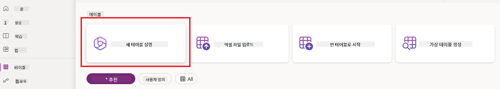 1. **Describe the new Table** 화면에서 텍스트 영역을 사용하여 만들고자 하는 테이블을 설명합니다. 예를 들어, **_청구서 정보를 저장할 테이블을 만들고 싶습니다_**. **Send** 버튼을 클릭하여 AI Copilot에 프롬프트를 보냅니다. 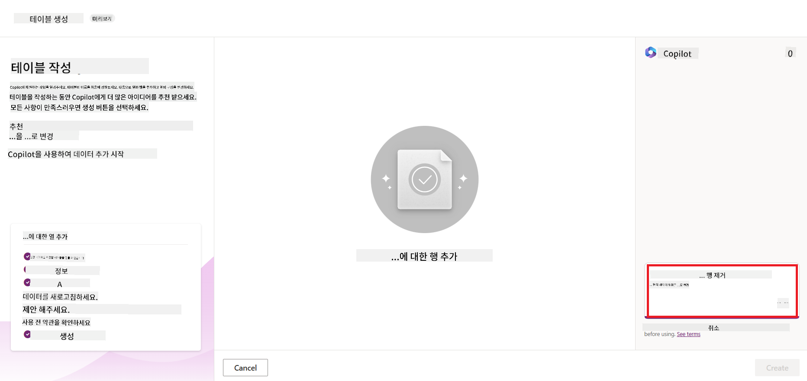 1. AI Copilot은 추적하려는 데이터를 저장할 필드와 샘플 데이터를 갖춘 Dataverse 테이블을 제안합니다. 그런 다음 대화형 단계에서 AI Copilot 어시스턴트 기능을 사용하여 테이블을 필요에 맞게 사용자 정의할 수 있습니다. 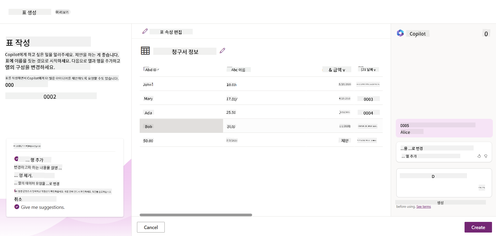 1. 재무팀은 청구서의 현재 상태를 업데이트하기 위해 공급자에게 이메일을 보내고 싶어합니다. Copilot을 사용하여 공급자 이메일을 저장할 새 필드를 테이블에 추가할 수 있습니다. 예를 들어, 다음 프롬프트를 사용하여 테이블에 새 필드를 추가할 수 있습니다: **_공급자 이메일을 저장할 열을 추가하고 싶습니다_**. **Send** 버튼을 클릭하여 AI Copilot에 프롬프트를 보냅니다. 1. AI Copilot은 새 필드를
텍스트입니다. - **감정 분석**: 이 모델은 텍스트에서 긍정적, 부정적, 중립적, 혼합된 감정을 감지합니다. - **명함 인식기**: 이 모델은 명함에서 정보를 추출합니다. - **텍스트 인식**: 이 모델은 이미지에서 텍스트를 추출합니다. - **객체 감지**: 이 모델은 이미지에서 객체를 감지하고 추출합니다. - **문서 처리**: 이 모델은 양식에서 정보를 추출합니다. - **청구서 처리**: 이 모델은 청구서에서 정보를 추출합니다. 사용자 정의 AI 모델을 사용하면 AI Builder에 자신의 모델을 가져와서 AI Builder 사용자 정의 모델처럼 작동할 수 있으며, 이를 통해 자신의 데이터를 사용하여 모델을 훈련할 수 있습니다. 이러한 모델을 사용하여 프로세스를 자동화하고 Power Apps와 Power Automate에서 결과를 예측할 수 있습니다. 자신의 모델을 사용할 때 적용되는 제한 사항이 있습니다. 이러한 [제한 사항](https://learn.microsoft.com/ai-builder/byo-model#limitations?WT.mc_id=academic-105485-koreyst)에 대해 자세히 읽어보세요. 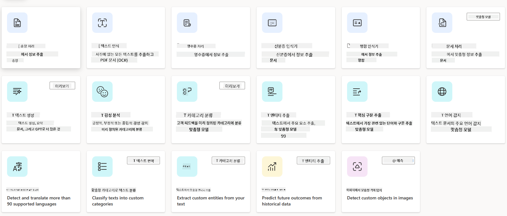

## 과제 #2 - 우리 스타트업을 위한 청구서 처리 흐름 구축

재무 팀은 청구서를 처리하는 데 어려움을 겪고 있습니다. 그들은 청구서를 추적하기 위해 스프레드시트를 사용해왔지만, 청구서 수가 증가하면서 관리하기 어려워졌습니다. 그들은 AI를 사용하여 청구서를 처리하는 워크플로를 구축해달라고 요청했습니다. 워크플로는 청구서에서 정보를 추출하고 Dataverse 테이블에 정보를 저장할 수 있어야 합니다. 또한 추출된 정보를 포함한 이메일을 재무 팀에 보낼 수 있어야 합니다. 이제 AI Builder가 무엇인지, 왜 사용해야 하는지 알게 되었으니, 앞서 다룬 AI Builder의 청구서 처리 AI 모델을 사용하여 재무 팀이 청구서를 처리하는 데 도움이 되는 워크플로를 구축하는 방법을 살펴보겠습니다. AI Builder의 청구서 처리 AI 모델을 사용하여 재무 팀이 청구서를 처리하는 데 도움이 되는 워크플로를 구축하려면 아래 단계를 따르세요:

1. [Power Automate](https://make.powerautomate.com?WT.mc_id=academic-105485-koreyst) 홈 화면으로 이동합니다.
2. 홈 화면의 텍스트 영역을 사용하여 구축하려는 워크플로를 설명합니다. 예를 들어, **_메일함에 청구서가 도착하면 처리_**라고 입력합니다. **전송** 버튼을 클릭하여 AI Copilot에 프롬프트를 전송합니다. 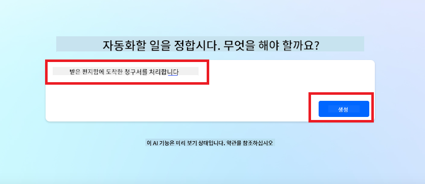
3. AI Copilot이 자동화하려는 작업에 필요한 작업을 제안합니다. **다음** 버튼을 클릭하여 다음 단계를 진행할 수 있습니다.
4. 다음 단계에서 Power Automate가 흐름에 필요한 연결을 설정하라고 요청합니다. 완료되면 **흐름 생성** 버튼을 클릭하여 흐름을 생성합니다.
5. AI Copilot이 흐름을 생성하고, 필요에 맞게 흐름을 사용자 정의할 수 있습니다.
6. 흐름의 트리거를 업데이트하고, **폴더**를 청구서가 저장될 폴더로 설정합니다. 예를 들어, 폴더를 **받은 편지함**으로 설정할 수 있습니다. **고급 옵션 표시**를 클릭하고 **첨부 파일만**을 **예**로 설정합니다. 이렇게 하면 첨부 파일이 있는 이메일이 폴더에 도착할 때만 흐름이 실행됩니다.
7. 흐름에서 다음 작업을 제거합니다: **HTML to text**, **Compose**, **Compose 2**, **Compose 3** 및 **Compose 4**. 이 작업들은 사용하지 않을 것이기 때문입니다.
8. **조건** 작업을 흐름에서 제거합니다. 이 작업도 사용하지 않을 것입니다. 다음 스크린샷과 같이 보일 것입니다: 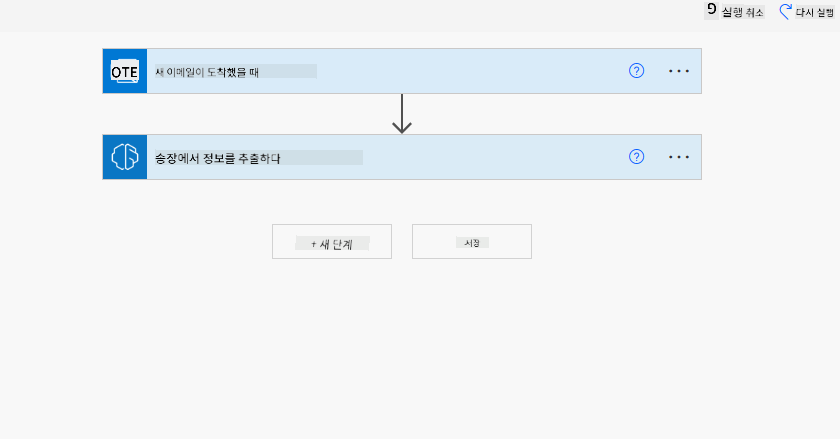
9. **작업 추가** 버튼을 클릭하고 **Dataverse**를 검색합니다. **새 행 추가** 작업을 선택합니다.
10. **청구서에서 정보 추출** 작업에서 **청구서 파일**을 이메일의 **첨부 파일 콘텐츠**로 가리키도록 업데이트합니다. 이렇게 하면 흐름이 청구서 첨부 파일에서 정보를 추출합니다.
11. 이전에 생성한 **테이블**을 선택합니다. 예를 들어, **청구서 정보** 테이블을 선택할 수 있습니다. 이전 작업에서 동적 콘텐츠를 선택하여 다음 필드를 채웁니다: - ID - 금액 - 날짜 - 이름 - 상태 - **상태**를 **대기 중**으로 설정합니다. - 공급업체 이메일 - **새 이메일이 도착하면** 트리거에서 **발신자** 동적 콘텐츠를 사용합니다. 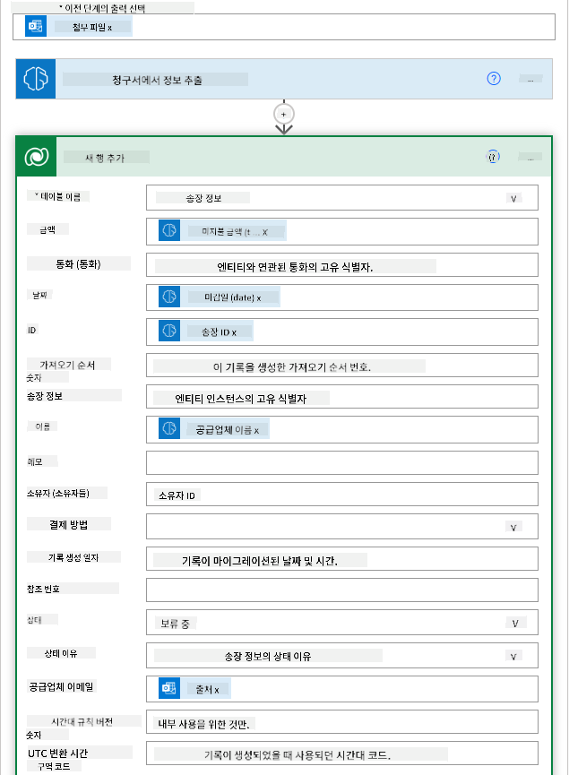
12. 흐름을 완료하면 **저장** 버튼을 클릭하여 흐름을 저장합니다. 그런 다음 트리거에서 지정한 폴더로 청구서를 포함한 이메일을 보내 흐름을 테스트할 수 있습니다.

> **숙제**: 방금 구축한 흐름은 좋은 시작입니다. 이제 우리 재무 팀이 공급업체에게 청구서의 현재 상태를 업데이트하는 이메일을 보낼 수 있는 자동화를 구축하는 방법을 생각해 보세요. 힌트: 흐름은 청구서의 상태가 변경될 때 실행되어야 합니다.

## Power Automate에서 텍스트 생성 AI 모델 사용하기

AI Builder의 GPT AI 모델로 텍스트 생성 기능을 사용하면 프롬프트를 기반으로 텍스트를 생성할 수 있으며, 이는 Microsoft Azure OpenAI 서비스에 의해 지원됩니다. 이 기능을 통해 앱과 흐름에 GPT(Generative Pre-Trained Transformer) 기술을 통합하여 다양한 자동화 흐름과 통찰력 있는 애플리케이션을 구축할 수 있습니다.

GPT 모델은 방대한 양의 데이터로 광범위한 훈련을 받아, 프롬프트가 주어졌을 때 인간 언어와 유사한 텍스트를 생성할 수 있습니다. 워크플로 자동화와 통합되면 GPT와 같은 AI 모델을 활용하여 다양한 작업을 간소화하고 자동화할 수 있습니다.

예를 들어, 이메일 초안, 제품 설명 등 다양한 사용 사례에 대해 자동으로 텍스트를 생성하는 흐름을 구축할 수 있습니다. 또한, 고객 서비스 에이전트가 고객 문의에 효과적이고 효율적으로 응답할 수 있는 챗봇 및 고객 서비스 앱과 같은 다양한 앱에 대해 텍스트를 생성하는 데 모델을 사용할 수 있습니다.

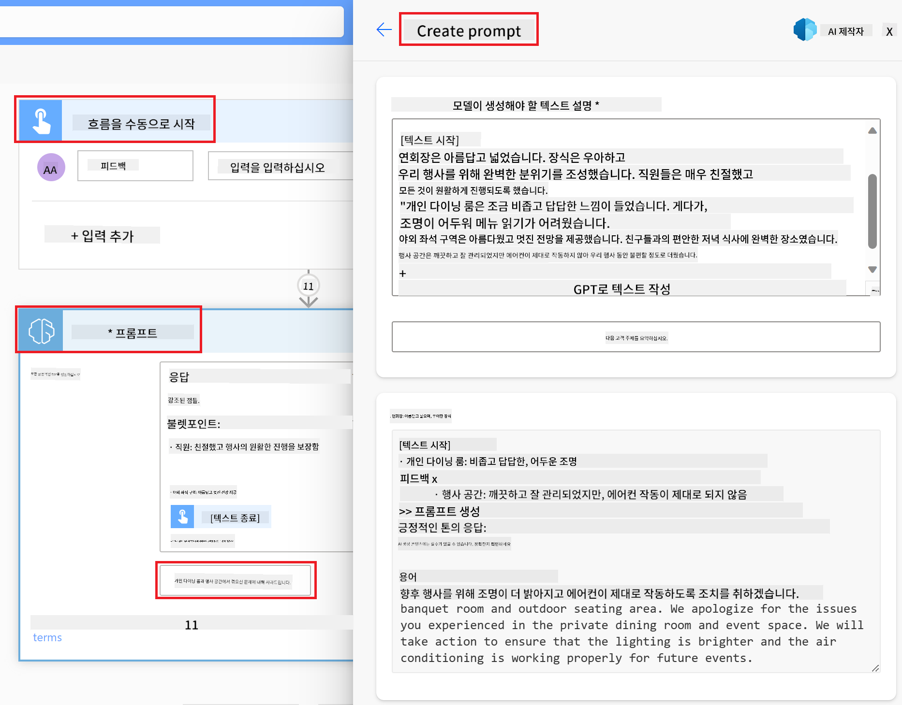

이 AI 모델을 Power Automate에서 사용하는 방법을 배우려면 [AI Builder와 GPT로 지능 추가하기](https://learn.microsoft.com/training/modules/ai-builder-text-generation/?WT.mc_id=academic-109639-somelezediko) 모듈을 참조하세요.

## 훌륭한 작업! 학습을 계속하세요

이 수업을 완료한 후, [Generative AI 학습 컬렉션](https://aka.ms/genai-collection?WT.mc_id=academic-105485-koreyst)을 확인하여 생성형 AI 지식을 계속 향상시키세요!

Lesson 11로 이동하여 [Function Calling과 생성형 AI 통합하기](../11-integrating-with-function-calling/README.md?WT.mc_id=academic-105485-koreyst)를 살펴보세요!

**면책 조항**:  
이 문서는 AI 번역 서비스 [Co-op Translator](https://github.com/Azure/co-op-translator)를 사용하여 번역되었습니다. 우리는 정확성을 위해 노력하지만, 자동 번역에는 오류나 부정확한 부분이 있을 수 있음을 유의하시기 바랍니다. 원본 문서는 해당 언어로 작성된 것이 권위 있는 자료로 간주되어야 합니다. 중요한 정보에 대해서는 전문적인 인적 번역을 권장합니다. 이 번역을 사용함으로써 발생하는 오해나 잘못된 해석에 대해 우리는 책임을 지지 않습니다.