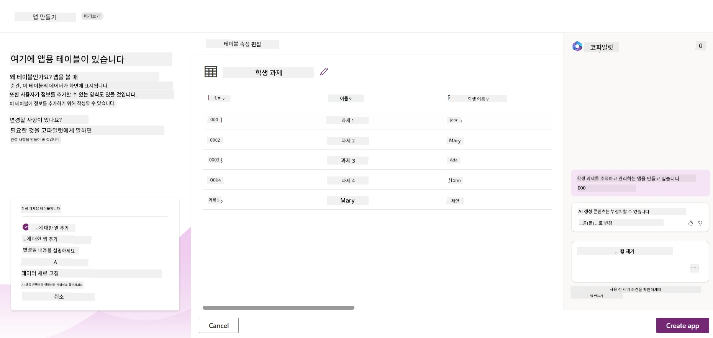
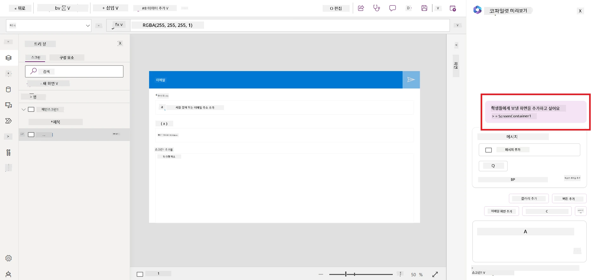
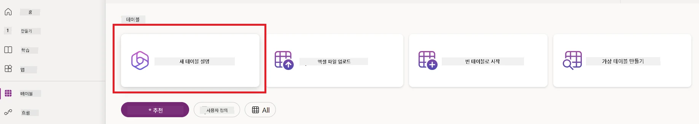
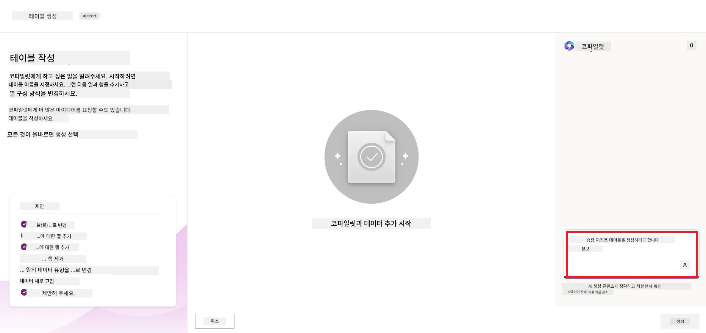
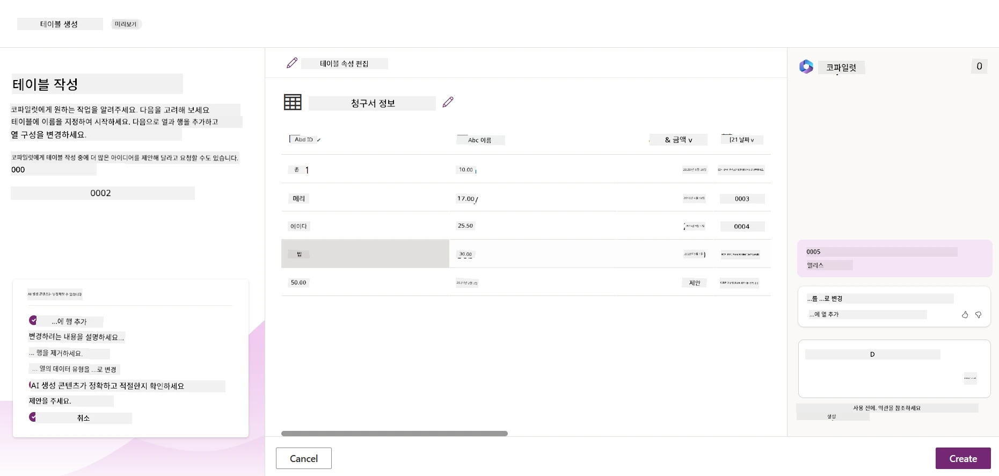
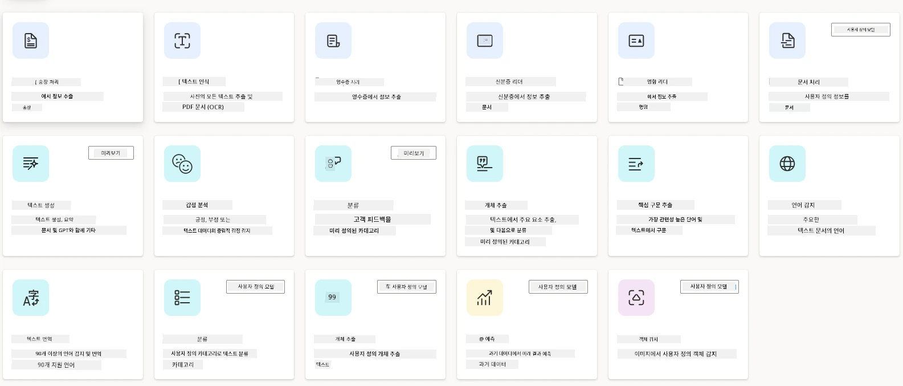
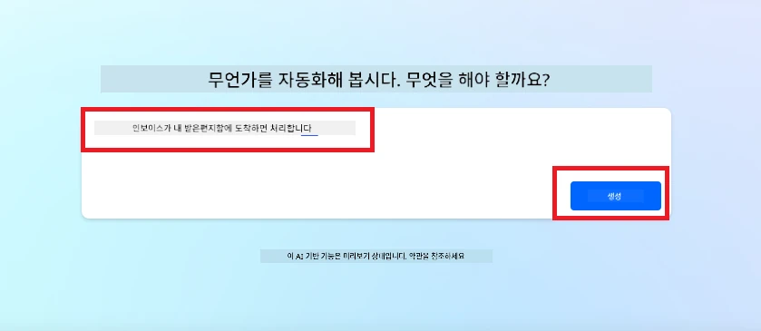
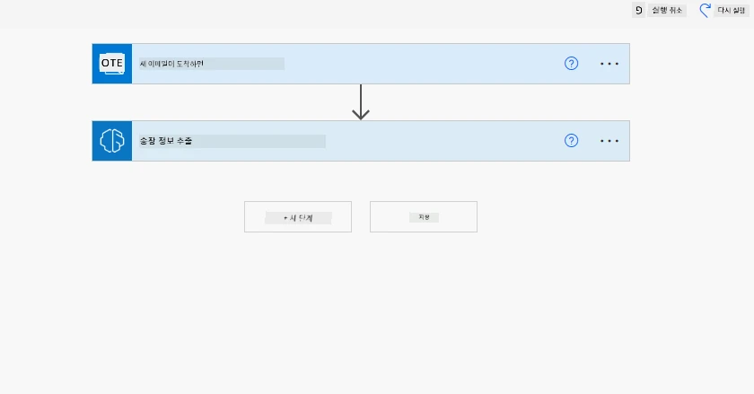
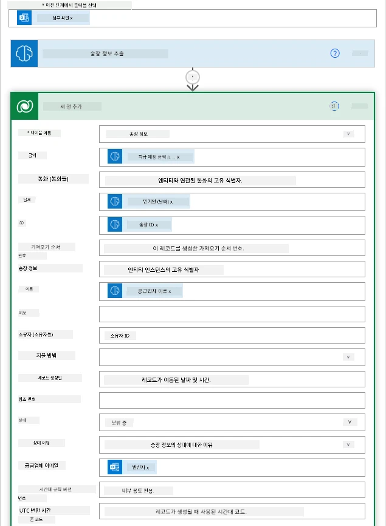
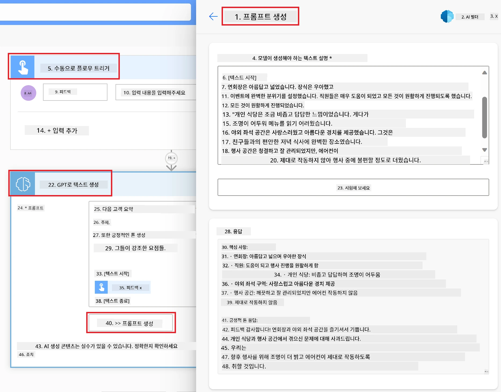

# 로우 코드 AI 애플리케이션 구축

> _(위 이미지를 클릭하여 이 수업의 동영상을 보세요)_

## 소개

이미지 생성 애플리케이션 구축 방법을 배웠으니, 이제 로우 코드에 대해 이야기해보겠습니다. 생성 AI는 로우 코드를 비롯한 다양한 분야에 사용할 수 있는데, 로우 코드란 무엇이며 여기에 AI를 어떻게 추가할 수 있을까요?

로우 코드 개발 플랫폼을 통해 전통적인 개발자 및 비개발자 모두 앱과 솔루션을 더 쉽게 구축할 수 있게 되었습니다. 로우 코드 개발 플랫폼은 거의 또는 전혀 코딩하지 않고도 앱과 솔루션을 만들 수 있게 해줍니다. 시각적 개발 환경을 제공하여 컴포넌트를 드래그 앤 드롭하여 앱과 솔루션을 구축할 수 있게 하는 방식입니다. 이를 통해 더 빠르고 적은 자원으로 앱과 솔루션을 개발할 수 있습니다. 이 수업에서는 로우 코드 사용법과 Power Platform을 활용해 AI로 로우 코드 개발을 강화하는 방법을 자세히 알아봅니다.

Power Platform은 조직이 팀이 직접 솔루션을 구축할 수 있도록 직관적인 로우 코드 또는 노 코드 환경을 제공합니다. 이 환경은 솔루션 구축 과정을 간소화합니다. Power Platform을 사용하면 솔루션을 몇 달 또는 몇 년이 아닌 며칠 또는 몇 주 안에 구축할 수 있습니다. Power Platform은 다섯 가지 핵심 제품으로 구성됩니다: Power Apps, Power Automate, Power BI, Power Pages, 그리고 Copilot Studio.

이 수업에서 다루는 내용은 다음과 같습니다:

- Power Platform에서 생성 AI 소개
- Copilot 소개 및 사용 방법
- Power Platform에서 생성 AI를 사용해 앱과 흐름 빌드하기
- AI Builder와 함께 Power Platform의 AI 모델 이해하기
- Microsoft Copilot Studio로 지능형 에이전트 구축하기

## 학습 목표

이 수업을 마치면 다음을 할 수 있게 됩니다:

- Power Platform에서 Copilot이 어떻게 작동하는지 이해하기

- 교육 스타트업을 위한 학생 과제 추적 앱 구축하기

- AI를 사용해 송장 정보를 추출하는 송장 처리 흐름 구축하기

- Create Text with GPT AI 모델 사용 시 모범 사례 적용하기

- Microsoft Copilot Studio가 무엇인지 그리고 이를 사용해 지능형 에이전트를 구축하는 방법 이해하기

이 수업에서 사용할 도구와 기술은 다음과 같습니다:

- 앱 개발 환경을 제공하는 **Power Apps** (학생 과제 추적 앱용). 데이터를 추적, 관리, 상호 작용하는 앱을 로우 코드로 빌드할 수 있습니다.

- 학생 과제 추적 앱 데이터를 저장하기 위한 **Dataverse**. Dataverse는 앱 데이터를 저장하는 로우 코드 데이터 플랫폼을 제공합니다.

- 송장 처리 흐름을 구축하는 **Power Automate**. 송장 처리 작업을 자동화하는 워크플로를 로우 코드 환경에서 개발할 수 있습니다.

- 송장 처리 AI 모델을 위한 **AI Builder**. 미리 구축된 AI 모델을 사용하여 스타트업의 송장 처리를 자동화할 수 있습니다.

## Power Platform의 생성 AI

생성 AI로 로우 코드 개발 및 애플리케이션을 강화하는 것은 Power Platform의 핵심 목표입니다. 목표는 _데이터 과학 전문 지식 없이도_ 누구나 AI 기반 앱, 사이트, 대시보드를 빌드하고 AI로 프로세스를 자동화할 수 있도록 하는 것입니다. 이 목표는 Copilot과 AI Builder 형태로 Power Platform의 로우 코드 개발 경험에 생성 AI를 통합함으로써 달성됩니다.

### 어떻게 작동할까요?

Copilot은 자연어를 사용한 일련의 대화식 단계로 요구사항을 설명하면 Power Platform 솔루션을 구축할 수 있게 해주는 AI 비서입니다. 예를 들어 앱에 사용할 필드를 지시하면 앱과 기본 데이터 모델을 모두 생성하거나 Power Automate에서 플로우 설정 방법을 지정할 수 있습니다.

Copilot 기반 기능은 앱 화면에서 사용자가 대화형 상호작용을 통해 인사이트를 발견할 수 있도록 해주는 기능으로 사용할 수 있습니다.

AI Builder는 Power Platform 내 이용 가능한 로우 코드 AI 기능으로, AI 모델을 활용해 프로세스를 자동화하고 결과를 예측할 수 있게 합니다. AI Builder를 통해 Dataverse 또는 SharePoint, OneDrive, Azure 같은 다양한 클라우드 데이터 소스에 연결된 앱과 플로우에 AI를 적용할 수 있습니다.

Copilot은 Power Apps, Power Automate, Power BI, Power Pages, Copilot Studio(전 Power Virtual Agents) 등 모든 Power Platform 제품에서 사용할 수 있습니다. AI Builder는 Power Apps와 Power Automate에서 사용할 수 있습니다. 이 수업에서는 교육 스타트업을 위해 Power Apps와 Power Automate에서 Copilot과 AI Builder를 활용하는 방법에 중점을 둡니다.

### Power Apps의 Copilot

Power Platform의 일부인 Power Apps는 데이터를 추적, 관리, 상호작용하는 앱을 구축할 수 있는 로우 코드 개발 환경을 제공합니다. 확장 가능한 데이터 플랫폼과 클라우드 및 온프레미스 데이터 연결 기능을 포함한 앱 개발 서비스 모음입니다. Power Apps로 브라우저, 태블릿, 휴대폰에서 실행되는 앱을 구축하고 동료와 공유할 수 있습니다. 간단한 인터페이스로 앱 개발을 쉽게 하여 모든 비즈니스 사용자와 전문 개발자가 맞춤형 앱을 만들 수 있게 합니다. 생성 AI가 통합된 Copilot으로 앱 개발 경험도 향상됩니다.

Power Apps의 Copilot AI 비서 기능은 필요로 하는 앱 종류와 추적, 수집, 표시할 정보를 설명할 수 있게 해줍니다. Copilot은 설명을 바탕으로 반응형 캔버스 앱을 생성합니다. 그런 다음 필요에 맞게 앱을 맞춤 설정할 수 있습니다. AI Copilot은 또한 추적할 데이터를 저장하는 데 필요한 필드를 가진 Dataverse 테이블과 일부 샘플 데이터를 생성 및 제안합니다. 본 수업에서는 Dataverse가 무엇인지, Power Apps에서 어떻게 사용하는지 자세히 살펴봅니다. AI Copilot 대화형 단계 기능으로 테이블도 사용자의 필요에 맞게 맞춤 설정할 수 있습니다. 이 기능은 Power Apps 홈 화면에서 바로 사용할 수 있습니다.

### Power Automate의 Copilot

Power Platform의 일부인 Power Automate는 애플리케이션과 서비스 간 자동화된 워크플로를 생성할 수 있습니다. 커뮤니케이션, 데이터 수집, 승인 결정 등 반복 업무를 자동화하는 데 도움을 줍니다. 초보자부터 숙련된 개발자까지 모든 수준의 사용자가 간단한 인터페이스로 작업을 자동화할 수 있습니다. 워크플로 개발 경험은 Copilot의 생성 AI로 더욱 향상됩니다.

Power Automate의 Copilot AI 비서 기능은 필요한 플로우 종류와 플로우에서 수행할 작업을 설명할 수 있게 해줍니다. Copilot은 설명을 바탕으로 플로우를 생성합니다. 또 플로우를 필요에 맞게 맞춤 설정할 수 있습니다. AI Copilot은 자동화할 작업을 수행하는 데 필요한 작업도 생성 및 제안합니다. 본 수업에서는 플로우가 무엇인지 그리고 Power Automate에서의 활용법을 나중에 살펴봅니다. AI Copilot 대화형 단계 기능으로 작업도 맞춤 설계할 수 있습니다. 이 기능은 Power Automate 홈 화면에서 바로 사용할 수 있습니다.

## Microsoft Copilot Studio로 지능형 에이전트 구축하기

[Microsoft Copilot Studio](https://learn.microsoft.com/microsoft-copilot-studio/fundamentals-what-is-copilot-studio?WT.mc_id=academic-105485-koreyst)(구 Power Virtual Agents)는 Power Platform의 로우 코드 멤버로, 질문에 답변하고, 작업을 수행하며, 사용자를 대신해 작업을 자동화하는 대화형 AI 에이전트(코파일럿)를 구축할 수 있습니다. Power Platform과 마찬가지로 시각적이고 자연어 우선 경험에서 에이전트를 빌드하며, 에이전트가 수행할 작업, 지식, 행동을 설명하면 Copilot Studio가 이를 구성합니다.

우리 교육 스타트업에서는 코드를 작성하지 않고도 학생들의 강좌 질문에 답변하고, 과제 마감일을 확인하며, 강사에게 메일도 보내는 에이전트를 구축할 수 있습니다.

Copilot Studio를 강력하게 만드는 최신 기능들은 다음과 같습니다:

- **지식 기반 생성 답변**. 모든 대화를 수동으로 작성하는 대신, 공용 웹사이트, SharePoint, OneDrive, Dataverse, 업로드된 파일 또는 커넥터를 통한 기업 데이터 같은 <strong>지식 소스</strong>를 연결하여 에이전트가 이를 바탕으로 근거 있는 답변을 생성할 수 있습니다.

- **생성 오케스트레이션**. 엄격한 트리거 문구에 의존하지 않고, AI가 요청을 이해해 어떤 지식, 주제, 작업을 조합해 수행할지 동적으로 결정하며 여러 단계를 연쇄적으로 처리합니다.

- **작업과 커넥터**. 에이전트는 단순 채팅뿐 아니라 작업도 수행할 수 있습니다. 1,500개 이상의 사전 구축된 Power Platform 커넥터, Power Automate 플로우, 맞춤 REST API, 프롬프트, 또는 **모델 컨텍스트 프로토콜(MCP)** 서버를 통한 작업을 에이전트에 부여할 수 있습니다.

- **자율 에이전트**. 에이전트는 채팅 창에 답변하는 데만 국한되지 않습니다. 새 이메일, Dataverse 새 레코드, 파일 업로드 같은 이벤트에 의해 시작되는 <strong>자율 에이전트</strong>를 구축하여 백그라운드에서 작업을 완수할 수 있습니다.

- **다중 에이전트 오케스트레이션**. 에이전트가 다른 에이전트를 호출할 수 있습니다. Copilot Studio 에이전트는 Microsoft 365 Copilot 및 Microsoft Foundry에서 구축된 다른 에이전트로 넘기거나 이들로 확장될 수 있습니다.

- **모델 선택**. 내장 모델 외에도 Microsoft Foundry 모델 카탈로그에서 모델을 가져와 에이전트의 추론 및 응답 방식을 맞춤 설정할 수 있습니다.

- **어디서나 게시**. 구축한 에이전트는 Microsoft Teams, Microsoft 365 Copilot, 웹사이트 또는 맞춤 앱 등 다양한 채널에 게시할 수 있으며, 보안, 인증, 분석은 Power Platform 관리자 경험을 통해 관리됩니다.

첫 에이전트 구축은 [copilotstudio.microsoft.com](https://copilotstudio.microsoft.com?WT.mc_id=academic-105485-koreyst)에서 시작할 수 있으며, 자세한 내용은 [Microsoft Copilot Studio 문서](https://learn.microsoft.com/microsoft-copilot-studio/?WT.mc_id=academic-105485-koreyst)를 참고하세요.

## 과제: Copilot을 사용하여 스타트업의 학생 과제 및 송장 관리

우리 스타트업은 학생들에게 온라인 강좌를 제공합니다. 스타트업이 급성장하면서 강좌 수요를 따라가기가 어려워졌습니다. 스타트업은 학생 과제와 송장을 관리할 수 있는 로우 코드 솔루션을 구축하도록 Power Platform 개발자를 고용했습니다. 이 솔루션은 앱을 통해 학생 과제를 추적 및 관리하고, 워크플로를 통해 송장 처리 과정을 자동화할 수 있어야 합니다. 생성 AI를 사용해 솔루션을 개발하도록 요청받았습니다.

Copilot 사용을 시작할 때는 [Power Platform Copilot Prompt Library](https://github.com/pnp/powerplatform-prompts?WT.mc_id=academic-109639-somelezediko)를 활용해 프롬프트를 참고할 수 있습니다. 이 라이브러리는 Copilot으로 앱과 플로우를 구축할 때 사용할 수 있는 프롬프트 목록을 제공합니다. 또한 요구사항을 Copilot에 설명하는 방법을 이해하는 데 도움이 됩니다.

### 스타트업을 위한 학생 과제 추적 앱 구축

우리 스타트업의 교육 담당자들은 학생 과제 관리를 위해 고군분투하고 있습니다. 과제를 추적하기 위해 스프레드시트를 사용해왔으나, 학생 수가 늘어나면서 관리가 어려워졌습니다. 이에 학생 과제를 추적하고 관리할 수 있는 앱을 구축해달라고 요청했습니다. 이 앱은 새 과제를 추가하고, 과제를 조회하며, 과제를 업데이트하고 삭제할 수 있어야 합니다. 또한 교육자 및 학생이 채점된 과제와 채점되지 않은 과제를 볼 수 있어야 합니다.

아래 단계를 따라 Power Apps의 Copilot을 사용해 앱을 구축합니다:

1. [Power Apps](https://make.powerapps.com?WT.mc_id=academic-105485-koreyst) 홈 화면으로 이동합니다.

1. 홈 화면의 텍스트 영역에 만들고자 하는 앱을 설명합니다. 예: **_학생 과제 추적 및 관리 앱을 만들고 싶습니다_**. AI Copilot에 프롬프트를 보내려면 <strong>전송</strong> 버튼을 클릭합니다.

1. AI Copilot이 추적할 데이터를 저장하는 데 필요한 필드가 포함된 Dataverse 테이블과 일부 샘플 데이터를 제안합니다. 그다음 대화형 단계를 통해 AI Copilot 보조 기능으로 테이블을 필요에 맞게 맞춤 설정할 수 있습니다.

   > <strong>중요</strong>: Dataverse는 Power Platform의 기반 데이터 플랫폼입니다. 앱의 데이터를 저장하는 로우 코드 데이터 플랫폼이며, 완전 관리형 서비스로 Microsoft 클라우드에 안전하게 데이터를 저장합니다. Power Platform 환경 내에 프로비저닝됩니다. 데이터 분류, 데이터 계보, 세분화된 접근 제어 등 내장된 데이터 거버넌스 기능이 포함되어 있습니다. 자세한 내용은 [여기](https://docs.microsoft.com/powerapps/maker/data-platform/data-platform-intro?WT.mc_id=academic-109639-somelezediko)에서 확인하세요.

   

1. 교육자들은 과제를 제출한 학생들에게 개별 진척 상황을 이메일로 알리고자 합니다. Copilot을 사용해 학생 이메일을 저장할 수 있는 새 필드를 테이블에 추가할 수 있습니다. 예를 들어, 다음과 같은 프롬프트를 사용할 수 있습니다: **_학생 이메일을 저장할 열을 추가하고 싶습니다_**. AI Copilot으로 프롬프트를 보내려면 <strong>전송</strong> 버튼을 클릭합니다.

1. AI Copilot이 새 필드를 생성하면 필요에 맞게 필드를 맞춤 설정할 수 있습니다.

1. 표 작업이 완료되면 **앱 만들기** 버튼을 클릭하여 앱을 생성합니다.

1. AI Copilot이 설명을 기반으로 반응형 Canvas 앱을 생성합니다. 그런 다음 필요에 맞게 앱을 사용자 지정할 수 있습니다.

1. 교사가 학생들에게 이메일을 보내려면 Copilot을 사용하여 앱에 새 화면을 추가할 수 있습니다. 예를 들어 다음 프롬프트를 사용하여 앱에 새 화면을 추가할 수 있습니다: **_학생에게 이메일을 보내는 화면을 추가하고 싶어요_**. 프롬프트를 AI Copilot에 보내려면 <strong>보내기</strong> 버튼을 클릭합니다.

1. AI Copilot이 새 화면을 생성하고 필요에 맞게 화면을 사용자 지정할 수 있습니다.

1. 앱 작업이 완료되면 <strong>저장</strong> 버튼을 클릭하여 앱을 저장합니다.

1. 앱을 교사와 공유하려면 <strong>공유</strong> 버튼을 클릭한 다음 다시 <strong>공유</strong> 버튼을 클릭합니다. 그런 다음 교사의 이메일 주소를 입력하여 앱을 공유할 수 있습니다.

> <strong>과제</strong>: 방금 만든 앱은 좋은 시작이지만 개선할 수 있습니다. 이메일 기능을 사용하면 교사가 학생 이메일을 직접 입력해야만 수동으로 이메일을 보낼 수 있습니다. Copilot을 사용하여 교사가 과제를 제출할 때 자동으로 학생들에게 이메일을 보낼 수 있는 자동화 기능을 만들 수 있을까요? 힌트: 적절한 프롬프트를 사용하면 Power Automate에서 Copilot을 활용하여 이를 구축할 수 있습니다.

### 우리 스타트업을 위한 청구서 정보 테이블 만들기

스타트업의 재무팀은 청구서를 추적하는 데 어려움을 겪고 있습니다. 그들은 청구서를 추적하기 위해 스프레드시트를 사용해왔지만, 청구서 수가 늘어나면서 관리가 어려워졌습니다. 재무팀이 수신한 청구서 정보를 저장, 추적 및 관리할 수 있도록 도와주는 테이블을 만들어 달라고 요청했습니다. 이 테이블은 청구서 정보를 추출해 저장하는 자동화를 구축하는 데 사용되어야 합니다. 또한 재무팀이 지불된 청구서와 지불되지 않은 청구서를 쉽게 볼 수 있어야 합니다.

Power Platform에는 Dataverse라는 기본 데이터 플랫폼이 있어 앱과 솔루션의 데이터를 저장할 수 있습니다. Dataverse는 앱 데이터를 저장하기 위한 로우코드 데이터 플랫폼을 제공합니다. 이는 완전 관리형 서비스로, Microsoft 클라우드에 데이터를 안전하게 저장하며 Power Platform 환경 내에서 프로비저닝됩니다. 데이터 분류, 데이터 출처 추적, 세분화된 액세스 제어 등 내장된 데이터 거버넌스 기능도 갖추고 있습니다. [Dataverse에 대해 자세히 알아보세요](https://docs.microsoft.com/powerapps/maker/data-platform/data-platform-intro?WT.mc_id=academic-109639-somelezediko).

스타트업이 Dataverse를 사용해야 하는 이유는 무엇일까요? Dataverse 내 표준 및 사용자 지정 테이블은 데이터를 위한 안전하고 클라우드 기반 저장 옵션을 제공합니다. 테이블은 여러 워크시트가 있는 Excel 워크북처럼 다양한 유형의 데이터를 저장할 수 있게 합니다. 조직 또는 비즈니스 요구에 맞는 데이터를 저장하는 데 사용할 수 있습니다. 스타트업이 Dataverse를 사용해서 얻을 수 있는 이점은 다음과 같습니다(아래에 한정되지 않음):

- **관리 용이**: 메타데이터와 데이터가 모두 클라우드에 저장되므로 저장이나 관리 방식에 신경 쓸 필요가 없습니다. 앱과 솔루션 구축에 집중할 수 있습니다.

- <strong>안전성</strong>: Dataverse는 데이터를 위한 안전하고 클라우드 기반 저장 옵션을 제공합니다. 역할 기반 보안을 통해 누가 테이블 데이터에 접근할 수 있는지, 어떻게 접근할 수 있는지 제어할 수 있습니다.

- **풍부한 메타데이터**: 데이터 유형과 관계가 Power Apps 내에서 직접 활용됩니다.

- **논리 및 유효성 검사**: 비즈니스 규칙, 계산 필드 및 유효성 검사 규칙을 사용하여 비즈니스 로직을 적용하고 데이터 정확성을 유지할 수 있습니다.

Dataverse가 무엇이고 사용해야 하는 이유를 알았으니, Copilot을 사용하여 재무팀 요구 사항에 맞는 Dataverse 테이블을 만드는 방법을 살펴보겠습니다.

> <strong>참고</strong> : 다음 섹션에서 이 테이블을 사용하여 모든 청구서 정보를 추출하고 테이블에 저장하는 자동화를 구축할 것입니다.

Copilot을 사용하여 Dataverse에 테이블을 생성하려면 아래 단계를 따르세요:

1. [Power Apps](https://make.powerapps.com?WT.mc_id=academic-105485-koreyst) 홈 화면으로 이동합니다.

2. 왼쪽 탐색 바에서 <strong>테이블</strong>을 선택한 다음 <strong>새 테이블 설명</strong>을 클릭합니다.

1. **새 테이블 설명** 화면에서 생성하려는 테이블을 설명하는 텍스트 영역에 입력합니다. 예: **_청구서 정보를 저장할 테이블을 만들고 싶습니다_**. 프롬프트를 AI Copilot에 보내려면 <strong>보내기</strong> 버튼을 클릭합니다.

1. AI Copilot이 필요한 필드와 일부 샘플 데이터가 포함된 Dataverse 테이블을 제안합니다. 이후에 AI Copilot의 대화형 기능을 사용해 필요에 맞게 테이블을 사용자 지정할 수 있습니다.

1. 재무팀은 청구서 상태를 업데이트하기 위해 공급업체에 이메일을 보내고자 합니다. 공급업체 이메일을 저장할 새 필드를 테이블에 추가하도록 Copilot을 사용할 수 있습니다. 예를 들어 다음 프롬프트를 사용할 수 있습니다: **_공급업체 이메일을 저장할 열을 추가하고 싶습니다_**. 프롬프트를 AI Copilot에 보내려면 <strong>보내기</strong> 버튼을 클릭하세요.

1. AI Copilot이 새 필드를 생성하고 필요에 맞게 필드를 사용자 지정할 수 있습니다.

1. 테이블 작업이 완료되면 <strong>생성</strong> 버튼을 클릭하여 테이블을 만듭니다.

## Power Platform의 AI 모델과 AI Builder

AI Builder는 Power Platform에서 사용 가능한 로우코드 AI 기능으로, AI 모델을 사용해 프로세스를 자동화하고 결과를 예측할 수 있게 해줍니다. AI Builder를 통해 Dataverse 또는 SharePoint, OneDrive, Azure와 같은 다양한 클라우드 데이터 소스의 데이터를 연결하는 앱과 흐름에 AI를 도입할 수 있습니다.

## 미리 만들어진 AI 모델과 맞춤형 AI 모델

AI Builder는 미리 만들어진 AI 모델과 맞춤형 AI 모델 두 가지 유형을 제공합니다. 미리 만들어진 AI 모델은 Microsoft가 학습시켜 Power Platform에서 사용할 수 있게 한 즉시 사용할 수 있는 모델입니다. 이를 통해 데이터를 수집하고 직접 모델을 빌드, 학습, 배포하지 않아도 앱과 흐름에 인텔리전스를 추가할 수 있습니다. 이 모델들을 사용해 프로세스를 자동화하고 결과를 예측할 수 있습니다.

Power Platform에서 사용할 수 있는 미리 만들어진 AI 모델 중 일부는 다음과 같습니다:

- **핵심 문구 추출**: 텍스트에서 핵심 문구를 추출합니다.
- **언어 감지**: 텍스트의 언어를 감지합니다.
- **감정 분석**: 텍스트의 긍정, 부정, 중립 또는 혼합 감정을 감지합니다.
- **명함 인식**: 명함에서 정보를 추출합니다.
- **텍스트 인식**: 이미지에서 텍스트를 추출합니다.
- **객체 감지**: 이미지에서 물체를 감지하고 추출합니다.
- **문서 처리**: 양식에서 정보를 추출합니다.
- **청구서 처리**: 청구서에서 정보를 추출합니다.

맞춤형 AI 모델은 사용자가 직접 만든 모델을 AI Builder에 도입하여 자체 데이터를 사용해 모델을 학습시킬 수 있게 합니다. 이를 통해 Power Apps와 Power Automate에서 프로세스를 자동화하고 결과를 예측할 수 있습니다. 직접 모델을 사용할 때는 몇 가지 제한 사항이 적용됩니다. 자세한 내용은 이 [제한 사항](https://learn.microsoft.com/ai-builder/byo-model#limitations?WT.mc_id=academic-105485-koreyst)을 참조하세요.

## 과제 #2 - 우리 스타트업을 위한 청구서 처리 흐름 구축

재무팀은 청구서 처리가 어려웠습니다. 그들은 청구서를 스프레드시트로 추적했지만 청구서 수가 늘어나면서 관리가 어려워졌습니다. AI를 활용해 청구서를 처리하는 작업 흐름을 만들어 달라고 요청했습니다. 흐름은 청구서에서 정보를 추출해 Dataverse 테이블에 저장할 수 있어야 하며, 추출된 정보를 포함한 이메일을 재무팀에게 보내도록 해야 합니다.

AI Builder가 무엇이고 왜 사용해야 하는지 알았으니, 앞서 다룬 청구서 처리 AI 모델을 활용해 재무팀이 청구서를 처리하는 데 도움을 주는 작업 흐름을 만드는 방법을 살펴보겠습니다.

청구서 처리 AI 모델을 사용해 재무팀 청구서 처리를 돕는 작업 흐름을 만들려면 아래 단계를 따르세요:

1. [Power Automate](https://make.powerautomate.com?WT.mc_id=academic-105485-koreyst) 홈 화면으로 이동합니다.

2. 홈 화면의 텍스트 영역에 만들고자 하는 작업 흐름을 설명합니다. 예: **_내 메일함에 청구서가 도착하면 처리하기_**. 프롬프트를 AI Copilot에 보내려면 <strong>보내기</strong> 버튼을 클릭합니다.

   

3. AI Copilot이 자동화하려는 작업을 수행하기 위해 필요한 작업을 제안합니다. <strong>다음</strong> 버튼을 클릭해 다음 단계를 진행할 수 있습니다.

4. 다음 단계에서 Power Automate가 흐름에 필요한 연결 설정을 요청합니다. 완료되면 **흐름 만들기** 버튼을 클릭해 흐름을 생성합니다.

5. AI Copilot이 흐름을 생성하며, 필요에 맞게 흐름을 사용자 지정할 수 있습니다.

6. 흐름 트리거를 업데이트하고 <strong>폴더</strong>를 청구서가 저장될 폴더로 설정합니다. 예를 들어, <strong>받은 편지함</strong>으로 설정할 수 있습니다. <strong>고급 옵션 표시</strong>를 클릭하고 <strong>첨부 파일만</strong>을 <strong>예</strong>로 설정합니다. 이렇게 하면 첨부 파일이 있는 이메일이 폴더에 도착했을 때만 흐름이 실행됩니다.

7. 흐름에서 **HTML을 텍스트로 변환**, <strong>구성</strong>, **구성 2**, **구성 3**, **구성 4** 작업을 삭제하세요. 이 작업들은 사용하지 않을 것입니다.

8. 흐름에서 <strong>조건</strong> 작업도 삭제하세요. 다음 스크린샷과 같아야 합니다:

   

9. **작업 추가** 버튼을 클릭하고 <strong>Dataverse</strong>를 검색합니다. **새 행 추가** 작업을 선택하세요.

10. **청구서에서 정보 추출** 작업에서 <strong>청구서 파일</strong>을 이메일의 <strong>첨부 파일 내용</strong>으로 설정합니다. 이렇게 하면 청구서 첨부 파일에서 정보를 추출합니다.

11. 앞서 만든 <strong>테이블</strong>을 선택합니다. 예를 들어 **청구서 정보** 테이블을 선택할 수 있습니다. 다음 필드를 채우기 위해 이전 작업의 동적 콘텐츠를 선택하세요:

    - ID
    - 금액
    - 날짜
    - 이름
    - 상태 - <strong>상태</strong>를 <strong>대기 중</strong>으로 설정합니다.
    - 공급업체 이메일 - **새 이메일 도착 시** 트리거에서 **보낸 사람** 동적 콘텐츠를 사용합니다.

    

12. 흐름 작업이 완료되면 <strong>저장</strong> 버튼을 클릭해 저장합니다. 이후 지정한 폴더에 청구서 이메일을 보내 흐름을 테스트할 수 있습니다.

> <strong>과제</strong>: 방금 만든 흐름은 좋은 시작입니다. 이제 재무팀이 청구서 상태 변경 시 공급업체에 현재 상태를 업데이트하는 이메일을 보낼 수 있게 하는 자동화를 만드는 방법을 생각해 보세요. 힌트: 상태 변경 시 흐름이 실행돼야 합니다.

## Power Automate에서 텍스트 생성 AI 모델 사용하기

AI Builder의 Create Text with GPT AI 모델은 프롬프트를 기반으로 텍스트를 생성할 수 있으며 Microsoft Azure OpenAI 서비스가 지원합니다. 이 기능을 통해 GPT(Generative Pre-Trained Transformer) 기술을 앱과 흐름에 통합하여 다양한 자동화 흐름과 유용한 애플리케이션을 만들 수 있습니다.

GPT 모델은 방대한 데이터를 바탕으로 광범위한 학습을 거쳐 프롬프트에 대해 매우 인간과 유사한 텍스트를 생성할 수 있습니다. 작업 흐름 자동화와 결합할 경우 GPT와 같은 AI 모델을 사용해 다양한 작업을 간소화하고 자동화할 수 있습니다.

예를 들어 이메일 초안, 제품 설명 등 다양한 용도의 텍스트를 자동 생성하는 흐름을 만들 수 있습니다. 또한 고객 서비스 담당자가 고객 문의에 효율적이고 효과적으로 대응할 수 있도록 돕는 챗봇이나 고객 서비스 앱에도 이 모델을 사용할 수 있습니다.

Power Automate에서 이 AI 모델을 사용하는 방법을 배우려면 [Add intelligence with AI Builder and GPT](https://learn.microsoft.com/training/modules/ai-builder-text-generation/?WT.mc_id=academic-109639-somelezediko) 모듈을 살펴보세요.

## 훌륭합니다! 학습을 계속하세요

이 강의를 마친 후에는 [Generative AI Learning collection](https://aka.ms/genai-collection?WT.mc_id=academic-105485-koreyst)을 확인하여 생성형 AI 지식을 더욱 확장하세요!

Copilot을 맞춤화하고 더 많이 활용하고 싶나요? GitHub Copilot을 최대한 활용할 수 있도록 명령어, 에이전트, 기능 및 구성을 모은 커뮤니티 기여 컬렉션인 [Awesome Copilot](https://github.com/github/awesome-copilot?WT.mc_id=academic-105485-koreyst)을 탐색해 보세요.

11강에서 [Function Calling과 생성형 AI 통합](../11-integrating-with-function-calling/README.md?WT.mc_id=academic-105485-koreyst)에 대해 다룰 예정이니 확인해 보세요!

---

<!-- CO-OP TRANSLATOR DISCLAIMER START -->
**면책 조항**:
이 문서는 AI 번역 서비스 [Co-op Translator](https://github.com/Azure/co-op-translator)를 사용하여 번역되었습니다. 정확성을 기하기 위해 노력하고 있으나, 자동 번역은 오류나 부정확한 부분이 있을 수 있음을 유의하시기 바랍니다. 원본 문서의 원어본이 권위 있는 자료로 간주되어야 합니다. 중요한 정보의 경우, 전문가의 인간 번역을 권장합니다. 이 번역 사용으로 인해 발생하는 오해나 잘못된 해석에 대해 당사는 책임을 지지 않습니다.
<!-- CO-OP TRANSLATOR DISCLAIMER END -->