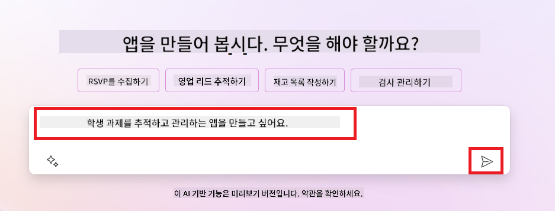
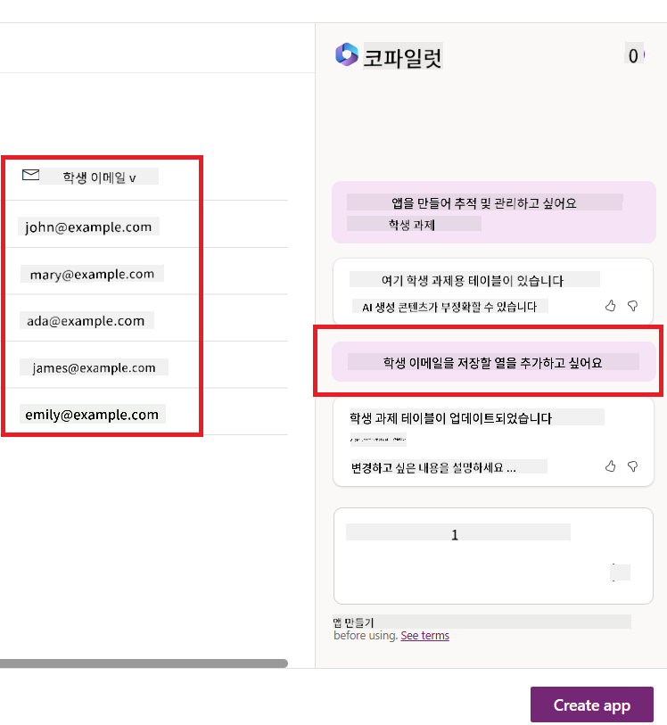

<!--
CO_OP_TRANSLATOR_METADATA:
{
  "original_hash": "846ac8e3b7dcfb697d3309fec05f0fea",
  "translation_date": "2025-10-18T00:03:42+00:00",
  "source_file": "10-building-low-code-ai-applications/README.md",
  "language_code": "ko"
}
-->
# 저코드 AI 애플리케이션 구축하기

> _(위 이미지를 클릭하면 이 강의의 동영상을 볼 수 있습니다)_

## 소개

이제 이미지 생성 애플리케이션을 만드는 방법을 배웠으니, 저코드에 대해 이야기해 봅시다. 생성형 AI는 저코드를 포함한 다양한 분야에서 활용될 수 있습니다. 하지만 저코드란 무엇이며, 여기에 AI를 어떻게 추가할 수 있을까요?

저코드 개발 플랫폼을 사용하면 전통적인 개발자와 비개발자 모두 애플리케이션과 솔루션을 더 쉽게 만들 수 있습니다. 저코드 개발 플랫폼은 시각적 개발 환경을 제공하여 애플리케이션과 솔루션을 구성 요소를 드래그 앤 드롭하여 만들 수 있게 합니다. 이를 통해 애플리케이션과 솔루션을 더 빠르고 적은 자원으로 구축할 수 있습니다. 이번 강의에서는 저코드를 사용하는 방법과 Power Platform을 활용해 AI로 저코드 개발을 강화하는 방법을 깊이 탐구합니다.

Power Platform은 직관적인 저코드 또는 무코드 환경을 통해 조직이 팀원들이 직접 솔루션을 구축할 수 있도록 지원합니다. 이 환경은 솔루션 구축 과정을 간소화합니다. Power Platform을 사용하면 솔루션을 몇 달 또는 몇 년이 아닌 며칠 또는 몇 주 만에 구축할 수 있습니다. Power Platform은 Power Apps, Power Automate, Power BI, Power Pages, Copilot Studio라는 다섯 가지 주요 제품으로 구성되어 있습니다.

이번 강의에서는 다음 내용을 다룹니다:

- Power Platform에서 생성형 AI 소개
- Copilot 소개 및 사용 방법
- Power Platform에서 생성형 AI를 사용하여 앱과 흐름 구축하기
- AI Builder를 활용한 Power Platform의 AI 모델 이해하기

## 학습 목표

이 강의를 마치면 다음을 할 수 있습니다:

- Power Platform에서 Copilot이 어떻게 작동하는지 이해하기

- 교육 스타트업을 위한 학생 과제 추적 앱 만들기

- 청구서에서 정보를 추출하는 AI를 사용하는 청구서 처리 흐름 만들기

- GPT AI 모델로 텍스트 생성 시 모범 사례 적용하기

이번 강의에서 사용할 도구와 기술은 다음과 같습니다:

- **Power Apps**: 학생 과제 추적 앱을 위한 저코드 개발 환경으로, 데이터를 추적, 관리 및 상호작용하는 앱을 구축할 수 있습니다.

- **Dataverse**: 학생 과제 추적 앱의 데이터를 저장하기 위한 저코드 데이터 플랫폼으로, 앱의 데이터를 저장하는 데 사용됩니다.

- **Power Automate**: 청구서 처리 흐름을 위한 저코드 개발 환경으로, 청구서 처리 프로세스를 자동화하는 워크플로를 구축할 수 있습니다.

- **AI Builder**: 청구서 처리 AI 모델을 위한 사전 구축된 AI 모델을 사용하여 스타트업의 청구서를 처리합니다.

## Power Platform에서의 생성형 AI

저코드 개발 및 애플리케이션을 생성형 AI로 강화하는 것은 Power Platform의 주요 초점 영역입니다. 목표는 데이터 과학 전문 지식 없이도 AI 기반 앱, 사이트, 대시보드 및 프로세스를 자동화할 수 있도록 하는 것입니다. 이 목표는 Copilot과 AI Builder 형태로 Power Platform의 저코드 개발 경험에 생성형 AI를 통합함으로써 달성됩니다.

### 어떻게 작동하나요?

Copilot은 자연어를 사용하여 요구 사항을 대화 단계로 설명함으로써 Power Platform 솔루션을 구축할 수 있게 해주는 AI 비서입니다. 예를 들어, 앱에서 사용할 필드를 지정하면 Copilot이 앱과 기본 데이터 모델을 생성하거나 Power Automate에서 흐름을 설정하는 방법을 지정할 수 있습니다.

Copilot 기반 기능을 앱 화면의 기능으로 사용하여 사용자가 대화형 상호작용을 통해 인사이트를 발견할 수 있도록 할 수 있습니다.

AI Builder는 Power Platform에서 사용할 수 있는 저코드 AI 기능으로, 프로세스를 자동화하고 결과를 예측하는 데 도움을 주는 AI 모델을 사용할 수 있게 합니다. AI Builder를 사용하면 Dataverse 또는 SharePoint, OneDrive, Azure와 같은 다양한 클라우드 데이터 소스에 연결된 앱과 흐름에 AI를 추가할 수 있습니다.

Copilot은 Power Platform의 모든 제품(Power Apps, Power Automate, Power BI, Power Pages, Power Virtual Agents)에서 사용할 수 있습니다. AI Builder는 Power Apps와 Power Automate에서 사용할 수 있습니다. 이번 강의에서는 교육 스타트업을 위한 솔루션을 구축하기 위해 Power Apps와 Power Automate에서 Copilot과 AI Builder를 사용하는 방법에 초점을 맞춥니다.

### Power Apps에서의 Copilot

Power Platform의 일부인 Power Apps는 데이터를 추적, 관리 및 상호작용하는 앱을 구축하기 위한 저코드 개발 환경을 제공합니다. 이는 클라우드 서비스 및 온프레미스 데이터를 연결할 수 있는 확장 가능한 데이터 플랫폼과 앱 개발 서비스를 포함한 제품군입니다. Power Apps를 사용하면 브라우저, 태블릿, 휴대폰에서 실행되는 앱을 구축하고 동료와 공유할 수 있습니다. Power Apps는 간단한 인터페이스를 통해 모든 비즈니스 사용자 또는 전문 개발자가 맞춤형 앱을 구축할 수 있도록 합니다. 앱 개발 경험은 Copilot을 통해 생성형 AI로 더욱 향상됩니다.

Power Apps의 Copilot AI 비서 기능은 어떤 종류의 앱이 필요한지, 앱이 추적, 수집 또는 표시해야 할 정보를 설명할 수 있게 합니다. 그러면 Copilot은 설명에 따라 반응형 캔버스 앱을 생성합니다. 이후 필요에 따라 앱을 사용자 정의할 수 있습니다. AI Copilot은 또한 추적하려는 데이터를 저장하기 위한 필드와 샘플 데이터를 포함한 Dataverse 테이블을 생성하고 제안합니다. 이번 강의에서 Dataverse가 무엇인지, Power Apps에서 이를 어떻게 사용하는지 자세히 살펴보겠습니다. 이후 대화형 단계로 AI Copilot 비서 기능을 사용하여 테이블을 사용자 정의할 수 있습니다. 이 기능은 Power Apps 홈 화면에서 바로 사용할 수 있습니다.

### Power Automate에서의 Copilot

Power Platform의 일부인 Power Automate는 애플리케이션과 서비스 간의 자동화된 워크플로를 생성할 수 있게 합니다. 이는 커뮤니케이션, 데이터 수집, 승인 결정과 같은 반복적인 비즈니스 프로세스를 자동화하는 데 도움을 줍니다. 간단한 인터페이스를 통해 초보자부터 숙련된 개발자까지 모든 기술 수준의 사용자가 작업을 자동화할 수 있습니다. 워크플로 개발 경험은 Copilot을 통해 생성형 AI로 더욱 향상됩니다.

Power Automate의 Copilot AI 비서 기능은 어떤 종류의 흐름이 필요한지, 흐름이 수행해야 할 작업을 설명할 수 있게 합니다. 그러면 Copilot은 설명에 따라 흐름을 생성합니다. 이후 필요에 따라 흐름을 사용자 정의할 수 있습니다. AI Copilot은 자동화하려는 작업을 수행하는 데 필요한 작업을 생성하고 제안합니다. 이번 강의에서 흐름이 무엇인지, Power Automate에서 이를 어떻게 사용하는지 자세히 살펴보겠습니다. 이후 대화형 단계로 AI Copilot 비서 기능을 사용하여 작업을 사용자 정의할 수 있습니다. 이 기능은 Power Automate 홈 화면에서 바로 사용할 수 있습니다.

## 과제: Copilot을 사용하여 스타트업의 학생 과제와 청구서를 관리하기

우리 스타트업은 학생들에게 온라인 강의를 제공합니다. 스타트업은 빠르게 성장했으며 이제 강의 수요를 따라잡는 데 어려움을 겪고 있습니다. 스타트업은 저코드 솔루션을 구축하여 학생 과제와 청구서를 관리할 수 있도록 돕기 위해 여러분을 Power Platform 개발자로 고용했습니다. 솔루션은 앱을 통해 학생 과제를 추적하고 관리하며 워크플로를 통해 청구서 처리 프로세스를 자동화할 수 있어야 합니다. 생성형 AI를 사용하여 솔루션을 개발하라는 요청을 받았습니다.

Copilot을 사용하기 시작할 때 [Power Platform Copilot Prompt Library](https://github.com/pnp/powerplatform-prompts?WT.mc_id=academic-109639-somelezediko)를 사용하여 프롬프트를 시작할 수 있습니다. 이 라이브러리에는 Copilot을 사용하여 앱과 흐름을 구축하는 데 사용할 수 있는 프롬프트 목록이 포함되어 있습니다. 또한 라이브러리의 프롬프트를 사용하여 Copilot에 요구 사항을 설명하는 방법에 대한 아이디어를 얻을 수 있습니다.

### 스타트업을 위한 학생 과제 추적 앱 만들기

우리 스타트업의 교육자들은 학생 과제를 추적하는 데 어려움을 겪고 있습니다. 그들은 스프레드시트를 사용하여 과제를 추적했지만 학생 수가 증가함에 따라 관리가 어려워졌습니다. 교육자들은 과제를 추적하고 관리할 수 있는 앱을 만들어 달라고 요청했습니다. 앱은 새로운 과제를 추가하고, 과제를 조회하며, 과제를 업데이트하고, 과제를 삭제할 수 있어야 합니다. 또한 교육자와 학생이 채점된 과제와 채점되지 않은 과제를 볼 수 있어야 합니다.

다음 단계에 따라 Power Apps에서 Copilot을 사용하여 앱을 구축합니다:

1. [Power Apps](https://make.powerapps.com?WT.mc_id=academic-105485-koreyst) 홈 화면으로 이동합니다.

1. 홈 화면의 텍스트 영역을 사용하여 만들고자 하는 앱을 설명합니다. 예를 들어, **_학생 과제를 추적하고 관리하는 앱을 만들고 싶습니다_**라고 입력합니다. **전송** 버튼을 클릭하여 프롬프트를 AI Copilot에 보냅니다.

1. AI Copilot은 추적하려는 데이터를 저장하기 위한 필드와 샘플 데이터를 포함한 Dataverse 테이블을 제안합니다. 이후 대화형 단계로 AI Copilot 비서 기능을 사용하여 테이블을 사용자 정의할 수 있습니다.

   > **중요**: Dataverse는 Power Platform의 기본 데이터 플랫폼입니다. 이는 앱의 데이터를 저장하기 위한 저코드 데이터 플랫폼입니다. Microsoft Cloud에서 데이터를 안전하게 저장하며 Power Platform 환경 내에서 프로비저닝됩니다. 데이터 분류, 데이터 계보, 세분화된 액세스 제어 등과 같은 내장된 데이터 거버넌스 기능을 제공합니다. Dataverse에 대해 더 알아보려면 [여기](https://docs.microsoft.com/powerapps/maker/data-platform/data-platform-intro?WT.mc_id=academic-109639-somelezediko)를 참조하세요.

   

1. 교육자들은 과제를 제출한 학생들에게 이메일을 보내 과제 진행 상황을 업데이트하고 싶어합니다. Copilot을 사용하여 테이블에 학생 이메일을 저장할 새 필드를 추가할 수 있습니다. 예를 들어, 다음 프롬프트를 사용하여 테이블에 새 필드를 추가할 수 있습니다: **_학생 이메일을 저장할 열을 추가하고 싶습니다_**. **전송** 버튼을 클릭하여 프롬프트를 AI Copilot에 보냅니다.

1. AI Copilot은 새 필드를 생성하며 이후 필요에 따라 필드를 사용자 정의할 수 있습니다.

1. 테이블 작업이 완료되면 **앱 생성** 버튼을 클릭하여 앱을 생성합니다.

1. AI Copilot은 설명에 따라 반응형 캔버스 앱을 생성합니다. 이후 필요에 따라 앱을 사용자 정의할 수 있습니다.

1. 교육자가 학생들에게 이메일을 보내기 위해 Copilot을 사용하여 앱에 새 화면을 추가할 수 있습니다. 예를 들어, 다음 프롬프트를 사용하여 앱에 새 화면을 추가할 수 있습니다: **_학생들에게 이메일을 보내는 화면을 추가하고 싶습니다_**. **전송** 버튼을 클릭하여 프롬프트를 AI Copilot에 보냅니다.

1. AI Copilot은 새 화면을 생성하며 이후 필요에 따라 화면을 사용자 정의할 수 있습니다.

1. 앱 작업이 완료되면 **저장** 버튼을 클릭하여 앱을 저장합니다.

1. 교육자와 앱을 공유하려면 **공유** 버튼을 클릭한 후 다시 **공유** 버튼을 클릭합니다. 이후 교육자의 이메일 주소를 입력하여 앱을 공유할 수 있습니다.

> **숙제**: 방금 만든 앱은 좋은 시작점이지만 개선될 수 있습니다. 이메일 기능을 사용하면 교육자가 학생의 이메일을 직접 입력해야만 이메일을 보낼 수 있습니다. Copilot을 사용하여 학생이 과제를 제출할 때 교육자가 자동으로 이메일을 보낼 수 있는 자동화를 구축할 수 있나요? 힌트: 적절한 프롬프트를 사용하면 Power Automate에서 Copilot을 사용하여 이를 구축할 수 있습니다.

### 스타트업을 위한 청구서 정보 테이블 만들기

우리 스타트업의 재무팀은 청구서를 추적하는 데 어려움을 겪고 있습니다. 그들은 스프레드시트를 사용하여 청구서를 추적했지만 청구서 수가 증가함에 따라 관리가 어려워졌습니다. 재무팀은 받은 청구서 정보를 저장, 추적 및 관리할 수 있는 테이블을 만들어 달라고 요청했습니다. 이 테이블은 청구서 정보를 추출하여 테이블에 저장하는 자동화를 구축하는 데 사용되어야 합니다. 또한 재무팀이 지불된 청구서와 지불되지 않은 청구서를 조회할 수 있어야 합니다.

Power Platform에는 앱과 솔루션의 데이터를 저장할 수 있는 기본 데이터 플랫폼인 Dataverse가 있습니다. Dataverse는 앱의 데이터를 저장하기 위한 저코드 데이터 플랫폼을 제공합니다. 이는 Microsoft Cloud에서 데이터를 안전하게 저장하며 Power Platform 환경 내에서 프로비저닝됩니다. 데이터 분류, 데이터 계보, 세분화된 액세스 제어 등과 같은 내장된 데이터 거버넌스 기능을 제공합니다. [Dataverse에 대해 더 알아보려면 여기를 참조하세요](https://docs.microsoft.com/powerapps/maker/data-platform/data-platform-intro?WT.mc_id=academic-109639-somelezediko).
왜 스타트업에서 Dataverse를 사용해야 할까요? Dataverse의 표준 및 사용자 지정 테이블은 데이터를 안전하게 클라우드에 저장할 수 있는 옵션을 제공합니다. 테이블은 여러 Excel 워크북의 워크시트처럼 다양한 유형의 데이터를 저장할 수 있게 해줍니다. 테이블을 사용하여 조직이나 비즈니스 요구에 맞는 데이터를 저장할 수 있습니다. Dataverse를 사용함으로써 우리 스타트업이 얻을 수 있는 이점은 다음과 같습니다:

- **관리 용이성**: 메타데이터와 데이터가 클라우드에 저장되므로 저장 및 관리 방법에 대해 걱정할 필요가 없습니다. 앱과 솔루션을 구축하는 데 집중할 수 있습니다.

- **보안성**: Dataverse는 데이터를 안전하게 클라우드에 저장할 수 있는 옵션을 제공합니다. 역할 기반 보안을 사용하여 테이블 데이터에 대한 접근 권한을 제어할 수 있습니다.

- **풍부한 메타데이터**: 데이터 유형과 관계가 Power Apps 내에서 직접 사용됩니다.

- **로직 및 유효성 검사**: 비즈니스 규칙, 계산된 필드 및 유효성 검사 규칙을 사용하여 비즈니스 로직을 적용하고 데이터 정확성을 유지할 수 있습니다.

이제 Dataverse가 무엇인지, 왜 사용해야 하는지 알았으니, Copilot을 사용하여 우리 재무팀의 요구를 충족하는 테이블을 만드는 방법을 살펴보겠습니다.

> **Note** : 이 테이블은 다음 섹션에서 모든 송장 정보를 추출하여 테이블에 저장하는 자동화를 구축하는 데 사용됩니다.

Copilot을 사용하여 Dataverse에서 테이블을 생성하려면 아래 단계를 따르세요:

1. [Power Apps](https://make.powerapps.com?WT.mc_id=academic-105485-koreyst) 홈 화면으로 이동합니다.

2. 왼쪽 탐색 바에서 **Tables**를 선택한 후 **Describe the new Table**을 클릭합니다.

3. **Describe the new Table** 화면에서 텍스트 영역을 사용하여 생성하려는 테이블을 설명합니다. 예를 들어, **_송장 정보를 저장할 테이블을 만들고 싶습니다_**라고 입력합니다. **Send** 버튼을 클릭하여 AI Copilot에 프롬프트를 보냅니다.

4. AI Copilot은 추적하려는 데이터를 저장하기 위한 필드와 샘플 데이터를 포함한 Dataverse 테이블을 제안합니다. 이후 대화형 단계로 AI Copilot 어시스턴트 기능을 사용하여 테이블을 사용자 지정할 수 있습니다.

5. 재무팀은 송장의 현재 상태를 업데이트하기 위해 공급업체에게 이메일을 보내고 싶어합니다. Copilot을 사용하여 테이블에 공급업체 이메일을 저장할 새 필드를 추가할 수 있습니다. 예를 들어, **_공급업체 이메일을 저장할 열을 추가하고 싶습니다_**라는 프롬프트를 사용하여 새 필드를 추가할 수 있습니다. **Send** 버튼을 클릭하여 AI Copilot에 프롬프트를 보냅니다.

6. AI Copilot은 새 필드를 생성하며, 이후 필드를 필요에 맞게 사용자 지정할 수 있습니다.

7. 테이블 작업이 완료되면 **Create** 버튼을 클릭하여 테이블을 생성합니다.

## Power Platform의 AI Builder를 활용한 AI 모델

AI Builder는 Power Platform에서 제공하는 로우코드 AI 기능으로, 프로세스를 자동화하고 결과를 예측하는 데 도움을 주는 AI 모델을 사용할 수 있습니다. AI Builder를 사용하면 Dataverse 또는 SharePoint, OneDrive, Azure와 같은 다양한 클라우드 데이터 소스에 연결된 데이터에 AI를 적용할 수 있습니다.

## 사전 구축 AI 모델 vs 사용자 지정 AI 모델

AI Builder는 사전 구축 AI 모델과 사용자 지정 AI 모델 두 가지 유형을 제공합니다. 사전 구축 AI 모델은 Microsoft에서 훈련된 준비된 AI 모델로, 데이터를 수집하고 자체 모델을 구축, 훈련 및 게시할 필요 없이 앱과 흐름에 지능을 추가할 수 있습니다. 이러한 모델을 사용하여 프로세스를 자동화하고 결과를 예측할 수 있습니다.

Power Platform에서 제공되는 사전 구축 AI 모델에는 다음이 포함됩니다:

- **핵심 문구 추출**: 텍스트에서 핵심 문구를 추출합니다.
- **언어 감지**: 텍스트의 언어를 감지합니다.
- **감정 분석**: 텍스트에서 긍정적, 부정적, 중립적 또는 혼합된 감정을 감지합니다.
- **명함 리더**: 명함에서 정보를 추출합니다.
- **텍스트 인식**: 이미지에서 텍스트를 추출합니다.
- **객체 감지**: 이미지에서 객체를 감지하고 추출합니다.
- **문서 처리**: 양식에서 정보를 추출합니다.
- **송장 처리**: 송장에서 정보를 추출합니다.

사용자 지정 AI 모델을 사용하면 AI Builder에 자체 모델을 가져와 AI Builder 사용자 지정 모델처럼 작동하도록 할 수 있으며, 자체 데이터를 사용하여 모델을 훈련할 수 있습니다. 이러한 모델을 사용하여 Power Apps와 Power Automate에서 프로세스를 자동화하고 결과를 예측할 수 있습니다. 자체 모델을 사용할 때 적용되는 제한 사항이 있습니다. 자세한 내용은 [제한 사항](https://learn.microsoft.com/ai-builder/byo-model#limitations?WT.mc_id=academic-105485-koreyst)을 참조하세요.

## 과제 #2 - 스타트업을 위한 송장 처리 흐름 구축

재무팀은 송장을 처리하는 데 어려움을 겪고 있습니다. 그들은 스프레드시트를 사용하여 송장을 추적했지만 송장 수가 증가하면서 관리가 어려워졌습니다. 재무팀은 AI를 사용하여 송장을 처리할 수 있는 워크플로우를 구축해 달라고 요청했습니다. 이 워크플로우는 송장에서 정보를 추출하여 Dataverse 테이블에 저장하고, 추출된 정보를 재무팀에 이메일로 보내는 기능을 제공해야 합니다.

이제 AI Builder가 무엇인지, 왜 사용해야 하는지 알았으니, 앞서 다룬 AI Builder의 송장 처리 AI 모델을 사용하여 재무팀이 송장을 처리할 수 있는 워크플로우를 구축하는 방법을 살펴보겠습니다.

송장 처리 AI 모델을 사용하여 재무팀이 송장을 처리할 수 있는 워크플로우를 구축하려면 아래 단계를 따르세요:

1. [Power Automate](https://make.powerautomate.com?WT.mc_id=academic-105485-koreyst) 홈 화면으로 이동합니다.

2. 홈 화면의 텍스트 영역을 사용하여 구축하려는 워크플로우를 설명합니다. 예를 들어, **_내 메일함에 송장이 도착하면 처리합니다_**라고 입력합니다. **Send** 버튼을 클릭하여 AI Copilot에 프롬프트를 보냅니다.

   

3. AI Copilot은 자동화하려는 작업을 수행하기 위해 필요한 작업을 제안합니다. **Next** 버튼을 클릭하여 다음 단계를 진행합니다.

4. 다음 단계에서 Power Automate는 흐름에 필요한 연결 설정을 요청합니다. 설정이 완료되면 **Create flow** 버튼을 클릭하여 흐름을 생성합니다.

5. AI Copilot은 흐름을 생성하며, 이후 흐름을 필요에 맞게 사용자 지정할 수 있습니다.

6. 흐름의 트리거를 업데이트하고 **Folder**를 송장이 저장될 폴더로 설정합니다. 예를 들어, 폴더를 **Inbox**로 설정할 수 있습니다. **Show advanced options**를 클릭하고 **Only with Attachments**를 **Yes**로 설정합니다. 이렇게 하면 첨부 파일이 포함된 이메일이 폴더에 도착했을 때만 흐름이 실행됩니다.

7. 흐름에서 다음 작업을 제거합니다: **HTML to text**, **Compose**, **Compose 2**, **Compose 3**, **Compose 4**. 이 작업들은 사용하지 않을 것입니다.

8. 흐름에서 **Condition** 작업을 제거합니다. 사용하지 않을 것입니다. 흐름은 다음 스크린샷과 같아야 합니다:

   

9. **Add an action** 버튼을 클릭하고 **Dataverse**를 검색합니다. **Add a new row** 작업을 선택합니다.

10. **Extract Information from invoices** 작업에서 **Invoice File**을 이메일의 **Attachment Content**로 업데이트합니다. 이렇게 하면 흐름이 송장 첨부 파일에서 정보를 추출합니다.

11. 이전에 생성한 **Table**을 선택합니다. 예를 들어, **Invoice Information** 테이블을 선택할 수 있습니다. 이전 작업의 동적 콘텐츠를 사용하여 다음 필드를 채웁니다:

    - ID
    - Amount
    - Date
    - Name
    - Status - **Status**를 **Pending**으로 설정합니다.
    - Supplier Email - **When a new email arrives** 트리거의 **From** 동적 콘텐츠를 사용합니다.

    

12. 흐름 작업이 완료되면 **Save** 버튼을 클릭하여 흐름을 저장합니다. 이후 지정한 트리거 폴더로 송장이 포함된 이메일을 보내 흐름을 테스트할 수 있습니다.

> **숙제**: 방금 구축한 흐름은 좋은 시작점입니다. 이제 재무팀이 송장의 현재 상태를 업데이트하기 위해 공급업체에게 이메일을 보낼 수 있는 자동화를 구축하는 방법을 생각해 보세요. 힌트: 흐름은 송장의 상태가 변경될 때 실행되어야 합니다.

## Power Automate에서 텍스트 생성 AI 모델 사용하기

AI Builder의 GPT AI 모델을 사용하여 프롬프트를 기반으로 텍스트를 생성할 수 있으며, 이는 Microsoft Azure OpenAI 서비스로 구동됩니다. 이 기능을 통해 GPT(Generative Pre-Trained Transformer) 기술을 앱과 흐름에 통합하여 다양한 자동화 흐름과 유용한 애플리케이션을 구축할 수 있습니다.

GPT 모델은 방대한 데이터로 광범위한 훈련을 거쳐 프롬프트를 제공받았을 때 인간 언어와 유사한 텍스트를 생성할 수 있습니다. 워크플로우 자동화와 통합하면 GPT와 같은 AI 모델을 활용하여 다양한 작업을 간소화하고 자동화할 수 있습니다.

예를 들어, 이메일 초안 작성, 제품 설명 등 다양한 용도로 텍스트를 자동으로 생성하는 흐름을 구축할 수 있습니다. 또한, 고객 서비스 에이전트가 고객 문의에 효과적이고 효율적으로 응답할 수 있도록 돕는 챗봇 및 고객 서비스 앱과 같은 다양한 애플리케이션을 위해 모델을 사용할 수 있습니다.

Power Automate에서 이 AI 모델을 사용하는 방법을 배우려면 [AI Builder와 GPT로 지능 추가하기](https://learn.microsoft.com/training/modules/ai-builder-text-generation/?WT.mc_id=academic-109639-somelezediko) 모듈을 확인하세요.

## 훌륭한 작업! 학습을 계속하세요

이 강의를 완료한 후, [Generative AI 학습 컬렉션](https://aka.ms/genai-collection?WT.mc_id=academic-105485-koreyst)을 확인하여 Generative AI 지식을 계속 향상시키세요!

Lesson 11로 이동하여 [Function Calling과 Generative AI 통합](../11-integrating-with-function-calling/README.md?WT.mc_id=academic-105485-koreyst)을 살펴보세요!

---

**면책 조항**:  
이 문서는 AI 번역 서비스 [Co-op Translator](https://github.com/Azure/co-op-translator)를 사용하여 번역되었습니다. 정확성을 위해 최선을 다하고 있지만, 자동 번역에는 오류나 부정확성이 포함될 수 있습니다. 원본 문서의 원어 버전을 권위 있는 출처로 간주해야 합니다. 중요한 정보의 경우, 전문적인 인간 번역을 권장합니다. 이 번역 사용으로 인해 발생하는 오해나 잘못된 해석에 대해 책임을 지지 않습니다.