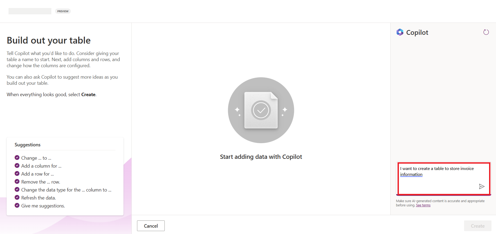
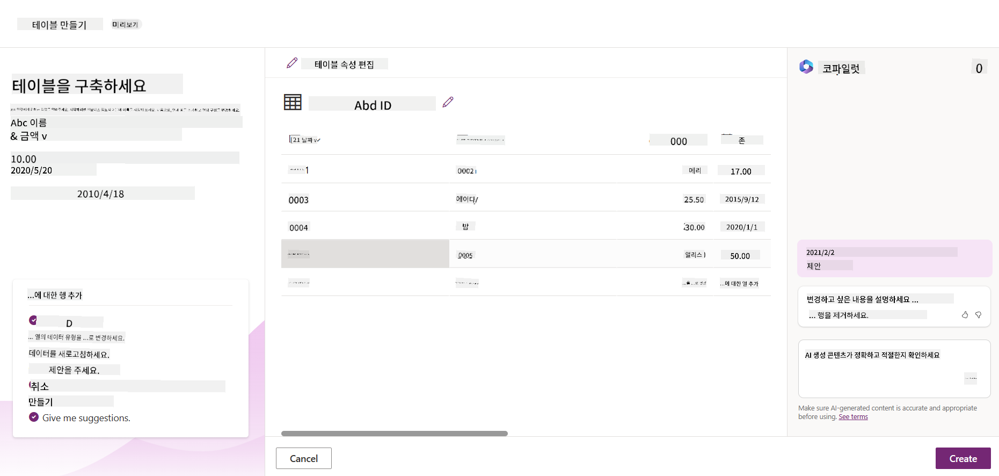
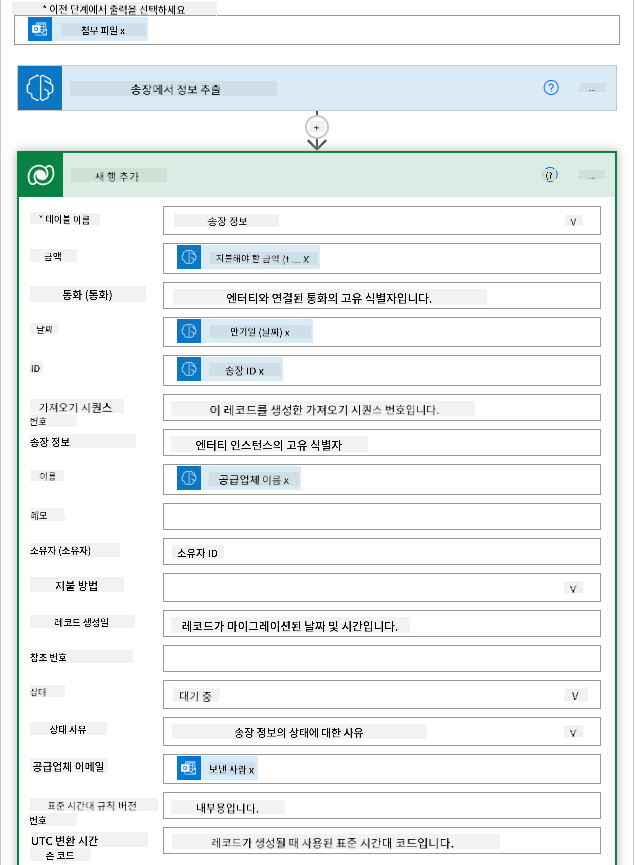
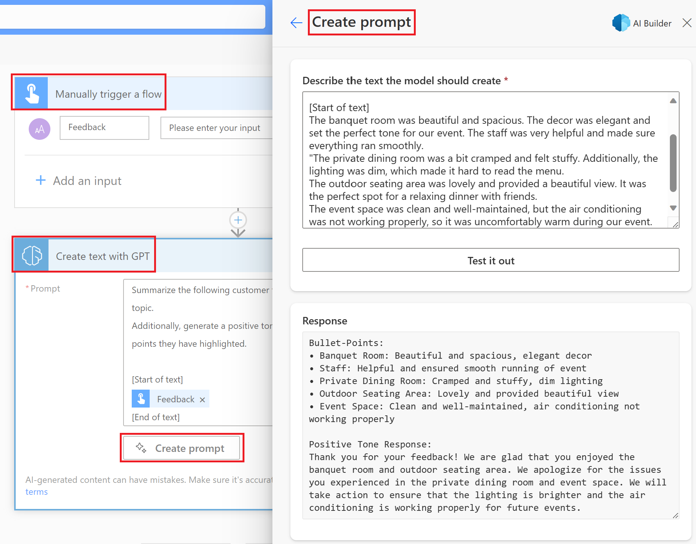

<!--
CO_OP_TRANSLATOR_METADATA:
{
  "original_hash": "f5ff3b6204a695a117d6f452403c95f7",
  "translation_date": "2025-07-09T13:48:22+00:00",
  "source_file": "10-building-low-code-ai-applications/README.md",
  "language_code": "ko"
}
-->
# 로우코드 AI 애플리케이션 구축

> _(위 이미지를 클릭하면 이 수업의 동영상을 볼 수 있습니다)_

## 소개

이미지 생성 애플리케이션을 만드는 방법을 배웠으니, 이번에는 로우코드에 대해 이야기해보겠습니다. 생성 AI는 로우코드를 포함한 다양한 분야에 활용될 수 있는데, 로우코드가 무엇이며 AI를 어떻게 접목할 수 있을까요?

로우코드 개발 플랫폼을 통해 전통적인 개발자뿐만 아니라 비개발자도 앱과 솔루션을 더 쉽게 만들 수 있게 되었습니다. 로우코드 개발 플랫폼은 거의 또는 전혀 코딩 없이 앱과 솔루션을 구축할 수 있도록 시각적 개발 환경을 제공합니다. 이 환경에서는 구성 요소를 드래그 앤 드롭하여 앱과 솔루션을 빠르고 적은 자원으로 만들 수 있습니다. 이번 수업에서는 로우코드를 활용하는 방법과 Power Platform을 이용해 AI로 로우코드 개발을 강화하는 방법을 자세히 살펴봅니다.

Power Platform은 조직이 직관적인 로우코드 또는 노코드 환경을 통해 팀이 직접 솔루션을 만들 수 있도록 지원합니다. 이 환경은 솔루션 구축 과정을 단순화하며, Power Platform을 사용하면 솔루션을 몇 달 또는 몇 년이 아닌 며칠 또는 몇 주 만에 만들 수 있습니다. Power Platform은 Power Apps, Power Automate, Power BI, Power Pages, Copilot Studio의 다섯 가지 주요 제품으로 구성되어 있습니다.

이번 수업에서 다룰 내용은 다음과 같습니다:

- Power Platform에서의 생성 AI 소개
- Copilot 소개 및 사용법
- Power Platform에서 생성 AI를 활용해 앱과 플로우 만들기
- AI Builder를 통한 Power Platform 내 AI 모델 이해

## 학습 목표

이번 수업이 끝나면 다음을 할 수 있습니다:

- Power Platform에서 Copilot이 어떻게 작동하는지 이해하기
- 교육 스타트업을 위한 학생 과제 추적 앱 만들기
- AI를 활용해 인보이스에서 정보를 추출하는 인보이스 처리 플로우 만들기
- GPT AI 모델을 사용할 때의 모범 사례 적용하기

이번 수업에서 사용할 도구와 기술은 다음과 같습니다:

- **Power Apps**: 학생 과제 추적 앱을 위한 로우코드 개발 환경으로, 데이터를 추적, 관리, 상호작용할 수 있는 앱을 만듭니다.
- **Dataverse**: 학생 과제 추적 앱의 데이터를 저장하는 로우코드 데이터 플랫폼입니다.
- **Power Automate**: 인보이스 처리 플로우를 위한 로우코드 워크플로우 개발 환경입니다.
- **AI Builder**: 스타트업의 인보이스 처리를 위한 사전 구축된 AI 모델을 사용하는 AI 기능입니다.

## Power Platform에서의 생성 AI

로우코드 개발과 애플리케이션에 생성 AI를 접목하는 것은 Power Platform의 핵심 목표 중 하나입니다. 목표는 데이터 과학 전문 지식 없이도 누구나 AI 기반 앱, 사이트, 대시보드, 자동화 프로세스를 만들 수 있도록 하는 것입니다. 이 목표는 Copilot과 AI Builder 형태로 생성 AI를 Power Platform의 로우코드 개발 경험에 통합함으로써 달성됩니다.

### 어떻게 작동하나요?

Copilot은 자연어로 요구사항을 대화식으로 설명하면 Power Platform 솔루션을 만들어주는 AI 비서입니다. 예를 들어, 앱에서 사용할 필드를 지정하면 앱과 그에 맞는 데이터 모델을 생성하거나, Power Automate에서 플로우 설정 방법을 지시할 수 있습니다.

Copilot 기반 기능은 앱 화면 내 기능으로도 제공되어, 사용자가 대화형 상호작용을 통해 인사이트를 얻을 수 있게 합니다.

AI Builder는 Power Platform에서 제공하는 로우코드 AI 기능으로, AI 모델을 활용해 프로세스를 자동화하고 결과를 예측할 수 있습니다. AI Builder를 통해 Dataverse나 SharePoint, OneDrive, Azure 같은 다양한 클라우드 데이터 소스와 연결된 앱과 플로우에 AI를 적용할 수 있습니다.

Copilot은 Power Apps, Power Automate, Power BI, Power Pages, Power Virtual Agents 등 모든 Power Platform 제품에서 사용할 수 있습니다. AI Builder는 Power Apps와 Power Automate에서 제공됩니다. 이번 수업에서는 교육 스타트업을 위한 솔루션을 만들기 위해 Power Apps와 Power Automate에서 Copilot과 AI Builder를 사용하는 방법에 집중합니다.

### Power Apps에서의 Copilot

Power Platform의 일부인 Power Apps는 데이터를 추적, 관리, 상호작용할 수 있는 앱을 만드는 로우코드 개발 환경을 제공합니다. 확장 가능한 데이터 플랫폼과 클라우드 서비스 및 온프레미스 데이터 연결 기능을 갖춘 앱 개발 서비스 모음입니다. Power Apps로 브라우저, 태블릿, 휴대폰에서 실행되는 앱을 만들고 동료와 공유할 수 있습니다. 간단한 인터페이스 덕분에 비즈니스 사용자나 전문 개발자 모두 맞춤형 앱을 쉽게 만들 수 있습니다. 생성 AI가 Copilot을 통해 앱 개발 경험을 한층 향상시킵니다.

Power Apps의 Copilot AI 비서 기능은 필요한 앱 종류와 추적, 수집, 표시할 정보를 설명하면, 그 설명을 바탕으로 반응형 Canvas 앱을 생성합니다. 이후 필요에 맞게 앱을 수정할 수 있습니다. AI Copilot은 또한 추적할 데이터를 저장할 필드를 포함한 Dataverse 테이블과 샘플 데이터를 생성 및 제안합니다. Dataverse가 무엇이며 Power Apps에서 어떻게 활용하는지는 수업 후반에 다룹니다. AI Copilot 비서 기능을 통해 대화식 단계로 테이블을 맞춤 설정할 수 있으며, 이 기능은 Power Apps 홈 화면에서 바로 사용할 수 있습니다.

### Power Automate에서의 Copilot

Power Platform의 일부인 Power Automate는 애플리케이션과 서비스 간 자동화된 워크플로우를 만들 수 있게 해줍니다. 커뮤니케이션, 데이터 수집, 승인 절차 등 반복적인 비즈니스 프로세스를 자동화하는 데 도움을 줍니다. 초보자부터 숙련된 개발자까지 누구나 쉽게 작업을 자동화할 수 있도록 간단한 인터페이스를 제공합니다. 생성 AI가 Copilot을 통해 워크플로우 개발 경험을 향상시킵니다.

Power Automate의 Copilot AI 비서 기능은 필요한 플로우 종류와 수행할 작업을 설명하면, 그 설명을 바탕으로 플로우를 생성합니다. 이후 필요에 맞게 플로우를 수정할 수 있습니다. AI Copilot은 자동화하려는 작업에 필요한 액션도 생성 및 제안합니다. 플로우가 무엇이며 Power Automate에서 어떻게 사용하는지는 수업 후반에 다룹니다. AI Copilot 비서 기능을 통해 대화식 단계로 액션을 맞춤 설정할 수 있으며, 이 기능은 Power Automate 홈 화면에서 바로 사용할 수 있습니다.

## 과제: Copilot을 활용해 스타트업의 학생 과제와 인보이스 관리하기

우리 스타트업은 학생들에게 온라인 강의를 제공합니다. 스타트업이 빠르게 성장하면서 강의 수요를 따라잡기 어려워졌습니다. 스타트업은 Power Platform 개발자로서 학생 과제와 인보이스를 관리할 수 있는 로우코드 솔루션을 만들어 달라고 요청했습니다. 이 솔루션은 앱을 통해 학생 과제를 추적 및 관리하고, 워크플로우를 통해 인보이스 처리 과정을 자동화할 수 있어야 합니다. 생성 AI를 활용해 솔루션을 개발해야 합니다.

Copilot 사용을 시작할 때는 [Power Platform Copilot Prompt Library](https://github.com/pnp/powerplatform-prompts?WT.mc_id=academic-109639-somelezediko)를 참고하면 좋습니다. 이 라이브러리에는 Copilot으로 앱과 플로우를 만들 때 사용할 수 있는 프롬프트 목록이 있습니다. 또한 Copilot에 요구사항을 어떻게 설명할지 아이디어를 얻는 데도 도움이 됩니다.

### 스타트업을 위한 학생 과제 추적 앱 만들기

우리 스타트업의 교육자들은 학생 과제를 관리하는 데 어려움을 겪고 있습니다. 학생 수가 늘어나면서 스프레드시트로 과제를 추적하는 것이 점점 힘들어졌습니다. 교육자들은 학생 과제를 추적하고 관리할 수 있는 앱을 만들어 달라고 요청했습니다. 이 앱은 새 과제를 추가하고, 과제를 조회, 수정, 삭제할 수 있어야 하며, 채점된 과제와 채점되지 않은 과제를 교육자와 학생 모두가 볼 수 있어야 합니다.

다음 단계를 따라 Power Apps의 Copilot을 사용해 앱을 만듭니다:

1. [Power Apps](https://make.powerapps.com?WT.mc_id=academic-105485-koreyst) 홈 화면으로 이동합니다.

1. 홈 화면의 텍스트 영역에 만들고자 하는 앱을 설명합니다. 예를 들어, **_학생 과제를 추적하고 관리하는 앱을 만들고 싶습니다_**라고 입력합니다. **Send** 버튼을 눌러 AI Copilot에 프롬프트를 보냅니다.

1. AI Copilot이 추적할 데이터를 저장할 필드를 포함한 Dataverse 테이블과 샘플 데이터를 제안합니다. 이후 대화식 단계를 통해 AI Copilot 비서 기능으로 테이블을 필요에 맞게 맞춤 설정할 수 있습니다.

   > **중요**: Dataverse는 Power Platform의 기본 데이터 플랫폼입니다. 앱 데이터를 저장하는 로우코드 데이터 플랫폼으로, Microsoft 클라우드에 안전하게 데이터를 저장하는 완전 관리형 서비스이며 Power Platform 환경 내에 프로비저닝됩니다. 데이터 분류, 데이터 계보, 세밀한 접근 제어 등 내장된 데이터 거버넌스 기능을 제공합니다. Dataverse에 대해 더 알고 싶다면 [여기](https://docs.microsoft.com/powerapps/maker/data-platform/data-platform-intro?WT.mc_id=academic-109639-somelezediko)를 참고하세요.

   

1. 교육자들은 과제를 제출한 학생들에게 이메일을 보내 과제 진행 상황을 알리고 싶어 합니다. Copilot을 사용해 학생 이메일을 저장할 새 필드를 테이블에 추가할 수 있습니다. 예를 들어, 다음 프롬프트를 사용해 새 필드를 추가할 수 있습니다: **_학생 이메일을 저장할 열을 추가하고 싶습니다_**. **Send** 버튼을 눌러 AI Copilot에 프롬프트를 보냅니다.

1. AI Copilot이 새 필드를 생성하면 필요에 맞게 필드를 맞춤 설정할 수 있습니다.

1. 테이블 설정이 완료되면 **Create app** 버튼을 눌러 앱을 만듭니다.

1. AI Copilot이 설명을 바탕으로 반응형 Canvas 앱을 생성합니다. 이후 필요에 맞게 앱을 수정할 수 있습니다.

1. 교육자가 학생에게 이메일을 보내기 위해 앱에 새 화면을 추가하려면 다음 프롬프트를 사용할 수 있습니다: **_학생에게 이메일을 보내는 화면을 추가하고 싶습니다_**. **Send** 버튼을 눌러 AI Copilot에 프롬프트를 보냅니다.

1. AI Copilot이 새 화면을 생성하면 필요에 맞게 화면을 맞춤 설정할 수 있습니다.

1. 앱 작업이 완료되면 **Save** 버튼을 눌러 앱을 저장합니다.

1. 교육자와 앱을 공유하려면 **Share** 버튼을 클릭한 후 다시 **Share** 버튼을 눌러 이메일 주소를 입력해 공유할 수 있습니다.

> **과제**: 지금 만든 앱은 좋은 시작이지만 개선할 수 있습니다. 이메일 기능은 교육자가 학생 이메일을 직접 입력해 수동으로 이메일을 보내야 합니다. Copilot을 사용해 교육자가 과제를 제출할 때 자동으로 학생에게 이메일을 보내는 자동화를 만들 수 있을까요? 힌트는 적절한 프롬프트를 사용해 Power Automate에서 Copilot을 활용하는 것입니다.

### 스타트업을 위한 인보이스 정보 테이블 만들기

우리 스타트업의 재무팀은 인보이스를 관리하는 데 어려움을 겪고 있습니다. 인보이스 수가 늘어나면서 스프레드시트로 관리하는 것이 점점 힘들어졌습니다. 재무팀은 받은 인보이스 정보를 저장, 추적, 관리할 수 있는 테이블을 만들어 달라고 요청했습니다. 이 테이블은 인보이스 정보를 추출해 저장하는 자동화를 구축하는 데 사용됩니다. 또한 재무팀이 결제된 인보이스와 미결제 인보이스를 확인할 수 있어야 합니다.

Power Platform에는 Dataverse라는 기본 데이터 플랫폼이 있어 앱과 솔루션의 데이터를 저장할 수 있습니다. Dataverse는 앱 데이터를 저장하는 로우코드 데이터 플랫폼으로, Microsoft 클라우드에 안전하게 데이터를 저장하는 완전 관리형 서비스이며 Power Platform 환경 내에 프로비저닝됩니다. 데이터 분류, 데이터 계보, 세밀한 접근 제어 등 내장된 데이터 거버넌스 기능을 제공합니다. Dataverse에 대해 더 알고 싶다면 [여기](https://docs.microsoft.com/powerapps/maker/data-platform/data-platform-intro?WT.mc_id=academic-109639-somelezediko)를 참고하세요.

왜 우리 스타트업에 Dataverse를 사용해야 할까요? Dataverse 내 표준 및 사용자 지정 테이블은 데이터에 대해 안전하고 클라우드 기반 저장 옵션을 제공합니다. 테이블은 Excel 워크북 내 여러 워크시트를 사용하는 것처럼 다양한 유형의 데이터를 저장할 수 있습니다. 조직이나 비즈니스 요구에 맞는 데이터를 저장하는 데 테이블을 활용할 수 있습니다. 우리 스타트업이 Dataverse를 사용함으로써 얻을 수 있는 이점은 다음과 같습니다(일부에 불과합니다):
- **관리하기 쉬움**: 메타데이터와 데이터가 모두 클라우드에 저장되므로 저장 방식이나 관리 방법에 대해 신경 쓸 필요가 없습니다. 앱과 솔루션 개발에 집중할 수 있습니다.

- **안전함**: Dataverse는 데이터에 대해 안전하고 클라우드 기반의 저장 옵션을 제공합니다. 역할 기반 보안을 통해 테이블 데이터에 누가 접근할 수 있고 어떻게 접근할지 제어할 수 있습니다.

- **풍부한 메타데이터**: 데이터 유형과 관계를 Power Apps 내에서 직접 활용할 수 있습니다.

- **로직 및 검증**: 비즈니스 규칙, 계산된 필드, 검증 규칙을 사용해 비즈니스 로직을 적용하고 데이터 정확성을 유지할 수 있습니다.

이제 Dataverse가 무엇이고 왜 사용해야 하는지 알았으니, Copilot을 사용해 재무팀 요구사항에 맞는 Dataverse 테이블을 만드는 방법을 살펴보겠습니다.

> **Note** : 다음 섹션에서 이 테이블을 사용해 모든 송장 정보를 추출하고 테이블에 저장하는 자동화를 만들 예정입니다.

Copilot을 사용해 Dataverse에 테이블을 만들려면 아래 단계를 따르세요:

1. [Power Apps](https://make.powerapps.com?WT.mc_id=academic-105485-koreyst) 홈 화면으로 이동합니다.

2. 왼쪽 탐색 바에서 **Tables**를 선택한 후 **Describe the new Table**을 클릭합니다.

3. **Describe the new Table** 화면에서 텍스트 영역에 만들고자 하는 테이블을 설명합니다. 예를 들어, **_송장 정보를 저장할 테이블을 만들고 싶습니다_**라고 입력합니다. **Send** 버튼을 눌러 AI Copilot에 프롬프트를 전송합니다.

4. AI Copilot이 추적하려는 데이터를 저장하는 데 필요한 필드와 샘플 데이터를 포함한 Dataverse 테이블을 제안합니다. 이후 대화형 단계를 통해 AI Copilot 어시스턴트 기능으로 테이블을 필요에 맞게 맞춤 설정할 수 있습니다.

5. 재무팀은 공급업체에 송장 상태를 업데이트하는 이메일을 보내고자 합니다. Copilot을 사용해 공급업체 이메일을 저장할 새 필드를 테이블에 추가할 수 있습니다. 예를 들어, **_공급업체 이메일을 저장할 열을 추가하고 싶습니다_**라는 프롬프트를 사용합니다. **Send** 버튼을 눌러 AI Copilot에 전송하세요.

6. AI Copilot이 새 필드를 생성하면 필요에 맞게 필드를 맞춤 설정할 수 있습니다.

7. 테이블 작업이 완료되면 **Create** 버튼을 눌러 테이블을 생성합니다.

## Power Platform의 AI 모델과 AI Builder

AI Builder는 Power Platform에서 제공하는 로우코드 AI 기능으로, AI 모델을 사용해 프로세스를 자동화하고 결과를 예측할 수 있게 해줍니다. AI Builder를 통해 Dataverse나 SharePoint, OneDrive, Azure 등 다양한 클라우드 데이터 소스에 연결된 앱과 플로우에 AI를 적용할 수 있습니다.

## 사전 구축 AI 모델과 맞춤 AI 모델

AI Builder는 두 가지 유형의 AI 모델을 제공합니다: 사전 구축 AI 모델과 맞춤 AI 모델. 사전 구축 AI 모델은 Microsoft가 학습시켜 Power Platform에서 바로 사용할 수 있는 모델로, 데이터를 수집하고 직접 모델을 구축, 학습, 배포하지 않아도 앱과 플로우에 지능을 추가할 수 있습니다. 이를 통해 프로세스를 자동화하고 결과를 예측할 수 있습니다.

Power Platform에서 제공하는 사전 구축 AI 모델 예시는 다음과 같습니다:

- **Key Phrase Extraction**: 텍스트에서 핵심 구문을 추출합니다.
- **Language Detection**: 텍스트의 언어를 감지합니다.
- **Sentiment Analysis**: 텍스트의 긍정, 부정, 중립, 혼합 감정을 감지합니다.
- **Business Card Reader**: 명함에서 정보를 추출합니다.
- **Text Recognition**: 이미지에서 텍스트를 추출합니다.
- **Object Detection**: 이미지에서 객체를 감지하고 추출합니다.
- **Document processing**: 양식에서 정보를 추출합니다.
- **Invoice Processing**: 송장에서 정보를 추출합니다.

맞춤 AI 모델은 사용자가 직접 만든 모델을 AI Builder에 가져와 AI Builder 맞춤 모델처럼 사용할 수 있으며, 자신의 데이터를 사용해 모델을 학습시킬 수 있습니다. 이 모델들은 Power Apps와 Power Automate에서 프로세스 자동화와 결과 예측에 활용할 수 있습니다. 단, 맞춤 모델 사용 시 제한 사항이 있으니 [제한 사항](https://learn.microsoft.com/ai-builder/byo-model#limitations?WT.mc_id=academic-105485-koreyst)을 참고하세요.

## 과제 #2 - 스타트업을 위한 송장 처리 플로우 구축

재무팀은 송장 처리에 어려움을 겪고 있습니다. 송장 수가 늘어나면서 스프레드시트로 관리하는 것이 점점 힘들어졌습니다. AI를 활용해 송장 처리를 도와줄 워크플로우를 만들어 달라고 요청했습니다. 이 워크플로우는 송장에서 정보를 추출해 Dataverse 테이블에 저장하고, 추출된 정보를 재무팀에 이메일로 전송할 수 있어야 합니다.

AI Builder가 무엇이고 왜 사용해야 하는지 알았으니, 앞서 다룬 Invoice Processing AI 모델을 사용해 재무팀의 송장 처리에 도움을 주는 워크플로우를 만드는 방법을 살펴보겠습니다.

Invoice Processing AI 모델을 사용해 재무팀 송장 처리 워크플로우를 만들려면 아래 단계를 따르세요:

1. [Power Automate](https://make.powerautomate.com?WT.mc_id=academic-105485-koreyst) 홈 화면으로 이동합니다.

2. 홈 화면의 텍스트 영역에 만들고자 하는 워크플로우를 설명합니다. 예를 들어, **_내 메일함에 송장이 도착하면 처리하기_**라고 입력합니다. **Send** 버튼을 눌러 AI Copilot에 프롬프트를 전송합니다.

   

3. AI Copilot이 자동화하려는 작업에 필요한 액션을 제안합니다. **Next** 버튼을 눌러 다음 단계를 진행하세요.

4. 다음 단계에서 Power Automate가 플로우에 필요한 연결 설정을 요청합니다. 완료되면 **Create flow** 버튼을 눌러 플로우를 생성합니다.

5. AI Copilot이 플로우를 생성하면 필요에 맞게 플로우를 맞춤 설정할 수 있습니다.

6. 플로우의 트리거를 업데이트하고, 송장이 저장될 폴더를 설정합니다. 예를 들어, 폴더를 **Inbox**로 설정할 수 있습니다. **Show advanced options**를 클릭하고 **Only with Attachments**를 **Yes**로 설정하세요. 이렇게 하면 첨부파일이 있는 이메일이 도착할 때만 플로우가 실행됩니다.

7. 플로우에서 다음 액션들을 제거하세요: **HTML to text**, **Compose**, **Compose 2**, **Compose 3**, **Compose 4** — 이 액션들은 사용하지 않을 예정입니다.

8. 플로우에서 **Condition** 액션도 제거하세요. 아래 스크린샷과 비슷한 모습이어야 합니다:

   

9. **Add an action** 버튼을 클릭하고 **Dataverse**를 검색한 후, **Add a new row** 액션을 선택합니다.

10. **Extract Information from invoices** 액션에서 **Invoice File**을 이메일의 **Attachment Content**로 지정하세요. 이렇게 하면 송장 첨부파일에서 정보를 추출할 수 있습니다.

11. 앞서 만든 **Table**을 선택합니다. 예를 들어, **Invoice Information** 테이블을 선택할 수 있습니다. 이전 액션의 동적 콘텐츠를 사용해 다음 필드를 채우세요:

    - ID
    - Amount
    - Date
    - Name
    - Status - **Status**는 **Pending**으로 설정합니다.
    - Supplier Email - **When a new email arrives** 트리거의 **From** 동적 콘텐츠를 사용합니다.

    

12. 플로우 작업이 완료되면 **Save** 버튼을 눌러 저장하세요. 이후 지정한 폴더로 송장 이메일을 보내 플로우를 테스트할 수 있습니다.

> **과제**: 방금 만든 플로우는 좋은 시작입니다. 이제 송장 상태가 변경될 때 재무팀이 공급업체에 현재 상태를 알리는 이메일을 보낼 수 있도록 자동화를 어떻게 만들지 고민해 보세요. 힌트: 플로우는 송장 상태가 변경될 때 실행되어야 합니다.

## Power Automate에서 텍스트 생성 AI 모델 사용하기

AI Builder의 Create Text with GPT AI 모델은 프롬프트를 기반으로 텍스트를 생성하며, Microsoft Azure OpenAI 서비스를 기반으로 합니다. 이 기능을 통해 GPT(Generative Pre-Trained Transformer) 기술을 앱과 플로우에 통합해 다양한 자동화 플로우와 유용한 애플리케이션을 만들 수 있습니다.

GPT 모델은 방대한 데이터를 학습해 프롬프트를 받으면 사람과 유사한 자연스러운 텍스트를 생성합니다. 워크플로우 자동화와 결합하면 GPT 같은 AI 모델을 활용해 다양한 작업을 간소화하고 자동화할 수 있습니다.

예를 들어, 이메일 초안, 제품 설명 등 다양한 용도의 텍스트를 자동으로 생성하는 플로우를 만들 수 있습니다. 또한 챗봇이나 고객 서비스 앱 등에서 고객 문의에 효과적이고 신속하게 대응할 수 있도록 텍스트를 생성하는 데도 활용할 수 있습니다.

Power Automate에서 이 AI 모델을 사용하는 방법은 [Add intelligence with AI Builder and GPT](https://learn.microsoft.com/training/modules/ai-builder-text-generation/?WT.mc_id=academic-109639-somelezediko) 모듈을 참고하세요.

## 잘 하셨어요! 학습을 계속하세요

이 수업을 마친 후에는 [Generative AI Learning collection](https://aka.ms/genai-collection?WT.mc_id=academic-105485-koreyst)을 확인해 생성 AI 지식을 더욱 향상시키세요!

11강에서는 [Function Calling과 생성 AI 통합](../11-integrating-with-function-calling/README.md?WT.mc_id=academic-105485-koreyst)에 대해 다룹니다!

**면책 조항**:  
이 문서는 AI 번역 서비스 [Co-op Translator](https://github.com/Azure/co-op-translator)를 사용하여 번역되었습니다. 정확성을 위해 최선을 다하고 있으나, 자동 번역에는 오류나 부정확한 부분이 있을 수 있음을 유의해 주시기 바랍니다. 원문은 해당 언어의 원본 문서가 권위 있는 출처로 간주되어야 합니다. 중요한 정보의 경우 전문적인 인간 번역을 권장합니다. 본 번역 사용으로 인해 발생하는 오해나 잘못된 해석에 대해 당사는 책임을 지지 않습니다.