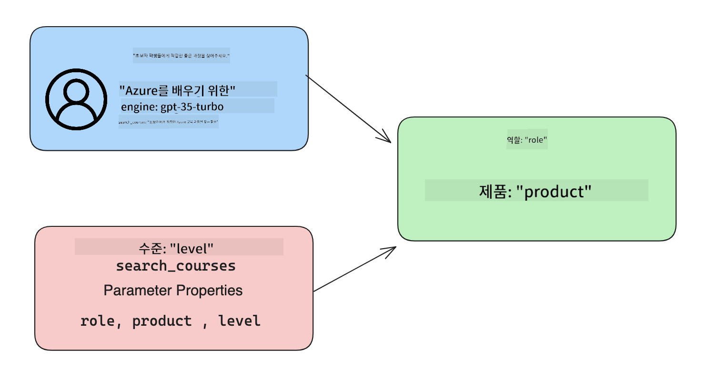

<!--
CO_OP_TRANSLATOR_METADATA:
{
  "original_hash": "77a48a201447be19aa7560706d6f93a0",
  "translation_date": "2025-05-19T21:23:34+00:00",
  "source_file": "11-integrating-with-function-calling/README.md",
  "language_code": "ko"
}
-->
# 함수 호출 통합

이전 수업에서 꽤 많은 것을 배웠습니다. 그러나 우리는 더 나아질 수 있습니다. 해결할 수 있는 몇 가지 문제는 더 일관된 응답 형식을 얻어 응답을 다운스트림에서 작업하기 쉽게 만드는 방법입니다. 또한, 다른 소스의 데이터를 추가하여 애플리케이션을 더욱 풍부하게 만들고자 할 수 있습니다.

위에서 언급한 문제들은 이 장에서 해결하려는 것입니다.

## 소개

이 수업에서는 다음을 다룹니다:

- 함수 호출이 무엇인지 및 사용 사례 설명.
- Azure OpenAI를 사용하여 함수 호출 생성.
- 애플리케이션에 함수 호출을 통합하는 방법.

## 학습 목표

이 수업을 마치면 다음을 할 수 있습니다:

- 함수 호출 사용 목적 설명.
- Azure OpenAI 서비스를 사용하여 함수 호출 설정.
- 애플리케이션의 사용 사례에 맞는 효과적인 함수 호출 설계.

## 시나리오: 함수로 챗봇 개선하기

이번 수업에서는 교육 스타트업을 위한 기능을 구축하고자 합니다. 사용자가 챗봇을 사용하여 기술 과정을 찾을 수 있도록 합니다. 우리는 사용자의 기술 수준, 현재 역할 및 관심 기술에 맞는 과정을 추천할 것입니다.

이 시나리오를 완료하기 위해 다음을 조합하여 사용할 것입니다:

- `Azure OpenAI`을 사용하여 사용자에게 채팅 경험을 제공합니다.
- `Microsoft Learn Catalog API`을 사용하여 사용자의 요청에 따라 과정을 찾도록 돕습니다.
- `Function Calling`을 사용하여 사용자의 쿼리를 함수에 보내 API 요청을 수행합니다.

시작하기 위해 먼저 함수 호출을 사용하고자 하는 이유를 살펴보겠습니다:

## 함수 호출의 이유

함수 호출 이전에는 LLM의 응답이 구조화되지 않고 일관되지 않았습니다. 개발자는 각 응답 변형을 처리할 수 있도록 복잡한 검증 코드를 작성해야 했습니다. 사용자는 "스톡홀름의 현재 날씨는 무엇인가요?"와 같은 답변을 얻을 수 없었습니다. 이는 모델이 훈련된 데이터의 시간에 제한되었기 때문입니다.

함수 호출은 Azure OpenAI 서비스의 기능으로 다음과 같은 제한을 극복합니다:

- **일관된 응답 형식**. 응답 형식을 더 잘 제어할 수 있다면 응답을 다른 시스템에 더 쉽게 통합할 수 있습니다.
- **외부 데이터**. 애플리케이션의 다른 소스의 데이터를 채팅 컨텍스트에서 사용할 수 있는 능력.

## 시나리오를 통한 문제 설명

> 아래 시나리오를 실행하려면 [포함된 노트북](../../../11-integrating-with-function-calling/python/aoai-assignment.ipynb)을 사용하는 것을 권장합니다. 문제를 해결하는 데 도움을 줄 수 있는 함수가 있는 문제를 설명하려는 것이므로 그냥 읽어도 됩니다.

응답 형식 문제를 설명하는 예를 살펴보겠습니다:

학생 데이터를 데이터베이스로 만들어 올바른 과정을 추천하고자 한다고 가정해봅시다. 아래에는 매우 유사한 데이터를 포함한 두 학생의 설명이 있습니다.

1. Azure OpenAI 리소스에 대한 연결을 생성합니다:

   ```python
   import os
   import json
   from openai import AzureOpenAI
   from dotenv import load_dotenv
   load_dotenv()

   client = AzureOpenAI(
   api_key=os.environ['AZURE_OPENAI_API_KEY'],  # this is also the default, it can be omitted
   api_version = "2023-07-01-preview"
   )

   deployment=os.environ['AZURE_OPENAI_DEPLOYMENT']
   ```

   아래는 `api_type`, `api_base`, `api_version` and `api_key`.

1. Creating two student descriptions using variables `student_1_description` and `student_2_description`를 설정하는 Azure OpenAI에 대한 연결을 구성하는 일부 Python 코드입니다.

   ```python
   student_1_description="Emily Johnson is a sophomore majoring in computer science at Duke University. She has a 3.7 GPA. Emily is an active member of the university's Chess Club and Debate Team. She hopes to pursue a career in software engineering after graduating."

   student_2_description = "Michael Lee is a sophomore majoring in computer science at Stanford University. He has a 3.8 GPA. Michael is known for his programming skills and is an active member of the university's Robotics Club. He hopes to pursue a career in artificial intelligence after finishing his studies."
   ```

   위의 학생 설명을 LLM에 보내 데이터를 파싱하고자 합니다. 이 데이터는 나중에 애플리케이션에서 사용되며 API로 보내거나 데이터베이스에 저장될 수 있습니다.

1. 관심 있는 정보를 LLM에 지시하는 두 개의 동일한 프롬프트를 생성합니다:

   ```python
   prompt1 = f'''
   Please extract the following information from the given text and return it as a JSON object:

   name
   major
   school
   grades
   club

   This is the body of text to extract the information from:
   {student_1_description}
   '''

   prompt2 = f'''
   Please extract the following information from the given text and return it as a JSON object:

   name
   major
   school
   grades
   club

   This is the body of text to extract the information from:
   {student_2_description}
   '''
   ```

   위의 프롬프트는 LLM에게 정보를 추출하고 JSON 형식으로 응답을 반환하도록 지시합니다.

1. 프롬프트와 Azure OpenAI에 대한 연결을 설정한 후, `openai.ChatCompletion`. We store the prompt in the `messages` variable and assign the role to `user`를 사용하여 프롬프트를 LLM에 보냅니다. 이는 사용자가 챗봇에 메시지를 작성하는 것을 모방한 것입니다.

   ```python
   # response from prompt one
   openai_response1 = client.chat.completions.create(
   model=deployment,
   messages = [{'role': 'user', 'content': prompt1}]
   )
   openai_response1.choices[0].message.content

   # response from prompt two
   openai_response2 = client.chat.completions.create(
   model=deployment,
   messages = [{'role': 'user', 'content': prompt2}]
   )
   openai_response2.choices[0].message.content
   ```

이제 두 요청을 LLM에 보내고 `openai_response1['choices'][0]['message']['content']`.

1. Lastly, we can convert the response to JSON format by calling `json.loads`와 같이 응답을 확인합니다:

   ```python
   # Loading the response as a JSON object
   json_response1 = json.loads(openai_response1.choices[0].message.content)
   json_response1
   ```

   응답 1:

   ```json
   {
     "name": "Emily Johnson",
     "major": "computer science",
     "school": "Duke University",
     "grades": "3.7",
     "club": "Chess Club"
   }
   ```

   응답 2:

   ```json
   {
     "name": "Michael Lee",
     "major": "computer science",
     "school": "Stanford University",
     "grades": "3.8 GPA",
     "club": "Robotics Club"
   }
   ```

   프롬프트는 동일하고 설명은 유사하지만, `Grades` property formatted differently, as we can sometimes get the format `3.7` or `3.7 GPA` for example.

   This result is because the LLM takes unstructured data in the form of the written prompt and returns also unstructured data. We need to have a structured format so that we know what to expect when storing or using this data

So how do we solve the formatting problem then? By using functional calling, we can make sure that we receive structured data back. When using function calling, the LLM does not actually call or run any functions. Instead, we create a structure for the LLM to follow for its responses. We then use those structured responses to know what function to run in our applications.


We can then take what is returned from the function and send this back to the LLM. The LLM will then respond using natural language to answer the user's query.

## Use Cases for using function calls

There are many different use cases where function calls can improve your app like:

- **Calling External Tools**. Chatbots are great at providing answers to questions from users. By using function calling, the chatbots can use messages from users to complete certain tasks. For example, a student can ask the chatbot to "Send an email to my instructor saying I need more assistance with this subject". This can make a function call to `send_email(to: string, body: string)`

- **Create API or Database Queries**. Users can find information using natural language that gets converted into a formatted query or API request. An example of this could be a teacher who requests "Who are the students that completed the last assignment" which could call a function named `get_completed(student_name: string, assignment: int, current_status: string)`

- **Creating Structured Data**. Users can take a block of text or CSV and use the LLM to extract important information from it. For example, a student can convert a Wikipedia article about peace agreements to create AI flashcards. This can be done by using a function called `get_important_facts(agreement_name: string, date_signed: string, parties_involved: list)`

## Creating Your First Function Call

The process of creating a function call includes 3 main steps:

1. **Calling** the Chat Completions API with a list of your functions and a user message.
2. **Reading** the model's response to perform an action i.e. execute a function or API Call.
3. **Making** another call to Chat Completions API with the response from your function to use that information to create a response to the user.



### Step 1 - creating messages

The first step is to create a user message. This can be dynamically assigned by taking the value of a text input or you can assign a value here. If this is your first time working with the Chat Completions API, we need to define the `role` and the `content` of the message.

The `role` can be either `system` (creating rules), `assistant` (the model) or `user` (the end-user). For function calling, we will assign this as `user`와 같은 값과 예시 질문을 볼 수 있습니다.

```python
messages= [ {"role": "user", "content": "Find me a good course for a beginner student to learn Azure."} ]
```

다른 역할을 할당함으로써 LLM에게 시스템이 말하는 것인지 사용자가 말하는 것인지 명확히 하여 LLM이 기반으로 삼을 수 있는 대화 기록을 구축하는 데 도움이 됩니다.

### 단계 2 - 함수 생성

다음으로 함수와 해당 함수의 매개변수를 정의합니다. 여기서는 `search_courses` but you can create multiple functions.

> **Important** : Functions are included in the system message to the LLM and will be included in the amount of available tokens you have available.

Below, we create the functions as an array of items. Each item is a function and has properties `name`, `description` and `parameters`라는 하나의 함수만 사용할 것입니다:

```python
functions = [
   {
      "name":"search_courses",
      "description":"Retrieves courses from the search index based on the parameters provided",
      "parameters":{
         "type":"object",
         "properties":{
            "role":{
               "type":"string",
               "description":"The role of the learner (i.e. developer, data scientist, student, etc.)"
            },
            "product":{
               "type":"string",
               "description":"The product that the lesson is covering (i.e. Azure, Power BI, etc.)"
            },
            "level":{
               "type":"string",
               "description":"The level of experience the learner has prior to taking the course (i.e. beginner, intermediate, advanced)"
            }
         },
         "required":[
            "role"
         ]
      }
   }
]
```

아래에서 각 함수 인스턴스를 자세히 설명하겠습니다:

- `name` - The name of the function that we want to have called.
- `description` - This is the description of how the function works. Here it's important to be specific and clear.
- `parameters` - A list of values and format that you want the model to produce in its response. The parameters array consists of items where the items have the following properties:
  1.  `type` - The data type of the properties will be stored in.
  1.  `properties` - List of the specific values that the model will use for its response
      1. `name` - The key is the name of the property that the model will use in its formatted response, for example, `product`.
      1. `type` - The data type of this property, for example, `string`.
      1. `description` - Description of the specific property.

There's also an optional property `required` - required property for the function call to be completed.

### Step 3 - Making the function call

After defining a function, we now need to include it in the call to the Chat Completion API. We do this by adding `functions` to the request. In this case `functions=functions`.

There is also an option to set `function_call` to `auto`. This means we will let the LLM decide which function should be called based on the user message rather than assigning it ourselves.

Here's some code below where we call `ChatCompletion.create`, note how we set `functions=functions` and `function_call="auto"`을 사용하여 LLM이 제공된 함수를 호출할 시기를 선택하도록 합니다:

```python
response = client.chat.completions.create(model=deployment,
                                        messages=messages,
                                        functions=functions,
                                        function_call="auto")

print(response.choices[0].message)
```

응답은 이제 다음과 같이 보입니다:

```json
{
  "role": "assistant",
  "function_call": {
    "name": "search_courses",
    "arguments": "{\n  \"role\": \"student\",\n  \"product\": \"Azure\",\n  \"level\": \"beginner\"\n}"
  }
}
```

여기서 `search_courses` was called and with what arguments, as listed in the `arguments` property in the JSON response.

The conclusion the LLM was able to find the data to fit the arguments of the function as it was extracting it from the value provided to the `messages` parameter in the chat completion call. Below is a reminder of the `messages` 값이 어떻게 보이는지 볼 수 있습니다:

```python
messages= [ {"role": "user", "content": "Find me a good course for a beginner student to learn Azure."} ]
```

보시다시피, `student`, `Azure` and `beginner` was extracted from `messages` and set as input to the function. Using functions this way is a great way to extract information from a prompt but also to provide structure to the LLM and have reusable functionality.

Next, we need to see how we can use this in our app.

## Integrating Function Calls into an Application

After we have tested the formatted response from the LLM, we can now integrate this into an application.

### Managing the flow

To integrate this into our application, let's take the following steps:

1. First, let's make the call to the OpenAI services and store the message in a variable called `response_message`.

   ```python
   response_message = response.choices[0].message
   ```

1. 이제 Microsoft Learn API를 호출하여 과정 목록을 가져오는 함수를 정의합니다:

   ```python
   import requests

   def search_courses(role, product, level):
     url = "https://learn.microsoft.com/api/catalog/"
     params = {
        "role": role,
        "product": product,
        "level": level
     }
     response = requests.get(url, params=params)
     modules = response.json()["modules"]
     results = []
     for module in modules[:5]:
        title = module["title"]
        url = module["url"]
        results.append({"title": title, "url": url})
     return str(results)
   ```

   이제 `functions` variable. We're also making real external API calls to fetch the data we need. In this case, we go against the Microsoft Learn API to search for training modules.

Ok, so we created `functions` variables and a corresponding Python function, how do we tell the LLM how to map these two together so our Python function is called?

1. To see if we need to call a Python function, we need to look into the LLM response and see if `function_call`의 일부인 실제 Python 함수를 생성하고 지정된 함수를 호출합니다. 아래에서 언급된 체크를 수행하는 방법은 다음과 같습니다:

   ```python
   # Check if the model wants to call a function
   if response_message.function_call.name:
    print("Recommended Function call:")
    print(response_message.function_call.name)
    print()

    # Call the function.
    function_name = response_message.function_call.name

    available_functions = {
            "search_courses": search_courses,
    }
    function_to_call = available_functions[function_name]

    function_args = json.loads(response_message.function_call.arguments)
    function_response = function_to_call(**function_args)

    print("Output of function call:")
    print(function_response)
    print(type(function_response))


    # Add the assistant response and function response to the messages
    messages.append( # adding assistant response to messages
        {
            "role": response_message.role,
            "function_call": {
                "name": function_name,
                "arguments": response_message.function_call.arguments,
            },
            "content": None
        }
    )
    messages.append( # adding function response to messages
        {
            "role": "function",
            "name": function_name,
            "content":function_response,
        }
    )
   ```

   이 세 줄은 함수 이름, 인수를 추출하고 호출을 수행합니다:

   ```python
   function_to_call = available_functions[function_name]

   function_args = json.loads(response_message.function_call.arguments)
   function_response = function_to_call(**function_args)
   ```

   아래는 코드 실행 결과입니다:

   **출력**

   ```Recommended Function call:
   {
     "name": "search_courses",
     "arguments": "{\n  \"role\": \"student\",\n  \"product\": \"Azure\",\n  \"level\": \"beginner\"\n}"
   }

   Output of function call:
   [{'title': 'Describe concepts of cryptography', 'url': 'https://learn.microsoft.com/training/modules/describe-concepts-of-cryptography/?
   WT.mc_id=api_CatalogApi'}, {'title': 'Introduction to audio classification with TensorFlow', 'url': 'https://learn.microsoft.com/en-
   us/training/modules/intro-audio-classification-tensorflow/?WT.mc_id=api_CatalogApi'}, {'title': 'Design a Performant Data Model in Azure SQL
   Database with Azure Data Studio', 'url': 'https://learn.microsoft.com/training/modules/design-a-data-model-with-ads/?
   WT.mc_id=api_CatalogApi'}, {'title': 'Getting started with the Microsoft Cloud Adoption Framework for Azure', 'url':
   'https://learn.microsoft.com/training/modules/cloud-adoption-framework-getting-started/?WT.mc_id=api_CatalogApi'}, {'title': 'Set up the
   Rust development environment', 'url': 'https://learn.microsoft.com/training/modules/rust-set-up-environment/?WT.mc_id=api_CatalogApi'}]
   <class 'str'>
   ```

1. 이제 업데이트된 메시지, `messages`를 LLM에 보내어 API JSON 형식의 응답 대신 자연어 응답을 받을 수 있습니다.

   ```python
   print("Messages in next request:")
   print(messages)
   print()

   second_response = client.chat.completions.create(
      messages=messages,
      model=deployment,
      function_call="auto",
      functions=functions,
      temperature=0
         )  # get a new response from GPT where it can see the function response


   print(second_response.choices[0].message)
   ```

   **출력**

   ```python
   {
     "role": "assistant",
     "content": "I found some good courses for beginner students to learn Azure:\n\n1. [Describe concepts of cryptography] (https://learn.microsoft.com/training/modules/describe-concepts-of-cryptography/?WT.mc_id=api_CatalogApi)\n2. [Introduction to audio classification with TensorFlow](https://learn.microsoft.com/training/modules/intro-audio-classification-tensorflow/?WT.mc_id=api_CatalogApi)\n3. [Design a Performant Data Model in Azure SQL Database with Azure Data Studio](https://learn.microsoft.com/training/modules/design-a-data-model-with-ads/?WT.mc_id=api_CatalogApi)\n4. [Getting started with the Microsoft Cloud Adoption Framework for Azure](https://learn.microsoft.com/training/modules/cloud-adoption-framework-getting-started/?WT.mc_id=api_CatalogApi)\n5. [Set up the Rust development environment](https://learn.microsoft.com/training/modules/rust-set-up-environment/?WT.mc_id=api_CatalogApi)\n\nYou can click on the links to access the courses."
   }

   ```

## 과제

Azure OpenAI 함수 호출 학습을 계속하려면 다음을 구축할 수 있습니다:

- 학습자가 더 많은 과정을 찾을 수 있도록 도와주는 함수의 더 많은 매개변수.
- 학습자의 모국어와 같은 더 많은 정보를 수집하는 다른 함수 호출 생성.
- 함수 호출 및/또는 API 호출이 적절한 과정을 반환하지 않을 때의 오류 처리 생성.

힌트: 이 데이터가 어떻게 그리고 어디에서 사용 가능한지 확인하려면 [Learn API 참조 문서](https://learn.microsoft.com/training/support/catalog-api-developer-reference?WT.mc_id=academic-105485-koreyst) 페이지를 참조하세요.

## 잘했습니다! 여정을 계속하세요

이 수업을 완료한 후, 우리의 [Generative AI 학습 컬렉션](https://aka.ms/genai-collection?WT.mc_id=academic-105485-koreyst)을 확인하여 생성 AI 지식을 계속 향상시키세요!

Lesson 12로 이동하여 [AI 애플리케이션을 위한 UX 설계](../12-designing-ux-for-ai-applications/README.md?WT.mc_id=academic-105485-koreyst)를 살펴보세요!

**면책 조항**:
이 문서는 AI 번역 서비스 [Co-op Translator](https://github.com/Azure/co-op-translator)를 사용하여 번역되었습니다. 우리는 정확성을 위해 노력하지만, 자동 번역에는 오류나 부정확성이 포함될 수 있음을 유의하시기 바랍니다. 원본 문서는 해당 언어로 작성된 것이 권위 있는 출처로 간주되어야 합니다. 중요한 정보에 대해서는 전문적인 인간 번역을 권장합니다. 이 번역의 사용으로 인해 발생하는 오해나 잘못된 해석에 대해서는 책임을 지지 않습니다.