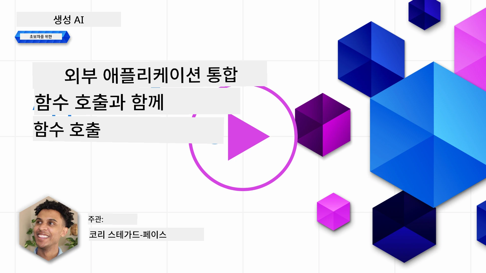
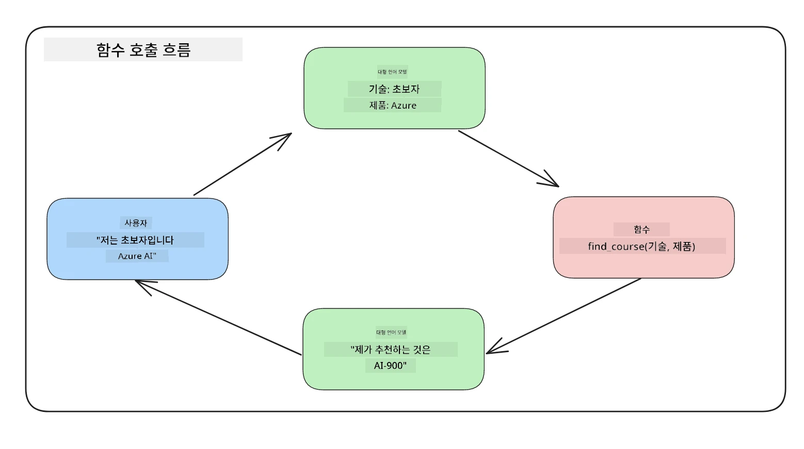
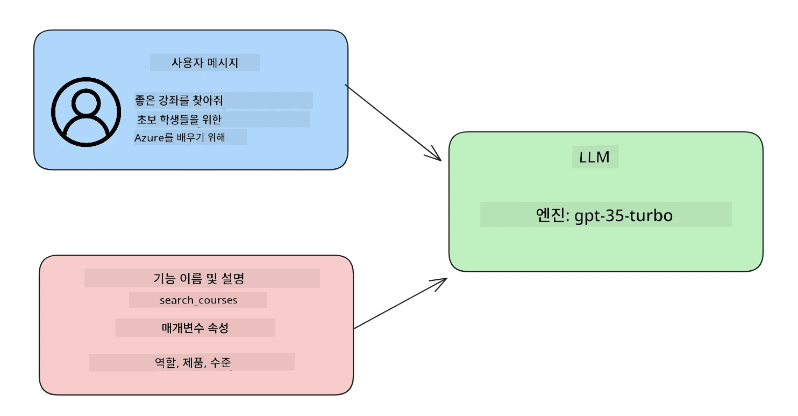

# 함수 호출과 통합하기

[](https://youtu.be/DgUdCLX8qYQ?si=f1ouQU5HQx6F8Gl2)

이전 수업에서 꽤 많은 것을 배웠습니다. 그러나 우리는 더 개선할 수 있습니다. 여기서 다루고자 하는 것은 응답을 하위 단계에서 더 쉽게 사용할 수 있도록 더 일관된 응답 형식을 얻는 방법과 애플리케이션을 더욱 풍부하게 만들기 위해 다른 소스의 데이터를 추가하는 방법입니다.

위에서 언급한 문제는 이 장에서 해결하고자 하는 문제들입니다.

## 소개

이 수업에서 다룰 내용은 다음과 같습니다:

- 함수 호출이 무엇이며 사용 사례를 설명합니다.
- Azure OpenAI를 사용해 함수 호출을 생성하는 방법.
- 애플리케이션에 함수 호출을 통합하는 방법.

## 학습 목표

이 수업이 끝나면 다음을 할 수 있습니다:

- 함수 호출을 사용하는 목적을 설명할 수 있습니다.
- Azure OpenAI 서비스를 사용해 함수 호출을 설정할 수 있습니다.
- 애플리케이션 사용 사례에 맞는 효과적인 함수 호출을 설계할 수 있습니다.

## 시나리오: 기능으로 챗봇 개선하기

이 수업에서는 교육 스타트업을 위해 사용자가 챗봇을 통해 기술 과정을 찾을 수 있는 기능을 구축하고자 합니다. 사용자의 기술 수준, 현재 직무 및 관심 기술에 맞는 과정을 추천할 것입니다.

이 시나리오를 완료하기 위해 다음을 조합해서 사용할 것입니다:

- `Azure OpenAI`를 사용해 사용자에게 채팅 경험을 제공합니다.
- `Microsoft Learn Catalog API`로 사용자의 요청에 따라 과정을 찾도록 돕습니다.
- `Function Calling`을 사용해 사용자의 질의를 함수로 전달하여 API 요청을 합니다.

먼저, 함수 호출을 왜 사용하려 하는지 살펴보겠습니다:

## 함수 호출이 필요한 이유

함수 호출 이전에는 LLM이 반환하는 응답이 비구조적이고 일관되지 않았습니다. 개발자는 각각의 응답 변형을 처리하는 복잡한 검증 코드를 작성해야 했습니다. 사용자는 "스톡홀름의 현재 날씨가 어떻게 돼?"와 같은 답변을 받을 수 없었습니다. 이는 모델이 학습된 시점의 데이터 한계 때문입니다.

함수 호출은 Azure OpenAI 서비스의 기능으로서 다음 제한점을 극복합니다:

- **일관된 응답 형식**. 응답 형식을 더 잘 제어할 수 있다면 하위 시스템과 쉽게 통합할 수 있습니다.
- **외부 데이터 사용**. 애플리케이션 내 다른 소스의 데이터를 채팅 컨텍스트에서 사용할 수 있습니다.

## 시나리오를 통한 문제 설명

> 아래 시나리오를 실행하려면 [포함된 노트북](./python/aoai-assignment.ipynb?WT.mc_id=academic-105485-koreyst)을 사용하는 것을 권장합니다. 아니면 읽으면서 함수가 문제를 어떻게 해결하는지 이해할 수 있습니다.

응답 형식 문제를 보여주는 예제를 살펴보겠습니다:

학생 데이터베이스를 생성해 적합한 과정을 제안하려고 합니다. 아래 두 학생 설명은 데이터 내용이 매우 유사합니다.

1. Azure OpenAI 리소스에 연결을 만듭니다:

   ```python
   import os
   import json
   from openai import OpenAI
   from dotenv import load_dotenv
   load_dotenv()

   # Responses API는 Azure OpenAI (Microsoft Foundry) v1 엔드포인트에서 제공됩니다
   # 따라서 OpenAI 클라이언트를 <your-endpoint>/openai/v1/로 지정합니다.
   endpoint = os.environ['AZURE_OPENAI_ENDPOINT']
   client = OpenAI(
   api_key=os.environ['AZURE_OPENAI_API_KEY'],
   base_url=f"{endpoint.rstrip('/')}/openai/v1/",
   )

   deployment=os.environ['AZURE_OPENAI_DEPLOYMENT']
   ```

   아래는 Azure OpenAI 연결 설정을 위한 Python 코드입니다. v1 엔드포인트를 사용하므로 `api_key`와 `base_url`만 설정합니다 (`api_version`은 필요 없음).

1. `student_1_description` 및 `student_2_description` 변수로 두 학생 설명을 만듭니다.

   ```python
   student_1_description="Emily Johnson is a sophomore majoring in computer science at Duke University. She has a 3.7 GPA. Emily is an active member of the university's Chess Club and Debate Team. She hopes to pursue a career in software engineering after graduating."

   student_2_description = "Michael Lee is a sophomore majoring in computer science at Stanford University. He has a 3.8 GPA. Michael is known for his programming skills and is an active member of the university's Robotics Club. He hopes to pursue a career in artificial intelligence after finishing his studies."
   ```

   위 학생 설명을 LLM에 보내 데이터를 파싱하려 합니다. 이 데이터는 나중에 API 요청에 보내거나 데이터베이스에 저장할 수 있습니다.

1. LLM에 필요한 정보를 추출하도록 지시하는 두 개의 동일한 프롬프트를 만듭니다:

   ```python
   prompt1 = f'''
   Please extract the following information from the given text and return it as a JSON object:

   name
   major
   school
   grades
   club

   This is the body of text to extract the information from:
   {student_1_description}
   '''

   prompt2 = f'''
   Please extract the following information from the given text and return it as a JSON object:

   name
   major
   school
   grades
   club

   This is the body of text to extract the information from:
   {student_2_description}
   '''
   ```

   위 프롬프트는 LLM에 정보를 추출해 JSON 형식으로 응답하도록 지시합니다.

1. 프롬프트와 Azure OpenAI 연결 설정 후 `client.responses.create`를 사용해 프롬프트를 LLM에 전송합니다. 프롬프트는 `input` 변수에 저장하며 역할은 `user`로 지정하여 사용자가 챗봇에 메시지를 보낸 것처럼 합니다.

   ```python
   # 프롬프트 1에 대한 응답
   openai_response1 = client.responses.create(
   model=deployment,
   input = [{'role': 'user', 'content': prompt1}],
   store=False,
   )
   openai_response1.output_text

   # 프롬프트 2에 대한 응답
   openai_response2 = client.responses.create(
   model=deployment,
   input = [{'role': 'user', 'content': prompt2}],
   store=False,
   )
   openai_response2.output_text
   ```

이제 두 요청을 LLM에 보내고 `openai_response1.output_text`와 같이 받아온 응답을 확인할 수 있습니다.

1. 마지막으로 `json.loads`를 사용해 응답을 JSON 형식으로 변환합니다:

   ```python
   # 응답을 JSON 객체로 로드 중
   json_response1 = json.loads(openai_response1.output_text)
   json_response1
   ```

   응답 1:

   ```json
   {
     "name": "Emily Johnson",
     "major": "computer science",
     "school": "Duke University",
     "grades": "3.7",
     "club": "Chess Club"
   }
   ```

   응답 2:

   ```json
   {
     "name": "Michael Lee",
     "major": "computer science",
     "school": "Stanford University",
     "grades": "3.8 GPA",
     "club": "Robotics Club"
   }
   ```

   같은 프롬프트와 유사한 설명에도 불구하고 `Grades` 속성 값은 다르게 형식화되어 `3.7` 또는 `3.7 GPA`처럼 나올 수 있습니다.

   이는 LLM이 비구조적 데이터(프롬프트 텍스트)를 가져와 역시 비구조적 데이터로 반환하기 때문입니다. 데이터를 저장하거나 활용할 때 기대하는 형식을 알 수 있도록 구조화된 형식이 필요합니다.

그렇다면 형식 문제는 어떻게 해결할 수 있을까요? 함수 호출을 사용하면 구조화된 데이터를 확실히 받을 수 있습니다. 함수 호출 시 LLM은 함수를 직접 호출하거나 실행하지 않습니다. 대신, 응답을 위한 구조를 정의해 LLM이 그에 따라 응답하도록 합니다. 그 구조화된 응답을 바탕으로 애플리케이션에서 어떤 함수를 실행할지 결정하는 것입니다.



함수에서 반환된 값을 가져와 다시 LLM에게 보내면 LLM은 자연어로 응답해 사용자의 질문에 답합니다.

## 함수 호출 사용 사례

함수 호출이 앱을 개선할 수 있는 다양한 사용 사례가 있습니다:

- **외부 도구 호출**. 챗봇은 사용자 질문에 답하는 데 탁월합니다. 함수 호출을 사용하면 챗봇이 사용자의 메시지를 특정 작업을 완료하는 데 쓸 수 있습니다. 예를 들어 학생이 "이 과목에 대해 더 도움이 필요하다고 강사에게 이메일 보내줘"라고 하면 `send_email(to: string, body: string)` 함수를 호출할 수 있습니다.

- **API 또는 데이터베이스 쿼리 생성**. 사용자는 자연어로 정보를 찾아 포맷된 쿼리나 API 요청으로 변환됩니다. 예를 들어 교사가 "최근 과제를 완료한 학생이 누구인가"를 요청하면 `get_completed(student_name: string, assignment: int, current_status: string)` 함수가 호출될 수 있습니다.

- **구조화된 데이터 생성**. 사용자는 텍스트 블록이나 CSV에서 중요한 정보를 추출하기 위해 LLM을 사용할 수 있습니다. 예를 들어, 학생이 평화 협정에 관한 위키피디아 기사를 AI 플래시카드로 변환할 때 `get_important_facts(agreement_name: string, date_signed: string, parties_involved: list)` 함수를 사용할 수 있습니다.

## 첫 번째 함수 호출 만들기

함수 호출 생성 과정은 주요 3단계로 구성됩니다:

1. 함수 목록(도구)과 사용자 메시지를 포함해 응답 API를 호출합니다.
2. 모델의 응답을 읽고 동작(함수 또는 API 호출 실행)을 수행합니다.
3. 함수 응답을 사용해 사용자에게 보낼 응답을 생성하기 위해 다시 응답 API를 호출합니다.



### 1단계 - 메시지 생성

첫 단계는 사용자 메시지를 만드는 것입니다. 이는 텍스트 입력 값으로 동적으로 지정하거나 여기서 직접 지정할 수 있습니다. Responses API를 처음 사용한다면 `role`과 `content`를 정의해야 합니다.

`role`은 `system`(규칙 생성), `assistant`(모델), `user`(최종 사용자) 중 하나입니다. 함수 호출의 경우 `user` 역할과 예시 질문을 할당합니다.

```python
messages= [ {"role": "user", "content": "Find me a good course for a beginner student to learn Azure."} ]
```

서로 다른 역할을 할당함으로써 시스템이 말하는지, 사용자가 말하는지 명확히 하여 LLM이 대화 기록을 구성하는 데 도움이 됩니다.

### 2단계 - 함수 정의

다음으로, 함수와 그 매개변수를 정의합니다. 여기서는 하나의 함수 `search_courses`만 사용하지만 여러 개를 생성할 수 있습니다.

> <strong>중요</strong>: 함수는 시스템 메시지에 포함되어 LLM에게 전달되며 사용 가능한 토큰 수에 포함됩니다.

아래에서 함수 배열을 만듭니다. 각 항목은 Responses API 플랫 포맷의 도구이며, `type`, `name`, `description`, `parameters` 속성을 갖습니다:

```python
functions = [
   {
      "type":"function",
      "name":"search_courses",
      "description":"Retrieves courses from the search index based on the parameters provided",
      "parameters":{
         "type":"object",
         "properties":{
            "role":{
               "type":"string",
               "description":"The role of the learner (i.e. developer, data scientist, student, etc.)"
            },
            "product":{
               "type":"string",
               "description":"The product that the lesson is covering (i.e. Azure, Power BI, etc.)"
            },
            "level":{
               "type":"string",
               "description":"The level of experience the learner has prior to taking the course (i.e. beginner, intermediate, advanced)"
            }
         },
         "required":[
            "role"
         ]
      }
   }
]
```

아래에 각 함수 인스턴스를 자세히 설명합니다:

- `name` - 호출할 함수 이름입니다.
- `description` - 함수 동작에 대한 설명입니다. 구체적이고 명확해야 합니다.
- `parameters` - 응답에서 모델이 생성할 값과 형식의 리스트입니다. 배열 항목은 다음 속성을 가집니다:
  1. `type` - 속성이 저장될 데이터 타입입니다.
  1. `properties` - 응답에 사용할 구체적인 값 목록입니다.
      1. `name` - 모델이 포맷된 응답에서 사용할 속성 이름입니다(예: `product`).
      1. `type` - 이 속성의 데이터 타입입니다(예: `string`).
      1. `description` - 해당 속성에 대한 설명입니다.

또한 선택적으로 `required` 속성이 있어 함수 호출이 완료되기 위해 필요한 속성을 지정할 수 있습니다.

### 3단계 - 함수 호출 실행

함수 정의 후, 이제 이를 Responses API 호출에 포함해야 합니다. 요청에 `tools`를 추가하는데 여기서는 `tools=functions`로 설정합니다.

`tool_choice`를 `auto`로 설정할 수도 있는데, 이는 사용자가 직접 지정하지 않고 LLM이 사용자 메시지에 따라 어떤 함수를 호출할지 결정하게 하는 설정입니다.

아래 코드는 `client.responses.create`를 호출하는 예시입니다. `tools=functions`, `tool_choice="auto"`를 설정하여 LLM이 함수 호출 시점을 선택하도록 합니다:

```python
response = client.responses.create(model=deployment,
                                        input=messages,
                                        tools=functions,
                                        tool_choice="auto",
                                        store=False)

print(response.output)
```

응답에는 이제 `response.output` 내에 `function_call` 항목이 포함되어 다음과 같습니다:

```json
{
  "type": "function_call",
  "name": "search_courses",
  "call_id": "call_abc123",
  "arguments": "{\n  \"role\": \"student\",\n  \"product\": \"Azure\",\n  \"level\": \"beginner\"\n}"
}
```

여기서 함수 `search_courses`가 호출되었고, JSON 응답의 `arguments` 속성에 어떤 인자가 전달되었는지 볼 수 있습니다.

LLM은 `input` 매개변수 값에서 데이터를 추출해 함수 인자에 맞춰 전달했음을 알 수 있습니다. 다시 `messages` 값을 참고해 봅니다:

```python
messages= [ {"role": "user", "content": "Find me a good course for a beginner student to learn Azure."} ]
```

보시다시피 `student`, `Azure`, `beginner`가 `messages`에서 추출되어 함수 입력으로 설정되었습니다. 이처럼 함수를 사용하면 프롬프트에서 정보를 효과적으로 추출하고, LLM에 구조를 제공하며, 재사용 가능한 기능을 구현할 수 있습니다.

다음으로 이 기능을 애플리케이션에서 어떻게 활용할 수 있는지 살펴봅니다.

## 애플리케이션에 함수 호출 통합하기

LLM의 형식화된 응답을 테스트한 후, 이를 애플리케이션에 통합할 수 있습니다.

### 흐름 관리

애플리케이션에 통합하려면 다음 단계를 수행합니다:

1. 먼저 OpenAI 서비스에 호출을 하고 응답 `output`에서 함수 호출 항목을 추출합니다.

   ```python
   response_items = response.output
   tool_calls = [item for item in response_items if item.type == "function_call"]
   ```

1. 이제 마이크로소프트 Learn API를 호출해 과정 목록을 가져오는 함수를 정의합니다:

   ```python
   import requests

   def search_courses(role, product, level):
     url = "https://learn.microsoft.com/api/catalog/"
     params = {
        "role": role,
        "product": product,
        "level": level
     }
     response = requests.get(url, params=params)
     modules = response.json()["modules"]
     results = []
     for module in modules[:5]:
        title = module["title"]
        url = module["url"]
        results.append({"title": title, "url": url})
     return str(results)
   ```

   `functions` 변수에 정의한 함수 이름에 대응하는 실제 Python 함수를 만드는 예입니다. 실제 외부 API를 호출해 필요한 데이터를 가져옵니다. 여기서는 Microsoft Learn API를 이용해 교육 모듈을 검색합니다.

그렇다면 `functions` 변수와 Python 함수를 연결해 LLM이 Python 함수를 호출하도록 어떻게 알릴까요?

1. Python 함수를 호출할지 확인하려면 LLM 응답에 `function_call` 항목이 포함되어 있는지 점검하고, 해당 함수를 호출합니다. 아래는 점검하는 예시 코드입니다:

   ```python
   # 모델이 함수를 호출하려는지 확인합니다
   if tool_calls:
    for tool_call in tool_calls:
     print("Recommended Function call:")
     print(tool_call.name)
     print()

     # 함수를 호출합니다.
     function_name = tool_call.name

     available_functions = {
             "search_courses": search_courses,
     }
     function_to_call = available_functions[function_name]

     function_args = json.loads(tool_call.arguments)
     function_response = function_to_call(**function_args)

     print("Output of function call:")
     print(function_response)
     print(type(function_response))

     # 함수 호출 및 그 결과를 대화에 다시 추가합니다.
     # 모델의 function_call 항목은 출력 전에 추가되어야 합니다.
     messages.append(tool_call)  # 어시스턴트의 function_call 항목
     messages.append( # 함수 결과
         {
             "type": "function_call_output",
             "call_id": tool_call.call_id,
             "output": function_response,
         }
     )
   ```

   세 줄 코드로 함수 이름과 인자를 추출하고 호출을 수행합니다:

   ```python
   function_to_call = available_functions[function_name]

   function_args = json.loads(tool_call.arguments)
   function_response = function_to_call(**function_args)
   ```

   아래는 실행 결과 출력 예시입니다:

   <strong>출력</strong>

   ```Recommended Function call:
   {
     "name": "search_courses",
     "arguments": "{\n  \"role\": \"student\",\n  \"product\": \"Azure\",\n  \"level\": \"beginner\"\n}"
   }

   Output of function call:
   [{'title': 'Describe concepts of cryptography', 'url': 'https://learn.microsoft.com/training/modules/describe-concepts-of-cryptography/?
   WT.mc_id=api_CatalogApi'}, {'title': 'Introduction to audio classification with TensorFlow', 'url': 'https://learn.microsoft.com/en-
   us/training/modules/intro-audio-classification-tensorflow/?WT.mc_id=api_CatalogApi'}, {'title': 'Design a Performant Data Model in Azure SQL
   Database with Azure Data Studio', 'url': 'https://learn.microsoft.com/training/modules/design-a-data-model-with-ads/?
   WT.mc_id=api_CatalogApi'}, {'title': 'Getting started with the Microsoft Cloud Adoption Framework for Azure', 'url':
   'https://learn.microsoft.com/training/modules/cloud-adoption-framework-getting-started/?WT.mc_id=api_CatalogApi'}, {'title': 'Set up the
   Rust development environment', 'url': 'https://learn.microsoft.com/training/modules/rust-set-up-environment/?WT.mc_id=api_CatalogApi'}]
   <class 'str'>
   ```

1. 이제 업데이트된 메시지 `messages`를 LLM에 보내 API JSON 형식이 아닌 자연어 응답을 받습니다.

   ```python
   print("Messages in next request:")
   print(messages)
   print()

   second_response = client.responses.create(
      input=messages,
      model=deployment,
      tool_choice="auto",
      tools=functions,
      temperature=0,
      store=False,
         )  # 함수 응답을 볼 수 있는 상태에서 모델로부터 새로운 응답을 받습니다


   print(second_response.output_text)
   ```

   <strong>출력</strong>

   ```text
   I found some good courses for beginner students to learn Azure:

   1. [Describe concepts of cryptography](https://learn.microsoft.com/training/modules/describe-concepts-of-cryptography/?WT.mc_id=api_CatalogApi)
   2. [Introduction to audio classification with TensorFlow](https://learn.microsoft.com/training/modules/intro-audio-classification-tensorflow/?WT.mc_id=api_CatalogApi)
   3. [Design a Performant Data Model in Azure SQL Database with Azure Data Studio](https://learn.microsoft.com/training/modules/design-a-data-model-with-ads/?WT.mc_id=api_CatalogApi)
   4. [Getting started with the Microsoft Cloud Adoption Framework for Azure](https://learn.microsoft.com/training/modules/cloud-adoption-framework-getting-started/?WT.mc_id=api_CatalogApi)
   5. [Set up the Rust development environment](https://learn.microsoft.com/training/modules/rust-set-up-environment/?WT.mc_id=api_CatalogApi)

   You can click on the links to access the courses.
   ```

## 과제

Azure OpenAI 함수 호출 학습을 계속하려면 다음을 구현해 보세요:

- 학습자가 더 많은 과정을 찾는 데 도움이 될 수 있는 함수의 추가 매개변수.

- 학습자의 모국어와 같은 더 많은 정보를 받는 또 다른 함수 호출을 만드세요
- 함수 호출 및/또는 API 호출이 적합한 강좌를 반환하지 않을 때의 오류 처리를 만드세요

힌트: 이 데이터가 어떻게 그리고 어디에서 사용 가능한지 알아보려면 [Learn API 참조 문서](https://learn.microsoft.com/training/support/catalog-api-developer-reference?WT.mc_id=academic-105485-koreyst) 페이지를 참고하세요.

## 훌륭합니다! 여정을 계속하세요

이 수업을 완료한 후, [생성 AI 학습 컬렉션](https://aka.ms/genai-collection?WT.mc_id=academic-105485-koreyst)을 확인하여 생성 AI 지식을 계속 향상시키세요!

12과로 이동하여 [AI 애플리케이션을 위한 UX 설계](../12-designing-ux-for-ai-applications/README.md?WT.mc_id=academic-105485-koreyst)에 대해 알아봅시다!

---

<!-- CO-OP TRANSLATOR DISCLAIMER START -->
**면책 조항**:
이 문서는 AI 번역 서비스 [Co-op Translator](https://github.com/Azure/co-op-translator)를 사용하여 번역되었습니다. 정확성을 기하기 위해 노력하고 있으나, 자동 번역은 오류나 부정확한 부분이 있을 수 있음을 유의하시기 바랍니다. 원본 문서의 원어본이 권위 있는 자료로 간주되어야 합니다. 중요한 정보의 경우, 전문가의 인간 번역을 권장합니다. 이 번역 사용으로 인해 발생하는 오해나 잘못된 해석에 대해 당사는 책임을 지지 않습니다.
<!-- CO-OP TRANSLATOR DISCLAIMER END -->