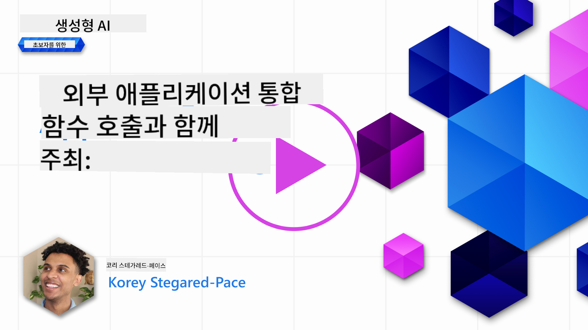

<!--
CO_OP_TRANSLATOR_METADATA:
{
  "original_hash": "77a48a201447be19aa7560706d6f93a0",
  "translation_date": "2025-07-09T14:27:24+00:00",
  "source_file": "11-integrating-with-function-calling/README.md",
  "language_code": "ko"
}
-->
# 함수 호출과의 통합

[](https://aka.ms/gen-ai-lesson11-gh?WT.mc_id=academic-105485-koreyst)

이전 강의들에서 꽤 많은 내용을 배웠습니다. 하지만 더 개선할 수 있는 부분이 있습니다. 그중 하나는 응답 형식을 더 일관되게 만들어 후속 작업을 쉽게 하는 방법이고, 또 다른 하나는 다른 소스의 데이터를 추가해 애플리케이션을 더욱 풍부하게 만드는 방법입니다.

위에서 언급한 문제들이 이 장에서 다루고자 하는 내용입니다.

## 소개

이번 강의에서는 다음 내용을 다룹니다:

- 함수 호출이 무엇이며 어떤 경우에 사용하는지 설명합니다.
- Azure OpenAI를 사용해 함수 호출을 만드는 방법을 배웁니다.
- 함수 호출을 애플리케이션에 통합하는 방법을 알아봅니다.

## 학습 목표

이 강의를 마치면 다음을 할 수 있습니다:

- 함수 호출을 사용하는 목적을 설명할 수 있습니다.
- Azure OpenAI 서비스를 사용해 함수 호출을 설정할 수 있습니다.
- 애플리케이션의 사용 사례에 맞는 효과적인 함수 호출을 설계할 수 있습니다.

## 시나리오: 함수로 챗봇 개선하기

이번 강의에서는 교육 스타트업을 위해 사용자가 챗봇을 통해 기술 강좌를 찾을 수 있는 기능을 만들고자 합니다. 사용자의 기술 수준, 현재 역할, 관심 기술에 맞는 강좌를 추천할 예정입니다.

이 시나리오를 완성하기 위해 다음을 조합해서 사용합니다:

- `Azure OpenAI`로 사용자와의 채팅 경험을 만듭니다.
- `Microsoft Learn Catalog API`를 사용해 사용자의 요청에 맞는 강좌를 찾습니다.
- `Function Calling`을 통해 사용자의 쿼리를 함수에 전달해 API 요청을 수행합니다.

먼저, 왜 함수 호출을 사용해야 하는지 살펴보겠습니다:

## 함수 호출이 필요한 이유

함수 호출 이전에는 LLM의 응답이 비구조적이고 일관성이 없었습니다. 개발자는 다양한 응답 변형을 처리하기 위해 복잡한 검증 코드를 작성해야 했습니다. 예를 들어 "스톡홀름의 현재 날씨는?" 같은 질문에 답을 얻기 어려웠는데, 이는 모델이 학습된 시점의 데이터에 한정되었기 때문입니다.

함수 호출은 Azure OpenAI 서비스의 기능으로, 다음과 같은 한계를 극복합니다:

- **일관된 응답 형식**: 응답 형식을 더 잘 제어하면 후속 시스템과의 통합이 쉬워집니다.
- **외부 데이터 활용**: 애플리케이션의 다른 데이터 소스를 채팅 컨텍스트에서 사용할 수 있습니다.

## 시나리오로 문제 설명하기

> 아래 시나리오를 실행해보고 싶다면 [포함된 노트북](../../../11-integrating-with-function-calling/python/aoai-assignment.ipynb)을 사용하는 것을 추천합니다. 아니면 문제를 설명하는 내용만 읽어도 됩니다. 함수가 문제 해결에 어떻게 도움을 주는지 보여주려는 예시입니다.

응답 형식 문제를 보여주는 예시를 살펴봅시다:

학생 데이터를 데이터베이스로 만들어 적합한 강좌를 추천하려고 합니다. 아래는 비슷한 데이터를 가진 두 학생 설명입니다.

1. Azure OpenAI 리소스에 연결을 만듭니다:

   ```python
   import os
   import json
   from openai import AzureOpenAI
   from dotenv import load_dotenv
   load_dotenv()

   client = AzureOpenAI(
   api_key=os.environ['AZURE_OPENAI_API_KEY'],  # this is also the default, it can be omitted
   api_version = "2023-07-01-preview"
   )

   deployment=os.environ['AZURE_OPENAI_DEPLOYMENT']
   ```

   아래는 `api_type`, `api_base`, `api_version`, `api_key`를 설정해 Azure OpenAI 연결을 구성하는 Python 코드입니다.

1. `student_1_description`과 `student_2_description` 변수로 두 학생 설명을 만듭니다.

   ```python
   student_1_description="Emily Johnson is a sophomore majoring in computer science at Duke University. She has a 3.7 GPA. Emily is an active member of the university's Chess Club and Debate Team. She hopes to pursue a career in software engineering after graduating."

   student_2_description = "Michael Lee is a sophomore majoring in computer science at Stanford University. He has a 3.8 GPA. Michael is known for his programming skills and is an active member of the university's Robotics Club. He hopes to pursue a career in artificial intelligence after finishing his studies."
   ```

   위 학생 설명을 LLM에 보내 데이터를 파싱하도록 합니다. 이 데이터는 나중에 애플리케이션에서 API 호출이나 데이터베이스 저장에 사용됩니다.

1. LLM에 어떤 정보를 추출할지 지시하는 동일한 프롬프트 두 개를 만듭니다:

   ```python
   prompt1 = f'''
   Please extract the following information from the given text and return it as a JSON object:

   name
   major
   school
   grades
   club

   This is the body of text to extract the information from:
   {student_1_description}
   '''

   prompt2 = f'''
   Please extract the following information from the given text and return it as a JSON object:

   name
   major
   school
   grades
   club

   This is the body of text to extract the information from:
   {student_2_description}
   '''
   ```

   위 프롬프트는 LLM에 정보를 추출해 JSON 형식으로 응답하라고 지시합니다.

1. 프롬프트와 Azure OpenAI 연결 설정 후, `openai.ChatCompletion`을 사용해 프롬프트를 LLM에 보냅니다. `messages` 변수에 프롬프트를 저장하고 역할을 `user`로 지정합니다. 이는 사용자가 챗봇에 메시지를 보내는 상황을 모방한 것입니다.

   ```python
   # response from prompt one
   openai_response1 = client.chat.completions.create(
   model=deployment,
   messages = [{'role': 'user', 'content': prompt1}]
   )
   openai_response1.choices[0].message.content

   # response from prompt two
   openai_response2 = client.chat.completions.create(
   model=deployment,
   messages = [{'role': 'user', 'content': prompt2}]
   )
   openai_response2.choices[0].message.content
   ```

이제 두 요청을 LLM에 보내고 `openai_response1['choices'][0]['message']['content']`와 같이 응답을 확인할 수 있습니다.

1. 마지막으로 `json.loads`를 호출해 응답을 JSON 형식으로 변환합니다:

   ```python
   # Loading the response as a JSON object
   json_response1 = json.loads(openai_response1.choices[0].message.content)
   json_response1
   ```

   응답 1:

   ```json
   {
     "name": "Emily Johnson",
     "major": "computer science",
     "school": "Duke University",
     "grades": "3.7",
     "club": "Chess Club"
   }
   ```

   응답 2:

   ```json
   {
     "name": "Michael Lee",
     "major": "computer science",
     "school": "Stanford University",
     "grades": "3.8 GPA",
     "club": "Robotics Club"
   }
   ```

   프롬프트는 같고 설명도 비슷하지만, `Grades` 속성의 값 형식이 다릅니다. 예를 들어 `3.7` 또는 `3.7 GPA`처럼 다르게 나옵니다.

   이는 LLM이 비구조적 프롬프트를 받아 비구조적 데이터를 반환하기 때문입니다. 데이터를 저장하거나 사용할 때 무엇을 기대할지 알기 위해서는 구조화된 형식이 필요합니다.

그렇다면 형식 문제를 어떻게 해결할까요? 함수 호출을 사용하면 구조화된 데이터를 받을 수 있습니다. 함수 호출 시 LLM이 실제로 함수를 호출하거나 실행하지는 않습니다. 대신 LLM이 응답할 때 따라야 할 구조를 만듭니다. 그런 다음 이 구조화된 응답을 바탕으로 애플리케이션에서 어떤 함수를 실행할지 결정합니다.


함수에서 반환된 결과를 다시 LLM에 보내면, LLM은 자연어로 사용자의 질문에 답변합니다.

## 함수 호출 사용 사례

함수 호출이 앱을 개선할 수 있는 다양한 사례가 있습니다:

- **외부 도구 호출**: 챗봇은 사용자 질문에 답변하는 데 뛰어납니다. 함수 호출을 사용하면 사용자의 메시지를 받아 특정 작업을 수행할 수 있습니다. 예를 들어 학생이 "이 과목에 대해 더 도움이 필요하니 강사에게 이메일 보내줘"라고 하면, `send_email(to: string, body: string)` 함수를 호출할 수 있습니다.

- **API 또는 데이터베이스 쿼리 생성**: 사용자가 자연어로 정보를 찾으면 이를 형식화된 쿼리나 API 요청으로 변환할 수 있습니다. 예를 들어 교사가 "마지막 과제를 완료한 학생은 누구인가요?"라고 요청하면 `get_completed(student_name: string, assignment: int, current_status: string)` 함수를 호출할 수 있습니다.

- **구조화된 데이터 생성**: 사용자가 텍스트 블록이나 CSV에서 중요한 정보를 추출할 수 있습니다. 예를 들어 학생이 평화 협정에 관한 위키피디아 기사를 AI 플래시카드로 변환할 때 `get_important_facts(agreement_name: string, date_signed: string, parties_involved: list)` 함수를 사용할 수 있습니다.

## 첫 번째 함수 호출 만들기

함수 호출을 만드는 과정은 세 가지 주요 단계로 나뉩니다:

1. 함수 목록과 사용자 메시지를 포함해 Chat Completions API를 호출합니다.
2. 모델의 응답을 읽고, 함수 실행이나 API 호출 같은 작업을 수행합니다.
3. 함수의 응답을 받아 다시 Chat Completions API에 보내 사용자에게 응답을 생성합니다.


### 1단계 - 메시지 만들기

첫 번째 단계는 사용자 메시지를 만드는 것입니다. 텍스트 입력값을 동적으로 할당하거나 여기서 직접 값을 지정할 수 있습니다. Chat Completions API를 처음 사용한다면 `role`과 `content`를 정의해야 합니다.

`role`은 `system`(규칙 생성), `assistant`(모델), `user`(최종 사용자) 중 하나입니다. 함수 호출에서는 `user` 역할과 예시 질문을 할당합니다.

```python
messages= [ {"role": "user", "content": "Find me a good course for a beginner student to learn Azure."} ]
```

역할을 다르게 지정하면 LLM이 시스템인지 사용자인지 구분할 수 있어 대화 기록을 쌓는 데 도움이 됩니다.

### 2단계 - 함수 만들기

다음으로 함수와 함수의 매개변수를 정의합니다. 여기서는 `search_courses`라는 함수 하나만 사용하지만 여러 개 만들 수도 있습니다.

> **중요** : 함수는 LLM에 전달되는 시스템 메시지에 포함되며, 사용 가능한 토큰 수에 포함됩니다.

아래는 함수들을 배열로 만들었습니다. 각 항목은 함수이며 `name`, `description`, `parameters` 속성을 가집니다:

```python
functions = [
   {
      "name":"search_courses",
      "description":"Retrieves courses from the search index based on the parameters provided",
      "parameters":{
         "type":"object",
         "properties":{
            "role":{
               "type":"string",
               "description":"The role of the learner (i.e. developer, data scientist, student, etc.)"
            },
            "product":{
               "type":"string",
               "description":"The product that the lesson is covering (i.e. Azure, Power BI, etc.)"
            },
            "level":{
               "type":"string",
               "description":"The level of experience the learner has prior to taking the course (i.e. beginner, intermediate, advanced)"
            }
         },
         "required":[
            "role"
         ]
      }
   }
]
```

각 함수 항목을 자세히 설명하면 다음과 같습니다:

- `name` - 호출할 함수 이름입니다.
- `description` - 함수가 어떻게 작동하는지 설명합니다. 구체적이고 명확하게 작성하는 것이 중요합니다.
- `parameters` - 모델이 응답에 포함할 값과 형식 목록입니다. `parameters` 배열의 항목은 다음 속성을 가집니다:
  1. `type` - 속성의 데이터 타입입니다.
  2. `properties` - 모델이 응답에 사용할 구체적인 값 목록입니다.
     1. `name` - 모델이 형식화된 응답에서 사용할 속성 이름입니다. 예: `product`.
     2. `type` - 이 속성의 데이터 타입입니다. 예: `string`.
     3. `description` - 해당 속성에 대한 설명입니다.

선택적으로 `required` 속성이 있어 함수 호출 완료에 필요한 필수 속성을 지정할 수 있습니다.

### 3단계 - 함수 호출하기

함수를 정의한 후에는 이를 Chat Completion API 호출에 포함해야 합니다. 요청에 `functions`를 추가합니다. 여기서는 `functions=functions`로 지정합니다.

또한 `function_call`을 `auto`로 설정할 수 있는데, 이는 LLM이 사용자 메시지를 기반으로 어떤 함수를 호출할지 결정하도록 맡기는 것입니다.

아래 코드는 `ChatCompletion.create`를 호출하는 예시로, `functions=functions`와 `function_call="auto"`를 설정해 LLM이 함수 호출 시점을 선택하도록 합니다:

```python
response = client.chat.completions.create(model=deployment,
                                        messages=messages,
                                        functions=functions,
                                        function_call="auto")

print(response.choices[0].message)
```

응답은 다음과 같이 옵니다:

```json
{
  "role": "assistant",
  "function_call": {
    "name": "search_courses",
    "arguments": "{\n  \"role\": \"student\",\n  \"product\": \"Azure\",\n  \"level\": \"beginner\"\n}"
  }
}
```

여기서 `search_courses` 함수가 호출되었고, JSON 응답의 `arguments` 속성에 어떤 인자가 전달되었는지 확인할 수 있습니다.

LLM은 `messages` 매개변수에 전달된 값에서 데이터를 추출해 함수 인자에 맞게 찾은 것입니다. 아래는 `messages` 값입니다:

```python
messages= [ {"role": "user", "content": "Find me a good course for a beginner student to learn Azure."} ]
```

보시다시피 `student`, `Azure`, `beginner`가 `messages`에서 추출되어 함수 입력으로 설정되었습니다. 이렇게 함수를 사용하면 프롬프트에서 정보를 추출하는 동시에 LLM에 구조를 제공하고 재사용 가능한 기능을 만들 수 있습니다.

다음으로 이 기능을 애플리케이션에서 어떻게 활용할지 살펴봅니다.

## 함수 호출을 애플리케이션에 통합하기

LLM에서 형식화된 응답을 테스트한 후, 이를 애플리케이션에 통합할 수 있습니다.

### 흐름 관리하기

애플리케이션에 통합하기 위해 다음 단계를 따릅니다:

1. 먼저 OpenAI 서비스에 호출을 하고, 응답 메시지를 `response_message` 변수에 저장합니다.

   ```python
   response_message = response.choices[0].message
   ```

1. 이제 Microsoft Learn API를 호출해 강좌 목록을 가져오는 함수를 정의합니다:

   ```python
   import requests

   def search_courses(role, product, level):
     url = "https://learn.microsoft.com/api/catalog/"
     params = {
        "role": role,
        "product": product,
        "level": level
     }
     response = requests.get(url, params=params)
     modules = response.json()["modules"]
     results = []
     for module in modules[:5]:
        title = module["title"]
        url = module["url"]
        results.append({"title": title, "url": url})
     return str(results)
   ```

   여기서는 `functions` 변수에 정의한 함수 이름과 매핑되는 실제 Python 함수를 만듭니다. 또한 필요한 데이터를 가져오기 위해 실제 외부 API 호출을 수행합니다. 이 경우 Microsoft Learn API를 호출해 교육 모듈을 검색합니다.

함수 이름과 Python 함수를 어떻게 연결해 LLM이 Python 함수를 호출하도록 할까요?

1. Python 함수를 호출할 필요가 있는지 확인하려면 LLM 응답에 `function_call`이 포함되어 있는지 확인하고, 지정된 함수를 호출합니다. 아래 코드를 참고하세요:

   ```python
   # Check if the model wants to call a function
   if response_message.function_call.name:
    print("Recommended Function call:")
    print(response_message.function_call.name)
    print()

    # Call the function.
    function_name = response_message.function_call.name

    available_functions = {
            "search_courses": search_courses,
    }
    function_to_call = available_functions[function_name]

    function_args = json.loads(response_message.function_call.arguments)
    function_response = function_to_call(**function_args)

    print("Output of function call:")
    print(function_response)
    print(type(function_response))


    # Add the assistant response and function response to the messages
    messages.append( # adding assistant response to messages
        {
            "role": response_message.role,
            "function_call": {
                "name": function_name,
                "arguments": response_message.function_call.arguments,
            },
            "content": None
        }
    )
    messages.append( # adding function response to messages
        {
            "role": "function",
            "name": function_name,
            "content":function_response,
        }
    )
   ```

   세 줄 코드는 함수 이름과 인자를 추출해 함수를 호출합니다:

   ```python
   function_to_call = available_functions[function_name]

   function_args = json.loads(response_message.function_call.arguments)
   function_response = function_to_call(**function_args)
   ```

   아래는 코드 실행 결과입니다:

   **출력**

   ```Recommended Function call:
   {
     "name": "search_courses",
     "arguments": "{\n  \"role\": \"student\",\n  \"product\": \"Azure\",\n  \"level\": \"beginner\"\n}"
   }

   Output of function call:
   [{'title': 'Describe concepts of cryptography', 'url': 'https://learn.microsoft.com/training/modules/describe-concepts-of-cryptography/?
   WT.mc_id=api_CatalogApi'}, {'title': 'Introduction to audio classification with TensorFlow', 'url': 'https://learn.microsoft.com/en-
   us/training/modules/intro-audio-classification-tensorflow/?WT.mc_id=api_CatalogApi'}, {'title': 'Design a Performant Data Model in Azure SQL
   Database with Azure Data Studio', 'url': 'https://learn.microsoft.com/training/modules/design-a-data-model-with-ads/?
   WT.mc_id=api_CatalogApi'}, {'title': 'Getting started with the Microsoft Cloud Adoption Framework for Azure', 'url':
   'https://learn.microsoft.com/training/modules/cloud-adoption-framework-getting-started/?WT.mc_id=api_CatalogApi'}, {'title': 'Set up the
   Rust development environment', 'url': 'https://learn.microsoft.com/training/modules/rust-set-up-environment/?WT.mc_id=api_CatalogApi'}]
   <class 'str'>
   ```

1. 이제 업데이트된 메시지 `messages`를 LLM에 보내 API JSON 형식 응답 대신 자연어 응답을 받습니다.

   ```python
   print("Messages in next request:")
   print(messages)
   print()

   second_response = client.chat.completions.create(
      messages=messages,
      model=deployment,
      function_call="auto",
      functions=functions,
      temperature=0
         )  # get a new response from GPT where it can see the function response


   print(second_response.choices[0].message)
   ```

   **출력**

   ```python
   {
     "role": "assistant",
     "content": "I found some good courses for beginner students to learn Azure:\n\n1. [Describe concepts of cryptography] (https://learn.microsoft.com/training/modules/describe-concepts-of-cryptography/?WT.mc_id=api_CatalogApi)\n2. [Introduction to audio classification with TensorFlow](https://learn.microsoft.com/training/modules/intro-audio-classification-tensorflow/?WT.mc_id=api_CatalogApi)\n3. [Design a Performant Data Model in Azure SQL Database with Azure Data Studio](https://learn.microsoft.com/training/modules/design-a-data-model-with-ads/?WT.mc_id=api_CatalogApi)\n4. [Getting started with the Microsoft Cloud Adoption Framework for Azure](https://learn.microsoft.com/training/modules/cloud-adoption-framework-getting-started/?WT.mc_id=api_CatalogApi)\n5. [Set up the Rust development environment](https://learn.microsoft.com/training/modules/rust-set-up-environment/?WT.mc_id=api_CatalogApi)\n\nYou can click on the links to access the courses."
   }

   ```

## 과제

Azure OpenAI 함수 호출 학습을 이어가려면 다음을 만들어 보세요:

- 학습자가 더 많은 강좌를 찾는 데 도움이 될 수 있는 함수 매개변수를 추가하세요.
- 학습자의 모국어 같은 추가 정보를 받는 또 다른 함수 호출을 만드세요.
- 함수 호출 또는 API 호출이 적절한 강좌를 반환하지 않을 때의 오류 처리를 구현하세요.
## 훌륭해요! 여정을 계속하세요

이 수업을 마친 후에는 [Generative AI Learning 컬렉션](https://aka.ms/genai-collection?WT.mc_id=academic-105485-koreyst)을 확인하여 생성 AI 지식을 더욱 향상시켜 보세요!

12강으로 이동하여 [AI 애플리케이션을 위한 UX 디자인 방법](../12-designing-ux-for-ai-applications/README.md?WT.mc_id=academic-105485-koreyst)을 살펴봅시다!

**면책 조항**:  
이 문서는 AI 번역 서비스 [Co-op Translator](https://github.com/Azure/co-op-translator)를 사용하여 번역되었습니다. 정확성을 위해 최선을 다하고 있으나, 자동 번역에는 오류나 부정확한 부분이 있을 수 있음을 유의해 주시기 바랍니다. 원문은 해당 언어의 원본 문서가 권위 있는 출처로 간주되어야 합니다. 중요한 정보의 경우 전문적인 인간 번역을 권장합니다. 본 번역 사용으로 인해 발생하는 오해나 잘못된 해석에 대해 당사는 책임을 지지 않습니다.