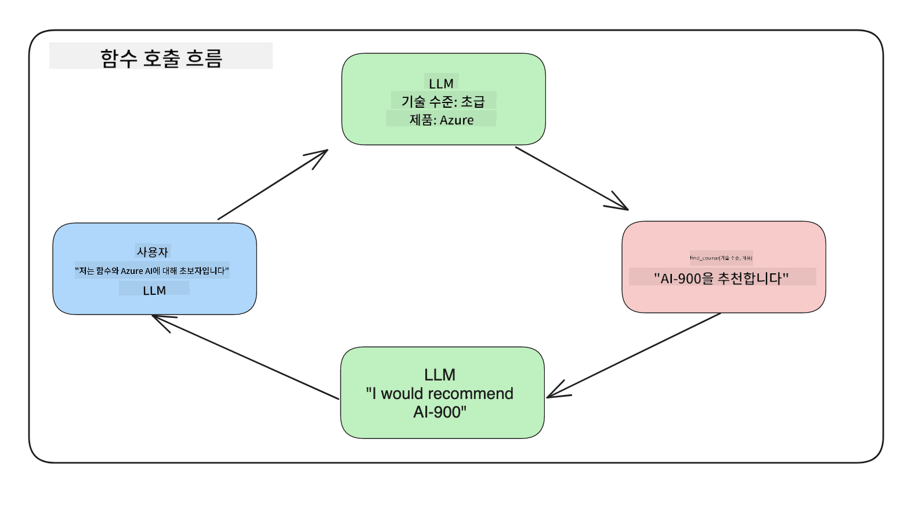
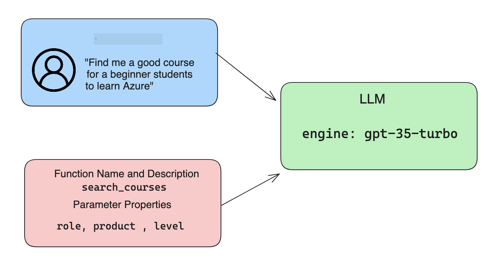

<!--
CO_OP_TRANSLATOR_METADATA:
{
  "original_hash": "f6f84f9ef2d066cd25850cab93580a50",
  "translation_date": "2025-10-18T00:00:32+00:00",
  "source_file": "11-integrating-with-function-calling/README.md",
  "language_code": "ko"
}
-->
# 함수 호출과 통합하기

[](https://youtu.be/DgUdCLX8qYQ?si=f1ouQU5HQx6F8Gl2)

이전 레슨에서 이미 많은 것을 배웠습니다. 하지만 더 개선할 수 있는 부분이 있습니다. 우리가 해결할 수 있는 몇 가지 문제는 응답을 더 일관된 형식으로 만들어 후속 작업에서 쉽게 처리할 수 있도록 하는 방법과, 다른 소스의 데이터를 추가하여 애플리케이션을 더욱 풍부하게 만드는 방법입니다.

이 장에서는 위에서 언급한 문제를 해결하는 방법을 다룹니다.

## 소개

이 레슨에서는 다음을 다룹니다:

- 함수 호출이 무엇인지와 그 사용 사례를 설명합니다.
- Azure OpenAI를 사용하여 함수 호출을 생성합니다.
- 애플리케이션에 함수 호출을 통합하는 방법을 설명합니다.

## 학습 목표

이 레슨이 끝날 때까지 다음을 할 수 있습니다:

- 함수 호출을 사용하는 목적을 설명합니다.
- Azure OpenAI 서비스를 사용하여 함수 호출을 설정합니다.
- 애플리케이션의 사용 사례에 맞는 효과적인 함수 호출을 설계합니다.

## 시나리오: 챗봇을 함수로 개선하기

이번 레슨에서는 교육 스타트업을 위한 기능을 구축하려고 합니다. 사용자가 챗봇을 사용하여 기술 과정을 찾을 수 있도록 하는 기능입니다. 우리는 사용자의 기술 수준, 현재 역할, 관심 있는 기술에 맞는 과정을 추천할 것입니다.

이 시나리오를 완료하기 위해 다음을 조합하여 사용합니다:

- `Azure OpenAI`를 사용하여 사용자에게 채팅 경험을 제공합니다.
- `Microsoft Learn Catalog API`를 사용하여 사용자의 요청에 따라 과정을 찾을 수 있도록 돕습니다.
- `Function Calling`을 사용하여 사용자의 쿼리를 함수로 보내 API 요청을 수행합니다.

먼저, 우리가 왜 함수 호출을 사용해야 하는지 살펴보겠습니다:

## 함수 호출의 필요성

함수 호출 이전에는 LLM의 응답이 비구조적이고 일관성이 없었습니다. 개발자는 각 응답의 변형을 처리할 수 있도록 복잡한 검증 코드를 작성해야 했습니다. 사용자는 "스톡홀름의 현재 날씨는 무엇인가요?"와 같은 질문에 답을 받을 수 없었습니다. 이는 모델이 학습된 데이터의 시간에 제한되었기 때문입니다.

함수 호출은 Azure OpenAI 서비스의 기능으로 다음과 같은 제한을 극복할 수 있습니다:

- **일관된 응답 형식**. 응답 형식을 더 잘 제어할 수 있다면 응답을 다른 시스템에 통합하기가 더 쉬워집니다.
- **외부 데이터**. 애플리케이션의 다른 소스 데이터를 채팅 컨텍스트에서 사용할 수 있는 기능.

## 시나리오를 통한 문제 설명

> 아래 시나리오를 실행하려면 [포함된 노트북](./python/aoai-assignment.ipynb?WT.mc_id=academic-105485-koreyst)을 사용하는 것을 권장합니다. 또는 단순히 읽으면서 함수가 문제를 해결하는 데 어떻게 도움이 되는지 설명하는 예제를 확인할 수 있습니다.

응답 형식 문제를 설명하는 예제를 살펴보겠습니다:

학생 데이터를 데이터베이스에 저장하여 적합한 과정을 추천하고 싶다고 가정해봅시다. 아래에는 매우 유사한 데이터를 포함한 두 학생 설명이 있습니다.

1. Azure OpenAI 리소스에 연결을 생성합니다:

   ```python
   import os
   import json
   from openai import AzureOpenAI
   from dotenv import load_dotenv
   load_dotenv()

   client = AzureOpenAI(
   api_key=os.environ['AZURE_OPENAI_API_KEY'],  # this is also the default, it can be omitted
   api_version = "2023-07-01-preview"
   )

   deployment=os.environ['AZURE_OPENAI_DEPLOYMENT']
   ```

   아래는 `api_type`, `api_base`, `api_version`, `api_key`를 설정하여 Azure OpenAI와 연결을 구성하는 Python 코드입니다.

1. `student_1_description` 및 `student_2_description` 변수를 사용하여 두 학생 설명을 생성합니다.

   ```python
   student_1_description="Emily Johnson is a sophomore majoring in computer science at Duke University. She has a 3.7 GPA. Emily is an active member of the university's Chess Club and Debate Team. She hopes to pursue a career in software engineering after graduating."

   student_2_description = "Michael Lee is a sophomore majoring in computer science at Stanford University. He has a 3.8 GPA. Michael is known for his programming skills and is an active member of the university's Robotics Club. He hopes to pursue a career in artificial intelligence after finishing his studies."
   ```

   위 학생 설명을 LLM에 보내 데이터를 분석하려고 합니다. 이 데이터는 애플리케이션에서 사용되거나 API로 전송되거나 데이터베이스에 저장될 수 있습니다.

1. LLM에 우리가 관심 있는 정보를 추출하고 JSON 형식으로 응답을 반환하도록 지시하는 두 개의 동일한 프롬프트를 생성합니다:

   ```python
   prompt1 = f'''
   Please extract the following information from the given text and return it as a JSON object:

   name
   major
   school
   grades
   club

   This is the body of text to extract the information from:
   {student_1_description}
   '''

   prompt2 = f'''
   Please extract the following information from the given text and return it as a JSON object:

   name
   major
   school
   grades
   club

   This is the body of text to extract the information from:
   {student_2_description}
   '''
   ```

   위 프롬프트는 LLM에게 정보를 추출하고 JSON 형식으로 응답을 반환하도록 지시합니다.

1. 프롬프트와 Azure OpenAI 연결을 설정한 후, `openai.ChatCompletion`을 사용하여 프롬프트를 LLM에 보냅니다. 프롬프트는 `messages` 변수에 저장되고 역할은 `user`로 지정됩니다. 이는 사용자가 챗봇에 메시지를 작성하는 것을 모방합니다.

   ```python
   # response from prompt one
   openai_response1 = client.chat.completions.create(
   model=deployment,
   messages = [{'role': 'user', 'content': prompt1}]
   )
   openai_response1.choices[0].message.content

   # response from prompt two
   openai_response2 = client.chat.completions.create(
   model=deployment,
   messages = [{'role': 'user', 'content': prompt2}]
   )
   openai_response2.choices[0].message.content
   ```

이제 두 요청을 LLM에 보내고 `openai_response1['choices'][0]['message']['content']`를 통해 받은 응답을 확인할 수 있습니다.

1. 마지막으로, `json.loads`를 호출하여 응답을 JSON 형식으로 변환할 수 있습니다:

   ```python
   # Loading the response as a JSON object
   json_response1 = json.loads(openai_response1.choices[0].message.content)
   json_response1
   ```

   응답 1:

   ```json
   {
     "name": "Emily Johnson",
     "major": "computer science",
     "school": "Duke University",
     "grades": "3.7",
     "club": "Chess Club"
   }
   ```

   응답 2:

   ```json
   {
     "name": "Michael Lee",
     "major": "computer science",
     "school": "Stanford University",
     "grades": "3.8 GPA",
     "club": "Robotics Club"
   }
   ```

   프롬프트가 동일하고 설명이 유사함에도 불구하고, `Grades` 속성의 값이 다르게 형식화된 것을 볼 수 있습니다. 예를 들어, `3.7` 또는 `3.7 GPA` 형식으로 나타날 수 있습니다.

   이 결과는 LLM이 작성된 프롬프트 형태의 비구조적 데이터를 받아 비구조적 데이터로 반환하기 때문입니다. 우리는 이 데이터를 저장하거나 사용할 때 무엇을 기대해야 하는지 알 수 있도록 구조화된 형식이 필요합니다.

그렇다면 형식 문제를 어떻게 해결할 수 있을까요? 함수 호출을 사용하면 구조화된 데이터를 받을 수 있습니다. 함수 호출을 사용할 때 LLM이 실제로 함수 호출을 실행하거나 실행하지는 않습니다. 대신, 우리는 LLM이 응답을 따를 구조를 만듭니다. 그런 다음 이러한 구조화된 응답을 사용하여 애플리케이션에서 실행할 함수를 결정합니다.



그런 다음 함수에서 반환된 데이터를 가져와 LLM에 다시 보냅니다. LLM은 자연어를 사용하여 사용자의 질문에 답변합니다.

## 함수 호출 사용 사례

함수 호출이 애플리케이션을 개선할 수 있는 다양한 사용 사례가 있습니다:

- **외부 도구 호출**. 챗봇은 사용자 질문에 대한 답변을 제공하는 데 매우 유용합니다. 함수 호출을 사용하면 챗봇이 사용자의 메시지를 사용하여 특정 작업을 완료할 수 있습니다. 예를 들어, 학생이 챗봇에게 "이 과목에 대해 더 많은 도움을 요청하는 이메일을 내 강사에게 보내주세요"라고 요청할 수 있습니다. 이는 `send_email(to: string, body: string)`이라는 함수 호출을 생성할 수 있습니다.

- **API 또는 데이터베이스 쿼리 생성**. 사용자는 자연어를 사용하여 정보를 찾고 이를 형식화된 쿼리 또는 API 요청으로 변환할 수 있습니다. 예를 들어, 교사가 "마지막 과제를 완료한 학생은 누구인가요?"라고 요청하면 `get_completed(student_name: string, assignment: int, current_status: string)`이라는 함수를 호출할 수 있습니다.

- **구조화된 데이터 생성**. 사용자는 텍스트 블록 또는 CSV를 가져와 LLM을 사용하여 중요한 정보를 추출할 수 있습니다. 예를 들어, 학생이 평화 협정에 대한 위키피디아 기사를 AI 플래시카드로 변환할 수 있습니다. 이는 `get_important_facts(agreement_name: string, date_signed: string, parties_involved: list)`라는 함수를 사용하여 수행할 수 있습니다.

## 첫 번째 함수 호출 생성하기

함수 호출을 생성하는 과정은 3단계로 이루어져 있습니다:

1. 사용자 메시지와 함수 목록을 사용하여 Chat Completions API를 호출합니다.
2. 모델의 응답을 읽어 작업을 수행합니다. 즉, 함수나 API 호출을 실행합니다.
3. 함수에서 받은 응답을 사용하여 사용자에게 응답을 생성하기 위해 Chat Completions API를 다시 호출합니다.



### 1단계 - 메시지 생성

첫 번째 단계는 사용자 메시지를 생성하는 것입니다. 이는 텍스트 입력 값에서 동적으로 할당하거나 여기에서 값을 직접 할당할 수 있습니다. Chat Completions API를 처음 사용하는 경우, 메시지의 `role`과 `content`를 정의해야 합니다.

`role`은 `system`(규칙 생성), `assistant`(모델) 또는 `user`(최종 사용자)일 수 있습니다. 함수 호출의 경우 이를 `user`로 지정하고 예제 질문을 추가합니다.

```python
messages= [ {"role": "user", "content": "Find me a good course for a beginner student to learn Azure."} ]
```

다양한 역할을 할당함으로써 LLM이 시스템이 말하는 것인지 사용자인지 명확히 알 수 있으며, 이를 통해 LLM이 대화 기록을 기반으로 구축할 수 있습니다.

### 2단계 - 함수 생성

다음으로, 함수와 해당 함수의 매개변수를 정의합니다. 여기서는 `search_courses`라는 하나의 함수만 사용하지만 여러 개의 함수를 생성할 수 있습니다.

> **중요**: 함수는 LLM에 대한 시스템 메시지에 포함되며 사용 가능한 토큰 수에 포함됩니다.

아래에서는 각 항목이 함수인 배열로 함수를 생성합니다. 각 항목은 `name`, `description`, `parameters` 속성을 가진 함수입니다:

```python
functions = [
   {
      "name":"search_courses",
      "description":"Retrieves courses from the search index based on the parameters provided",
      "parameters":{
         "type":"object",
         "properties":{
            "role":{
               "type":"string",
               "description":"The role of the learner (i.e. developer, data scientist, student, etc.)"
            },
            "product":{
               "type":"string",
               "description":"The product that the lesson is covering (i.e. Azure, Power BI, etc.)"
            },
            "level":{
               "type":"string",
               "description":"The level of experience the learner has prior to taking the course (i.e. beginner, intermediate, advanced)"
            }
         },
         "required":[
            "role"
         ]
      }
   }
]
```

각 함수 인스턴스를 더 자세히 설명하겠습니다:

- `name` - 호출하려는 함수의 이름입니다.
- `description` - 함수가 작동하는 방법에 대한 설명입니다. 여기서는 구체적이고 명확해야 합니다.
- `parameters` - 모델이 응답을 생성할 때 사용할 값과 형식의 목록입니다. `parameters` 배열은 항목으로 구성되며, 각 항목은 다음 속성을 가집니다:
  1.  `type` - 속성이 저장될 데이터 유형.
  1.  `properties` - 모델이 응답에 사용할 특정 값 목록.
      1. `name` - 모델이 형식화된 응답에서 사용할 속성의 이름, 예를 들어 `product`.
      1. `type` - 이 속성의 데이터 유형, 예를 들어 `string`.
      1. `description` - 특정 속성에 대한 설명.

선택적 속성으로 `required`가 있습니다. 이는 함수 호출이 완료되기 위해 필요한 속성입니다.

### 3단계 - 함수 호출하기

함수를 정의한 후, 이제 Chat Completion API 호출에 포함해야 합니다. 이를 위해 요청에 `functions`를 추가합니다. 이 경우 `functions=functions`로 설정합니다.

또한 `function_call`을 `auto`로 설정할 수 있습니다. 이는 사용자 메시지에 따라 LLM이 호출할 함수를 스스로 결정하도록 합니다.

아래 코드는 `ChatCompletion.create`를 호출하는 코드입니다. 여기서 `functions=functions`와 `function_call="auto"`를 설정하여 LLM이 제공된 함수를 호출할 시점을 결정하도록 합니다:

```python
response = client.chat.completions.create(model=deployment,
                                        messages=messages,
                                        functions=functions,
                                        function_call="auto")

print(response.choices[0].message)
```

이제 반환된 응답은 다음과 같습니다:

```json
{
  "role": "assistant",
  "function_call": {
    "name": "search_courses",
    "arguments": "{\n  \"role\": \"student\",\n  \"product\": \"Azure\",\n  \"level\": \"beginner\"\n}"
  }
}
```

여기서 `search_courses` 함수가 호출되었으며, JSON 응답의 `arguments` 속성에 나열된 인수와 함께 호출된 것을 확인할 수 있습니다.

LLM은 `messages` 매개변수에 제공된 값에서 데이터를 추출하여 함수의 인수에 맞는 데이터를 찾을 수 있었습니다. 아래는 `messages` 값의 요약입니다:

```python
messages= [ {"role": "user", "content": "Find me a good course for a beginner student to learn Azure."} ]
```

보시다시피, `student`, `Azure`, `beginner`가 `messages`에서 추출되어 함수의 입력으로 설정되었습니다. 이러한 방식으로 함수를 사용하는 것은 프롬프트에서 정보를 추출하고 LLM에 구조를 제공하며 재사용 가능한 기능을 갖추는 훌륭한 방법입니다.

다음으로, 이를 애플리케이션에서 사용하는 방법을 살펴보겠습니다.

## 애플리케이션에 함수 호출 통합하기

LLM의 형식화된 응답을 테스트한 후, 이제 이를 애플리케이션에 통합할 수 있습니다.

### 흐름 관리

이를 애플리케이션에 통합하려면 다음 단계를 따르세요:

1. 먼저 OpenAI 서비스에 호출을 수행하고 메시지를 `response_message`라는 변수에 저장합니다.

   ```python
   response_message = response.choices[0].message
   ```

1. 이제 Microsoft Learn API를 호출하여 과정 목록을 가져오는 함수를 정의합니다:

   ```python
   import requests

   def search_courses(role, product, level):
     url = "https://learn.microsoft.com/api/catalog/"
     params = {
        "role": role,
        "product": product,
        "level": level
     }
     response = requests.get(url, params=params)
     modules = response.json()["modules"]
     results = []
     for module in modules[:5]:
        title = module["title"]
        url = module["url"]
        results.append({"title": title, "url": url})
     return str(results)
   ```

   이제 `functions` 변수에 도입된 함수 이름과 매핑되는 실제 Python 함수를 생성합니다. 또한 필요한 데이터를 가져오기 위해 실제 외부 API 호출을 수행합니다. 이 경우 Microsoft Learn API를 사용하여 교육 모듈을 검색합니다.

좋습니다, 이제 `functions` 변수와 해당 Python 함수를 생성했으니, 두 가지를 어떻게 매핑하여 Python 함수가 호출되도록 할 수 있을까요?

1. Python 함수를 호출해야 하는지 확인하려면 LLM 응답에서 `function_call`이 포함되어 있는지 확인하고 지정된 함수를 호출해야 합니다. 아래는 이를 확인하는 방법입니다:

   ```python
   # Check if the model wants to call a function
   if response_message.function_call.name:
    print("Recommended Function call:")
    print(response_message.function_call.name)
    print()

    # Call the function.
    function_name = response_message.function_call.name

    available_functions = {
            "search_courses": search_courses,
    }
    function_to_call = available_functions[function_name]

    function_args = json.loads(response_message.function_call.arguments)
    function_response = function_to_call(**function_args)

    print("Output of function call:")
    print(function_response)
    print(type(function_response))


    # Add the assistant response and function response to the messages
    messages.append( # adding assistant response to messages
        {
            "role": response_message.role,
            "function_call": {
                "name": function_name,
                "arguments": response_message.function_call.arguments,
            },
            "content": None
        }
    )
    messages.append( # adding function response to messages
        {
            "role": "function",
            "name": function_name,
            "content":function_response,
        }
    )
   ```

   아래 세 줄은 함수 이름과 인수를 추출하고 호출을 수행합니다:

   ```python
   function_to_call = available_functions[function_name]

   function_args = json.loads(response_message.function_call.arguments)
   function_response = function_to_call(**function_args)
   ```

   아래는 코드 실행 결과 출력입니다:

   **출력**

   ```Recommended Function call:
   {
     "name": "search_courses",
     "arguments": "{\n  \"role\": \"student\",\n  \"product\": \"Azure\",\n  \"level\": \"beginner\"\n}"
   }

   Output of function call:
   [{'title': 'Describe concepts of cryptography', 'url': 'https://learn.microsoft.com/training/modules/describe-concepts-of-cryptography/?
   WT.mc_id=api_CatalogApi'}, {'title': 'Introduction to audio classification with TensorFlow', 'url': 'https://learn.microsoft.com/en-
   us/training/modules/intro-audio-classification-tensorflow/?WT.mc_id=api_CatalogApi'}, {'title': 'Design a Performant Data Model in Azure SQL
   Database with Azure Data Studio', 'url': 'https://learn.microsoft.com/training/modules/design-a-data-model-with-ads/?
   WT.mc_id=api_CatalogApi'}, {'title': 'Getting started with the Microsoft Cloud Adoption Framework for Azure', 'url':
   'https://learn.microsoft.com/training/modules/cloud-adoption-framework-getting-started/?WT.mc_id=api_CatalogApi'}, {'title': 'Set up the
   Rust development environment', 'url': 'https://learn.microsoft.com/training/modules/rust-set-up-environment/?WT.mc_id=api_CatalogApi'}]
   <class 'str'>
   ```

1. 이제 업데이트된 메시지 `messages`를 LLM에 보내 API JSON 형식 응답 대신 자연어 응답을 받을 수 있습니다.

   ```python
   print("Messages in next request:")
   print(messages)
   print()

   second_response = client.chat.completions.create(
      messages=messages,
      model=deployment,
      function_call="auto",
      functions=functions,
      temperature=0
         )  # get a new response from GPT where it can see the function response


   print(second_response.choices[0].message)
   ```

   **출력**

   ```python
   {
     "role": "assistant",
     "content": "I found some good courses for beginner students to learn Azure:\n\n1. [Describe concepts of cryptography] (https://learn.microsoft.com/training/modules/describe-concepts-of-cryptography/?WT.mc_id=api_CatalogApi)\n2. [Introduction to audio classification with TensorFlow](https://learn.microsoft.com/training/modules/intro-audio-classification-tensorflow/?WT.mc_id=api_CatalogApi)\n3. [Design a Performant Data Model in Azure SQL Database with Azure Data Studio](https://learn.microsoft.com/training/modules/design-a-data-model-with-ads/?WT.mc_id=api_CatalogApi)\n4. [Getting started with the Microsoft Cloud Adoption Framework for Azure](https://learn.microsoft.com/training/modules/cloud-adoption-framework-getting-started/?WT.mc_id=api_CatalogApi)\n5. [Set up the Rust development environment](https://learn.microsoft.com/training/modules/rust-set-up-environment/?WT.mc_id=api_CatalogApi)\n\nYou can click on the links to access the courses."
   }

   ```

## 과제

Azure OpenAI 함수 호출 학습을 계속하려면 다음을 수행할 수 있습니다:

- 학습자가 더 많은 과정을 찾는 데 도움이 될 수 있는 함수의 매개변수를 추가하세요.
- 학습자의 모국어와 같은 추가 정보를 수집하는 또 다른 함수 호출을 생성하세요.
- 함수 호출 및/또는 API 호출이 적합한 강좌를 반환하지 않을 경우 오류 처리를 생성하세요.

힌트: 이 데이터가 어떻게 그리고 어디에서 사용 가능한지 확인하려면 [Learn API 참조 문서](https://learn.microsoft.com/training/support/catalog-api-developer-reference?WT.mc_id=academic-105485-koreyst) 페이지를 참조하세요.

## 훌륭한 작업! 여정을 계속하세요

이 강의를 완료한 후, [Generative AI 학습 컬렉션](https://aka.ms/genai-collection?WT.mc_id=academic-105485-koreyst)을 확인하여 Generative AI 지식을 계속 향상시키세요!

Lesson 12로 이동하여 [AI 애플리케이션을 위한 UX 디자인](../12-designing-ux-for-ai-applications/README.md?WT.mc_id=academic-105485-koreyst)을 살펴보세요!

---

**면책 조항**:  
이 문서는 AI 번역 서비스 [Co-op Translator](https://github.com/Azure/co-op-translator)를 사용하여 번역되었습니다. 정확성을 위해 최선을 다하지만, 자동 번역에는 오류나 부정확성이 포함될 수 있습니다. 원본 문서를 해당 언어로 작성된 상태에서 권위 있는 자료로 간주해야 합니다. 중요한 정보의 경우, 전문적인 인간 번역을 권장합니다. 이 번역 사용으로 인해 발생하는 오해나 잘못된 해석에 대해 책임지지 않습니다.