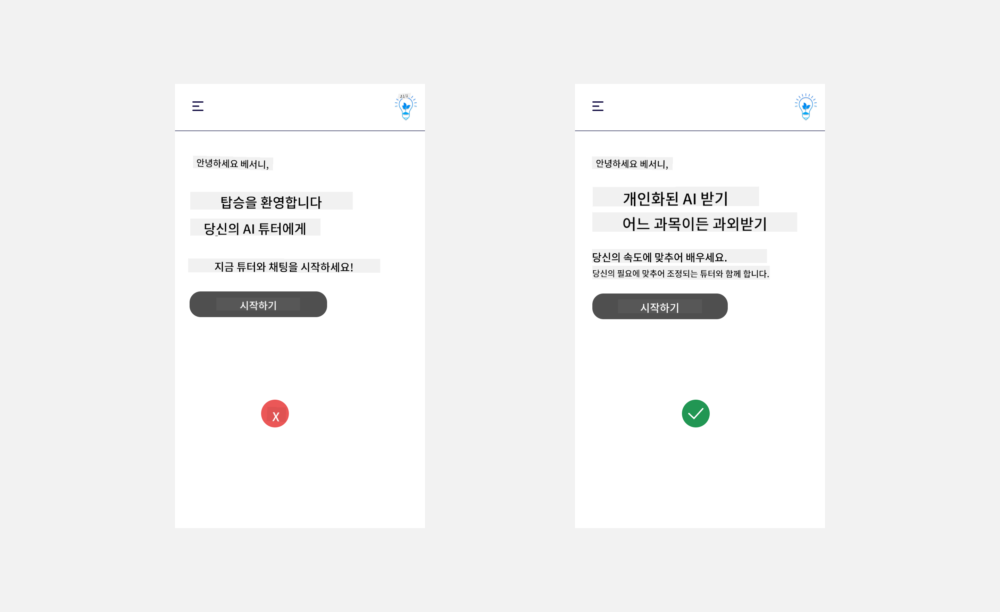
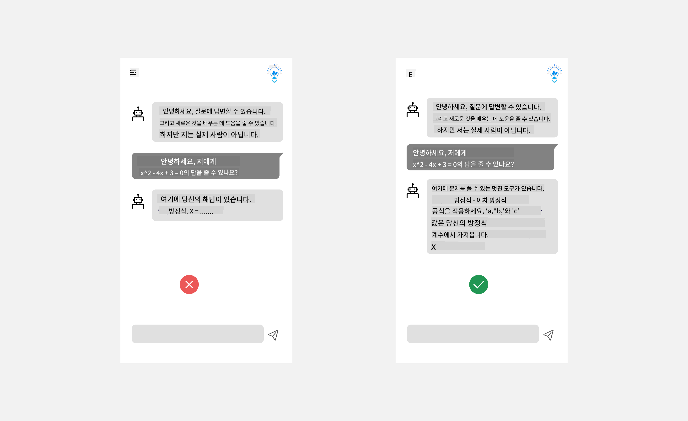
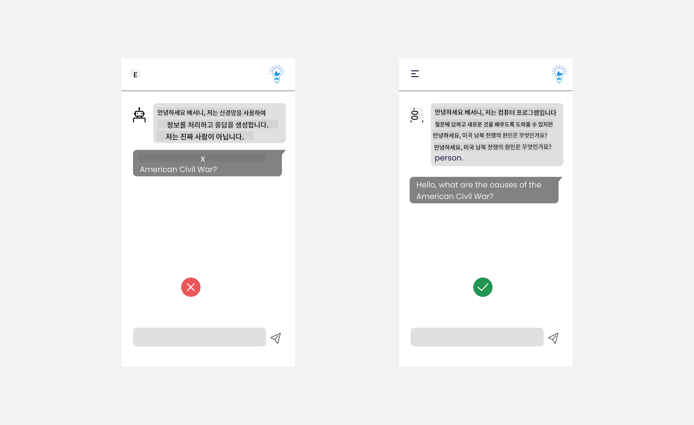
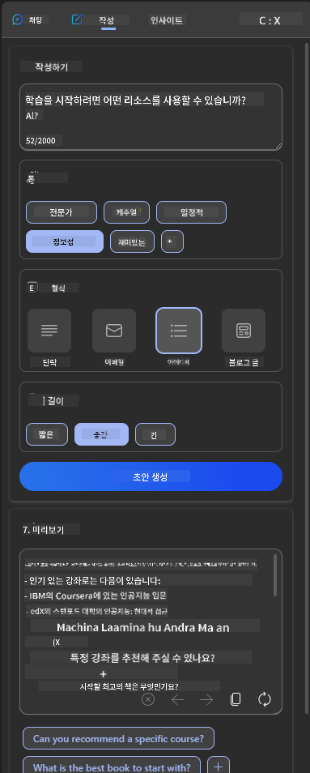
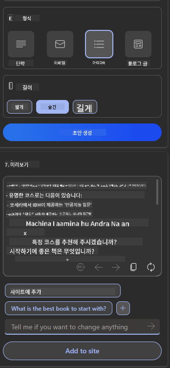

<!--
CO_OP_TRANSLATOR_METADATA:
{
  "original_hash": "ec385b41ee50579025d50cc03bfb3a25",
  "translation_date": "2025-05-19T21:47:45+00:00",
  "source_file": "12-designing-ux-for-ai-applications/README.md",
  "language_code": "ko"
}
-->
# AI 애플리케이션을 위한 UX 설계

> _(위 이미지를 클릭하면 이 강의의 비디오를 볼 수 있습니다)_

사용자 경험은 앱을 개발하는 데 있어 매우 중요한 측면입니다. 사용자는 작업을 수행하기 위해 효율적으로 앱을 사용할 수 있어야 합니다. 효율적인 것이 중요하지만, 또한 모든 사람이 사용할 수 있도록 _접근 가능_하게 앱을 설계해야 합니다. 이 장에서는 이러한 영역에 초점을 맞추어 사람들이 사용할 수 있고 사용하고 싶어하는 앱을 설계하는 데 도움을 줄 것입니다.

## 소개

사용자 경험은 사용자가 특정 제품이나 서비스를 시스템, 도구 또는 디자인을 통해 상호 작용하고 사용하는 방식입니다. AI 애플리케이션을 개발할 때 개발자는 사용자 경험이 효과적일 뿐만 아니라 윤리적임을 보장하는 데 집중합니다. 이 강의에서는 사용자 요구를 해결하는 인공지능(AI) 애플리케이션을 구축하는 방법을 다룹니다.

이 강의에서는 다음 영역을 다룰 것입니다:

- 사용자 경험 소개 및 사용자 요구 이해
- 신뢰와 투명성을 위한 AI 애플리케이션 설계
- 협업과 피드백을 위한 AI 애플리케이션 설계

## 학습 목표

이 강의를 수강한 후, 다음을 수행할 수 있습니다:

- 사용자 요구를 충족하는 AI 애플리케이션을 구축하는 방법 이해
- 신뢰와 협업을 촉진하는 AI 애플리케이션 설계

### 사전 요구 사항

[사용자 경험 및 디자인 사고](https://learn.microsoft.com/training/modules/ux-design?WT.mc_id=academic-105485-koreyst)에 대해 더 읽어보세요.

## 사용자 경험 소개 및 사용자 요구 이해

우리의 가상의 교육 스타트업에서는 두 가지 주요 사용자, 즉 교사와 학생이 있습니다. 각 사용자는 고유한 요구를 가지고 있습니다. 사용자 중심 디자인은 사용자를 우선시하여 제품이 의도된 사용자에게 적합하고 유익하도록 합니다.

애플리케이션은 좋은 사용자 경험을 제공하기 위해 **유용성, 신뢰성, 접근성 및 즐거움**을 가져야 합니다.

### 유용성

유용하다는 것은 애플리케이션이 의도된 목적에 맞는 기능을 가지고 있음을 의미합니다. 예를 들어, 자동 채점 프로세스나 복습을 위한 플래시카드 생성과 같은 기능입니다. 자동 채점 프로세스를 수행하는 애플리케이션은 사전 정의된 기준에 따라 학생의 작업에 점수를 정확하고 효율적으로 부여할 수 있어야 합니다. 마찬가지로, 복습 플래시카드를 생성하는 애플리케이션은 데이터에 기반하여 관련성과 다양성을 갖춘 질문을 생성할 수 있어야 합니다.

### 신뢰성

신뢰성 있다는 것은 애플리케이션이 일관되고 오류 없이 작업을 수행할 수 있음을 의미합니다. 그러나 AI는 인간처럼 완벽하지 않으며 오류에 취약할 수 있습니다. 애플리케이션은 오류나 예상치 못한 상황에 직면할 수 있으며, 이는 인간의 개입이나 수정이 필요할 수 있습니다. 오류를 어떻게 처리합니까? 이 강의의 마지막 섹션에서는 협업과 피드백을 위한 AI 시스템 및 애플리케이션 설계 방법을 다룰 것입니다.

### 접근성

접근성 있다는 것은 다양한 능력을 가진 사용자, 특히 장애를 가진 사용자를 포함하여 모든 사용자에게 사용자 경험을 확장하는 것을 의미합니다. 접근성 지침과 원칙을 따름으로써 AI 솔루션은 더욱 포괄적이고 사용 가능하며 모든 사용자에게 유익해집니다.

### 즐거움

즐거움 있다는 것은 애플리케이션을 사용하는 것이 즐겁다는 것을 의미합니다. 매력적인 사용자 경험은 사용자가 애플리케이션을 다시 찾도록 격려하고 비즈니스 수익을 증가시킬 수 있습니다.

모든 문제를 AI로 해결할 수 있는 것은 아닙니다. AI는 수동 작업을 자동화하거나 사용자 경험을 개인화하는 방식으로 사용자 경험을 향상시킵니다.

## 신뢰와 투명성을 위한 AI 애플리케이션 설계

신뢰 구축은 AI 애플리케이션을 설계할 때 매우 중요합니다. 신뢰는 사용자가 애플리케이션이 작업을 완료하고 일관되게 결과를 제공하며 사용자가 필요로 하는 결과를 제공할 것이라고 확신하는 것을 의미합니다. 이 영역에서의 위험은 불신과 과신입니다. 불신은 사용자가 AI 시스템에 거의 또는 전혀 신뢰하지 않는 경우 발생하며, 이는 사용자가 애플리케이션을 거부하게 만듭니다. 과신은 사용자가 AI 시스템의 능력을 과대평가하여 AI 시스템을 지나치게 신뢰하게 되는 경우 발생합니다. 예를 들어, 자동 채점 시스템에서 과신이 발생하면 교사가 일부 논문을 검토하지 않고 채점 시스템이 잘 작동하는지 확인하지 않을 수 있습니다. 이는 학생에게 불공정하거나 부정확한 성적을 줄 수 있으며, 피드백 및 개선의 기회를 놓칠 수 있습니다.

신뢰를 디자인의 중심에 두는 두 가지 방법은 설명 가능성과 제어입니다.

### 설명 가능성

AI가 미래 세대에게 지식을 전달하는 결정을 돕는 경우, 교사와 부모가 AI 결정이 어떻게 이루어지는지를 이해하는 것이 중요합니다. 이것이 설명 가능성입니다 - AI 애플리케이션이 결정을 내리는 방식을 이해하는 것입니다. 설명 가능성을 위한 설계는 AI 애플리케이션이 수행할 수 있는 예시를 추가하는 것을 포함합니다. 예를 들어, "AI 교사로 시작하기" 대신 시스템은 "AI를 사용하여 복습을 위한 노트를 요약하세요"라는 문구를 사용할 수 있습니다.

또 다른 예는 AI가 사용자 및 개인 데이터를 사용하는 방식입니다. 예를 들어, 학생이라는 페르소나를 가진 사용자는 자신의 페르소나에 따라 제한이 있을 수 있습니다. AI는 질문에 대한 답을 공개할 수는 없지만 사용자가 문제를 해결하는 방법을 생각하도록 안내할 수 있습니다.

설명 가능성의 마지막 핵심 부분은 설명의 단순화입니다. 학생과 교사는 AI 전문가가 아닐 수 있으므로 애플리케이션이 할 수 있는 것과 할 수 없는 것에 대한 설명은 단순하고 이해하기 쉬워야 합니다.

### 제어

생성 AI는 AI와 사용자 간의 협업을 만들어내며, 사용자가 다양한 결과를 위해 프롬프트를 수정할 수 있습니다. 또한, 출력이 생성된 후 사용자는 결과를 수정하여 제어감을 가질 수 있습니다. 예를 들어 Bing을 사용할 때, 사용자는 형식, 톤 및 길이에 따라 프롬프트를 조정할 수 있습니다. 또한, 출력에 변경을 추가하고 아래와 같이 출력을 수정할 수 있습니다:

Bing에서 사용자가 애플리케이션에 대한 제어권을 가질 수 있는 또 다른 기능은 AI가 사용하는 데이터에 대해 선택적으로 참여하거나 참여하지 않을 수 있는 기능입니다. 학교 애플리케이션에서는 학생이 자신의 노트뿐만 아니라 교사의 자원을 복습 자료로 사용하고 싶어할 수 있습니다.

> AI 애플리케이션을 설계할 때, 사용자가 과신하여 AI의 기능에 대한 비현실적인 기대를 설정하지 않도록 하는 것이 중요합니다. 이를 위한 한 가지 방법은 프롬프트와 결과 사이에 마찰을 만들어 사용자에게 이것이 AI이고 인간이 아니라는 것을 상기시키는 것입니다.

## 협업과 피드백을 위한 AI 애플리케이션 설계

앞서 언급했듯이 생성 AI는 사용자와 AI 간의 협업을 만들어냅니다. 대부분의 상호작용은 사용자가 프롬프트를 입력하고 AI가 출력을 생성하는 것입니다. 출력이 잘못되면 어떻게 해야 할까요? 애플리케이션이 오류를 어떻게 처리합니까? AI가 사용자에게 책임을 돌리거나 오류를 설명하는 데 시간을 할애합니까?

AI 애플리케이션은 피드백을 받고 제공할 수 있도록 구축되어야 합니다. 이는 AI 시스템이 개선될 뿐만 아니라 사용자와의 신뢰를 구축하는 데 도움이 됩니다. 피드백 루프는 설계에 포함되어야 하며, 예를 들어 출력에 대한 간단한 좋아요 또는 싫어요 버튼을 사용할 수 있습니다.

이를 처리하는 또 다른 방법은 시스템의 기능과 제한을 명확히 전달하는 것입니다. 사용자가 AI 기능을 넘어서는 것을 요청할 때, 이를 처리할 방법도 있어야 합니다. 아래와 같이 보여줍니다.

시스템 오류는 사용자가 AI의 범위를 벗어난 정보에 대한 도움이 필요하거나 애플리케이션이 사용자가 생성할 수 있는 질문/주제의 요약 수에 제한이 있는 경우에 흔히 발생합니다. 예를 들어, 제한된 주제에 대한 데이터로 훈련된 AI 애플리케이션은 지리학과 관련된 질문을 처리할 수 없습니다. 이를 완화하기 위해 AI 시스템은 다음과 같은 응답을 제공할 수 있습니다: "죄송합니다, 우리 제품은 다음 주제에 대한 데이터로 훈련되었습니다....., 당신이 요청한 질문에 답변할 수 없습니다."

AI 애플리케이션은 완벽하지 않으므로 실수를 할 가능성이 있습니다. 애플리케이션을 설계할 때 사용자의 피드백을 받을 수 있는 공간을 만들고 오류를 간단하고 쉽게 설명할 수 있는 방식으로 처리해야 합니다.

## 과제

지금까지 구축한 AI 앱을 고려하여 아래 단계를 앱에 구현해 보세요:

- **즐거움:** 앱을 더 즐겁게 만들 수 있는 방법을 고려해보세요. 모든 곳에 설명을 추가하고 있습니까? 사용자가 탐색하도록 격려하고 있습니까? 오류 메시지를 어떻게 작성하고 있습니까?

- **유용성:** 웹 앱을 구축하십시오. 앱이 마우스와 키보드 모두로 탐색할 수 있는지 확인하세요.

- **신뢰와 투명성:** AI와 그 출출물을 완전히 신뢰하지 말고, 결과를 확인하기 위해 인간을 과정에 추가하는 방법을 고려하세요. 또한 신뢰와 투명성을 달성하기 위한 다른 방법을 고려하고 구현하세요.

- **제어:** 사용자가 애플리케이션에 제공하는 데이터를 제어할 수 있도록 하세요. AI 애플리케이션에서 데이터 수집에 참여하거나 참여하지 않을 수 있는 방법을 구현하세요.

## 학습 계속하기!

이 강의를 완료한 후, 우리의 [생성 AI 학습 컬렉션](https://aka.ms/genai-collection?WT.mc_id=academic-105485-koreyst)을 확인하여 생성 AI 지식을 계속 향상시키세요!

13강으로 이동하여 [AI 애플리케이션 보안](../13-securing-ai-applications/README.md?WT.mc_id=academic-105485-koreyst)을 살펴보세요!

**면책 조항**:  
이 문서는 AI 번역 서비스 [Co-op Translator](https://github.com/Azure/co-op-translator)를 사용하여 번역되었습니다. 우리는 정확성을 위해 노력하지만 자동 번역에는 오류나 부정확성이 있을 수 있음을 유의하시기 바랍니다. 원본 문서는 해당 언어로 작성된 문서를 권위 있는 출처로 간주해야 합니다. 중요한 정보에 대해서는 전문적인 인간 번역을 권장합니다. 이 번역의 사용으로 인해 발생하는 오해나 잘못된 해석에 대해서는 책임을 지지 않습니다.