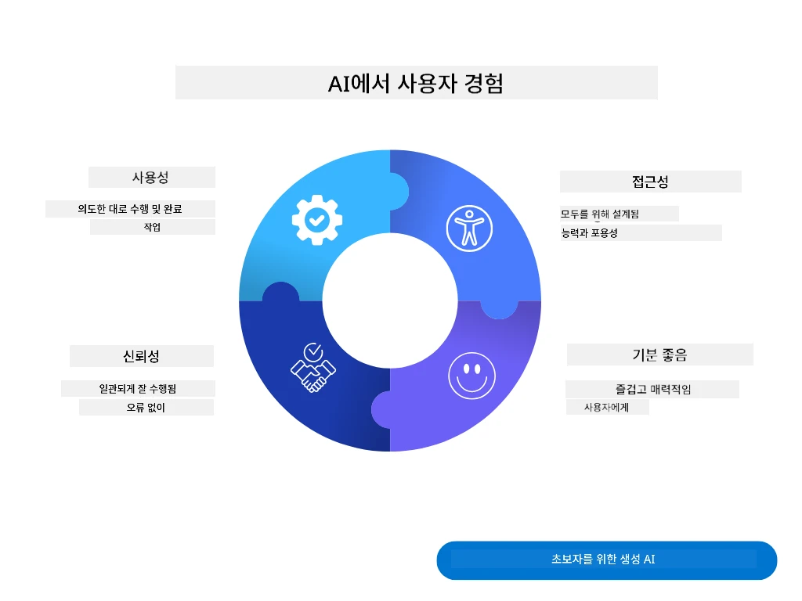
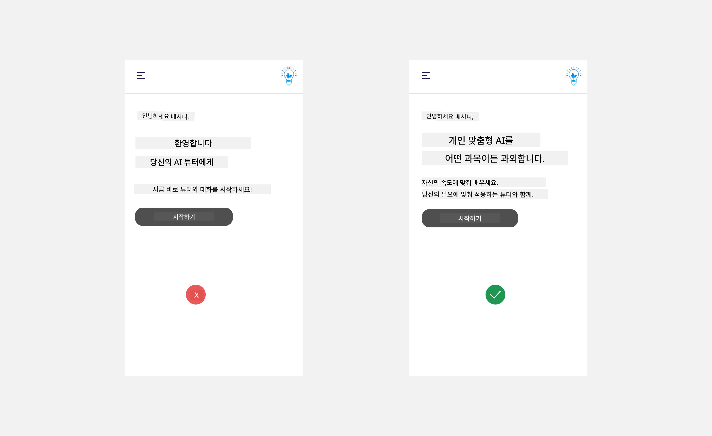
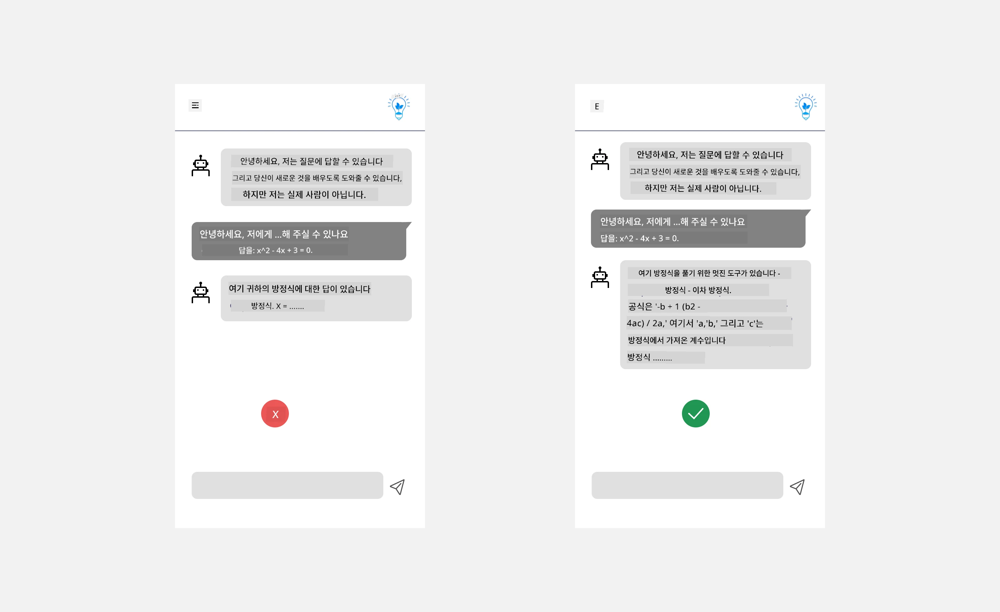
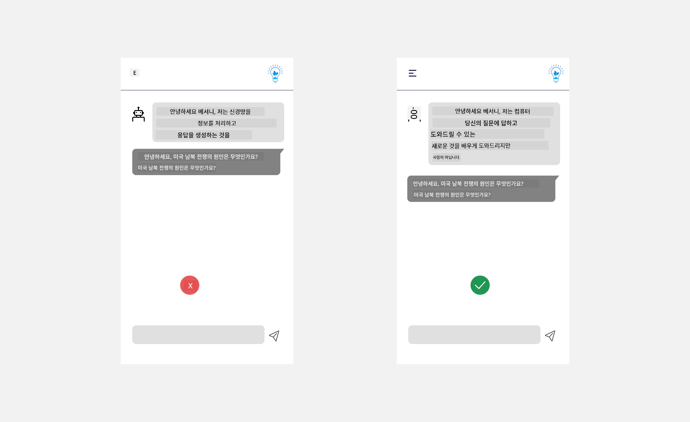
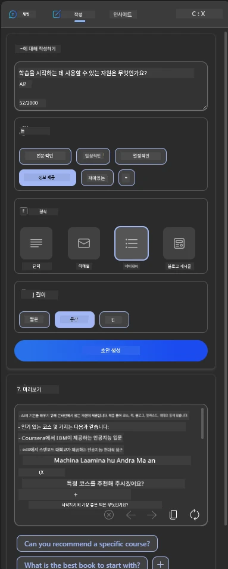
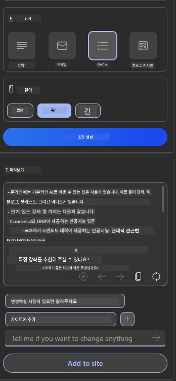
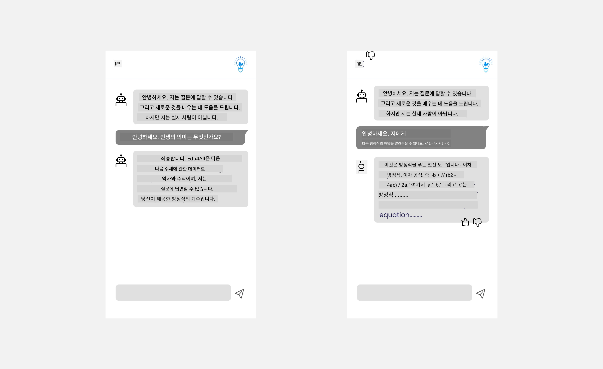

# AI 애플리케이션을 위한 UX 설계

> _(위 이미지를 클릭하면 이 수업의 비디오를 시청할 수 있습니다)_

사용자 경험은 앱을 구축할 때 매우 중요한 측면입니다. 사용자는 작업을 수행하기 위해 효율적으로 앱을 사용할 수 있어야 합니다. 효율적이라는 것은 한 가지이지만, 모든 사람이 사용할 수 있도록 앱을 설계하여 _접근성_을 보장해야 합니다. 이 장에서는 이 영역에 초점을 맞추어 사람들이 사용하고 싶어 하는 앱을 설계할 수 있기를 바랍니다.

## 소개

사용자 경험은 사용자가 시스템, 도구 또는 디자인인 특정 제품이나 서비스를 어떻게 상호작용하고 사용하는지를 의미합니다. AI 애플리케이션을 개발할 때 개발자는 사용자 경험이 효과적일 뿐만 아니라 윤리적이도록 보장하는 데 집중합니다. 이 수업에서는 사용자 요구를 충족하는 인공지능(AI) 애플리케이션 구축 방법을 다룹니다.

이 수업은 다음 주제를 다룹니다:

- 사용자 경험 소개 및 사용자 요구 이해
- 신뢰와 투명성을 위한 AI 애플리케이션 설계
- 협업과 피드백을 위한 AI 애플리케이션 설계

## 학습 목표

이 수업을 들은 후, 여러분은:

- 사용자 요구를 충족하는 AI 애플리케이션 구축 방법을 이해할 수 있습니다.
- 신뢰와 협업을 촉진하는 AI 애플리케이션을 설계할 수 있습니다.

### 사전 준비

시간을 내어 [사용자 경험 및 디자인 사고]에 대해 더 읽어보세요. (https://learn.microsoft.com/training/modules/ux-design?WT.mc_id=academic-105485-koreyst)

## 사용자 경험 소개 및 사용자 요구 이해

가상의 교육 스타트업에서는 두 가지 주요 사용자가 있습니다. 교사와 학생입니다. 두 사용자 각각 고유한 요구가 있습니다. 사용자 중심 설계는 사용자에게 우선순위를 두어 제품이 대상 사용자에게 적절하고 유익하도록 합니다.

애플리케이션은 **유용하고, 신뢰할 수 있으며, 접근 가능하고 쾌적해야** 좋은 사용자 경험을 제공합니다.

### 사용성

유용하다는 것은 애플리케이션이 의도한 목적에 맞는 기능을 갖추고 있다는 의미입니다. 예를 들어, 채점 과정을 자동화하거나 복습용 플래시카드를 생성하는 기능이 있습니다. 채점 자동화 애플리케이션은 미리 정의된 기준에 따라 학생의 작업에 정확하고 효율적으로 점수를 부여할 수 있어야 합니다. 비슷하게, 복습 플래시카드 생성 애플리케이션은 데이터를 기반으로 적절하고 다양한 질문을 생성할 수 있어야 합니다.

### 신뢰성

신뢰할 수 있다는 것은 애플리케이션이 일관되게 오류 없이 작업을 수행할 수 있음을 의미합니다. 그러나 AI는 인간과 마찬가지로 완벽하지 않아 오류가 발생할 수 있습니다. 애플리케이션은 오류나 예상치 못한 상황으로 인해 인간의 개입이나 수정이 필요할 수 있습니다. 오류를 어떻게 처리합니까? 이 수업 마지막 부분에서는 AI 시스템과 애플리케이션이 협업과 피드백을 위해 어떻게 설계되는지 다룹니다.

### 접근성

접근성은 장애가 있는 사용자 등 다양한 능력을 가진 사용자에게 사용자 경험을 확장하여 누구도 소외되지 않도록 하는 것을 의미합니다. 접근성 가이드라인과 원칙을 준수함으로써 AI 솔루션은 더 포용적이고 사용 가능하며 모든 사용자에게 유익해집니다.

### 쾌적함

쾌적하다는 것은 애플리케이션을 사용하는 것이 즐겁다는 뜻입니다. 매력적인 사용자 경험은 사용자의 긍정적인 반응을 유도하여 애플리케이션으로 다시 돌아오게 하고 비즈니스 수익을 증가시킬 수 있습니다.

모든 문제를 AI로 해결할 수는 없습니다. AI는 수작업 자동화나 개인화된 사용자 경험 제공 등 사용자 경험을 보완하는 역할을 합니다.

## 신뢰와 투명성을 위한 AI 애플리케이션 설계

AI 애플리케이션을 설계할 때 신뢰 구축은 매우 중요합니다. 신뢰는 사용자가 애플리케이션이 작업을 완수하고 일관된 결과를 제공하며 그 결과가 사용자 요구에 부합한다고 확신할 수 있도록 합니다. 이 영역의 위험 요소는 불신과 과신입니다. 불신은 사용자가 AI 시스템에 거의 또는 전혀 신뢰하지 않아 애플리케이션을 거부하게 되는 경우입니다. 과신은 사용자가 AI 시스템의 능력을 과대평가하여 AI를 너무 신뢰하는 경우입니다. 예를 들어, 자동 채점 시스템이 과신될 경우 교사는 시스템이 잘 작동하는지 확인하기 위해 일부 답안을 검토하지 않아 불공정하거나 부정확한 점수를 초래하거나 피드백과 개선 기회를 놓칠 수 있습니다.

신뢰를 설계의 중심에 두는 두 가지 방법은 설명 가능성과 제어입니다.

### 설명 가능성

AI가 미래 세대에 지식을 전하는 등의 의사결정을 도울 때, 교사와 부모가 AI 의사결정 방식을 이해하는 것이 중요합니다. 이것이 설명 가능성 - AI 애플리케이션이 어떻게 결론에 도달하는지 이해 - 입니다. 설명 가능성을 설계할 때는 AI가 결과를 산출하는 과정을 강조하는 세부사항을 추가합니다. 청중은 결과가 인간이 아니라 AI에 의해 생성된 것임을 인지해야 합니다. 예를 들어 "지금 튜터와 채팅 시작" 대신 "사용자의 필요에 맞춰 적응하며 자신의 속도로 학습을 돕는 AI 튜터를 사용하세요"라고 말하는 것입니다.

또 다른 예는 AI가 사용자 및 개인 데이터를 사용하는 방식입니다. 예를 들어, 학생 페르소나를 가진 사용자는 제한이 있을 수 있습니다. AI는 질문에 대한 답변을 직접 제공하지는 못하지만 사용자가 문제를 해결할 수 있도록 안내할 수 있습니다.

설명 가능성의 마지막 핵심 부분은 설명의 단순화입니다. 학생과 교사는 AI 전문가가 아닐 수 있으므로 애플리케이션이 할 수 있는 일과 할 수 없는 일에 대한 설명은 단순하고 이해하기 쉬워야 합니다.

### 제어

생성형 AI는 AI와 사용자 간의 협업을 생성합니다. 예를 들어 사용자가 다양한 결과를 위해 프롬프트를 수정할 수 있습니다. 또한, 출력이 생성된 후 사용자가 결과를 수정할 수 있어 제어감을 느낄 수 있어야 합니다. 예를 들어 Microsoft Copilot(이전 Bing Chat)을 사용할 때 사용자 프롬프트를 형식, 톤, 길이에 따라 맞춤화할 수 있습니다. 또한, 출력에 변경을 더하고 수정할 수 있습니다.

Microsoft Copilot의 또 다른 제어 기능은 사용자가 AI가 사용하는 데이터에 대해 옵트인 및 옵트아웃할 수 있는 기능입니다. 학교 애플리케이션의 경우, 학생이 자신의 노트와 교사의 자료를 복습 자료로 사용하는 것을 선택할 수 있습니다.

> AI 애플리케이션을 설계할 때, 사용자가 AI의 능력에 대해 비현실적 기대를 갖고 과신하지 않도록 의도성을 갖는 것이 중요합니다. 이를 위한 한 가지 방법은 프롬프트와 결과 사이에 마찰을 만드는 것입니다. 사용자가 이것이 AI이며 사람과 다른 것임을 상기시키는 것입니다.

## 협업과 피드백을 위한 AI 애플리케이션 설계

앞서 언급했듯이, 생성형 AI는 사용자와 AI 간의 협업을 만듭니다. 대부분의 상호작용은 사용자가 프롬프트를 입력하고 AI가 출력을 생성하는 것입니다. 그렇다면 출력이 틀렸다면 어떻게 할까요? 오류가 발생하면 애플리케이션은 어떻게 처리합니까? AI가 사용자를 탓합니까 아니면 오류를 설명하는 데 시간을 할애합니까?

AI 애플리케이션은 피드백을 받고 줄 수 있도록 구축되어야 합니다. 이는 AI 시스템 개선에 도움을 줄 뿐만 아니라 사용자와의 신뢰를 구축합니다. 설계에는 간단한 출력에 대한 좋아요 또는 싫어요 같은 피드백 루프가 포함되어야 합니다.

또 다른 방법은 시스템의 기능과 한계를 명확히 소통하는 것입니다. 사용자가 AI 기능을 벗어나는 요청을 할 때 이를 처리할 방법도 마련되어야 하며, 아래 예시와 같습니다.

시스템 오류는 사용자가 AI 범위를 벗어난 정보에 대한 지원이 필요하거나 애플리케이션이 생성할 수 있는 질문/주제 수에 제한이 있을 때 흔히 발생합니다. 예를 들어 AI 애플리케이션이 역사와 수학에 대해서만 훈련되었으면 지리 관련 질문을 처리하지 못할 수 있습니다. 이를 완화하기 위해 AI 시스템은 다음과 같은 응답을 할 수 있습니다: "죄송합니다, 저희 제품은 다음 과목 데이터로 훈련되었으며..., 질문하신 내용에는 답변할 수 없습니다."

AI 애플리케이션은 완벽하지 않으므로 실수를 할 수밖에 없습니다. 애플리케이션을 설계할 때 사용자의 피드백 공간과 간단하고 쉽게 설명 가능한 오류 처리 방식을 반드시 마련해야 합니다.

## 과제

지금까지 만든 AI 앱 중 하나를 선택하여 아래 단계를 앱에 적용해 보세요:

- **쾌적함:** 앱을 더 쾌적하게 만드는 방법을 고려하세요. 설명을 곳곳에 추가하고 있나요? 사용자가 탐색하도록 유도하고 있나요? 오류 메시지는 어떻게 작성하고 있나요?

- **사용성:** 웹 앱을 만든다면, 마우스와 키보드 모두로 앱이 탐색 가능하도록 하세요.

- **신뢰와 투명성:** AI와 그 결과를 완전히 신뢰하지 말고, 결과를 검증할 사람이 투입되는 방식을 고려하고 구현하세요. 신뢰와 투명성을 달성하는 다른 방법들도 고려하고 구현하세요.

- **제어:** 사용자가 애플리케이션에 제공하는 데이터에 대한 제어 권한을 부여하세요. AI 애플리케이션에서 데이터 수집에 대해 사용자가 옵트인하고 옵트아웃할 수 있는 방법을 구현하세요.

<!-- ## [수업 후 퀴즈](../../../12-designing-ux-for-ai-applications/quiz-url) -->

## 학습 계속하기!

이 수업을 마친 후에는 [Generative AI 학습 모음집](https://aka.ms/genai-collection?WT.mc_id=academic-105485-koreyst)을 확인하여 생성형 AI 지식을 계속 향상시키세요!

다음 13과로 이동하여 [AI 애플리케이션 보안 강화](../13-securing-ai-applications/README.md?WT.mc_id=academic-105485-koreyst)에 대해 살펴봅니다!

---

<!-- CO-OP TRANSLATOR DISCLAIMER START -->
**면책 조항**:
이 문서는 AI 번역 서비스 [Co-op Translator](https://github.com/Azure/co-op-translator)를 사용하여 번역되었습니다. 정확성을 기하기 위해 노력하고 있으나, 자동 번역은 오류나 부정확한 부분이 있을 수 있음을 유의하시기 바랍니다. 원본 문서의 원어본이 권위 있는 자료로 간주되어야 합니다. 중요한 정보의 경우, 전문가의 인간 번역을 권장합니다. 이 번역 사용으로 인해 발생하는 오해나 잘못된 해석에 대해 당사는 책임을 지지 않습니다.
<!-- CO-OP TRANSLATOR DISCLAIMER END -->