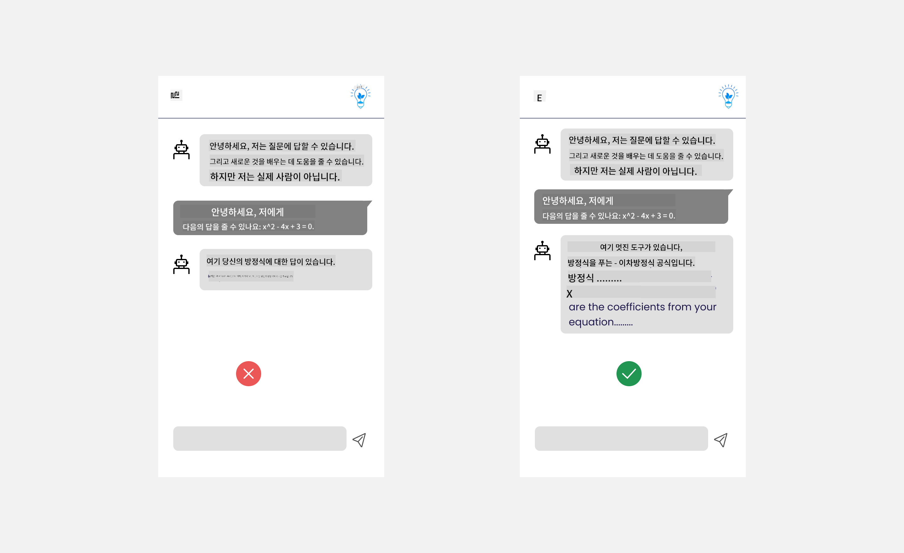

<!--
CO_OP_TRANSLATOR_METADATA:
{
  "original_hash": "747668e4c53d067369f06e9ec2e6313e",
  "translation_date": "2025-08-26T15:22:07+00:00",
  "source_file": "12-designing-ux-for-ai-applications/README.md",
  "language_code": "ko"
}
-->
# AI 애플리케이션을 위한 UX 설계

> _(위 이미지를 클릭하면 이 강의의 영상을 볼 수 있습니다)_

사용자 경험은 앱을 만들 때 매우 중요한 요소입니다. 사용자가 효율적으로 작업을 수행할 수 있도록 앱을 사용할 수 있어야 합니다. 효율성도 중요하지만, 모든 사람이 사용할 수 있도록 _접근성_을 고려해 앱을 설계해야 합니다. 이 장에서는 이 부분에 집중하여, 사람들이 사용할 수 있고 사용하고 싶어하는 앱을 설계할 수 있도록 도와줍니다.

## 소개

사용자 경험이란 사용자가 특정 제품이나 서비스를(시스템, 도구, 디자인 등) 어떻게 상호작용하고 사용하는지를 의미합니다. AI 애플리케이션을 개발할 때, 개발자는 사용자 경험이 효과적일 뿐만 아니라 윤리적인지도 신경 써야 합니다. 이 강의에서는 사용자 요구를 충족하는 인공지능(AI) 애플리케이션을 어떻게 구축할 수 있는지 다룹니다.

이 강의에서는 다음과 같은 내용을 다룹니다:

- 사용자 경험 소개 및 사용자 요구 이해하기
- 신뢰와 투명성을 위한 AI 애플리케이션 설계
- 협업과 피드백을 위한 AI 애플리케이션 설계

## 학습 목표

이 강의를 마치면 다음을 할 수 있습니다:

- 사용자 요구를 충족하는 AI 애플리케이션을 구축하는 방법을 이해합니다.
- 신뢰와 협업을 촉진하는 AI 애플리케이션을 설계할 수 있습니다.

### 선수 지식

시간을 내어 [사용자 경험과 디자인 사고](https://learn.microsoft.com/training/modules/ux-design?WT.mc_id=academic-105485-koreyst)에 대해 더 읽어보세요.

## 사용자 경험 소개 및 사용자 요구 이해하기

가상의 교육 스타트업에서는 교사와 학생, 두 가지 주요 사용자가 있습니다. 각각의 사용자는 고유한 요구를 가지고 있습니다. 사용자 중심 설계는 사용자를 우선시하여, 제품이 의도된 사용자에게 적합하고 유익하도록 만듭니다.

애플리케이션은 **유용하고, 신뢰할 수 있으며, 접근 가능하고, 쾌적**해야 좋은 사용자 경험을 제공합니다.

### 사용성

유용하다는 것은 애플리케이션이 의도된 목적에 맞는 기능을 갖추고 있다는 뜻입니다. 예를 들어, 채점 과정을 자동화하거나 복습용 플래시카드를 생성하는 기능 등이 있습니다. 채점 과정을 자동화하는 애플리케이션은 미리 정해진 기준에 따라 학생의 과제를 정확하고 효율적으로 점수화할 수 있어야 합니다. 마찬가지로, 복습용 플래시카드를 생성하는 애플리케이션은 데이터에 기반해 적절하고 다양한 문제를 만들어낼 수 있어야 합니다.

### 신뢰성

신뢰할 수 있다는 것은 애플리케이션이 일관되게 오류 없이 작업을 수행할 수 있다는 의미입니다. 하지만 AI도 인간처럼 완벽하지 않아서 오류가 발생할 수 있습니다. 애플리케이션은 오류나 예기치 않은 상황에 직면할 수 있으며, 이럴 때는 사람의 개입이나 수정이 필요할 수 있습니다. 오류를 어떻게 처리할까요? 이 강의의 마지막 부분에서, AI 시스템과 애플리케이션이 협업과 피드백을 위해 어떻게 설계되는지 다룹니다.

### 접근성

접근성이란 다양한 능력을 가진 사용자, 즉 장애가 있는 사람을 포함한 모든 사용자가 사용할 수 있도록 사용자 경험을 확장하는 것을 의미합니다. 접근성 지침과 원칙을 따르면, AI 솔루션이 더 포괄적이고, 사용하기 쉬우며, 모든 사용자에게 유익해집니다.

### 쾌적함

쾌적하다는 것은 애플리케이션을 사용하는 것이 즐겁다는 뜻입니다. 매력적인 사용자 경험은 사용자가 애플리케이션을 다시 찾도록 유도하고, 비즈니스 수익에도 긍정적인 영향을 줄 수 있습니다.

모든 문제를 AI로 해결할 수 있는 것은 아닙니다. AI는 수작업을 자동화하거나 사용자 경험을 개인화하는 등, 사용자 경험을 보완하는 역할을 합니다.

## 신뢰와 투명성을 위한 AI 애플리케이션 설계

AI 애플리케이션을 설계할 때 신뢰를 구축하는 것은 매우 중요합니다. 신뢰가 있어야 사용자는 애플리케이션이 작업을 잘 수행하고, 일관된 결과를 제공하며, 그 결과가 자신의 요구에 부합한다고 믿을 수 있습니다. 이 영역에서의 위험은 불신과 과신입니다. 불신은 사용자가 AI 시스템을 거의 또는 전혀 신뢰하지 않을 때 발생하며, 이는 사용자가 애플리케이션을 거부하게 만듭니다. 과신은 사용자가 AI 시스템의 능력을 과대평가하여, AI를 지나치게 신뢰하는 경우입니다. 예를 들어, 자동 채점 시스템에서 과신이 발생하면, 교사가 일부 시험지를 직접 확인하지 않고 시스템만 믿게 되어, 학생들에게 부당하거나 부정확한 점수가 매겨지거나, 피드백과 개선의 기회를 놓칠 수 있습니다.

신뢰를 설계의 중심에 두는 두 가지 방법은 설명 가능성과 제어권입니다.

### 설명 가능성

AI가 미래 세대에게 지식을 전달하는 등 중요한 결정을 도울 때, 교사와 학부모가 AI의 결정 방식에 대해 이해하는 것이 매우 중요합니다. 이것이 바로 설명 가능성입니다. 즉, AI 애플리케이션이 어떻게 결정을 내리는지 이해하는 것입니다. 설명 가능성을 위해서는 AI가 어떻게 결과를 도출했는지 보여주는 세부 정보를 추가해야 합니다. 사용자는 결과가 AI에 의해 생성된 것임을 인지해야 하며, 사람이 만든 것이 아님을 알아야 합니다. 예를 들어, "지금 튜터와 채팅을 시작하세요" 대신 "당신의 필요에 맞춰 학습을 도와주는 AI 튜터를 사용해보세요"라고 안내할 수 있습니다.

또 다른 예시는 AI가 사용자 및 개인 데이터를 어떻게 사용하는지에 관한 것입니다. 예를 들어, 학생이라는 페르소나를 가진 사용자는 그 페르소나에 따라 제한이 있을 수 있습니다. AI는 정답을 바로 알려주지 않고, 사용자가 스스로 문제를 해결할 수 있도록 안내할 수 있습니다.

설명 가능성의 또 다른 중요한 부분은 설명을 쉽게 만드는 것입니다. 학생과 교사는 AI 전문가가 아닐 수 있으므로, 애플리케이션이 할 수 있는 것과 할 수 없는 것에 대한 설명은 간단하고 이해하기 쉬워야 합니다.

### 제어권

생성형 AI는 AI와 사용자 간의 협업을 만들어냅니다. 예를 들어, 사용자가 다양한 결과를 얻기 위해 프롬프트를 수정할 수 있습니다. 또한, 결과가 생성된 후 사용자가 결과를 수정할 수 있어야 하며, 이를 통해 사용자는 제어권을 느낄 수 있습니다. 예를 들어, Bing을 사용할 때, 형식, 톤, 길이에 따라 프롬프트를 조정할 수 있습니다. 또한, 아래와 같이 결과에 변화를 주거나 출력을 수정할 수도 있습니다.

Bing의 또 다른 기능은 사용자가 AI가 사용하는 데이터에 대해 직접 동의하거나 거부할 수 있다는 점입니다. 학교 애플리케이션에서는 학생이 자신의 노트와 교사의 자료를 복습 자료로 사용할 수 있기를 원할 수 있습니다.

> AI 애플리케이션을 설계할 때, 사용자가 AI의 능력을 과신하여 비현실적인 기대를 갖지 않도록 의도적으로 설계하는 것이 중요합니다. 이를 위해 프롬프트와 결과 사이에 약간의 마찰을 두는 방법이 있습니다. 즉, 사용자가 이것이 AI임을, 사람이 아님을 상기시켜주는 것입니다.

## 협업과 피드백을 위한 AI 애플리케이션 설계

앞서 언급했듯이, 생성형 AI는 사용자와 AI 간의 협업을 만들어냅니다. 대부분의 상호작용은 사용자가 프롬프트를 입력하고 AI가 결과를 생성하는 방식입니다. 만약 결과가 잘못되었다면 어떻게 해야 할까요? 애플리케이션은 오류가 발생했을 때 어떻게 처리해야 할까요? AI가 사용자에게 책임을 전가하거나, 오류에 대해 설명해줄까요?

AI 애플리케이션은 피드백을 받고 제공할 수 있도록 설계되어야 합니다. 이는 AI 시스템이 개선되는 데 도움이 될 뿐만 아니라, 사용자와의 신뢰를 쌓는 데도 중요합니다. 피드백 루프는 설계에 반드시 포함되어야 하며, 예를 들어 결과에 대해 엄지손가락 올리기/내리기 버튼을 제공할 수 있습니다.

또 다른 방법은 시스템의 기능과 한계를 명확하게 전달하는 것입니다. 사용자가 AI의 능력을 넘어서는 요청을 했을 때, 이를 처리할 수 있는 방법도 필요합니다. 아래 예시처럼 말이죠.

시스템 오류는 사용자가 AI의 범위를 벗어난 정보를 요청하거나, 애플리케이션이 사용자가 요약을 생성할 수 있는 질문/과목 수에 제한이 있을 때 자주 발생합니다. 예를 들어, 역사와 수학 등 제한된 과목 데이터로 학습된 AI 애플리케이션은 지리와 관련된 질문을 처리하지 못할 수 있습니다. 이를 완화하기 위해, AI 시스템은 "죄송합니다. 저희 제품은 다음 과목의 데이터로 학습되었습니다....., 요청하신 질문에는 답변할 수 없습니다."와 같은 응답을 제공할 수 있습니다.

AI 애플리케이션은 완벽하지 않으므로, 실수를 할 수밖에 없습니다. 애플리케이션을 설계할 때는 사용자의 피드백과 오류 처리를 위한 공간을 마련하고, 이를 간단하고 쉽게 설명할 수 있도록 해야 합니다.

## 과제

지금까지 만든 AI 앱이 있다면, 아래 단계를 앱에 적용해보세요:

- **쾌적함:** 앱을 더 쾌적하게 만들 수 있는 방법을 고민해보세요. 설명을 충분히 제공하고 있나요? 사용자가 탐색하도록 유도하고 있나요? 오류 메시지는 어떻게 표현하고 있나요?

- **사용성:** 웹 앱을 만들 때, 마우스와 키보드 모두로 탐색이 가능한지 확인하세요.

- **신뢰와 투명성:** AI와 그 결과를 무조건 신뢰하지 말고, 사람이 결과를 검증할 수 있는 방법을 고민해보세요. 신뢰와 투명성을 확보할 수 있는 다른 방법도 고려하고 구현해보세요.

- **제어권:** 사용자가 애플리케이션에 제공하는 데이터에 대한 제어권을 가질 수 있도록 하세요. AI 애플리케이션에서 데이터 수집에 사용자가 동의하거나 거부할 수 있는 방법을 구현해보세요.

## 학습 이어가기!

이 강의를 마친 후, [생성형 AI 학습 컬렉션](https://aka.ms/genai-collection?WT.mc_id=academic-105485-koreyst)을 확인하여 생성형 AI에 대한 지식을 계속 쌓아보세요!

13강으로 넘어가서, [AI 애플리케이션 보안](../13-securing-ai-applications/README.md?WT.mc_id=academic-105485-koreyst)에 대해 알아봅시다!

---

**면책 조항**:  
이 문서는 AI 번역 서비스 [Co-op Translator](https://github.com/Azure/co-op-translator)를 사용하여 번역되었습니다. 정확성을 위해 노력하고 있지만, 자동 번역에는 오류나 부정확성이 포함될 수 있습니다. 원본 문서(원어)가 권위 있는 자료로 간주되어야 합니다. 중요한 정보의 경우 전문적인 인간 번역을 권장합니다. 본 번역의 사용으로 인해 발생하는 오해나 오역에 대해 당사는 책임을 지지 않습니다.