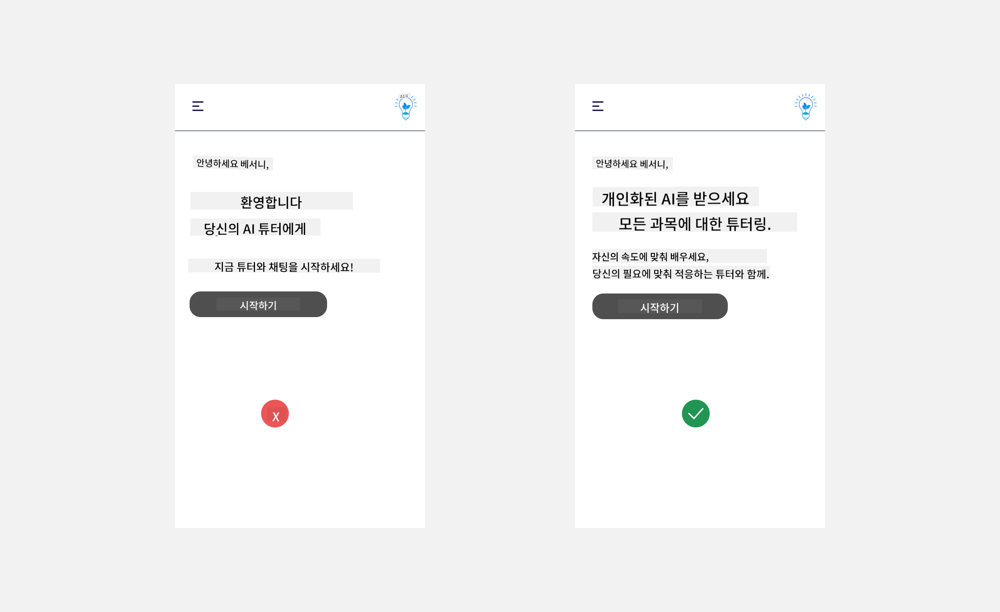
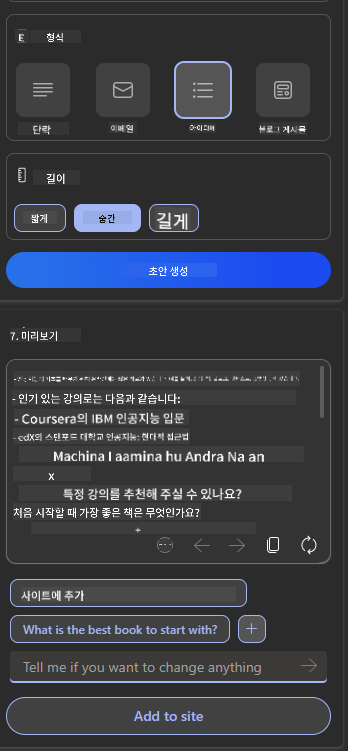

<!--
CO_OP_TRANSLATOR_METADATA:
{
  "original_hash": "ec385b41ee50579025d50cc03bfb3a25",
  "translation_date": "2025-07-09T14:52:35+00:00",
  "source_file": "12-designing-ux-for-ai-applications/README.md",
  "language_code": "ko"
}
-->
# AI 애플리케이션을 위한 UX 설계

> _(위 이미지를 클릭하면 이 수업의 영상을 볼 수 있습니다)_

사용자 경험은 앱을 만드는 데 있어 매우 중요한 요소입니다. 사용자가 작업을 효율적으로 수행할 수 있도록 앱을 사용할 수 있어야 합니다. 효율성도 중요하지만, 모두가 사용할 수 있도록 앱을 설계해 _접근성_을 확보하는 것도 필요합니다. 이 장에서는 이 부분에 초점을 맞춰 사람들이 사용하고 싶어 하는 앱을 설계할 수 있도록 돕고자 합니다.

## 소개

사용자 경험은 사용자가 특정 제품이나 서비스, 시스템, 도구, 디자인과 상호작용하고 사용하는 방식을 의미합니다. AI 애플리케이션을 개발할 때 개발자는 사용자 경험이 효과적일 뿐만 아니라 윤리적이어야 한다는 점에도 주의를 기울입니다. 이 수업에서는 사용자 요구를 충족하는 인공지능(AI) 애플리케이션을 만드는 방법을 다룹니다.

이번 수업에서 다룰 내용은 다음과 같습니다:

- 사용자 경험 소개 및 사용자 요구 이해
- 신뢰와 투명성을 위한 AI 애플리케이션 설계
- 협업과 피드백을 위한 AI 애플리케이션 설계

## 학습 목표

이 수업을 마치면 다음을 할 수 있습니다:

- 사용자 요구를 충족하는 AI 애플리케이션을 만드는 방법 이해
- 신뢰와 협업을 촉진하는 AI 애플리케이션 설계

### 사전 준비

시간을 내어 [사용자 경험과 디자인 사고](https://learn.microsoft.com/training/modules/ux-design?WT.mc_id=academic-105485-koreyst)에 대해 더 읽어보세요.

## 사용자 경험 소개 및 사용자 요구 이해

가상의 교육 스타트업에서는 두 가지 주요 사용자가 있습니다. 교사와 학생입니다. 두 사용자 모두 고유한 요구가 있습니다. 사용자 중심 설계는 사용자를 최우선으로 하여 제품이 대상 사용자에게 적합하고 유익하도록 보장합니다.

애플리케이션은 **유용하고, 신뢰할 수 있으며, 접근 가능하고, 쾌적해야** 좋은 사용자 경험을 제공할 수 있습니다.

### 사용성

유용하다는 것은 애플리케이션이 의도한 목적에 맞는 기능을 갖추고 있다는 뜻입니다. 예를 들어, 채점 과정을 자동화하거나 복습용 플래시카드를 생성하는 기능이 이에 해당합니다. 채점 자동화 애플리케이션은 미리 정의된 기준에 따라 학생들의 과제를 정확하고 효율적으로 평가할 수 있어야 합니다. 마찬가지로, 복습용 플래시카드를 생성하는 애플리케이션은 관련성 있고 다양한 질문을 데이터 기반으로 만들어낼 수 있어야 합니다.

### 신뢰성

신뢰할 수 있다는 것은 애플리케이션이 일관되게 오류 없이 작업을 수행할 수 있다는 의미입니다. 하지만 AI도 인간과 마찬가지로 완벽하지 않으며 오류가 발생할 수 있습니다. 애플리케이션은 오류나 예상치 못한 상황에 직면할 수 있으며, 이때는 인간의 개입이나 수정이 필요할 수 있습니다. 오류를 어떻게 처리할 것인가요? 이 수업의 마지막 부분에서는 AI 시스템과 애플리케이션이 협업과 피드백을 위해 어떻게 설계되는지 다룹니다.

### 접근성

접근성은 장애가 있는 사용자를 포함해 다양한 능력을 가진 사용자 모두가 경험할 수 있도록 사용자 경험을 확장하는 것을 의미합니다. 접근성 가이드라인과 원칙을 따르면 AI 솔루션은 더 포용적이고, 사용하기 쉽고, 모든 사용자에게 유익해집니다.

### 쾌적함

쾌적하다는 것은 애플리케이션을 사용하는 것이 즐겁다는 뜻입니다. 매력적인 사용자 경험은 사용자에게 긍정적인 영향을 미쳐 애플리케이션을 다시 찾게 만들고, 비즈니스 수익을 높일 수 있습니다.

모든 문제를 AI로 해결할 수는 없습니다. AI는 수동 작업을 자동화하거나 사용자 경험을 개인화하는 등 사용자 경험을 보완하는 역할을 합니다.

## 신뢰와 투명성을 위한 AI 애플리케이션 설계

신뢰 구축은 AI 애플리케이션 설계에서 매우 중요합니다. 신뢰는 사용자가 애플리케이션이 작업을 제대로 수행하고, 일관된 결과를 제공하며, 그 결과가 사용자가 원하는 것임을 확신하게 합니다. 이 영역에서 위험 요소는 불신과 과신입니다. 불신은 사용자가 AI 시스템을 거의 또는 전혀 신뢰하지 않아 애플리케이션을 거부하는 경우입니다. 과신은 사용자가 AI 시스템의 능력을 과대평가하여 너무 많이 신뢰하는 경우입니다. 예를 들어, 자동 채점 시스템에서 과신이 발생하면 교사가 일부 시험지를 검토하지 않아 채점 시스템이 제대로 작동하는지 확인하지 않을 수 있습니다. 이는 학생들에게 불공정하거나 부정확한 점수를 주거나 피드백과 개선 기회를 놓치는 결과를 초래할 수 있습니다.

신뢰를 설계의 중심에 두기 위한 두 가지 방법은 설명 가능성과 제어입니다.

### 설명 가능성

AI가 미래 세대에 지식을 전달하는 등 의사결정을 돕는 경우, 교사와 부모가 AI가 어떻게 결정을 내리는지 이해하는 것이 중요합니다. 이것이 설명 가능성입니다 - AI 애플리케이션이 어떻게 결정을 내리는지 이해하는 것. 설명 가능성을 위한 설계는 AI 애플리케이션이 할 수 있는 일의 예시를 추가하는 것을 포함합니다. 예를 들어, "AI 교사 시작하기" 대신 "AI를 사용해 노트를 요약하여 더 쉽게 복습하세요"와 같이 구체적으로 표현할 수 있습니다.

또 다른 예는 AI가 사용자 및 개인 데이터를 사용하는 방식입니다. 예를 들어, 학생 페르소나를 가진 사용자는 페르소나에 따라 제한이 있을 수 있습니다. AI는 질문에 대한 답을 직접 제공하지 않을 수 있지만, 사용자가 문제를 해결할 수 있도록 생각을 유도하는 데 도움을 줄 수 있습니다.

설명 가능성의 마지막 핵심 요소는 설명의 단순화입니다. 학생과 교사는 AI 전문가가 아닐 수 있으므로, 애플리케이션이 할 수 있는 일과 할 수 없는 일을 쉽게 이해할 수 있도록 단순하고 명확하게 설명해야 합니다.

### 제어

생성형 AI는 AI와 사용자 간의 협업을 만듭니다. 예를 들어, 사용자가 다양한 결과를 위해 프롬프트를 수정할 수 있습니다. 또한 출력이 생성된 후에는 사용자가 결과를 수정할 수 있어야 하며, 이를 통해 제어감을 느낄 수 있습니다. 예를 들어 Bing을 사용할 때는 형식, 톤, 길이에 따라 프롬프트를 조정할 수 있습니다. 또한 출력에 변경 사항을 추가하고 수정할 수 있습니다.

Bing의 또 다른 기능은 사용자가 AI가 사용하는 데이터에 대해 옵트인 및 옵트아웃할 수 있는 기능입니다. 학교 애플리케이션의 경우, 학생은 자신의 노트뿐만 아니라 교사의 자료도 복습 자료로 사용할 수 있습니다.

> AI 애플리케이션을 설계할 때는 사용자가 AI의 능력을 과신하지 않도록 의도적으로 설계하는 것이 중요합니다. 이를 위해 프롬프트와 결과 사이에 마찰을 만들어 사용자가 이것이 AI이지 인간이 아님을 상기시키는 방법이 있습니다.

## 협업과 피드백을 위한 AI 애플리케이션 설계

앞서 언급했듯이 생성형 AI는 사용자와 AI 간의 협업을 만듭니다. 대부분의 상호작용은 사용자가 프롬프트를 입력하고 AI가 출력을 생성하는 방식입니다. 만약 출력이 잘못되었다면 어떻게 할까요? 오류가 발생하면 애플리케이션은 어떻게 처리할까요? AI가 사용자를 탓하거나 오류를 설명하는 데 시간을 할애할까요?

AI 애플리케이션은 피드백을 주고받을 수 있도록 설계되어야 합니다. 이는 AI 시스템 개선에 도움을 줄 뿐만 아니라 사용자와의 신뢰를 쌓는 데도 중요합니다. 피드백 루프를 설계에 포함시키는 한 가지 예는 출력에 대해 간단한 엄지척 또는 엄지 내림 버튼을 제공하는 것입니다.

또 다른 방법은 시스템의 기능과 한계를 명확히 전달하는 것입니다. 사용자가 AI의 능력을 벗어난 요청을 할 때 이를 처리할 방법도 마련해야 합니다. 아래 예시를 참고하세요.

시스템 오류는 AI 범위를 벗어난 정보가 필요하거나 사용자가 생성할 수 있는 질문/과목 요약 수에 제한이 있을 때 흔히 발생합니다. 예를 들어, 역사와 수학 데이터로만 학습된 AI 애플리케이션은 지리 관련 질문을 처리하지 못할 수 있습니다. 이를 완화하기 위해 AI 시스템은 다음과 같이 응답할 수 있습니다: "죄송합니다, 본 제품은 다음 과목 데이터로 학습되었습니다....., 요청하신 질문에 답변할 수 없습니다."

AI 애플리케이션은 완벽하지 않으므로 실수를 할 수밖에 없습니다. 애플리케이션을 설계할 때는 사용자 피드백과 오류 처리를 간단하고 이해하기 쉽게 만들 공간을 마련해야 합니다.

## 과제

지금까지 만든 AI 앱 중 하나를 선택해 아래 단계를 앱에 적용해 보세요:

- **쾌적함:** 앱을 더 쾌적하게 만들려면 어떻게 해야 할까요? 설명을 충분히 추가하고 있나요? 사용자가 탐색하도록 유도하고 있나요? 오류 메시지는 어떻게 작성하고 있나요?

- **사용성:** 웹 앱을 만들 때 마우스와 키보드 모두로 탐색할 수 있도록 하세요.

- **신뢰와 투명성:** AI와 그 출력물을 완전히 신뢰하지 말고, 출력을 검증할 사람을 프로세스에 포함하는 방법을 고려하세요. 또한 신뢰와 투명성을 달성할 다른 방법도 고민하고 구현하세요.

- **제어:** 사용자가 애플리케이션에 제공하는 데이터를 제어할 수 있도록 하세요. AI 애플리케이션에서 데이터 수집에 대해 사용자가 옵트인 및 옵트아웃할 수 있는 방법을 구현하세요.

## 학습 계속하기!

이 수업을 마친 후에는 [Generative AI 학습 컬렉션](https://aka.ms/genai-collection?WT.mc_id=academic-105485-koreyst)을 확인해 생성형 AI 지식을 계속 향상시키세요!

13강으로 넘어가 [AI 애플리케이션 보안](../13-securing-ai-applications/README.md?WT.mc_id=academic-105485-koreyst)에 대해 알아봅시다!

**면책 조항**:  
이 문서는 AI 번역 서비스 [Co-op Translator](https://github.com/Azure/co-op-translator)를 사용하여 번역되었습니다. 정확성을 위해 최선을 다하고 있으나, 자동 번역에는 오류나 부정확한 부분이 있을 수 있음을 유의하시기 바랍니다. 원문은 해당 언어의 원본 문서가 권위 있는 자료로 간주되어야 합니다. 중요한 정보의 경우 전문적인 인간 번역을 권장합니다. 본 번역 사용으로 인해 발생하는 오해나 잘못된 해석에 대해 당사는 책임을 지지 않습니다.