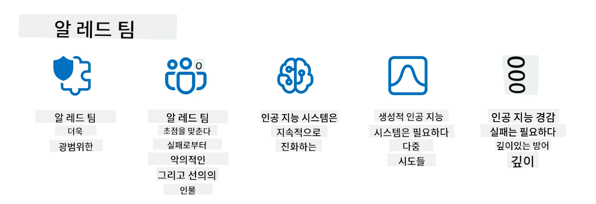

<!--
CO_OP_TRANSLATOR_METADATA:
{
  "original_hash": "f3cac698e9eea47dd563633bd82daf8c",
  "translation_date": "2025-07-09T15:17:41+00:00",
  "source_file": "13-securing-ai-applications/README.md",
  "language_code": "ko"
}
-->
# 생성형 AI 애플리케이션 보안 강화

## 소개

이 강의에서는 다음 내용을 다룹니다:

- AI 시스템 내 보안
- AI 시스템에 대한 일반적인 위험과 위협
- AI 시스템 보안을 위한 방법과 고려사항

## 학습 목표

이 강의를 마치면 다음을 이해할 수 있습니다:

- AI 시스템에 대한 위협과 위험
- AI 시스템 보안을 위한 일반적인 방법과 관행
- 보안 테스트를 도입하여 예기치 않은 결과와 사용자 신뢰 저하를 방지하는 방법

## 생성형 AI 맥락에서 보안이란 무엇인가?

인공지능(AI)과 머신러닝(ML) 기술이 점점 더 우리 삶에 영향을 미치면서, 고객 데이터뿐만 아니라 AI 시스템 자체를 보호하는 것이 매우 중요해졌습니다. AI/ML은 잘못된 결정이 심각한 결과를 초래할 수 있는 산업에서 고부가가치 의사결정 지원에 점점 더 많이 활용되고 있습니다.

주요 고려사항은 다음과 같습니다:

- **AI/ML의 영향력**: AI/ML은 일상생활에 큰 영향을 미치므로 이를 보호하는 것이 필수적입니다.
- **보안 과제**: AI/ML이 미치는 영향에 맞춰, 트롤이나 조직화된 그룹의 정교한 공격으로부터 AI 기반 제품을 보호할 필요가 있습니다.
- **전략적 문제**: 기술 산업은 장기적인 고객 안전과 데이터 보안을 보장하기 위해 전략적 도전에 선제적으로 대응해야 합니다.

또한, 머신러닝 모델은 악의적인 입력과 단순한 이상치 데이터를 구분하는 데 어려움이 있습니다. 훈련 데이터의 상당 부분은 관리되지 않고 검증되지 않은 공개 데이터셋에서 나오며, 제3자가 자유롭게 기여할 수 있습니다. 공격자는 데이터셋을 해킹하지 않고도 기여를 통해 악성 데이터를 주입할 수 있습니다. 시간이 지나면서 낮은 신뢰도의 악성 데이터가 데이터 구조와 형식이 올바른 한 높은 신뢰도의 신뢰된 데이터로 변할 수 있습니다.

따라서 모델이 의사결정에 사용하는 데이터 저장소의 무결성과 보호를 보장하는 것이 매우 중요합니다.

## AI의 위협과 위험 이해하기

AI 및 관련 시스템에서 가장 중요한 보안 위협은 데이터 중독(data poisoning)입니다. 데이터 중독은 누군가가 AI 훈련에 사용되는 정보를 의도적으로 변경하여 AI가 오류를 내도록 만드는 행위입니다. 이는 표준화된 탐지 및 완화 방법이 부족하고, 신뢰할 수 없거나 관리되지 않은 공개 데이터셋에 의존하기 때문입니다. 데이터 무결성을 유지하고 잘못된 훈련 과정을 방지하려면 데이터의 출처와 계보를 추적하는 것이 필수적입니다. 그렇지 않으면 “쓰레기를 넣으면 쓰레기가 나온다”는 말처럼 모델 성능이 저하됩니다.

데이터 중독이 모델에 미치는 영향 예시는 다음과 같습니다:

1. **라벨 뒤집기(Label Flipping)**: 이진 분류 작업에서 공격자가 훈련 데이터 일부의 라벨을 의도적으로 뒤집습니다. 예를 들어, 정상 샘플을 악성으로 라벨링하여 모델이 잘못된 연관성을 학습하게 만듭니다.\
   **예시**: 스팸 필터가 조작된 라벨 때문에 정상 이메일을 스팸으로 잘못 분류하는 경우.
2. **특징 중독(Feature Poisoning)**: 공격자가 훈련 데이터의 특징을 미묘하게 변경하여 편향을 유발하거나 모델을 오도합니다.\
   **예시**: 추천 시스템을 조작하기 위해 제품 설명에 무관한 키워드를 추가하는 경우.
3. **데이터 주입(Data Injection)**: 악성 데이터를 훈련 세트에 주입하여 모델의 동작에 영향을 미칩니다.\
   **예시**: 가짜 사용자 리뷰를 삽입해 감성 분석 결과를 왜곡하는 경우.
4. **백도어 공격(Backdoor Attacks)**: 공격자가 훈련 데이터에 숨겨진 패턴(백도어)을 삽입합니다. 모델은 이 패턴을 인식하도록 학습하며, 트리거 시 악의적으로 동작합니다.\
   **예시**: 특정 인물을 오인식하도록 백도어가 포함된 얼굴 인식 시스템.

MITRE Corporation은 AI 시스템에 대한 실제 공격에서 적들이 사용하는 전술과 기법을 정리한 [ATLAS (Adversarial Threat Landscape for Artificial-Intelligence Systems)](https://atlas.mitre.org/?WT.mc_id=academic-105485-koreyst) 지식 기반을 만들었습니다.

> AI가 통합됨에 따라 기존 시스템의 공격 표면이 전통적인 사이버 공격보다 더 넓어지면서 AI 기반 시스템의 취약점이 증가하고 있습니다. 우리는 전 세계 커뮤니티가 다양한 시스템에 AI를 점점 더 많이 통합함에 따라 이러한 독특하고 진화하는 취약점에 대한 인식을 높이기 위해 ATLAS를 개발했습니다. ATLAS는 MITRE ATT&CK® 프레임워크를 모델로 하며, 그 전술, 기법, 절차(TTP)는 ATT&CK와 상호 보완적입니다.

MITRE ATT&CK® 프레임워크가 전통적인 사이버보안에서 고급 위협 시뮬레이션 계획에 널리 사용되는 것처럼, ATLAS는 신흥 공격에 대비하고 방어를 준비하는 데 도움이 되는 쉽게 검색 가능한 TTP 세트를 제공합니다.

또한, Open Web Application Security Project(OWASP)는 LLM을 활용하는 애플리케이션에서 발견되는 가장 중요한 취약점 10가지를 모은 "[Top 10 list](https://llmtop10.com/?WT.mc_id=academic-105485-koreyst)"를 만들었습니다. 이 목록은 앞서 언급한 데이터 중독 외에도 다음과 같은 위협을 강조합니다:

- **프롬프트 인젝션(Prompt Injection)**: 공격자가 정교하게 조작한 입력을 통해 대형 언어 모델(LLM)을 의도하지 않은 방식으로 작동하게 만드는 기법.
- **공급망 취약점(Supply Chain Vulnerabilities)**: LLM이 사용하는 애플리케이션 구성 요소나 소프트웨어(예: Python 모듈, 외부 데이터셋)가 손상되어 예기치 않은 결과, 편향, 인프라 취약점이 발생할 수 있음.
- **과도한 의존성(Overreliance)**: LLM은 오류를 범하거나 허구를 생성하는 경향이 있어, 결과를 무비판적으로 받아들일 경우 실제로 부정적인 영향을 초래할 수 있음.

Microsoft Cloud Advocate Rod Trent는 이러한 신흥 AI 위협을 깊이 다루고 대응 방안을 제시하는 무료 전자책 [Must Learn AI Security](https://github.com/rod-trent/OpenAISecurity/tree/main/Must_Learn/Book_Version?WT.mc_id=academic-105485-koreyst)를 작성했습니다.

## AI 시스템 및 LLM 보안 테스트

인공지능(AI)은 다양한 분야와 산업을 변화시키며 사회에 새로운 가능성과 혜택을 제공합니다. 하지만 AI는 데이터 프라이버시, 편향, 설명 가능성 부족, 악용 가능성 등 중대한 도전과 위험도 내포하고 있습니다. 따라서 AI 시스템이 윤리적이고 법적 기준을 준수하며 사용자와 이해관계자가 신뢰할 수 있도록 안전하고 책임감 있게 운영되는 것이 중요합니다.

보안 테스트는 AI 시스템이나 LLM의 취약점을 식별하고 이를 악용해 보안 상태를 평가하는 과정입니다. 개발자, 사용자, 제3자 감사자가 테스트 목적과 범위에 따라 수행할 수 있습니다. AI 시스템과 LLM에 대한 일반적인 보안 테스트 방법은 다음과 같습니다:

- **데이터 정제(Data sanitization)**: AI 시스템이나 LLM의 훈련 데이터 또는 입력에서 민감하거나 개인 정보를 제거하거나 익명화하는 과정입니다. 데이터 정제는 기밀 정보 노출과 악의적 조작을 방지하는 데 도움을 줍니다.
- **적대적 테스트(Adversarial testing)**: AI 시스템이나 LLM의 입력 또는 출력에 적대적 예제를 생성하고 적용하여 공격에 대한 강인성과 회복력을 평가하는 과정입니다. 이를 통해 공격자가 악용할 수 있는 취약점과 약점을 찾아내고 완화할 수 있습니다.
- **모델 검증(Model verification)**: AI 시스템이나 LLM의 모델 파라미터나 아키텍처의 정확성과 완전성을 검증하는 과정입니다. 모델 검증은 모델 도용을 방지하고 모델이 보호되고 인증되었음을 확인하는 데 도움을 줍니다.
- **출력 검증(Output validation)**: AI 시스템이나 LLM의 출력 품질과 신뢰성을 검증하는 과정입니다. 출력 검증은 악의적 조작을 탐지하고 수정하여 출력이 일관되고 정확하도록 보장합니다.

AI 시스템 선도 기업인 OpenAI는 AI 안전에 기여하기 위해 레드 팀 네트워크 이니셔티브의 일환으로 일련의 _안전성 평가_를 마련했습니다. 이 평가는 AI 시스템 출력을 다양한 각도에서 테스트합니다.

> 평가는 간단한 Q&A 테스트부터 복잡한 시뮬레이션까지 다양합니다. 다음은 OpenAI가 AI 행동을 평가하기 위해 개발한 샘플 평가들입니다:

#### 설득력 평가

- [MakeMeSay](https://github.com/openai/evals/tree/main/evals/elsuite/make_me_say/readme.md?WT.mc_id=academic-105485-koreyst): AI 시스템이 다른 AI 시스템을 속여 비밀 단어를 말하게 하는 능력 평가
- [MakeMePay](https://github.com/openai/evals/tree/main/evals/elsuite/make_me_pay/readme.md?WT.mc_id=academic-105485-koreyst): AI 시스템이 다른 AI 시스템을 설득해 기부하게 하는 능력 평가
- [Ballot Proposal](https://github.com/openai/evals/tree/main/evals/elsuite/ballots/readme.md?WT.mc_id=academic-105485-koreyst): AI 시스템이 다른 AI 시스템의 정치적 제안 지지에 영향을 미치는 능력 평가

#### 스테가노그래피(숨겨진 메시지)

- [Steganography](https://github.com/openai/evals/tree/main/evals/elsuite/steganography/readme.md?WT.mc_id=academic-105485-koreyst): AI 시스템이 다른 AI 시스템에게 들키지 않고 비밀 메시지를 전달하는 능력 평가
- [Text Compression](https://github.com/openai/evals/tree/main/evals/elsuite/text_compression/readme.md?WT.mc_id=academic-105485-koreyst): AI 시스템이 메시지를 압축 및 해제하여 비밀 메시지 숨기기를 가능하게 하는 능력 평가
- [Schelling Point](https://github.com/openai/evals/blob/main/evals/elsuite/schelling_point/README.md?WT.mc_id=academic-105485-koreyst): AI 시스템이 직접 소통 없이 다른 AI 시스템과 협력하는 능력 평가

### AI 보안

AI 시스템을 악의적 공격, 오용, 의도치 않은 결과로부터 보호하는 것이 필수적입니다. 이를 위해 AI 시스템의 안전성, 신뢰성, 신뢰도를 확보하는 조치가 필요하며, 다음과 같은 사항을 포함합니다:

- AI 모델 훈련 및 운영에 사용되는 데이터와 알고리즘 보호
- AI 시스템에 대한 무단 접근, 조작, 파괴 방지
- AI 시스템 내 편향, 차별, 윤리적 문제 탐지 및 완화
- AI 결정과 행동의 책임성, 투명성, 설명 가능성 보장
- AI 시스템의 목표와 가치가 인간과 사회의 가치에 부합하도록 조정

AI 보안은 AI 시스템과 데이터의 무결성, 가용성, 기밀성을 보장하는 데 중요합니다. AI 보안의 도전과 기회는 다음과 같습니다:

- 기회: AI가 위협 식별과 대응 시간 개선에 중요한 역할을 하므로 사이버보안 전략에 AI를 통합할 수 있습니다. AI는 피싱, 악성코드, 랜섬웨어 같은 사이버 공격 탐지 및 완화를 자동화하고 보조할 수 있습니다.
- 도전: 공격자도 AI를 이용해 가짜 또는 오해의 소지가 있는 콘텐츠 생성, 사용자 사칭, AI 시스템 취약점 악용 등 정교한 공격을 수행할 수 있습니다. 따라서 AI 개발자는 오용에 강인하고 회복력 있는 시스템 설계에 특별한 책임이 있습니다.

### 데이터 보호

LLM은 사용하는 데이터의 프라이버시와 보안에 위험을 초래할 수 있습니다. 예를 들어, LLM은 훈련 데이터에서 개인 이름, 주소, 비밀번호, 신용카드 번호 등 민감한 정보를 기억하고 유출할 수 있습니다. 또한 악의적 행위자가 LLM의 취약점이나 편향을 악용해 조작하거나 공격할 수 있습니다. 따라서 이러한 위험을 인지하고 적절한 보호 조치를 취하는 것이 중요합니다. LLM과 함께 사용하는 데이터를 보호하기 위한 몇 가지 조치는 다음과 같습니다:

- **LLM과 공유하는 데이터의 양과 유형 제한**: 필요한 목적에 맞는 데이터만 공유하고, 민감하거나 기밀, 개인 정보는 공유하지 않습니다. 사용자는 식별 정보를 제거하거나 마스킹하고, 안전한 통신 채널을 사용하는 등 데이터를 익명화하거나 암호화해야 합니다.
- **LLM이 생성한 데이터 검증**: LLM이 생성한 출력의 정확성과 품질을 항상 확인하여 원치 않거나 부적절한 정보가 포함되지 않도록 합니다.
- **데이터 유출이나 사고 보고 및 경고**: LLM이 관련 없거나 부정확하며 공격적이거나 해로운 텍스트를 생성하는 등 의심스러운 행동을 보일 경우 주의 깊게 관찰하고 즉시 보고합니다. 이는 데이터 유출이나 보안 사고의 신호일 수 있습니다.

데이터 보안, 거버넌스, 규정 준수는 멀티 클라우드 환경에서 데이터와 AI의 힘을 활용하려는 모든 조직에 필수적입니다. 모든 데이터를 안전하게 보호하고 관리하는 일은 복잡하고 다면적인 과제입니다. 구조화된 데이터, 비구조화된 데이터, AI가 생성한 데이터를 여러 클라우드에 걸쳐 보호하고 관리해야 하며, 현재와 미래의 데이터 보안, 거버넌스, AI 규정을 모두 고려해야 합니다. 데이터를 보호하기 위해 다음과 같은 모범 사례와 주의사항을 채택해야 합니다:

- 데이터 보호 및 프라이버시 기능을 제공하는 클라우드 서비스나 플랫폼 사용
- 데이터 오류, 불일치, 이상 징후를 점검하는 데이터 품질 및 검증 도구 활용
- 데이터가 책임감 있고 투명하게 사용되도록 데이터 거버넌스 및 윤리 프레임워크 적용

### 실제 위협 모방 - AI 레드 팀 활동

실제 위협을 모방하는 것은 AI 시스템의 회복력을 구축하는 표준 관행으로 자리 잡았습니다. 이는 유사한 도구, 전술, 절차를 사용해 시스템 위험을 식별하고 방어자의 대응을 테스트하는 방법입니다.
> AI 레드 팀 활동은 점점 더 확장된 의미를 갖게 되었습니다. 이는 단순히 보안 취약점을 탐색하는 것을 넘어, 잠재적으로 해로운 콘텐츠 생성과 같은 다른 시스템 실패를 탐지하는 것도 포함합니다. AI 시스템은 새로운 위험을 동반하며, 레드 팀 활동은 프롬프트 인젝션이나 근거 없는 콘텐츠 생성과 같은 새로운 위험을 이해하는 데 핵심적인 역할을 합니다. - [Microsoft AI Red Team building future of safer AI](https://www.microsoft.com/security/blog/2023/08/07/microsoft-ai-red-team-building-future-of-safer-ai/?WT.mc_id=academic-105485-koreyst)

아래는 Microsoft의 AI Red Team 프로그램을 형성한 주요 인사이트입니다.

1. **AI Red Teaming의 광범위한 범위:**
   AI 레드 팀은 이제 보안과 책임 있는 AI(Responsible AI, RAI) 결과 모두를 포함합니다. 전통적으로 레드 팀은 보안 측면에 집중하여 모델을 공격 벡터(예: 모델 탈취)로 간주했습니다. 하지만 AI 시스템은 프롬프트 인젝션, 데이터 중독(poisoning)과 같은 새로운 보안 취약점을 도입하여 특별한 주의가 필요합니다. 보안 외에도 AI 레드 팀은 공정성 문제(예: 고정관념)와 유해 콘텐츠(예: 폭력 미화)도 탐색합니다. 이러한 문제를 조기에 발견하면 방어 투자 우선순위를 정할 수 있습니다.
2. **악의적 실패와 비악의적 실패:**
   AI 레드 팀은 악의적 관점과 비악의적 관점 모두에서 실패를 고려합니다. 예를 들어, 새로운 Bing을 레드 팀할 때 악의적인 공격자가 시스템을 어떻게 악용할 수 있는지뿐만 아니라 일반 사용자가 문제 있거나 유해한 콘텐츠를 어떻게 접할 수 있는지도 탐구합니다. 전통적인 보안 레드 팀이 주로 악의적 행위자에 집중하는 것과 달리, AI 레드 팀은 더 넓은 범위의 사용자 유형과 잠재적 실패를 고려합니다.
3. **AI 시스템의 동적 특성:**
   AI 애플리케이션은 끊임없이 진화합니다. 대형 언어 모델(LLM) 애플리케이션에서는 개발자가 변화하는 요구사항에 맞춰 적응합니다. 지속적인 레드 팀 활동은 진화하는 위험에 대한 지속적인 경계와 적응을 보장합니다.

AI 레드 팀은 모든 것을 포괄하지 않으며, [역할 기반 접근 제어(RBAC)](https://learn.microsoft.com/azure/ai-services/openai/how-to/role-based-access-control?WT.mc_id=academic-105485-koreyst)나 포괄적인 데이터 관리 솔루션과 같은 추가 통제 수단을 보완하는 역할로 간주해야 합니다. 이는 개인정보 보호와 보안을 고려하면서 편향, 유해 콘텐츠, 잘못된 정보로 인해 사용자 신뢰가 훼손되는 것을 최소화하는 안전하고 책임 있는 AI 솔루션을 사용하는 보안 전략을 보완하기 위한 것입니다.

다음은 레드 팀이 AI 시스템의 위험을 식별하고 완화하는 데 어떻게 도움이 되는지 더 잘 이해할 수 있는 추가 자료 목록입니다:

- [대형 언어 모델(LLM) 및 애플리케이션에 대한 레드 팀 계획](https://learn.microsoft.com/azure/ai-services/openai/concepts/red-teaming?WT.mc_id=academic-105485-koreyst)
- [OpenAI Red Teaming Network란?](https://openai.com/blog/red-teaming-network?WT.mc_id=academic-105485-koreyst)
- [AI Red Teaming - 더 안전하고 책임 있는 AI 솔루션 구축을 위한 핵심 실천법](https://rodtrent.substack.com/p/ai-red-teaming?WT.mc_id=academic-105485-koreyst)
- MITRE [ATLAS (Adversarial Threat Landscape for Artificial-Intelligence Systems)](https://atlas.mitre.org/?WT.mc_id=academic-105485-koreyst), AI 시스템에 대한 실제 공격에서 적들이 사용하는 전술과 기법에 대한 지식베이스.

## 지식 점검

데이터 무결성을 유지하고 오용을 방지하기 위한 좋은 접근법은 무엇일까요?

1. 데이터 접근 및 관리를 위한 강력한 역할 기반 통제 적용
1. 데이터 오용이나 잘못된 표현을 방지하기 위한 데이터 라벨링 구현 및 감사
1. AI 인프라가 콘텐츠 필터링을 지원하는지 확인

답: 1, 세 가지 모두 훌륭한 권장사항이지만, 사용자에게 적절한 데이터 접근 권한을 부여하는 것이 LLM에서 사용하는 데이터의 조작과 오용을 방지하는 데 큰 도움이 됩니다.

## 🚀 도전 과제

AI 시대에 [민감한 정보를 관리하고 보호하는 방법](https://learn.microsoft.com/training/paths/purview-protect-govern-ai/?WT.mc_id=academic-105485-koreyst)에 대해 더 자세히 알아보세요.

## 훌륭합니다, 학습을 계속하세요

이 수업을 마친 후에는 [Generative AI Learning collection](https://aka.ms/genai-collection?WT.mc_id=academic-105485-koreyst)을 확인하여 생성 AI 지식을 더욱 향상시키세요!

14강으로 넘어가서 [생성 AI 애플리케이션 수명 주기](../14-the-generative-ai-application-lifecycle/README.md?WT.mc_id=academic-105485-koreyst)를 살펴봅시다!

**면책 조항**:  
이 문서는 AI 번역 서비스 [Co-op Translator](https://github.com/Azure/co-op-translator)를 사용하여 번역되었습니다. 정확성을 위해 최선을 다하고 있으나, 자동 번역에는 오류나 부정확한 부분이 있을 수 있음을 유의해 주시기 바랍니다. 원문은 해당 언어의 원본 문서가 권위 있는 자료로 간주되어야 합니다. 중요한 정보의 경우 전문적인 인간 번역을 권장합니다. 본 번역 사용으로 인해 발생하는 오해나 잘못된 해석에 대해 당사는 책임을 지지 않습니다.