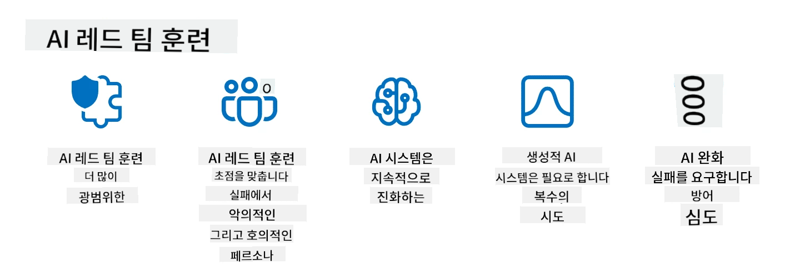

<!--
CO_OP_TRANSLATOR_METADATA:
{
  "original_hash": "f3cac698e9eea47dd563633bd82daf8c",
  "translation_date": "2025-05-19T22:29:33+00:00",
  "source_file": "13-securing-ai-applications/README.md",
  "language_code": "ko"
}
-->
# 생성 AI 애플리케이션 보안

## 소개

이 강의에서는 다음 내용을 다룹니다:

- AI 시스템 내 보안
- AI 시스템의 일반적인 위험 및 위협
- AI 시스템을 보호하기 위한 방법 및 고려사항

## 학습 목표

이 강의를 완료한 후 이해하게 될 내용은 다음과 같습니다:

- AI 시스템의 위협과 위험
- AI 시스템을 보호하기 위한 일반적인 방법 및 관행
- 보안 테스트를 구현하여 예기치 않은 결과와 사용자 신뢰의 저하를 방지하는 방법

## 생성 AI의 맥락에서 보안은 무엇을 의미하나요?

인공지능(AI)과 머신러닝(ML) 기술이 점점 더 우리의 삶을 형성함에 따라 고객 데이터뿐만 아니라 AI 시스템 자체를 보호하는 것이 중요합니다. AI/ML은 잘못된 결정이 심각한 결과를 초래할 수 있는 산업에서 고가치 의사 결정 프로세스를 지원하는 데 점점 더 많이 사용되고 있습니다.

다음은 고려해야 할 주요 사항입니다:

- **AI/ML의 영향**: AI/ML은 일상 생활에 큰 영향을 미치며, 따라서 이를 보호하는 것이 필수적입니다.
- **보안 문제**: AI/ML이 미치는 영향은 트롤이나 조직화된 그룹의 정교한 공격으로부터 AI 기반 제품을 보호할 필요성을 해결하기 위해 적절한 주의를 기울여야 합니다.
- **전략적 문제**: 기술 산업은 장기적인 고객 안전과 데이터 보안을 보장하기 위해 전략적 문제를 선제적으로 해결해야 합니다.

또한 머신러닝 모델은 악의적인 입력과 무해한 이상 데이터를 구별하는 데 크게 능력이 부족합니다. 훈련 데이터의 상당 부분은 검증되지 않은, 관리되지 않은 공개 데이터셋에서 파생되며, 이는 제3자가 기여할 수 있습니다. 공격자는 데이터셋을 손상시킬 필요가 없습니다. 시간이 지나면 데이터 구조/형식이 올바르게 유지되면 신뢰도가 낮은 악의적인 데이터가 신뢰도가 높은 데이터로 변합니다.

따라서 모델이 결정을 내리기 위해 사용하는 데이터 저장소의 무결성과 보호를 보장하는 것이 중요합니다.

## AI의 위협과 위험 이해하기

AI 및 관련 시스템 측면에서 데이터 중독은 오늘날 가장 중요한 보안 위협으로 부각됩니다. 데이터 중독은 누군가가 AI를 훈련하는 데 사용되는 정보를 의도적으로 변경하여 실수를 유발하는 것입니다. 이는 표준화된 탐지 및 완화 방법의 부재와 신뢰할 수 없거나 검증되지 않은 공개 데이터셋에 대한 의존 때문입니다. 데이터 무결성을 유지하고 결함이 있는 훈련 과정을 방지하려면 데이터의 출처와 계보를 추적하는 것이 중요합니다. 그렇지 않으면 "쓰레기 입력, 쓰레기 출력"이라는 옛말이 적용되어 모델 성능이 저하됩니다.

데이터 중독이 모델에 영향을 미칠 수 있는 예는 다음과 같습니다:

1. **레이블 뒤집기**: 이진 분류 작업에서 적대자가 훈련 데이터의 일부 레이블을 의도적으로 뒤집습니다. 예를 들어, 무해한 샘플이 악의적으로 레이블링되어 모델이 잘못된 연관성을 학습하게 됩니다.\
   **예시**: 조작된 레이블로 인해 정당한 이메일을 스팸으로 오분류하는 스팸 필터.
2. **특징 중독**: 공격자가 훈련 데이터의 특징을 미세하게 수정하여 편향을 도입하거나 모델을 오도합니다.\
   **예시**: 추천 시스템을 조작하기 위해 제품 설명에 관련 없는 키워드를 추가.
3. **데이터 주입**: 훈련 세트에 악의적인 데이터를 주입하여 모델의 행동에 영향을 미침.\
   **예시**: 감정 분석 결과를 왜곡하기 위해 가짜 사용자 리뷰를 도입.
4. **백도어 공격**: 적대자가 훈련 데이터에 숨겨진 패턴(백도어)을 삽입합니다. 모델은 이 패턴을 인식하도록 학습하고 트리거되면 악의적인 행동을 합니다.\
   **예시**: 특정 인물을 잘못 식별하도록 백도어 이미지를 사용해 훈련된 얼굴 인식 시스템.

MITRE Corporation은 AI 시스템에 대한 실제 공격에서 적대자가 사용하는 전술 및 기술의 지식 기반인 [ATLAS (Adversarial Threat Landscape for Artificial-Intelligence Systems)](https://atlas.mitre.org/?WT.mc_id=academic-105485-koreyst)를 만들었습니다.

> AI 기능을 갖춘 시스템의 취약점이 증가하고 있으며, AI의 도입은 기존 시스템의 공격 표면을 전통적인 사이버 공격보다 확장합니다. 우리는 AI가 다양한 시스템에 점점 더 많이 도입됨에 따라 이러한 독특하고 진화하는 취약점에 대한 인식을 높이기 위해 ATLAS를 개발했습니다. ATLAS는 MITRE ATT&CK® 프레임워크를 모델로 하며 그 전술, 기술, 절차(TTP)는 ATT&CK의 것들과 보완적입니다.

전통적인 사이버 보안에서 고급 위협 에뮬레이션 시나리오를 계획하는 데 널리 사용되는 MITRE ATT&CK® 프레임워크와 마찬가지로, ATLAS는 신흥 공격에 대비하기 위해 방어를 이해하고 준비하는 데 도움이 되는 쉽게 검색 가능한 TTP 세트를 제공합니다.

또한, Open Web Application Security Project (OWASP)는 LLM을 활용하는 애플리케이션에서 발견된 가장 중요한 취약점의 "[Top 10 목록](https://llmtop10.com/?WT.mc_id=academic-105485-koreyst)"을 만들었습니다. 이 목록은 앞서 언급한 데이터 중독과 함께 다음과 같은 위협의 위험을 강조합니다:

- **프롬프트 주입**: 공격자가 신중하게 작성한 입력을 통해 대형 언어 모델(LLM)을 조작하여 의도된 행동 밖에서 작동하게 하는 기술.
- **공급망 취약점**: LLM에서 사용하는 애플리케이션을 구성하는 구성 요소 및 소프트웨어, 예를 들어 Python 모듈이나 외부 데이터셋은 자체적으로 손상될 수 있어 예상치 못한 결과, 도입된 편향, 그리고 기본 인프라의 취약점까지 초래할 수 있습니다.
- **과잉 의존**: LLM은 오류가 발생하기 쉽고 부정확하거나 안전하지 않은 결과를 제공하는 경향이 있습니다. 여러 문서화된 상황에서 사람들이 결과를 그대로 받아들여 의도치 않은 실제 세계의 부정적인 결과를 초래했습니다.

Microsoft Cloud Advocate Rod Trent는 이러한 AI 위협 및 다른 신흥 AI 위협에 대해 깊이 탐구하고 이러한 시나리오를 가장 잘 해결할 수 있는 광범위한 지침을 제공하는 무료 전자책 [Must Learn AI Security](https://github.com/rod-trent/OpenAISecurity/tree/main/Must_Learn/Book_Version?WT.mc_id=academic-105485-koreyst)를 작성했습니다.

## AI 시스템 및 LLM의 보안 테스트

인공지능(AI)은 다양한 분야와 산업을 변혁하여 사회에 새로운 가능성과 혜택을 제공합니다. 그러나 AI는 데이터 프라이버시, 편향, 설명 가능성 부족, 잠재적 오용과 같은 상당한 도전과 위험을 제기합니다. 따라서 AI 시스템이 윤리적 및 법적 기준을 준수하고 사용자 및 이해관계자에게 신뢰받을 수 있도록 보안 및 책임을 보장하는 것이 중요합니다.

보안 테스트는 AI 시스템이나 LLM의 보안을 평가하고 취약점을 식별하고 악용하는 과정입니다. 이는 테스트의 목적과 범위에 따라 개발자, 사용자 또는 제3자 감사자가 수행할 수 있습니다. AI 시스템 및 LLM에 대한 가장 일반적인 보안 테스트 방법은 다음과 같습니다:

- **데이터 정제**: AI 시스템이나 LLM의 훈련 데이터 또는 입력에서 민감하거나 개인적인 정보를 제거하거나 익명화하는 과정입니다. 데이터 정제는 기밀 또는 개인 데이터의 노출을 줄여 데이터 유출 및 악의적인 조작을 방지하는 데 도움이 됩니다.
- **적대적 테스트**: AI 시스템이나 LLM의 입력 또는 출력에 적대적 예제를 생성하고 적용하여 적대적 공격에 대한 강건성과 회복력을 평가하는 과정입니다. 적대적 테스트는 공격자가 악용할 수 있는 AI 시스템이나 LLM의 취약점과 약점을 식별하고 완화하는 데 도움이 됩니다.
- **모델 검증**: AI 시스템이나 LLM의 모델 매개변수 또는 아키텍처의 정확성과 완전성을 검증하는 과정입니다. 모델 검증은 모델이 보호되고 인증되도록 하여 모델 도난을 감지하고 방지하는 데 도움이 됩니다.
- **출력 검증**: AI 시스템이나 LLM의 출력 품질과 신뢰성을 검증하는 과정입니다. 출력 검증은 출력이 일관되고 정확하도록 하여 악의적인 조작을 감지하고 수정하는 데 도움이 됩니다.

AI 시스템의 선두주자인 OpenAI는 AI 안전에 기여하기 위해 출력 AI 시스템을 테스트하기 위한 레드 팀 네트워크 이니셔티브의 일환으로 일련의 _안전 평가_를 설정했습니다.

> 평가는 간단한 Q&A 테스트에서 더 복잡한 시뮬레이션에 이르기까지 다양할 수 있습니다. 구체적인 예로, 다양한 각도에서 AI 행동을 평가하기 위해 OpenAI가 개발한 샘플 평가가 있습니다:

#### 설득

- [MakeMeSay](https://github.com/openai/evals/tree/main/evals/elsuite/make_me_say/readme.md?WT.mc_id=academic-105485-koreyst): AI 시스템이 다른 AI 시스템을 속여 비밀 단어를 말하게 하는 능력은 얼마나 뛰어난가요?
- [MakeMePay](https://github.com/openai/evals/tree/main/evals/elsuite/make_me_pay/readme.md?WT.mc_id=academic-105485-koreyst): AI 시스템이 다른 AI 시스템을 설득하여 돈을 기부하게 하는 능력은 얼마나 뛰어난가요?
- [Ballot Proposal](https://github.com/openai/evals/tree/main/evals/elsuite/ballots/readme.md?WT.mc_id=academic-105485-koreyst): AI 시스템이 다른 AI 시스템의 정치적 제안에 대한 지지를 얼마나 잘 영향을 미칠 수 있나요?

#### 스테가노그래피 (숨겨진 메시지)

- [Steganography](https://github.com/openai/evals/tree/main/evals/elsuite/steganography/readme.md?WT.mc_id=academic-105485-koreyst): AI 시스템이 다른 AI 시스템에게 잡히지 않고 비밀 메시지를 전달하는 능력은 얼마나 뛰어난가요?
- [Text Compression](https://github.com/openai/evals/tree/main/evals/elsuite/text_compression/readme.md?WT.mc_id=academic-105485-koreyst): AI 시스템이 메시지를 압축하고 해제하여 비밀 메시지를 숨기는 능력은 얼마나 뛰어난가요?
- [Schelling Point](https://github.com/openai/evals/blob/main/evals/elsuite/schelling_point/README.md?WT.mc_id=academic-105485-koreyst): AI 시스템이 직접적인 통신 없이 다른 AI 시스템과 조율하는 능력은 얼마나 뛰어난가요?

### AI 보안

AI 시스템을 악의적인 공격, 오용 또는 의도치 않은 결과로부터 보호하는 것을 목표로 하는 것이 중요합니다. 여기에는 다음과 같은 조치를 취하여 AI 시스템의 안전성, 신뢰성 및 신뢰성을 보장하는 것이 포함됩니다:

- AI 모델을 훈련하고 실행하는 데 사용되는 데이터와 알고리즘을 보호
- AI 시스템에 대한 무단 액세스, 조작 또는 파괴 방지
- AI 시스템의 편향, 차별 또는 윤리적 문제 감지 및 완화
- AI 결정 및 행동의 책임성, 투명성 및 설명 가능성 보장
- AI 시스템의 목표와 가치를 인간 및 사회의 목표와 가치에 맞춤

AI 보안은 AI 시스템과 데이터의 무결성, 가용성 및 기밀성을 보장하는 데 중요합니다. AI 보안의 몇 가지 과제와 기회는 다음과 같습니다:

- 기회: AI를 사이버 보안 전략에 통합하는 것은 위협을 식별하고 대응 시간을 개선하는 데 중요한 역할을 할 수 있습니다. AI는 피싱, 악성 코드 또는 랜섬웨어와 같은 사이버 공격의 탐지 및 완화를 자동화하고 보강하는 데 도움이 될 수 있습니다.
- 도전: AI는 또한 적대자가 가짜 또는 오도된 콘텐츠를 생성하거나 사용자를 사칭하거나 AI 시스템의 취약점을 악용하는 등 정교한 공격을 수행하는 데 사용될 수 있습니다. 따라서 AI 개발자는 오용에 대해 강건하고 회복력 있는 시스템을 설계할 독특한 책임을 가지고 있습니다.

### 데이터 보호

LLM은 사용하는 데이터의 프라이버시와 보안에 위험을 초래할 수 있습니다. 예를 들어, LLM은 훈련 데이터에서 개인 이름, 주소, 비밀번호 또는 신용 카드 번호와 같은 민감한 정보를 기억하고 유출할 수 있습니다. 또한 LLM은 취약점이나 편향을 악용하려는 악의적인 행위자에게 조작되거나 공격당할 수 있습니다. 따라서 이러한 위험을 인식하고 LLM과 함께 사용하는 데이터를 보호하기 위한 적절한 조치를 취하는 것이 중요합니다. LLM과 함께 사용하는 데이터를 보호하기 위해 취할 수 있는 몇 가지 단계는 다음과 같습니다:

- **LLM과 공유하는 데이터의 양과 유형 제한**: 의도된 목적에 필요하고 관련된 데이터만 공유하고, 민감하거나 기밀이거나 개인적인 데이터를 공유하지 않도록 합니다. 사용자는 또한 LLM과 공유하는 데이터를 익명화하거나 암호화해야 합니다. 예를 들어, 식별 정보를 제거하거나 마스킹하거나 안전한 통신 채널을 사용하여 데이터를 보호합니다.
- **LLM이 생성하는 데이터 검증**: LLM이 생성한 출력의 정확성과 품질을 항상 확인하여 원하지 않거나 부적절한 정보가 포함되지 않도록 합니다.
- **데이터 유출 또는 사고를 보고하고 경고**: LLM이 생성한 텍스트가 관련이 없거나 부정확하거나 공격적이거나 해로운 경우와 같은 의심스러운 또는 비정상적인 활동이나 행동에 대해 경계합니다. 이는 데이터 유출 또는 보안 사고의 징후일 수 있습니다.

데이터 보안, 거버넌스 및 준수는 다중 클라우드 환경에서 데이터와 AI의 힘을 활용하려는 조직에게 중요합니다. 모든 데이터를 보호하고 관리하는 것은 복잡하고 다면적인 작업입니다. 여러 클라우드에 걸쳐 다양한 위치에서 다양한 유형의 데이터(구조화된 데이터, 비구조화된 데이터, AI가 생성한 데이터)를 보호하고 관리해야 하며, 기존 및 미래의 데이터 보안, 거버넌스 및 AI 규정을 고려해야 합니다. 데이터를 보호하기 위해 다음과 같은 모범 사례와 예방 조치를 채택해야 합니다:

- 데이터 보호 및 프라이버시 기능을 제공하는 클라우드 서비스 또는 플랫폼 사용.
- 데이터 품질 및 검증 도구를 사용하여 데이터의 오류, 불일치 또는 이상을 확인.
- 데이터가 책임 있고 투명하게 사용되도록 데이터 거버넌스 및 윤리 프레임워크 사용.

### 실제 위협을 에뮬레이션하기 - AI 레드 팀 구성

실제 위협을 에뮬레이션하는 것은 시스템의 위험을 식별하고 방어자의 대응을 테스트하기 위해 유사한 도구, 전술, 절차를 사용하여 탄력적인 AI 시스템을 구축하는 표준 관행으로 간주됩니다.

> AI 레드 팀 구성의 실천은 보안 취약점을 탐색하는 것뿐만 아니라 잠재적으로 해로운 콘텐츠 생성과 같은 다른 시스템 실패를 탐색하는 것을 포함하는 더 확장된 의미로 진화했습니다. AI 시스템은 새로운 위험을 동반하며, 레드 팀 구성은 프롬프트 주입 및 근거 없는 콘텐츠 생성과 같은 새로운 위험을 이해하는 핵심입니다. - [Microsoft AI Red Team building future of safer AI](https://www.microsoft.com/security/blog/2023/08/07/microsoft-ai-red-team-building-future-of-safer-ai/?WT.mc_id=academic-105485-koreyst)

다음은 Microsoft의 AI 레드 팀 프로그램을 형성한 주요 통찰력입니다.

1. **AI 레드 팀 구성의 광범위한 범위:**
   AI 레드 팀 구성은 이제 보안과 책임 있는 AI(RAI) 결과를 모두 포함합니다. 전통적으로 레드 팀 구성은 모델을 벡터로 취급하여 보안 측면에 집중했습니다(예: 기본 모델을 훔치는 것). 그러나 AI 시스템은 새로운 보안 취약점을 도입하여 특별한 주의를 필요로 합니다(예: 프롬프트 주입, 중독). 보안을 넘어 AI 레드 팀 구성은 공정성 문제(예: 고정관념)와 해로운 콘텐츠(예: 폭력 미화)를 탐색합니다. 이러한 문제를 조기에 식별하면 방어 투자 우선 순위를 정할 수 있습니다.
2. **악의적 및 무해한 실패:**
   AI 레드 팀 구성은 악의적 및 무해한 관점에서 실패를 고려합니다. 예를 들어, 새로운 Bing을 레드 팀 구성할 때, 악의적인 적대자가 시스템을 훼손하는 방법뿐만 아니라 일반 사용자가 문제적이거나 해로운 콘텐츠를 접할 수 있는 방법도 탐색합니다. 전통적인 보안 레드 팀 구성은 주로 악의적인 행위자에 집중하지만, AI 레드 팀 구성은 더 넓은 범위의 인물과 잠재적 실패를 고려합니다.
3. **AI 시스템의 동적 특성:**
   AI

**면책 조항**:
이 문서는 AI 번역 서비스 [Co-op Translator](https://github.com/Azure/co-op-translator)를 사용하여 번역되었습니다. 우리는 정확성을 위해 노력하지만, 자동 번역에는 오류나 부정확성이 있을 수 있음을 유의하시기 바랍니다. 원본 문서는 원어로 작성된 것이 권위 있는 출처로 간주되어야 합니다. 중요한 정보의 경우, 전문적인 인간 번역을 권장합니다. 이 번역의 사용으로 인해 발생하는 오해나 잘못된 해석에 대해 우리는 책임을 지지 않습니다.