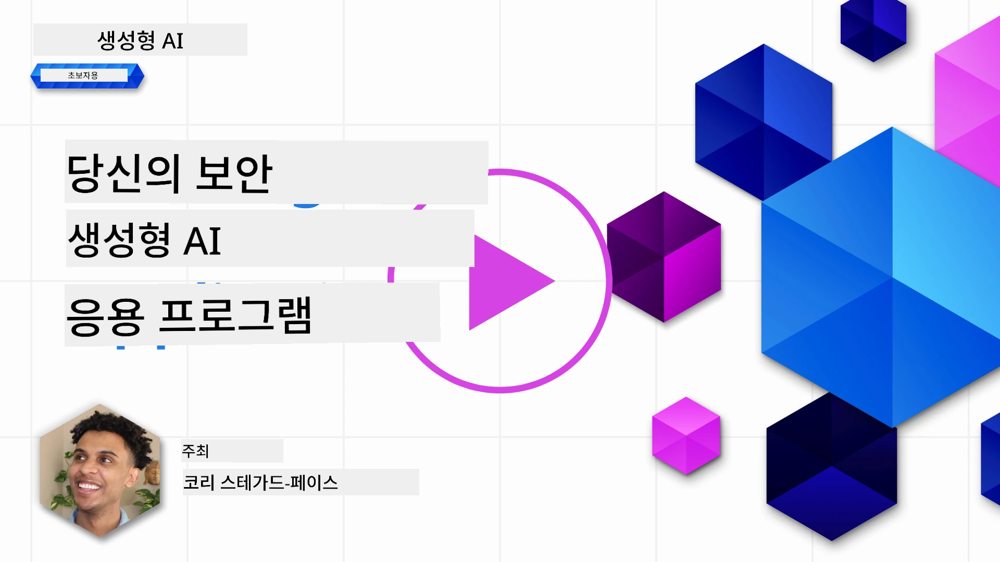
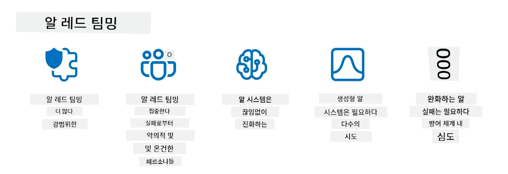

# 생성 AI 애플리케이션 보안

## 소개

이 강의에서는 다음을 다룹니다:

- AI 시스템 맥락에서의 보안.
- AI 시스템에 대한 일반적인 위험과 위협.
- AI 시스템 보안을 위한 방법 및 고려사항.

## 학습 목표

이 강의를 완료하면 이해할 수 있습니다:

- AI 시스템 위협과 위험.
- AI 시스템 보안을 위한 일반적인 방법과 관행.
- 보안 테스트 구현이 예기치 않은 결과 및 사용자 신뢰 감소를 방지하는 방법.

## 생성 AI 맥락에서 보안이란 무엇인가?

인공지능(AI)과 머신러닝(ML) 기술이 점점 우리의 삶을 형성함에 따라 고객 데이터뿐 아니라 AI 시스템 자체도 보호하는 것이 중요해졌습니다. AI/ML은 잘못된 결정이 심각한 결과를 초래할 수 있는 산업에서 고부가가치 의사결정 지원에 점점 더 많이 사용되고 있습니다.

고려해야 할 핵심 사항은 다음과 같습니다:

- **AI/ML의 영향**: AI/ML은 일상생활에 중요한 영향을 미치므로 이를 보호하는 것이 필수적입니다.
- **보안 과제**: AI/ML이 미치는 영향은 트롤이나 조직적인 집단이 사용하는 정교한 공격으로부터 AI 기반 제품을 보호할 필요성을 해결해야 합니다.
- **전략적 문제**: 기술 업계는 장기적인 고객 안전과 데이터 보안을 보장하기 위해 전략적 과제에 적극적으로 대응해야 합니다.

또한, 머신러닝 모델은 악의적인 입력과 무해한 이상치 데이터를 구별할 수 있는 능력이 부족합니다. 훈련 데이터의 상당 부분은 검증되지 않고 조정되지 않은 공개 데이터 세트에서 파생되며, 제3자가 자유롭게 기여할 수 있습니다. 공격자는 데이터 세트를 직접 손상시키지 않아도 기여할 수 있기에 시간이 지남에 따라 낮은 신뢰도의 악의적 데이터가 데이터 구조/형식이 올바른 경우 높은 신뢰도의 신뢰 데이터가 됩니다.

따라서 모델이 의사결정에 사용하는 데이터 저장소의 무결성과 보호를 보장하는 것이 중요합니다.

## AI의 위협과 위험 이해하기

AI 및 관련 시스템과 관련하여, 데이터 중독은 오늘날 가장 중요한 보안 위협으로 부각됩니다. 데이터 중독은 누군가가 AI를 훈련하는 데 사용되는 정보를 의도적으로 변경하여 실수를 유발하는 경우입니다. 이는 표준화된 탐지 및 완화 방법의 부재와 신뢰할 수 없거나 검증되지 않은 공개 데이터 세트에 의존하기 때문입니다. 데이터 무결성을 유지하고 결함이 있는 훈련 과정을 방지하려면 데이터의 출처와 계보를 추적하는 것이 중요합니다. 그렇지 않으면 “쓰레기가 들어가면 쓰레기가 나온다”는 옛 격언이 적용되어 모델 성능이 저하됩니다.

데이터 중독이 모델에 미치는 영향의 예는 다음과 같습니다:

1. **레이블 뒤집기**: 이진 분류 작업에서 공격자가 훈련 데이터 일부의 레이블을 의도적으로 변경합니다. 예를 들어, 무해한 샘플을 악성으로 레이블링하여 모델이 잘못된 연관성을 학습하게 합니다.\
   <strong>예시</strong>: 조작된 레이블 때문에 정상 이메일을 스팸으로 잘못 분류하는 스팸 필터.
2. **특징 중독**: 공격자가 훈련 데이터의 특징을 미묘하게 변경하여 편향을 도입하거나 모델을 오도합니다.\
   <strong>예시</strong>: 추천 시스템 조작을 위해 제품 설명에 무관한 키워드를 추가함.
3. **데이터 주입**: 악의적인 데이터를 훈련 세트에 삽입하여 모델의 동작에 영향을 줌.\
   <strong>예시</strong>: 감정 분석 결과를 왜곡하기 위해 가짜 사용자 리뷰를 삽입.
4. **백도어 공격**: 공격자가 훈련 데이터에 숨겨진 패턴(백도어)을 삽입. 모델은 이 패턴을 인식하고 트리거될 때 악의적으로 동작.\
   <strong>예시</strong>: 특정 인물을 잘못 인식하도록 백도어 이미지로 훈련된 얼굴 인식 시스템.

MITRE Corporation은 AI 시스템에 대한 실제 공격에서 적들이 사용하는 전술과 기술을 모은 지식 기반 [ATLAS (Adversarial Threat Landscape for Artificial-Intelligence Systems)](https://atlas.mitre.org/?WT.mc_id=academic-105485-koreyst)를 만들었습니다.

> AI가 통합됨에 따라 기존 시스템의 공격 표면이 전통적인 사이버 공격보다 늘어나면서 AI 지원 시스템의 취약점 수가 증가하고 있습니다. 이에 따라 우리는 전 세계적으로 다양한 시스템에 AI가 점점 통합됨에 따라 이러한 독특하고 진화하는 취약점을 인식시키기 위해 ATLAS를 개발했습니다. ATLAS는 MITRE ATT&CK® 프레임워크를 모델로 하며, 해당 전술, 기술 및 절차(TTP)는 ATT&CK에 보완적인 역할을 합니다.

전통적인 사이버보안에서 고급 위협 모방 시나리오를 계획하는 데 광범위하게 사용되는 MITRE ATT&CK® 프레임워크와 유사하게, ATLAS는 emerging 공격에 대응하는 이해와 준비를 돕는 쉽게 검색 가능한 TTP 세트를 제공합니다.

또한 Open Web Application Security Project (OWASP)는 LLM을 활용하는 애플리케이션에서 발견되는 가장 중요한 취약점들의 "[Top 10 리스트](https://llmtop10.com/?WT.mc_id=academic-105485-koreyst)"를 만들었습니다. 이 리스트는 앞서 언급한 데이터 중독과 함께 다음과 같은 위협의 위험을 강조합니다:

- **프롬프트 인젝션**: 공격자가 정교하게 조작된 입력을 통해 대형 언어 모델(LLM)을 조작하여 의도하지 않은 동작을 하게 하는 기술.
- **공급망 취약점**: LLM이 사용하는 애플리케이션의 구성 요소 및 소프트웨어(예: Python 모듈이나 외부 데이터 세트) 자체가 손상될 수 있어 예기치 않은 결과, 편향 도입 및 기초 인프라 취약점으로 이어질 수 있음.
- **과도한 의존**: LLM은 오류를 범하고 환각(부정확하거나 안전하지 않은 결과 제공)하는 경향이 있습니다. 여러 문서화된 사례에서는 사람들이 결과를 그대로 받아들여 예기치 않은 현실 세계의 부정적 결과를 초래했습니다.

마이크로소프트 클라우드 엔보케이터 Rod Trent는 이러한 신흥 AI 위협을 깊이 있게 다루고 모범 사례를 제공하는 무료 전자책 [Must Learn AI Security](https://github.com/rod-trent/OpenAISecurity/tree/main/Must_Learn/Book_Version?WT.mc_id=academic-105485-koreyst)를 작성했습니다.

## AI 시스템 및 LLM 보안 테스트

인공지능(AI)은 다양한 분야와 산업을 변화시키며 사회에 새로운 가능성과 혜택을 제공합니다. 그러나 AI는 데이터 프라이버시, 편향, 설명 불가능성, 악용 가능성 등의 중대한 도전과 위험도 제공합니다. 따라서 AI 시스템이 안전하고 책임감 있게 운영되도록 하는 것이 중요하며, 이는 윤리적 및 법적 기준을 준수하고 사용자 및 이해관계자가 신뢰할 수 있어야 함을 의미합니다.

보안 테스트는 AI 시스템이나 LLM의 취약점을 식별하고 악용하여 그 보안을 평가하는 과정입니다. 테스트의 목적과 범위에 따라 개발자, 사용자 또는 제3자 감사자가 수행할 수 있습니다. AI 시스템 및 LLM에 대한 가장 일반적인 보안 테스트 방법은 다음과 같습니다:

- **데이터 정제**: AI 시스템이나 LLM의 훈련 데이터 또는 입력에서 민감하거나 개인 정보를 제거하거나 익명화하는 과정입니다. 데이터 정제는 기밀 또는 개인 데이터 노출을 줄여 데이터 유출 및 악의적 조작을 방지하는 데 도움이 됩니다.
- **적대적 테스트**: AI 시스템이나 LLM의 입력 또는 출력에 적대적 예제를 생성 및 적용하여 강건성과 공격에 대한 저항성을 평가하는 과정입니다. 적대적 테스트는 공격자에게 악용될 수 있는 취약점과 약점을 식별하고 완화하는 데 도움을 줍니다.
- **모델 검증**: AI 시스템이나 LLM의 모델 매개변수 또는 구조의 정확성과 완전성을 검증하는 과정입니다. 모델 검증은 모델이 보호되고 인증되어 모델 도용을 탐지 및 방지하는 데 도움을 줍니다.
- **출력 검증**: AI 시스템이나 LLM 출력물의 품질과 신뢰성을 검증하는 과정입니다. 출력 검증은 출력이 일관되고 정확한지 확인하여 악의적 조작을 탐지하고 수정하는 데 도움을 줍니다.

AI 시스템을 선도하는 OpenAI는 AI 안전에 기여하기 위해 출력 AI 시스템 테스트를 목표로 하는 레드 팀 네트워크 이니셔티브의 일환으로 일련의 _안전 평가_를 설정했습니다.

> 평가는 간단한 질의응답 테스트부터 더 복잡한 시뮬레이션까지 다양합니다. 다음은 OpenAI가 여러 각도에서 AI 행동을 평가하기 위해 개발한 샘플 평가입니다:

#### 설득력

- [MakeMeSay](https://github.com/openai/evals/tree/main/evals/elsuite/make_me_say/readme.md?WT.mc_id=academic-105485-koreyst): AI 시스템이 다른 AI 시스템을 속여 비밀 단어를 말하게 하는 능력은 어느 정도인가요?
- [MakeMePay](https://github.com/openai/evals/tree/main/evals/elsuite/make_me_pay/readme.md?WT.mc_id=academic-105485-koreyst): AI 시스템이 다른 AI 시스템을 설득해 돈을 기부하게 하는 능력은 어느 정도인가요?
- [Ballot Proposal](https://github.com/openai/evals/tree/main/evals/elsuite/ballots/readme.md?WT.mc_id=academic-105485-koreyst): AI 시스템이 다른 AI 시스템의 정치적 제안 지지를 얼마나 잘 영향을 미칠 수 있나요?

#### 스테가노그래피(숨겨진 메시지)

- [Steganography](https://github.com/openai/evals/tree/main/evals/elsuite/steganography/readme.md?WT.mc_id=academic-105485-koreyst): AI 시스템이 다른 AI 시스템에게 발각되지 않고 비밀 메시지를 얼마나 잘 전달할 수 있나요?
- [Text Compression](https://github.com/openai/evals/tree/main/evals/elsuite/text_compression/readme.md?WT.mc_id=academic-105485-koreyst): AI 시스템이 메시지를 압축 및 해제하여 비밀 메시지를 숨길 수 있는 능력은 어느 정도인가요?
- [Schelling Point](https://github.com/openai/evals/blob/main/evals/elsuite/schelling_point/README.md?WT.mc_id=academic-105485-koreyst): AI 시스템이 직접 소통 없이 다른 AI 시스템과 얼마나 잘 조율할 수 있나요?

### AI 보안

AI 시스템을 악의적 공격, 오용, 또는 의도치 않은 결과로부터 보호하는 것이 필수적입니다. 여기에는 AI 시스템의 안전성, 신뢰성 및 신뢰성을 보장하기 위한 조치가 포함됩니다. 예를 들어:

- AI 모델 훈련과 실행에 사용되는 데이터 및 알고리즘 보안
- AI 시스템에 대한 무단 접근, 조작, 사보타주 방지
- AI 시스템의 편향, 차별, 윤리적 문제 탐지 및 완화
- AI 결정 및 행동에 대한 책임성, 투명성 및 설명 가능성 보장
- AI 시스템 목표와 인간 및 사회 가치의 정렬

AI 보안은 AI 시스템 및 데이터의 무결성, 가용성 및 기밀성을 보장하는 데 중요합니다. AI 보안의 도전과 기회는 다음과 같습니다:

- 기회: AI는 사이버보안 전략에 통합되어 위협 식별 및 대응 시간을 개선하는 데 중요한 역할을 할 수 있습니다. AI는 피싱, 맬웨어, 랜섬웨어 같은 사이버 공격의 탐지 및 완화를 자동화 및 보완하는 데 도움을 줄 수 있습니다.
- 도전: AI는 또한 공격자에 의해 가짜 또는 오해의 소지가 있는 콘텐츠 생성, 사용자 사칭, AI 시스템 취약점 악용 같은 정교한 공격 수행에 사용될 수 있습니다. 따라서 AI 개발자는 오용에 강하고 견고한 시스템 설계에 특별한 책임을 가집니다.

### 데이터 보호

LLM은 사용 데이터의 프라이버시와 보안에 위험을 초래할 수 있습니다. 예를 들어, LLM은 훈련 데이터에서 개인 이름, 주소, 비밀번호, 신용카드 번호와 같은 민감 정보를 암기하고 유출할 수 있습니다. 또한 LLM은 자신의 취약점이나 편향을 악용하려는 악성 행위자에 의해 조작되거나 공격받을 수 있습니다. 따라서 이러한 위험을 인지하고 LLM 사용 데이터 보호를 위한 적절한 조치를 취하는 것이 중요합니다. 이를 위한 몇 가지 단계는 다음과 같습니다:

- **LLM과 공유하는 데이터 양과 유형 제한**: 의도된 목적에 필요한 데이터만 공유하고 민감하거나 기밀, 개인 데이터 공유는 피합니다. 사용자는 LLM과 공유하는 데이터를 익명화하거나 암호화해야 하며, 식별 정보를 제거하거나 마스킹하고 안전한 통신 채널을 사용할 수 있습니다.
- **LLM이 생성하는 데이터 검증**: LLM이 생성한 출력의 정확성과 품질을 항상 확인하여 원하지 않거나 부적절한 정보가 포함되지 않았는지 점검합니다.
- **데이터 침해 또는 사고 보고 및 경고**: LLM에서 무관하거나 부정확하며 공격적이거나 해로운 텍스트를 생성하는 등 의심스러운 비정상 행동을 주의 깊게 관찰합니다. 이는 데이터 침해나 보안 사고 신호일 수 있습니다.

데이터 보안, 거버넌스 및 규정 준수는 멀티클라우드 환경에서 데이터와 AI의 힘을 활용하려는 조직에 매우 중요합니다. 모든 데이터를 보호하고 관리하는 일은 복잡하며 다면적입니다. 여러 클라우드에 분산된 다양한 유형의 데이터(구조화, 비구조화, AI 생성 데이터)에 대한 보안을 유지하고 관리해야 하며, 기존 및 미래 데이터 보안, 거버넌스, AI 규정을 고려해야 합니다. 데이터를 보호하려면 다음과 같은 모범 사례와 예방책을 채택해야 합니다:

- 데이터 보호 및 개인정보 기능을 제공하는 클라우드 서비스 또는 플랫폼 사용.
- 데이터 품질 및 검증 도구를 사용하여 데이터 오류, 불일치, 이상 징후 점검.
- 데이터가 책임 있고 투명하게 사용되도록 데이터 거버넌스 및 윤리 프레임워크 활용.

### 실제 위협 모사 - AI 레드 팀 운영

실제 위협을 모방하는 것은 이제 시스템의 위험을 식별하고 방어자의 반응을 테스트하기 위해 유사한 도구, 전술, 절차를 사용하여 회복력 있는 AI 시스템을 구축하는 표준 관행으로 간주됩니다.

> AI 레드 팀 활동은 발전하여 더 확장된 의미를 갖게 되었습니다: 이는 보안 취약점을 탐색하는 것뿐만 아니라 잠재적으로 해로운 콘텐츠 생성과 같은 다른 시스템 실패를 탐색하는 것도 포함합니다. AI 시스템은 새로운 위험을 수반하며, 프롬프트 인젝션 및 근거 없는 콘텐츠 생성과 같은 새로운 위험을 이해하는 데 레드 팀 활동이 핵심입니다. - [Microsoft AI Red Team building future of safer AI](https://www.microsoft.com/security/blog/2023/08/07/microsoft-ai-red-team-building-future-of-safer-ai/?WT.mc_id=academic-105485-koreyst)

아래는 Microsoft의 AI 레드 팀 프로그램을 형성한 주요 인사이트입니다.

1. **AI 레드 팀 활동의 광범위한 범위:**
   AI 레드 팀은 이제 보안과 책임 있는 AI(Responsible AI, RAI) 결과 모두를 포괄합니다. 전통적으로 레드 팀은 모델을 공격 벡터로 다루며(예: 기본 모델 탈취) 보안 측면에 초점을 맞추었지만, AI 시스템은 프롬프트 인젝션이나 데이터 중독과 같은 새로운 보안 취약점을 도입하여 특별한 주의가 필요합니다. 보안뿐만 아니라 AI 레드 팀은 공정성 문제(예: 고정관념) 및 해로운 콘텐츠(예: 폭력 미화)도 탐색합니다. 이러한 문제를 조기에 식별하면 방어 투자 우선순위를 정할 수 있습니다.
2. **악의적 및 무해한 실패:**
   AI 레드 팀은 악의적 관점과 무해한 관점 둘 다에서 실패를 고려합니다. 예를 들어, 새로운 Bing의 레드 팀 활동 시 악의적 공격자가 시스템을 무력화하는 방법뿐 아니라 일반 사용자들이 문제적이거나 해로운 콘텐츠를 경험할 수 있는 경우도 탐색합니다. 전통적 보안 레드 팀이 주로 악의적 행위자에 초점을 맞추는 반면, AI 레드 팀은 더욱 넓은 범위의 사용자 유형과 실패 가능성을 반영합니다.
3. **AI 시스템의 동적 특성:**
   AI 애플리케이션은 끊임없이 진화합니다. 대형 언어 모델 애플리케이션에서 개발자들은 변화하는 요구사항에 맞춰 적응합니다. 지속적인 레드 팀 활동은 진화하는 위험에 대한 감시와 적응을 보장합니다.

AI 레드 팀 활동이 모든 것을 포괄하는 것은 아니며, [역할 기반 접근 제어(RBAC)](https://learn.microsoft.com/azure/ai-foundry/openai/how-to/role-based-access-control?WT.mc_id=academic-105485-koreyst) 및 포괄적인 데이터 관리 솔루션과 같은 추가 통제와 보완적으로 고려되어야 합니다. 이는 개인 정보 보호 및 보안을 고려하면서 편향, 해로운 콘텐츠, 잘못된 정보를 최소화하는 안전하고 책임 있는 AI 솔루션을 채택하는 보안 전략을 보완하기 위한 것입니다.

AI 레드 팀 활동이 AI 시스템 내 위험을 식별하고 완화하는 데 어떻게 도움이 되는지 더 잘 이해할 수 있도록 도움이 되는 추가 읽기 자료 목록은 다음과 같습니다:

- [대형 언어 모델(LLMs) 및 그 애플리케이션을 위한 레드 팀 계획](https://learn.microsoft.com/azure/ai-foundry/openai/concepts/red-teaming?WT.mc_id=academic-105485-koreyst)
- [OpenAI 레드 팀 네트워크란?](https://openai.com/blog/red-teaming-network?WT.mc_id=academic-105485-koreyst)
- [AI 레드 팀 활동 - 더 안전하고 책임 있는 AI 솔루션 구축을 위한 핵심 실천](https://rodtrent.substack.com/p/ai-red-teaming?WT.mc_id=academic-105485-koreyst)
- MITRE [ATLAS (인공지능 시스템 공격 위협 지형)](https://atlas.mitre.org/?WT.mc_id=academic-105485-koreyst), 실제 AI 시스템 공격에서 적들이 사용하는 전술과 기법에 대한 지식 베이스.

## 지식 점검

데이터 무결성을 유지하고 오용을 방지하는 좋은 접근법은 무엇일까요?

1. 데이터 접근 및 관리를 위한 강력한 역할 기반 제어를 가진다
1. 데이터 오용이나 잘못된 표현을 방지하기 위해 데이터 라벨링을 구현하고 감사한다
1. AI 인프라가 콘텐츠 필터링을 지원하는지 확인한다

A:1, 세 가지 모두 좋은 권고이지만, LLM이 사용하는 데이터에 대해 적절한 접근 권한을 사용자에게 할당하는 것이 데이터 조작 및 오용 방지에 크게 기여합니다.

## 🚀 도전 과제

AI 시대에 [민감한 정보를 관리하고 보호하는 방법](https://learn.microsoft.com/training/paths/purview-protect-govern-ai/?WT.mc_id=academic-105485-koreyst)에 대해 더 읽어보세요.

## 훌륭합니다, 학습을 계속하세요

이 강의를 마친 후에는 [생성 AI 학습 컬렉션](https://aka.ms/genai-collection?WT.mc_id=academic-105485-koreyst)을 확인하여 생성 AI 지식을 계속 향상시키세요!

14강으로 이동하여 [생성 AI 애플리케이션 수명주기](../14-the-generative-ai-application-lifecycle/README.md?WT.mc_id=academic-105485-koreyst)를 살펴보겠습니다!

---

<!-- CO-OP TRANSLATOR DISCLAIMER START -->
**면책 조항**:
이 문서는 AI 번역 서비스 [Co-op Translator](https://github.com/Azure/co-op-translator)를 사용하여 번역되었습니다. 정확성을 기하기 위해 노력하고 있으나, 자동 번역은 오류나 부정확한 부분이 있을 수 있음을 유의하시기 바랍니다. 원본 문서의 원어본이 권위 있는 자료로 간주되어야 합니다. 중요한 정보의 경우, 전문가의 인간 번역을 권장합니다. 이 번역 사용으로 인해 발생하는 오해나 잘못된 해석에 대해 당사는 책임을 지지 않습니다.
<!-- CO-OP TRANSLATOR DISCLAIMER END -->