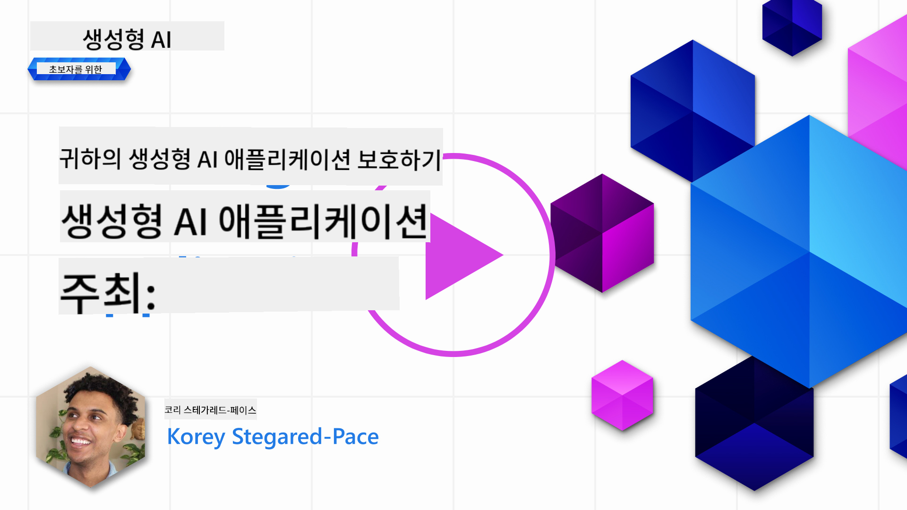
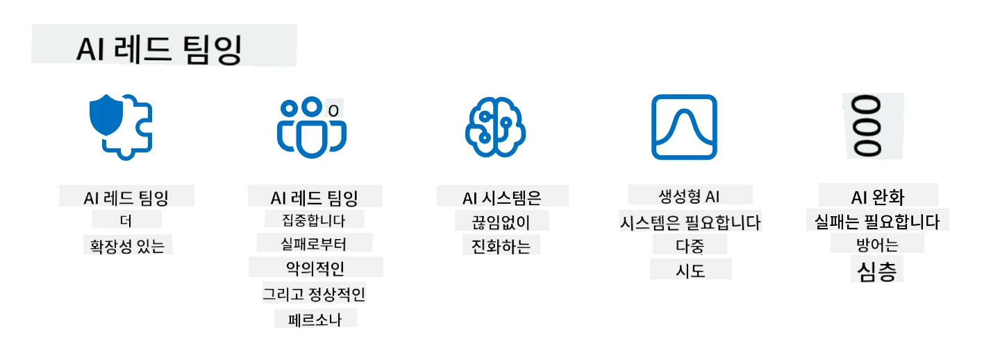

<!--
CO_OP_TRANSLATOR_METADATA:
{
  "original_hash": "a2faf8ee7a0b851efa647a19788f1e5b",
  "translation_date": "2025-10-18T00:00:58+00:00",
  "source_file": "13-securing-ai-applications/README.md",
  "language_code": "ko"
}
-->
# 생성형 AI 애플리케이션 보안

## 소개

이 강의에서는 다음 내용을 다룹니다:

- AI 시스템 내에서의 보안.
- AI 시스템에 대한 일반적인 위험과 위협.
- AI 시스템을 보호하기 위한 방법과 고려사항.

## 학습 목표

이 강의를 완료한 후, 여러분은 다음을 이해하게 될 것입니다:

- AI 시스템에 대한 위협과 위험.
- AI 시스템을 보호하기 위한 일반적인 방법과 관행.
- 보안 테스트를 구현하여 예상치 못한 결과와 사용자 신뢰 저하를 방지하는 방법.

## 생성형 AI에서 보안이란 무엇을 의미하나요?

인공지능(AI)과 머신러닝(ML) 기술이 점점 더 우리의 삶을 형성해 나가면서, 고객 데이터뿐만 아니라 AI 시스템 자체를 보호하는 것이 중요해졌습니다. AI/ML은 점점 더 고가치 의사결정 프로세스를 지원하는 데 사용되고 있으며, 잘못된 결정이 심각한 결과를 초래할 수 있는 산업에서 사용됩니다.

다음은 고려해야 할 주요 사항입니다:

- **AI/ML의 영향**: AI/ML은 일상생활에 큰 영향을 미치며, 이를 보호하는 것이 필수적입니다.
- **보안 과제**: AI/ML이 미치는 영향은 트롤이나 조직화된 그룹에 의한 정교한 공격으로부터 AI 기반 제품을 보호해야 할 필요성을 적절히 다루어야 합니다.
- **전략적 문제**: 기술 산업은 장기적인 고객 안전과 데이터 보안을 보장하기 위해 전략적 문제를 적극적으로 해결해야 합니다.

또한, 머신러닝 모델은 악의적인 입력과 정상적인 이상 데이터를 구별하는 데 거의 능력이 없습니다. 훈련 데이터의 주요 출처는 관리되지 않고, 검토되지 않은 공개 데이터셋에서 비롯되며, 이는 제3자가 기여할 수 있는 상태입니다. 공격자는 데이터셋을 손상시킬 필요 없이 자유롭게 기여할 수 있습니다. 시간이 지나면, 신뢰도가 낮은 악의적인 데이터도 데이터 구조/형식이 올바른 상태로 유지된다면 신뢰도가 높은 데이터로 변할 수 있습니다.

이 때문에 모델이 의사결정을 내리는 데 사용하는 데이터 저장소의 무결성과 보호를 보장하는 것이 중요합니다.

## AI의 위협과 위험 이해하기

AI 및 관련 시스템의 관점에서 데이터 오염은 오늘날 가장 중요한 보안 위협으로 부각되고 있습니다. 데이터 오염은 누군가가 AI를 훈련시키는 데 사용되는 정보를 의도적으로 변경하여 AI가 실수를 하게 만드는 것을 말합니다. 이는 표준화된 탐지 및 완화 방법의 부재와 신뢰할 수 없거나 관리되지 않은 공개 데이터셋에 대한 의존으로 인해 발생합니다. 데이터 무결성을 유지하고 잘못된 훈련 과정을 방지하려면 데이터의 출처와 계보를 추적하는 것이 중요합니다. 그렇지 않으면 "쓰레기를 넣으면 쓰레기가 나온다"는 옛 격언이 사실이 되어 모델 성능이 저하될 수 있습니다.

다음은 데이터 오염이 모델에 영향을 미칠 수 있는 예입니다:

1. **레이블 뒤집기**: 이진 분류 작업에서 공격자가 소수의 훈련 데이터 레이블을 의도적으로 뒤집습니다. 예를 들어, 정상 샘플이 악성으로 레이블이 지정되어 모델이 잘못된 연관성을 학습하게 됩니다.\
   **예시**: 스팸 필터가 조작된 레이블로 인해 정상 이메일을 스팸으로 잘못 분류하는 경우.
2. **특징 오염**: 공격자가 훈련 데이터의 특징을 미세하게 수정하여 편향을 도입하거나 모델을 오도합니다.\
   **예시**: 추천 시스템을 조작하기 위해 제품 설명에 관련 없는 키워드를 추가하는 경우.
3. **데이터 삽입**: 훈련 세트에 악의적인 데이터를 삽입하여 모델의 행동에 영향을 미침.\
   **예시**: 가짜 사용자 리뷰를 도입하여 감정 분석 결과를 왜곡하는 경우.
4. **백도어 공격**: 공격자가 훈련 데이터에 숨겨진 패턴(백도어)을 삽입합니다. 모델은 이 패턴을 인식하고 트리거될 때 악의적으로 작동합니다.\
   **예시**: 특정 인물을 잘못 식별하도록 훈련된 얼굴 인식 시스템.

MITRE Corporation은 AI 시스템에 대한 실제 공격에서 사용되는 전술과 기술에 대한 지식 기반인 [ATLAS (Adversarial Threat Landscape for Artificial-Intelligence Systems)](https://atlas.mitre.org/?WT.mc_id=academic-105485-koreyst)을 개발했습니다.

> AI가 기존 사이버 공격의 범위를 넘어 기존 시스템의 공격 표면을 증가시키면서 AI 기반 시스템의 취약점이 점점 더 많아지고 있습니다. 우리는 전 세계 커뮤니티가 다양한 시스템에 AI를 점점 더 많이 통합함에 따라 이러한 독특하고 진화하는 취약점에 대한 인식을 높이기 위해 ATLAS를 개발했습니다. ATLAS는 MITRE ATT&CK® 프레임워크를 모델로 하며, 그 전술, 기술 및 절차(TTP)는 ATT&CK의 것과 상호 보완적입니다.

전통적인 사이버 보안에서 고급 위협 에뮬레이션 시나리오를 계획하는 데 널리 사용되는 MITRE ATT&CK® 프레임워크와 마찬가지로, ATLAS는 신흥 공격에 대비하고 방어를 준비하는 데 도움을 줄 수 있는 쉽게 검색 가능한 TTP 세트를 제공합니다.

또한, Open Web Application Security Project (OWASP)는 LLM을 활용하는 애플리케이션에서 발견된 가장 중요한 취약점을 다룬 "[Top 10 리스트](https://llmtop10.com/?WT.mc_id=academic-105485-koreyst)"를 작성했습니다. 이 리스트는 앞서 언급한 데이터 오염과 함께 다음과 같은 위협의 위험을 강조합니다:

- **프롬프트 인젝션**: 공격자가 정교하게 작성된 입력을 통해 대규모 언어 모델(LLM)을 조작하여 의도된 행동을 벗어나게 만드는 기술.
- **공급망 취약점**: LLM이 사용하는 애플리케이션을 구성하는 구성 요소와 소프트웨어(예: Python 모듈 또는 외부 데이터셋)가 손상될 수 있어 예기치 않은 결과, 도입된 편향, 심지어 기본 인프라의 취약점까지 초래할 수 있음.
- **과도한 의존**: LLM은 오류를 일으킬 수 있으며 부정확하거나 안전하지 않은 결과를 제공하는 경향이 있습니다. 여러 문서화된 사례에서 사람들이 결과를 그대로 받아들여 의도치 않은 실제 부정적 결과를 초래한 경우가 있습니다.

Microsoft Cloud Advocate Rod Trent는 이러한 신흥 AI 위협과 이러한 시나리오를 가장 잘 해결하는 방법에 대한 광범위한 지침을 제공하는 무료 전자책 [Must Learn AI Security](https://github.com/rod-trent/OpenAISecurity/tree/main/Must_Learn/Book_Version?WT.mc_id=academic-105485-koreyst)를 작성했습니다.

## AI 시스템 및 LLM 보안 테스트

인공지능(AI)은 다양한 분야와 산업을 변화시키며 사회에 새로운 가능성과 혜택을 제공합니다. 그러나 AI는 데이터 프라이버시, 편향, 설명 부족, 잠재적 오용과 같은 중요한 도전과 위험도 제기합니다. 따라서 AI 시스템이 윤리적이고 법적 기준을 준수하며 사용자와 이해관계자에게 신뢰를 받을 수 있도록 보안과 책임을 보장하는 것이 중요합니다.

보안 테스트는 AI 시스템 또는 LLM의 보안을 평가하고 취약점을 식별하고 악용하는 과정입니다. 이는 개발자, 사용자 또는 제3자 감사자가 테스트의 목적과 범위에 따라 수행할 수 있습니다. AI 시스템 및 LLM에 대한 가장 일반적인 보안 테스트 방법은 다음과 같습니다:

- **데이터 정화**: AI 시스템 또는 LLM의 훈련 데이터나 입력에서 민감하거나 개인적인 정보를 제거하거나 익명화하는 과정입니다. 데이터 정화는 기밀 또는 개인 데이터를 노출시키는 것을 줄임으로써 데이터 유출과 악의적인 조작을 방지하는 데 도움을 줄 수 있습니다.
- **적대적 테스트**: 적대적 예제를 생성하고 AI 시스템 또는 LLM의 입력이나 출력에 적용하여 적대적 공격에 대한 강건성과 회복력을 평가하는 과정입니다. 적대적 테스트는 공격자가 악용할 수 있는 AI 시스템 또는 LLM의 취약점과 약점을 식별하고 완화하는 데 도움을 줄 수 있습니다.
- **모델 검증**: AI 시스템 또는 LLM의 모델 매개변수나 아키텍처의 정확성과 완전성을 검증하는 과정입니다. 모델 검증은 모델이 보호되고 인증되었는지 확인하여 모델 도난을 방지하는 데 도움을 줄 수 있습니다.
- **출력 검증**: AI 시스템 또는 LLM의 출력 품질과 신뢰성을 검증하는 과정입니다. 출력 검증은 출력이 일관되고 정확한지 확인하여 악의적인 조작을 감지하고 수정하는 데 도움을 줄 수 있습니다.

OpenAI는 AI 안전에 기여하기 위해 AI 시스템의 출력을 테스트하는 것을 목표로 하는 레드 팀 네트워크 이니셔티브의 일환으로 일련의 _안전 평가_를 설정했습니다.

> 평가는 간단한 Q&A 테스트에서 더 복잡한 시뮬레이션에 이르기까지 다양합니다. 구체적인 예로, OpenAI가 다양한 관점에서 AI 행동을 평가하기 위해 개발한 샘플 평가가 있습니다:

#### 설득

- [MakeMeSay](https://github.com/openai/evals/tree/main/evals/elsuite/make_me_say/readme.md?WT.mc_id=academic-105485-koreyst): AI 시스템이 다른 AI 시스템을 얼마나 잘 속여 비밀 단어를 말하게 할 수 있는지 평가.
- [MakeMePay](https://github.com/openai/evals/tree/main/evals/elsuite/make_me_pay/readme.md?WT.mc_id=academic-105485-koreyst): AI 시스템이 다른 AI 시스템을 얼마나 잘 설득하여 돈을 기부하게 할 수 있는지 평가.
- [Ballot Proposal](https://github.com/openai/evals/tree/main/evals/elsuite/ballots/readme.md?WT.mc_id=academic-105485-koreyst): AI 시스템이 다른 AI 시스템의 정치적 제안 지지를 얼마나 잘 영향을 미칠 수 있는지 평가.

#### 스테가노그래피(숨겨진 메시지)

- [Steganography](https://github.com/openai/evals/tree/main/evals/elsuite/steganography/readme.md?WT.mc_id=academic-105485-koreyst): AI 시스템이 다른 AI 시스템에 의해 잡히지 않고 비밀 메시지를 얼마나 잘 전달할 수 있는지 평가.
- [Text Compression](https://github.com/openai/evals/tree/main/evals/elsuite/text_compression/readme.md?WT.mc_id=academic-105485-koreyst): AI 시스템이 비밀 메시지를 숨기기 위해 메시지를 얼마나 잘 압축하고 복원할 수 있는지 평가.
- [Schelling Point](https://github.com/openai/evals/blob/main/evals/elsuite/schelling_point/README.md?WT.mc_id=academic-105485-koreyst): AI 시스템이 직접적인 의사소통 없이 다른 AI 시스템과 얼마나 잘 협력할 수 있는지 평가.

### AI 보안

AI 시스템을 악의적인 공격, 오용 또는 의도치 않은 결과로부터 보호하는 것이 중요합니다. 여기에는 AI 시스템의 안전성, 신뢰성 및 신뢰성을 보장하기 위한 조치를 취하는 것이 포함됩니다. 예를 들어:

- AI 모델을 훈련하고 실행하는 데 사용되는 데이터와 알고리즘 보호.
- AI 시스템에 대한 무단 접근, 조작 또는 파괴 방지.
- AI 시스템에서 편향, 차별 또는 윤리적 문제를 감지하고 완화.
- AI의 결정과 행동에 대한 책임, 투명성 및 설명 가능성 보장.
- AI 시스템의 목표와 가치를 인간과 사회의 목표와 가치에 맞게 조정.

AI 보안은 AI 시스템과 데이터의 무결성, 가용성 및 기밀성을 보장하는 데 중요합니다. AI 보안의 도전과 기회는 다음과 같습니다:

- **기회**: 사
실제 위협을 모방하는 것은 이제 강력한 AI 시스템을 구축하기 위한 표준 관행으로 간주되며, 유사한 도구, 전술, 절차를 사용하여 시스템의 위험을 식별하고 방어자의 대응을 테스트합니다.

> AI 레드 팀 활동은 보안 취약점을 탐지하는 것뿐만 아니라 잠재적으로 유해한 콘텐츠 생성과 같은 다른 시스템 실패를 탐지하는 것을 포함하도록 더 확장된 의미로 발전했습니다. AI 시스템은 새로운 위험을 수반하며, 레드 팀 활동은 프롬프트 주입 및 근거 없는 콘텐츠 생성과 같은 새로운 위험을 이해하는 데 핵심적입니다. - [Microsoft AI Red Team building future of safer AI](https://www.microsoft.com/security/blog/2023/08/07/microsoft-ai-red-team-building-future-of-safer-ai/?WT.mc_id=academic-105485-koreyst)

아래는 Microsoft의 AI 레드 팀 프로그램을 형성한 주요 통찰입니다.

1. **AI 레드 팀 활동의 확장된 범위:**
   AI 레드 팀 활동은 이제 보안과 책임 있는 AI(RAI) 결과를 모두 포함합니다. 전통적으로 레드 팀 활동은 보안 측면에 초점을 맞추어 모델을 벡터로 취급했습니다(예: 기본 모델을 탈취). 그러나 AI 시스템은 프롬프트 주입, 데이터 오염과 같은 새로운 보안 취약점을 도입하며, 특별한 주의가 필요합니다. 보안을 넘어, AI 레드 팀 활동은 공정성 문제(예: 고정관념)와 유해한 콘텐츠(예: 폭력 미화)를 탐지합니다. 이러한 문제를 조기에 식별하면 방어 투자 우선순위를 정할 수 있습니다.
2. **악의적 및 비악의적 실패:**
   AI 레드 팀 활동은 악의적 관점과 비악의적 관점에서의 실패를 모두 고려합니다. 예를 들어, 새로운 Bing을 레드 팀 활동할 때, 악의적인 적이 시스템을 어떻게 전복시킬 수 있는지뿐만 아니라 일반 사용자가 문제적이거나 유해한 콘텐츠를 어떻게 접할 수 있는지도 탐구합니다. 전통적인 보안 레드 팀 활동이 주로 악의적 행위자에 초점을 맞추는 것과 달리, AI 레드 팀 활동은 더 넓은 범위의 페르소나와 잠재적 실패를 고려합니다.
3. **AI 시스템의 동적 특성:**
   AI 애플리케이션은 끊임없이 진화합니다. 대규모 언어 모델 애플리케이션에서는 개발자가 변화하는 요구 사항에 적응합니다. 지속적인 레드 팀 활동은 진화하는 위험에 대한 지속적인 경계와 적응을 보장합니다.

AI 레드 팀 활동은 모든 것을 포괄하지 않으며, [역할 기반 액세스 제어(RBAC)](https://learn.microsoft.com/azure/ai-services/openai/how-to/role-based-access-control?WT.mc_id=academic-105485-koreyst) 및 포괄적인 데이터 관리 솔루션과 같은 추가 통제 수단을 보완하는 움직임으로 간주되어야 합니다. 이는 프라이버시와 보안을 고려하면서 사용자 신뢰를 저해할 수 있는 편향, 유해한 콘텐츠 및 잘못된 정보를 최소화하려는 목표를 가진 안전하고 책임 있는 AI 솔루션을 사용하는 보안 전략을 보완하기 위한 것입니다.

AI 시스템에서 레드 팀 활동이 위험을 식별하고 완화하는 데 어떻게 도움이 될 수 있는지 더 잘 이해할 수 있도록 돕는 추가 읽기 자료 목록은 다음과 같습니다:

- [대규모 언어 모델(LLM) 및 애플리케이션을 위한 레드 팀 활동 계획](https://learn.microsoft.com/azure/ai-services/openai/concepts/red-teaming?WT.mc_id=academic-105485-koreyst)
- [OpenAI 레드 팀 네트워크란 무엇인가?](https://openai.com/blog/red-teaming-network?WT.mc_id=academic-105485-koreyst)
- [AI 레드 팀 활동 - 더 안전하고 책임 있는 AI 솔루션 구축을 위한 핵심 관행](https://rodtrent.substack.com/p/ai-red-teaming?WT.mc_id=academic-105485-koreyst)
- MITRE [ATLAS (Adversarial Threat Landscape for Artificial-Intelligence Systems)](https://atlas.mitre.org/?WT.mc_id=academic-105485-koreyst), AI 시스템에 대한 실제 공격에서 적들이 사용하는 전술 및 기술에 대한 지식 기반.

## 지식 점검

데이터 무결성을 유지하고 오용을 방지하기 위한 좋은 접근 방식은 무엇일까요?

1. 데이터 액세스 및 데이터 관리를 위한 강력한 역할 기반 제어를 갖추세요.
1. 데이터 오해 또는 오용을 방지하기 위해 데이터 라벨링을 구현하고 감사하세요.
1. AI 인프라가 콘텐츠 필터링을 지원하도록 하세요.

A:1, 세 가지 모두 훌륭한 권장 사항이지만, 적절한 데이터 액세스 권한을 사용자에게 할당하는 것이 LLM에서 사용하는 데이터의 조작 및 오해를 방지하는 데 큰 도움이 될 것입니다.

## 🚀 도전 과제

AI 시대에 [민감한 정보를 관리하고 보호하는 방법](https://learn.microsoft.com/training/paths/purview-protect-govern-ai/?WT.mc_id=academic-105485-koreyst)에 대해 더 알아보세요.

## 훌륭한 작업, 학습을 계속하세요

이 강의를 완료한 후, [Generative AI Learning collection](https://aka.ms/genai-collection?WT.mc_id=academic-105485-koreyst)을 확인하여 생성형 AI 지식을 계속 향상시키세요!

Lesson 14로 이동하여 [생성형 AI 애플리케이션 라이프사이클](../14-the-generative-ai-application-lifecycle/README.md?WT.mc_id=academic-105485-koreyst)을 살펴보세요!

---

**면책 조항**:  
이 문서는 AI 번역 서비스 [Co-op Translator](https://github.com/Azure/co-op-translator)를 사용하여 번역되었습니다. 정확성을 위해 최선을 다하고 있지만, 자동 번역에는 오류나 부정확성이 포함될 수 있습니다. 원본 문서의 원어 버전을 권위 있는 출처로 간주해야 합니다. 중요한 정보의 경우, 전문적인 인간 번역을 권장합니다. 이 번역 사용으로 인해 발생하는 오해나 잘못된 해석에 대해 책임지지 않습니다.