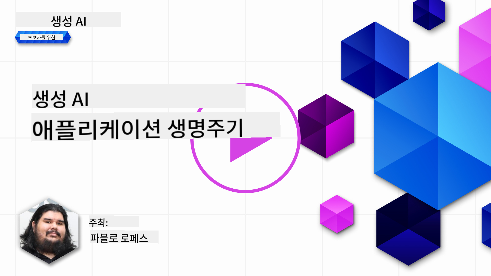
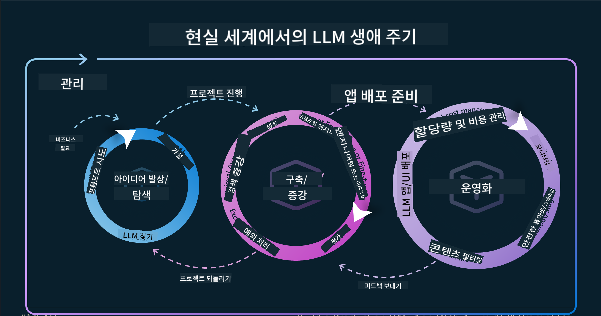
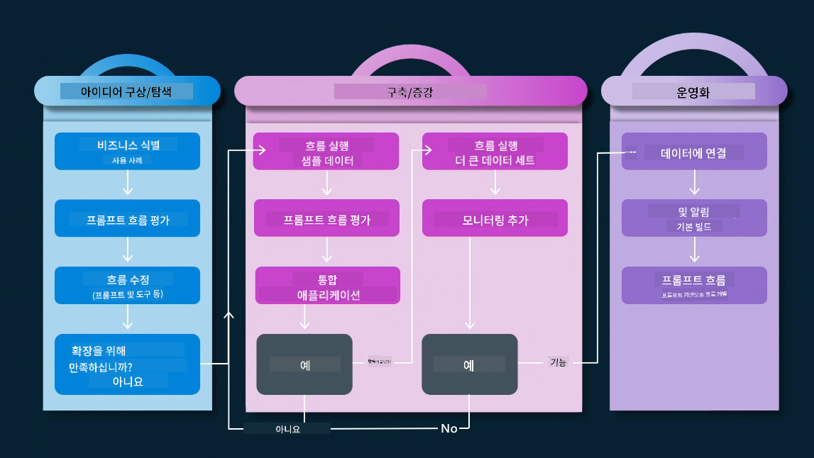
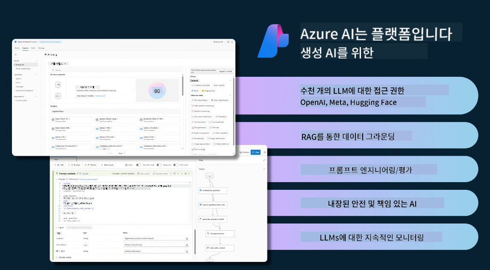
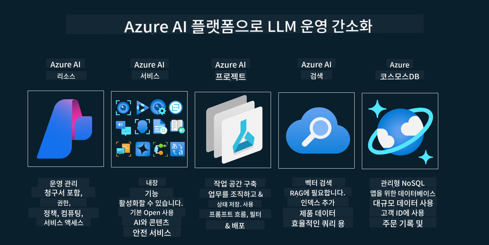
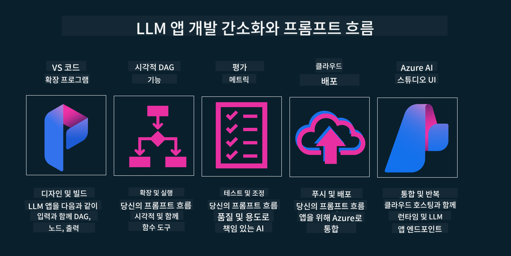

<!--
CO_OP_TRANSLATOR_METADATA:
{
  "original_hash": "27a5347a5022d5ef0a72ab029b03526a",
  "translation_date": "2025-05-19T23:22:45+00:00",
  "source_file": "14-the-generative-ai-application-lifecycle/README.md",
  "language_code": "ko"
}
-->

# 생성 AI 애플리케이션 수명 주기

모든 AI 애플리케이션에서 중요한 질문은 AI 기능의 적절성입니다. AI는 빠르게 진화하는 분야이므로, 애플리케이션이 계속해서 관련성, 신뢰성, 견고성을 유지하려면 지속적으로 모니터링, 평가, 개선해야 합니다. 여기서 생성 AI 수명 주기가 중요합니다.

생성 AI 수명 주기는 생성 AI 애플리케이션을 개발, 배포, 유지하는 단계를 안내하는 프레임워크입니다. 이를 통해 목표를 정의하고, 성과를 측정하며, 문제를 식별하고, 솔루션을 구현할 수 있습니다. 또한 도메인과 이해관계자의 윤리적, 법적 기준에 애플리케이션을 맞출 수 있도록 도와줍니다. 생성 AI 수명 주기를 따르면, 애플리케이션이 항상 가치를 제공하고 사용자를 만족시킬 수 있습니다.

## 소개

이 장에서는 다음을 학습합니다:

- MLOps에서 LLMOps로의 패러다임 전환 이해하기
- LLM 수명 주기
- 수명 주기 도구
- 수명 주기 측정 및 평가

## MLOps에서 LLMOps로의 패러다임 전환 이해하기

LLM은 인공지능 무기고의 새로운 도구로, 애플리케이션의 분석 및 생성 작업에서 엄청난 능력을 발휘합니다. 그러나 이 능력은 AI와 고전적 머신 러닝 작업을 간소화하는 방식에 몇 가지 결과를 초래합니다.

이로 인해, 이 도구를 역동적으로 적응시키기 위한 새로운 패러다임이 필요합니다. 과거의 AI 앱은 "ML 앱"으로, 최신 AI 앱은 "GenAI 앱" 또는 단순히 "AI 앱"으로 분류할 수 있으며, 이는 당시 사용된 주류 기술과 기법을 반영합니다. 이는 여러 면에서 우리의 서술을 변화시킵니다. 다음 비교를 보십시오.

LLMOps에서는 앱 개발자에게 더 중점을 두고, 통합을 핵심 요소로 사용하며, "모델-서비스"를 사용하고, 다음과 같은 지표를 고려합니다.

- 품질: 응답 품질
- 해악: 책임 있는 AI
- 정직: 응답의 근거성 (이해가 되나요? 맞나요?)
- 비용: 솔루션 예산
- 지연: 토큰 응답의 평균 시간

## LLM 수명 주기

먼저 수명 주기와 수정 사항을 이해하기 위해 다음 인포그래픽을 살펴보겠습니다.

이것은 MLOps의 일반적인 수명 주기와 다릅니다. LLM은 프롬프트, 품질 향상을 위한 다양한 기술(파인 튜닝, RAG, 메타 프롬프트), 책임 있는 AI와의 다양한 평가 및 책임, 마지막으로 새로운 평가 지표(품질, 해악, 정직, 비용 및 지연)와 같은 많은 새로운 요구 사항이 있습니다.

예를 들어, 우리는 어떻게 아이디어를 구상하는지 살펴봅시다. 다양한 LLM을 사용하여 프롬프트 엔지니어링을 통해 가능성을 탐색하고, 그들의 가설이 맞는지 테스트합니다.

이는 선형이 아니라 통합 루프, 반복적이며 전반적인 주기로 이루어져 있습니다.

이 단계를 어떻게 탐색할 수 있을까요? 수명 주기를 어떻게 구축할 수 있을지 자세히 알아봅시다.

이것은 약간 복잡해 보일 수 있지만, 먼저 세 가지 주요 단계에 집중합시다.

1. 아이디어 구상/탐색: 탐색, 여기서 우리는 비즈니스 요구에 따라 탐색할 수 있습니다. 프로토타입을 만들고, [PromptFlow](https://microsoft.github.io/promptflow/index.html?WT.mc_id=academic-105485-koreyst)를 만들어 가설에 충분히 효율적인지 테스트합니다.
2. 구축/증강: 구현, 이제 더 큰 데이터 세트를 평가하고, 파인 튜닝 및 RAG와 같은 기술을 구현하여 솔루션의 견고성을 확인합니다. 그렇지 않다면, 흐름에 새로운 단계를 추가하거나 데이터를 재구성하여 다시 구현하는 것이 도움이 될 수 있습니다. 흐름과 규모를 테스트하고, 지표를 확인한 후 작동하면 다음 단계로 넘어갈 준비가 된 것입니다.
3. 운영화: 통합, 이제 시스템에 모니터링 및 경고 시스템을 추가하고, 애플리케이션에 배포 및 애플리케이션 통합을 수행합니다.

그런 다음, 보안, 준수 및 거버넌스에 중점을 둔 관리의 전반적인 주기가 있습니다.

축하합니다, 이제 AI 앱이 준비되어 운영 가능합니다. 실제 경험을 원하시면, [Contoso Chat Demo](https://nitya.github.io/contoso-chat/?WT.mc_id=academic-105485-koreys)를 확인해보세요.

이제 어떤 도구를 사용할 수 있을까요?

## 수명 주기 도구

도구로는, Microsoft는 [Azure AI Platform](https://azure.microsoft.com/solutions/ai/?WT.mc_id=academic-105485-koreys)과 [PromptFlow](https://microsoft.github.io/promptflow/index.html?WT.mc_id=academic-105485-koreyst)를 제공하여 수명 주기를 쉽게 구현하고 준비할 수 있도록 합니다.

[Azure AI Platform](https://azure.microsoft.com/solutions/ai/?WT.mc_id=academic-105485-koreys)은 [AI Studio](https://ai.azure.com/?WT.mc_id=academic-105485-koreys)를 사용할 수 있게 해줍니다. AI Studio는 모델, 샘플 및 도구를 탐색할 수 있는 웹 포털입니다. 리소스를 관리하고, UI 개발 흐름 및 코드 우선 개발을 위한 SDK/CLI 옵션을 제공합니다.

Azure AI는 여러 리소스를 사용하여 운영, 서비스, 프로젝트, 벡터 검색 및 데이터베이스 요구 사항을 관리할 수 있습니다.

Proof-of-Concept(POC)에서 대규모 애플리케이션까지 PromptFlow를 사용하여 구축하십시오:

- VS Code에서 시각적 및 기능적 도구로 앱을 디자인하고 구축하십시오.
- 앱을 쉽게 테스트하고 품질 AI로 미세 조정하십시오.
- Azure AI Studio를 사용하여 클라우드와 통합 및 반복하고, 빠른 통합을 위해 푸시 및 배포하십시오.

## 훌륭합니다! 학습을 계속하세요!

놀랍습니다, 이제 [Contoso Chat App](https://nitya.github.io/contoso-chat/?WT.mc_id=academic-105485-koreyst)에서 개념을 사용하는 애플리케이션을 어떻게 구조화하는지 더 알아보세요. 클라우드 옹호가 시연에서 이러한 개념을 어떻게 추가하는지 확인하십시오. 더 많은 콘텐츠는 [Ignite 브레이크아웃 세션](https://www.youtube.com/watch?v=DdOylyrTOWg)을 확인하세요!

이제, 15강을 확인하여 [Retrieval Augmented Generation 및 벡터 데이터베이스](../15-rag-and-vector-databases/README.md?WT.mc_id=academic-105485-koreyst)가 생성 AI에 미치는 영향과 더 매력적인 애플리케이션을 만드는 방법을 이해하세요!

**면책 조항**:
이 문서는 AI 번역 서비스 [Co-op Translator](https://github.com/Azure/co-op-translator)를 사용하여 번역되었습니다. 우리는 정확성을 위해 노력하지만, 자동 번역에는 오류나 부정확성이 있을 수 있음을 유의하시기 바랍니다. 원본 문서는 해당 언어로 작성된 것이며 권위 있는 출처로 간주되어야 합니다. 중요한 정보에 대해서는 전문적인 인간 번역을 권장합니다. 이 번역을 사용함으로써 발생하는 오해나 잘못된 해석에 대해 책임을 지지 않습니다.