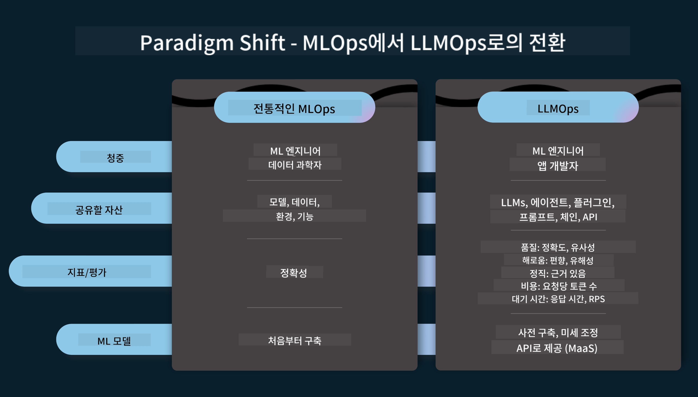
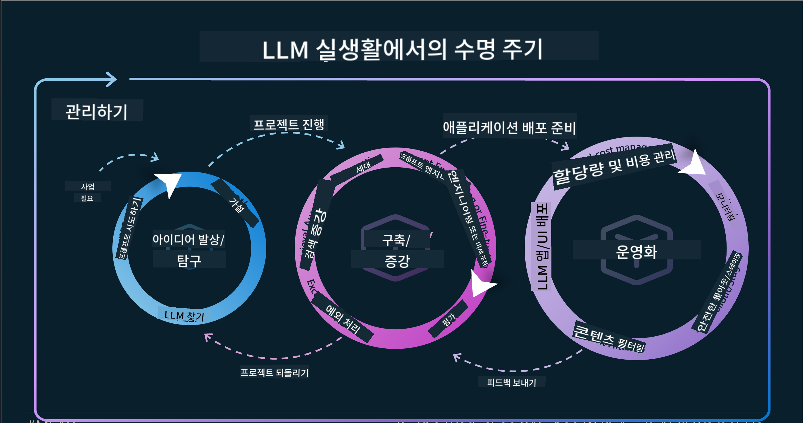
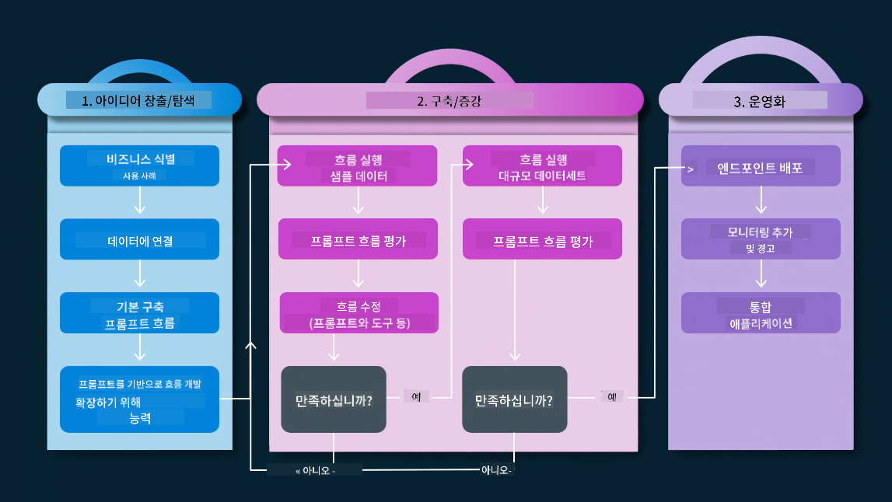
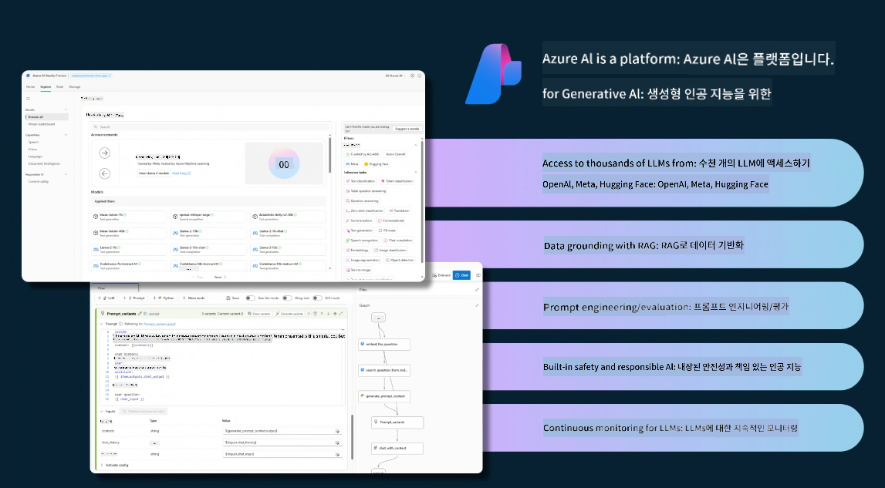
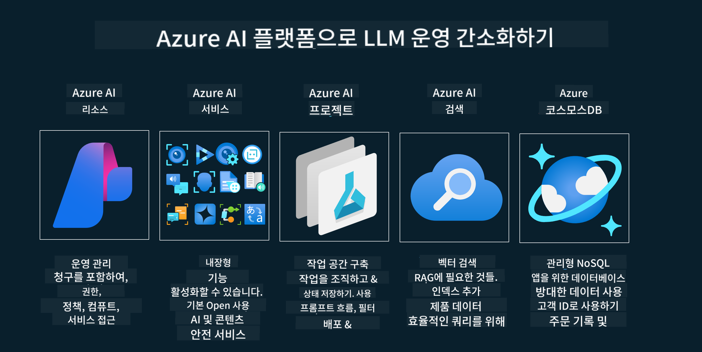
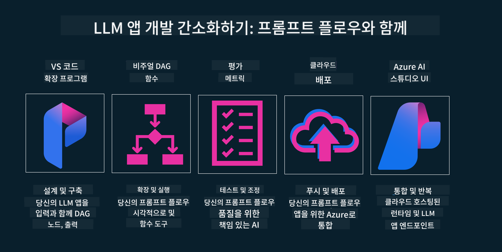

<!--
CO_OP_TRANSLATOR_METADATA:
{
  "original_hash": "27a5347a5022d5ef0a72ab029b03526a",
  "translation_date": "2025-06-25T21:58:29+00:00",
  "source_file": "14-the-generative-ai-application-lifecycle/README.md",
  "language_code": "ko"
}
-->

# 생성 AI 애플리케이션 라이프사이클

모든 AI 애플리케이션에서 중요한 질문은 AI 기능의 관련성입니다. AI는 빠르게 발전하는 분야이므로, 애플리케이션이 지속적으로 관련성, 신뢰성, 견고성을 유지하기 위해서는 지속적인 모니터링, 평가 및 개선이 필요합니다. 여기서 생성 AI 라이프사이클이 중요한 역할을 합니다.

생성 AI 라이프사이클은 생성 AI 애플리케이션을 개발, 배포, 유지하는 단계를 안내하는 프레임워크입니다. 목표를 정의하고, 성과를 측정하며, 도전을 식별하고, 솔루션을 구현하는 데 도움을 줍니다. 또한 애플리케이션을 도메인 및 이해관계자의 윤리적 및 법적 기준에 맞추도록 돕습니다. 생성 AI 라이프사이클을 따르면 애플리케이션이 항상 가치를 제공하고 사용자 만족을 보장할 수 있습니다.

## 소개

이 장에서는 다음을 학습합니다:

- MLOps에서 LLMOps로의 패러다임 전환 이해
- LLM 라이프사이클
- 라이프사이클 도구
- 라이프사이클 계량화 및 평가

## MLOps에서 LLMOps로의 패러다임 전환 이해

LLM은 인공지능의 새로운 도구로, 애플리케이션의 분석 및 생성 작업에서 매우 강력합니다. 그러나 이러한 강력함은 AI 및 클래식 머신 러닝 작업을 간소화하는 방식에 영향을 미칩니다.

이에 따라, 이 도구를 동적으로 적응시키기 위한 새로운 패러다임이 필요합니다. 과거의 AI 앱을 "ML 앱"으로, 최신 AI 앱을 "GenAI 앱" 또는 단순히 "AI 앱"으로 분류할 수 있으며, 이는 당시 사용된 주류 기술과 기법을 반영합니다. 이는 여러 방식으로 우리의 이야기를 변화시킵니다. 다음 비교를 살펴보세요.

LLMOps에서는 앱 개발자에게 더 집중하며, 통합을 주요 포인트로 사용하고, "모델-서비스"를 활용하며 다음 지표를 고려합니다.

- 품질: 응답 품질
- 해로움: 책임 있는 AI
- 정직: 응답의 근거(말이 되는가? 올바른가?)
- 비용: 솔루션 예산
- 지연 시간: 토큰 응답 평균 시간

## LLM 라이프사이클

먼저, 라이프사이클과 수정 사항을 이해하기 위해 다음 인포그래픽을 살펴보세요.

보시다시피, 이는 일반적인 MLOps의 라이프사이클과 다릅니다. LLM은 프롬프트, 품질 향상을 위한 다양한 기법(파인 튜닝, RAG, 메타 프롬프트), 책임 있는 AI에 대한 평가와 책임, 마지막으로 새로운 평가 지표(품질, 해로움, 정직, 비용, 지연 시간)와 같은 많은 새로운 요구 사항을 가지고 있습니다.

예를 들어, 아이디어를 구상하는 방법을 살펴보세요. 다양한 LLM을 사용하여 실험하고 가능성을 탐색하여 가설이 맞는지 테스트합니다.

이는 선형적이지 않으며, 통합된 루프, 반복적이며 포괄적인 사이클로 이루어져 있습니다.

이 단계들을 어떻게 탐색할 수 있을까요? 라이프사이클을 어떻게 구축할 수 있을지 자세히 살펴보겠습니다.

이것은 약간 복잡해 보일 수 있지만, 먼저 세 가지 큰 단계를 집중해봅시다.

1. 아이디어 구상/탐색: 탐색, 여기서는 비즈니스 요구에 따라 탐색할 수 있습니다. 프로토타이핑, [PromptFlow](https://microsoft.github.io/promptflow/index.html?WT.mc_id=academic-105485-koreyst)를 생성하여 우리의 가설에 충분히 효율적인지 테스트합니다.
2. 구축/증강: 구현, 이제 더 큰 데이터셋을 평가하고 파인 튜닝과 RAG 같은 기법을 구현하여 솔루션의 견고성을 확인합니다. 만약 그렇지 않다면, 재구현하거나 흐름에 새로운 단계를 추가하거나 데이터를 재구성하는 것이 도움이 될 수 있습니다. 흐름과 규모를 테스트한 후 작동하고 지표를 확인하면 다음 단계로 준비됩니다.
3. 운영화: 통합, 이제 모니터링 및 알림 시스템을 시스템에 추가하고 배포 및 애플리케이션 통합을 애플리케이션에 추가합니다.

그런 다음 보안, 규정 준수 및 거버넌스에 중점을 둔 관리의 포괄적인 사이클이 있습니다.

축하합니다, 이제 AI 앱이 준비되고 운영 가능합니다. 실습 경험을 위해 [Contoso Chat Demo](https://nitya.github.io/contoso-chat/?WT.mc_id=academic-105485-koreys)를 살펴보세요.

이제 어떤 도구를 사용할 수 있을까요?

## 라이프사이클 도구

도구로는 Microsoft가 제공하는 [Azure AI 플랫폼](https://azure.microsoft.com/solutions/ai/?WT.mc_id=academic-105485-koreys)과 [PromptFlow](https://microsoft.github.io/promptflow/index.html?WT.mc_id=academic-105485-koreyst)를 사용하여 사이클을 쉽게 구현하고 준비할 수 있습니다.

[Azure AI 플랫폼](https://azure.microsoft.com/solutions/ai/?WT.mc_id=academic-105485-koreys)은 [AI Studio](https://ai.azure.com/?WT.mc_id=academic-105485-koreys)를 사용할 수 있게 합니다. AI Studio는 모델, 샘플 및 도구를 탐색할 수 있는 웹 포털입니다. 리소스를 관리하고, UI 개발 흐름 및 코드-우선 개발을 위한 SDK/CLI 옵션을 제공합니다.

Azure AI는 운영, 서비스, 프로젝트, 벡터 검색 및 데이터베이스 요구를 관리하기 위한 다양한 리소스를 사용할 수 있게 합니다.

Proof-of-Concept(POC)에서 대규모 애플리케이션까지 PromptFlow를 사용하여 구축:

- VS Code에서 시각적 및 기능적 도구를 사용하여 앱 설계 및 구축
- 앱을 쉽게 테스트하고 파인 튜닝하여 품질 AI를 제공합니다.
- Azure AI Studio를 사용하여 클라우드와 통합 및 반복, 빠른 통합을 위한 푸시 및 배포

## 훌륭합니다! 학습을 계속하세요!

놀랍습니다. 이제 [Contoso Chat App](https://nitya.github.io/contoso-chat/?WT.mc_id=academic-105485-koreyst)을 통해 애플리케이션을 구조화하여 개념을 사용하는 방법을 더 알아보세요. 클라우드 옹호가 이러한 개념을 시연에 어떻게 추가하는지 확인하세요. 더 많은 콘텐츠를 보려면 [Ignite breakout session](https://www.youtube.com/watch?v=DdOylyrTOWg)을 확인하세요!

이제 Lesson 15를 확인하여 [Retrieval Augmented Generation 및 벡터 데이터베이스](../15-rag-and-vector-databases/README.md?WT.mc_id=academic-105485-koreyst)가 생성 AI에 어떻게 영향을 미치고 더 매력적인 애플리케이션을 만드는지 이해하세요!

**면책 조항**:  
이 문서는 AI 번역 서비스 [Co-op Translator](https://github.com/Azure/co-op-translator)를 사용하여 번역되었습니다. 정확성을 위해 노력하고 있지만 자동 번역에는 오류나 부정확성이 있을 수 있음을 유의하시기 바랍니다. 원본 문서는 해당 언어로 작성된 문서를 권위 있는 출처로 간주해야 합니다. 중요한 정보의 경우, 전문적인 인간 번역을 권장합니다. 이 번역 사용으로 인한 오해나 잘못된 해석에 대해 당사는 책임을 지지 않습니다.