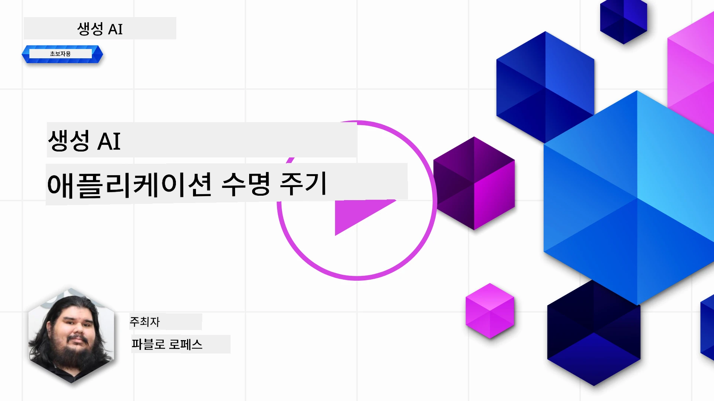
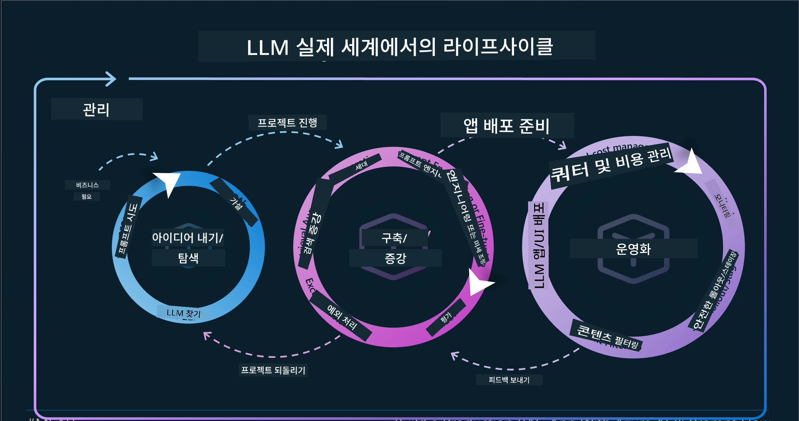
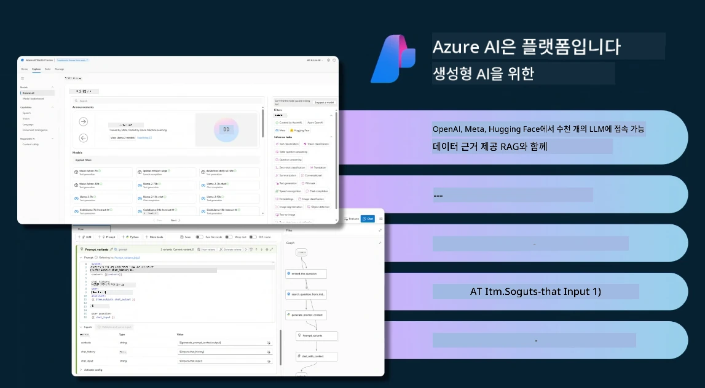
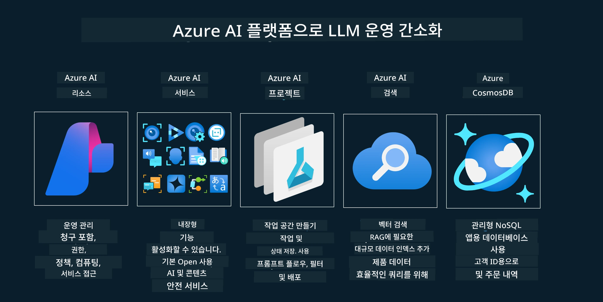
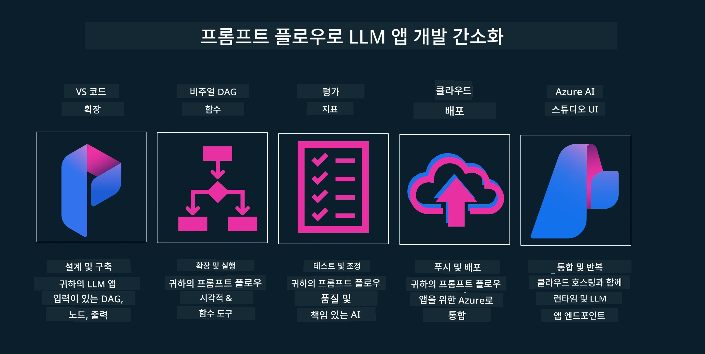

# 생성형 AI 애플리케이션 수명 주기

모든 AI 애플리케이션에 있어 중요한 질문은 AI 기능의 관련성입니다. AI는 빠르게 발전하는 분야이므로, 애플리케이션이 계속해서 관련성 있고 신뢰할 수 있으며 견고하게 유지되도록 하려면 지속적으로 모니터링하고 평가하며 개선해야 합니다. 바로 여기에서 생성형 AI 수명 주기가 등장합니다.

생성형 AI 수명 주기는 생성형 AI 애플리케이션을 개발, 배포 및 유지 관리하는 단계별 가이드를 제공하는 프레임워크입니다. 목표를 정의하고, 성능을 측정하며, 과제를 파악하고, 해결책을 구현하도록 도와줍니다. 또한 애플리케이션이 도메인 및 이해관계자의 윤리적, 법적 기준과 일치하도록 돕습니다. 생성형 AI 수명 주기를 따름으로써 애플리케이션이 항상 가치를 제공하고 사용자 만족도를 유지하도록 할 수 있습니다.

## 소개

이 장에서 여러분은:

- MLOps에서 LLMOps로의 패러다임 전환 이해하기
- LLM 수명 주기
- 수명 주기 도구
- 수명 주기 지표화 및 평가

## MLOps에서 LLMOps로의 패러다임 전환 이해하기

LLM은 인공지능 무기고에서 새로운 도구로, 애플리케이션의 분석 및 생성 작업에 매우 강력합니다. 하지만 이 강력함은 AI와 고전적 기계학습 작업을 간소화하는 방식에 일부 영향을 미칩니다.

이로 인해, 이 도구를 정확한 동기 부여와 함께 역동적으로 적응시키기 위한 새로운 패러다임이 필요합니다. 기존 AI 앱은 "ML 앱"으로, 최신 AI 앱은 "생성형 AI 앱" 또는 단순히 "AI 앱"으로 분류할 수 있는데, 이는 당시 사용되던 주류 기술과 기법을 반영한 것입니다. 이로 인해 우리의 서술 방식에 여러 변화가 생기는데, 다음 비교를 살펴보세요.

LLMOps에서는 애플리케이션 개발자에 더 집중하며, 통합을 핵심 포인트로 활용하고 "모델을 서비스로" 사용하며 다음 지표들에 대해 생각합니다.

- 품질: 응답 품질
- 해악: 책임 있는 AI
- 정직성: 응답 근거 유무 (말이 되는가? 정확한가?)
- 비용: 솔루션 예산
- 지연 시간: 평균 토큰 응답 시간

## LLM 수명 주기

먼저 수명 주기와 수정 사항을 이해하기 위해 다음 인포그래픽을 참고하세요.

보시다시피, 이는 일반적인 MLOps 수명 주기와 다릅니다. LLM은 프롬프트, 품질 향상을 위한 다양한 기법(미세조정, RAG, 메타 프롬프트), 책임 있는 AI와 관련한 평가 및 책임, 그리고 새로운 평가 지표(품질, 해악, 정직성, 비용, 지연 시간) 등 많은 신규 요구사항을 가지고 있습니다.

예를 들어, 아이디어 발상 방식을 살펴보면, 다양한 LLM을 실험하는 프롬프트 엔지니어링을 사용하여 가설이 맞을지 테스트하는 가능성을 탐색합니다.

이는 선형이 아니라 통합된 루프 형태, 반복적이고 전체적인 순환 구조임을 유념하세요.

이 단계를 어떻게 탐구할 수 있을까요? 수명 주기 구축 방법을 자세히 살펴봅시다.

조금 복잡해 보일 수 있으니, 우선 세 가지 큰 단계에 집중해 봅시다.

1. 아이디어 구상/탐색: 탐색 단계에서는 비즈니스 요구 사항에 따라 탐색합니다. 프로토타이핑, [PromptFlow](https://microsoft.github.io/promptflow/index.html?WT.mc_id=academic-105485-koreyst) 생성, 가설에 충분히 효율적인지 테스트합니다.
1. 구축/확장: 구현 단계에서는 대규모 데이터셋에 대해 평가하고, 미세조정, RAG 같은 기법을 적용하여 솔루션의 견고성을 확인합니다. 견고하지 않으면 재구현하거나 흐름 내 새로운 단계를 추가하거나 데이터를 재구성하는 것이 도움이 될 수 있습니다. 흐름과 규모를 테스트하고 지표를 확인한 후 다음 단계 준비가 완료됩니다.
1. 운영화: 통합 단계에서는 모니터링과 알림 시스템을 추가하고, 배포 및 애플리케이션 통합을 수행합니다.

그 다음, 보안, 규정 준수, 거버넌스에 중점을 둔 관리의 포괄적 주기가 있습니다.

축하합니다, 이제 AI 앱이 준비되어 운영을 시작할 수 있습니다. 실습 체험을 원하면 [Contoso Chat 데모](https://nitya.github.io/contoso-chat/?WT.mc_id=academic-105485-koreyst)를 참고하세요.

이제 어떤 도구들을 사용할 수 있을까요?

## 수명 주기 도구

도구로는 Microsoft가 제공하는 [Azure AI 플랫폼](https://azure.microsoft.com/solutions/ai/?WT.mc_id=academic-105485-koreyst)과 [PromptFlow](https://microsoft.github.io/promptflow/index.html?WT.mc_id=academic-105485-koreyst)가 주기 구현을 용이하고 간편하게 만들어 줍니다.

[Azure AI 플랫폼](https://azure.microsoft.com/solutions/ai/?WT.mc_id=academic-105485-koreyst)은 [AI 스튜디오](https://ai.azure.com/?WT.mc_id=academic-105485-koreyst)를 사용할 수 있게 합니다. AI 스튜디오는 모델, 샘플, 도구를 탐색하고, 리소스를 관리하며, UI 개발 흐름과 SDK/CLI 옵션을 통한 코드 우선 개발을 지원하는 웹 포털입니다.

Azure AI는 여러 리소스를 활용해 운영, 서비스, 프로젝트, 벡터 검색 및 데이터베이스 요구 사항을 관리할 수 있도록 도와줍니다.

PromptFlow를 통해 개념 증명(POC)부터 대규모 애플리케이션까지 구축:

- VS Code에서 시각적이고 기능적인 도구로 앱 설계 및 구축
- 고품질 AI를 위해 앱을 테스트하고 미세조정, 손쉽게 수행
- Azure AI 스튜디오를 사용해 클라우드와 통합, 빠른 푸시 및 배포를 통한 반복 작업 가능

## 좋습니다! 학습을 계속하세요!

멋집니다, 이제 [Contoso Chat 앱](https://nitya.github.io/contoso-chat/?WT.mc_id=academic-105485-koreyst)에서 개념을 활용하여 애플리케이션 구조를 배우고, 클라우드 어드보커시가 데모에 어떻게 이런 개념들을 적용하는지 확인해 보세요. 더 많은 콘텐츠는 [Ignite 브레이크아웃 세션](https://www.youtube.com/watch?v=DdOylyrTOWg)을 참고하세요!

이제, 15과를 확인하여 [검색 증강 생성 및 벡터 데이터베이스](../15-rag-and-vector-databases/README.md?WT.mc_id=academic-105485-koreyst)가 생성형 AI에 미치는 영향과 더 매력적인 애플리케이션 구축 방법을 이해해 보세요!

---

<!-- CO-OP TRANSLATOR DISCLAIMER START -->
**면책 조항**:  
이 문서는 AI 번역 서비스 [Co-op Translator](https://github.com/Azure/co-op-translator)를 사용하여 번역되었습니다. 정확성을 위해 노력했으나 자동 번역에는 오류나 부정확성이 포함될 수 있음을 유의하시기 바랍니다. 원래 문서의 원어본이 권위 있는 출처로 간주되어야 합니다. 중요한 정보의 경우 전문 인간 번역을 권장합니다. 본 번역 사용으로 인한 오해나 잘못된 해석에 대해 당사는 책임을 지지 않습니다.
<!-- CO-OP TRANSLATOR DISCLAIMER END -->