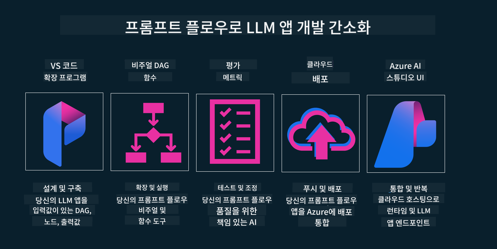

<!--
CO_OP_TRANSLATOR_METADATA:
{
  "original_hash": "b9d32511b27373a1b21b5789d4fda057",
  "translation_date": "2025-10-18T00:04:51+00:00",
  "source_file": "14-the-generative-ai-application-lifecycle/README.md",
  "language_code": "ko"
}
-->

# 생성형 AI 애플리케이션 라이프사이클

모든 AI 애플리케이션에서 중요한 질문은 AI 기능의 적합성입니다. AI는 빠르게 진화하는 분야이므로 애플리케이션이 지속적으로 적합하고 신뢰할 수 있으며 견고하게 유지되도록 하기 위해서는 지속적으로 모니터링, 평가 및 개선이 필요합니다. 여기서 생성형 AI 라이프사이클이 중요한 역할을 합니다.

생성형 AI 라이프사이클은 생성형 AI 애플리케이션을 개발, 배포 및 유지 관리하는 단계를 안내하는 프레임워크입니다. 이를 통해 목표를 정의하고, 성과를 측정하며, 문제를 파악하고, 해결책을 구현할 수 있습니다. 또한 애플리케이션을 도메인 및 이해관계자의 윤리적, 법적 기준에 맞게 조정하는 데 도움을 줍니다. 생성형 AI 라이프사이클을 따르면 애플리케이션이 항상 가치를 제공하고 사용자 만족을 보장할 수 있습니다.

## 소개

이 장에서는 다음을 학습합니다:

- MLOps에서 LLMOps로의 패러다임 전환 이해하기
- LLM 라이프사이클
- 라이프사이클 도구
- 라이프사이클 측정 및 평가

## MLOps에서 LLMOps로의 패러다임 전환 이해하기

LLM은 인공지능 도구의 새로운 구성 요소로, 애플리케이션의 분석 및 생성 작업에서 매우 강력한 기능을 발휘합니다. 그러나 이러한 강력함은 AI 및 기존 머신러닝 작업을 간소화하는 방식에 몇 가지 영향을 미칩니다.

따라서 이 도구를 동적으로 적응시키고 올바른 인센티브를 제공하기 위해 새로운 패러다임이 필요합니다. 이전 AI 애플리케이션을 "ML 앱"으로, 새로운 AI 애플리케이션을 "GenAI 앱" 또는 단순히 "AI 앱"으로 분류할 수 있습니다. 이는 당시 사용된 주류 기술과 기법을 반영합니다. 이러한 변화는 여러 방식으로 우리의 내러티브를 바꿉니다. 아래 비교를 살펴보세요.

LLMOps에서는 앱 개발자에게 더 중점을 두고, 통합을 핵심 요소로 사용하며, "서비스로서의 모델"을 활용하고 다음과 같은 지표를 고려합니다.

- 품질: 응답 품질
- 해악: 책임 있는 AI
- 정직성: 응답의 근거성 (이해가 되는가? 정확한가?)
- 비용: 솔루션 예산
- 지연 시간: 토큰 응답 평균 시간

## LLM 라이프사이클

먼저, 라이프사이클과 그 수정 사항을 이해하기 위해 다음 인포그래픽을 살펴보세요.

보시다시피, 이는 기존 MLOps의 라이프사이클과는 다릅니다. LLM은 프롬프트 생성, 품질 향상을 위한 다양한 기법(파인 튜닝, RAG, 메타 프롬프트), 책임 있는 AI와 관련된 평가 및 책임, 새로운 평가 지표(품질, 해악, 정직성, 비용, 지연 시간) 등 많은 새로운 요구 사항을 가지고 있습니다.

예를 들어, 아이디어를 구상하는 방법을 살펴보세요. 다양한 LLM을 사용하여 프롬프트 엔지니어링을 통해 가설이 올바른지 테스트할 가능성을 탐구합니다.

이 과정은 선형적이지 않고 통합된 루프, 반복적이며 전체적인 사이클로 이루어져 있습니다.

이 단계들을 어떻게 탐구할 수 있을까요? 라이프사이클을 구축하는 방법을 자세히 살펴보겠습니다.

이 과정이 조금 복잡해 보일 수 있지만, 먼저 세 가지 주요 단계를 중심으로 살펴보겠습니다.

1. 아이디어 구상/탐구: 탐구 단계에서는 비즈니스 요구에 따라 탐구를 진행합니다. 프로토타이핑을 하고 [PromptFlow](https://microsoft.github.io/promptflow/index.html?WT.mc_id=academic-105485-koreyst)를 생성하여 가설이 충분히 효율적인지 테스트합니다.
2. 구축/확장: 구현 단계에서는 더 큰 데이터 세트를 평가하고 파인 튜닝 및 RAG와 같은 기법을 적용하여 솔루션의 견고성을 확인합니다. 만약 효과가 없다면, 흐름에 새로운 단계를 추가하거나 데이터를 재구성하여 다시 구현할 수 있습니다. 흐름과 규모를 테스트한 후, 작동 여부와 지표를 확인하여 다음 단계로 진행할 준비를 합니다.
3. 운영화: 통합 단계에서는 시스템에 모니터링 및 알림 시스템을 추가하고, 애플리케이션에 배포 및 통합합니다.

그런 다음 보안, 규정 준수 및 거버넌스에 중점을 둔 관리의 전체적인 사이클이 있습니다.

축하합니다! 이제 AI 애플리케이션이 준비되어 운영 가능합니다. 실습 경험을 원한다면 [Contoso Chat Demo](https://nitya.github.io/contoso-chat/?WT.mc_id=academic-105485-koreys)를 확인해보세요.

그렇다면 어떤 도구를 사용할 수 있을까요?

## 라이프사이클 도구

도구와 관련하여 Microsoft는 [Azure AI Platform](https://azure.microsoft.com/solutions/ai/?WT.mc_id=academic-105485-koreys)과 [PromptFlow](https://microsoft.github.io/promptflow/index.html?WT.mc_id=academic-105485-koreyst)를 제공하여 라이프사이클을 쉽게 구현하고 바로 사용할 수 있도록 지원합니다.

[Azure AI Platform](https://azure.microsoft.com/solutions/ai/?WT.mc_id=academic-105485-koreys)은 [AI Studio](https://ai.azure.com/?WT.mc_id=academic-105485-koreys)를 사용할 수 있게 합니다. AI Studio는 모델, 샘플 및 도구를 탐색할 수 있는 웹 포털로, 리소스 관리, UI 개발 흐름 및 코드 우선 개발을 위한 SDK/CLI 옵션을 제공합니다.

Azure AI는 운영, 서비스, 프로젝트, 벡터 검색 및 데이터베이스 요구 사항을 관리할 수 있는 다양한 리소스를 제공합니다.

Proof-of-Concept(POC)에서 대규모 애플리케이션까지 PromptFlow를 사용하여 구축하세요:

- VS Code에서 시각적 및 기능적 도구를 사용하여 앱을 설계하고 구축
- 품질 높은 AI를 위해 앱을 테스트하고 파인 튜닝
- Azure AI Studio를 사용하여 클라우드와 통합 및 반복, 빠른 통합을 위한 푸시 및 배포

## 훌륭합니다! 학습을 계속하세요!

멋집니다! 이제 [Contoso Chat App](https://nitya.github.io/contoso-chat/?WT.mc_id=academic-105485-koreyst)을 사용하여 애플리케이션을 구조화하는 방법을 배우고, 클라우드 옹호가 데모에서 이러한 개념을 어떻게 추가하는지 확인하세요. 더 많은 콘텐츠는 [Ignite breakout session!](https://www.youtube.com/watch?v=DdOylyrTOWg)을 확인하세요.

이제 Lesson 15를 확인하여 [Retrieval Augmented Generation과 Vector Databases](../15-rag-and-vector-databases/README.md?WT.mc_id=academic-105485-koreyst)가 생성형 AI에 어떤 영향을 미치며 더 매력적인 애플리케이션을 만드는 방법을 이해하세요!

---

**면책 조항**:  
이 문서는 AI 번역 서비스 [Co-op Translator](https://github.com/Azure/co-op-translator)를 사용하여 번역되었습니다. 정확성을 위해 최선을 다하지만, 자동 번역에는 오류나 부정확성이 포함될 수 있습니다. 원본 문서의 원어 버전을 권위 있는 자료로 간주해야 합니다. 중요한 정보에 대해서는 전문적인 인간 번역을 권장합니다. 이 번역 사용으로 인해 발생하는 오해나 잘못된 해석에 대해 책임지지 않습니다.