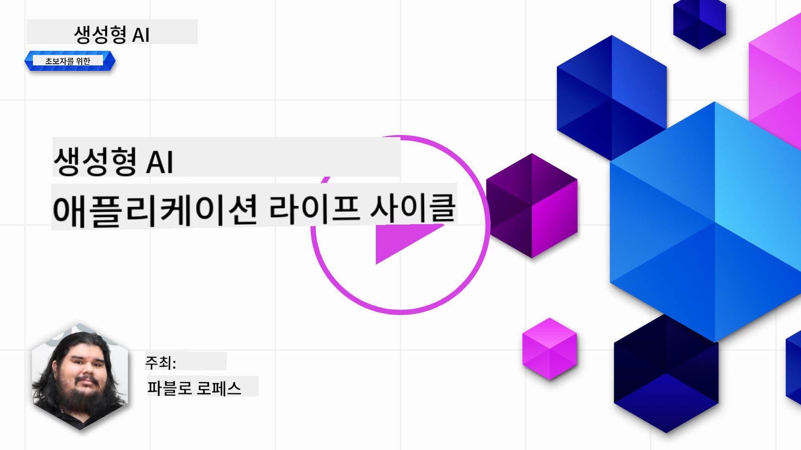
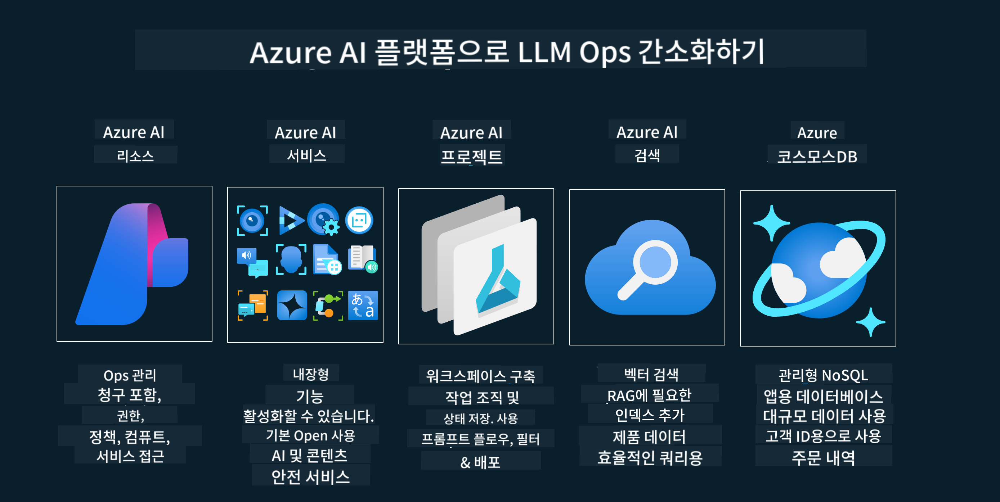

<!--
CO_OP_TRANSLATOR_METADATA:
{
  "original_hash": "27a5347a5022d5ef0a72ab029b03526a",
  "translation_date": "2025-07-09T15:49:56+00:00",
  "source_file": "14-the-generative-ai-application-lifecycle/README.md",
  "language_code": "ko"
}
-->

# 생성형 AI 애플리케이션 라이프사이클

모든 AI 애플리케이션에서 중요한 질문은 AI 기능의 적합성입니다. AI는 빠르게 발전하는 분야이기 때문에, 애플리케이션이 계속해서 관련성 있고 신뢰할 수 있으며 견고하게 유지되려면 지속적으로 모니터링하고 평가하며 개선해야 합니다. 바로 이 점에서 생성형 AI 라이프사이클이 필요합니다.

생성형 AI 라이프사이클은 생성형 AI 애플리케이션을 개발, 배포, 유지하는 단계를 안내하는 프레임워크입니다. 목표를 정의하고, 성과를 측정하며, 문제를 파악하고, 해결책을 구현하는 데 도움을 줍니다. 또한 애플리케이션이 도메인과 이해관계자의 윤리적, 법적 기준에 부합하도록 조율하는 역할도 합니다. 생성형 AI 라이프사이클을 따르면 애플리케이션이 항상 가치를 제공하고 사용자 만족을 유지할 수 있습니다.

## 소개

이 장에서 다룰 내용은 다음과 같습니다:

- MLOps에서 LLMOps로의 패러다임 전환 이해
- LLM 라이프사이클
- 라이프사이클 도구
- 라이프사이클 측정 및 평가

## MLOps에서 LLMOps로의 패러다임 전환 이해

LLM은 인공지능 도구 중 새로운 무기입니다. 애플리케이션의 분석과 생성 작업에서 매우 강력하지만, 이 힘은 AI와 기존 머신러닝 작업을 간소화하는 방식에 영향을 미칩니다.

따라서 이 도구를 역동적으로 적응시키고 올바른 인센티브를 부여하기 위한 새로운 패러다임이 필요합니다. 이전 AI 애플리케이션은 "ML 앱"으로, 최신 AI 애플리케이션은 "GenAI 앱" 또는 단순히 "AI 앱"으로 분류할 수 있는데, 이는 당시 주류 기술과 기법을 반영합니다. 이로 인해 여러 면에서 우리의 관점이 바뀌는데, 다음 비교를 참고하세요.

LLMOps에서는 앱 개발자에 더 집중하며, 통합을 핵심으로 삼고 "서비스형 모델(Models-as-a-Service)"을 활용하며 다음과 같은 지표를 고려합니다.

- 품질: 응답 품질
- 피해: 책임 있는 AI
- 정직성: 응답의 근거성 (말이 되나요? 정확한가요?)
- 비용: 솔루션 예산
- 지연 시간: 토큰 응답 평균 시간

## LLM 라이프사이클

먼저 라이프사이클과 그 변화를 이해하기 위해 다음 인포그래픽을 살펴봅시다.

보시다시피, 이는 기존 MLOps 라이프사이클과 다릅니다. LLM은 프롬프트, 품질 향상을 위한 다양한 기법(파인튜닝, RAG, 메타 프롬프트), 책임 있는 AI에 따른 평가 및 책임, 그리고 새로운 평가 지표(품질, 피해, 정직성, 비용, 지연 시간) 등 많은 새로운 요구사항이 있습니다.

예를 들어, 아이디어를 구상하는 방식을 보세요. 다양한 LLM을 실험하는 프롬프트 엔지니어링을 통해 가설이 맞는지 탐색합니다.

이 과정은 선형적이지 않고 통합된 반복 루프이며, 전체를 아우르는 사이클입니다.

이 단계를 어떻게 탐색할 수 있을까요? 라이프사이클 구축 방법을 자세히 살펴봅시다.

조금 복잡해 보일 수 있지만, 우선 세 가지 큰 단계에 집중해 봅시다.

1. 아이디어 구상/탐색: 비즈니스 요구에 따라 탐색합니다. 프로토타입을 만들고 [PromptFlow](https://microsoft.github.io/promptflow/index.html?WT.mc_id=academic-105485-koreyst)를 활용해 가설에 충분히 효율적인지 테스트합니다.
1. 구축/확장: 구현 단계로, 더 큰 데이터셋을 평가하고 파인튜닝, RAG 같은 기법을 적용해 솔루션의 견고성을 확인합니다. 만약 부족하다면, 흐름을 재구성하거나 새로운 단계를 추가해 재구현할 수 있습니다. 흐름과 규모를 테스트하고 지표를 확인한 후 다음 단계로 넘어갑니다.
1. 운영화: 통합 단계로, 모니터링과 알림 시스템을 추가하고 배포 및 애플리케이션 통합을 진행합니다.

마지막으로 보안, 규정 준수, 거버넌스에 중점을 둔 관리 사이클이 있습니다.

축하합니다! 이제 AI 앱이 준비되어 운영할 수 있습니다. 실습을 원한다면 [Contoso Chat Demo](https://nitya.github.io/contoso-chat/?WT.mc_id=academic-105485-koreys)를 확인해 보세요.

그렇다면 어떤 도구를 사용할 수 있을까요?

## 라이프사이클 도구

도구 측면에서 Microsoft는 [Azure AI Platform](https://azure.microsoft.com/solutions/ai/?WT.mc_id=academic-105485-koreys)과 [PromptFlow](https://microsoft.github.io/promptflow/index.html?WT.mc_id=academic-105485-koreyst)를 제공하여 라이프사이클 구현을 쉽게 지원합니다.

[Azure AI Platform](https://azure.microsoft.com/solutions/ai/?WT.mc_id=academic-105485-koreys)은 [AI Studio](https://ai.azure.com/?WT.mc_id=academic-105485-koreys)를 사용할 수 있게 해줍니다. AI Studio는 모델, 샘플, 도구를 탐색하고 리소스를 관리하며 UI 개발 흐름과 SDK/CLI 옵션을 통한 코드 우선 개발을 지원하는 웹 포털입니다.

Azure AI는 운영, 서비스, 프로젝트, 벡터 검색, 데이터베이스 관리 등 다양한 리소스를 활용할 수 있게 합니다.

PromptFlow를 통해 개념 증명(POC)부터 대규모 애플리케이션까지 구축할 수 있습니다:

- VS Code에서 시각적 및 기능적 도구로 앱 설계 및 구축
- 품질 높은 AI를 위해 앱을 쉽게 테스트하고 파인튜닝
- Azure AI Studio를 사용해 클라우드와 통합, 반복, 빠른 배포 및 통합 지원

## 훌륭합니다! 학습을 계속하세요!

멋집니다! 이제 [Contoso Chat App](https://nitya.github.io/contoso-chat/?WT.mc_id=academic-105485-koreyst)을 통해 개념을 어떻게 애플리케이션에 구조화하는지 배우고, Cloud Advocacy가 데모에 어떻게 적용하는지 확인해 보세요. 더 많은 콘텐츠는 [Ignite 브레이크아웃 세션](https://www.youtube.com/watch?v=DdOylyrTOWg)에서 확인할 수 있습니다.

이제 15강으로 넘어가 [Retrieval Augmented Generation과 벡터 데이터베이스](../15-rag-and-vector-databases/README.md?WT.mc_id=academic-105485-koreyst)가 생성형 AI에 어떤 영향을 미치고, 더 매력적인 애플리케이션을 만드는지 알아보세요!

**면책 조항**:  
이 문서는 AI 번역 서비스 [Co-op Translator](https://github.com/Azure/co-op-translator)를 사용하여 번역되었습니다. 정확성을 위해 최선을 다하고 있으나, 자동 번역에는 오류나 부정확한 부분이 있을 수 있음을 유의해 주시기 바랍니다. 원문은 해당 언어의 원본 문서가 권위 있는 출처로 간주되어야 합니다. 중요한 정보의 경우 전문적인 인간 번역을 권장합니다. 본 번역 사용으로 인해 발생하는 오해나 잘못된 해석에 대해 당사는 책임을 지지 않습니다.