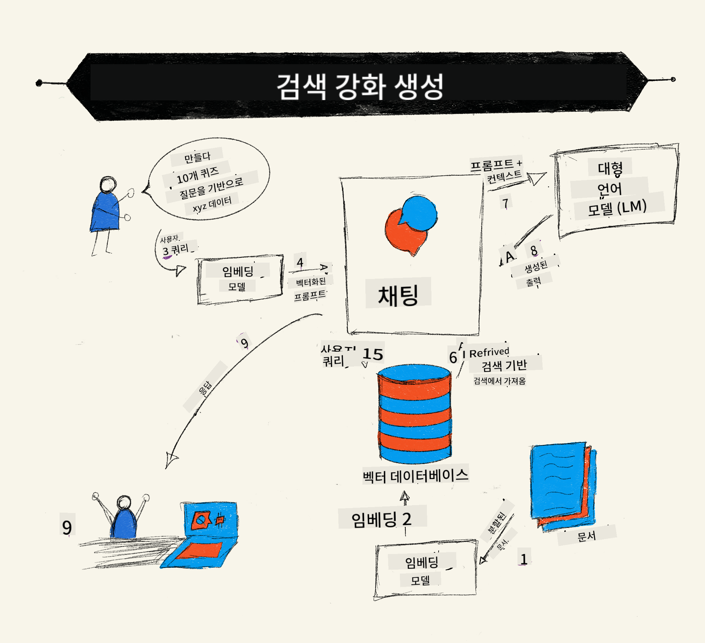
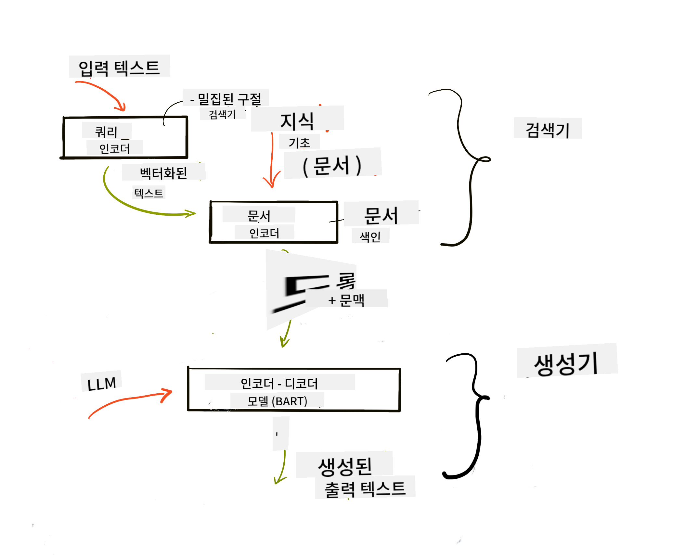
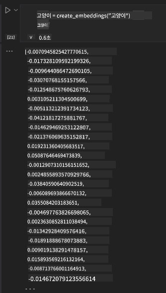

<!--
CO_OP_TRANSLATOR_METADATA:
{
  "original_hash": "e2861bbca91c0567ef32bc77fe054f9e",
  "translation_date": "2025-05-20T01:07:42+00:00",
  "source_file": "15-rag-and-vector-databases/README.md",
  "language_code": "ko"
}
-->
# 검색 증강 생성(RAG)과 벡터 데이터베이스

[](https://aka.ms/gen-ai-lesson15-gh?WT.mc_id=academic-105485-koreyst)

검색 애플리케이션 수업에서는 대규모 언어 모델(LLM)에 데이터를 통합하는 방법을 간단히 배웠습니다. 이번 수업에서는 LLM 애플리케이션에 데이터를 기반으로 하는 개념, 프로세스의 메커니즘 및 임베딩과 텍스트를 포함한 데이터를 저장하는 방법에 대해 더 깊이 알아보겠습니다.

> **비디오 곧 제공 예정**

## 소개

이번 수업에서는 다음을 다룹니다:

- RAG의 소개, 그것이 무엇인지, 그리고 AI(인공지능)에서 왜 사용되는지.

- 벡터 데이터베이스가 무엇인지 이해하고, 애플리케이션을 위해 하나를 만드는 방법.

- 애플리케이션에 RAG를 통합하는 실용적인 예시.

## 학습 목표

이 수업을 완료한 후, 여러분은 다음을 할 수 있습니다:

- 데이터 검색 및 처리에서 RAG의 중요성을 설명합니다.

- RAG 애플리케이션을 설정하고 데이터를 LLM에 기반으로 합니다.

- LLM 애플리케이션에서 RAG와 벡터 데이터베이스의 효과적인 통합.

## 우리의 시나리오: 우리의 데이터를 통해 LLM 강화

이번 수업에서는 교육 스타트업에 우리의 노트를 추가하여 챗봇이 다양한 주제에 대한 정보를 얻을 수 있도록 하려고 합니다. 우리가 가진 노트를 사용하면 학습자들은 더 나은 학습과 다양한 주제에 대한 이해를 할 수 있어 시험 준비가 더 쉬워집니다. 시나리오를 만들기 위해 우리는 다음을 사용할 것입니다:

- `Azure OpenAI:`: 챗봇을 만들기 위해 사용할 LLM

- `AI for beginners' lesson on Neural Networks`: LLM에 기반이 될 데이터

- `Azure AI Search`와 `Azure Cosmos DB:`: 데이터를 저장하고 검색 인덱스를 생성하기 위한 벡터 데이터베이스

사용자는 노트에서 연습 퀴즈를 만들고, 복습 플래시 카드를 만들며, 요약하여 간결한 개요를 만들 수 있습니다. 시작하기 위해, RAG가 무엇인지 그리고 어떻게 작동하는지 살펴보겠습니다:

## 검색 증강 생성(RAG)

LLM 기반 챗봇은 사용자 프롬프트를 처리하여 응답을 생성합니다. 이는 상호작용적이며 다양한 주제에 대해 사용자와 소통하도록 설계되었습니다. 그러나 그 응답은 제공된 컨텍스트와 기본 훈련 데이터에 제한됩니다. 예를 들어, GPT-4의 지식 컷오프는 2021년 9월이며, 이는 그 이후 발생한 사건에 대한 지식이 부족함을 의미합니다. 또한, LLM을 훈련하는 데 사용된 데이터는 개인 노트나 회사의 제품 매뉴얼과 같은 기밀 정보를 제외합니다.

### RAGs(검색 증강 생성)의 작동 방식



노트에서 퀴즈를 생성하는 챗봇을 배포하려고 한다고 가정해 봅시다. 이 경우 지식 베이스와의 연결이 필요합니다. 여기서 RAG가 구원자로 등장합니다. RAG는 다음과 같이 작동합니다:

- **지식 베이스:** 검색 전에, 이 문서들은 일반적으로 큰 문서를 작은 조각으로 나누고, 텍스트 임베딩으로 변환한 후 데이터베이스에 저장하는 방식으로 수집되고 전처리되어야 합니다.

- **사용자 쿼리:** 사용자가 질문을 합니다.

- **검색:** 사용자가 질문을 하면, 임베딩 모델이 지식 베이스에서 관련 정보를 검색하여 프롬프트에 포함될 추가 컨텍스트를 제공합니다.

- **증강 생성:** LLM은 검색된 데이터를 기반으로 응답을 향상시킵니다. 이는 사전 훈련된 데이터뿐만 아니라 추가된 컨텍스트에서의 관련 정보에 기반하여 응답을 생성할 수 있게 합니다. 검색된 데이터는 LLM의 응답을 증강하는 데 사용됩니다. LLM은 그런 다음 사용자의 질문에 대한 답변을 반환합니다.



RAG의 아키텍처는 인코더와 디코더 두 부분으로 구성된 변환기를 사용하여 구현됩니다. 예를 들어, 사용자가 질문을 하면, 입력 텍스트가 단어의 의미를 포착하는 벡터로 '인코딩'되고, 벡터는 우리의 문서 인덱스에 '디코딩'되어 사용자 쿼리에 기반한 새 텍스트를 생성합니다. LLM은 출력 생성을 위해 인코더-디코더 모델을 사용합니다.

제안된 논문에 따라 RAG를 구현할 때 두 가지 접근 방식은 다음과 같습니다: [지식 집약적 NLP(자연어 처리 소프트웨어) 작업을 위한 검색 증강 생성](https://arxiv.org/pdf/2005.11401.pdf?WT.mc_id=academic-105485-koreyst)

- **_RAG-Sequence_** 검색된 문서를 사용하여 사용자 쿼리에 대한 최적의 답변을 예측

- **RAG-Token** 문서를 사용하여 다음 토큰을 생성하고, 이를 검색하여 사용자의 쿼리에 답변

### 왜 RAG를 사용하나요?

- **정보 풍부성:** 텍스트 응답이 최신 상태를 유지하고 현재 정보를 반영하도록 보장합니다. 따라서 내부 지식 베이스에 접근하여 도메인 특정 작업의 성능을 향상시킵니다.

- 지식 베이스의 **검증 가능한 데이터**를 활용하여 사용자 쿼리에 대한 컨텍스트를 제공함으로써 허구를 줄입니다.

- LLM을 미세 조정하는 것보다 더 경제적이기 때문에 **비용 효율적**입니다.

## 지식 베이스 생성

우리의 애플리케이션은 개인 데이터, 즉 AI 초급자 커리큘럼의 신경망 수업을 기반으로 합니다.

### 벡터 데이터베이스

전통적인 데이터베이스와 달리, 벡터 데이터베이스는 임베딩 벡터를 저장, 관리 및 검색하기 위해 설계된 특수한 데이터베이스입니다. 이는 문서의 수치적 표현을 저장합니다. 데이터를 수치 임베딩으로 분해하면 AI 시스템이 데이터를 이해하고 처리하기가 더 쉬워집니다.

임베딩을 벡터 데이터베이스에 저장하는 이유는 LLM이 입력으로 허용하는 토큰 수에 제한이 있기 때문입니다. 전체 임베딩을 LLM에 전달할 수 없기 때문에, 이를 청크로 나누어야 하며, 사용자가 질문을 할 때 질문과 가장 유사한 임베딩이 프롬프트와 함께 반환됩니다. 청킹은 또한 LLM을 통해 전달되는 토큰 수에 대한 비용을 줄입니다.

일부 인기 있는 벡터 데이터베이스로는 Azure Cosmos DB, Clarifyai, Pinecone, Chromadb, ScaNN, Qdrant 및 DeepLake가 있습니다. 다음 명령어를 사용하여 Azure CLI로 Azure Cosmos DB 모델을 생성할 수 있습니다:

```bash
az login
az group create -n <resource-group-name> -l <location>
az cosmosdb create -n <cosmos-db-name> -r <resource-group-name>
az cosmosdb list-keys -n <cosmos-db-name> -g <resource-group-name>
```

### 텍스트에서 임베딩으로

데이터를 저장하기 전에 데이터베이스에 저장되기 전에 벡터 임베딩으로 변환해야 합니다. 대형 문서나 긴 텍스트를 다룰 때는 예상되는 쿼리에 따라 청크할 수 있습니다. 청킹은 문장 수준이나 단락 수준에서 할 수 있습니다. 청킹은 주변 단어에서 의미를 도출하므로, 예를 들어 문서 제목을 추가하거나 청크 전후에 텍스트를 포함시켜 청크에 다른 컨텍스트를 추가할 수 있습니다. 데이터를 다음과 같이 청크할 수 있습니다:

```python
def split_text(text, max_length, min_length):
    words = text.split()
    chunks = []
    current_chunk = []

    for word in words:
        current_chunk.append(word)
        if len(' '.join(current_chunk)) < max_length and len(' '.join(current_chunk)) > min_length:
            chunks.append(' '.join(current_chunk))
            current_chunk = []

    # If the last chunk didn't reach the minimum length, add it anyway
    if current_chunk:
        chunks.append(' '.join(current_chunk))

    return chunks
```

청크된 후, 다양한 임베딩 모델을 사용하여 텍스트를 임베딩할 수 있습니다. 사용할 수 있는 모델로는 word2vec, OpenAI의 ada-002, Azure Computer Vision 등이 있습니다. 사용할 모델을 선택하는 것은 사용 중인 언어, 인코딩된 콘텐츠 유형(텍스트/이미지/오디오), 인코딩할 수 있는 입력의 크기 및 임베딩 출력의 길이에 따라 달라집니다.

OpenAI의 `text-embedding-ada-002` 모델을 사용한 임베딩 텍스트의 예는 다음과 같습니다:


## 검색 및 벡터 검색

사용자가 질문을 하면, 검색기는 쿼리 인코더를 사용하여 이를 벡터로 변환한 다음, 입력과 관련된 문서 검색 인덱스를 통해 관련 벡터를 검색합니다. 완료되면, 입력 벡터와 문서 벡터를 텍스트로 변환하여 LLM을 통해 전달합니다.

### 검색

검색은 시스템이 검색 기준을 충족하는 문서를 인덱스에서 신속하게 찾으려고 할 때 발생합니다. 검색기의 목표는 문서를 가져와서 LLM을 데이터에 기반으로 하고 컨텍스트를 제공하는 것입니다.

데이터베이스 내에서 검색을 수행하는 여러 방법이 있습니다:

- **키워드 검색** - 텍스트 검색에 사용

- **의미 검색** - 단어의 의미를 사용

- **벡터 검색** - 문서를 텍스트에서 임베딩 모델을 사용하여 벡터 표현으로 변환. 검색은 사용자 질문에 가장 가까운 벡터 표현을 가진 문서를 쿼리하여 수행됩니다.

- **하이브리드** - 키워드와 벡터 검색을 결합한 방식.

검색과 관련된 문제는 데이터베이스에 쿼리에 대한 유사한 응답이 없을 때 발생하며, 시스템은 최상의 정보를 반환하게 됩니다. 그러나 최대 관련 거리 설정이나 키워드와 벡터 검색을 결합한 하이브리드 검색을 사용하는 전술을 사용할 수 있습니다. 이번 수업에서는 벡터와 키워드 검색을 결합한 하이브리드 검색을 사용할 것입니다. 우리는 청크와 임베딩을 포함하는 열이 있는 데이터프레임에 데이터를 저장할 것입니다.

### 벡터 유사성

검색기는 지식 데이터베이스에서 가까운 임베딩, 즉 가장 가까운 이웃을 검색합니다. 이는 유사한 텍스트입니다. 사용자가 쿼리를 요청하면, 먼저 임베딩되고 유사한 임베딩과 매칭됩니다. 서로 다른 벡터가 얼마나 유사한지를 찾는 데 사용되는 일반적인 측정 방법은 두 벡터 사이의 각도를 기반으로 한 코사인 유사성입니다.

유사성을 측정하는 다른 대안으로는 벡터 끝점 간의 직선 거리인 유클리드 거리와 두 벡터의 대응 요소의 곱의 합을 측정하는 내적이 있습니다.

### 검색 인덱스

검색을 수행할 때, 검색을 수행하기 전에 지식 베이스에 대한 검색 인덱스를 구축해야 합니다. 인덱스는 임베딩을 저장하고 큰 데이터베이스에서도 가장 유사한 청크를 신속하게 검색할 수 있습니다. 로컬에서 인덱스를 생성할 수 있습니다:

```python
from sklearn.neighbors import NearestNeighbors

embeddings = flattened_df['embeddings'].to_list()

# Create the search index
nbrs = NearestNeighbors(n_neighbors=5, algorithm='ball_tree').fit(embeddings)

# To query the index, you can use the kneighbors method
distances, indices = nbrs.kneighbors(embeddings)
```

### 재랭킹

데이터베이스를 쿼리한 후, 가장 관련성이 높은 결과로 정렬해야 할 수도 있습니다. 재랭킹 LLM은 기계 학습을 활용하여 검색 결과의 관련성을 향상시키고, 이를 가장 관련성이 높은 순서로 정렬합니다. Azure AI Search를 사용하면, 의미 재랭커를 사용하여 자동으로 재랭킹이 수행됩니다. 가장 가까운 이웃을 사용한 재랭킹의 작동 예시는 다음과 같습니다:

```python
# Find the most similar documents
distances, indices = nbrs.kneighbors([query_vector])

index = []
# Print the most similar documents
for i in range(3):
    index = indices[0][i]
    for index in indices[0]:
        print(flattened_df['chunks'].iloc[index])
        print(flattened_df['path'].iloc[index])
        print(flattened_df['distances'].iloc[index])
    else:
        print(f"Index {index} not found in DataFrame")
```

## 모든 것을 통합하기

마지막 단계는 LLM을 추가하여 데이터에 기반한 응답을 얻을 수 있도록 하는 것입니다. 다음과 같이 구현할 수 있습니다:

```python
user_input = "what is a perceptron?"

def chatbot(user_input):
    # Convert the question to a query vector
    query_vector = create_embeddings(user_input)

    # Find the most similar documents
    distances, indices = nbrs.kneighbors([query_vector])

    # add documents to query  to provide context
    history = []
    for index in indices[0]:
        history.append(flattened_df['chunks'].iloc[index])

    # combine the history and the user input
    history.append(user_input)

    # create a message object
    messages=[
        {"role": "system", "content": "You are an AI assistant that helps with AI questions."},
        {"role": "user", "content": history[-1]}
    ]

    # use chat completion to generate a response
    response = openai.chat.completions.create(
        model="gpt-4",
        temperature=0.7,
        max_tokens=800,
        messages=messages
    )

    return response.choices[0].message

chatbot(user_input)
```

## 애플리케이션 평가

### 평가 지표

- 자연스럽고 유창하며 인간적인 응답을 보장하는 응답의 품질

- 제공된 문서에서 나온 응답인지 평가하는 데이터의 기반성

- 응답이 질문과 일치하고 관련성이 있는지 평가

- 문법적으로 응답이 의미가 있는지 평가

## 검색 증강 생성(RAG) 및 벡터 데이터베이스 사용 사례

함수 호출이 앱을 개선할 수 있는 다양한 사용 사례가 있습니다:

- 질문 및 답변: 회사 데이터를 채팅에 기반으로 하여 직원이 질문할 수 있도록 합니다.

- 추천 시스템: 영화, 레스토랑 등과 같은 가장 유사한 값을 매칭하는 시스템을 만들 수 있습니다.

- 챗봇 서비스: 채팅 기록을 저장하고 사용자 데이터를 기반으로 대화를 개인화할 수 있습니다.

- 벡터 임베딩을 기반으로 한 이미지 검색은 이미지 인식 및 이상 탐지에 유용합니다.

## 요약

이번 수업에서는 데이터 추가부터 애플리케이션, 사용자 쿼리 및 출력까지 RAG의 기본 영역을 다루었습니다. RAG 생성을 단순화하기 위해 Semanti Kernel, Langchain 또는 Autogen과 같은 프레임워크를 사용할 수 있습니다.

## 과제

검색 증강 생성(RAG) 학습을 계속하기 위해 다음을 구축할 수 있습니다:

- 선택한 프레임워크를 사용하여 애플리케이션의 프론트엔드를 구축합니다.

- LangChain 또는 Semantic Kernel 중 하나의 프레임워크를 사용하여 애플리케이션을 재구성합니다.

수업을 완료하신 것을 축하합니다 👏.

## 학습은 여기서 멈추지 않습니다. 계속해서 여정을 이어가세요

이 수업을 완료한 후, [Generative AI Learning 컬렉션](https://aka.ms/genai-collection?WT.mc_id=academic-105485-koreyst)을 확인하여 생성 AI 지식을 계속 향상시키세요!

**면책 조항**:
이 문서는 AI 번역 서비스 [Co-op Translator](https://github.com/Azure/co-op-translator)를 사용하여 번역되었습니다. 우리는 정확성을 위해 노력하지만, 자동 번역에는 오류나 부정확한 부분이 있을 수 있음을 유의하시기 바랍니다. 원본 문서는 해당 언어로 작성된 것이 권위 있는 출처로 간주되어야 합니다. 중요한 정보에 대해서는 전문적인 인간 번역을 권장합니다. 이 번역을 사용함으로써 발생하는 오해나 오역에 대해 우리는 책임을 지지 않습니다.